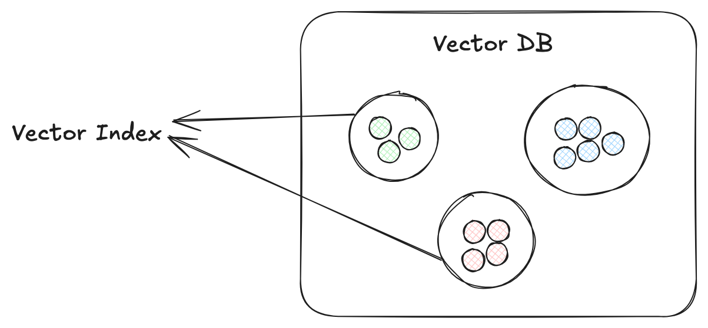

# Vector Indexes

This article takes you through the basics of implementing vector indexing in Python using LlamaIndex. But first, let's briefly introduce vector indexes, why they're so important, different common types, and popular use cases.

## Why you need vector indexes

Running AI applications depends on vectors, often called [embeddings](https://superlinked.com/vectorhub/building-blocks/vector-compute/embedding-models) - dense data representations, generated via complex mathematical operations to capture key attributes of source information. When a user submits a query, it's also embedded in the vector database, and vectors that are close to it are deemed relevant (i.e., similar), and returned. It's possible to brute-force query these vectors *without* a vector index - i.e., checking every single vector in the database to see if they match the query vector, one by one. But if the database is large, this inefficient process takes too long. 



Vector indexing, by creating groups of matching elements, speeds up similarity search - which calculate vector closeness using metrics like Euclidean or Jacobian distance. (In small datasets where accuracy is more important than efficiency, you can use K-Nearest Neighbors to pinpoint your query's closest near neighbors. As datasets get bigger and efficiency becomes an issue, an [Approximate Nearest Neighbor](https://superlinked.com/vectorhub/building-blocks/vector-search/nearest-neighbor-algorithms) (ANN) approach will *very quickly* return accurate-enough results.)

Vector indexes are crucial to efficient, relevant, and accurate search in various common applications, including Retrieval Augmented Generation ([RAG](https://superlinked.com/vectorhub/articles/advanced-retrieval-augmented-generation)), [semantic search in image databases](https://superlinked.com/vectorhub/articles/retrieval-from-image-text-modalities) (e.g., in smartphones), large text documents, advanced e-commerce websites, and so on.

But not all vector indexes are the same.

Let's take a look at some of the most commonly used types of vector indexing, and when it makes sense to use them. After that, we'll walk through how to index and query your data using flat indexing and a more efficient method - inverted file indexing (IVF).

## Types of indexing

### Flat indexing

Flat indexing is the most basic type of indexing - it stores vectors in the database as they are. No special operation is performed to modify or optimize them. Flat indexing is a brute-force approach: you generate similarity scores by comparing query vectors with every other vector in the database, but indexing enables you to do these computations in parallel, speeding up the process.

Flat indexing employs a very precise algorithm, returning perfectly accurate results as top k closest matches, but at a cost. Despite enabling parallel processing, flat indexing is computationally expensive and not ideal if your database consists of millions of records or more.

### Locality-Sensitive Hashing (LSH)

LSH uses a hashing function to compute a hash for each vector element, then groups vectors with similar hashes into buckets. The query vector is also hashed into a bucket with similar vectors thereby reducing the search space, and dramatically improving efficiency.

### Inverted File Index (IVF)

IVF, like LSH, groups data elements to improve vector search efficiency. But instead of hashing, IVF uses clustering techniques to prefilter data. Simpler IVF techniques may use K-means clustering to create cluster centroids. At query time, the query vector is compared to partition centroids to find the closest clusters, then vector search happens within those partitions. There are variations of IVF, each performing differently in terms of storage and retrieval efficiency. Let's take a look at a few: IVF_FLAT, IVF_PQ, and IVF_SQ.

**IVF_FLAT**

The flat variation clusters the vectors and creates centroids but stores each vector as it is with no additional processing. As a result, IVF_FLAT searches within clusters linearly (i.e., brute-force), providing good accuracy. But IVF_FLAT stores whole vectors and requires more memory, so it becomes slow with large datasets.

**IVF_PQ**

Inverted File Product Quantization (IVF_PQ) algorithm reduces storage requirements by:

1. dividing the vector space into centroid clusters
2. breaking each vector within the cluster into smaller chunks - e.g., a 12-dimensional vector can be broken into 3 chunks (sub-vectors), each with 4 dimensions
3. quantizing the chunks (4-dimensional sub-vectors) into bits, significantly reducing storage requirements

At query time, the same algorithm is applied to the query vector.

IVF_PQ saves on space, and, because we’re comparing smaller vectors, improves vector search times. Some accuracy is lost.

**IVF_SQ**

Inverted File Scalar Quantization uses a simpler algorithm than IVF_PQ.

1. divide the dataset, clustering the data points into smaller manageable chunks ("inverted lists")
2. create bins: for each vector dimension, determine minimum (start values) and maximum values, calculate step sizes ( = (max - min) / # bins)
3. convert floating-point vectors into scalar integer vectors by dividing each vector dimension into bins
4. assign each quantized vector to nearest chunk (inverted list)

Suppose we have a vector, x=[1.2,3.5,−0.7,2.1]. It has 4 dimensions, so we'll define 4 quantization bins:

* Bin 0: [−1.0,0.0)
* Bin 1: [0.0,1.0)
* Bin 2: [1.0,2.0)
* Bin 3: [2.0,4.0)

Each vector element will be distributed into a bin as follows:

* x1=1.2, falls into Bin 2 [1.0,2.0), and quantizes to 2
* x2=3.5, falls into Bin 3 [2.0,4.0), and quantizes to 3
* x3=−0.7, falls into Bin 0 [−1.0,0.0), and quantizes to 0
* x4=2.1, falls into Bin 3 [2.0,4.0), and quantizes to 3

The final quantized vector becomes [2,3,0,3].

IVF_SQ makes sense when dealing with medium to large datasets where memory efficiency is important.

### DiskANN

Most ANN algorithms - including those above - are designed for in-memory computation. But when you're dealing with *big data*, in-memory computation can be a bottleneck. Disk-based ANN ([DiskANN](https://suhasjs.github.io/files/diskann_neurips19.pdf)) is built to leverage Solid-State Drives' (SSDs') large memory and high-speed capabilities. DiskANN indexes vectors using the Vamana algorithm, a graph-based indexing structure that minimizes the number of sequential disk reads required during, by creating a graph with a smaller search "diameter" - the max distance between any two nodes (representing vectors), measured as the least number of hops (edges) to get from one to the other. This makes the search process more efficient, especially for the kind of large-scale datasets that are stored on SSDs.

By using a SSD to store and search its graph index, DiskANN can be cost-effective, scalable, and efficient.

### SPTAG-based Approximate Nearest Neighbor Search (SPANN)

[SPANN](https://openreview.net/forum?id=-1rrzmJCp4), by taking a hybrid indexing approach that leverages both in-memory and disk-based storage, can handle even larger datasets than DiskANN with high accuracy and low latency. SPANN stores centroid points of posting lists in memory, and stores the posting lists (corresponding to clusters of similar vectors) themselves in the disk. This enables SPANN to very quickly - without accessing the disk - identify which clusters are relevant to a query.

To mitigate potential bottlenecks in disk read-write operations, SPANN builds its indexes using a hierarchical balanced clustering algorithm that ensures that posting lists are roughly the same length (no single post is so large or small that it diminishes disk-access efficiency), and augments the posting list by including a cluster's edge (i.e., potentially relevant) data points inside that cluster.

SPANN also employs dynamic pruning in the search process to reduce accessing of unnecessary posting lists - first identifying top k closest clusters based on distance between the centroids and the query, then calculating a relevance score (to the query) of corresponding posting lists, and retrieving only the most relevant data points.

Taking this hybrid approach, in addition to scaling horizontally (by adding more machines), SPANN can achieve high performance levels while handling much larger datasets than DiskANN.

### Hierarchical Navigable Small Worlds (HNSW)

HNSW, a complex but popular, efficient vector indexing technique, builds layers of hierarchical proximity graphs structure like skip-lists, the lowest level with the highest granularity (every vector is a vertex), enabling precise, accurate navigation across short-range connections, and each higher layer vertex grouping (and connecting to) more and more lower level data points together (representing longer and longer connections between vertices). HNSW queries are rapidly ANN-matched to closest vectors in the highest layer, then again with slightly more accuracy in the next layer, and so on until search results are surfaced with the greatest accuracy from the lowest layer.

Here's a table summarizing these common vector indexing approaches in terms of speed, accuracy, database size, and memory usage.

| Indexing Method | Speed&nbsp;&nbsp;&nbsp;&nbsp;&nbsp;&nbsp;&nbsp;&nbsp;&nbsp;&nbsp;&nbsp;&nbsp;&nbsp;&nbsp;&nbsp;&nbsp;&nbsp;&nbsp;&nbsp;&nbsp;&nbsp;&nbsp;&nbsp;&nbsp;&nbsp;&nbsp;&nbsp;&nbsp;&nbsp;&nbsp;&nbsp;&nbsp;&nbsp;&nbsp;&nbsp;&nbsp;&nbsp; | Accuracy&nbsp;&nbsp;&nbsp;&nbsp;&nbsp;&nbsp;&nbsp;&nbsp;&nbsp;&nbsp;&nbsp;&nbsp;&nbsp;&nbsp;&nbsp;&nbsp;&nbsp;&nbsp;&nbsp;&nbsp;&nbsp;&nbsp;&nbsp;&nbsp;&nbsp;&nbsp;&nbsp; | Database Size | Memory Usage&nbsp;&nbsp;&nbsp;&nbsp;&nbsp;&nbsp;&nbsp;&nbsp;&nbsp;&nbsp;&nbsp;&nbsp;&nbsp;&nbsp;&nbsp;&nbsp;&nbsp;&nbsp;&nbsp;&nbsp;&nbsp;&nbsp;&nbsp;&nbsp;&nbsp;&nbsp;&nbsp; |
| :--- | :--- | :--- | :--- | :--- |
| Flat | slow : query compared with each element | high : exact matches | small to medium | high : vectors stored as is in memory |
| LSH | fast : hashing queries into buckets for quicker retrieval | moderate : approximate matches | large | low : stores hashes instead of vectors |
| IVF_FLAT | moderate : queries only relevant clusters, but varies with cluster size | high : performs exact matches in the cluster | small to medium | high : vectors stored as is in memory |
| IVF_PQ | fast : clustering and compressing vectors into quantized codes for efficient retrieval | moderate : dependent on the quantization level | large | low : compressed representation |
| IVF_SQ | fast : clustering and compressing vectors into quantized codes for efficient retrieval | moderate : approximate matches in quantized space | large | low : compressed representation |
| DiskANN | fast : uses high-speed SSDs and a special Graph Data Structure | high (95% reported in original paper) | very large | moderate : storing graphs on disk |
| SPANN | fast : uses disk-memory hybrid structure | high (90% reported in original paper) | very large | moderate : uses a memory-disk hybrid structure |
| HNSW | fast : hierarchical graph structure | moderate : progressive refinement of approximate results, improved with parameter optimization | large | moderate : graph structure in memory |

## Basic Implementation of Vector Indexing using ANN

Now that we've laid out a basic understanding of common vector indexing approaches, let's see how vector storage and retrieval using ANN works in practice by walking through a basic implementation. First, we'll set up flat indexing (brute force), and then use clustering to optimize Inverted File indexing, reducing retrieval time.

### Flat Indexing

First we simply import basic Pandas and Numpy libraries.

```python
import numpy as np
import pandas as pd
```

**Creating Data Vectors**

Next, we generate random dummy vectors as data points to run our algorithm on. Our data points above could represent text, images, or any other encoded data form.

```python
# Generate 10 random 3D vectors
random_vectors = np.random.rand(10, 3)

# Print the random 3D vectors
for i, vector in enumerate(random_vectors):
    print(f"Vector {i+1}: {vector}")
```

```bash
Vector 1: [0.80981775 0.1963886  0.02965684]
Vector 2: [0.56029493 0.62403894 0.56696611]
Vector 3: [0.47052236 0.1559688  0.87332513]
Vector 4: [0.80995196 0.00508334 0.10529516]
Vector 5: [0.55410133 0.96722797 0.96957061]
Vector 6: [0.20098567 0.0527692  0.65003235]
Vector 7: [0.34715575 0.41244063 0.72056698]
Vector 8: [0.30936325 0.47881762 0.75795186]
Vector 9: [0.67403853 0.23895253 0.87895722]
Vector 10: [0.8207672  0.21424442 0.20621931]
```

**Distance Calculation**

Now we need a function to calculate the distance between our different vectors. We'll use Euclidean Distance to approximate it.

```python
def calculate_euclidean_distance(point1, point2):

    # calculate the euclidean distance between the provided points
    return np.sqrt(sum((point1 - point2)**2))
```

**Vector Querying**

At this point, we have everything in place to query the data store. We'll retrieve the top-k closest matches for a test data point. Our algorithm will:

1. generate a random test point
2. calculate distances between the test point and all vectors in the data store
3. retrieve the top k vectors closest to the test point

Our index is created in steps 2 and 3 (above).

```python
# generate a random test vector
test_point = np.random.rand(1, 3)[0]
print("Test Vector:", test_point)
```

Here's our random test point:

```plaintext
Test Vector: [0.98897054 0.03674464 0.59036213]
```

The following loop calculates the Euclidean distance between our `test_point` and each vector in `random_vectors`.

```python
distances = []

# calculate the distance from each point in our database
for i, vector in enumerate(random_vectors):
    d = calculate_euclidean_distance(test_point, vector)
    distances.append((i,d))
```

```bash
print("Distances: ")
for val in distances:
    print(f"Vector {val[0]+1}: {val[1]}")
```

```bash
Distances: 
Vector 1: 0.9624227010223827
Vector 2: 0.47065580576204386
Vector 3: 0.18677305533181324
Vector 4: 0.9402397257996893
Vector 5: 0.6393489353421491
Vector 6: 0.49525570368173166
Vector 7: 0.27160367994034773
Vector 8: 0.2958891670880358
Vector 9: 0.20437726721718957
Vector 10: 0.801081734496685
```

We can see that vectors 3, 9, and 7 (above) are the top three closest matches. Let's write a function to retrieve these matches automatically:

```python
# get top k vectors
def get_top_k(random_vectors, distances, k):

    # sort the distances in ascending order
    sorted_distance = sorted(distances, key=lambda distances: distances[1])
    # retrieve the top k smallest distance indexes
    top_k = sorted_distance[:k]

    # top matches
    top_matches = []
    for idx in top_k:
        # Get the first element of the tuple as the index
        idx_to_get = idx[0]  
        top_matches.append(random_vectors[idx_to_get])

    return top_matches
```

```python
# Retrieve the top 3 matches
top_matching_vectors = get_top_k(random_vectors, distances, 3)
top_matching_vectors
```

Here are our results:

```bash
[array([0.47052236, 0.1559688 , 0.87332513]),
 array([0.67403853, 0.23895253, 0.87895722]),
 array([0.34715575, 0.41244063, 0.72056698])]
```

That's flat indexing in a similarity search. 
But can we improve the efficiency of our process with a different kind of indexing?

### IVF

We can improve search efficiency - reduce the search space at runtime - if we cluster our vector data points using a K-means algorithm. Let's go through this step by step.

First, we import SkLearn's Kmeans implementation.

```python
from sklearn.cluster import KMeans
```

We'll also increase the data store size to 100 random vectors - to see how our algorithm performs on more datapoints.

```python
# generate large number of data points
data_points  = np.random.rand(100, 3)
```

**K-means Implementation**

Now, we initialize the KMeans algorithm.

```python
kmeans = KMeans(init="k-means++",n_clusters=3,n_init=10,max_iter=300,random_state=42)
```

Note that it's better (and common) to use a heuristic algorithm (e.g., the elbow method) to determine optimal clusters. To keep things simple, we'll just use our initialized method to separate the data into 3 clusters. Clustering *can* increase time complexity for large databases. But it's a one-time operation, and will improve query times later.

```python
# Fit k-means on our data points
kmeans.fit(data_points)
```

We've fitted the k-means algorithm to our data points. Next, we'll store the cluster centroids and label each data point according to its assigned cluster.

```python
# store centroids and data point associations
centroids = {}
for i, c in enumerate(kmeans.cluster_centers_):
    centroids[i] = c

data_point_clusters = {i:[] for i in np.unique(kmeans.labels_)}
for i, l in enumerate(kmeans.labels_):
    data_point_clusters[l].append(data_points[i])
```

Let's display our output.

```python
centroids
```

```bash
{0: array([0.41329647, 0.21550016, 0.76765634]),
 1: array([0.77927426, 0.49457407, 0.36967834]),
 2: array([0.23936467, 0.73028761, 0.3946528 ])}
```

**Vector Querying**

It's time to query a test vector. Our algorithm will:

1. generate a random test point
2. calculate which cluster's centroid is closest to the test point
3. calculate Euclidean distances between the test point all vectors in the closest cluster only
4. retrieve the closest vectors

```python
# Generate a test point
test_point = np.random.rand(1, 3)[0]
test_point
```

```bash
array([0.19125138, 0.01180168, 0.65204789])
```

Next, we implement a function that calculates the closest matching cluster, and another that retrieves the Top-k matching vectors:

```python
def get_closest_centroid(test_point, centroids):
    '''
    Return the centroid label closest to the test point
    '''

    distances = {}
    for cent_label, cent in centroids.items():
        # using the same function defined in earlier implementation
        distances[cent_label] = calculate_euclidean_distance(test_point, cent)
    
    # get minimum label
    min_key = min(distances, key=distances.get)

    return min_key
```

```python
def get_top_k_from_matching_cluster(data_point_clusters, closest_cluster, test_point, k = 3):
    '''
    Function to calculate nearest neighbors for test point but only in the selected cluster
    '''

    dist_for_cluster = []

    # calculate the distance from each point in our database
    for i, vector in enumerate(data_point_clusters[closest_cluster]):
        d = calculate_euclidean_distance(test_point, vector)
        dist_for_cluster.append((i,d))

    # sort the distances in ascending order
    sorted_distance = sorted(dist_for_cluster, key=lambda dist_for_cluster: dist_for_cluster[1])
    # retrieve the top k smallest distance indexes
    top_k = sorted_distance[:k]

    # top matches
    top_matches = []
    for idx in top_k:
        # Get the first element of the tuple as the index
        idx_to_get = idx[0]  
        top_matches.append(data_point_clusters[closest_cluster][idx_to_get])

    return top_matches
```

Now, we just need to pass our test point to the `get_closest_centroid` and `get_top_k_from_matching_cluster` functions defined above.

```python
# get the closest cluster
closest_cluster = get_closest_centroid(test_point, centroids)

# get the top k vector from the closest cluster
matches = get_top_k_from_matching_cluster(data_point_clusters, closest_cluster, test_point, k = 3)

print("Test Point: ", test_point)
print("Closest Matches: ", matches)
```

```bash
Test Point:  [0.19125138 0.01180168 0.65204789]
Closest Matches:  [array([0.1338926 , 0.04131207, 0.66420534]), array([0.09719324, 0.01207222, 0.80169845]), array([0.30091393, 0.14300888, 0.82777153])]
```

 Whereas our flat indexing algorithm had to perform 100 computations (the size of the database) to run a query, the IVF algorithm only queries the matching cluster space, significantly reducing the search complexity.

## Conclusion

Our walkthrough of two vector indexing techniques illustrates how indexing optimizes retrieval, and dramatically improves efficiency of ANN (Approximate Nearest Neighbor search), powering AI applications like RAG, large database semantic search, and e-commerce. Moreover, indexing techniques (like inverted file indexing (IVF), DiskANN, and SPANN) can handle larger datasets by employing clustering algorithms to group similar information, reducing the search space, and improving search efficiency over flat indexing, while achieving high accuracy and recall.

## Contributors

- [Haziqa Sajid, author](https://www.linkedin.com/in/haziqa-sajid-22b53245/)
- [Mór Kapronczay, editor](https://www.linkedin.com/in/m%C3%B3r-kapronczay-49447692/)
- [Robert Turner, editor](https://www.linkedin.com/in/robertdhayanturner/)
