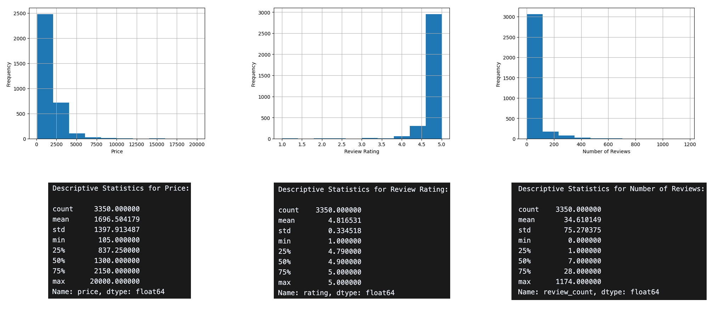
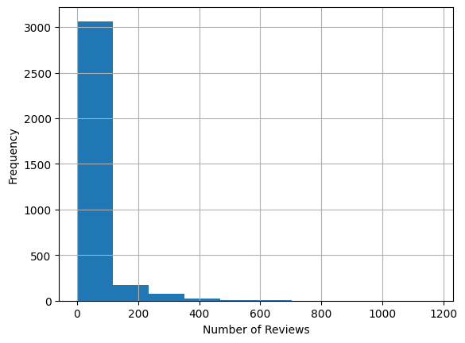
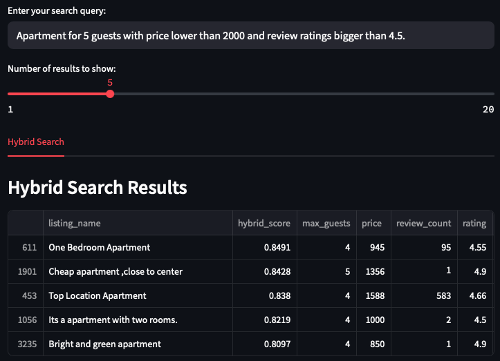

# Airbnb Search Benchmarking - Comparison of retrieval techniques

## Introduction & Motivation

Imagine you are searching for the ideal Airbnb for a weekend getaway. You open the website and adjust sliders and checkboxes but still encounter lists of options that nearly match your need but never are never truly what you are looking for. Although it is straightforward to specify a filter such as: "price less than two hundred dollars", rigid tags and thresholds for more complex search queries, make it a much more difficult task to figure out what the user is looking for.

Converting a mental image of a luxury apartment near the city's finest cafés or an affordable business-ready suite with good reviews into numerical filters often proves frustrating. Natural language is inherently unstructured and must be transformed into numerical representations to uncover user intent. At the same time, the rich structured data associated with each listing must also be encoded numerically to reveal relationships between location, comfort, price, and reviews.

Motivated by this challenge of bridging unstructured user intent with structured listing attributes, in this article, we evaluate a range of retrieval techniques from classic keyword-matching approaches through vector search, hybrid, multi-vector strategies, and ultimately Superlinked's semantic engine using a mixture of encoders.

While traditional search systems often treat structured data (like price, and rating) as simple filters and unstructured data (like descriptions) as separate search indices, our benchmark reveals how modern approaches can understand the semantic relationships between all attribute types. By comparing various methodologies on the same Airbnb dataset, we quantify the advantages of integrated approaches like Superlinked's mixture of encoders, which can understand that 'affordable with good reviews' represents both a price range and quality expectation rather than just matching keywords. This benchmark provides actionable insights for developers looking to implement more intuitive search experiences across domains with mixed data types.

## Data Exploration: Stockholm Airbnb Listings

For our search methodology benchmark, we use a publicly available dataset containing Airbnb listings in Stockholm, sourced from [Inside Airbnb](http://insideairbnb.com/). This dataset provides rich, structured information about rental properties, making it ideal for testing multi-attribute semantic search capabilities.

### Dataset Overview

The dataset contains information about 3,350 Stockholm Airbnb listings, including property details, pricing, location data, accommodation type, ratings, descriptions, and amenities. As shown in Figure 1, each listing contains multiple attribute types such as text fields (listing_name, description), numerical fields (price, rating), categorical fields (accommodation_type), and structured lists (amenities).


<figcaption>Figure 1: Stockholm Airbnb listing sample</figcaption>

### Distribution Analysis and Search Implications

The figures below illustrate the distribution of key listing attributes in our dataset. Looking at the visualizations, we can observe patterns in price ranges, review counts, and rating scores across Stockholm Airbnb properties. These distributions help us understand the landscape of available accommodations and provide context for the search queries we will test with different retrieval methods.



<!-- <div style="display: flex; justify-content: space-between;">
 
 
 
</div>

<div style="display: flex; justify-content: space-between;">
 
 
 
</div> -->

### Text Representation for Search

To create a comprehensive representation for search algorithms, we combine multiple listing attributes into a single text document. Each document includes the listing name, accommodation type, description, guest capacity, price, rating, review count, and available amenities concatenated into a structured format.

```python
def create_text_description(row):
   """Create a unified text description from listing attributes."""
   text = f"{row['listing_name']} is a {row['accommodation_type']} "
   text += f"For {row['max_guests']} guests. "
   text += f"It costs ${row['price']} per night with a rating of {row['rating']} with {row['review_count']} nymber of reviews. "
   text += f"Description: {row['description']} "
   text += f"Amenities include: {', '.join(row['amenities_list'])}"
   return text

# Apply to dataframe
df['document'] = df.apply(create_text_description, axis=1)
```

## Keyword Search (BM25)

One of the most straightforward ways to perform search is using keyword matching. BM25 (Best Matching 25) is one implementation of keyword (aka sparse vector) search where we match search terms from the query and documents. This algorithm estimates the relevance of documents to a given search query.

<figure style="text-align: center; margin: 20px 0;">
  
  <figcaption>Figure 2: BM25 search approach workflow</figcaption>
</figure>

As illustrated in Figure 2, BM25 first tokenizes both documents and queries into individual terms, then calculates relevance scores. It represents documents as sparse vectors where each dimension corresponds to a term in the vocabulary, with most values being zero. It counts term occurrences while preventing repetition dominance, assigns higher importance to rare terms across the collection. For instance, given a query like "cozy apartment in central Stockholm", BM25 looks for listings containing these terms, giving higher weight to distinctive words like "cozy" and "Stockholm" than to common terms like "in" or "apartment". The documents are then ranked by their relevance scores, and the top-k results are returned to the user.

Here is how we can implement BM25 in Python:

```python
from rank_bm25 import BM25Okapi
import pandas as pd

class BM25Search:
   def __init__(self, df: pd.DataFrame):
       self.df = df
       self.corpus = df['text_description'].tolist()
       self.tokenized_corpus = [doc.lower().split() for doc in self.corpus]
       self.bm25 = BM25Okapi(self.tokenized_corpus)

   def search(self, query: str, top_k: int = 10):
       """Perform BM25 search on the corpus."""
       tokenized_query = query.lower().split()
       bm25_scores = self.bm25.get_scores(tokenized_query)

       results = self.df.copy()
       results['bm25_score'] = bm25_scores
       results = results.sort_values('bm25_score', ascending=False).head(top_k)

       return results
```

### BM25 Search Results

To evaluate BM25's performance, we tested it with two different types of queries. Figure 3 shows results for a subjective query ("affordable place with good reviews"), while Figure 4 demonstrates a query with specific numerical constraints ("Apartment with price lower than 2000 for 5 guests with review rating bigger than 4.5").

<div style="display: flex; flex-wrap: wrap; justify-content: space-between; margin: 20px 0;">
  <div style="flex: 0 0 48%;">
    
    <p style="text-align: center;">Figure 3: BM25 results for "affordable place with good reviews" query</p>
  </div>
  <div style="flex: 0 0 48%;">
    
    <p style="text-align: center;">Figure 4: BM25 results for numerical constraints</p>
  </div>
</div>

The results reveal significant limitations in BM25's search capabilities. Despite being computationally efficient, BM25 struggles with both semantic understanding and numerical constraints. In the second query example, only one listing (#1330) matches all the specified criteria. This weakness originates from BM25's token-matching approach, which cannot interpret phrases like "lower than 2000" or "bigger than 4.5" as numerical comparisons.

More fundamentally, BM25 lacks semantic understanding of concepts. If you search for “affordable place with good reviews,” BM25 will pick up the words “place” and “reviews,” but it cannot understand what “affordable” or “good” really mean in terms of price or rating. The quality of results also depends heavily on how listings are described and tokenized in our corpus.

These limitations highlight why more advanced search methods are needed for complex, natural language queries that include both conceptual understanding and numerical constraints.

## Vector Search (Embedding-Based)

Since BM25's keyword matching approach showed significant limitations, we needed a more sophisticated method to handle complex natural language queries. Vector search addresses these limitations by converting queries and documents (listings) into dense numerical representations (embeddings) that capture semantic meaning rather than just matching keywords. This approach allows the search system to understand context, synonyms, and conceptual relationships between words, enabling more intuitive and accurate retrieval results. In vector search, both document items (Airbnb listings in our case) and user queries are transformed into high-dimensional (dense) numerical vectors using embedding models. These embeddings capture the semantic meaning of text, allowing the system to find matches based on conceptual similarity rather than exact word matches. The search process uses nearest neighbor algorithms to identify listings whose vector representations are closest to the query vector in the embedding space.

<figure style="text-align: center; margin: 20px 0;">
  
  <figcaption>Figure 5: Vector search approach workflow</figcaption>
</figure>

For our Airbnb search implementation, we leveraged FAISS (Facebook AI Similarity Search), an efficient open-source library for similarity search of dense vectors. FAISS uses advanced indexing strategies to organize vectors for fast retrieval while maintaining search accuracy. We paired it with sentence-transformers to create high-quality semantic embeddings that capture the meaning of our listing descriptions.

Here's how we implemented vector search:

```python
from sentence_transformers import SentenceTransformer
import faiss
import numpy as np
import pandas as pd

class VectorSearch:
   def __init__(self, df: pd.DataFrame, model_name: str = 'all-MiniLM-L12-v2'):
       self.df = df
       self.model = SentenceTransformer(model_name)
       # Create embeddings for all listings
       self.embeddings = self.model.encode(
           self.df['text_description'].tolist(),
           normalize_embeddings=True
       ).astype(np.float32)
       # Build FAISS index
       self.index = self._create_faiss_index()

   def _create_faiss_index(self):
       """Create FAISS index for fast similarity search."""
       vector_dimension = self.embeddings.shape[1]
       index = faiss.IndexFlatIP(vector_dimension)  # Inner product for cosine similarity
       index.add(self.embeddings)
       return index

   def search(self, query: str, top_k: int = 10):
       """Perform vector search on the listings."""
       # Convert query to embedding
       query_embedding = self.model.encode(
           [query],
           normalize_embeddings=True
       ).astype(np.float32)

       # Search the index
       scores, indices = self.index.search(query_embedding, top_k)

       # Return results with similarity scores
       results = self.df.iloc[indices[0]].copy()
       results['vector_score'] = scores[0]

       return results
```

### Vector Search Results Analysis

To evaluate the performance of our vector search implementation, we tested it with the same queries used for BM25. Figures 6 and 7 show the results for both the subjective query and the query with numerical constraints.

<div style="display: flex; flex-wrap: wrap; justify-content: space-between; margin: 20px 0;">
  <div style="flex: 0 0 48%; margin-bottom: 20px;">
    
    <p style="text-align: center;">Figure 6: Vector search results for "luxury places with good reviews"</p>
  </div>
  <div style="flex: 0 0 48%; margin-bottom: 20px;">
    
    <p style="text-align: center;">Figure 7: Vector search results for "affordable place with good reviews"</p>
  </div>
</div>

The vector search results demonstrate both strengths and limitations compared to BM25. For subjective queries, vector search shows a remarkable ability to understand semantic concepts. In Figure 6, the query for "luxury places with good reviews" returns listings that directly match this intent. The top result literally contains "Luxury Living" in its name, with other results featuring "beautiful," "fully equipped," and "great location" in its description. All results have excellent ratings (4.67-5.0), although some have very few reviews (one potential weakness).

Similarly, for the "affordable place with good reviews" query in Figure 9, vector search returns reasonably priced listings (most under 1000) with good ratings. Notably, it finds one listing (#744) with 140 reviews and a 4.97 rating, but its rank is lower than the other listing with less reviews and lower score (#765) although the prices are very close.

<figure style="text-align: center; margin: 20px 0;">
 
 <figcaption>Figure 8: Vector search results for numerical constraint query</figcaption>
</figure>

However, while vector search finds more potentially relevant listings than BM25 for the numerical constraint query, it still struggles with precise numerical understanding. Only one result (#1901) perfectly matches the "5 guests" requirement; several have 4 guests capacity instead. This limitation stems from how embedding models represent numbers. They capture some numerical relationships but lack the precision of explicit comparisons. The model understands the general concept of "apartment with good rating and reasonable price," but cannot reliably enforce specific thresholds like "lower than 2000" or "bigger than 4.5."

These results highlight vector search's impressive semantic understanding for conceptual queries about quality, luxury, and affordability, but also reveal its limitations when precise numerical constraints are critical. The embedding model understands the general concept of "apartment with good rating and reasonable price," but cannot reliably enforce specific thresholds like "lower than 2000" or "for 5 guests" with the same precision that explicit filtering would provide.

This analysis suggests that while vector search significantly improves semantic understanding over keyword-based approaches, an ideal system would combine this semantic power with more precise handling of numerical constraints.

## Hybrid Search (Combined Approach)

Another powerful approach in information retrieval is hybrid search. Hybrid search combines the strengths of keyword-based methods (like BM25) with semantic vector search to deliver more comprehensive and accurate results. The fundamental rationale behind hybrid search is simple. BM25 is excellent at precise keyword matching but lacks semantic understanding, while vector search captures meaning but might miss exact matches or struggle with numerical constraints. By integrating these two approaches, we create a system that understands what users are searching for (the exact words) and what they mean (the semantic intent).

Usually, a reranker is used to combine and rank the results from keyword and vector searches. A reranker is responsible for merging the separate result lists into a single coherent ranking that preserves the strengths of each approach. There are different types of rerankers such as fusion algorithms (like Reciprocal Rank Fusion), linear combinations of scores, or more sophisticated machine learning-based rerankers.

<figure style="text-align: center; margin: 20px 0;">
 
 <figcaption>Figure 9: Hybrid search architecture combining vector and keyword search</figcaption>
</figure>

Here is our implementation of hybrid search using a linear combination approach:

```python
import numpy as np
import pandas as pd

class HybridSearch:
   def __init__(self, df: pd.DataFrame, model_name: str = 'all-MiniLM-L12-v2'):
       self.df = df
       self.bm25_search = BM25Search(df)
       self.vector_search = VectorSearch(df, model_name)

   def search(self, query: str, alpha: float = 0.4, top_k: int = 10):
       """Perform hybrid search combining BM25 and vector search."""
       # Get results from both search methods
       bm25_results = self.bm25_search.search(query, top_k=len(self.df))
       vector_results = self.vector_search.search(query, top_k=len(self.df))

       # Normalize scores to [0,1] range
       bm25_scores = bm25_results['bm25_score'].values
       bm25_scores_norm = (bm25_scores - np.min(bm25_scores)) / (np.max(bm25_scores) - np.min(bm25_scores))

       vector_scores = vector_results['vector_score'].values
       vector_scores_norm = (vector_scores - np.min(vector_scores)) / (np.max(vector_scores) - np.min(vector_scores))

       # Combine scores using linear combination
       hybrid_scores = alpha * bm25_scores_norm + (1 - alpha) * vector_scores_norm

       # Add hybrid scores and rank results
       results = self.df.copy()
       results['hybrid_score'] = hybrid_scores
       results = results.sort_values('hybrid_score', ascending=False).head(top_k)

       return results
```

For reranking, we used a linear combination approach controlled by the parameter alpha, which determines the weight given to each search method. When alpha is 0, we rely entirely on vector search results; when alpha is 1, we use only BM25 results. Our default value of 0.4 gives slightly more weight to the semantic understanding of vector search while still valuing the precision of keyword matching.

### Hybrid Search Results Analysis

If neither of the two approaches produces satisfactory results on structured data individually, it is unlikely that combining them will produce the desired outcome. However, we applied the hybrid search on the same three queries and observed some interesting patterns. As shown in Figure 10, for the "luxury places with good reviews" query, hybrid search effectively prioritizes listings that contain explicit luxury indicators in their titles while also having strong rating metrics. The top results include "Luxury Living" and "Luxury apartment" with perfect 5.0 ratings.

<figure style="text-align: center; margin: 20px 0;">
 
 <figcaption>Figure 10: Hybrid search results for "luxury places with good reviews"</figcaption>
</figure>

The results indicate that hybrid search effectively balances semantic understanding with keyword precision. By combining vector search's ability to grasp concepts like "luxury" with BM25's strength in finding exact term matches, the hybrid approach delivers more comprehensive results. However, the fundamental limitations remain: the system still cannot reliably interpret numerical constraints (Figure 11) or make sophisticated judgments about what constitutes "good reviews" in terms of both rating quality and quantity. Additionaly, finding the optimal alpha value for the weighted combination requires careful tuning and may need adjustment based on specific use cases or datasets. Implementing hybrid search also requires maintaining two separate index structures and ensuring proper score normalization and fusion. This suggests that while hybrid search improves upon its component approaches, we need a more advanced solution to truly understand structured data attributes and their relationships.

<figure style="text-align: center; margin: 20px 0;">
 
 <figcaption>Figure 11: Hybrid search results for numerical constraint query</figcaption>
</figure>

## Cross-Encoder Reranking: Enhancing Precision

While vector search offers strong semantic understanding, we can further enhance search quality by adding a reranking stage using cross-encoders. This approach represents an even more advanced search architecture that can address some of the limitations we have observed in previous methods.

<figure style="text-align: center; margin: 20px 0;">
 
 <figcaption>Figure 12: Cross-encoder reranking architecture</figcaption>
</figure>

Unlike bi-encoders (used in vector search) that encode queries and documents independently (no interaction), cross-encoders process query-document pairs simultaneously through a transformer-based model (full interaction). Cross-encoders take two pieces of text as input and apply classification to output a similarity score for these two texts. This strategy allows the model to pay attention to interactions between both texts, capturing complex relationships between queries and documents that might be missed when processing them separately. The result

```python
from sentence_transformers import CrossEncoder
import pandas as pd

class CrossEncoderSearch:
   def __init__(self, df, retriever_model_name='all-MiniLM-L12-v2',
                cross_encoder_model_name='cross-encoder/ms-marco-MiniLM-L-6-v2'):
       """Initialize the CrossEncoderSearch with specified models."""
       self.df = df
       self.cross_encoder = CrossEncoder(cross_encoder_model_name)

   def search(self, query, dense_search, top_k=10):
       """Perform cross-encoder search with reranking."""
       # First retrieval phase using vector search
       initial_results = dense_search.search(query, top_k=top_k*5)

       # Cross-encoder reranking phase
       descriptions = initial_results['text_description'].tolist()
       pairs = [(query, doc) for doc in descriptions]
       scores = self.cross_encoder.predict(pairs)

       # Add scores and rerank results
       reranked_results = initial_results.copy()
       reranked_results['cross_encoder_score'] = scores
       reranked_results = reranked_results.sort_values('cross_encoder_score', ascending=False).head(top_k)

       return reranked_results
```

### Cross-Encoder Reranking Results Analysis

The cross-encoder reranking results demonstrate a notable improvement in result quality compared to previous approaches. For the "luxury places" query, the cross-encoder seems to prioritize listings with "Luxury" in their titles and high ratings, showing semantic alignment with the query intent. For "affordable places," it effectively balances price considerations with review quality. However, the results of these two queries still overlap. The listing #744 appears in both the "luxury" and "affordable" sets. Since the semantic meanings of "luxury" and "affordable" are fundamentally different, this overlap fails to meet the user's expectations.

<div style="display: flex; flex-wrap: wrap; justify-content: space-between; margin: 20px 0;">
 <div style="flex: 0 0 100%; margin-bottom: 20px;">
   
   <p style= "text-align: center;">Figure 13: Cross-encoder results for "luxury places with good reviews" </p>
 </div>
 <div style= "flex: 0 0 48%;">
   
   <p style= "text-align: center;">Figure 14: Cross-encoder results for "affordable place with good reviews" </p>
 </div>
</div>

Most impressively, for the numerical constraints query, the cross-encoder makes progress in understanding specific requirements. Despite the first result exceeding the price constraint (2632 > 2000), the reranking correctly identifies more listings matching the "5 guests" requirement and prioritizes them appropriately. This shows the effectiveness of using cross-encoders, since they re-calculate the similarity between the query and the documents after the initial retrieval based on vector search. In other words, the model can make finer distinctions when examining query-document pairs together rather than separately. However, the cross-encoder still does not perfectly understand all numerical constraints. Additionally, despite the improvements, cross-encoder reranking has significant computational drawbacks. It requires evaluating each query-document pair individually through a transformer-based model, which increases latency and resource requirements. Especially as the candidate pool grows, making the search challenging to scale for large datasets or real-time applications with strict performance requirements. These takeaways suggest that while this approach represents a significant improvement, a more structured approach to handling multi-attribute data could yield better results.

<figure style="text-align: center; margin: 20px 0;">
 
 <figcaption>Figure 15: Cross-encoder results for numerical constraints query</figcaption>
</figure>

## Why Single-Vector Representations Fall Short

While dense vector search methods significantly outperform keyword-based approaches like BM25 in understanding semantic intent, they come with a fundamental limitation: compressing all aspects of a listing into a single, fixed-length vector. This simplification can hinder their ability to fully capture the multifaceted nature of structured data.

To better understand this limitation, we visualized the embedding space using t-SNE. We generated embeddings for all listings in the dataset and highlighted the top-k results retrieved by each method for the query "apartment for 5 guests with price lower than 2000 and review rating bigger than 4.5."

<figure style="text-align: center; margin: 20px 0;">  <figcaption>Figure 16: 2D projection of listing and query embeddings retrieved by various methods</figcaption> </figure>

As shown in Figure 16, the retrieved listings from different methods cluster tightly around the query embedding in the low-dimensional space. This visualization highlights the key issue. The issue is when all information (e.g., textual, numerical, categorical) is encoded into a single vector, many listings appear semantically close to the query, even if they fail to satisfy specific constraints like guest capacity or price. These compressed representations blur important distinctions, leading to retrieval errors that a user would find unsatisfactory. This trade-off between semantic richness and structural precision suggests that we need a more expressive retrieval framework.

## Multi-Vector Search: ColBERT

To address these challenges, we turn to multi-vector search methods and specifically, the [ColBERT](https://github.com/stanford-futuredata/ColBERT) architecture (Contextualized Late Interaction over BERT). ColBERT is built on the idea of late interaction. Instead of embedding an entire document (such as an Airbnb listing) into a single vector, ColBERT represents each token as a separate vector. This allows for fine-grained matching between the query tokens and the token-level vectors of each document during retrieval. Unlike traditional bi-encoder architectures that rely on pre-computed summary vectors, ColBERT dynamically compares different parts of the query with specific document components.

During offline indexing, each listing is passed through a BERT model to produce multiple contextual embeddings (one for each token). These token-level vectors are stored in an indexable format, allowing for efficient retrieval. Then, during query-time, the user query is similarly tokenized and encoded into contextual vectors. Instead of computing a single similarity score between two full-document vectors (query, and document vectors), ColBERT evaluates the maximum similarity between each query token and all document token vectors. These maximum similarity scores are then aggregated to produce a final relevance score for each document.

<figure style="text-align: center; margin: 20px 0;">
 
 <figcaption>Figure 17: Colbert Multi-Vector Retrieval</figcaption>
</figure>

Here is how we implment the multi-vecotr search by ColBERT:

```python
class ColBERTSearch:
    def __init__(self, df: pd.DataFrame, nbits: int = 2, doc_maxlen: int = 400,
                 checkpoint: str = 'colbert-ir/colbertv2.0', max_listings: int = 10000):
        """Initialize the ColBERT search with the provided dataframe and parameters."""
        self.df = df
        self.nbits = nbits
        self.doc_maxlen = doc_maxlen
        self.checkpoint = checkpoint
        self.max_listings = max_listings
        self.index_name = f'airbnb_index_{nbits}'

        # Extract text descriptions for the collection
        self.collection = [x['text_description'] for x in df.to_dict(orient='records')]

        # Create mapping from text descriptions to dataframe indices
        self.text_to_df_map = {text: idx for idx, text in enumerate(df['text_description'])}

        # Build the index and initialize the searcher
        self._build_index()
        self._init_searcher()

    def _build_index(self):
        """Build the ColBERT index for the collection."""
        with Run().context(RunConfig(nranks=1, experiment='notebook')):
            config = ColBERTConfig(doc_maxlen=self.doc_maxlen, nbits=self.nbits, kmeans_niters=4)

            indexer = Indexer(checkpoint=self.checkpoint, config=config)
            indexer.index(name=self.index_name,
                          collection=self.collection[:self.max_listings],
                          overwrite=True)

    def _init_searcher(self):
        """Initialize the ColBERT searcher with the built index."""
        with Run().context(RunConfig(experiment='notebook')):
            self.searcher = Searcher(index=self.index_name, collection=self.collection)

    def search(self, query: str, top_k: int = 5):
        """Perform ColBERT search on the indexed collection."""
        print(f"#> {query}")

        # Get search results from ColBERT
        results = self.searcher.search(query, k=top_k)

        # Match results to original DataFrame records
        matched_records = []
        for passage_id, passage_rank, passage_score in zip(*results):
            text_desc = self.searcher.collection[passage_id]

            # Look up the corresponding DataFrame row
            if text_desc in self.text_to_df_map:
                idx = self.text_to_df_map[text_desc]
                record = self.df.iloc[idx].copy()
                record['colbert_rank'] = passage_rank
                record['colbert_score'] = passage_score
                matched_records.append(record)

        # Convert the matched records to a DataFrame
        colbert_results = pd.DataFrame(matched_records)
        return colbert_results
```

### ColBERT Results Analysis

When evaluated on the numerical constraints query "Apartment for 5 guests with price lower than 2000 and review rating bigger than 4.5", ColBERT outperforms the cross-encoder reranker in terms of constraint satisfaction. As seen in Figure 18, multiple listings correctly match the requirement for 5 guests, stay within the 2000 price threshold, and meet or exceed the rating constraint. This suggests that ColBERT's late interaction mechanism is more effective at capturing structured constraints, particularly when they are distributed across multiple fields. Additionally, in contrast to the cross-encoder approach, the search is much faster.

<figure style="text-align: center; margin: 20px 0;">
 
 <figcaption>Figure 18: Colbert results for numerical constraints query</figcaption>
</figure>

However, ColBERT's performance shows sensitivity to query phrasing. When we modify the query slightly to "Places with price lower than 2000 with review rating bigger than 4.5 for 5 guests", placing the guest capacity at the end, ColBERT retrieves listings that no longer meet the 5-guest requirement. This drop in alignment may be influenced by how listing documents are structured. In our case, the document begins with the listing name and includes the guest capacity early on. Because ColBERT compares query and document tokens in parallel and relies on maximum similarity aggregation, the relative position of information might affect the final scoring.

<figure style="text-align: center; margin: 20px 0;">
 
 <figcaption>Figure 19: ColBERT results for numerical constraints query</figcaption>
</figure>

For the query “luxury places with good reviews”, ColBERT appears to rely heavily on lexical signals. Many of the returned listings explicitly contain the word “luxury” in their titles. Additionally, there is a noticeable inconsistency in pricing. Some results are extremely expensive while others are comparatively moderate. This disparity raises an important question: does ColBERT truly understand the concept of “luxury,” or is it simply anchoring on the occurrence of the word embeddings in the query and document?

<figure style="text-align: center; margin: 20px 0;">
 
 <figcaption>Figure 20: ColBERT results for "luxury places with good reviews" query</figcaption>
</figure>

This behavior can be partly explained by ColBERT’s architectural design. ColBERT breaks the query into individual token embeddings and it performs a maximum similarity (MaxSim) match between each query token and the token embeddings of each document. While this mechanism allows ColBERT to capture fine-grained matches, it also means that a token like “luxury” can dominate the relevance score if matched strongly. As a result, listings that only mention “luxury” but do not exhibit the expected price or quality signals can still rank highly, creating the observed inconsistency.

For the query “affordable places with good reviews,” ColBERT returns mostly relevant results, with prices ranging from 500 to just over 1000 and ratings near or above 4.8. However, one listing priced at 3700 also appears among the top results, clearly violating the affordability expectation. Additionally, while most results have strong ratings, the final listing has a much lower rating (3.25), which weakens the consistency of the ranking.

<figure style="text-align: center; margin: 20px 0;">
 
 <figcaption>Figure 21: Colbert results for "affordable places with good reviews" query</figcaption>
</figure>

Although ColBERT demonstrates promising performance, especially in scenarios involving structured constraints and offers significantly faster retrieval compared to cross-encoders, it still falls short of fully understanding user intent in both numerical and semantic queries. A key reason lies in how the attributes of Airbnb listings are represented. These attributes come from diverse modalities such as numerical fields like price and guest capacity, categorical values, and free-text descriptions. However, in our current pipeline, all of these are flattened into plain text and encoded using general-purpose text embedding models. This one-size-fits-all strategy might limit the model's ability to reason about different types of data effectively.

For instance, embedding a number like 2000 using a language model trained primarily on text may lose its quantitative meaning, making it difficult for the model to enforce precise thresholds. Similarly, relying solely on lexical signals for abstract terms like "luxury" can cause the model to overfit to surface-level token matches. These limitations suggest that a more expressive and comprehensive approach is needed. The one that encodes each attribute using specialized embeddings tailored to its modality. In the next section, we explore how Superlinked's mixture of encoders architectures addresses this challenge on structured data.

## Mixture of Encoders Search: Superlinked

Superlinked introduces a novel mixture of encoder retrieval architecture, particularly designed to handle structured, multi-attribute data more effectively than traditional models. Unlike single-vector approaches that compress all information into one embedding, or late-interaction models like ColBERT that still rely on general-purpose text representations, Superlinked uses dedicated encoders for each attribute based on its data type. For example, textual descriptions are encoded using a text embedding, while numerical values like price or rating are embedded using models that preserve quantitative relationships. Categorical fields and timestamps are similarly handled by encoders tailored to their respective modalities.

<figure style="text-align: center; margin: 20px 0;">
 
 <figcaption>Figure 22: Superlinked architecture</figcaption>
</figure>

At query time, Superlinked uses a large language model to interpret the user’s intent and generate dynamic weights for each attribute. These weights determine the relative importance of each feature. For instance, a price attribute might be assigned a negative direction to indicate preference for lower values, while a rating might receive a positive direction to prioritize higher scores. The strength of each weight reflects how influential that attribute should be in the search ranking, and the system can balance trade-offs. For example, assigning price a weight of -1.0 and rating a weight of 1.0 gives them equal but opposing influence. This flexible weighting mechanism makes it possible to capture complex user intents, such as queries like “affordableplaces with lots of good reviews.”

To ensure that non-negotiable constraints are respected, Superlinked first applies hard filters to eliminate listings that do not meet specific criteria, such as guest capacity or maximum price. Only the listings that pass these filters are considered in the final ranking stage. The system then performs a weighted nearest neighbors search, comparing the multi-attribute embeddings of these candidates against the weighted query representation to rank them by overall relevance. This combination of modality-aware encoding, constraint filtering, and weighted ranking allows Superlinked to produce accurate, context-aware results that reflect both the structure of the underlying data and the nuanced preferences of the user.

Here is how we implment the Superlinked for our Airbnb search:

We first need to define a schema that captures the structure of our dataset. The schema outlines both the fields we'll use for embedding and those we'll use for filtering:

```python
from superlinked import framework as sl

class AirbnbSchema(sl.Schema):
    listing_id: sl.IdField
    # fields that we make the embeddings for
    price: sl.Float
    rating: sl.Float
    description: sl.String

    # fields that we use for filtering
    review_count: sl.Integer
    listing_name: sl.String
    accommodation_type: sl.String
    neighbourhood: sl.String
    max_guests: sl.Integer
    amenities: sl.StringList
    latitude: sl.Float
    longitude: sl.Float
    #last_review: sl.Timestamp #This can also be used for queries like "most recent..."


airbnb_schema = AirbnbSchema()
```

Next, we define dedicated embedding spaces for each key attribute. Each space uses an encoder tailored to the specific data type:

```python
# Text embedding space for descriptions
description_space = sl.TextSimilaritySpace(
    text=airbnb_schema.description, model="sentence-transformers/all-MiniLM-L12-v2"
)

# Numerical space for price with logarithmic scaling and maximum mode
price_space = sl.NumberSpace(
    airbnb_schema.price,
    min_value=0,
    max_value=500000.0,
    mode=sl.Mode.MAXIMUM,
    scale=sl.LogarithmicScale(),
)

# Numerical space for ratings
rating_space = sl.NumberSpace(
    number=airbnb_schema.rating,
    min_value=1.0,
    max_value=5.0,
    mode=sl.Mode.MAXIMUM
)

# Numerical space for review counts with logarithmic scaling
review_count_space = sl.NumberSpace(
    airbnb_schema.review_count,
    min_value=0.0,
    max_value=1174.0,
    mode=sl.Mode.MAXIMUM,
    scale=sl.LogarithmicScale()
)

# Categorical space for accommodation types
accommodation_type_space = sl.CategoricalSimilaritySpace(
    category_input=airbnb_schema.accommodation_type,
    categories=["Entire home/apt", "Private room", "Shared room", "Hotel room"],
    uncategorized_as_category=True,
    negative_filter=-1,
)
```

These space definitions are particularly important as they determine how each attribute is encoded. For numerical fields like price, we specify the value range and use logarithmic scaling to better handle wide distributions. We also set the mode to MAXIMUM, which means higher values are considered "better" by default, though this can be inverted during search with negative weights. For categorical fields like accommodation type, we define the possible categories and how to handle values outside this set.

Finally, we create an index that combines these spaces and additional fields:

```python
airbnb_index = sl.Index(
    spaces=[
        description_space,
        price_space,
        rating_space,
        review_count_space,
    ],
    fields=[
        airbnb_schema.accommodation_type,
        airbnb_schema.neighbourhood,
        airbnb_schema.max_guests,
        airbnb_schema.price,
        airbnb_schema.rating,
        airbnb_schema.review_count,
        airbnb_schema.amenities,
    ]
)
```

So far we've created the index and the spaces to generate multi-attribute vector indexes. Now we need to implement the querying mechanism to effectively retrieve results from Superlinked's multi-attribute indexes.

Superlinked's query processing system transforms the traditional search paradigm by enabling natural language interactions with structured data. Instead of forcing users to construct rigid filter combinations, the system interprets conversational queries and translates them into sophisticated multi-dimensional vector operations that leverage the specialized encoders.

```python
# define natural language description to enable the LLM to generate search parameters
price_description = (
    "Weight of the price."
    "Higher value means more expensive hotels, "
    "lower value means cheaper ones. "
    "Weight depends on the adjective or noun used to describe the price. "
    "For example: "
    "positive weight: 'expensive', 'not cheap', 'high price', 'luxurious', 'very expensive', 'the most expensive', 'highest price'; "
    "negative weight: 'cheap', 'not expensive', 'affordable', 'low price', 'the cheapest', 'lowest price'; "
    "0 should be used if no preference for the price."
)
# Configure the query
query = (
    sl.Query(
        airbnb_index,
        weights={
            price_space: sl.Param(
                "price_weight",
                description=price_description,
            ),
            # The rest of space weights
    )
    .find(airbnb_schema)
    .similar(description_space.text, sl.Param("description"))
)
```

Then we can assign some filters to the query as well:

```python
query = query.filter(airbnb_schema.price >= sl.Param("min_price"))
# Additional filters can be added
query = query.filter(airbnb_schema.max_guests >= sl.Param("min_guests"))
query = query.filter(airbnb_schema.rating >= sl.Param("min_rating"))
```

And finally, we can leverage an LLM to interpret complex natural language queries and generate structured search parameters. This is where Superlinked truly shines by connecting conversational user intent with our multi-attribute search system:

```python
query = query.with_natural_query(
    natural_query=sl.Param("natural_query"),
    client_config=sl.OpenAIClientConfig(
        api_key=os.getenv("OPENAI_API_KEY"),
        model=settings.openai_model
    ),
)
```

This approach bridges how humans naturally express their search intent ("a cozy, affordable place near downtown with good reviews") and the structured, multi-attribute vector operations needed to retrieve the most relevant results. The LLM analyzes the natural language query and intelligently sets appropriate weights and filter values for each attribute, resulting in a personalized search experience that understands explicit constraints and implicit preferences.

### Superlinked Result Analysis

The first query we tested was a numerical constrained query "apartment for 5 guests with price lower than 2000 and review rating bigger than 4.5."
As can be seen in the Figure 23, Superlinked successfully managed to provide listings that precisely match the user's criteria. Unlike previous approaches, all returned listings can accommodate 5 guests, have prices below the 2000 threshold (ranging from 544 to 1985), and maintain ratings above 4.5 (between 4.71 and 4.9).

<figure style="text-align: center; margin: 20px 0;">
 
 <figcaption>Figure 23: Superlinked results for numerical constraints query</figcaption>
</figure>

What is particularly impressive is how the results are ranked. A combination of price and rating factors sorts the listings. The top results feature properties with the highest ratings (4.9) at the upper end of the acceptable price range, indicating that the system recognized the importance of quality while still considering the price constraint. The lower-ranked results offer more affordable options (628 and 544) with slightly lower but still excellent ratings.

We then changed the structure of the query to test whether Superlinked would exhibit the same sensitivity to query phrasing that we observed with ColBERT. The new query was: "apartment with price lower than 2000 and review rating bigger than 4.5 for 5 guests."

<figure style="text-align: center; margin: 20px 0;">
 
 <figcaption>Figure 24: Superlinked results for numerical constraints query with different structure</figcaption>
</figure>

As can be seen in the results, when we changed the query structure, Superlinked still delivered results perfectly aligned with user preferences. This finding demonstrates Superlinked's robust understanding of the query intent regardless of how it is phrased. Unlike ColBERT, which showed notable sensitivity to the position of constraints within the query text, Superlinked's LLM-powered query processor successfully extracted and implemented all the requirements correctly.

For the "luxury places with good reviews" query, Superlinked demonstrates an impressive understanding of the "luxury" and the concept of "having good reviews". The results showcase high-priced listings all with excellent ratings and substantial review counts.

<figure style="text-align: center; margin: 20px 0;">
 
 <figcaption>Figure 25: Superlinked results for semantic query "luxury places with good reviews".</figcaption>
</figure>

In contrast, the "affordable places with good reviews" query returns listings with dramatically lower prices (360-630) while maintaining exceptional ratings (4.81-4.92). Despite the lower prices, these listings have impressive review counts (261-591), suggesting intense user satisfaction.

<figure style="text-align: center; margin: 20px 0;">
 
 <figcaption>Figure 26: Superlinked results for semantic query "affordable places with good reviews".</figcaption>
</figure>

What is remarkable is the complete separation between these result sets. There is no overlap between "luxury" and "affordable" listings, demonstrating Superlinked's ability to interpret these subjective concepts through its mixture-of-encoder architecture correctly.

## Conclusion

In this article, we examined different retrieval techniques for searching structured data, progressing from basic keyword matching to advanced mixture-of-encoders approaches. Our benchmark on Airbnb listings revealed significant differences in how these methods handle search on structured data.

Traditional methods like BM25 performed well for exact keyword matches but struggled with semantic understanding and numerical constraints. Vector search improved semantic comprehension but compressed all information into a single embedding, losing attribute relationships. Hybrid search and cross-encoder reranking offered incremental improvements but could not reliably interpret numerical thresholds. ColBERT's multi-vector approach showed promise but remained sensitive to query phrasing.

Superlinked's mixture-of-encoders architecture emerged as the superior solution, consistently delivering relevant results across all query types. Using specialized encoders for different data types and leveraging LLM-powered query understanding successfully bridged the gap between natural language and structured data. The system demonstrated its ability to reliably interpret numerical constraints ("price lower than 2000") and subjective concepts ("luxury" vs "affordable"), while remaining resilient to query reformulation.

This benchmark underscores the importance of preserving attribute relationships in multi-modal search scenarios. As users increasingly expect to interact with search systems through natural language, approaches that can translate between conversational queries and structured data attributes will become essential. Superlinked's architecture points toward a future where users can express what they want in their own words, and search systems will understand what they say and what they mean.

## Contributor

- [Amirhossein Layegh, author](https://www.linkedin.com/in/amirhosseinlayegh/)
