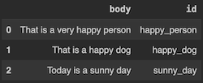
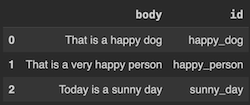

# Superlinked’s basic building blocks approach - a [notebook](https://github.com/superlinked/superlinked/blob/main/notebook/feature/basic_building_blocks.ipynb) article

## Intro

We’ve built out the Superlinked framework using @schema, Source, Spaces, Index, Query, and Executor - our building blocks. These building blocks let you build your system as a set of modules customized and repurposable to the requirements of your use case/s.

You start from your desired use case endpoints - i.e., how you want your embeddings to represent your data - what attributes to represent, how to weight them, and so on. Your endpoints guide how you set up your system through a **specific tailoring of the modules *before* you run your query**. You might run the query with weights adjusted to, for example, a unique user’s interests or, alternatively, to the most recent item.

In this way, Superlinked’s modularity **separates query description from query execution**, enabling you to run the same query in different environments without re-implementing a new solution each time. To build your Query, you use descriptive elements like @schema, Source, Spaces, Index, or Event. The **same descriptive components** can be re-used - **run using different Executors interchangeably**.

By focusing on connectors (to data sources and databases) rather than starting over from scratch, Superlinked’s framework lets you transition easily across deployments (e.g., from in-memory to batch or real-time data pipelines). For example, you can have one Executor that runs in a notebook, another that provisions a rest API, and a different one that batch calculates with spark.

In sum, Superlinked building blocks enable you to easily implement and deploy to fit your environment, maximizing your control over index creation and permitting rapid experimentation during embedding and retrieval.

Let’s take a look at how these building blocks do this in a little more detail.

## Turning classes into Schemas

Once you’ve parsed data into your notebook via JSON or a pandas dataframe, it’s time to create a Schema describing your data.

To do this, you **use the Schema decorator to annotate your class as a schema** representing your structured data. Schemas translate to searchable entities in the embedding space. To get started, type @schema, and then define the field types to match the different types of data you’ve imported.

```python
@schema
class ParagraphSchema:
    body: String
    id: IdField
```

With your Schemas created, you are ready to move on to embedding and querying, which is where Superlinked’s building blocks approach really empower you. The Superlinked framework is based on the intuition that people doing semantic search using embedding vectors can better satisfy the requirements of their use case/s if they can customize how their system handles data and queries. **Spaces** is a declarative class developed with this in mind. The Space module encapsulates the vector creation logic that will be used at ingestion time, and again at query time.

## Declaring how to embed your data using Spaces

Spaces lets you tailor how you embed different attributes of your data. Spaces can be categorized along 2 key dimensions:
1. what input types the Space permits - e.g., text, timestamp, numeric, categorical
2. whether the Space represents similarity (e.g, TextSimilaritySpace) or scale (e.g., numeric space)
Which Space/s fit your use case depends on both these dimensions - your input type and what you need to represent about your data.

You use different Spaces for different data types. For example, TextSimilaritySpace and CategoricalSimilaritySpace can take String as an input, RecencySpace can take Timestamp, NumberSpace can take Int/Float, and so on. Each Space captures a different, relevant piece of information (e.g., title, review count, etc.) about an entity. This lets you weight each Space according to which attributes are relevant to your use case - before you concatenate all your Spaces into a single multimodal vector among others in the queryable vector space.

By prioritizing the creation of smarter vectors up front - and only then creating the index - we can achieve better quality retrieval, without costly and time-consuming reranking and general post-processing work.

```python
relevance_space = TextSimilaritySpace(text=paragraph.body, model="all-MiniLM-L6-v2")
```

## Indexing

Superlinked’s Index module components enable you to group Spaces into indices that make your queries more efficient.

```python
paragraph_index = Index(relevance_space)
```

## Executing your query to your chosen endpoints

Before running your code, you need to structure your query using the following arguments:
- Query: defines the index you want it to search
- .find: tells it what to look for
- .similar: tells it how to identify relevant results

Note that you can wait to fill out the specific Params until later.

```python
query = (
    Query(paragraph_index)
    .find(paragraph)
    .similar(relevance_space.text, Param("query_text"))
)
```

Once you’ve defined your schema and built out the structure of your Index and Query, it’s time to connect everything.

Use **Source** to connect your data to the schema.

```python
source: InMemorySource = InMemorySource(paragraph)
```

Now that you’ve connected data with schema, you use the **Executor** to prepare your code to run. The Executor connects the source data with the index, which describes how each part of the data should be treated within Spaces.

```python
executor = InMemoryExecutor(sources=[source], indices=[paragraph_index])
app = executor.run()
```

## Experimenting with some sample data

Now we can insert some sample data...

```python
source.put([{"id": "happy_dog", "body": "That is a happy dog"}])
source.put([{"id": "happy_person", "body": "That is a very happy person"}])
source.put([{"id": "sunny_day", "body": "Today is a sunny day"}])
```

...and query it to see what it produces.

```python
result = app.query(query, query_text="This is a happy person")
result.to_pandas()
```

Here's our result.



Changing the query text further demonstrates the relevancy of our system's output:

```python
result = app.query(query, query_text="This is a happy dog")
result.to_pandas()
```



## In sum

In sum, the Superlinked framework empowers you to create and tailor a modular system that suits your use case/s, repurposable for different deployments, saving you from resource-consuming re-implementation, reranking, and postprocessing.

Now for the fun part - try it out yourself! The notebook is [here](https://github.com/superlinked/superlinked/blob/main/notebook/feature/basic_building_blocks.ipynb). Experiment with your own sample data and query inputs, and give us a star!
