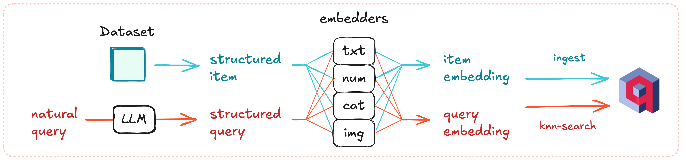

# Beyond Multimodal Vectors: Hotel Search With Superlinked and Qdrant

Modern search has evolved far beyond simple keyword matching. Today's users expect to express complex, nuanced preferences in natural language and receive precisely tailored results. A new collaboration between **Superlinked** and **Qdrant** demonstrates just how powerful this approach can be.


**Deep dive:** The full technical breakdown, including code examples and deployment instructions, is available in the complete article: [Superlinked Multimodal Search](https://qdrant.tech/blog/superlinked-multimodal-search/)

## The Challenge: Multi-Dimensional Search Preferences

Consider this hotel search query: _"Affordable luxury hotels near Eiffel Tower with lots of good reviews and free parking."_ This isn't just a search—it's a complex web of preferences spanning multiple data types: location (text), price (numerical), ratings (numerical), review count (numerical), and amenities (categorical).

Traditional search systems struggle with these multi-dimensional queries because they either:

- Force all data into a single embedding format, losing important relationships
- Require separate processing for different data types, making reconciliation complex
- Convert nuanced preferences into rigid binary filters

## The Solution: Specialized Vector Spaces



**Superlinked's breakthrough approach** creates specialized "spaces" for different data types:

```python
# Text data uses semantic language models
description_space = sl.TextSimilaritySpace(
    text=hotel_schema.description,
    model="all-mpnet-base-v2"
)

# Numerical data with appropriate scaling
rating_space = sl.NumberSpace(
    hotel_schema.rating,
    min_value=0, max_value=10,
    mode=sl.Mode.MAXIMUM  # Linear scale for ratings
)

price_space = sl.NumberSpace(
    hotel_schema.price,
    min_value=0, max_value=1000,
    scale=sl.LogarithmicScale()  # Log scale for wide price ranges
)
```

These spaces combine into a unified search index:

```python
# Create unified multimodal index
index = sl.Index(
    spaces=[description_space, price_space, rating_space],
    fields=[hotel_schema.city, hotel_schema.amenities]  # For filtering
)
```

The magic happens in query processing, where natural language transforms into weighted vector operations:

```python
query = (
    sl.Query(index, weights={
        price_space: sl.Param("price_weight"),
        rating_space: sl.Param("rating_weight"),
    })
    .find(hotel_schema)
    .similar(description_space.text, sl.Param("description"))
    .filter(hotel_schema.city.in_(sl.Param("city")))
    .with_natural_query(natural_query=sl.Param("natural_query"))
)
```

This approach ensures that:

- Natural language queries are automatically parsed into weighted preferences
- Hard filters (like "must have parking") coexist with soft preferences (like "affordable")
- Results maintain semantic nuance throughout the entire search process

## Real-World Impact

The hotel search demo showcases queries that feel intuitive and "just work":

- _"Pet-friendly boutique hotels with good reviews near the city center"_
- _"Affordable family suites with pool access in resort areas"_

Users can watch their natural language transform into precise search parameters in real-time, with dynamic weight adjustments that reflect the complexity of their actual preferences.

## The Technical Foundation

Built on **Qdrant's vector database** and **Superlinked's embedding framework**, this approach represents a new category of hybrid search that spans entire data domains rather than just retrieval methods. It solves fundamental limitations of current search architectures while maintaining the simplicity users expect.

## Ready to Build?

Getting started is straightforward. Clone the demo and set up your environment:

```bash
git clone https://github.com/superlinked/hotel-search-recipe-qdrant.git

# Backend setup
python3.11 -m venv .venv
. .venv/bin/activate
pip install -r requirements.txt
APP_MODULE_PATH=superlinked_app python -m superlinked.server

# Ingest sample data
curl -X 'POST' \
  'http://localhost:8080/data-loader/hotel/run' \
  -H 'accept: application/json' \
  -d ''
```

The complete implementation is available as an open-source [demo](https://docs.superlinked.com/recipes/multi-modal-semantic-search/hotel-search), showing how modern vector databases and intelligent embedding frameworks can create search experiences that understand not just the words we use, but the complex, nuanced preferences they represent.

---
