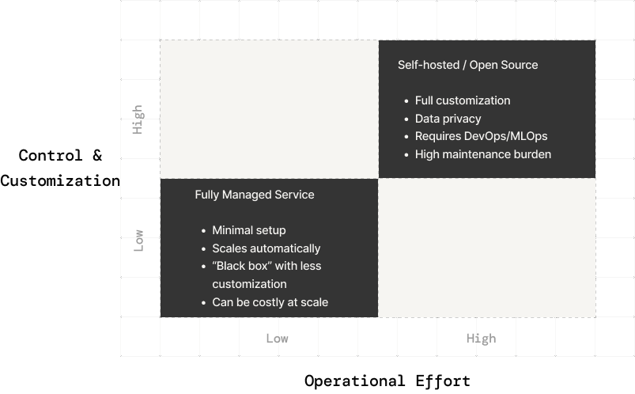
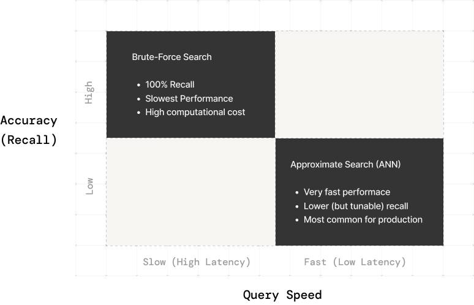

# A Practical Guide for Choosing a Vector Database: Considerations and Trade-Offs

Choosing a vector database for large-scale AI or search applications is less about comparing feature checklists and more about understanding your system’s architecture and constraints. The goal is to pick a solution that aligns with your use case’s scale, performance needs, and operational limits. 

If you’re exploring what might work best for your use case or want to discuss different architecture choices, you can book a short technical chat using [this link](https://getdemo.superlinked.com/?utm_source=vdb_table_article).

## An overview of key factors to compare when selecting a vector database

| **Dimension**              | **Key Considerations**                                                                                                                                        | **Trade-Offs / Recommendations**                                                                                                                                                                                                             |
| -------------------------- | ------------------------------------------------------------------------------------------------------------------------------------------------------------- | -------------------------------------------------------------------------------------------------------------------------------------------------------------------------------------------------------------------------------------------- |
| **Prototype → Production** | - In-process vs. standalone deployment - Ephemeral vs. durable storage                                                                                     | - Use embedded/in-memory DBs for prototyping; migrate to managed or self-hosted clusters for production. - Ephemeral (fast but volatile) vs. durable (persistent, reliable).                                                              |
| **Workload Type**          | - Write-heavy vs. read-heavy access patterns - Hybrid workloads                                                                                            | - Write-heavy: need async indexing, buffering, or real-time insert support. - Read-heavy: pre-built indexes (HNSW, IVF) offer speed at higher memory cost. - Hybrid: mix mutable "fresh" and static "main" indexes.                    |
| **Memory vs. Disk**        | - In-memory vs. disk-backed indexing - Sharding and scaling - Metadata and payload size                                                                 | - In-memory = fastest but costly and limited. - Disk-based = larger scale, slower but persistent. - Hybrid (memory + disk) balances both. - Store only embeddings in vector DB; offload large documents elsewhere.                  |
| **Deployment Model**       | - Fully managed service vs. self-hosted - In-process vs. standalone server                                                                                 | - Managed: minimal ops, faster deployment, higher cost & less control. - Self-hosted: full control, cheaper at scale, higher ops burden. - Start embedded → move to networked as system scales.                                        |
| **Tenant Model**           | - Single-tenant vs. multi-tenant architecture                                                                                                                 | - Single-tenant: simpler, faster. - Multi-tenant: cost-efficient but adds isolation and scaling complexity. - Use namespaces/collections for isolation if needed.                                                                      |
| **Query Features**         | - Metadata filters - Hybrid (dense + sparse) search - Multi-vector or mixture-of-encoders - Specialized queries (geo, facets)                        | - Strong filtering support is critical for scalability. - Hybrid search merges semantics + keywords. - Multi-vector support or mixture-of-encoders simplifies multi-modal search. - Few DBs support geo/faceted search natively.    |
| **Indexing Strategy**      | - ANN vs. brute-force - HNSW, IVF, PQ, LSH variants - Index rebuild costs                                                                               | - ANN offers massive speed-up with small recall trade-off. - Brute-force only for small datasets or accuracy-critical cases. - Evaluate on latency-recall curve, not index name. - Index rebuilds can be expensive - plan for them. |
| **Operational Costs**      | - Expensive ops: index rebuilds, bulk inserts, unindexed filters, strict consistency - Cheap ops: flat inserts, ANN queries, buffered writes, lazy deletes | - Avoid frequent rebuilds and unindexed filters. - Use async writes and lazy deletes. - ANN queries are efficient; design updates to be batched.                                                                                       |
| **Decision Factors**       | - Scale & latency goals - Operational capacity - Required query features - Acceptable trade-offs                                                     | - Focus on fit to architecture and constraints, not feature lists. - No universal "best" DB - choose based on workload, ops tolerance, and cost.                                                                                           |

## From Prototype to Production Scale

When starting out, you might use an in-process or embedded vector store for quick prototyping. An in-process library (running inside your application) is simple to set up and offers full control over your data in development . This works well for single-user scenarios or small datasets, where you can load vectors into memory and iterate rapidly. However, as you move to production scale, the requirements change:

- Deployment Model: Production deployments often demand a standalone or distributed database service rather than an embedded library. Fully **managed services** handle infrastructure scaling, replication, and maintenance for you, which accelerates deployment and reduces DevOps burden. You focus on using the database, not running it. In contrast, **self-hosting** gives complete control (important for data privacy or custom tuning) but means you manage servers, updates, and scaling yourself. The trade-off comes down to ease against control. Hosted solutions minimize overhead at the cost of flexibility, while self-hosted or open-source solutions let you customize everything at the cost of operational effort .

- Ephemeral vs. Durable: During prototyping you might tolerate an **ephemeral in-memory index** (data is reloaded or regenerated on each run). This can be faster since it avoids disk I/O, but it’s not suitable for production where persistence and recovery are required. For large-scale applications, ensure the vector DB supports **disk-backed storage** so indexes and data persist across restarts. Some systems offer both modes (ephemeral for speed, durable for safety), letting you choose based on whether you can afford to reload data on failures.

In summary, use lightweight embedded solutions for initial development and testing. As you scale up, plan for a robust deployment: either a self-managed cluster you tune for your needs or a managed cloud service that offloads maintenance. The path from prototype to production often involves migrating from an in-process library to a dedicated vector database service for better scaling, monitoring, and reliability.

## Write-Heavy vs. Read-Heavy Workloads

Consider your application’s **access patterns**. Is it ingesting vectors constantly (high write throughput), or mainly querying existing vectors (read-heavy)? Different vector database architectures handle writes and reads differently:

- High Write Throughput: If you need to index new vectors continuously (e.g. streaming data or frequent updates), look for systems optimized for fast inserts and updates. Some vector indexes can handle incremental additions but with caveats. For example, HNSW (a popular graph-based index) allows dynamic insertion of new vectors, but over time many random inserts can degrade query performance if the index isn’t periodically optimized. Likewise, deleting or updating vectors can fragment the index since many ANN structures don’t natively support deletions. To mitigate this, many databases separate write and read paths: new vectors go into an append-only buffer or separate segment, and a background process later merges them into the main index . This buffering strategy preserves query speed at the cost of eventual consistency (new data might not be immediately in the main index). Some systems mark deleted entries as inactive and only purge them during batch reindexing or compaction . The key point: continuous high writes often require a database that supports async index rebuilds or real-time indexing without locking the whole system. Simpler index types (like flat lists or inverted file partitions) may ingest faster since they require less complex re-linking than graph-based indexes.

- Read-Heavy Patterns: If your use case is mostly queries on a relatively static dataset (e.g. a fixed gallery of images or documents), you can afford heavier index structures that accelerate reads. Building an advanced index (like a multi-layer graph or quantized tree) up front is worthwhile when updates are rare. These indexes add memory overhead but dramatically cut query latency. For instance, a Hierarchical Navigable Small World (HNSW) graph index might use ~30-50% more memory than storing raw vectors , yet can answer queries in milliseconds even for millions of vectors . The trade-off is that index construction or rebuilds are expensive. Indexing millions of vectors can take significant time and CPU. Thus, in read-heavy scenarios you accept a slower ingest or one-time indexing cost in exchange for fast query responses thereafter.

- Balancing Both: Some applications need both fast updates and fast queries (e.g. real-time recommendation systems). In these cases, consider a hybrid approach: use a mutable index for recent data (like a small brute-force or IVF index for newest vectors) and a static index for older data. Queries can search the fresh data with brute-force (since it’s small) and the main data with the ANN index. This ensures new information is searchable immediately, while most queries hit the optimized index for the bulk of data. Also be aware of how the system handles concurrency because heavy writes can sometimes slow down reads if they contend for resources, unless the database is designed with separate read/write threads or index swap techniques.

In short, match the database to your workload: prioritize efficient ingestion mechanisms (like batch indexing or incremental index updates) for write-intensive cases, and robust query indexes for read-intensive cases. If you try to use a read-optimized index in a high-write scenario, you may see increasing query latency or need frequent full reindexing . Conversely, a write-optimized setup (like no index or a simple clustering index) might handle continuous updates but deliver slower query responses until additional indexing is done.

## Memory vs. Disk: Index Storage and Sharding

Another fundamental consideration is whether your vector index can reside fully in memory or must be disk-backed (and how the system scales beyond one machine’s memory). This impacts performance, cost, and complexity:

- In-Memory Indexes: Many ANN algorithms assume data fits in RAM for fast random access. If your entire vector set (plus index overhead) can be kept in memory, you’ll get the lowest query latencies. Graph-based indexes like HNSW perform best when their graph is entirely in memory . However, memory is limited and expensive at scale. When the dataset grows too large for RAM, in-memory methods suffer drastic slowdowns because they incur random disk I/O that they weren’t designed for . If you anticipate billions of vectors, purely memory-resident solutions might force you into heavy sharding (splitting data across many nodes) to keep each shard in RAM. Sharding adds complexity in itself (routing queries to the right shard or doing federated search across shards). Some open-source libraries require manual sharding, whereas certain vector databases handle data distribution automatically across nodes. Consider how much effort you can invest in scaling out.

- Disk-Based Indexes: Disk-backed vector indexes use files or SSDs to hold data beyond what memory can accommodate. Modern approaches like DiskANN and SPANN are designed for this scenario: they store most of the index on disk but carefully orchestrate disk reads to keep query times reasonable. A disk-based index typically scales to larger datasets without a linear rise in memory cost, but query latency may be higher than an all-in-memory approach. There’s often a throughput trade-off too: retrieving data from disk (even SSD) is slower than from RAM, so QPS (queries per second) might be lower on a single node, though you can compensate by adding more nodes. On the plus side, disk indexes offer persistence. This means you don’t lose all data if the process restarts. They also allow bigger-than-memory collections on a single node (useful if you prefer vertical scaling to adding many machines). If you need to store, say, 100 million embeddings but only have a budget for a few beefy servers, a disk-based index can make that feasible by sacrificing some speed.

- Hybrid Strategies: Many vector databases use a mix of memory and disk. For example, they might keep coarse structures or centroids in memory, but store the bulk of vectors on disk and load only relevant chunks during a query. Or they use memory-mapped files so the OS can cache hot portions in RAM and spill cold data to disk. Understand a database’s approach: does it require all data in RAM, or can it seamlessly page to disk? Also check if the index is built fully in memory then saved (which might need huge RAM during indexing even if final usage is on disk). If your application can’t fit data in memory and the DB doesn’t support true disk indexing, you will need to either shard heavily or choose a different solution.

- Document Size and Metadata Storage: Related to memory vs. disk is how the database handles the non-vector data. If each vector point carries a payload (document text, image, or extensive metadata), storing those within the vector DB can bloat memory usage. Some systems limit per-item size (e.g. a few kilobytes of metadata) to keep memory footprint low. Others allow large blobs or documents to be stored alongside vectors, which might be convenient but means your memory/disk usage per vector is much higher. For large documents, a common design is to store the embeddings in the vector DB and keep the raw content in a separate storage (or just store a reference/ID). This way the vector index remains lean. When comparing solutions, note any document size limits or performance implications of storing big payloads. A disk-based database might handle large documents better (since it naturally reads from disk anyway), whereas an in-memory one could choke if you try to stuff entire documents into it.

In essence, know your data scale. If it comfortably fits in memory, an in-memory index offers simplicity and speed. If not, favor databases built for disk or distributed operation. Also account for metadata and payload sizes in your storage planning. A well-chosen architecture will either keep everything important in fast memory or use smart disk techniques to prevent random access slowdowns.

## Managed Services vs. Self-Hosted Operations

Operational considerations can be as important as raw performance. Vector databases come in both fully-managed cloud services and self-hosted software packages and even in-between (like enterprise appliances or cloud-managed open source). Your choice will affect development speed, cost structure, and maintenance work:

- Fully Managed Services: These are cloud-hosted vector DB offerings where the provider runs the infrastructure. They handle scaling, replication, upgrades, and often provide high-level APIs. The appeal is “database as a service” convenience: you can spin up a vector index without worrying about provisioning servers or dealing with downtime for upgrades. Managed services often include robust monitoring, security features, and SLA guarantees. They are ideal for teams that want to integrate semantic search quickly without building ML ops expertise . For example, a small team can use a managed vector DB to serve a semantic search feature in production within days, rather than investing weeks in setup. The downside is less customization you typically cannot fine-tune the indexing algorithms or internal parameters beyond what the service exposes. If your use case is niche (needing a custom distance metric or a specialized data pipeline), a hosted service might feel like a black box. Cost is another factor: managed services charge per usage (per vector stored, queries run, etc.), which can become expensive at scale . Over time, if you have a very large or constantly growing dataset, the pay-as-you-go pricing might exceed the cost of running your own servers.

- Self-Hosted (Open Source or Enterprise): Running your own vector database (or using an open-source library) gives ultimate flexibility. You can choose the exact version, configure hardware to your needs, and even modify source code if you have very specific requirements. Full control is the selling point vital for organizations with strict data governance (e.g. sensitive data that cannot leave your environment) . Self-hosting also means you bear the operational burden: deploying the service (often in containers or Kubernetes), setting up monitoring, performing backups, scaling out when needed, and troubleshooting issues. Make sure your team has the necessary DevOps skills if you go this route. One benefit is that costs can scale more predictably: you pay for servers/cloud instances directly. This can be cheaper in the long run for large workloads, but only if you utilize the capacity well. It’s unsustainable to self-host without dedicated maintenance effort and a neglected cluster can fail or slow down over time. Some open-source vector DB projects offer enterprise support or managed options, which could be a middle ground (you run it yourself with vendor support or an easier deployment path).

- In-Process Libraries vs. Standalone Servers: Another operational angle is whether the vector search runs inside your application process or as a separate service. During prototyping we discussed in-process options (like libraries such as FAISS, or embedded engines). Self-hosting can mean running a standalone server (similar to running a database like PostgreSQL for vectors) or simply linking a library in your app code. The embedded approach (in-process) means no network calls and queries are just function calls in memory which can be very fast and simplify development. The LanceDB open-source project, for example, highlights its embedded usage for self-managed deployments . However, an in-process database typically lacks multi-user safeguards or multi-tenancy; it’s meant for a single application’s internal use. A standalone service (managed or self-hosted) is more suitable when multiple services or clients need to query the vectors concurrently, or when you need to scale out horizontally. Consider starting embedded when one app is using the data, then moving to a networked service model as your architecture grows more complex.

Ultimately, decide based on your priorities and resources. If speed to market and minimal ops are paramount, lean towards a managed service (knowing that you trade off some flexibility and commit to ongoing usage costs) . If customizability, cost control at scale, or data sovereignty are top concerns, be prepared to self-host and invest in the necessary infrastructure work. Some teams even begin with a hosted solution for a proof-of-concept and later migrate to self-hosted once they hit scale or need bespoke features .

## Single-Tenant Simplicity vs. Multi-Tenant Architecture

Consider whether your application serves one dataset or many isolated datasets (tenants). Multi-tenancy is common in SaaS platforms: a single system must handle vectors for multiple clients or domains, keeping their data separate. Your choice of vector DB should align with how you plan to isolate and organize data:

- Single-Tenant (Simplicity): If you have one large corpus of vectors (or a few related ones) for your application, you can run a simpler configuration. All data lives in one or a few indexes. This is straightforward to manage and typically yields better performance per query because the system can be optimized for that one dataset. There’s no need for per-tenant overhead or complex partitioning. If tomorrow your data doubles, you scale the whole database and you don’t worry about which tenant to scale. Many vector DBs were initially designed with this use case in mind: one index serving one application’s needs. Even if you have multiple use cases (e.g. one index for images, another for text), that’s still a fixed small number of indexes, not unbounded growth.

- Multi-Tenant Support: In a multi-tenant scenario, a single database instance serves many independent sets of vectors. For example, a platform offering semantic search to 100 different customers might use one vector DB cluster to store 100 indexes or partitions, one per customer. Multi-tenancy shares the infrastructure across tenants to reduce costs and simplify operations . However, it introduces complexity: you must ensure that queries and data are isolated (so tenant A never sees tenant B’s results), and that one tenant’s heavy workload doesn’t degrade others’ performance. Many vector databases provide features like namespaces, collections, or partitions to partition data by tenant. These effectively act as mini-indexes that the system can restrict queries to. For instance, Pinecone uses namespaces to isolate each tenant’s vectors, so queries only search within that namespace . This isolation can even improve performance by narrowing the search space per query . The design challenge is scaling to many tenants: if you have thousands of small indexes, the overhead per index (metadata, memory) could become significant. Some databases handle millions of small segments efficiently, while others may struggle beyond a certain count. Also, if you ever need to query across tenants (e.g. an admin search over all data), that might be hard if data is strictly partitioned in such cases, you might instead tag each vector with a tenant ID and use a metadata filter to separate tenants, at the cost of all data living in one big index.

- Operational Impact: Multi-tenancy requires more planning. You’ll need to think about per-tenant quotas, how to back up or export a single tenant’s data, and how to onboard/offboard tenants (deleting a tenant’s vectors cleanly). If each tenant is small, grouping many into one index with metadata filtering might be more efficient than creating thousands of indexes. On the other hand, completely separate indexes give stronger isolation (different indexes can reside on different nodes or be dropped independently). Some vector databases even support database-level multi-tenancy with separate authentication realms for different client apps . If you don’t need multi-tenant capability, avoid the complexity a single-tenant setup will be easier to tune and manage. But if you do need it, ensure your chosen solution has proven strategies (namespaces, metadata filters, or sharding strategies) for multi-tenant data isolation.

In summary, **design for multi-tenancy only if you need to**. It’s an important architecture question: a vector DB that shines for one big dataset may not handle 1,000 small ones efficiently, and vice versa. Nearly every SaaS with user-specific data will need some multi-tenant approach, so check the database’s documentation for terms like “namespaces”, “collections”, or “tenant isolation.” Multi-tenancy enables cost sharing and unified operations , but be prepared to manage the additional complexity in your queries and maintenance processes.

## Search Features and Query Functionality

Not all vector databases offer the same query capabilities beyond basic nearest neighbor search. Consider what search functionality your application requires:

- Metadata Filters: Most real-world vector search needs to combine similarity with filters (e.g. “find similar images where category = ‘cat’”). If you have structured metadata (tags, timestamps, user IDs, etc.), ensure the database supports filtering on those fields at query time. Effective filtering can dramatically reduce search cost by narrowing candidate vectors. In fact, **indexing your metadata has a significant positive effect on search performance when using filters** . Some systems build a secondary index (inverted index or tree) on the metadata so that a query with a filter first pre-selects a subset of vectors, then performs the vector similarity search only within that subset . This pre-filtering is crucial for performance at scale. Without it, a “filterable” vector search might internally scan large portions of the data. Check if the DB supports building indexes on metadata fields (sometimes called payload indexes or filter indexes). If not, it might apply filters post-search, meaning it finds nearest vectors then drops those that don’t match the filter. Post-filtering is fine for loose filters on highly similar results, but if your filters are selective, you waste compute and risk missing relevant items that were filtered out early. In short, strong support for metadata filtering (and even faceted search or range queries on numerical attributes) is important if your search needs to answer queries like “similar articles published in the last week” or “closest products under $50”.
  An alternative approach is to generate vectors using subvectors that represent different aspects of your data, for example, encoding semantic content, categorical metadata, and numerical attributes as separate subvectors that combine into a single embedding. This mixture of encoder architecture (like Superlinked's approach) allows metadata constraints to be embedded into the vector space itself, so searches naturally retrieve semantically similar items that also match your criteria, without maintaining separate indexes or post-filtering steps.

- Hybrid Search (Dense + Sparse): Pure vector search captures semantic similarity, but sometimes you also need keyword matching or other sparse signals. Hybrid search refers to combining dense vectors with sparse, text-based scoring (like BM25 or classic inverted indices). For example, a query might include some keywords that must appear in the result or boost certain results. Some vector databases integrate basic keyword search or can accept both a query vector and keywords together. If you require full-text search features (exact phrase matching, boolean operators), you might pair the vector DB with a separate search engine or use a multi-modal engine. But a number of modern solutions (and search engines adding vector capabilities) support hybrid queries natively. They might allow a weighted sum of vector similarity score and keyword score for each document. If hybrid relevance is important (e.g. to avoid returning results that are topically similar but missing a critical keyword), look for a database or approach that handles sparse + dense querying. This could involve storing a sparse embedding or term frequencies as additional data. At the very least, the DB should let you retrieve an initial set of vector-similar results and then refine or re-rank using text criteria. Some open-source examples include combining Elasticsearch’s BM25 with vector search for reranking. The key is that dense and sparse retrieval should not be completely siloed and your architecture should allow blending them for the best of both worlds (semantic generalization with precise keyword matching). Modern approaches like Superlinked's mixture of encoder architecture can unify these different signal types within a single embedding framework, eliminating the need to maintain separate systems or manually blend scores.

- Multi-Vector per Document: In advanced use cases, a single “document” might be represented by multiple vectors. For instance, a product could have an image embedding and a description text embedding; a long article could be split into paragraph vectors. Does the database allow storing multiple vectors attached to one record, or do you need to treat each vector as its own record? Some vector databases historically only supported one vector per record, but newer versions introduced multi-vector support in one collection. Having multi-vector support means you can keep an object’s embeddings together and store common metadata once. It simplifies queries too: you might query against a specific vector field of the object. If a DB lacks this, you may have to create separate indexes (or collections) for each vector type, duplicating metadata and complicating joins between results. Consider whether your application might benefit from multi-vector representation (it’s common in multi-modal apps or when using multiple embedding models for different aspects). If so, ensure the solution can handle that gracefully, or plan for a workaround (like maintaining separate indexes and merging results at query time). However, for shorter documents like text passages of a few sentences, an alternative approach is to use multiple encoder types to generate embeddings that combine into a single longer vector. This mixture of encoder architecture (as implemented in Superlinked's framework) can capture different aspects like semantic meaning, numbers, categories, temporal signals, or categorical attributes within one vector, eliminating the need for multi-vector storage while still representing document complexity. This simplifies both storage and querying, since you're working with a single vector per document rather than coordinating searches across multiple vector fields

- Geospatial and Other Specialized Queries: Some applications need to filter or rank by geo-distance (e.g. “find similar restaurants near me”) or perform region search in addition to vector similarity. A few vector databases or hybrid search engines support geo indexing alongside vectors. If location-based filtering is required, check if it’s natively supported. Otherwise, you might again have to pre-filter by geo (using an external service or a bounding box query) and then do vector search. Similarly, if you need real-time filtering by things like user permissions or other dynamic conditions, ensure the query interface can combine those conditions with the vector search in one call or plan a two-step approach.

- Facets and Grouping: Classic search often provides facets (count of results by category) or the ability to group results. Vector DBs are generally not as feature-rich as mature text search engines in these respects, but some are adding such features. If you require analytical queries on the results (like “how many categories are represented in the top 100 matches?”), you may need to either retrieve more results and compute that in your application, or rely on a search system that integrates vector and traditional inverted indices.

In summary, **list out the query types** you expect: “K-NN search with filter by X and Y, maybe combining text Z, returning fields A, B, C”. Then ensure the database can do that efficiently. Filters are a must-have in many cases to check how they’re implemented because they can make or break performance. Hybrid search capability is increasingly important for AI applications that still need exact keyword matching for certain terms (like names or codes). If a vector DB doesn’t support hybrid search, you might end up maintaining two systems (one for vectors, one for text) and merging results, which is doable but adds complexity. Aim for a solution that covers as many of your query needs as possible so you aren’t stitching together too many components.

## Indexing Strategies vs. Query Performance

At the heart of any vector database is the **index type** it uses for nearest neighbor search. You’ll encounter terms like brute-force (flat) search, HNSW graphs, IVF (inverted file), PQ (product quantization), LSH, etc. While the algorithms differ, it’s important to not get lost in the jargon. Focus on how an index choice affects two key outcomes: query latency and recall (accuracy). Most databases let you configure this trade-off, and understanding it guides your selection more than the specific algorithm brand name.

- Brute-Force vs. Approximate: A **full linear scan** (brute-force) search checks the query against every vector in the dataset. This guarantees finding the true nearest neighbors (100% recall) but is extremely slow at scale . Its query time grows linearly with data size: for example, querying 1 million vectors means 1 million distance computations, which could take seconds per query . Brute-force also requires storing all vectors, typically in memory, which can be memory-intensive (1 million vectors of 768 dimensions ≈ 3 GB RAM) . On the other hand, **approximate nearest neighbor (ANN)** indexes drastically speed up search by examining only a subset of vectors. They achieve this by organizing data for instance, clustering vectors so only a few clusters need scanning, or building a graph so only local neighbors are explored. ANN trades a bit of accuracy for speed; you might get most of the true nearest neighbors but possibly miss a few. This accuracy is often measured as recall@k e.g., finding 9 out of the top 10 true neighbors might be 90% recall. Depending on the algorithm and parameters, recall can often be tuned to 95%+ while still being much faster than brute force. **In practice, brute-force search is rarely used for large-scale production** because of its latency, except sometimes as a fallback for small data or to verify ANN results. Approximate methods like HNSW or IVF cut query times to milliseconds even on millions of points , at the cost of a tiny recall loss. The right approach depends on your tolerance for missing a few results and your latency requirements . If you absolutely need every neighbor (e.g., in some scientific or legal applications), you might stick to brute force on smaller candidate sets or use ANN and then re-check via brute force on a narrowed set (hybrid approach) .

- Index Types (HNSW, IVF, PQ, etc.): Each index type has pros and cons, but an important insight is that **what matters is meeting your latency/throughput target at acceptable recall, not the specific name of the index**. HNSW is popular for its strong balance of speed and accuracy on medium-sized datasets, but it requires memory and periodic maintenance (cannot grow indefinitely without re-tuning) . IVF indexes partition the data into buckets (via clustering); they’re memory-efficient and can handle larger datasets by reading a few buckets from disk, but they might have lower recall if you don’t search enough buckets . Product quantization (PQ) compresses vectors to reduce memory usage and speeds up distance calculations at some precision loss great for scaling to very large datasets where memory is a bottleneck. Many databases offer a combination (e.g. IVF + PQ, or HNSW with quantized vectors). Rather than choosing a DB because it has a specific index, evaluate how it meets your needs: Does it provide configurable parameters to reach the recall you need? Can it search within X milliseconds for your data size? For instance, an ANN graph might be tuned with a parameter that increases recall but also CPU time per query. If you need sub-50ms responses, you might lower that parameter to trade some recall for speed. Conversely, if you need >99% recall, you’ll increase it and accept the slower queries or use a re-ranking step . The underlying algorithm (HNSW vs. Annoy vs. DiskANN etc.) is less important than these performance characteristics in practice. All mature vector databases will have some way to do _approximate search_ focus on whether it supports the scale you have (memory or disk wise) and the _accuracy vs. performance_ tuning you want.

- Guaranteed Recall Scenarios: If recall must be 100%, one approach is to use brute-force (perhaps on a smaller subset). Some production setups use a **two-phase retrieval**: first use ANN to get N candidates quickly, then perform an exact brute-force distance calculation on those N to pick the final top K. This can boost accuracy without a huge performance penalty, since N (say 1000) is much smaller than the full dataset . Many vector search libraries and DBs support this pattern (e.g. returning the index’s internal distances and allowing a re-sort by exact distances). If the database doesn’t support it natively, you can implement it in your application logic. But only bother with this if you truly need that extra accuracy for a lot of recommendation or search tasks, ANN recall of 90-95% is indistinguishable in results from exact, given that embeddings themselves are an approximation of relevance. Remember that your vector similarity is already an approximation of “relevance” or “similarity” in the real world; obsessing over exact nearest neighbors might not yield a better user outcome unless you know those last few percent matter.

- Index Build and Maintenance Costs: Different indexes have different build times and flexibility. HNSW, for example, has an upfront build complexity and also doesn’t like deletions (some implementations simply mark deleted nodes which can bloat memory until rebuild). If you anticipate frequently **rebuilding indexes** (say you re-embed your entire corpus every month), index build time could be a factor in downtime or resource usage. Some databases can add data gradually and never require a full rebuild, while others suggest periodic reindexing for optimal performance . Also consider memory overhead during indexing as some algorithms might need extra memory during construction. If build time is a concern, you might choose a simpler index that can be constructed faster (or even use brute force for small indexes because it has zero build time). For very large data, you might use a distributed indexing approach (map-reduce style clustering and graph building) but this is advanced and usually only done in systems like Elastic or bespoke pipelines.

In short, **don’t choose a vector DB solely because it touts a fancy index type**. Instead, think about your required query latency and accuracy. All vector DBs involve a speed-accuracy trade space . Evaluate if the database lets you configure that trade-off and if it can handle your dataset scale with the hardware you have. If you’re unsure, benchmarking a sample of your data on a couple of index types (many libraries offer tools for this) can be enlightening. Often you’ll find multiple ways to achieve your targets. What matters is that the database reliably hits the latency/throughput you need at the recall or result quality you’re comfortable with. Algorithm details are secondary to this bigger picture.

## Operational Cost: Expensive vs. Cheap Operations

Finally, it’s useful to know which operations or features will “cost” the most in terms of performance or complexity. This helps avoid unpleasant surprises in production:

### Expensive Operations:

- Index rebuilds or reconfiguration: Changing the index type or parameters (for example, increasing the number of clusters or graph connections for higher recall) often requires rebuilding the index from scratch. This can be a heavy operation on large datasets, potentially taking hours. Plan such reindexing for low-traffic periods or offline.

- Bulk insertions into a complex index: Inserting millions of vectors into an ANN structure like HNSW in one go can be slow and memory-intensive. It may be faster to build a fresh index with all data than to insert iteratively. Some databases offer bulk load tools for this reason.

- Filterable search on unindexed metadata: If you use metadata filters but the database hasn’t indexed that field, a query must scan many records to check the filter, which is very slow as data grows. Always index the fields you plan to filter on, if the option exists, to avoid this.

- Very high-dimensional vectors or large payloads: Extremely high-dimension vectors (e.g. 10k dimensions) can slow down distance computations and increase memory use. Likewise, storing a large blob of data with each vector means more data to move around for each query result. These are more edge considerations, but if your embeddings are unnecessarily large, consider dimensionality reduction.

- Frequent strict consistency requirements: If you require that after each insert or update, all future queries immediately reflect that change (strong consistency), it may force the system to use slower, synchronous updates or smaller indexes. Many vector databases favor eventual consistency for performance (as discussed with buffers). Demanding strict consistency (e.g. for real-time applications where data changes every second) could reduce throughput or require special settings.

### Cheaper Operations:

- Flat (brute-force) inserts: Simply appending vectors to an unindexed collection is fast and scales linearly. If you don’t need an index, or are in a staging phase, this is cheap. The data structure is just an array of vectors. (Queries will be slow though, as noted.)

- Approximate k-NN queries on a built index: Once your ANN index is built and tuned, queries are typically very fast that’s the whole point. For example, an HNSW search might visit only a few dozen nodes out of millions, or an IVF search might scan only 5% of the vectors. These operations are highly optimized in native code and often leverage CPU cache well. So the querying itself is “cheap” compared to say, a brute force search, in terms of CPU per query . This means you can often handle a high query load on a single server if the index is efficient, which is why vector search is feasible at scale.

- Adding new vectors to a buffer: If your database uses an append-only log or buffer for new data, each write is a small operation (write to memory or disk sequentially). It doesn’t immediately impact the main index. In databases that support it, this kind of a write is cheap. The heavier cost is deferred to a batch process later. So high write throughput can be sustained as long as the system can keep up with merging batches in the background.

- Deleting by metadata (lazy delete): Marking vectors as deleted (to be cleaned up later) is usually just a metadata flag, which is cheap. The actual removal from the index might be deferred. So deletes often don’t slow down the system immediately (but too many unpruned deletions can bloat the index until cleanup happens).

Being aware of these can inform how you use the system. For instance, if you know re-indexing 100 million vectors is expensive, you might avoid doing that frequently by structuring your updates in a rolling fashion. Or if you know filter queries are slow without a payload index, you’ll invest time in setting those up early. On the flip side, you can aggressively use features that are cheap. If flat insertion is fast and you’re in early development, you might skip building an index until you actually need it for query speed simplifying your pipeline. Or use a low-precision (but fast) index to serve initial queries and then improve it later if needed.

## Conclusion

Selecting a vector database is a strategic decision that hinges on your **specific needs and constraints**. Instead of asking “which product has the most features?”, ask how each option fits your scenario in terms of architecture:

- Data Volume & Scale: Can it handle your current and future dataset sizes in memory or on disk? Will you need to shard or can it scale vertically?

- Performance Profile: Does it meet your query latency targets at the recall you require? How does it cope with your expected write rates?

- Operational Model: Does it align with your deployment preferences (embedded vs. managed service) and your team’s ability to maintain it? Are you okay with eventual consistency and background processes, or do you need strict real-time updates?

- Feature Compatibility: Does it support the necessary query types (filters, hybrid search, etc.) and data isolation (if multi-tenant)? Any missing feature will have to be implemented in your application or with an auxiliary system.

- Trade-offs Acceptance: Every design has trade-offs be it memory vs. disk, accuracy vs. speed, simplicity vs. flexibility. Identify which trade-offs you’re willing to make. For example, if you prioritize simplicity, you might choose a managed service with slightly limited customization. If you prioritize maximal performance tuning, you might choose an open-source solution you can tweak, at the cost of more engineering effort.

By focusing on these architectural and practical considerations, you move beyond marketing checklists and choose a vector database that will serve your application well in the long run. Remember that **no single option is “the best”** in all scenarios. It’s about the right tool for the job. A small in-memory library might outperform a distributed cluster for a tiny use case, while a fully managed scalable vector DB will shine when you have massive data and minimal ops staff. Evaluate your needs through the lenses discussed (prototyping vs. production, write vs. read, memory vs. disk, managed vs. self-run, single vs. multi-tenant, query types, and index tuning). This will lead you to a decision based on system design principles and trade-offs, which is far more robust than one based on who has more features on paper. In the end, **the best vector database is the one that fits your constraints and makes your engineers’ lives easier**, while delivering the performance your application and users demand. For assistance evaluating vector database architectures based on your scale, performance, and business requirements, feel free to reach out to Superlinked for technical guidance.
