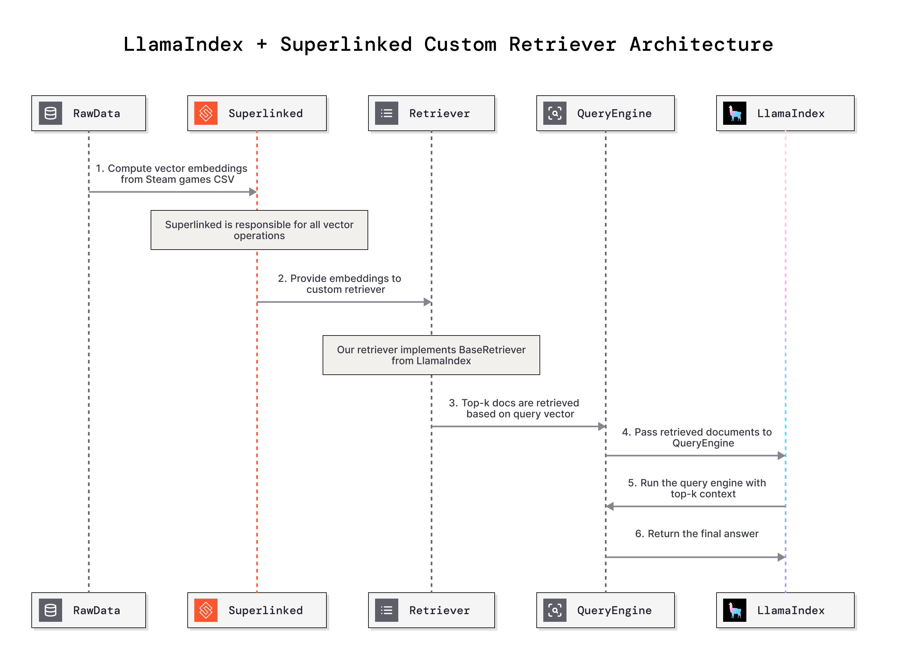

# Building a Custom Steam Games Retriever with Superlinked and LlamaIndex

As retrieval-augmented generation (RAG) systems continue to evolve, the need for **custom, domain-specific retrievers** is becoming more and more obvious. Sure, traditional vector databases are great for basic similarity search—but the moment you throw in more complex, context-heavy queries, they start to fall short. Especially when you're working with real-world data that needs richer filtering or semantic understanding.

In this post, I’ll walk through how to build a **custom retriever** by combining **Superlinked**— with **LlamaIndex**'s flexible retrieval framework. Think of this as a hands-on guide: I'll show you how to wire things up end-to-end using a **Steam game recommendation system** as the example. We’ll tap into semantic similarity, multi-field indexing, and advanced query logic to make sure recommendations aren’t just relevant—they actually make sense. If you want to follow along, here is the colab link : [Google Colab](https://colab.research.google.com/github/superlinked/VectorHub/blob/main/docs/assets/use_cases/custom_retriever_with_llamaindex/superlinked_custom_retriever_with_llamaindex.ipynb)

## Why Custom Retrievers Matter

Before we dive into the implementation, let’s talk about why building your own retriever is often the better choice in real-world RAG setups.

1. **Tuned for Your Domain** – Generic retrievers are fine for general use, but they tend to miss the subtle stuff. Think about jargon, shorthand, or domain-specific phrasing—those don’t usually get picked up unless your retriever knows what to look for. That’s where custom ones shine: you can hardwire in that context.
2. **Works Beyond Just Text** – Most real-world data isn’t just plain text. You’ll often have metadata and tags too. For example, in a game recommendation system, we don’t just care about the game description—we also want to factor in genres, tags, user ratings, and more. Think about this logic: someone searching for a “strategy co-op game with sci-fi elements” won’t get far with text-only matching.
3. **Custom Filtering and Ranking Logic** – Sometimes you want to apply your own rules to how things are scored or filtered. Maybe you want to prioritize newer content, or penalize results that don’t meet certain quality thresholds. I mean, having that kind of control is like giving your retriever an actual brain—it can reason through relevance instead of just relying on vector distances.
4. **Performance Gains** – Let’s be real: general-purpose solutions are built to work “okay” for everyone, not great for you. If you know your data and your access patterns, you can fine-tune your retriever to run faster, rank better, and reduce unnecessary noise in the results.

## Implementation Breakdown

### Part 1: Core Dependencies and Imports

```python
import time
import logging
import pandas as pd
from typing import List
from llama_index.core.retrievers import BaseRetriever
from llama_index.core.schema import NodeWithScore, QueryBundle, TextNode
from llama_index.core.query_engine import RetrieverQueryEngine
from llama_index.core.response_synthesizers import get_response_synthesizer
from llama_index.core import Settings
from llama_index.llms.openai import OpenAI
import superlinked.framework as sl
```

The import structure reveals our hybrid approach:

- **LlamaIndex Core**: Provides the retrieval abstraction layer
- **Superlinked Framework**: Handles vector computation and semantic search
- **Pandas**: Manages data preprocessing and manipulation

### Part 2: Understanding LlamaIndex Custom Retrievers

Before diving into our Superlinked implementation, it's crucial to understand how LlamaIndex's custom retriever architecture works and why it's so powerful for building domain-specific RAG applications.

### BaseRetriever Abstraction

LlamaIndex provides an abstract `BaseRetriever` class that serves as the foundation for all retrieval operations. The beauty of this design lies in its simplicity—any custom retriever only needs to implement one core method:

```python
from abc import abstractmethod
from llama_index.core.retrievers import BaseRetriever
from llama_index.core.schema import NodeWithScore, QueryBundle

class BaseRetriever:
    @abstractmethod
    def _retrieve(self, query_bundle: QueryBundle) -> List[NodeWithScore]:
        """Retrieve nodes given query."""
        pass
```

The moat here is the presence of the Retrieval Protocol from the LlamaIndex. As this "retrieval protocol" makes it easy to plug in different backends or strategies without having to touch the rest of your system. Let’s break it down on what’s exactly is going on :

1. **Input: `QueryBundle`**

   This is the query object passed into your retriever. At minimum, it contains the user's raw query string (e.g., "sci-fi strategy games"). But it can also include extra metadata—like filters, embeddings, or user preferences. Basically, anything that might help shape a more relevant response.

2. **Output: `List[NodeWithScore]`**

   The retriever returns a list of nodes—these are your chunks of content, documents, or data entries—each paired with a relevance score. The higher the score, the more relevant the node is to the query. This list is what gets passed downstream to the LLM or other post-processing steps. As in our case, we are plugging on the

3. **Processing: Backend-Agnostic**

   Here’s the cool part: how you get from query to result is totally up to you. You can use a vector database, a traditional search engine, a REST API, or even something handcrafted for your specific use case. This decouples logic and gives you full control over the retrieval stack.

### But Why This Matters?

This abstraction isn’t just clean—it’s _powerful_. It means you can:

- **Combine multiple strategies** – Use dense vector search _and_ keyword filtering together if needed.
- **Run A/B tests easily** – Compare different retrievers to see what gives better results for your users.
- **Plug into any agent or tool** – Whether you're building a chatbot, a search UI, or a full-blown agent system, this retriever interface slots in easily.

Think of the retrieval protocol as the API contract between your "retrieval brain" and everything else. Once you follow it, you’re free to innovate however you want behind the scenes.

### Plugging Superlinked into LlamaIndex

Alright, so the `SuperlinkedSteamGamesRetriever` class is basically our go-to tool for giving smart, semantic game recommendations. We’ll start with a quick look at how it’s put together, and then later dive deeper into each part to really see what makes this thing tick.

First up is the **schema definition**—think of it as the foundation. It’s what keeps everything organized and reliable. Using Superlinked’s `GameSchema`, we lay out key details like `game_number`, `name`, `desc_snippet`, and `genre`. This keeps all the game info clean and consistent, and it plugs right into Superlinked’s pipeline so everything flows smoothly.

```python
    class GameSchema(sl.Schema):
        game_number: sl.IdField
        name: sl.String
        desc_snippet: sl.String
        game_details: sl.String
        languages: sl.String
        genre: sl.String
        game_description: sl.String
        original_price: sl.Float
        discount_price: sl.Float
        combined_text: sl.String  # New field for combined text

    self.game = GameSchema()
```

Next up is the **text similarity space**—this is where the magic of semantic search happens. It uses the `sentence-transformers/all-mpnet-base-v2` model to turn a bunch of game info (like the name, description, genre, etc.) into dense vector representations. Basically, it smooshes all that text together into something the model can understand. The cool part? This lets the retriever understand what a user _means_, not just what words they type. So if someone searches for something like “open-world adventure,” it can find games that actually fit that vibe, not just ones with those exact words.

```python
    self.text_space = sl.TextSimilaritySpace(
        text=self.game.combined_text,
        model="sentence-transformers/all-mpnet-base-v2"
    )
```

The **combined text field** is where things really start to click. It takes different bits of info—like the game’s name, description, genre, and more—and smashes them into one big chunk of text. This gives the model a fuller picture of each game when turning it into vectors. The result? Way better recommendations, since it’s pulling in a bunch of different details all at once instead of just looking at one thing in isolation.

```python
    self.df['combined_text'] = (
        self.df['name'].astype(str) + " " +
        self.df['desc_snippet'].astype(str) + " " +
        self.df['genre'].astype(str) + " " +
        self.df['game_details'].astype(str) + " " +
        self.df['game_description'].astype(str)
    )
```

And finally, **in-memory execution** is what makes everything super snappy. Thanks to Superlinked’s `InMemoryExecutor`, the retriever can handle queries in real time—no delays, just instant results. That means whether someone’s hunting for a specific genre or just browsing for something new to play, they get fast and accurate recommendations without waiting around.

```python
    # Set up in-memory source and executor
    source = sl.InMemorySource(self.game, parser=parser)
    self.executor = sl.InMemoryExecutor(sources=[source], indices=[self.index])
    self.app = self.executor.run()

    # Load data
    source.put([self.df])
```

Put all these pieces together, and you’ve got the `SuperlinkedSteamGamesRetriever` — a solid setup for delivering game recommendations that actually make sense for the user. It’s fast, smart, and personal. Here’s what the full thing looks like in action...

```python
class SuperlinkedSteamGamesRetriever(BaseRetriever):
    """A custom LlamaIndex retriever using Superlinked for Steam games data."""

    def __init__(self, csv_file: str, top_k: int = 10):
        """
        Initialize the retriever with a CSV file path and top_k parameter.

        Args:
            csv_file (str): Path to games_data.csv
            top_k (int): Number of results to return (default: 10)
        """
        self.top_k = top_k
        # Load the dataset and ensure all required columns are present
        self.df = pd.read_csv(csv_file)
        print(f"Loaded dataset with {len(self.df)} games")
        print("DataFrame Columns:", list(self.df.columns))

        required_columns = [
            'game_number', 'name', 'desc_snippet', 'game_details', 'languages',
            'genre', 'game_description', 'original_price', 'discount_price'
        ]
        for col in required_columns:
            if col not in self.df.columns:
                raise ValueError(f"Missing required column: {col}")

        # Combine relevant columns into a single field for text similarity
        self.df['combined_text'] = (
            self.df['name'].astype(str) + " " +
            self.df['desc_snippet'].astype(str) + " " +
            self.df['genre'].astype(str) + " " +
            self.df['game_details'].astype(str) + " " +
            self.df['game_description'].astype(str)
        )

        self._setup_superlinked()

    def _setup_superlinked(self):
        """Set up Superlinked schema, space, index, and executor."""
        # Define schema
        class GameSchema(sl.Schema):
            game_number: sl.IdField
            name: sl.String
            desc_snippet: sl.String
            game_details: sl.String
            languages: sl.String
            genre: sl.String
            game_description: sl.String
            original_price: sl.Float
            discount_price: sl.Float
            combined_text: sl.String  # New field for combined text

        self.game = GameSchema()

        # Create text similarity space using the combined_text field
        self.text_space = sl.TextSimilaritySpace(
            text=self.game.combined_text,
            model="sentence-transformers/all-mpnet-base-v2"
        )

        # Create index
        self.index = sl.Index([self.text_space])

        # Map DataFrame columns to schema
        parser = sl.DataFrameParser(
            self.game,
            mapping={
                self.game.game_number: "game_number",
                self.game.name: "name",
                self.game.desc_snippet: "desc_snippet",
                self.game.game_details: "game_details",
                self.game.languages: "languages",
                self.game.genre: "genre",
                self.game.game_description: "game_description",
                self.game.original_price: "original_price",
                self.game.discount_price: "discount_price",
                self.game.combined_text: "combined_text"
            }
        )

        # Set up in-memory source and executor
        source = sl.InMemorySource(self.game, parser=parser)
        self.executor = sl.InMemoryExecutor(sources=[source], indices=[self.index])
        self.app = self.executor.run()

        # Load data
        source.put([self.df])
        print(f"Initialized Superlinked retriever with {len(self.df)} games")

    def _retrieve(self, query_bundle: QueryBundle) -> List[NodeWithScore]:
        """
        Retrieve top-k games based on the query string.

        Args:
            query_bundle (QueryBundle): Contains the query string

        Returns:
            List[NodeWithScore]: List of retrieved games with scores
        """
        query_text = query_bundle.query_str

        # Define Superlinked query with explicit field selection
        query = (
            sl.Query(self.index)
            .find(self.game)
            .similar(self.text_space, query_text)
            .select([
                self.game.game_number,
                self.game.name,
                self.game.desc_snippet,
                self.game.game_details,
                self.game.languages,
                self.game.genre,
                self.game.game_description,
                self.game.original_price,
                self.game.discount_price
            ])
            .limit(self.top_k)
        )

        # Execute query
        result = self.app.query(query)
        df_result = sl.PandasConverter.to_pandas(result)

        # Convert results to NodeWithScore objects
        nodes_with_scores = []
        for i, row in df_result.iterrows():
            text = f"{row['name']}: {row['desc_snippet']}"
            metadata = {
                "game_number": row["id"],
                "name": row["name"],
                "desc_snippet": row["desc_snippet"],
                "game_details": row["game_details"],
                "languages": row["languages"],
                "genre": row["genre"],
                "game_description": row["game_description"],
                "original_price": row["original_price"],
                "discount_price": row["discount_price"]
            }
            score = 1.0 - (i / self.top_k)
            node = TextNode(text=text, metadata=metadata)
            nodes_with_scores.append(NodeWithScore(node=node, score=score))

        return nodes_with_scores

print("✅ SuperlinkedSteamGamesRetriever class defined successfully!")
```

**Integration Architecture Deep Dive:**



### Part 3: Superlinked Schema Definition and Setup

Now is the time when we go a bit deep dive on certain thing. Starting with schema desgin, Now in Superlinked, the schema isn’t just about defining data types— it’s more like a formal definition between our data and the underlying vector compute engine. This schema determines how our data gets parsed, indexed, and queried — so getting it right is crucial.

In our `SuperlinkedSteamGamesRetriever`, the schema is defined like this:

```python
class GameSchema(sl.Schema):
    game_number: sl.IdField
    name: sl.String
    desc_snippet: sl.String
    game_details: sl.String
    languages: sl.String
    genre: sl.String
    game_description: sl.String
    original_price: sl.Float
    discount_price: sl.Float
    combined_text: sl.String  # New field for combined text

self.game = GameSchema()
```

Let’s break down what some of these elements actually _does_:

- **`sl.IdField` (→ `game_number`)**
  Think of this as our primary key. It gives each game a unique identity and allows Superlinked to index and retrieve items efficiently, I mean basically it’s about how we are telling the Superlinked to segregate the unique identify of the games, and btw it’s especially important when you're dealing with thousands of records.
- **`sl.String` and `sl.Float`**
  Now these aren't just type hints—they enable Superlinked to optimize operations differently depending on the field. For instance, `sl.String` fields can be embedded and compared semantically, while `sl.Float` fields can support numeric filtering or sorting.
- **`combined_text`**
  This is the **semantic anchor** of our retriever. It’s a synthetic field where we concatenate the game name, description, genre, and other relevant attributes into a single block of text. This lets us build a single **text similarity space** using sentence-transformer embeddings:
  ```python
  self.text_space = sl.TextSimilaritySpace(
      text=self.game.combined_text,
      model="sentence-transformers/all-mpnet-base-v2"
  )
  ```

Why do this? Because users don’t just search by genre or name—they describe what they’re _looking for_. By embedding all the important signals into `combined_text`, we can better match fuzzy, natural-language queries with the most relevant games.

### Part 4: Vector Space Configuration

```python
    # Create text similarity space using the combined_text field
    self.text_space = sl.TextSimilaritySpace(
        text=self.game.combined_text,
        model="sentence-transformers/all-mpnet-base-v2"
    )

    # Create index
    self.index = sl.Index([self.text_space])
```

To power the semantic search over our Steam games dataset, I made two intentional design choices that balance performance, simplicity, and flexibility.

First, for the embedding model, I selected `all-mpnet-base-v2` from the Sentence Transformers library. This model produces 768-dimensional embeddings that strike a solid middle ground: they're expressive enough to capture rich semantic meaning, yet lightweight enough to be fast in production. I mean it’s a reliable general-purpose model, known to perform well across diverse text types — which matters a lot when your data ranges from short genre tags to long-form game descriptions. In our case, i needed a model that wouldn’t choke on either end of that spectrum, and `all-mpnet-base-v2` handled it cleanly.

Next, although Superlinked supports multi-space indexing — where you can combine multiple fields or even modalities (like text + images) — I deliberately kept things simple with a single `TextSimilaritySpace`. I would have included the `RecencySpace` in here too but I don’t have the information on the release date for the games. But just to put this out here, if we have the release date information, I could plug in the RecencySpace here, and I can even sort the games with the `TextSimilaritySpace` along with the Recency of the games. Cool..

### Part 5: Data Pipeline and Executor Setup

```python
    # Map DataFrame columns to schema - Critical for data integrity
        parser = sl.DataFrameParser(
            self.game,
            mapping={
                self.game.game_number: "game_number",
                self.game.name: "name",
                self.game.desc_snippet: "desc_snippet",
                self.game.game_details: "game_details",
                self.game.languages: "languages",
                self.game.genre: "genre",
                self.game.game_description: "game_description",
                self.game.original_price: "original_price",
                self.game.discount_price: "discount_price",
                self.game.combined_text: "combined_text"
            }
        )

        # Set up in-memory source and executor
        source = sl.InMemorySource(self.game, parser=parser)
        self.executor = sl.InMemoryExecutor(sources=[source], indices=[self.index])
        self.app = self.executor.run()

        # Load data
        source.put([self.df])
        print(f"Initialized Superlinked retriever with {len(self.df)} games")
```

At the heart of our retrieval system is a streamlined pipeline built for both clarity and speed. I start with the `DataFrameParser`, which serves as our ETL layer. It ensures that each field in the dataset is correctly typed and consistently mapped to our schema — essentially acting as the contract between our raw CSV data and the Superlinked indexing layer.

Once the data is structured, I feed it into an `InMemorySource`, which is ideal for datasets that comfortably fit in memory . This approach keeps everything lightning-fast without introducing storage overhead or network latency. Finally, the queries are handled by an `InMemoryExecutor`, which is optimised for sub-millisecond latency. This is what makes Superlinked suitable for real-time applications like interactive recommendation systems, where speed directly impacts user experience.

### Part 6: The Retrieval Engine

```python
    def _retrieve(self, query_bundle: QueryBundle) -> List[NodeWithScore]:
        """
        Retrieve top-k games based on the query string.

        Args:
            query_bundle (QueryBundle): Contains the query string

        Returns:
            List[NodeWithScore]: List of retrieved games with scores
        """
        query_text = query_bundle.query_str

        # Define Superlinked query with explicit field selection
        query = (
            sl.Query(self.index)
            .find(self.game)
            .similar(self.text_space, query_text)
            .select([
                self.game.game_number,
                self.game.name,
                self.game.desc_snippet,
                self.game.game_details,
                self.game.languages,
                self.game.genre,
                self.game.game_description,
                self.game.original_price,
                self.game.discount_price
            ])
            .limit(self.top_k)
        )

        # Execute query
        result = self.app.query(query)
        df_result = sl.PandasConverter.to_pandas(result)
```

One of the things that makes Superlinked genuinely enjoyable to work with is its fluent-style query builder. If you’ve used libraries like SQLAlchemy or Django ORM, the pattern will feel familiar — each method in the chain adds clarity instead of clutter. In our case, the query starts by selecting the relevant index and defining the similarity search using the `.similar()` method, which computes cosine similarity in the embedding space. This is what allows us to retrieve semantically close games based on the user’s natural language query.

Another thoughtful design decision I made was to **explicitly select the fields** I care about in the result set — rather than doing something like `SELECT *`. This might sound minor, but it keeps the data lean, reduces processing overhead, and ensures we're not passing around unnecessary payload during post-processing. Think of it as precision over bulk — especially important when you're moving data between components in a latency-sensitive pipeline.

### Part 7: Result Processing and Node Creation

```python
    # Convert to LlamaIndex NodeWithScore format
    nodes_with_scores = []
    for i, row in df_result.iterrows():
        text = f"{row['name']}: {row['desc_snippet']}"
        metadata = {
            "game_number": row["id"],
            "name": row["name"],
            "desc_snippet": row["desc_snippet"],
            "game_details": row["game_details"],
            "languages": row["languages"],
            "genre": row["genre"],
            "game_description": row["game_description"],
            "original_price": row["original_price"],
            "discount_price": row["discount_price"]
        }

        # Simple ranking score based on result position
        score = 1.0 - (i / self.top_k)
        node = TextNode(text=text, metadata=metadata)
        nodes_with_scores.append(NodeWithScore(node=node, score=score))

    return nodes_with_scores

```

Now once we receive the results from Superlinked, I transformed them into a format that plays well with LlamaIndex. First, I construct a **human-readable text** string by combining the game’s name with its short description — this becomes the content of each node, making it easier for the language model to reason about. It’s a small touch, but it really improves how relevant and understandable the retrieved data is when passed to the LLM.

Next, I make sure that **all original fields** from the dataset — including things like genre, pricing, and game details — are retained in the metadata. This is crucial because downstream processes might want to filter, display, or rank results based on this information. I don’t want to lose any useful context once we start working with the retrieved nodes.

Finally, I apply a lightweight **score normalisation** strategy. Instead of relying on raw similarity scores, we assign scores based on the position of the result in the ranked list. This keeps things simple and consistent — the top result always has the highest score, and the rest follow in descending order. It's not fancy, but it gives us a stable and interpretable scoring system that works well across different queries.

## Show Time: Executing the pipeline

Now that all components are in place, it's time to bring our Retrieval-Augmented Generation (RAG) system to life. Below is the end-to-end integration of Superlinked and LlamaIndex in action.

```python
# Initialize the RAG pipeline
print("Setting up complete Retrieval pipeline...")

# Create response synthesizer and query engine
response_synthesizer = get_response_synthesizer()
query_engine = RetrieverQueryEngine(
    retriever=retriever,
    response_synthesizer=response_synthesizer
)

print("✅ RAG pipeline configured successfully!")

print("\n" + "="*60)
print("FULL RAG PIPELINE DEMONSTRATION")
print("="*60)

# Test queries with full RAG responses
test_queries = [
    "I want to find a magic game with spells and wizards",
    "Recommend a fun party game for friends",
    "I'm looking for a strategic sci-fi game",
    "What's a good cooperative game for teamwork?"
]

for i, query in enumerate(test_queries, 1):
    print(f"\nQuery {i}: '{query}'")
    print("-" * 50)

    response = query_engine.query(query)
    print(f"Response: {response}")
    print("\n" + "="*50)
```

This setup combines our custom semantic retriever with an LLM-powered response generator. Queries move smoothly through the pipeline, and instead of just spitting out raw data, it returns a thoughtful suggestion on what kind of game the user might actually want to play based on what they asked.

---

## Contributor

- [Vipul Maheshwari, author](https://www.linkedin.com/in/vipulmaheshwarii/)
