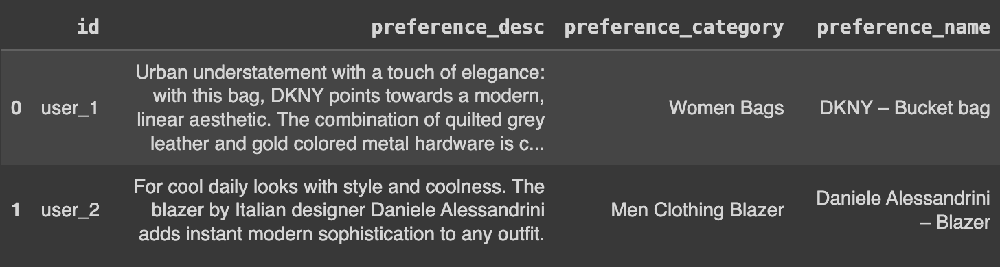
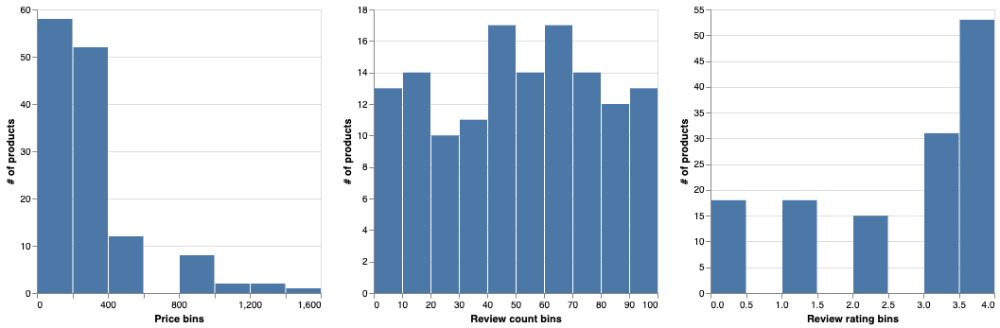
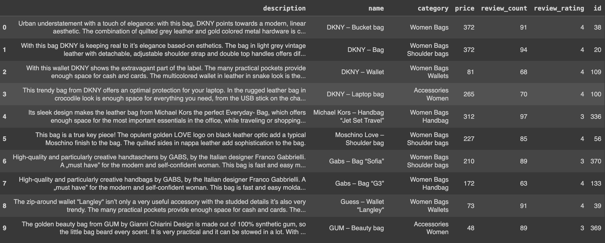
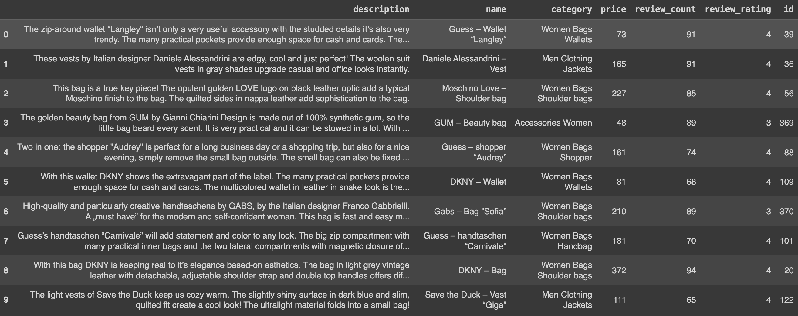
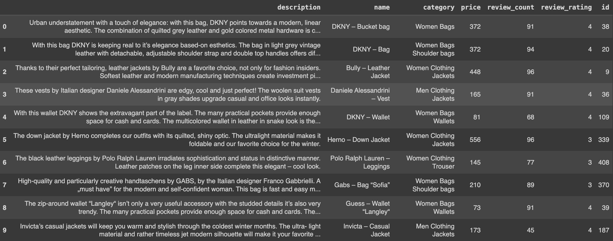
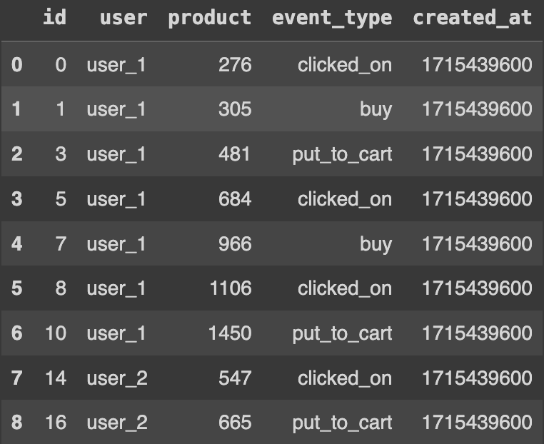
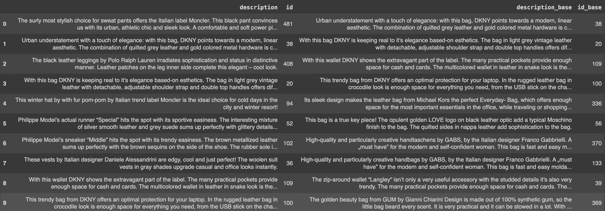
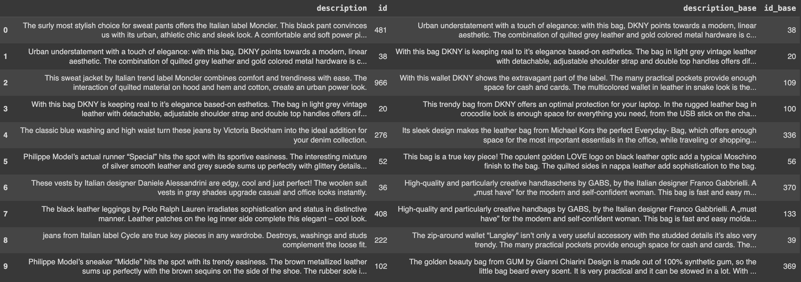

# Creating personalized, real-time recommendation systems with Superlinked

### - a [notebook](https://github.com/superlinked/superlinked/blob/main/notebook/recommendations_e_commerce.ipynb) article

Pioneered by the likes of Google and Airbnb, vector embedding has revolutionized recommendation systems by enabling more accuracy and personalization than traditional methods. By representing users and items as high-dimensional vectors in a latent space, embeddings capture similarities and relationships between users and items, and can therefore be used to provide more relevant recommendations. Their compact and dense nature facilitates efficient computation and scalability, which is vital for real-time and large-scale scenarios.

In this article, we'll walk you through how to use the Superlinked library to create an effective RecSys - specifically an e-commerce site selling mainly clothing, that can be updated in real-time employing feedback loops defined by user interactions.

## Achieving personalization despite RecSys vector embedding challenges

While vector embeddings can vastly improve recommendation systems, effectively implementing them requires addressing several challenges, including:
- **Quality and relevance**: The embedding generation process, architecture, and data must be carefully considered.
- **Sparse and noisy data**: Embeddings are less effective when they have incomplete or noisy input. Sparse data is the crux of the cold-start problem.
- **Scalability**: Efficient methods for large datasets are needed; otherwise, latency will be an issue.

Superlinked lets you address these challenges by combining all available data about users and products into rich multimodal vectors. In our e-commerce RecSys example below, we do this using the following Superlinked library elements:
- **min_max number Spaces**: for understanding customer reviews and pricing information
- **text-similarity Space**: for semantic understanding of product information
- **Events schema** and **Effects** to modify vectors
- **query time weights** - to define how you want the data to be treated when you run the query, letting you optimize and scale without re-embedding the whole dataset (latency)

By embedding our initially sparse user-specific data (the user's initial product preference), we can handle the cold-start problem. As user behavior accrues, we can go much further, *hyper*-personalizing recommendations by embedding this event data, creating a feedback loop that lets you update vectors with user preferences in real time. In addition, Superlinked's query time weights let you fine-tune your retrieval results, biasing them to match specific user preferences.

Let's get started.

## Building an e-commerce recommendation engine with Superlinked

At the start of development, we have the following **product data**:
- number of reviewers
- product ratings
- textual description
- name of product (usually containing brand name)
- category
  
We also have the following **data about users and products**:
- 1. each user chooses one of three products offered when they register (i.e., product preference data)
- 2. user behavior (*after* registration) provides additional event data - preferences for textual characteristics of products (description, name, category)

Also, classical economics tells us that, on average, all users ceteris paribus prefer products that:
  - cost less
  - have a lot of reviews
  - have higher ratings

We can set up our Spaces to take account of this data, so that our RecSys works in cold-start scenarios - recommending items for users we know very little about. Once our RecSys is up and running, we’ll also have behavioral data: users will click on certain products, buy certain products, etc. We can capture and use this event data to create feedback loops, updating our vectors to reflect user preferences and improving recommendation quality.

### Setting up Superlinked

First, we need to install the Superlinked library and import the classes.

```python
%pip install superlinked==6.0.0

import altair as alt
import os
import pandas as pd
import sys


from superlinked.framework.common.embedding.number_embedding import Mode
from superlinked.framework.common.schema.schema import schema
from superlinked.framework.common.schema.event_schema import event_schema
from superlinked.framework.common.schema.schema_object import String, Integer
from superlinked.framework.common.schema.schema_reference import SchemaReference
from superlinked.framework.common.schema.id_schema_object import IdField
from superlinked.framework.common.parser.dataframe_parser import DataFrameParser
from superlinked.framework.dsl.executor.in_memory.in_memory_executor import (
   InMemoryExecutor,
   InMemoryApp,
)
from superlinked.framework.dsl.index.index import Index
from superlinked.framework.dsl.index.effect import Effect
from superlinked.framework.dsl.query.param import Param
from superlinked.framework.dsl.query.query import Query
from superlinked.framework.dsl.source.in_memory_source import InMemorySource
from superlinked.framework.dsl.space.text_similarity_space import TextSimilaritySpace
from superlinked.framework.dsl.space.number_space import NumberSpace


alt.renderers.enable(get_altair_renderer())
pd.set_option("display.max_colwidth", 190)
```

We also define our datasets, and create a constant for storing the top 10 items - see [cell 3](https://github.com/superlinked/superlinked/blob/main/notebook/recommendations_e_commerce.ipynb) in the notebook.

Now that the library's installed, classes imported, and dataset locations identified, we can take a look at our dataset to inform the way we set up our Spaces. Initially, we have data from user registration - i.e,. which of three products user_1 and user_2 chose. We'll use this data to solve the cold-start problem.

```python
# the user preferences come from the user being prompted to select a product out of 3 - those will be the initial preferences
# this is done in order to give somewhat personalised recommendations
user_df: pd.DataFrame = pd.read_json(USER_DATASET_URL)
user_df
```



We can also set up a close examination of the distribution data of our products - see [cell 5](https://github.com/superlinked/superlinked/blob/main/notebook/recommendations_e_commerce.ipynb). This gives you a picture of how many products are at different price points, have different review counts, and have different ratings (including where the majority of products lie in these ranges).



The price bins for products are mostly below the $1000 price point. We may want to set the Space range to 25-1000 to make it representative, undistorted by outlier values. Products' review counts are evenly distributed, and review ratings relatively evenly distributed, so no additional treatment is required. See [cells 7-9](https://github.com/superlinked/superlinked/blob/main/notebook/recommendations_e_commerce.ipynb).

### Building out the index for vector search

Superlinked’s library contains a set of core building blocks that we use to construct the index and manage the retrieval. You can read about these building blocks in more detail [here](https://github.com/superlinked/superlinked/blob/main/notebook/feature/basic_building_blocks.ipynb).

Let’s put this library’s building blocks to use in our EComm RecSys. First you need to **define your Schema** to tell the system about your data.

```python
# schema is the way to describe the input data flowing into our system - in a typed manner
@schema
class ProductSchema:
   description: String
   name: String
   category: String
   price: Integer
   review_count: Integer
   review_rating: Integer
   id: IdField

@schema
class UserSchema:
   preference_description: String
   preference_name: String
   preference_category: String
   id: IdField

@event_schema
class EventSchema:
   product: SchemaReference[ProductSchema]
   user: SchemaReference[UserSchema]
   event_type: String
   id: IdField

# we instantiate schemas as follows
product = ProductSchema()
user = UserSchema()
event = EventSchema()
```

Next, you use Spaces to say how you want to treat each part of the data when embedding. In Space definitions, we describe how to embed inputs so that they reflect the semantic relationships in our data. Each Space is optimized to embed the data so as to return the highest possible quality of retrieval results. Which Spaces are used depends on your datatype.

```python
# textual inputs are embedded in a text similarity space powered by a sentence_transformers model
description_space = TextSimilaritySpace(
   text=[user.preference_description, product.description],
   model="sentence-transformers/all-distilroberta-v1",
)
name_space = TextSimilaritySpace(
   text=[user.preference_name, product.name],
   model="sentence-transformers/all-distilroberta-v1",
)
category_space = TextSimilaritySpace(
   text=[user.preference_category, product.category],
   model="sentence-transformers/all-distilroberta-v1",
)

# NumberSpaces encode numeric input in special ways to reflect a relationship
# here we express relationships to price (lower the better), or ratings and review counts (more/higher the better)
price_space = NumberSpace(
   number=product.price, mode=Mode.MINIMUM, min_value=25, max_value=1000
)
review_count_space = NumberSpace(
   number=product.review_count, mode=Mode.MAXIMUM, min_value=0, max_value=100
)
review_rating_space = NumberSpace(
   number=product.review_rating, mode=Mode.MAXIMUM, min_value=0, max_value=4
)

# create the index using the defined spaces
product_index = Index(
   spaces=[
       description_space,
       name_space,
       category_space,
       price_space,
       review_count_space,
       review_rating_space,
   ]
)

# parse our data into the schemas - not matching column names can be conformed to schemas using the mapping parameter
product_df_parser = DataFrameParser(schema=product)
user_df_parser = DataFrameParser(
   schema=user, mapping={user.preference_description: "preference_desc"}
)

# setup our application
source_product: InMemorySource = InMemorySource(product, parser=product_df_parser)
source_user: InMemorySource = InMemorySource(user, parser=user_df_parser)
executor: InMemoryExecutor = InMemoryExecutor(
   sources=[source_product, source_user], indices=[product_index]
)
app: InMemoryApp = executor.run()

# load the actual data into our system
source_product.put([products_df])
source_user.put([user_df])
```

Now that you’ve got your data defined in Spaces, you’re ready to play with your data and optimize the results. Let's first showcase *what we can do without events* - our cold-start solution.

### Tackling the RecSys cold-start problem

Here, we define a user query that searches with only the user's preference vector. We have configuration control over the importance (weights) of each input type (Space).

```python
user_query = (
   Query(
       product_index,
       weights={
           description_space: Param("description_weight"),
           name_space: Param("name_weight"),
           category_space: Param("category_weight"),
           price_space: Param("price_weight"),
           review_count_space: Param("review_count_weight"),
           review_rating_space: Param("review_rating_weight"),
       },
   )
   .find(product)
   .with_vector(user, Param("user_id"))
   .limit(Param("limit"))
)

# simple recommendations for our user_1
# these are based only on the initial product the user chose when first entering our site
simple_result = app.query(
   user_query,
   user_id="user_1",
   description_weight=1,
   name_weight=1,
   category_weight=1,
   price_weight=1,
   review_count_weight=1,
   review_rating_weight=1,
   limit=TOP_N,
)

simple_result.to_pandas()
```

The results of this query reflect the fact that user_1 chose a handbag when they first registered on our ecomm site.



It's also possible to recommend products to user_1 that are *generally* appealing - that is, based on their price being low, and having a lot of good reviews. Our results will now reflect both user_1's product choice at registration *and* the general popularity of products. (We can also play around with these weights to skew results in the direction of one Space or another.)

```python
general_result = app.query(
   user_query,
   user_id="user_1",
   description_weight=0,
   name_weight=0,
   category_weight=0,
   price_weight=1,
   review_count_weight=1,
   review_rating_weight=1,
   limit=TOP_N,
)

general_result.to_pandas() 
```



A new user's search introduces query text as an input for our recommendation results - see [cell 20](https://github.com/superlinked/superlinked/blob/main/notebook/recommendations_e_commerce.ipynb).

In our example case, user_1 searched for "women clothing jackets". We can optimize our results by giving **additional weight to the category space** (`category_weight = 10`), to recommend more “women clothing jackets” products.

```python
women_cat_result = app.query(
   search_query,
   user_id="user_1",
   query_text="women clothing jackets",
   description_weight=1,
   name_weight=1,
   category_weight=10,
   price_weight=1,
   review_count_weight=1,
   review_rating_weight=1,
   limit=TOP_N,
)

women_cat_result.to_pandas()
```

Our additional category weighting produces more women clothing results.



We can also bias our recommendations to top-rated products (`review_rating_weight=5`), balancing our increased category weighting. The results now reflect user_1's initial preference for handbags and items that are generally popular, while products with low ratings are removed altogether. See [cell 22](https://github.com/superlinked/superlinked/blob/main/notebook/recommendations_e_commerce.ipynb).

### Using events data to create personalized experiences

Fast-forward a month. Our users have interacted with our platform - user_1 more, user_2 less so. We can now utilize our users' **behavioral data** (see below), represented as events:
- a user interested in casual and leisure products (user_2)
- a user interested in elegant products for going out and formal work occasions (user_1)

```python
events_df = (
   pd.read_json(EVENT_DATASET_URL)
   .reset_index()
   .rename(columns={"index": "id"})
   .head(NROWS)
)
events_df = events_df.merge(
   products_df[["id"]], left_on="product", right_on="id", suffixes=("", "r")
).drop("idr", axis=1)
events_df = events_df.assign(created_at=1715439600)

events_df
```



Let's weight specific actions to register the user's level of interest in a particular product, and adjust the setup to take account of events when performing retrieval.

```python
event_weights = {
   "clicked_on": 0.2,
   "buy": 1,
   "put_to_cart": 0.5,
   "removed_from_cart": -0.5,
}

# adjust the setup to events
product_index_with_events = Index(
    spaces=[
        description_space,
        category_space,
        name_space,
        price_space,
        review_count_space,
        review_rating_space,
    ],
    effects=[
        Effect(
            description_space,
            event.user,
            event_weight * event.product,
            event.event_type == event_type,
        )
        for event_type, event_weight in event_weights.items()
    ]
    + [
        Effect(
            category_space,
            event.user,
            event_weight * event.product,
            event.event_type == event_type,
        )
        for event_type, event_weight in event_weights.items()
    ]
    + [
        Effect(
            name_space,
            event.user,
            event_weight * event.product,
            event.event_type == event_type,
        )
        for event_type, event_weight in event_weights.items()
    ],
)
event_df_parser: DataFrameParser = DataFrameParser(schema=event)
source_event: InMemorySource = InMemorySource(schema=event, parser=event_df_parser)
executor_with_events: InMemoryExecutor = InMemoryExecutor(
    sources=[source_product, source_user, source_event],
    indices=[product_index_with_events],
)
app_with_events: InMemoryApp = executor_with_events.run()
```

Now we create a new index to take account of user events, and then personalize recommendations to each user accordingly. Even queries only based on the user's vector are now much more personalized than before.

```python
# for a new index, all data has to be put into the source again
source_product.put([products_df])
source_user.put([user_df])
source_event.put([events_df])

# a query only searching with the user's vector the preferences are now much more personalised thanks to the events
personalised_query = (
   Query(
       product_index_with_events,
       weights={
           description_space: Param("description_weight"),
           category_space: Param("category_weight"),
           name_space: Param("name_weight"),
           price_space: Param("price_weight"),
           review_count_space: Param("review_count_weight"),
           review_rating_space: Param("review_rating_weight"),
       },
   )
   .find(product)
   .with_vector(user, Param("user_id"))
   .limit(Param("limit"))
)
```

We can observe the impact of incorporating events in our RecSys by weighting personalization *just slightly* or *heavily*. First, let's see the effect (compared to baseline) of weighting the Spaces that are influenced by these (behavioral data) events.

```python
# with small weight on event-affected spaces, we mainly just alter the results below position 4
general_event_result = app_with_events.query(
   personalised_query,
   user_id="user_1",
   description_weight=1,
   category_weight=1,
   name_weight=1,
   price_weight=1,
   review_count_weight=1,
   review_rating_weight=1,
   limit=TOP_N,
)

general_event_result.to_pandas().join(
   simple_result.to_pandas(), lsuffix="", rsuffix="_base"
)[["description", "id", "description_base", "id_base"]]
```

With very little weight placed on Spaces affected by events, we observe a change but mainly only in the latter half of our top 10, compared to the previous results ("id_base", on the right).



But if we weight the event-affected Spaces more heavily, we surface completely novel items in our recommendations list.

```python
# with larger weight on the event-affected spaces, more totally new items appear in the TOP10
event_weighted_result = app_with_events.query(
   personalised_query,
   user_id="user_1",
   query_text="",
   description_weight=5,
   category_weight=1,
   name_weight=1,
   price_weight=1,
   review_count_weight=1,
   review_rating_weight=1,
   limit=TOP_N,
)

event_weighted_result.to_pandas().join(
   simple_result.to_pandas(), lsuffix="", rsuffix="_base"
)[["description", "id", "description_base", "id_base"]]
```



We can also, of course, use weights to personalize our recommendations based on a particular user's behavior (event data) and *simultaneously prioritize other product attributes* - for example, price (see [cell 31](https://github.com/superlinked/superlinked/blob/main/notebook/recommendations_e_commerce.ipynb)).

## Conclusion

The eComm RecSys implementation of the Superlinked library (above) shows you how to realize the power of vector embeddings by incorporating the semantic meaning of user queries and behavioral data. Using our min_max number and text-similarity Spaces, Events schema and Effects, and query time weights, you can address the cold-start, quality and relevance, and scalability challenges of RecSys and provide highly accurate, user-personalized recommendations in production.

Now it's your turn! [Try implementing the Superlinked library yourself using our notebook](https://colab.research.google.com/github/superlinked/superlinked/blob/main/notebook/recommendations_e_commerce.ipynb).
