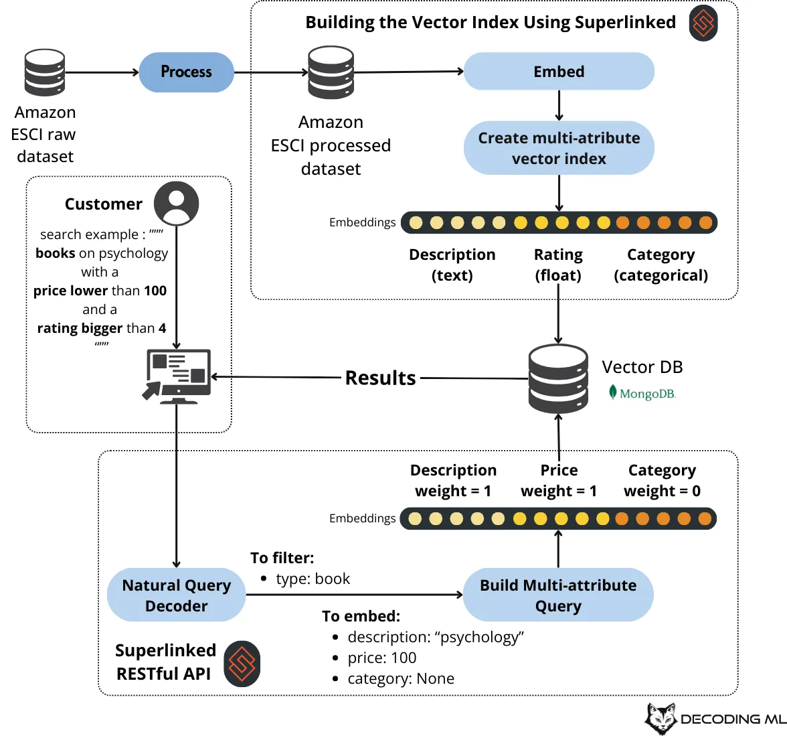

# Forget text-to-SQL: Use Natural Language E-commerce Search Instead

Search technology has evolved significantly – and so have user expectations, especially since the rise of GenAI chatbots like ChatGPT. Users searching for products in e-commerce used to try to match product keywords. Now they expect to be able to do their product searches in natural language. Just six months after the launch of ChatGPT, Algolia’s CTO reported observing “twice as many keywords per search query” on their search-as-a-service platform as before.

In this article, we’ll show you how to build a modern search system for e-commerce products using natural language queries that leverage context, rather than traditional text-to-SQL approaches that struggle with meaning.

## The Shortcomings of Traditional Search

Traditional keyword-based search with filters often fails to capture the meaning of complex queries that combine multiple attributes - like text descriptions, numerical data (eg. price), categorical information (eg. product type), and ratings. For example:

- "comfortable running shoes for marathon training under $150"
- "psychology books with high ratings under $100"
- "similar items to this product but cheaper"


## A Better Approach: Multi-attribute Vector Search

We can build a system that’s more flexible and effective than converting natural language to SQL queries (text-to-SQL), using:

1. Vector embeddings for all product attributes (i.e., text, numbers, categories)
2. Natural language query decomposition
3. Multi-dimensional vector search

### Key Components

1. Superlinked Framework: handles vector embeddings, indexing, and natural query processing
2. MongoDB Atlas: provides vector database capabilities
3. OpenAI: powers natural language understanding
4. Streamlit: offers a user interface



## How to Implement - An Overview

1. **Process your Product Data**: clean and prepare Amazon product data (title, description, price, ratings, etc.)
2. **Define your Schema**: define your product data structure using Superlinked's schema system, much like you would using Python data classes or Pydantic.

```python
from superlinked import framework as sl
from superlinked_app import constants

class ProductSchema(sl.Schema):
id: sl.IdField
type: sl.String
category: sl.StringList
title: sl.String
description: sl.String
review_rating: sl.Float
review_count: sl.Integer
price: sl.Float

product = ProductSchema()
```

3. **Create your Vector Embeddings**: Superlinked's approach lets us combine various types of data into a single vector index:
   - categories
   - text
   - numbers (floats and integers)
   - temporal data (supported, but not used in our example here)

```python
# Create similarity spaces for different attributes
category_space = sl.CategoricalSimilaritySpace(
    category_input=product.category,
    categories=constants.CATEGORIES,
    uncategorized_as_category=True,
    negative_filter=-1,
)
description_space = sl.TextSimilaritySpace(
    text=product.description,
    model="Alibaba-NLP/gte-large-en-v1.5"
)
review_rating_maximizer_space = sl.NumberSpace(
    number=product.review_rating,
    min_value=-1.0,
    max_value=5.0,
    mode=sl.Mode.MAXIMUM
)
price_minimizer_space = sl.NumberSpace(
    number=product.price,
    min_value=0.0,
    max_value=1000,
    mode=sl.Mode.MINIMUM
)
```

4. **Make an Index of your Multi-attribute vectors**

```python
product_index = sl.Index(
    spaces=[
        category_space,
        description_space,
        review_rating_maximizer_space,
        price_minimizer_space,
    ],
    fields=[product.type, product.category, product.review_rating, product.price],
)
```

5. **Process your Natural Language Queries**:

```python
semantic_query = (
    base_query
    .similar(description_space, text_param)
    .similar(price_space, price_param)
    .similar(rating_space, rating_param)
)
```

6. **Set up Search using API and Interface**:
   - Superlinked’s RESTful API exposes search functionality
   - Streamlit interface enables user interaction

## Benefits of Multi-attribute Search

1. **Natural Interaction**: Users can express complex search intentions in plain language
2. **Multi-attribute Understanding**: System comprehends relationships between different product attributes
3. **Flexible Architecture**: Easy to extend by adding new attributes, and easy to modify search behavior
4. **No unreliable SQL Complex queries**: text-to-SQL can’t reliably generate complex SQL queries

## For Example…

Using a multi-attribute vector search system, the query

```text
"psychology books with a price lower than 100 and a rating bigger than 4"
```

gets automatically decoded into:

```text
semantic search elements:
description="psychology"
price=100
rating=4
filters: type="book"
```

Our system then performs vector similarity search across all attributes simultaneously, providing more nuanced and relevant results than traditional filtering.

## How to Get Started

A complete implementation of this system is available on [GitHub](https://rebrand.ly/amazon-tabular-semantic-github). It includes:

- Data processing scripts
- Superlinked configuration
- API implementation
- Streamlit interface

## Conclusion

Combining vector embeddings and natural language processing is by far more intuitive and powerful than traditional text-to-SQL methods in handling the complexities of e-commerce search. Using a multi-attribute vector search platform like Superlinked’s, you can build modern search experiences that meet the expectations of 21st century e-commerce users, without the complexities and deficiencies of manual SQL query generation, or the overhead of maintaining a separate search index for each different attribute type.

Ready to try it out yourself? Superlinked is here to help you with your implementation. We also offer a fully-managed cloud service. Don’t hesitate to [get in touch](http://getdemo.superlinked.com/?utm_source=vh-paul-article)!

_This article is based on [Paul Iusztin](https://www.linkedin.com/in/pauliusztin/)’s tutorial on Decoding ML - check out the full version [here](https://decodingml.substack.com/p/forget-text-to-sql-use-this-natural)._
