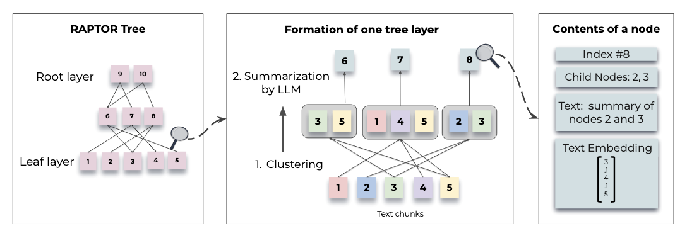
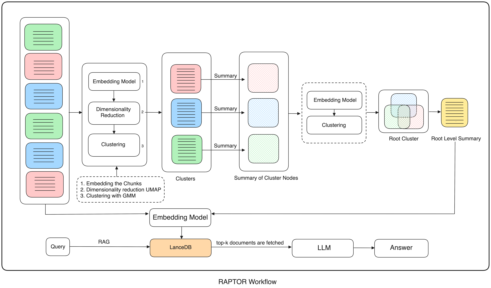
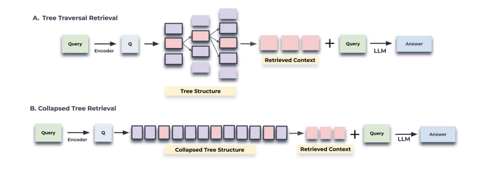
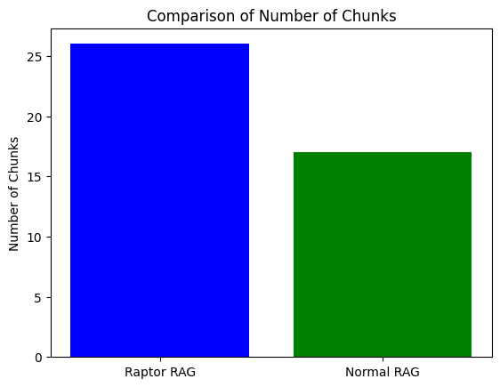
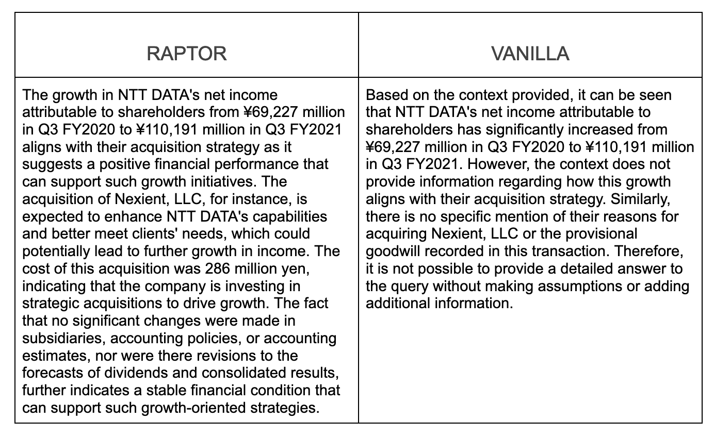

# Improving RAG with RAPTOR


Traditional [RAG](https://superlinked.com/vectorhub/articles/retrieval-augmented-generation) setups commonly split documents into fixed-size chunks. But this creates problems. If key concepts span multiple chunks, the embeddings can lose the semantic coherence of the original text. LLM queries that retrieve single chunks frequently _miss_ their relationship to crucial pieces of information buried inside other chunks. This leads to incomplete or misleading responses. **Because its chunk embeddings lack any weighting or hierarchical structure, traditional RAG's flat retrieval returns results based only on similarity or relevance scores. Key insights are often lost.**

So, **is there a way of getting our embeddings to preserve the relationships and hierarchical structure that exists within source documents, so that our retrieval can surface key insights, and do it efficiently**?

Yes! It's a form of semantic chunking called **hierarchical-cluster-embedding-based chunking**. Below, we'll look closely at a recent and innovative implementation of hierarchical clustering called [RAPTOR](https://arxiv.org/pdf/2401.18059) (Recursive Abstractive Processing for Tree Organized Retrieval). We'll walk you step-by-step through setting up RAPTOR RAG. Then we'll run an example query on a financial news document to evaluate **how RAPTOR performs against vanilla RAG**.

Let's get started!

## RAPTOR's basic steps

RAPTOR organizes information in a tree-like structure, progressively narrowing as it moves upwards, representing original documents at higher and higher levels of abstraction, so it can retain the original meaning in full. Let's break this into steps.



*Above: "Figure 1. Tree construction process" from the [RAPTOR paper](https://arxiv.org/pdf/2401.18059)*

**RAPTOR tree construction - basic steps:**

- **starting documents (leaves)**: RAPTOR first splits each raw document into chunks
- **embedding and clustering**: we embed these chunks ([RAPTOR authors](https://arxiv.org/pdf/2401.18059) use the UMAP dimensionality reduction algorithm to minimize chunk embedding size), and, based on their vector embeddings, cluster the chunks (using Gaussian Mixture Models (GMM) to generate distributions that consider the entire training space; each point can belong to more than one distribution) to ensure effective grouping of high-dimensional vector embeddings
- **summarizing clusters**: we summarize the clusters of similar chunks into a node of higher-level abstractions
- **recursive iteration**: we treat these nodes in turn as chunks, clustering them, summarizing these clusters, iteratively, building a tree-like structure that encapsulates the relationships and hierarchical structures inherent in the raw documents we started from



In short, RAPTOR chunks raw documents, embeds the chunks, groups embeddings into clusters, summarizes each cluster, then (recursively) chunks these summaries, embeds, summarizes again, and so on, moving upwards to a comprehensive and efficient data representation, preserving nuances and key points.

## Building a RAPTOR tree

Now that we’ve laid out RAPTOR's basic steps, let’s walk through how to *implement* a RAPTOR tree.

We start with our basic setup and imports.

```python
pip install lancedb scikit-learn openai torch sentence_transformers tiktoken umap-learn PyPDF2
```

```python
import os
import uuid
import tiktoken
import re
import numpy as np
import pandas as pd
import transformers
import torch
import umap.umap_ as umap
import matplotlib.pyplot as plt
from openai import OpenAI
from typing import List, Tuple, Optional, Dict
from sklearn.mixture import GaussianMixture
from sentence_transformers import SentenceTransformer

openai_api_key = "sk-XXXXXXXXXXXXXXX"
client = OpenAI(api_key=openai_api_key)
```

Note: Don't forget to input your open_ai_key above (we'll be using gpt-4 below).

### Creating the Chunks

First, create a directory_path to your source documents. To simplify things, our use case example will use just [one financial document](https://www.nttdata.com/global/en/-/media/nttdataglobal/1_files/investors/financial-results/2021/fy2021_fs_3q.pdf) as a source. You can of course load any source documents (and alter the query below) in your own experiments!

(Note: make sure you use an unencrypted version of this file to avoid errors when PyPDF2 tries to read the file.)

```python
directory_path = '/content/data'
if not os.path.exists(directory_path):
    os.makedirs(directory_path)
    print(f"Directory '{directory_path}' created successfully.")
else:
    print(f"Directory '{directory_path}' already exists.")
```

Now, let's break our text documents down into smaller chunks.

```python
import PyPDF2

# Function to extract text from a PDF file
def extract_pdf_text(file_path):
    with open(file_path, 'rb') as file:
        reader = PyPDF2.PdfReader(file)
        text = ""
        for page_num in range(len(reader.pages)):
            page = reader.pages[page_num]
            text += page.extract_text()
    return text

# Function to split text into chunks with overlap
def split_text(text, chunk_size=1000, chunk_overlap=50):
    chunks = []
    start = 0
    while start < len(text):
        end = min(start + chunk_size, len(text))
        chunks.append(text[start:end])
        start += chunk_size - chunk_overlap
    return chunks

# Function to process all PDFs in a directory
def process_directory(directory_path, chunk_size=1000, chunk_overlap=50):
    all_chunks = []
    # Iterate over all PDF files in the directory
    for filename in os.listdir(directory_path):
        if filename.endswith(".pdf"):
            file_path = os.path.join(directory_path, filename)
            print(f"Processing file: {file_path}")
            
            # Step 1: Extract text from the PDF
            pdf_text = extract_pdf_text(file_path)
            
            # Step 2: Split the extracted text into chunks
            chunks = split_text(pdf_text, chunk_size=chunk_size, chunk_overlap=chunk_overlap)
            
            # Append chunks from this file to the overall list
            all_chunks.extend(chunks)
    
    return all_chunks

directory_path = os.path.join(os.getcwd(), "data")  # Specify your directory path
chunk_size = 1000
chunk_overlap = 50

# Process all PDF files in the directory and get the chunks
chunks = process_directory(directory_path, chunk_size=chunk_size, chunk_overlap=chunk_overlap)

# Optional: Print the number of chunks and preview some of the chunks
print(f"Total number of chunks: {len(chunks)}")
for i, chunk in enumerate(chunks[:5]):  # Show first 5 chunks as a preview
    print(f"Chunk {i+1}:\n{chunk}\n")
```

Now that we have our chunks, let's move on and set up our embedding process, first by initializing our embedding model. We'll use `all-MiniLM-L6-v2` (Sentence Transformers), but you can choose any embedding model that fits your use case.

```python
embedding_model = SentenceTransformer('sentence-transformers/all-MiniLM-L6-v2')
```

### Hierarchical clustering and dimensionality reduction - setup

To preserve the essential structures and meaning of our data, we need to cluster it so we can easily access both its broad categories and its intricate details. One efficient way of doing this is with a **hierarchical clustering structure**. This is where UMAP comes in. Traditional clustering methods like Gaussian Mixture Models (GMM) often struggle with clustering high-dimensional data chunks. We can make things easier for our GMM by first using UMAP (Uniform Manifold Approximation and Projection) to simplify our data but preserve its essential structures.

UMAP's **`n_neighbors`** parameter dictates how much of the data's neighborhood UMAP considers during dimensionality reduction. Higher `n_neighbors` tells UMAP to look at many neighbors, maintaining the data's global structure and producing larger, more general clusters - **global clusters**. Lower `n_neighbors`, conversely, prompts UMAP to focus on close relationships, preserving local structure and forming smaller, more detailed, **local clusters**.

```python
def dimensionality_reduction(
    embeddings: np.ndarray,
    target_dim: int,
    clustering_type: str,
    metric: str = "cosine",
) -> np.ndarray:
    if clustering_type == "local":
        n_neighbors = max(2, min(10, len(embeddings) - 1))
        min_dist = 0.01
    elif clustering_type == "global":
        n_neighbors = max(2, min(int((len(embeddings) - 1) ** 0.5), len(embeddings) // 10, len(embeddings) - 1))
        min_dist = 0.1
    else:
        raise ValueError("clustering_type must be either 'local' or 'global'")

    umap_model = umap.UMAP(
        n_neighbors=n_neighbors,
        min_dist=min_dist,
        n_components=target_dim,
        metric=metric,
    )
    return umap_model.fit_transform(embeddings)
```

To determine the number of clusters that optimally captures our data's relationships and structure, we'll use the Elbow Method and the Bayesian Information Criterion (BIC). The Elbow Method plots explain variance against the number of clusters, helping us know when adding more clusters results in diminishing returns, while BIC evaluates models based on their fit to the data while penalizing complexity.

Once we've determined our `optimal_cluster_number`, we'll fit a GMM with it, predict the probability of each embedding belonging to each cluster, and assign labels to our embeddings.

```python
def compute_inertia(embeddings: np.ndarray, labels: np.ndarray, centroids: np.ndarray) -> float:
    return np.sum(np.min(np.sum((embeddings[:, np.newaxis] - centroids) ** 2, axis=2), axis=1))

def optimal_cluster_number(
    embeddings: np.ndarray,
    max_clusters: int = 50,
    random_state: int = SEED
) -> int:
    max_clusters = min(max_clusters, len(embeddings))
    number_of_clusters = np.arange(1, max_clusters + 1)
    inertias = []
    bic_scores = []
    
    for n in number_of_clusters:
        gmm = GaussianMixture(n_components=n, random_state=random_state)
        labels = gmm.fit_predict(embeddings)
        centroids = gmm.means_
        inertia = compute_inertia(embeddings, labels, centroids)
        inertias.append(inertia)
        bic_scores.append(gmm.bic(embeddings))
    
    inertia_changes = np.diff(inertias)
    elbow_optimal = number_of_clusters[np.argmin(inertia_changes) + 1]
    bic_optimal = number_of_clusters[np.argmin(bic_scores)]
    
    return max(elbow_optimal, bic_optimal)

def gmm_clustering(
    embeddings: np.ndarray, 
    threshold: float, 
    random_state: int = SEED
) -> Tuple[List[np.ndarray], int]:
    n_clusters = optimal_cluster_number(embeddings, random_state=random_state)
    gm = GaussianMixture(n_components=n_clusters, random_state=random_state, n_init=2)
    gm.fit(embeddings)
    probs = gm.predict_proba(embeddings)
    labels = [np.where(prob > threshold)[0] for prob in probs] 
    return labels, n_clusters  
```

So far, we've chunked our documents and defined functions - for embedding our chunks, reducing their dimensions using UMAP, and clustering them. Now let's set up the recursive hierarchical clustering that is RAPTOR's defining feature.

## Hierarchical clustering

To set up our hierarchical clustering, we define several functions:

- a clustering_algorithm function to manage both global and local clustering using GMMs - first globally, then locally within each global cluster (start with a broad overview, and then zoom in for more detailed clusters before summarizing)
- a generate_summary function to generate text summaries using a language model
- an embed clusters function to manage the embedding and initial clustering
- an embed cluster summaries function for summarizing each cluster
- a recursive_embedding_with_cluster_summarization function that leverages these methods to create a multi-level hierarchical clustering and summarization structure

```python
#define our clustering algorithm
def clustering_algorithm(
    embeddings: np.ndarray,
    target_dim: int,
    threshold: float,
    random_state: int = SEED
) -> Tuple[List[np.ndarray], int]:
    if len(embeddings) <= target_dim + 1:
        return [np.array([0]) for _ in range(len(embeddings))], 1
    
    # Global clustering
    reduced_global_embeddings = dimensionality_reduction(embeddings, target_dim, "global")
    global_clusters, n_global_clusters = gmm_clustering(reduced_global_embeddings, threshold, random_state=random_state)

    all_local_clusters = [np.array([]) for _ in range(len(embeddings))]
    total_clusters = 0

    # Local clustering within each global cluster
    for i in range(n_global_clusters):
        global_cluster_mask = np.array([i in gc for gc in global_clusters])
        global_cluster_embeddings = embeddings[global_cluster_mask]

        if len(global_cluster_embeddings) <= target_dim + 1:
            # Assign all points in this global cluster to a single local cluster
            for idx in np.where(global_cluster_mask)[0]:
                all_local_clusters[idx] = np.append(all_local_clusters[idx], total_clusters)
            total_clusters += 1
            continue

        try:
            reduced_local_embeddings = dimensionality_reduction(global_cluster_embeddings, target_dim, "local")
            local_clusters, n_local_clusters = gmm_clustering(reduced_local_embeddings, threshold, random_state=random_state)

            # Assign local cluster IDs
            for j in range(n_local_clusters):
                local_cluster_mask = np.array([j in lc for lc in local_clusters])
                global_indices = np.where(global_cluster_mask)[0]
                local_indices = global_indices[local_cluster_mask]
                for idx in local_indices:
                    all_local_clusters[idx] = np.append(all_local_clusters[idx], j + total_clusters)

            total_clusters += n_local_clusters
        except Exception as e:
            print(f"Error in local clustering for global cluster {i}: {str(e)}")
            # Assign all points in this global cluster to a single local cluster
            for idx in np.where(global_cluster_mask)[0]:
                all_local_clusters[idx] = np.append(all_local_clusters[idx], total_clusters)
            total_clusters += 1

    return all_local_clusters, total_clusters
    
 def generate_summary(context: str) -> str:
    prompt = f"""
    Provide the Summary for the given context. Here are some additional instructions for you:

    Instructions:
    1. Don't make things up, Just use the contexts and generate the relevant summary.
    2. Don't mix the numbers, Just use the numbers in the context.
    3. Don't try to use fancy words, stick to the basics of the language that is being used in the context.

    Context: {context}
    """
    response = client.chat.completions.create(
        model="gpt-4",
        messages=[
            {"role": "system", "content": "You are a helpful assistant that summarizes text."},
            {"role": "user", "content": prompt}
        ],
        max_tokens=200,
        n=1,
        stop=None,
        temperature=0.7
    )
    summary = response.choices[0].message.content.strip()
    return summary

def embed_clusters(
    texts: List[str],
    target_dim: int = 10,
    threshold: float = 0.1
) -> pd.DataFrame:
    textual_embeddings = np.array(embedding_model.encode(texts))
    clusters, number_of_clusters = clustering_algorithm(textual_embeddings, target_dim, threshold)
    print(f"Number of clusters: {number_of_clusters}")
    return pd.DataFrame({
        "texts": texts,
        "embedding": list(textual_embeddings),
        "clusters": clusters
    })

def embed_cluster_summaries(
    texts: List[str],
    level: int,
    target_dim: int = 10,
    threshold: float = 0.1
) -> Tuple[pd.DataFrame, pd.DataFrame]:
    df_clusters = embed_clusters(texts, target_dim, threshold)
    main_list = []
    
    for _, row in df_clusters.iterrows():
        for cluster in row["clusters"]:
            main_list.append({
                "text": row["texts"],
                "embedding": row["embedding"],
                "clusters": cluster
            })
    
    main_df = pd.DataFrame(main_list)
    unique_clusters = main_df["clusters"].unique()
    if len(unique_clusters) == 0:
        return df_clusters, pd.DataFrame(columns=["summaries", "level", "clusters"])

    print(f"--Generated {len(unique_clusters)} clusters--")

    summaries = []
    for cluster in unique_clusters:
        text_in_df = main_df[main_df["clusters"] == cluster]
        unique_texts = text_in_df["text"].tolist()
        text = "------\n------".join(unique_texts)
        summary = generate_summary(text)
        summaries.append(summary)

    df_summaries = pd.DataFrame({
        "summaries": summaries,
        "level": [level] * len(summaries),
        "clusters": unique_clusters
    })

    return df_clusters, df_summaries

def recursive_embedding_with_cluster_summarization(
    texts: List[str],
    number_of_levels: int = 3,
    level: int = 1,
    target_dim: int = 10,
    threshold: float = 0.1
) -> Dict[int, Tuple[pd.DataFrame, pd.DataFrame]]:
    if level > number_of_levels:
        return {}
    
    results = {}
    df_clusters, df_summaries = embed_cluster_summaries(texts, level, target_dim, threshold)
    results[level] = (df_clusters, df_summaries)
    
    if df_summaries.empty or len(df_summaries['clusters'].unique()) == 1:
        print(f"No more unique clusters found at level {level}. Stopping recursion.")
        return results
    
    if level < number_of_levels:
        next_level_texts = df_summaries['summaries'].tolist()
        next_level_results = recursive_embedding_with_cluster_summarization(
            next_level_texts, 
            number_of_levels, 
            level + 1,
            target_dim,
            threshold
        )
        results.update(next_level_results)
    
    return results
```

Now we define a process_text_hierarchy function that takes a hierarchical text dataset, processes it to generate embeddings and cluster summaries, and returns the processed results organized by hierarchical level.

```python
def process_text_hierarchy(
    texts: List[str], 
    number_of_levels: int = 3,
    target_dim: int = 10,
    threshold: float = 0.1
) -> Dict[str, pd.DataFrame]:
    hierarchy_results = recursive_embedding_with_cluster_summarization(
        texts, number_of_levels, target_dim=target_dim, threshold=threshold
    )
    
    processed_results = {}
    for level, (df_clusters, df_summaries) in hierarchy_results.items():
        if df_clusters.empty or df_summaries.empty:
            print(f"No data for level {level}. Skipping.")
            continue
        processed_results[f"level_{level}_clusters"] = df_clusters
        processed_results[f"level_{level}_summaries"] = df_summaries
    
    return processed_results

results = process_text_hierarchy(chunks, number_of_levels=3)
```

After several rounds of clustering and summarization, we have our RAPTOR tree.

### RAPTOR tree

- **leaf nodes (base level)** - at the tree's base, we have our original, unprocessed text chunks - the raw data inputs that RAPTOR RAG uses for analysis and retrieval
- **intermediate summary nodes** - moving up the tree, we cluster our chunks, and summarize the cluster, creating summary nodes - each summary node captures the meaning of the cluster it represents, facilitating efficient retrieval and accurate contextual understanding
- **hierarchical embeddings (multi-level summarization)** - each level above the base (leaf) has summary nodes capturing the meaning of lower level summary nodes, continuing until we reach the top (or root node) of the tree

With our RAPTOR tree built, starting from leaf nodes at the bottom and summarized nodes in between, it’s time to query the RAG.

### Our query example

For our use case we'll use a straightforward example - a query about financial news, aimed at understanding an increase in NTT DATA's net income attributable to shareholders:

```markdown
query = "NTT DATA's net income attributable to shareholders increased from ¥69,227 million in Q3 FY2020 to ¥110,191 million in Q3 FY2021. How does this growth align with their acquisition strategy, particularly considering their stated reasons for acquiring Nexient, LLC and the provisional goodwill recorded in this transaction?"
```

To keep things simple in our implementation, our data source will be [this pdf](https://www.nttdata.com/global/en/-/media/nttdataglobal/1_files/investors/financial-results/2021/fy2021_fs_3q.pdf).

Now that we have our query and raw source document, let's choose the right RAPTOR method for querying our RAPTOR tree.

### RAPTOR query methods

RAPTOR has two distinct strategies for querying the RAPTOR tree: tree traversal and collapsed tree.

1. **Tree traversal** method - traverses the tree layer by layer, first selecting the most relevant (top-k in query vector cosine similarity) root nodes, then (in the next layer) navigating each selected root node's children to again find the top-k most relevant nodes, continuing on until it reaches the leaf nodes (original text chunks). Then, it concatenates the text from all the selected nodes, returning it as the query result.

2. **Collapsed tree** method - flattens the tree into a single layer, directly comparing the query embedding to the vector embeddings of all the leaf nodes (the original text chunks) and summary nodes. For factual, keyword-based queries where you need specific details, collapsed tree returns more relevant and accurate results (with lower latency) than the tree traversal method.


*Above: "Figure 2: Illustration of the tree traversal and collapsed tree retrieval mechanisms" from the [RAPTOR paper](https://arxiv.org/pdf/2401.1805)*

If our query demanded complex multi-level reasoning, and a contextually rich and precise result, it would make sense to use tree traversal. But for specific queries requiring specific factual information - like our financial news query, we want to be able to directly compare our query embedding with the vector embeddings of all nodes (both leaf and summary), efficiently bypassing RAPTOR's hierarchical structure and going straight to the most relevant data points.

But even though the collapsed tree method's retrieval bypasses the RAPTOR tree's hierarchy, it still capitalizes on the RAPTOR tree's hierarchical encapsulation of meaning to retrieve context. Because the collapsed tree method treats summarized nodes from higher levels simply as additional (same level) chunks, we can pull in higher-level summaries (the global perspective) alongside granular details in just one pass. We want our retrieval to get both an overall perspective and pinpoint very specific details of a particular company's financial quarter.

For our purposes, the collapsed tree method is a better fit than tree traversal.

So how do we implement it?

## Implementing collapsed tree retrieval

Collapsed tree retrieval retrieves top-k nodes (highest cosine similarity to the query vector). To do this, we gather our original root document text chunks and summarized nodes at each level for all the clusters into one big list. Next, we embed all these data points, storing them in a [vector database](https://superlinked.com/vector-db-comparison), which we'll query with our RAG.

First, the embeddings.

```python
raptor_texts = []
for level, row in results.items():
    if level.endswith("clusters"):
        raptor_texts.extend(row["texts"])
    else:
        raptor_texts.extend(row["summaries"])
        
raptor_embeddings = embedding_model.encode(raptor_texts)
len(raptor_embeddings)
```

### Setting up vector database and RAG

Now, we set up a LanceDB vector database.

```python
raptor_embeddings = embedding_model.encode(raptor_texts)

raptor_dict = {"texts": [], "embeddings": []}
for texts, embeddings in zip(raptor_texts, raptor_embeddings):
    raptor_dict["texts"].append(texts)
    raptor_dict["embeddings"].append(embeddings.tolist())
```

```python
import lancedb
import pyarrow as pa
from lancedb.pydantic import Vector, LanceModel

uri = "lancedb_database"
db = lancedb.connect(uri)

class RAG(LanceModel):
    texts : str
    embeddings : Vector(384)

table_name = "rag_with_raptor"
raptor_table = db.create_table(table_name, schema = RAG, mode="overwrite")
raptor_table.add(rag_raptor_df)
raptor_table.create_fts_index("texts", replace=True)
```

Next, we define our results generation function...

```python
def generate_results(
    query : str,
    context_text : str
) -> str:

    prompt = f"""
    Based on the context provided, use it to answer the query. 

    query : {query}

    Instructions:
    1. Don't make things up, Just use the contexts and generate the relevant answer.
    2. Don't mix the numbers, Just use the numbers in the context.
    3. Don't try to use fancy words, stick to the basics of the language that is being used in the context.
    
    {context_text}
    """
    response = client.chat.completions.create(
        model="gpt-4", 
        messages=[
            {"role": "system", "content": "You are a helpful assistant that answers query and give the answers."},
            {"role": "user", "content": prompt}
        ],
        max_tokens=200,
        n=1,
        stop=None,
        temperature=0.7
    )
    answer = response.choices[0].message.content.strip()
    return answer
```

...and, finally, input our query.

```python
query = "NTT DATA's net income attributable to shareholders increased from ¥69,227 million in Q3 FY2020 to ¥110,191 million in Q3 FY2021. How does this growth align with their acquisition strategy, particularly considering their stated reasons for acquiring Nexient, LLC and the provisional goodwill recorded in this transaction?"
```

We want our retrieval to address our query's key points. First, we expect our retrieval to take account of the provided factual data regarding NTT DATA's increased shareholder income. Second, we need our retrieval to answer how this increase fits in with NTT Data's acquisition strategy (in particular the Nexient acquisition rationale). Let's keep these in mind when we examine our RAPTOR RAG results. For comparison purposes, we'll also create a vanilla (i.e., normal) RAG:

```python
normal_embeddings = embedding_model.encode(chunks) # default chunks from our data

normal_dict = {"texts": [], "embeddings": []}
for texts, embeddings in zip(chunks, normal_embeddings):
    normal_dict["texts"].append(texts)
    normal_dict["embeddings"].append(embeddings.tolist())
    
rag_normal_df = pd.DataFrame(normal_dict)

table_name = "rag_without_raptor"
normal_table = db.create_table(table_name, schema = RAG, mode="overwrite")
normal_table.add(rag_normal_df)
normal_table.create_fts_index("texts", replace=True)
```

Because we now have cluster-level summary nodes in addition to our original text chunks, our RAPTOR RAG has more chunks than our vanilla / normal RAG.



### How did our RAPTOR RAG do?

Let's generate and then compare and evaluate our results.

```python
raptor_contexts = raptor_table.search(query).limit(5).select(["texts"]).to_list()
raptor_context_text = "------\n\n".join([context["texts"] for context in raptor_contexts])
raptor_context_text = "------\n\n" + raptor_context_text

normal_contexts = normal_table.search(query).limit(5).select(["texts"]).to_list()
normal_context_text = "------\n\n".join([context["texts"] for context in normal_contexts])
normal_context_text = "------\n\n" + normal_context_text

raptor_answer = generate_results(query, raptor_context_text)
normal_answer = generate_results(query, normal_context_text)
```



RAPTOR RAG performed **better than vanilla RAG** at handling retrieval on our hierarchically chunked and embedded source document. RAPTOR retrieved specific details about NTT's financial growth for the specified quarter, and connected this growth to the broader acquisition strategy, pulling relevant context from our example [source document](https://www.nttdata.com/global/en/-/media/nttdataglobal/1_files/investors/financial-results/2021/fy2021_fs_3q.pdf). (Note: collapsed tree retrieval will _work well_ in this kind of use case - _a factual, keyword-based query requiring specific details_ - whether you have multiple source chunks or even many source documents.) Whereas, our vanilla RAG, while correctly identifying the specific details, failed to elucidate either NTT's strategy or a relationship between their quarterly growth, broader strategy, and the particular (Nexient) acquisition in question.

## Your turn

Now it's your turn to try out RAPTOR RAG! Here's the Google [colab](https://colab.research.google.com/github/superlinked/VectorHub/blob/main/docs/assets/use_cases/improve-rag-with-raptor/raptor_with_rag.ipynb).

To learn more about the intricacies of RAPTOR, check out their official [GitHub repository](https://github.com/parthsarthi03/raptor/tree/master). For an even deeper dive, we highly recommend the official [paper](https://arxiv.org/pdf/2401.18059)!

## Contributors

- [Vipul Maheshwari, author](https://www.linkedin.com/in/vipulmaheshwarii/)
- [Robert Turner, editor](https://www.linkedin.com/in/robertdhayanturner/)
