# Unlocking LLM Power with Organizational KG Ontologies

## Introduction
Large Language Models (LLMs) exploit the power of continuous representations of data in a vector space. They can orchestrate workflows, analyze data, write letters, generate code, and perform a wide variety of other complex tasks. Heavy investment in LLM development by big tech - Google, Amazon, Apple, Meta, Microsoft - is testament to LLM power.

The survival and well-being of organizations who work with AI depends on harnessing LLM power. To do this, **organizations working with AI have to solve two related data issues**. In addition to **(1) reducing LLM hallucinations and returning relevant, accurate results in their data products**, every AI organization needs to **(2) harness and protect (maintain organizational boundaries around) the goldmine of data it possesses**.

For both of these tasks, **Knowledge Graphs (KGs) with schema layers and ontologies can help**.

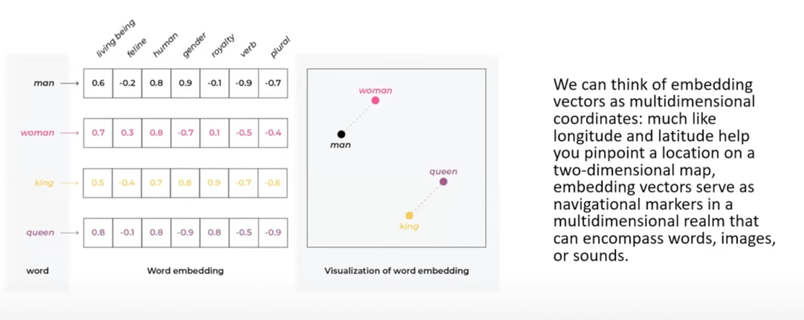
*Inset (left) - NLP Embeddings, illustrated by [Arize AI](https://arize.com/blog-course/embeddings-meaning-examples-and-how-to-compute)*

Indeed, if LLMs reflect one system of human thinking and data representation - continuous and fuzzy, “intuitive,” then KGs represent the other - discrete and reliable, ”abstract,” and knowable. KGs’ reliability and knowability allow them to reduce LLM hallucinations and efficiently return relevant, accurate results, and, in addition, harness and safeguard the inherent power of organizational data. All through connecting and consolidating (i.e., integrating) the data an organization already has, according to an ontology (i.e., common set of semantics).

## LLMs and KGs - the basics

To understand how KGs can work with LLMs to improve retrieval and harness organizational data, we need to first understand how LLMs work to represent data continuously, while KGs represent it discretely.

### LLMs and continuous data representation

Imagine a two-dimensional space (see diagram below), with fruitiness on the y-axis, and techiness on the x-axis. ‘Banana’ and ‘grape’ score high on fruitiness and low on techiness. Vice versa for ‘Microsoft’ and ‘Google’. ‘Apple,’ on the other hand, is more complex; it’s both a tech giant and a fruit. We need to add dimensions that capture more meaning and context to properly represent it. In fact, each term in an LLM typically occupies a unique position across thousands of dimensions, with each dimension representing a unique aspect of meaning. (Beyond two or three dimensions, a vector space becomes too complex for humans to comprehend.) Each word or word-part’s position in this “latent space” encodes its meaning.

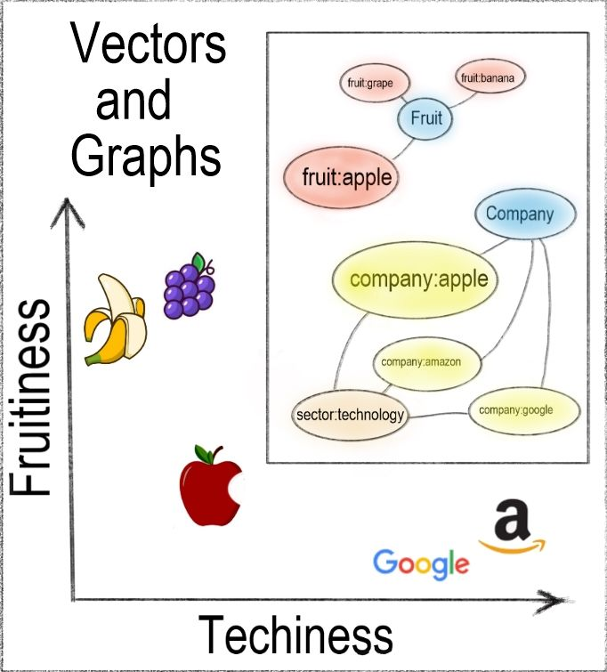
*Simplified representation of vector embeddings (on 2 dimensions) and (inset) knowledge graph*

An LLM is basically a compression of the web. The LLM reads docs on web, and tries to do next word prediction. It looks back using the transformer model to see how one word relates to another, and creates embedding vectors.

A vector is like a coordinate - e.g., the coordinate for “king” will “zoom” me to the coordinate position for “king”. But I can also take the embedding vector for king, take away the embedding vector for “man”, and add the embedding vector for “woman”, and this new coordinate will now zoom me to the position of queen. This is a very powerful way of representing these terms. It lets us capture and quantify relationships between data points when the data and relationships aren't explicitly defined - such as in natural language text or images. But the vector space is a continuous one; the coordinate (vector) will take me only *roughly (not precisely)* to the relevant area of the vector space.

So how does the representation of data in a Knowledge Graph differ from the representation of data in an LLM?

### KGs and discrete knowledge representation

Vector embeddings in LLMs are "fuzzy." “One fact or concept flows into the next in a continuous multi-dimensional space.” LLMs are powerful, flexible, but not always reliable, and ultimately incomprehensible. KGs, on the other hand, are precise and discrete. KGs make each data item into a distinct node, and connections between data items into discrete edges. KGs are less flexible than LLMs, but they are **reliable and explicable**.

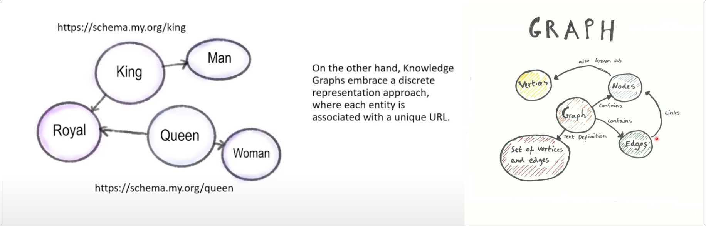

KGs are built for the integration of factual data. In addition to text (the domain of LLMs), KGs can easily capture data contained in tables, trees (e.g., json, xml), and images.

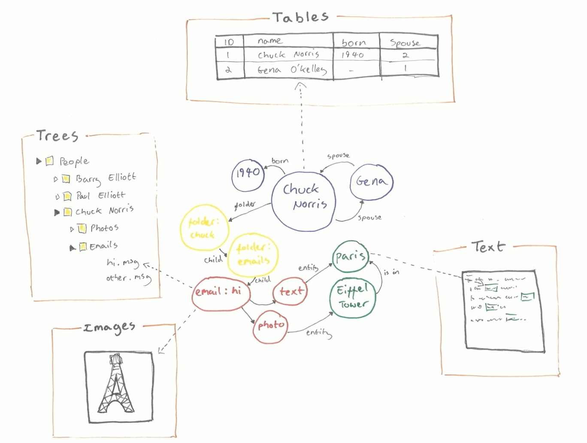

### Ontologies and schema layers

One of the keys to a knowledge graph’s power is its ontology. **The ontology makes the KG intelligible**, acting like a schema layer elucidating the KG's basic structure by defining the types of entities and relationships that can exist in the graph. We're familiar with the concept of schemas in the context of relational databases, where a table contains data, and the schema (metadata) describes the columns of that table. In knowledge graphs, on the other hand, _everything_ is considered data, allowing seamless movement between metadata and data. Knowledge graphs use a representation of knowledge that's more powerful than a schema. KGs use an ontology.

A KG ontology is a formal and abstract representation of the graph's data. It typically contains the rules, axioms, and constraints governing the entities, attributes, and relationships (including complex ones like inheritance and polymorphism) within the graph. A good ontology has a clear, semantic framework that makes the data's logical structure clear and easier to understand. It  
tries to model concepts as they exist in the real world, using familiar business language. This helps both humans and machines in making their searches more precise. It also permits the inference of new knowledge from existing facts through logical reasoning.

The ontological capabilities of knowledge graphs enable them to understand your organization's fundamental concepts. KGs, by treating metadata as data, permit you to seamlessly connect those concepts to real data. As organizations' futures increasingly come to depend on providing AI with a clear understanding of organizational semantics and data, KGs are becoming more and more indispensible.

## Using KGs for organization survival

In our competitive data landscape, your organization's use of KGs can help it survive.
How?

1) You can use KGs in your organization’s data products (both internal and client-facing), to insert ontological context into LLM prompts - thereby reducing hallucination and returning relevant, accurate results.
2) You can unify the organization’s data into a comprehensive organizational KG, you can A) protect the organization’s data, and, B) on an organizational scale, realize your data's latent power.

Let’s take a closer look at each of these, in turn.

### 1) Use a KG to insert ontological context into the prompt

A question comes in. That question can be referred back to classes in the ontology or facts in the KG (e,g., in your organizational repository). These classes or facts can be injected into the context of the prompt of the LLM, influencing the way the LLM responds. This is Retrieval Augmented Generation (RAG).

RAG adds context to your queries using the node descriptions contained in the KG. In almost every KG, each node has a short RDFS (Resource Description Framework Schema) label description and a longer DC (Dublin Core) description. The RDFS is a human readable description of a node’s URI. The DC metadata elements include title, creator, subject, description, etc., and are often represented in the URI itself. We can do a direct query and pull out every single node's description, then do a call out to openAI to get an embedding vector for each of those descriptions.

In its simplest form, RAG employs the basic, step-by-step approach to connecting a KG to an LLM outlined below.

Here's how you do it:

**Extract relevant nodes**

```python
# Begin by pulling all the nodes that you wish to index from your Knowledge Graph, including their descriptions:

rows = rdflib_graph.query('SELECT * WHERE {?uri dc:description ?desc}')
```

**Generate embedding vectors**

```python
# Employ your large language model to create an embedding vector for the description of each node:

node_embedding = openai.Embedding.create(input = row.desc, model=model) ['data'][0]['embedding']
```

**Build a vector store**

```
# Store the generated embedding vectors in a dedicated vector store:

index = faiss.IndexFlatL2(len(embedding))
index.add(embedding)
```

**Query with natural language**

```
# When a user poses a question in natural language, convert the query into an embedding vector using the same language model. Then, leverage the vector store to find the nodes with the lowest cosine similarity to the query vector:

question_embedding = openai.Embedding.create(input = question, model=model) ['data'][0]['embedding']
d, i = index.search(question_embedding, 100)
```

**Semantic post-processing**

```
# To further enhance the user experience, apply post-processing techniques to the retrieved related nodes. This step refines the results and presents information in a way that best provides users with actionable insights.
```

For **example**, I pass the description text from my KG for the “Jennifer Aniston” node into my LLM, and now can store the fact that my discrete KG node (representing “Jennifer Aniston”) relates to the Jennifer Aniston textual description in embedding vector space (in the LLM). After this, when a user comes and does a query for “Jennifer Aniston”, I can turn the query into an embedding vector, locate the closest embedding vectors in the continuous vector space, and then find the related node within the discrete KG, and return a relevant result.

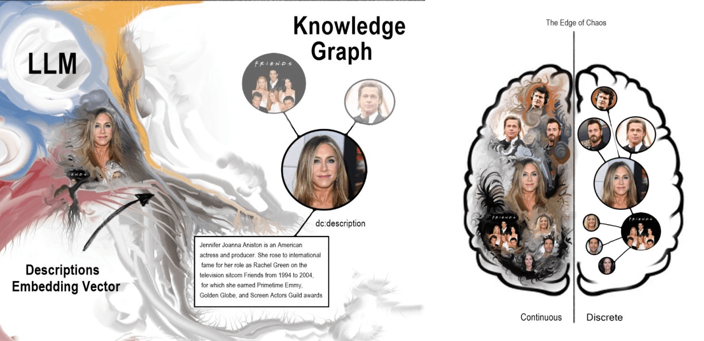

Because you have control over and can modify your KG, you can limit your query results to exclude / reduce hallucination, and improve result precision and accuracy.

Great! But in addition to 1) using your KG to insert context into your prompts (above), you can also harness and protect (maintain organizational boundaries around) the goldmine of data your corporation is sitting on by 2) creating a unified organizational KG using schema.org, and connecting it to your LLM.

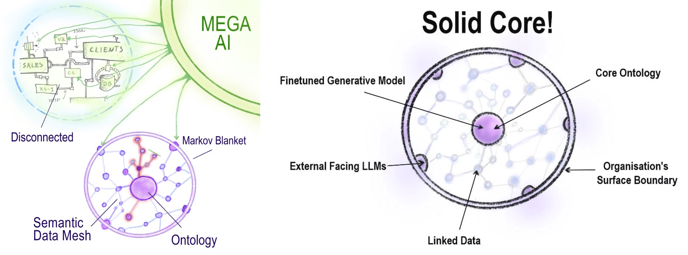

### 2) Create a unified organizational KG, and connect it to an LLM

KGs can harness and protect (maintain organizational boundaries around) the value of your organization's data. Most organizations don't possess the kind of vast ocean of data that a data-rich internet platform like Google or Amazon does. But most organizations' data resources amount to more than enough to train AI on, data resources that should be protected (and unified, in place). Using a cellular analogy, an organization should erect a cellular membrane - i.e., a data boundary that contains and selectively (safely) exposes its proprietary data products. The cellular membrane contains the organization’s semantic data mesh.

This organizational semantic data mesh should be powered by organizational KGs that enable the organization to use LLMs to realize and capture the free energy bound up in the chaotic jumble of its databases. An organization’s KGs (structured by the organization’s ontology) can act as a kind of Markov Blanket - the minimal subset of variables containing all the information needed to infer / predict a target random variable (i.e., next term prediction) - anything that’s useful for organizational purposes. It lets you query your organizational data, and gain more control over it.

With the blanket / membrane in place, an AI organization can safely expose - i.e., distribute - selected parts of its internal network-shaped data (a large connected graph), at the membrane surface. Having a well-defined ontology can enable your organization to use its KG to securely cooperate with other organizations, and maintain private networks with informational boundaries.

**Creating a unified organizational KG using schema.org**

**Any organization can use schema.org to create a unified KG with their own data resources**, thereby integrating them in a comprehensible, defined way - i.e., in a schema layer with an ontology (which can be amended as needed) that represents the connections between data items. Schema.org is maintained by the JSON-LD Working Group, is open source, and can be [downloaded from github](https://github.com/schemaorg/schemaorg), and then secured behind a firewall within your organization.

Currently, **over 44% of the web takes advantage of the power of KG schemas by tagging data items with JSON-LDs** (Javascript Object Notation for Linked Data). Every data item tagged in this way can be connected to others that have been similarly tagged.

For example, if I want to indicate that Jane Doe and John Smith are colleagues, I can do it using their JSON-LDs, and obtain a distributed graph. Simplified, such a graph would look like this:

Jane Doe <--- Colleagues ---> John Smith

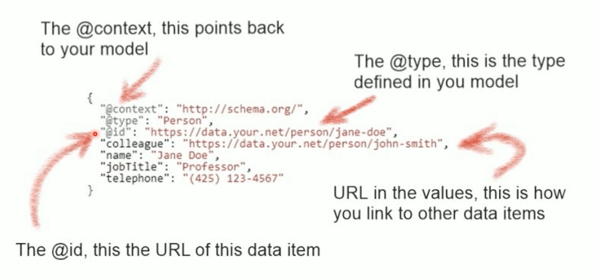

Each island of JSON-LD points back to schema.org, with contributions from a broad community. **Schema.org has a common set of schemas for things people mostly search for on the web** - e.g., products, flights, bookings. For example, if I search for a specific recipe on google, I get very specific results based on the google knowledge graph constructed from islands of JSON-LDs.

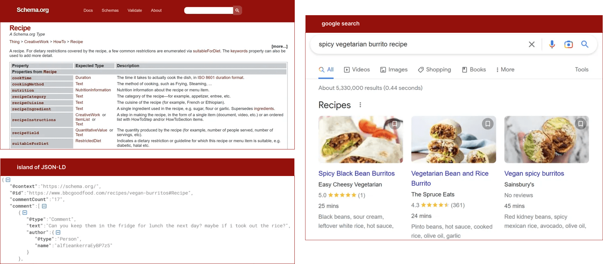

To create **your organization's schema layer**, first, register an internal schema domain within your organization - e.g., https://schema.your.org. This site will host your organization's semantics - the core concepts that are most relevant to the specifics of your business. Use industry standards. You can take schema.org’s base types as your starting model. If you're a bank, your semantics will include “trade”, “risk”, and "fraud"; if you’re a railway, “tracks” and “trains”; if you’re a hospital, “patients”, “beds”, "diseases", and “medicines”. Remember, your objective is to make your organization's useful data readable and therefore searchable by query.

In almost every KG, each node has a short RDFS (Resource Description Framework Schema) label description and a longer DC (Dublin Core) description. The RDFS is a human readable description of a node’s URI. The DC metadata elements include title, creator, subject, description, etc., and are often represented in the URI itself. We can do a direct query and pull out every single node's description, then do a call out to openAI to get an embedding vector for each of those descriptions.

To build your corporate KG, therefore, we start with each department of your organization mapping its data in RDF format.

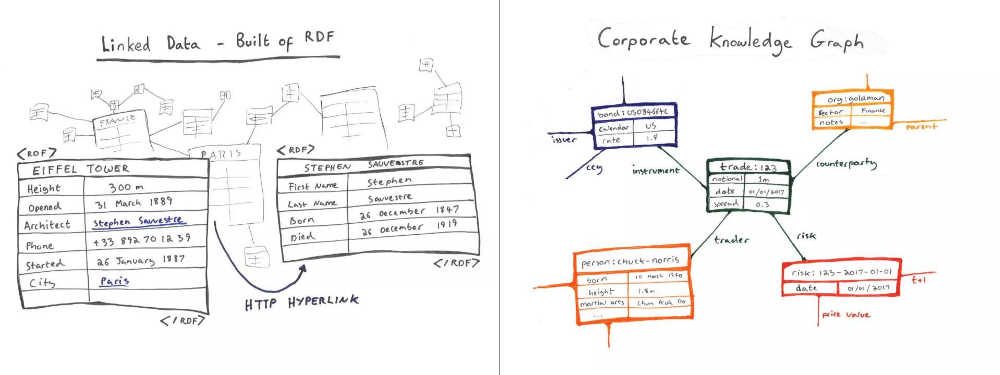

Take for example, "trade". Each department in your organization takes on the task of mapping its "trade"-related data and putting it in RDF format. If you give a URI (which is, functionally, a URL on the web) to each and every data item, it becomes globally identifiable. By identifying each data item in RDF format, it can be a data node, and a unique network address.

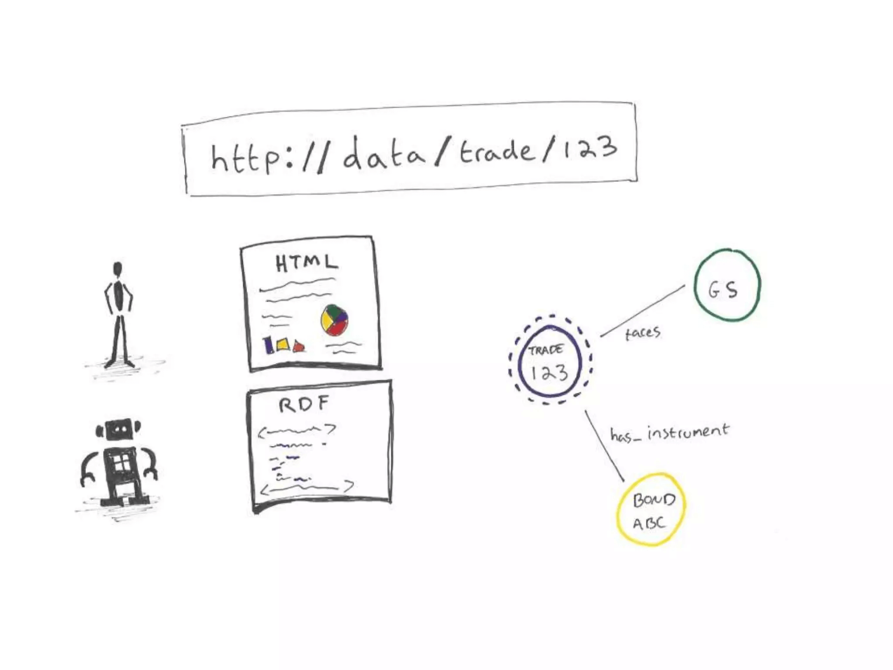

Embed the definitions salient to your own particular business into your own version of schema.org, sticking as close as possible to the actual, working semantics of the real people in your business. In a large organization, there’ll be between 5000-100000 separate apps and databases, each with 1000s of different tables, each table with 100s of different columns - in sum, a vast complex of data. 

Each department's data can be made available as a webAPI to your central data department, and represented in JSON-LD. Your central data department can then publish the data in each application or database in JSON-LD. As long as each deparment has referenced the well-defined semantics in your schema.org, you will have a good, queryable organizational KG.

Your organizational KG should not be treated as a new database. Rather, for each use case, you need only download the chunk of the graph (pre-connected, pre-integrated) that you want. In other words, “within your organization, let a thousand knowledge graphs bloom.”


### Completing your Organizational KG - the data catalog

To realize the full potential of your organizational KG, you need to a way of making sure it represents the data assets of all departments of your organization. It needs to incorporate a **data catalog**. The data catalog inventories your data assets, to facilitate data management and use (data discovery, collaboration and knowledge sharing, quality and metadata management, etc.). Each semantic data product/department within the organization should publish a catalog of its data - whatever might be of value to other departments and the organization as a whole. Once every department has published their own data catalog, collect and connect them together via a schema, incorporating it into the organizational KG.

Your organizational KG enables you to go from this:

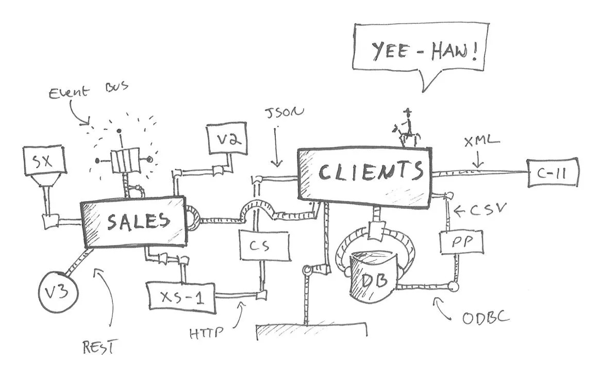

...to this:

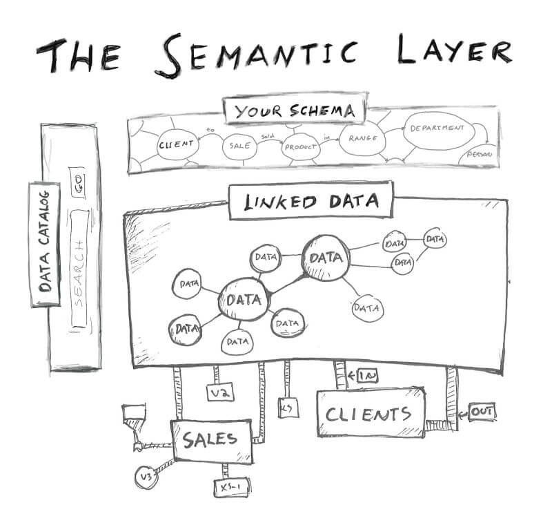

Through the semantic layer, I can use concepts - both general and particular to my business - to access organizational data in a graph format.

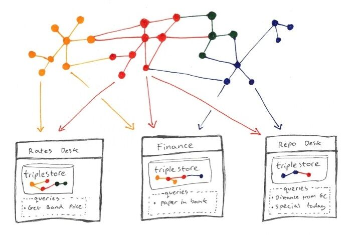


## Conclusion

Your comprehensive organizational KG, connected to an instance of an LLM, can protect and realize the full value of your organization’s data. Connecting your KG to an LLM can:

1) enrich your own data, providing more comprehensive information,
2) achieve semantic interoperability - your data can be understood not just by your organization but across different systems that recognize the URIs,
3) provide more complete views of entities represented by the well-known URIs,
4) improve the ability to query your data, using the URIs as hooks to pull in relevant data from various sources, and
5) maintain consistency and standardization in your data.

In sum, KGs present an organizational opportunity to companies who work with LLMs. They provide a way of ameliorating LLM hallucinations, but also a method for unifying the trove of data your organization houses but whose potential benefits you probably don't yet fully realize. By building a strong ontology and schema layer in your KG, you indicate the classes, relationships, and attributes that are priorities for you. You can then use your KG (its discrete representation of your priorities) to more judiciously harness the power of an LLM’s continuous vector space to improve, protect, and develop your data and data products.

## Contributors

- [Tony Seale, Author](https://www.linkedin.com/in/tonyseale/)
- [Robert Turner, Contributor](https://www.linkedin.com/in/robertdhayanturner/)
