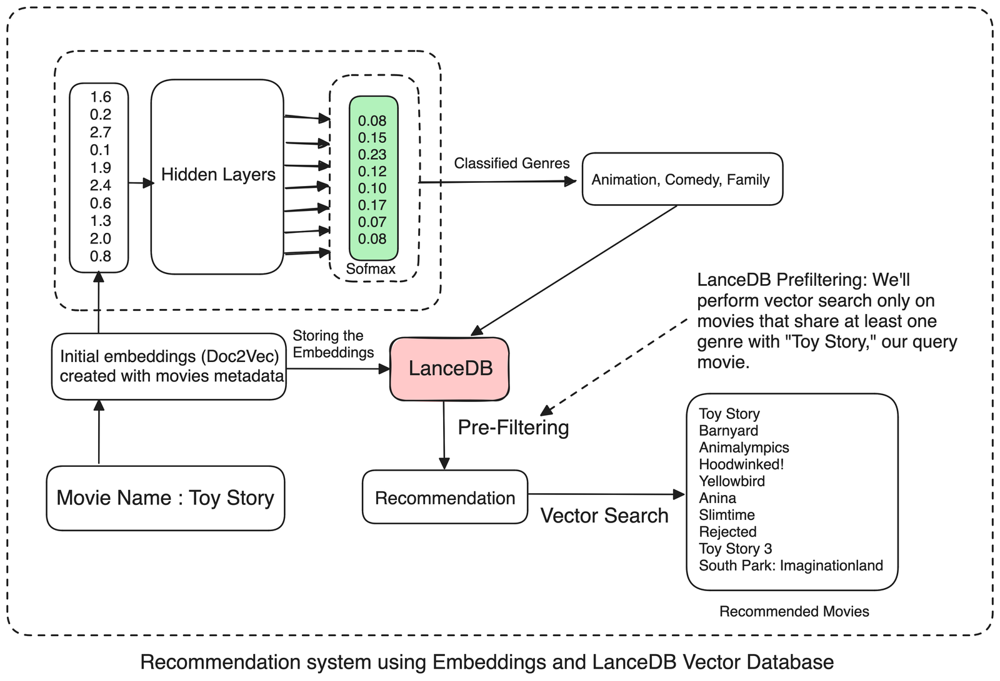
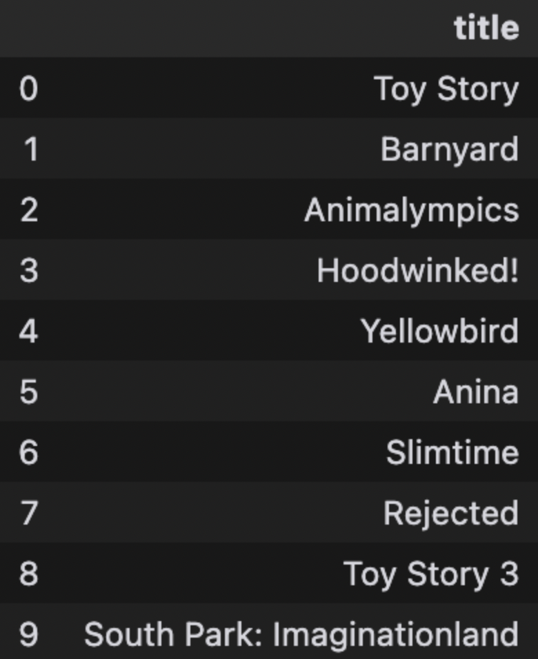

# Movie Recommendations using a Vector Database

This article presents a comprehensive guide to creating an effective movie recommendation system using vector similarity search, multi-label genre classification, and a vector database that allows us to streamline the whole process.

Here's how we'll proceed:
1. Data ingestion and preprocessing techniques for movie metadata
2. Training a Doc2Vec model for generating embeddings
3. Training a neural network for genre classification
4. Using Doc2Vec, LanceDB vector database, and the trained classifier to surface relevant recommendations

Let's get started!

## Why use embeddings for recommendation systems?

Scrolling through movie streaming platforms can seem futile. What's the point if nothing they recommend looks interesting? Building quality recommendation systems, it turns out, is not easy. RecSys is complex - it has to optimize for multiple (sometimes conflicting) objectives, and there is no *one* metric that fully captures the recommendation quality.

Below, we'll walk you through how to produce high quality recommendations, by 1) **creating high-dimensional embeddings** as input to a genre classification model, and 2) **leveraging a vector database** that enables us to efficiently store and query our embeddings. The following architecture gives you an overview of the processes underlying our RecSys.



## Data ingestion and preprocessing techniques for movie metadata

Movie recommendation systems can leverage various types of data to create meaningful embeddings, including plot summaries, cast and crew information, user ratings, release dates, and more. But to demonstrate more clearly and simply how an embedding-based RecSys works, we'll focus on creating embeddings using solely the movie's title and genre data. By combining these two key pieces of information, we can generate recommendations that suggest movies with similar genres and titles.

First, we gather and organize movie data. For this, we use a robust dataset from [Kaggle](https://www.kaggle.com/datasets/rounakbanik/the-movies-dataset) that has information from various sources for approximately 45,000 movies. You can download the data (`movies_metadata.csv`) from Kaggle and put it inside your working directory. (If you need additional data, supplement the dataset by extracting movie info from platforms like Rotten Tomatoes, IMDb, or even box-office records.)

Next, we extract core details from the dataset and generate a universal summary for each movie.  

We begin by combining the movie's title and genre into a single textual string. This text will then be tagged to create `TaggedDocument` instances, which we'll use later to train the Doc2Vec model.

Before moving forward, let's install the relevant libraries:

```python
pip install torch scikit-learn pylance lancedb nltk gensim lancedb scipy==1.12
```

Next, we'll ingest and preprocess our data. To simplify the process, we'll work with chunks of 1000 movies at a time, and include only movie indices with non-null values for genres and titles, to ensure that we're analyzing exclusively high-quality, relevant data.

```python
import pandas as pd
import numpy as np
from gensim.models.doc2vec import Doc2Vec, TaggedDocument
from nltk.tokenize import word_tokenize
from tqdm import tqdm

import torch
import torch.nn as nn
import torch.optim as optim
from torch.utils.data import DataLoader, TensorDataset
from sklearn.preprocessing import MultiLabelBinarizer
from sklearn.model_selection import train_test_split

import nltk
nltk.download('punkt') 

# Read data from CSV file
movie_data = pd.read_csv('movies_metadata.csv', low_memory=False)
movie_data.dropna(subset=['genres', 'title'], inplace=True)  # Ensure no missing genres or titles
modified_movie_data = movie_data[movie_data['genres'].apply(lambda x: len(eval(x)) > 0 if isinstance(x, str) else False)]
modified_movie_data = modified_movie_data.drop_duplicates(subset='title')
print(f"Modified movie data shape : {modified_movie_data.shape}")

device = torch.device('cuda' if torch.cuda.is_available() else 'cpu')

def preprocess_data(movie_data_chunk):
    movie_info = []
    data = []

    for i in range(len(movie_data_chunk)):
        title = movie_data_chunk.iloc[i]['title']
        genres = movie_data_chunk.iloc[i]['genres']
        
        try:
            movies_text = ''
            genres_list = eval(genres)
            genre_names = ', '.join([genre['name'] for genre in genres_list])
            movies_text += "Genres: " + genre_names + '\n'
            movies_text += "Title: " + title + '\n'
            data.append(movies_text)
            movie_info.append((title, genre_names))
        
        except Exception as e:
            continue

    return data, movie_info

# Preprocess data and extract genres for the first 1000 moviesbat
batch_size = 1000
movie_info = []
complete_data = []
for chunk_start in tqdm(range(0, len(modified_movie_data), batch_size), desc="Processing chunks..."):
    movie_data_chunk = modified_movie_data.iloc[chunk_start:chunk_start+batch_size]
    chunk_movie_data, chunk_movie_info = preprocess_data(movie_data_chunk)
    movie_info.extend(chunk_movie_info)
    complete_data.extend(chunk_movie_data)

# preprocess the documents, and create TaggedDocuments
tagged_data = [TaggedDocument(words=word_tokenize(doc.lower()),
                              tags=[str(i)]) for i,
               doc in enumerate(complete_data)]
```

## Generating embeddings using Doc2Vec

While it's possible to use an off-the-shelf model (e.g., sentence_transformers), we've opted for a custom Doc2Vec model so we can make transparent how embeddings work at the document or paragraph level. Our Doc2Vec model will generate embeddings for each movie based on the preprocessed text (title and genre data).

```python
def train_doc2vec_model(tagged_data, num_epochs=10):
    doc2vec_model = Doc2Vec(vector_size=100, min_count=2, epochs=num_epochs)
    doc2vec_model.build_vocab(tqdm(tagged_data, desc="Building Vocabulary"))
    for epoch in range(num_epochs):
        doc2vec_model.train(tqdm(tagged_data, desc=f"Epoch {epoch+1}"), total_examples=doc2vec_model.corpus_count, epochs=doc2vec_model.epochs)
    
    return doc2vec_model

doc2vec_model = train_doc2vec_model(tagged_data)
doc2vec_model.save("doc2vec_model")
document_vectors = [doc2vec_model.infer_vector(
    word_tokenize(doc.lower())) for doc in complete_data]
```

The `train_doc2vec_model` function trains a Doc2Vec model on the tagged movie data, producing 100-dimensional embeddings for each movie. These embeddings act as input features for the neural network. With our current training setup, we are certain that movies with similar genres will be positioned closer to each other in the latent space, reflecting their thematic and content similarities.

## Extracting unique genre labels

To compile the names of relevant movies along with their genres, we use a tool called `MultiLabelBinarizer` that transforms genres into a more comprehensible format for analysis: 0s and 1s. If a movie belongs to a particular genre (e.g., drama', 'comedy', 'horror'), the `MultiLabelBinarizer` will assign it a 1; if it doesn't, a 0. Movies can of course belong to several genres at once. After the conversion to binary encoding, each row in our dataset will indicate all of the specific genres each movie belongs to.

Take "Top Gun Maverick", for example. The movie is categorized in the 'drama' genre, not 'comedy' or 'horror'. The `MultiLabelBinarizer` represents Top Gun Maverick as: Drama: 1, Comedy: 0, Horror: 0. We apply `MultiLabelBinarizer` to all the movies in our dataset.

## Training a NN for genre_classification

We'll define a neural network consisting of four linear layers with ReLU activations. The final layer uses softmax activation to generate probability scores for various genres. If your objective is classification within the genre spectrum (inputting a movie description to determine its genres), you can establish a threshold value for the multi-label softmax output. This selects the top 'n' genres with the highest probabilities.

Here are the neural network class, hyperparameter settings, and corresponding model training loop:

```python
import numpy as np
import pandas as pd
import torch
import torch.nn as nn
import torch.optim as optim
from torch.utils.data import DataLoader, TensorDataset
from sklearn.preprocessing import MultiLabelBinarizer
from sklearn.model_selection import train_test_split

genres_list = []
for i, row in modified_movie_data.iterrows():
    genres = [genre['name'] for genre in eval(row['genres'])]
    genres_list.append(genres)

mlb = MultiLabelBinarizer()
genre_labels = mlb.fit_transform(genres_list)

embeddings = []
for i, doc in enumerate(complete_data):
    embeddings.append(document_vectors[i])

X_train, X_test, y_train, y_test = train_test_split(embeddings, genre_labels, test_size=0.2, random_state=42)

X_train_np = np.array(X_train, dtype=np.float32)
y_train_np = np.array(y_train, dtype=np.float32)
X_test_np = np.array(X_test, dtype=np.float32)
y_test_np = np.array(y_test, dtype=np.float32)

X_train_tensor = torch.tensor(X_train_np)
y_train_tensor = torch.tensor(y_train_np)
X_test_tensor = torch.tensor(X_test_np)
y_test_tensor = torch.tensor(y_test_np)

class GenreClassifier(nn.Module):
    def __init__(self, input_size, output_size):
        super(GenreClassifier, self).__init__()
        self.fc1 = nn.Linear(input_size, 512)
        self.bn1 = nn.BatchNorm1d(512)
        self.fc2 = nn.Linear(512, 256)
        self.bn2 = nn.BatchNorm1d(256)
        self.fc3 = nn.Linear(256, 128)
        self.bn3 = nn.BatchNorm1d(128)
        self.fc4 = nn.Linear(128, output_size)
        self.relu = nn.ReLU()
        self.dropout = nn.Dropout(p=0.2)  # Adjust the dropout rate as needed

    def forward(self, x):
        x = self.fc1(x)
        x = self.bn1(x)
        x = self.relu(x)
        x = self.dropout(x)
        x = self.fc2(x)
        x = self.bn2(x)
        x = self.relu(x)
        x = self.dropout(x)
        x = self.fc3(x)
        x = self.bn3(x)
        x = self.relu(x)
        x = self.dropout(x)
        x = self.fc4(x)
        return x

# Move model to the selected device
model = GenreClassifier(input_size=100, output_size=len(mlb.classes_)).to(device)

# Define loss function and optimizer
criterion = nn.BCEWithLogitsLoss()
optimizer = optim.Adam(model.parameters(), lr=0.001)

# Training loop
epochs = 20
batch_size = 64

train_dataset = TensorDataset(X_train_tensor.to(device), y_train_tensor.to(device))
train_loader = DataLoader(train_dataset, batch_size=batch_size, shuffle=True)

for epoch in range(epochs):
    model.train()
    running_loss = 0.0
    for inputs, labels in train_loader:
        inputs, labels = inputs.to(device), labels.to(device)  # Move data to device
        optimizer.zero_grad()
        outputs = model(inputs)
        loss = criterion(outputs, labels)
        loss.backward()
        optimizer.step()
        running_loss += loss.item() * inputs.size(0)
    epoch_loss = running_loss / len(train_loader.dataset)
    print(f'Epoch [{epoch + 1}/{epochs}], Loss: {epoch_loss:.4f}')
```

That's it! We've successfully trained a neural network for our genre classification task.

You can check how well the model is classifying genres, using the `f-1_score`, as follows:

```python
from sklearn.metrics import f1_score

model.eval()
with torch.no_grad():
    X_test_tensor, y_test_tensor = X_test_tensor.to(device), y_test_tensor.to(device)  # Move test data to device
    outputs = model(X_test_tensor)
    test_loss = criterion(outputs, y_test_tensor)
    print(f'Test Loss: {test_loss.item():.4f}')


thresholds = [0.1] * len(mlb.classes_)
thresholds_tensor = torch.tensor(thresholds, device=device).unsqueeze(0)

# Convert the outputs to binary predictions using varying thresholds
predicted_labels = (outputs > thresholds_tensor).cpu().numpy()

# Convert binary predictions and actual labels to multi-label format
predicted_multilabels = mlb.inverse_transform(predicted_labels)
actual_multilabels = mlb.inverse_transform(y_test_np)

# Print the Predicted and Actual Labels for each movie
for i, (predicted, actual) in enumerate(zip(predicted_multilabels, actual_multilabels)):
    print(f'Movie {i+1}:')
    print(f'    Predicted Labels: {predicted}')
    print(f'    Actual Labels: {actual}')


# Compute F1-score
f1 = f1_score(y_test_np, predicted_labels, average='micro')
print(f'F1-score: {f1:.4f}')

# Saving the trained model
torch.save(model.state_dict(), 'trained_model.pth')
```

## Implementing our movie RecSys

To complete our movie recommendation system, we next set up our system so that users can input a movie title as a query. After this, our system retrieves Doc2Vec embeddings from our vector database, then uses similarity metrics such as cosine similarity or determines smallest Euclidian distances - to identify and recommend 'n' number of movies whose embeddings closely resemble those of the user's query movie, based on its genre/s.

### Setting up our vector DB

We're using [LanceDB](https://lancedb.com/) vector database because it's open source, fast, has high-level security (our data is local), versioning, and built-in search capabilities. We store our Doc2Vec embeddings along with the corresponding titles and genres as a table (`doc2vec_embeddings`) within our LanceDB database. Each row in the table represents a unique movie, with columns for the movie’s title, genres, and the calculated Doc2Vec embedding.

```python
import lancedb
import numpy as np
import pandas as pd

data = []

for i in range(len(movie_info)):  # Iterate over movie_info, not modified_movie_data
    embedding = document_vectors[i]
    title, genres = movie_info[i]  # Correctly access title and genres from movie_info
    data.append({"title": title, "genres": genres, "vector": embedding})

db = lancedb.connect(".db")
tbl = db.create_table("doc2vec_embeddings", data, mode="Overwrite")
db["doc2vec_embeddings"].head()
```

### Using Doc2Vec embeddings to surface relevant recommendations

For a given query movie, we first get our trained neural network to predict its genres. We then filter our movie database (using an appropriate SQL filter) to include only those movies that belong to at least one of the predicted genres. Next, we perform a vector similarity search on this filtered subset, retrieving the most similar movies based on their vector representations. This approach ensures that our movie recommendations will be relevant and personalized - our suggestions will be not only similar in terms of their vector characteristics but also share genre preferences with the query movie.

```python
# Function to get genres for a single movie query
def get_genres_for_query(model, query_embedding, mlb, thresholds, device):
    model.eval()
    with torch.no_grad():
        query_tensor = torch.tensor(query_embedding, dtype=torch.float32).unsqueeze(0).to(device)
        outputs = model(query_tensor)
        thresholds = [0.001] * len(mlb.classes_)
        thresold_tensor = torch.tensor(thresholds, device=device).unsqueeze(0)
        predicted_labels = (outputs >= thresold_tensor).cpu().numpy()
        predicted_multilabels = mlb.inverse_transform(predicted_labels)
        return predicted_multilabels


def movie_genre_prediction(movie_title):
    movie_index = modified_movie_data.index[modified_movie_data['title'] == movie_title].tolist()[0]
    query_embedding = document_vectors[movie_index]
    predicted_genres = get_genres_for_query(model, query_embedding, mlb, [0.1] * len(mlb.classes_), device=device)
    return predicted_genres
```

Our RecSys is now complete. Let's test it by generating some recommendations, using "Toy Story" as our query.

```python
def get_recommendations(title):
    pd_data = pd.DataFrame(data)
    title_vector = pd_data[pd_data["title"] == title]["vector"].values[0]
    predicted_genres = movie_genre_prediction(title)
    genres_movie = predicted_genres[0]  # Assuming predicted_genres is available

    genre_conditions = [f"genres LIKE '%{genre}%'" for genre in genres_movie]
    where_clause = " OR ".join(genre_conditions)

    result = (
        tbl.search(title_vector)
        .metric("cosine")
        .limit(10)
        .where(where_clause)
        .to_pandas()
    )
    return result[["title"]]

get_recommendations("Toy Story")
```



By combining vector similarity search, multi-label genre classification, and a high performing vectorDB, we've built an intuitive RecSys that efficiently surfaces relevant movie suggestions for our user!

## Contributors

- [Vipul Maheshwari, author](https://www.linkedin.com/in/vipulmaheshwarii)
- [Mór Kapronczay, editor](https://www.linkedin.com/in/mór-kapronczay-49447692)
- [Robert Turner, editor](https://www.linkedin.com/in/robertdhayanturner)
