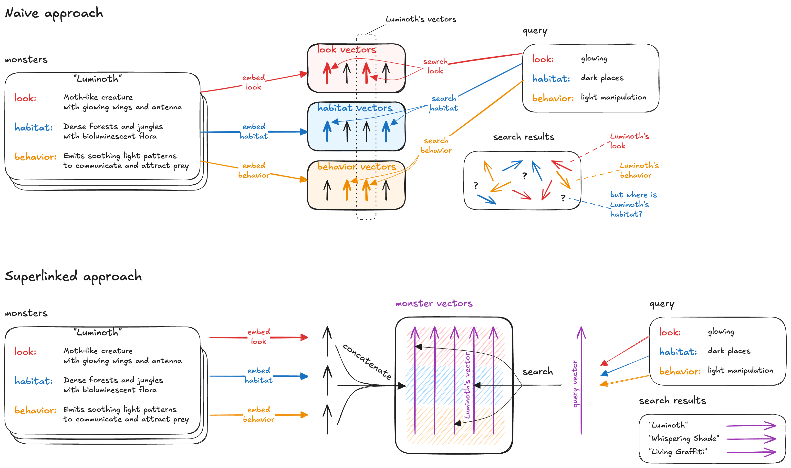

# Multi-attribute search with vector embeddings

## Why do multi-attribute vector search?

[Vector search](https://superlinked.com/vectorhub/building-blocks/vector-search/introduction) represents a revolution in information retrieval. Vector embedding - by taking account of context and semantic meaning - empowers vector search to return more relevant and accurate results, handle not just structured but also unstructured data and multiple languages, and scale. But to generate high quality responses in real-world applications, we often need to assign different weights to specific attributes of our data objects.

There are two common approaches to multi-attribute vector search. In both approaches, we start by embedding each attribute of a data object separately. The main difference between these two approaches is in how our embeddings are *stored* and *searched*.

1. the *naive* approach - store each attribute vector in separate vector stores (one per attribute), perform a separate search for each attribute, combine search results, and post-process (e.g., weight) as required.
2. the *Superlinked* approach - concatenate and store all attribute vectors in the same vector store (using Superlinked's built-in funtionality), which allows us to *search just once*, with attendant efficiency gains. Superlinked's `spaces` *also* let us weight each attribute at query time to surface more relevant results, with no post-processing.



Below, we'll use these two approaches to implement a multi-attribute vector search tool - a Dungeons and Dragons monster finder! Our simple implementations, especially the second, will illustrate how to create more powerful and flexible search systems, ones that can handle complex, multi-faceted queries with ease, whatever your use case.

If you're new to vector similarity search, don't worry! We've got you covered - check out our [building blocks articles](https://superlinked.com/vectorhub/building-blocks).

Okay, let's go monster hunting!

## A Dungeons & Dragons use case

It's game night, your friends are perched around the games table, waiting to see what Dungeons & Dragons (D&D) character they'll become and quest they'll embark on. Tonight, you're Dungeon Master (storyteller and guide), crafter of thrilling encounters to challenge and enthrall your players. Your trusty D&D Monster Manual contains *thousands* of creatures. Finding the perfect monster for each situation among the myriad options can be overwhelming. The ideal foe needs to match the setting, difficulty, and narrative of the moment.

What if we could create a tool that instantly finds the monster most suited to each scenario? A **tool that considers multiple factors simultaneously**, ensuring each encounter is as immersive and exciting as possible?

Let's embark on a quest of our own: build the ultimate monster-finding system, using the power of multi-attribute vector search!

## Dataset

First, we'll generate a small synthetic dataset of monsters, by prompting a Large Language Model (LLM):

```
Generate two JSON lists: 'monsters' and 'queries'.

1. 'monsters' list: Create 20 unique monsters with the following properties:
   - name: A distinctive name
   - look: Brief description of appearance (2-3 sentences)
   - habitat: Where the monster lives (2-3 sentences)
   - behavior: How the monster acts (2-3 sentences)

   Ensure some monsters share similar features while remaining distinct.

2. 'queries' list: Create 5 queries to search for monsters:
   - Each query should be in the format: {look: "...", habitat: "...", behavior: "..."}
   - Use simple, brief descriptions (1-3 words per field)
   - Make queries somewhat general to match multiple monsters

Output format:
{
  "monsters": [
    {"name": "...", "look": "...", "habitat": "...", "behavior": "..."},
    ...
  ],
  "queries": [
    {"look": "...", "habitat": "...", "behavior": "..."},
    ...
  ]
}
```

Let's take a look at a sample of the dataset our LLM generated. Note: LLM generation is non-deterministic, so your results may differ.

Here are our first five monsters:

|    | name | look&nbsp;&nbsp;&nbsp;&nbsp;&nbsp;&nbsp;&nbsp;&nbsp;&nbsp;&nbsp;&nbsp;&nbsp;&nbsp;&nbsp;&nbsp;&nbsp;&nbsp;&nbsp;&nbsp;&nbsp;&nbsp;&nbsp;&nbsp;&nbsp;&nbsp;&nbsp; | habitat&nbsp;&nbsp;&nbsp;&nbsp;&nbsp;&nbsp;&nbsp;&nbsp;&nbsp;&nbsp;&nbsp;&nbsp;&nbsp;&nbsp;&nbsp;&nbsp;&nbsp;&nbsp; | behavior&nbsp;&nbsp;&nbsp;&nbsp;&nbsp;&nbsp;&nbsp;&nbsp;&nbsp;&nbsp;&nbsp;&nbsp;&nbsp;&nbsp;&nbsp;&nbsp;&nbsp;&nbsp;&nbsp;&nbsp;&nbsp; |
| ---: | :--- | :--- | :--- | :--- |
|  0 | Luminoth | Moth-like creature with glowing wings and antenna | Dense forests and jungles with bioluminescent flora | Emits soothing light patterns to communicate and attract prey |
|  1 | Aqua Wraith | Translucent humanoid figure made of flowing water | Rivers, lakes, and coastal areas | Shapeshifts to blend with water bodies and controls currents |
|  2 | Stoneheart Golem | Massive humanoid composed of interlocking rock formations | Rocky mountains and ancient ruins | Hibernates for centuries, awakens to protect its territory |
|  3 | Whispering Shade | Shadowy, amorphous being with glowing eyes | Dark forests and abandoned buildings | Feeds on fear and whispers unsettling truths |
|  4 | Zephyr Dancer | Graceful avian creature with iridescent feathers | High mountain peaks and wind-swept plains | Creates mesmerizing aerial displays to attract mates |

...and our generated queries:

|    | look | habitat | behavior |
|---:|:---|:---|:---|
|  0 | glowing | dark places | light manipulation |
|  1 | elemental | extreme environments | environmental control |
|  2 | shapeshifting | varied landscapes | illusion creation |
|  3 | crystalline | mineral-rich areas | energy absorption |
|  4 | ethereal | atmospheric | mind influence |

See original dataset and query examples [here](https://github.com/superlinked/article-multi-attribute-search).

## Retrieval

Let's set up parameters we'll use in both of our approaches - naive and Superlinked - below.

We generate our vector embeddings with `sentence-transformers/all-mpnet-base-v2`. For simplicity's sake, we'll limit our output to the top 3 matches. (For complete code, including necessary imports and helper functions, see the [notebook](https://github.com/superlinked/article-multi-attribute-search/blob/main/notebook.ipynb).)

```python
LIMIT = 3
MODEL_NAME = "sentence-transformers/all-mpnet-base-v2"
```

Now, let's get our multi-attribute monster search under way! First, we'll try the *naive* approach.

### Naive approach

In our naive approach, we embed attributes independently and store them in different indices. At query time, we run multiple kNN-searches on all the indices, and then combine all our partial results into one.

We start by defining a class `NaiveRetriever` to perform similarity-based search on our dataset, using our `all-mpnet-base-v2`-generated embeddings.

```python
class NaiveRetriever:
    def __init__(self, data: pd.DataFrame):
        self.model = SentenceTransformer(MODEL_NAME)
        self.data = data.copy()
        self.ids = self.data.index.to_list()
        self.knns = {}
        for key in self.data:
            embeddings = self.model.encode(self.data[key].values)
            knn = NearestNeighbors(metric="cosine").fit(embeddings)
            self.knns[key] = knn

    def search_key(self, key: str, value: str, limit: int = LIMIT) -> pd.DataFrame:
        embedding = self.model.encode(value)
        knn = self.knns[key]
        distances, indices = knn.kneighbors(
            [embedding], n_neighbors=limit, return_distance=True
        )
        ids = [self.ids[i] for i in indices[0]]

        similarities = (1 - distances).flatten()
        # by definition:
        # cosine distance = 1 - cosine similarity

        result = pd.DataFrame(
            {"id": ids, f"score_{key}": similarities, key: self.data[key][ids]}
        )
        result.set_index("id", inplace=True)

        return result

    def search(self, query: dict, limit: int = LIMIT) -> pd.DataFrame:
        results = []
        for key, value in query.items():
            if key not in self.knns:
                continue
            result_key = self.search_key(key, value, limit=limit)
            result_key.drop(columns=[key], inplace=True)
            results.append(result_key)

        merged_results = pd.concat(results, axis=1)
        merged_results["score"] = merged_results.mean(axis=1, skipna=False)
        merged_results.sort_values("score", ascending=False, inplace=True)
        return merged_results

naive_retriever = NaiveRetriever(df.set_index("name"))
```

Let's use the first query from our generated list above, and search for monsters using our `naive_retriever`:

```python
query = {
    'look': 'glowing',
    'habitat': 'dark places',
    'behavior': 'light manipulation'
}

naive_retriever.search(query)
```

Our `naive_retriever` returns the following search results for each attribute:

**Look: glowing**
| id               |   score_look | look                                              |
|:-----------------|-------------:|:--------------------------------------------------|
| Whispering Shade |     0.503578 | Shadowy, amorphous being with glowing eyes        |
| Sandstorm Djinn  |     0.407344 | Swirling vortex of sand with glowing symbols      |
| Luminoth         |     0.378619 | Moth-like creature with glowing wings and antenna |

Awesome! Our returned monster results are relevant - they all have some "glowing" characteristic.

Let's see what the naive approach returns when we search the other two attributes.

**Habitat: dark places**
| id                  |   score_habitat | habitat                              |
|:--------------------|----------------:|:-------------------------------------|
| Whispering Shade    |        0.609567 | Dark forests and abandoned buildings |
| Fungal Network      |        0.438856 | Underground caverns and damp forests |
| Thornvine Elemental |        0.423421 | Overgrown ruins and dense jungles    |

**Behavior: light manipulation**
| id                |   score_behavior | behavior                                                       |
|:------------------|-----------------:|:---------------------------------------------------------------|
| Living Graffiti   |         0.385741 | Shapeshifts to blend with surroundings and absorbs pigments    |
| Crystalwing Drake |         0.385211 | Hoards precious gems and can refract light into powerful beams |
| Luminoth          |         0.345566 | Emits soothing light patterns to communicate and attract prey  |

All the retrieved monsters do possess the wanted attributes. At first glance, the naive search results may seem promising. But we need to find monsters that possess *all three attributes simultaneously*. Let's merge our results to see how well our monsters do at achieving this goal:

| id                  |   score_look |   score_habitat |   score_behavior |
|:--------------------|-------------:|----------------:|-----------------:|
| Whispering Shade    |     0.503578 |        0.609567 |                  |
| Sandstorm Djinn     |     0.407344 |                 |                  |
| Luminoth            |     0.378619 |                 |         0.345566 |
| Fungal Network      |              |        0.438856 |                  |
| Thornvine Elemental |              |        0.423421 |                  |
| Living Graffiti     |              |                 |         0.385741 |
| Crystalwing Drake   |              |                 |         0.385211 |

And here, the limits of the naive approach become obvious. Let's evaluate:

1. Relevance by attribute:
   - "Look": Three monsters were retrieved (Whispering Shade, Sandstorm Djinn, and Luminoth).
   - "Habitat": Only one monster from the "Look" results was relevant (Whispering Shade).
   - "Behavior": Only one monster from the "Look" results was relevant (Luminoth), but it's different from the one relevant for "Habitat".

2. Overall relevance:
   - No single monster was retrieved for all three attributes simultaneously.
   - The results are fragmented: different monsters are relevant for different attributes.

In short, the naive search approach fails to find monsters that satisfy all criteria at once. **Maybe we can fix this issue by proactively retrieving more monsters for each attribute?** Let's try it with 6 monsters per attribute, instead of 3. Let's take a look at what this approach generates:

| id                  |   score_look |   score_habitat |   score_behavior |
|:--------------------|-------------:|----------------:|-----------------:|
| Whispering Shade    |     0.503578 |        0.609567 |                  |
| Sandstorm Djinn     |     0.407344 |        0.365061 |                  |
| Luminoth            |     0.378619 |                 |         0.345566 |
| Nebula Jellyfish    |     0.36627  |                 |         0.259969 |
| Dreamweaver Octopus |     0.315679 |                 |                  |
| Quantum Firefly     |     0.288578 |                 |                  |
| Fungal Network      |              |        0.438856 |                  |
| Thornvine Elemental |              |        0.423421 |                  |
| Mist Phantom        |              |        0.366816 |         0.236649 |
| Stoneheart Golem    |              |        0.342287 |                  |
| Living Graffiti     |              |                 |         0.385741 |
| Crystalwing Drake   |              |                 |         0.385211 |
| Aqua Wraith         |              |                 |         0.283581 |

We've now retrieved 13 monsters (more than half of our tiny dataset!), and *still* have the same issue: not one of these monsters was retrieved for all three attributes.

Increasing the number of retrieved monsters (beyond 6) *might* solve our problem, but it creates additional issues:

1. In production, retrieving more results (multiple kNN searches) lengthens search time noticeably.
2. For each new attribute we introduce, our chances of finding a "complete" monster - with all the attributes in our query - drops exponentially. To prevent this, we have to retrieve many more nearest neighbors (monsters), making the total number of retrieved monsters grow exponentially.
3. We still have no guarantee we'll retrieve monsters that possess all our desired attributes.
4. If we do manage to retrieve monsters that satisfy all criteria at once, we'll have to expend additional overhead reconciling results.

In sum, the naive approach is too uncertain and inefficient for viable multi-attribute search, especially in production.

### Superlinked approach

Let's implement our second approach to see if it does any better than the naive one.

First, we define the schema, spaces, index, and query:

```python
@schema
class Monster:
    id: IdField
    look: String
    habitat: String
    behavior: String


monster = Monster()

look_space = TextSimilaritySpace(text=monster.look, model=MODEL_NAME)
habitat_space = TextSimilaritySpace(text=monster.habitat, model=MODEL_NAME)
behavior_space = TextSimilaritySpace(text=monster.behavior, model=MODEL_NAME)

monster_index = Index([look_space, habitat_space, behavior_space])

monster_query = (
    Query(
        monster_index,
        weights={
            look_space: Param("look_weight"),
            habitat_space: Param("habitat_weight"),
            behavior_space: Param("behavior_weight"),
        },
    )
    .find(monster)
    .similar(look_space.text, Param("look"))
    .similar(habitat_space.text, Param("habitat"))
    .similar(behavior_space.text, Param("behavior"))
    .limit(LIMIT)
)

default_weights = {
    "look_weight": 1.0,
    "habitat_weight": 1.0,
    "behavior_weight": 1.0
}
```

Now, we start the executor and upload the data:

```python
monster_parser = DataFrameParser(monster, mapping={monster.id: "name"})

source: InMemorySource = InMemorySource(monster, parser=monster_parser)
executor = InMemoryExecutor(sources=[source], indices=[monster_index])
app = executor.run()

source.put([df])
```

Let's run the same query we ran in our naive approach implementation above:

```python
query = {
    'look': 'glowing',
    'habitat': 'dark places',
    'behavior': 'light manipulation'
}

app.query(
    monster_query,
    limit=LIMIT,
    **query,
    **default_weights
)
```

| id               |    score | look                                                           | habitat                                             | behavior                                                      |
|:-----------------|---------:|:---------------------------------------------------------------|:----------------------------------------------------|:--------------------------------------------------------------|
| Whispering Shade | 0.376738 | Shadowy, amorphous being with glowing eyes                     | Dark forests and abandoned buildings                | Feeds on fear and whispers unsettling truths                  |
| Luminoth         | 0.340084 | Moth-like creature with glowing wings and antenna              | Dense forests and jungles with bioluminescent flora | Emits soothing light patterns to communicate and attract prey |
| Living Graffiti  | 0.330587 | Two-dimensional, colorful creature that inhabits flat surfaces | Urban areas, particularly walls and billboards      | Shapeshifts to blend with surroundings and absorbs pigments   |

Et voila! This time, each of our top returned monsters' ranks highly in a score that represents a kind of "mean" of all three of the characteristics we want our monster to have. Our second and third results possess all three characteristics, and our top result (Whispering Shade), though it's `behavior` is less related to `light manipulation`, is _very_ relevant in `look` (`glowing`) and `habitat` (`dark places`) characteristics, giving it the highest score overall. What an improvement!

Can we can replicate our results? Let's try another query and find out.

```python
query = {
    'look': 'shapeshifting',
    'habitat': 'varied landscapes',
    'behavior': 'illusion creation'
}
```

| id               |    score | look                                               | habitat                                   | behavior                                             |
|:-----------------|---------:|:---------------------------------------------------|:------------------------------------------|:-----------------------------------------------------|
| Mist Phantom     | 0.489574 | Ethereal, fog-like humanoid with shifting features | Swamps, moors, and foggy coastlines       | Lures travelers astray with illusions and whispers   |
| Zephyr Dancer    | 0.342075 | Graceful avian creature with iridescent feathers   | High mountain peaks and wind-swept plains | Creates mesmerizing aerial displays to attract mates |
| Whispering Shade | 0.337434 | Shadowy, amorphous being with glowing eyes         | Dark forests and abandoned buildings      | Feeds on fear and whispers unsettling truths         |

Great! Our outcomes are excellent again.

What if we want to find monsters that are similar to a specific monster from our dataset? Let's try it with a monster we haven't seen yet - "Harmonic Coral". We *could* extract attributes for this monster and create query parameters manually. But Superlinked has a `with_vector` method we can use on the query object. Because each monster's id is its name, we can express our request as simply as:

```python
app.query(
    monster_query.with_vector(monster, "Harmonic Coral"),
    **default_weights,
    limit=LIMIT
)
```

| id                  |    score | look                                                                 | habitat                                  | behavior                                                       |
|:--------------------|---------:|:---------------------------------------------------------------------|:-----------------------------------------|:---------------------------------------------------------------|
| Harmonic Coral      | 1        | Branching, musical instrument-like structure with vibrating tendrils | Shallow seas and tidal pools             | Creates complex melodies to communicate and influence emotions |
| Dreamweaver Octopus | 0.402288 | Cephalopod with tentacles that shimmer like auroras                  | Deep ocean trenches and underwater caves | Influences the dreams of nearby creatures                      |
| Aqua Wraith         | 0.330869 | Translucent humanoid figure made of flowing water                    | Rivers, lakes, and coastal areas         | Shapeshifts to blend with water bodies and controls currents   |

The top result is the most relevant one, Harmonic Coral itself, as expected. The other two monsters our search retrieves are "Dreamweaver Octopus" and "Aqua Wraith". Both share important thematic (*attribute*) elements with Harmonic Coral:

1. Aquatic habitats (*habitat*)
2. Ability to influence or manipulate their environment (*behavior*)
3. Dynamic or fluid visual characteristics (*look*)

## Attribute weighting

Suppose, now, that we want to give more importance to the "look" attribute. The Superlinked framework lets us easily adjust weights at query time. For easy comparison, we'll search for monsters similar to Harmonic Coral, but with our weights adjusted to favor "look".

```python
weights = {
    "look_weight": 1.0,
    "habitat_weight": 0,
    "behavior_weight": 0
}

app.query(
    monster_query.with_vector(monster, "Harmonic Coral"),
    limit=LIMIT,
    **weights
)
```

| id                  |    score | look                                                                 | habitat                            | behavior                                                       |
|:--------------------|---------:|:---------------------------------------------------------------------|:-----------------------------------|:---------------------------------------------------------------|
| Harmonic Coral      | 0.57735  | Branching, musical instrument-like structure with vibrating tendrils | Shallow seas and tidal pools       | Creates complex melodies to communicate and influence emotions |
| Thornvine Elemental | 0.252593 | Plant-like creature with a body of twisted vines and thorns          | Overgrown ruins and dense jungles  | Rapidly grows and controls surrounding plant life              |
| Plasma Serpent      | 0.243241 | Snake-like creature made of crackling energy                         | Electrical storms and power plants | Feeds on electrical currents and can short-circuit technology  |

Our results all (appropriately) have similar appearances - "Branching with vibrating tendrils", "Plant-like creature with a body of twisted vines and thorns", "Snake-like".

Now, let's do another search, ignoring appearance, and looking instead for monsters that are similar in terms of "habitat" and "behavior" simultaneously:

```python
weights = {
    "look_weight": 0,
    "habitat_weight": 1.0,
    "behavior_weight": 1.0
}
```

| id                  |    score | look                                                                 | habitat                                  | behavior                                                       |
|:--------------------|---------:|:---------------------------------------------------------------------|:-----------------------------------------|:---------------------------------------------------------------|
| Harmonic Coral      | 0.816497 | Branching, musical instrument-like structure with vibrating tendrils | Shallow seas and tidal pools             | Creates complex melodies to communicate and influence emotions |
| Dreamweaver Octopus | 0.357656 | Cephalopod with tentacles that shimmer like auroras                  | Deep ocean trenches and underwater caves | Influences the dreams of nearby creatures                      |
| Mist Phantom        | 0.288106 | Ethereal, fog-like humanoid with shifting features                   | Swamps, moors, and foggy coastlines      | Lures travelers astray with illusions and whispers             |

Again, the Superlinked approach produces great results. All three monsters live in watery habitats and possess mind-controlling abilities.

Finally, let's try another search, weighting all three attributes differently - to find monsters that in comparison to Harmonic Coral look somewhat similar, live in very different habitats, and possess very similar behavior:

```python
weights = {
    "look_weight": 0.5,
    "habitat_weight": -1.0,
    "behavior_weight": 1.0
}
```

| id             |    score | look                                                                 | habitat                                             | behavior                                                       |
|:---------------|---------:|:---------------------------------------------------------------------|:----------------------------------------------------|:---------------------------------------------------------------|
| Harmonic Coral | 0.19245  | Branching, musical instrument-like structure with vibrating tendrils | Shallow seas and tidal pools                        | Creates complex melodies to communicate and influence emotions |
| Luminoth       | 0.149196 | Moth-like creature with glowing wings and antenna                    | Dense forests and jungles with bioluminescent flora | Emits soothing light patterns to communicate and attract prey  |
| Zephyr Dancer  | 0.136456 | Graceful avian creature with iridescent feathers                     | High mountain peaks and wind-swept plains           | Creates mesmerizing aerial displays to attract mates           |

Great results again! Our two other retrieved monsters - Luminoth and Zephyr Dancer - have behavior similar to Harmonic Coral, and live in habitats different from Harmonic Coral's. They also look very different from Harmonic Coral. (Harmonic's tendrils and Luminoth's antenna are similar features, but we only down-weighted `look_weight` by 0.5, and the resemblance between the two monsters ends there.)

## Conclusion

Multi-attribute vector search is a significant advance in information retrieval, offering more accuracy, contextual understanding, and flexibility than basic semantic similarity search. Still, our naive approach (above) - storing and searching attribute vectors separately, *then* combining results - is limited in ability, subtlety, and efficiency when we need to retrieve objects with multiple simultaneous attributes. (Moreover, [multiple kNN searches take more time than a single search with concatenated vectors](https://redis.io/blog/benchmarking-results-for-vector-databases/).)

To handle scenarios like this, it's better to store all your attribute vectors in the same vector store and perform *a single search*, weighting your attributes at query time. The Superlinked approach is more accurate, efficient, and scalable than the naive approach for any application that requires fast, reliable, nuanced, multi-attribute vector retrieval - whether your use case is tackling real world data challenges in your e-commerce or recommendation system... or something entirely different, like battling monsters.

## Contributors

- [Andrey Pikunov, Author](https://www.linkedin.com/in/andrey-pikunov/)
- [Mór Kapronczay, Editor](https://www.linkedin.com/in/mór-kapronczay-49447692)
- [Robert Turner, Editor](https://www.linkedin.com/in/robertdhayanturner/)
