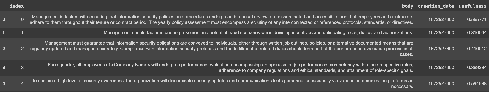
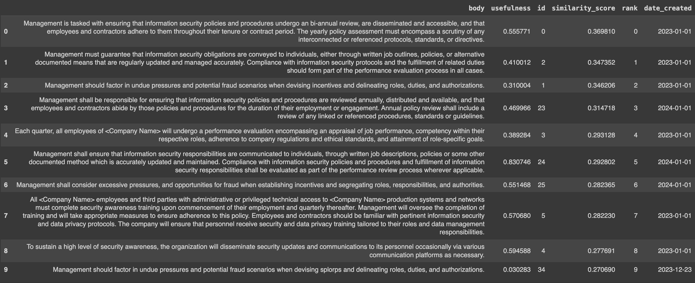
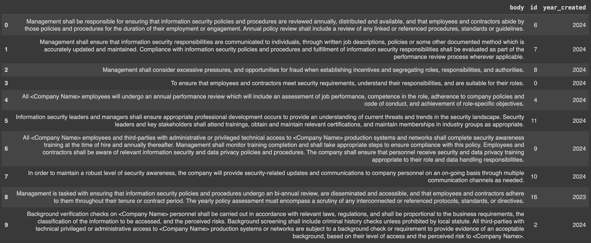
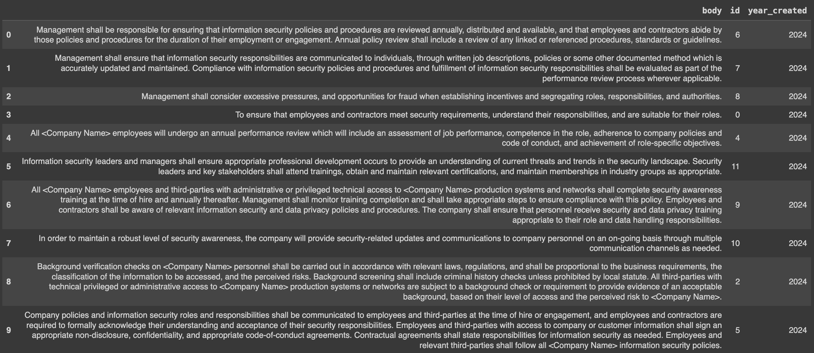
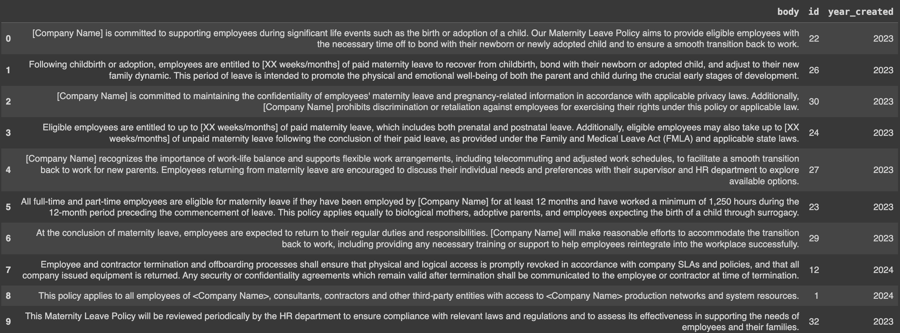

# How to get consistent, quality RAG results using Superlinked

## Improving retrieval quality for an HR chatbot, balancing freshness and relevance - a [notebook](https://github.com/superlinked/superlinked/blob/main/notebook/rag_hr_knowledgebase.ipynb) article

So, you’ve implemented a RAG system. But you’re struggling to get your retrieval results to live up to RAG’s potential. We have a solution - the Superlinked library. In this article, we’ll show you how to improve retrieval quality using the Superlinked library in an example use case - a RAG-powered HR chatbot that queries HR policies. This chatbot will leverage semantic query understanding and freshness via the Superlinked library to improve results.
 
## RAG’s strengths and challenges

Retrieval-augmented generation is a versatile solution applicable in various domains, from chatbots to content creation systems. By integrating retrieval and generation, RAG enables nuanced and context-aware interactions. RAG can:
- provide a unique response to any query
- reduce hallucinations as the answer has to be grounded in the retrieved context
- make the process highly scalable due to automatic question-answering

But RAG-powered applications face several challenges, including:
- ensuring the quality and diversity of retrieved information, particularly from unstructured data sources like the Internet; the knowledge base must be kept consistent and up to date
- needing costly reranking models to refine retrieved information and improve the relevance of generated responses
- deploying and maintaining RAG systems at scale demands substantial computational resources and expertise; the LLMs need to run efficiently

In our use case - RAG retrieval of company HR documents - we need, additionally, to make sure results are aligned with company guidelines.

Below, we’ll show you how to integrate Superlinked into your tech stack to address these RAG challenges.

## Superlinked addresses RAG challenges, by turning your data into nuanced, multimodal vectors

By enabling you to turn your data into multimodal vectors, and apply weights to specific parts of your data at query time, Superlinked optimizes retrieval without requiring a custom reranking model or postprocessing tasks, thus reducing your RAG system’s operating resources. Superlinked enables you to natively do things that would otherwise (i.e., with other libraries) require complex “hacks” - for example, and importantly in our case, Superlink’s Recency embedding space, which you can tune to your requirements, lets you set the freshness of the data you query and, consequently, your results.

We build our RAG-powered chatbot below using elements of the Superlinked library that address the (above) challenges of RAG:
- Recency space - to ascertain the freshness (currency and relevancy) of your data
- TextSimilarity space - to understand the semantic meaning of your text
- Query time weights - to optimize the treatment of the data when you run the query, without needing to re-embed the whole dataset

## Superlinked-powered RAG for HR document retrieval

For companies aiming to make HR documents more accessible to employees and contractors, building RAG on top of HR documents is a recent and promising approach. Let’s model how to use the Superlinked library to do this optimally, and achieve high quality results.

### Data sources

In our hypothetical company, there are two HR policy sources:
- an older (2023) HR policy, which contains a maternal leave policy and details on manager responsibilities
- a newer (2024) HR policy document that contains updated information about management responsibilities, alongside some other HR policy information

These two policies’ stipulations on management responsibilities contradict each other on certain points. In addition, only one of the HR policy sources contains guidelines on maternity leaves.

### Returning most relevant results from different and conflicting sources

A good RAG system will be able to:
- provide relevant information on maternity leave (only covered in the old documents)
- synthesize conflicting information, and only present us with the correct documents

To handle cases where the policies contradict each other, we’ll use the creation date as a proxy for relevance; that is, if/when there exist two documents with very similar information, but different wording, and slight differences in one piece of important information, creation date will indicate which of the two documents (i.e., the most recent) is more relevant to your query.

Now that we understand the basics of our data sources, let’s set up our solution.

### Setting up Superlinked

To start building your RAG-powered HR policy chatbot with Superlinked, your first step is to install the library and import the classes.

```python
%pip install superlinked==3.46.0
%pip install -U jupyter ipywidgets
%pip install -U torch transformers==4.37 accelerate


from datetime import timedelta, datetime


import altair as alt
import pandas as pd
import requests
import torch
from transformers import AutoTokenizer, pipeline


from superlinked.framework.common.dag.context import CONTEXT_COMMON, CONTEXT_COMMON_NOW
from superlinked.framework.common.dag.period_time import PeriodTime
from superlinked.framework.common.schema.schema import schema
from superlinked.framework.common.schema.schema_object import String, Timestamp
from superlinked.framework.common.schema.id_schema_object import IdField
from superlinked.framework.common.parser.dataframe_parser import DataFrameParser
from superlinked.framework.dsl.executor.in_memory.in_memory_executor import (
   InMemoryExecutor,
)
from superlinked.framework.dsl.index.index import Index
from superlinked.framework.dsl.query.param import Param
from superlinked.framework.dsl.query.query import Query
from superlinked.framework.dsl.query.result import Result
from superlinked.framework.dsl.source.in_memory_source import InMemorySource
from superlinked.framework.dsl.space.text_similarity_space import (
   TextSimilaritySpace,
   chunk,
)
from superlinked.framework.dsl.space.recency_space import RecencySpace


alt.renderers.enable(get_altair_renderer())
alt.data_transformers.disable_max_rows()
pd.set_option("display.max_colwidth", 1000)
START_OF_2024_TS = int(datetime(2024, 1, 2).timestamp())
EXECUTOR_DATA = {CONTEXT_COMMON: {CONTEXT_COMMON_NOW: START_OF_2024_TS}}
TOP_N = 10
```

Now, you load the data.

```python
# the new HR policy document
r_new = requests.get(
   "https://storage.googleapis.com/superlinked-notebook-hr-knowledgebase/hr_rag_knowledgebase.txt"
)
r_new.encoding = "utf-8-sig"
text_new = r_new.text.replace("\r\n", "\n").split("\n")
r_old = requests.get(
   "https://storage.googleapis.com/superlinked-notebook-hr-knowledgebase/hr_rag_old_text.txt"
)
r_old.encoding = "utf-8-sig"
text_old = r_old.text.replace("\r\n", "\n").split("\n")


text_df = pd.DataFrame(text_new + text_old, columns=["body"]).reset_index()
# add timestamps to differentiate the two sources
text_df["creation_date"] = [int(datetime(2024, 1, 1).timestamp())] * len(text_new) + [
   int(datetime(2023, 1, 1).timestamp())
] * len(text_old)
text_df.head()
```



### Superlinked-powered retrieval

Superlinked’s library contains a set of core building blocks that we use to construct the index and manage the retrieval. You can read about these building blocks in more detail [here](https://github.com/superlinked/superlinked/blob/main/notebook/feature/basic_building_blocks.ipynb).

Let’s put this library’s building blocks to use for our HR chatbot.

First you need to define your Schema to tell the system about your data:

```python
# typed schema to describe our inputs
@schema
class ParagraphSchema:
   body: String
   created_at: Timestamp
   id: IdField


paragraph = ParagraphSchema()
```

Next, you use Spaces to say how you want to treat each part of the data when embedding. Which Spaces are used depends on your datatype. Each Space is optimized to embed the data so as to return the highest possible quality of retrieval results.

```python
# relevance space will encode our knowledgebase utilizing chunking to control the granularity of information
relevance_space = TextSimilaritySpace(
   text=chunk(paragraph.body, chunk_size=100, chunk_overlap=20),
   model="sentence-transformers/all-mpnet-base-v2",
)
# recency has a periodtime to differentiate between the document created at the beginning of this year and last year
recency_space = RecencySpace(
   timestamp=paragraph.created_at,
   period_time_list=[PeriodTime(timedelta(days=300))],
   negative_filter=-0.25,
)
```

Once you have the data defined in Spaces, you then combine those Spaces into a single vector index to run vector search on:

```python
paragraph_index = Index([relevance_space, recency_space])
paragraph_parser = DataFrameParser(
   paragraph, mapping={paragraph.id: "index", paragraph.created_at: "creation_date"}
)
source: InMemorySource = InMemorySource(paragraph, parser=paragraph_parser)
executor = InMemoryExecutor(
   sources=[source], indices=[paragraph_index], context_data=EXECUTOR_DATA
)
app = executor.run()
source.put([text_df])
```

### Setting up query and performing retrieval

To prepare the query to retrieve relevant information from the knowledge base, you create a knowledgebase_query that considers both relevance and recency, and formats the results for presentation.

```python
# our simple query will make a search term possible, and gives us the opportunity to weight input aspects (relevance and recency against each other)
knowledgebase_query = (
   Query(
       paragraph_index,
       weights={
           relevance_space: Param("relevance_weight"),
           recency_space: Param("recency_weight"),
       },
   )
   .find(paragraph)
   .similar(relevance_space.text, Param("search_query"))
   .limit(Param("limit"))
)

def present_result(result: Result):
   """A small helper function to present our query results"""
   df = result.to_pandas()
   df["year_created"] = [datetime.fromtimestamp(ts).year for ts in df["created_at"]]
   return df.drop("created_at", axis=1)

initial_query_text: str = "What should management monitor?"
```

First, let's do a simple retrieval based only on text similarity. We set the recency weight to 0, so the document creation dates do not have any effect on our results.

```python
only_relevance_result = app.query(
   knowledgebase_query,
   relevance_weight=1,
   recency_weight=0,
   search_query=initial_query_text,
   limit=TOP_N,
)


present_result(only_relevance_result)
```

Here are our results:



Look closely at the elements with ids 16 and 6. These documents say essentially the same thing. But the older document (16) prescribes a “bi-annual review” of policies and procedures. The new document (6), on the other hand, prescribes an annual review.

Let's see what happens if we upweight recency in our query.

```python
mild_recency_result = app.query(
   knowledgebase_query,
   relevance_weight=1,
   recency_weight=0.15,
   search_query=initial_query_text,
   limit=TOP_N,
)


present_result(mild_recency_result)
```



With recency weighted more heavily, element 16 (from 2023) drops down to the bottom of our returned results.

If we look back at our initial results, we can see the same dynamics here between documents with IDs 7 and 18; both concern “information security” with some slight but significant differences. Whereas doc 18 from 2023 had stipulated performance review of compliance and fulfillment “in all cases”, doc 7 from 2024 softened this requirement to "wherever applicable". By upweighting recency from 0 to 0.15, our search successfully returns the more relevant (i.e., recent) policy text. Documents stating almost the same thing (but with slight, significant disparities) can be differentiated through their freshness.

Let's boost our recency weight even further and see if we can have only recent, not outdated, information in our results.

```python
normal_recency_result = app.query(
   knowledgebase_query,
   relevance_weight=1,
   recency_weight=0.25,
   search_query=initial_query_text,
   limit=TOP_N,
)


norm_recency_result_df = present_result(normal_recency_result)
Norm_recency_result_df
```



Et voila! Now all results are fresh; doc 16 (2023) is completely removed from the result set, and only doc 6 remains. (Doc 18 was removed already by our initial recency upweighting (recency_weight=0.15).) In this way, we can use Superlinked’s Recency space, TextSimilarity space, and Query time weights to supply a nice and clean context for the generation model.

Note also that, importantly, the same weights (including our new recency_weight=0.25) produce relevant results for queries about maternity leave—a topic discussed only in the older HR document (2023). This older material does not get overruled by more recent but not relevant documents.

```python
normal_recency_result = app.query(
   knowledgebase_query,
   relevance_weight=1,
   recency_weight=0.25,
   search_query="What are the companies terms for maternal leave?",
   limit=TOP_N,
)


maternity_result = present_result(normal_recency_result)
maternity_result
```



Now that we’re happy with the retrieval, let’s set up the generation.

### Augmentation - formulating your query for LLM generation

To keep your build light and tool-independent, you can just manually craft your query template based on [LLama2 instructions from HuggingFace](https://huggingface.co/blog/llama2). 

```python
context_items_from_retrieval: int = 5
context_text: str = (
   "\n"
   + "\n".join(
       f for f in norm_recency_result_df["body"].iloc[:context_items_from_retrieval]
   )
   + "\n"
)


query = f"""<s>[INST] <<SYS>>
You are a helpful, respectful and honest assistant. Always answer as helpfully as possible, while being safe.  Your answers should not include any harmful, unethical, racist, sexist, toxic, dangerous, or illegal content. Please ensure that your responses are socially unbiased and positive in nature.


If a question does not make any sense, or is not factually coherent, explain why instead of answering something not correct. If you don't know the answer to a question, please don't share false information.
<</SYS>>


Please answer the following question by using information from the provided context information!
CONTEXT_INFORMATION: {context_text}
QUESTION: {initial_query_text}
[/INST]"""


print(query)
```

```text

<s>[INST] <<SYS>>
You are a helpful, respectful and honest assistant. Always answer as helpfully as possible, while being safe.  Your answers should not include any harmful, unethical, racist, sexist, toxic, dangerous, or illegal content. Please ensure that your responses are socially unbiased and positive in nature.

If a question does not make any sense, or is not factually coherent, explain why instead of answering something not correct. If you don't know the answer to a question, please don't share false information.
<</SYS>>

Please answer the following question by using information from the provided context information!
CONTEXT_INFORMATION: 
Management shall be responsible for ensuring that information security policies and procedures are reviewed annually, distributed and available, and that employees and contractors abide by those policies and procedures for the duration of their employment or engagement. Annual policy review shall include a review of any linked or referenced procedures, standards or guidelines.
Management shall ensure that information security responsibilities are communicated to individuals, through written job descriptions, policies or some other documented method which is accurately updated and maintained. Compliance with information security policies and procedures and fulfillment of information security responsibilities shall be evaluated as part of the performance review process wherever applicable.
Management shall consider excessive pressures, and opportunities for fraud when establishing incentives and segregating roles, responsibilities, and authorities.
To ensure that employees and contractors meet security requirements, understand their responsibilities, and are suitable for their roles.
All <Company Name> employees will undergo an annual performance review which will include an assessment of job performance, competence in the role, adherence to company policies and code of conduct, and achievement of role-specific objectives.

QUESTION: What should management monitor?
[/INST]

```


With the query template in place, let’s prompt the LLM for a text answer.

### Generation - prompting the LLM to generate a text answer to your query

```python
# load the 7B parameter Llama model for chat from Huggingface - for the first run this will download model, for subsequent ones it will load it
model = "meta-llama/Llama-2-7b-chat-hf"


# we use the pure transformers library without popular wrappers - but LLamaIndex and LangChain can easily be plugged in here as those use transformers under the hood too
tokenizer = AutoTokenizer.from_pretrained(model)
pipeline = pipeline(
   "text-generation",
   model=model,
   torch_dtype=torch.float16,
   device_map="auto",
# we prompt the LLM for text generation with our RAG query
sequences = pipeline(
   query,
   do_sample=True,
   top_k=10,
   num_return_sequences=1,
   eos_token_id=tokenizer.eos_token_id,
   pad_token_id=tokenizer.eos_token_id,
)
for seq in sequences:
   print(f"Result: {seq['generated_text']}")
```

```text

Result: <s>[INST] <<SYS>>
You are a helpful, respectful and honest assistant. Always answer as helpfully as possible, while being safe.  Your answers should not include any harmful, unethical, racist, sexist, toxic, dangerous, or illegal content. Please ensure that your responses are socially unbiased and positive in nature.

If a question does not make any sense, or is not factually coherent, explain why instead of answering something not correct. If you don't know the answer to a question, please don't share false information.
<</SYS>>

Please answer the following question by using information from the provided context information!
CONTEXT_INFORMATION: 
Management shall be responsible for ensuring that information security policies and procedures are reviewed annually, distributed and available, and that employees and contractors abide by those policies and procedures for the duration of their employment or engagement. Annual policy review shall include a review of any linked or referenced procedures, standards or guidelines.
Management shall ensure that information security responsibilities are communicated to individuals, through written job descriptions, policies or some other documented method which is accurately updated and maintained. Compliance with information security policies and procedures and fulfillment of information security responsibilities shall be evaluated as part of the performance review process wherever applicable.
Management shall consider excessive pressures, and opportunities for fraud when establishing incentives and segregating roles, responsibilities, and authorities.
To ensure that employees and contractors meet security requirements, understand their responsibilities, and are suitable for their roles.
All <Company Name> employees will undergo an annual performance review which will include an assessment of job performance, competence in the role, adherence to company policies and code of conduct, and achievement of role-specific objectives.

QUESTION: What should management monitor?
[/INST]  Based on the provided context information, management should monitor the following:

1. Information security policies and procedures: Management should review and update these policies and procedures annually to ensure they are relevant and effective in protecting the company's information assets.
2. Employee and contractor compliance: Management should ensure that employees and contractors are aware of and comply with the company's information security policies and procedures throughout their employment or engagement.
3. Performance reviews: Management should include an assessment of employee and contractor compliance with information security policies and procedures as part of their annual performance reviews.
4. Job descriptions and responsibilities: Management should ensure that job descriptions accurately reflect the information security responsibilities of each role and are updated as necessary.
5. Incentives and segregation of roles: Management should consider excessive pressures and opportunities for fraud when establishing incentives and segregating roles, responsibilities, and authorities to ensure that employees and contractors are suitable for their roles.
6. Employee competence: Management should assess employee competence in their roles to ensure that they have the necessary skills and knowledge to perform their duties effectively and securely.
7. Role-specific objectives: Management should establish role-specific objectives for employees and contractors to ensure that they are working towards common goals and are aligned with the company's overall information security strategy.

```

### Evaluating the answer

The text answer is structured, contains information from your context documents, and is tailored to your question. Based on our hardware, the query will generate results in a manageable time. In 3), we can see that the generated text contains the correct annual term. This is mainly because our Superlinked-powered retrieval feeds our HR chatbot the right thing as context information.

Using Superlinked’s Recency space, TextSimilarity space, and Query time weights to power retrieval enables semantic search to achieve high quality nuanced outcomes at scale, even in cases where accurate results require prioritizing both recency and relevance. This HR chatbot example is just one example of what you can do with the Superlinked library.

Now, go ahead and [try out our notebook yourself!](https://colab.research.google.com/github/superlinked/superlinked/blob/main/notebook/rag_hr_knowledgebase.ipynb)
