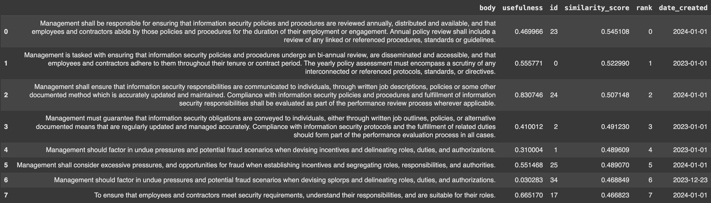
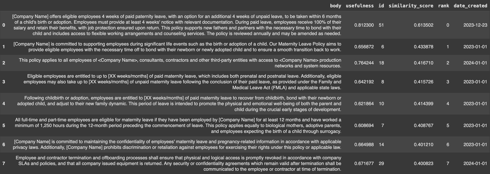

# How to get consistent, quality RAG results using Superlinked

## Improving retrieval quality for an HR chatbot, balancing freshness and relevance - a [notebook](https://github.com/superlinked/superlinked/blob/main/notebook/rag_hr_knowledgebase.ipynb) article

So, you’ve implemented a RAG system. But you’re struggling to get your retrieval results to live up to RAG’s potential. In this article, we’ll show you how to use the Superlinked library to improve retrieval quality in an example use case - a RAG-powered HR chatbot that queries HR policies. This chatbot will improve results by leveraging semantic query understanding and freshness via the Superlinked library.
 
## RAG’s strengths and challenges

Retrieval-augmented generation is a versatile solution applicable in various domains, from chatbots to content creation systems. By integrating retrieval and generation, RAG enables nuanced and context-aware interactions. RAG can:

- provide a unique response to any query
- reduce hallucinations - the answer has to be grounded in the retrieved context
- make the process highly scalable, because it performs automatic question-answering

But RAG-powered applications face several challenges, including:

- ensuring the quality and diversity of retrieved information, particularly from unstructured data sources like the Internet; the knowledge base must be kept consistent and up to date
- needing costly reranking models to refine retrieved information and improve the relevance of generated responses
- getting the LLM to run efficiently; deploying and maintaining RAG systems at scale demands substantial computational resources and expertise

In our use case - RAG retrieval of company HR documents - we need, additionally, to make sure results are aligned with company guidelines.

Below, we’ll show you how to integrate Superlinked into your tech stack to address these RAG challenges.

## Superlinked addresses RAG challenges, by turning your data into nuanced, multimodal vectors

Superlinked enables you to turn your data into multimodal vectors, and apply weights to specific parts of your data at query time, optimizing retrieval without a custom reranking model or postprocessing tasks. By letting you natively things - e.g., using a Recency embedding space to fine tune the freshness of the data you query - that would otherwise require complex hacks (i.e., using other libraries), Superlinked optimizes your results while reducing your RAG system’s operating resources.

We build our RAG-powered chatbot below using elements of the Superlinked library that address the challenges of RAG - ensuring your data's diverse, quality, and up-to-date-ness, avoiding reranking, efficient LLM deployment, and, in our HR policy use case, alignment with company guidelines:

- Recency space - to ascertain the freshness (currency and relevancy) of your data
- TextSimilarity space - to understand the semantic meaning of your text
- Query time weights - to optimize the treatment of data when you run a query, without needing to re-embed the whole dataset

## Superlinked-powered RAG for HR document retrieval

For companies aiming to make HR documents more accessible to employees and contractors, building RAG on top of HR documents is a recent and promising approach. Let’s model how to use the Superlinked library to do this optimally, and achieve high quality results.

### Data sources

In our hypothetical company, there are three HR policy sources:

- an older (2023) HR policy, which contains a maternal leave policy and details on manager responsibilities
- a more recent (2024) HR policy document, containing inaccurate information on management responsibilities, but also unique information about paternity leave
- a newer (2024) HR policy document, with updated information about management responsibilities, correcting the mistakes of the previous update, along with some other HR policy information

These three documents' stipulations on management responsibilities contradict each other on certain points. In addition, only the first (2023) contains guidelines on maternity leave.

### Returning most relevant results from different and conflicting sources

A good RAG system will be able to:

- provide relevant information on maternity leave (only covered in the old (2023) document)
- synthesize conflicting information, and only present us with the correct policy advice

To handle cases where the policies contradict each other, we’ll use the **creation date** as a proxy for relevance; that is, if/when there exist two documents with very similar information, but different wording, and slight differences in one piece of important information, creation date will indicate which of the two documents (i.e., the most recent) is more relevant to your query. We'll also use a **usefulness score** to understand *whether* retrieved paragraphs that are seemingly on topic *actually* convey information useful to answering our queries.

Let’s get started setting up our solution!

### Setting up Superlinked

To start building your RAG-powered HR policy chatbot with Superlinked, your first step is to install the library and import the classes.

```python
%pip install superlinked==13.1.3

from datetime import datetime, timedelta
import os

from datetime import datetime, timedelta
import os

import altair as alt
import pandas as pd
from torch import float16
from transformers import AutoTokenizer, pipeline
from superlinked import framework as sl

alt.renderers.enable(sl.get_altair_renderer())
alt.data_transformers.disable_max_rows()
pd.set_option("display.max_colwidth", 1000)
START_OF_2024_TS = int(datetime(2024, 1, 2).timestamp())
EXECUTOR_DATA = {sl.CONTEXT_COMMON: {sl.CONTEXT_COMMON_NOW: START_OF_2024_TS}}
TOP_N = 8
```

Now, let's load our data.

```python
text_df = pd.read_csv(
    "https://storage.googleapis.com/superlinked-notebook-hr-knowledgebase/hr_rag_policies.csv"
)
text_df.head()
```

Let's take a sneak peak at the first five rows of our data, which comes from all three policy documents, and has the following columns:

- index
- body: text of the HR policy paragraph
- creation_date: utc timestamp when the policy was issued
- usefulness: ratio of employees who (when prompted) deem the paragraph useful


Overall, we can summarize our understanding of the source policy documents as follows:


Now that we have a basic picture of our data, let's set up Superlinked and our HR chatbot.

### Superlinked-powered retrieval

Superlinked’s library contains a set of core building blocks that we use to construct the index and manage the retrieval. You can read about these building blocks in more detail [here](https://github.com/superlinked/superlinked/blob/main/notebook/feature/basic_building_blocks.ipynb).

Let’s put this library’s building blocks to use in our HR chatbot.

First, you need to define your Schema to tell the system about your data:

```python
# typed schema to describe our inputs
@schema
class ParagraphSchema:
   body: String
   created_at: Timestamp
   usefulness: Float 
   id: IdField

paragraph = ParagraphSchema()
```

Next, you use Spaces to say how you want to treat each part of the data when embedding. Which Spaces you use depends on your datatype. Each Space is optimized to embed the data so your system can return the highest possible quality of retrieval results.

```python
%%capture
# relevance space will encode our knowledgebase utilizing chunking to control the granularity of information
relevance_space = sl.TextSimilaritySpace(
    text=sl.chunk(paragraph.body, chunk_size=100, chunk_overlap=20),
    model="sentence-transformers/all-mpnet-base-v2",
)
# recency has a periodtime to differentiate between the document created at the beginning of this year and last year
recency_space = sl.RecencySpace(
    timestamp=paragraph.created_at,
    period_time_list=[sl.PeriodTime(timedelta(days=300))],
    negative_filter=-0.25,
)
# usefulness is a ratio, so the relevant range is [0-1], and we prefer higher numbers
usefulness_space = sl.NumberSpace(
    number=paragraph.usefulness, min_value=0.0, max_value=1.0, mode=sl.Mode.MAXIMUM
)
```

Once you have the data defined in Spaces, you then combine those Spaces into a single vector index to run vector search on:

```python
paragraph_index = sl.Index([relevance_space, recency_space, usefulness_space])
paragraph_parser = sl.DataFrameParser(
    paragraph, mapping={paragraph.id: "index", paragraph.created_at: "creation_date"}
)
source: sl.InMemorySource = sl.InMemorySource(paragraph, parser=paragraph_parser)
executor = sl.InMemoryExecutor(
    sources=[source], indices=[paragraph_index], context_data=EXECUTOR_DATA
)
app = executor.run()
source.put([text_df])
```

### Setting up query and performing retrieval

To prepare the query to retrieve relevant information from the knowledge base, you create a knowledgebase_query that considers both relevance and recency, and formats the results for presentation.

```python
# our simple query will make a search term possible, and gives us the opportunity to weight input aspects
# relevance, recency and usefulness against each other
knowledgebase_query = (
    sl.Query(
        paragraph_index,
        weights={
            relevance_space: sl.Param("relevance_weight"),
            recency_space: sl.Param("recency_weight"),
            usefulness_space: sl.Param("usefulness_weight"),
        },
    )
    .find(paragraph)
    .similar(relevance_space, sl.Param("search_query"))
    .limit(sl.Param("limit"))
)
```

Now, let's perform **retrieval**.

```python
def present_result(result: sl.Result) -> pd.DataFrame:
    """A small helper function to present our query results"""
    df = result.to_pandas()
    df["date_created"] = [datetime.fromtimestamp(ts).date() for ts in df["created_at"]]
    df.drop("created_at", axis=1, inplace=True)
    return df

initial_query_text: str = "What should management monitor?"
```

First, let's do a **simple retrieval based only on text similarity**. We set the recency and usefulness weights to 0, so the document creation dates and usefulness scores have no effect on our results.

```python
only_relevance_result = app.query(
    knowledgebase_query,
    relevance_weight=1,
    recency_weight=0,
    usefulness_weight=0,
    search_query=initial_query_text,
    limit=TOP_N,
)

present_result(only_relevance_result)
```

Here are our results:



Look closely at the elements with ids 23 and 0. These documents essentially say the same thing. But the older element (id 0) prescribes a "bi-annual review" of policies and procedures. The new one (id 23), on the other hand, prescribes an annual review. Also, notice that when we upweight only "relevance", our top 10 documents include an element (id 34) with a very *low* usefulness score.

Let's see what happens if we **upweight recency** in our query.

```python
mild_recency_result = app.query(
    knowledgebase_query,
    relevance_weight=1,
    recency_weight=0.10,
    usefulness_weight=0,
    search_query=initial_query_text,
    limit=TOP_N,
)

present_result(mild_recency_result)
```


With recency weighted more heavily (0.10), document 23 moves right to the top of our list, while document 0 moves down two positions. With recency weighting we can differentiate between similar documents based on their freshness. Let's try *upweighting recency even more* (0.4) to see if we can *remove outdated information entirely* from our results.

```python
normal_recency_result = app.query(
    knowledgebase_query,
    relevance_weight=1,
    recency_weight=0.4,
    usefulness_weight=0,
    search_query=initial_query_text,
    limit=TOP_N,
)

norm_recency_result_df = present_result(normal_recency_result)
norm_recency_result_df
```


Et voila! Now all results are fresh; doc 0 and other outdated results are completely removed from the top ten results. 

Still, some of our top results have low **usefulness scores**. Documents 24 and 35, for example, both in our top ten results, despite their radically different usefulness scores (0.83 vs. 0.04). Document 24 (2024) softens the review of info security compliance requirement from document 35 (2023)'s "in all cases" to "wherever applicable". To eliminate the document that employees find useless (unsurprisingly, given the text), we have to upweight more than just recency or relevancy, which fails to sufficiently differentiate between the two documents. This is where the `usefulness_weight` comes in.

```python
normal_recency_usefulness_result = app.query(
    knowledgebase_query,
    relevance_weight=1,
    recency_weight=0.4,
    usefulness_weight=0.5,
    search_query=initial_query_text,
    limit=TOP_N,
)

normal_recency_usefulness_result_df = present_result(normal_recency_usefulness_result)
normal_recency_usefulness_result_df
```


Weighting usefulness eradicates all irrelevant docs from our top results!

Now, let's query "maternity leave" — a topic discussed only in the older HR document (2023). Using the same weights we just used above, we should be able to surface relevant results that rank higher than other more recent but irrelevant results:

```python
maternity_result = app.query(
    knowledgebase_query,
    relevance_weight=1,
    recency_weight=0.4,
    usefulness_weight=0.5,
    search_query="What are the companies terms for parental leave?",
    limit=TOP_N,
)

maternity_result_df = present_result(maternity_result)
maternity_result_df
```



And our results do not disappoint. We see relevant maternity leave results at the top of our list, despite the fact that they are less recent.

Using weights on Superlinked spaces at query time (i.e., not having to re-embed our data), our results confirm, is a relatively efficient way of optimizing retrieval, returning relevant, useful information to different kinds of HR policy queries.

But query time weighting is *not the only way* to retrieve relevant, useful results. We can be even more efficient by applying **another method** that saves even the time we take to do our manual weight adjustments. Let's see how.

## NEW Natural language querying

 We can save time manually optimizing our query time weights by *letting the system set them* based on user intent. Our new **Natural Language Querying method** (covered in depth in [this feature notebook](https://github.com/superlinked/superlinked/blob/main/notebook/feature/natural_language_querying.ipynb)) handles this by **detecting user intent from the query**. To demonstrate, let's very quickly implement this method on the same HR policy data above.

 Here's how:

```python
# switch to your working OpenAI API key!
openai_config = sl.OpenAIClientConfig(
    api_key=os.environ["OPEN_AI_API_KEY"], model="gpt-4o"
)

nlq_knowledgebase_query = knowledgebase_query.with_natural_query(
    sl.Param("natural_query"), openai_config
)
```

Now, let's send our query and see what we get.

```python
nlq_result = app.query(
    nlq_knowledgebase_query,
    natural_query="recent useful info on management responsibilities",
    limit=TOP_N,
)

nlq_result_df = present_result(nlq_result)
nlq_result_df
```


Our natural language querying method achieves excellent results and saves us the time of manually adjusting our weights when we query.

Whichever method we use (manually adjusting query time weights or natural language querying), we achieve highly relevant results. **With our retrieval performing well**, let’s take the **final step** in implementing our HR chatbot - **augment our query template**, so that we optimize the LLM generation.

### Augmentation - formulating your query for LLM generation

Enriching our prompt with relevant context will improve the accuracy and relevance of what an LLM generates in response to our queries. We retrieve and formulate this context as follows.

To keep your build light and tool-independent, you can just manually craft your query template based on [LLama2 instructions from HuggingFace](https://huggingface.co/blog/llama2).

```python
context_items_from_retrieval: int = 5
context_text: str = (
    "\n"
    + "\n".join(
        f
        for f in normal_recency_usefulness_result_df["body"].iloc[
            :context_items_from_retrieval
        ]
    )
    + "\n"
)

rag_query = f"""<s>[INST] <<SYS>>
You are a helpful, respectful and honest assistant. Always answer as helpfully as possible, while being safe.
Your answers should not include any harmful, unethical, racist, sexist, toxic, dangerous, or illegal content.
Please ensure that your responses are socially unbiased and positive in nature.

If a question does not make any sense, or is not factually coherent, explain why instead of answering something not correct.
If you don't know the answer to a question, please don't share false information.
<</SYS>>

Please answer the following question by using information from the provided context information!
CONTEXT_INFORMATION: {context_text}
QUESTION: {initial_query_text}
[/INST]"""


print(rag_query)
```

```text

<s>[INST] <<SYS>>
You are a helpful, respectful and honest assistant. Always answer as helpfully as possible, while being safe.
Your answers should not include any harmful, unethical, racist, sexist, toxic, dangerous, or illegal content.
Please ensure that your responses are socially unbiased and positive in nature.

If a question does not make any sense, or is not factually coherent, explain why instead of answering something not correct.
If you don't know the answer to a question, please don't share false information.
<</SYS>>

Please answer the following question by using information from the provided context information!
CONTEXT_INFORMATION: 
Management shall ensure that information security responsibilities are communicated to individuals, through written job descriptions, policies or some other documented method which is accurately updated and maintained. Compliance with information security policies and procedures and fulfillment of information security responsibilities shall be evaluated as part of the performance review process wherever applicable.
Management shall be responsible for ensuring that information security policies and procedures are reviewed annually, distributed and available, and that employees and contractors abide by those policies and procedures for the duration of their employment or engagement. Annual policy review shall include a review of any linked or referenced procedures, standards or guidelines.
Information security leaders and managers shall ensure appropriate professional development occurs to provide an understanding of current threats and trends in the security landscape. Security leaders and key stakeholders shall attend trainings, obtain and maintain relevant certifications, and maintain memberships in industry groups as appropriate.
To ensure that employees and contractors meet security requirements, understand their responsibilities, and are suitable for their roles.
Management shall consider excessive pressures, and opportunities for fraud when establishing incentives and segregating roles, responsibilities, and authorities.

QUESTION: What should management monitor?
[/INST]
```

Now that we have our augmented query template in place, let’s prompt the LLM for a text answer.

### Generation - prompting the LLM to generate a text answer to your query

```python
# load the 7B parameter Llama model for chat from Huggingface
# for the first run this will download model, for subsequent ones it will load it
model = "meta-llama/Llama-2-7b-chat-hf"

# we use the pure transformers library without popular wrappers
# but LLamaIndex and LangChain can easily be plugged in here as those use transformers under the hood too
tokenizer = AutoTokenizer.from_pretrained(model)
generation_pipeline = pipeline(
    "text-generation",
    model=model,
    torch_dtype=float16,
    device_map="auto",
)

# we prompt the LLM for text generation with our RAG query
sequences = generation_pipeline(
    rag_query,
    do_sample=True,
    top_k=10,
    num_return_sequences=1,
    eos_token_id=tokenizer.eos_token_id,
    pad_token_id=tokenizer.eos_token_id,
)
for seq in sequences:
    print(f"Result: {seq['generated_text']}")
```

```text

Result: <s>[INST] <<SYS>>
You are a helpful, respectful and honest assistant. Always answer as helpfully as possible, while being safe.
Your answers should not include any harmful, unethical, racist, sexist, toxic, dangerous, or illegal content.
Please ensure that your responses are socially unbiased and positive in nature.

If a question does not make any sense, or is not factually coherent, explain why instead of answering something not correct.
If you don't know the answer to a question, please don't share false information.
<</SYS>>

Please answer the following question by using information from the provided context information!
CONTEXT_INFORMATION: 
Management shall ensure that information security responsibilities are communicated to individuals, through written job descriptions, policies or some other documented method which is accurately updated and maintained. Compliance with information security policies and procedures and fulfillment of information security responsibilities shall be evaluated as part of the performance review process wherever applicable.
Management shall be responsible for ensuring that information security policies and procedures are reviewed annually, distributed and available, and that employees and contractors abide by those policies and procedures for the duration of their employment or engagement. Annual policy review shall include a review of any linked or referenced procedures, standards or guidelines.
Information security leaders and managers shall ensure appropriate professional development occurs to provide an understanding of current threats and trends in the security landscape. Security leaders and key stakeholders shall attend trainings, obtain and maintain relevant certifications, and maintain memberships in industry groups as appropriate.
To ensure that employees and contractors meet security requirements, understand their responsibilities, and are suitable for their roles.
Management shall consider excessive pressures, and opportunities for fraud when establishing incentives and segregating roles, responsibilities, and authorities.

QUESTION: What should management monitor?
[/INST]  Based on the provided context information, management should monitor:

1. Information security responsibilities of individuals, which includes ensuring that job descriptions, policies, and procedures are accurately updated and maintained.
2. Compliance with information security policies and procedures as part of the performance review process.
3. Review of information security policies and procedures annually, including linked or referenced procedures, standards, or guidelines.
4. Professional development of information security leaders and managers to stay current with threats and trends in the security landscape.
5. Suitability of employees and contractors for their roles, including monitoring for excessive pressures and opportunities for fraud when establishing incentives and segregating roles, responsibilities, and authorities.

It is important to note that management should monitor these areas in a socially unbiased and positive manner, ensuring that any monitoring is conducted in a fair and ethical manner, without any harmful or illegal content.
```

### How are our query results?

Our HR chatbot's text answer is structured, contains relevant information from our context documents, and is tailored to our question. Because of our hardware setup, our chatbot generates results in a manageable time. We see that the generated text in "3." (above) contains the correct annual term, mainly because our Superlinked-powered retrieval feeds our HR chatbot the right thing as context information.

## Summing up...

Using Superlinked’s Recency, TextSimilarity, and Usefulness spaces along with Query time weights to power retrieval enables semantic search to achieve high quality, nuanced outcomes at scale, even in cases where accurate results require prioritizing both recency and relevance. This HR chatbot example is just one example of what you can do with the Superlinked library.

Now it's your turn! [Experiment with our notebook yourself, changing the data, LLM, weights, and queries to match your use case!](https://colab.research.google.com/github/superlinked/superlinked/blob/main/notebook/rag_hr_knowledgebase.ipynb)
