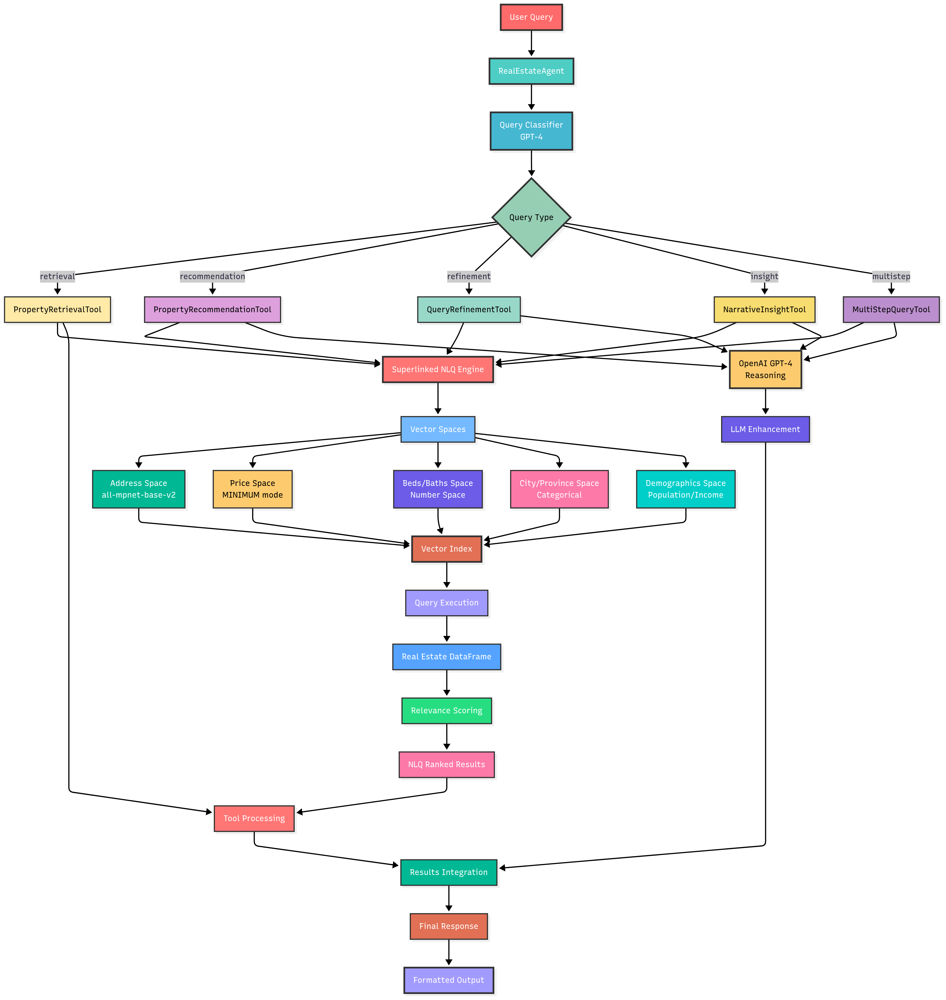
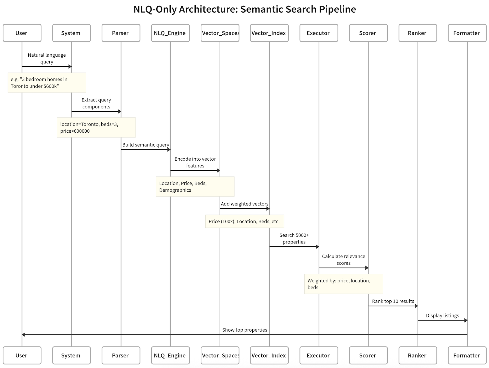
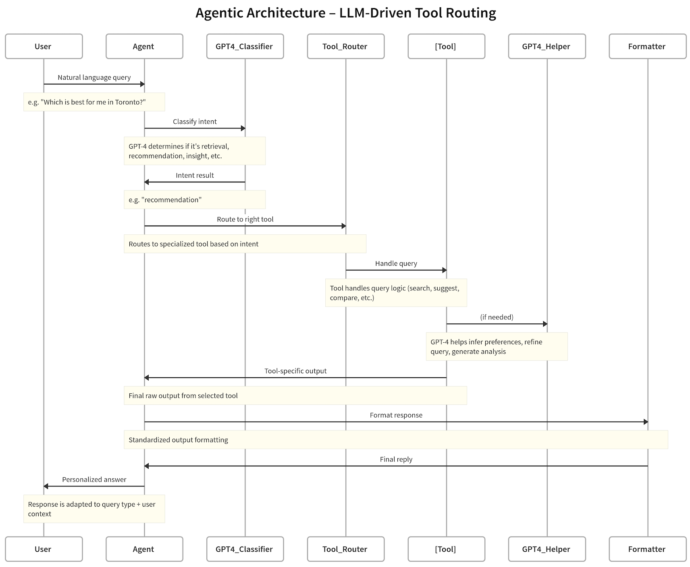
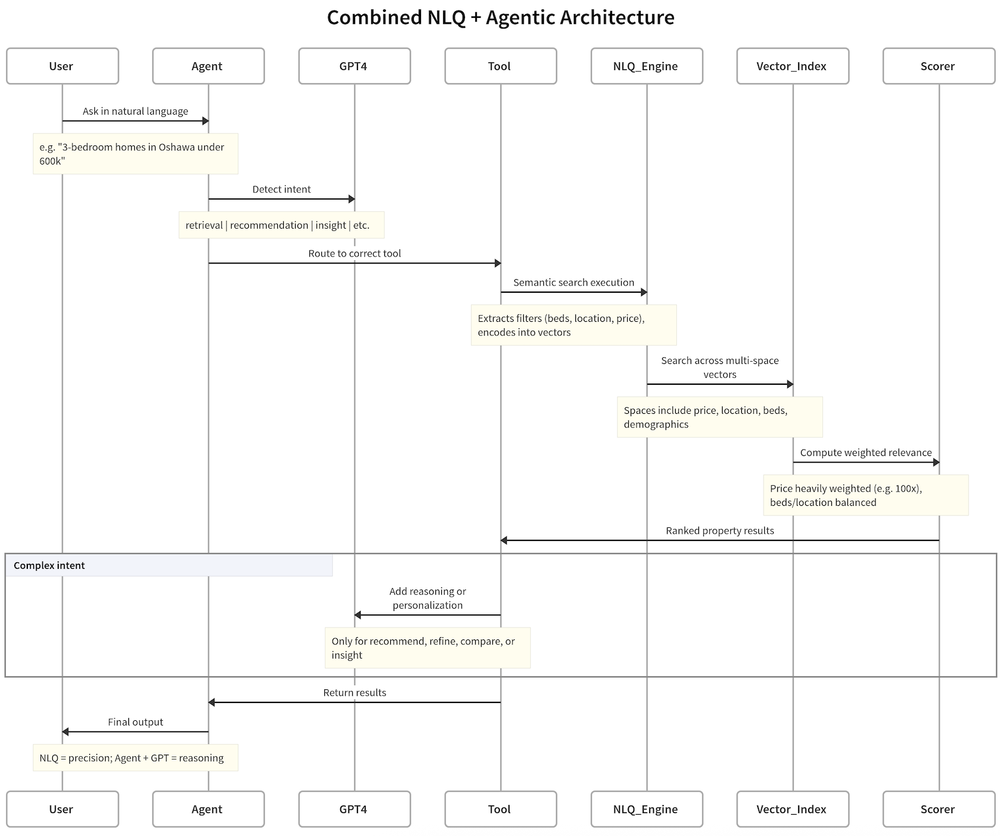

# Building an Agentic NLQ System for Real Estate Search

Real estate search is straight-up broken. I mean we all know the drill right, It’s just too much dropdowns, rigid filters, and somehow we still end up scrolling through properties that miss the mark completely. Want a "family-friendly home near good schools"? Good luck translating that into checkboxes and price sliders. I mean imagine there is a system which can just translate these queries to something meaningful reference and give us better results.

Taking into that account, I created an agentic Natural Language Querying (NLQ) system that actually understands what people want. Just tell it "Find me a 3-bedroom home in Toronto under $600,000 with 2 bedrooms and 3 bathrooms" and it figures out the rest. I mean this is one of the coolest thing right..

Here's how I combined vector search with AI agents to create a real estate assistant that actually gets it. If you want to follow along, refer to this [colab](https://colab.research.google.com/github/superlinked/VectorHub/blob/main/docs/assets/use_cases/real_estate_agentic_nlq/real_estate_agentic_nlq.ipynb)



## The Problem with Current Real Estate Search

Every real estate platform treats search like you're querying a database. It's all structured filters and rigid categories. Need a family home at a place? Here's your homework:

- Pick a price range from a dropdown
- Select bedrooms and bathrooms
- Choose your city from a list
- Cross your fingers that "good schools" somehow correlates with your selected neighborhood

This approach fails because real estate decisions are nuanced as hell. It’s super hard to translate the relevant requirements to the dropdowns and rigid filters. When someone says "affordable family home," they could mean totally different things based on their income, family size, and what they consider "affordable." I mean we need something where we can just put out the queries and get the relevant results. That’s where NLQ comes into play.

## What's Natural Language Querying All About?

NLQ flips the script. Instead of forcing users to translate their thoughts into database queries, it lets them just... talk normally.

**Old way**: `Price: $400K-$600K, Bedrooms: 3+, Location: Toronto`

**New way**: `"Find me a 3-bedroom home in Toronto under $600,000"`

The system handles the translation from human language to structured queries while actually understanding context and intent.

## What it took to made it..

Well there are couple of the different components that I glued together which provides NLQ capabilities, semantic search, and contextual reasoning.

- **Superlinked**: Well this is the most important aspect of making this happen, I mean this is the one which provides the core vector search and NLQ interfaces for retrieving relevant results based on user queries.
- **LLM**: Well for this project, I used OpenAI GPT-4 which powers both the intent classification and generative outputs such as recommendations, insight narratives, and query reformulations.
- For the embedding generation I used `sentence-transformers/all-mpnet-base-v2`

You can use any LLM or any embedding model of your choice based on the requirements.



## Data Requirements

To demonstrate how the NLQ system and agentic flow work in practice, I used a dataset that reflects what you'd typically find in real-world property listings. This includes property-level attributes like price, number of bedrooms and bathrooms, and address, along with geographic fields such as city and province.

To support more context-aware reasoning, the data also includes demographic details like population size and median household income—useful for queries that imply lifestyle or investment considerations.

## How I Built This Thing

### Step 1: Vector Spaces for Property Magic

I created specialised vector spaces for different property characteristics. Think of these as smart ways to understand fuzzy concepts like "near downtown" or "family-friendly."

```python
# Text similarity space for addresses
address_space = sl.TextSimilaritySpace(
    text=real_estate.address,
    model="sentence-transformers/all-mpnet-base-v2"
)

# Numerical similarity spaces
price_space = sl.NumberSpace(
    number=real_estate.price,
    min_value=0,
    max_value=int(max_price),
    mode=sl.Mode.MINIMUM
)

beds_space = sl.NumberSpace(
    number=real_estate.number_beds,
    min_value=0,
    max_value=int(max_beds),
    mode=sl.Mode.MINIMUM
)

baths_space = sl.NumberSpace(
    number=real_estate.number_baths,
    min_value=0,
    max_value=int(max_baths),
    mode=sl.Mode.MINIMUM
)

population_space = sl.NumberSpace(
    number=real_estate.population,
    min_value=0,
    max_value=int(max_population),
    mode=sl.Mode.MINIMUM
)

income_space = sl.NumberSpace(
    number=real_estate.median_family_income,
    min_value=0,
    max_value=int(max_median_family_income),
    mode=sl.Mode.MINIMUM
)

# Categorical similarity spaces
city_space = sl.CategoricalSimilaritySpace(
    category_input=real_estate.city,
    categories=unique_city_categories
)

province_space = sl.CategoricalSimilaritySpace(
    category_input=real_estate.province,
    categories=unique_province_categories,
    negative_filter=-1.0,
    uncategorized_as_category=False
)
```

Why vector spaces? They enable fuzzy matching, so when someone searches "near downtown" the system intelligently finds relevant addresses without needing exact geolocation data. Numerical spaces compare property details like price, bedrooms, bathrooms, population, and income, prioritising user preferences. Categorical spaces ensure precise matching for cities and provinces, filtering out irrelevant locations. It's all about semantic understanding and flexible, accurate comparisons.

### Step 2: Weighted Query Construction

Weighted queries prioritize what matters most in searches. As weights defines how much importance that parameter have when we fetch the relevant results. Higher weights, like for price, ensure results match user priorities, like sticking to a budget.

```python
query = sl.Query(index, weights={
    address_space: sl.Param("address_weight", default=1.0),
    price_space: sl.Param("price_weight", default=100.0),
    city_space: sl.Param("city_weight", default=1.0),
    beds_space: sl.Param("beds_weight", default=1.0),
    baths_space: sl.Param("baths_weight", default=1.0),
    population_space: sl.Param("population_weight", default=0.2),
    income_space: sl.Param("income_weight", default=1.0),
})
```

Notice price gets 100x weight? That's because budget is usually the make-or-break factor. No point showing someone a $2M mansion when they said "affordable." Crazy laugh here…

### Why Agents + NLQ for Real Estate Search?

Before we get into the tools and how they simplify everything, let’s take a quick look at why pairing agents with Natural Language Querying (NLQ) leads to such a powerful search experience.

1. **NLQ helps machines speak our language.**

   When someone says, “affordable family homes under $250,000,” NLQ knows how to break that down into structured search parameters and get the relevant results for us.

2. **But on its own, NLQ hits a ceiling.**

   Sure, it’s great at filtering by the criteria as I mention, but it tends to fall short when:

   - The results are too few or too literal, without understanding the intent behind the query.
   - You’re looking for personalised suggestions that go beyond the filters. I mean just think when you have let’s say 10 different properties which are completing your criteria but you still need some kind of personalised recommendations.
   - You want to compare multiple results in context.

3. **That’s where agents step in.**

   Agents bring reasoning to the table. They can:

   - Recognise when a search is too narrow and offer smarter alternatives.
   - Read between the lines and pick up on what the user might actually want. So instead of just throwing the results, we can utilize these agents to make more of those findings.
   - Handle more complex workflows—like comparing options or building narratives from raw data.

So when you blend NLQ (which listens and interprets) with agents (which think and act), you get something far more intelligent: a system that doesn’t just understand your request—it also knows how to respond meaningfully. That’s the sweet spot.

### Step 3: The Agentic Layer - Where the Magic Happens

Ok, Here’s where it starts to get fun. Rather than building a one-size-fits-all (and honestly, kind of dumb) search tool, I designed an agentic system made up of five specialised tools—each one kicks in based on what the user is actually trying to do.



```python
class RealEstateAgent:
    def __init__(self, df, app, master_query, openai_client):
        self.tools = [
            PropertyRetrievalTool(),      # Basic "show me homes" requests
            PropertyRecommendationTool(), # "What's good for me?" queries
            QueryRefinementTool(),        # When searches come up empty
            NarrativeInsightTool(),       # Market analysis stuff
            MultiStepQueryTool()          # "Compare Toronto vs Vancouver"
        ]
```

Each tool has a specific job. Let me break them down all of them one step at a time..

### PropertyRetrievalTool

This one’s is used for the straightforward lookups. So if we type a query something like, _“3-bedroom homes in Oshawa under $600K.”_ This tool parses that to our Superlinked Search engine, runs it through and—bam—we get relevant listings back. It’s quick, clean, and no fuss.

Behind the scenes, what it really do is it wraps the user query, hands it to the NLQ-powered engine, and formats the results for display. If nothing shows up, it gracefully pass the actions to another tool called `QueryRefinementTool` which takes care of the situation. More on this a bit later..

```python
class PropertyRetrievalTool(Tool):
    def name(self) -> str:
        return "PropertyRetrievalTool"

    def description(self) -> str:
        return "Retrieves properties based on natural language queries, leveraging NLQ intelligence for ranking"

    def use(self, query: str, df: pd.DataFrame, app: Any, master_query: Any, openai_client: Any) -> str:
        try:
            results = app.query(master_query, natural_query=query, limit=10)
            df_results = results_to_dataframe(results, df)
            if len(df_results) == 0:
                # If there are no results found, pass it to the QueryRefinementTool to get the better response
                refine_tool = QueryRefinementTool()
                return refine_tool.use(query, df, app, master_query, openai_client)
            return f"Search Results for '{query}':\n\n{format_property_display(df_results, query, detailed=True)}"
        except Exception as e:
            return f"Error in property retrieval: {str(e)}"
```

### PropertyRecommendationTool

This tool isn’t just matching filters—it’s more like a reasoning. When someone enters a query, it tries to understand their _intent_ and _preferences_. For example, it might see that “affordable housing for a growing family” suggests a budget, space needs, and a preference for family-friendly areas.

It:

- Uses GPT-4 to extract a lightweight user profile from the query.
- Fetches relevant results with NLQ.
- Then it generates top 3 recommendations _with pros and cons_, using both the data and inferred preferences.

It’s like having a real estate advisor who reads between the lines.

```python
class PropertyRecommendationTool(Tool):
    def name(self) -> str:
        return "PropertyRecommendationTool"

    def description(self) -> str:
        return "Provides personalized property recommendations based on inferred user preferences"

    def use(self, query: str, df: pd.DataFrame, app: Any, master_query: Any, openai_client: Any) -> str:
        # Infer user profile from query
        profile_prompt = f"""
        Extract user preferences from this query, such as budget, family size, commute preferences, or lifestyle (e.g., urban, family-friendly).
        Query: "{query}"
        Return a JSON object with inferred preferences (e.g., {{"budget": 800000, "family_size": 4}}). If none, return {{}}.
        """
        try:
            profile_response = openai_client.chat.completions.create(
                model="gpt-4",
                messages=[{"role": "user", "content": profile_prompt}],
                temperature=0.3,
                max_tokens=100
            )
            user_profile = eval(profile_response.choices[0].message.content.strip()) or {}
        except Exception as e:
            user_profile = {}
            print(f"Error inferring user profile: {str(e)}")

        # Fetch properties using NLQ
        results = app.query(master_query, natural_query=query, limit=15)
        df_results = results_to_dataframe(results, df)
        if len(df_results) == 0:
            return "No properties found to recommend."

        # Prepare property data (top properties from NLQ ranking)
        properties_summary = [
            {
                'address': row['address'],
                'city': row['city'],
                'province': row['province'],
                'price': int(row['price']),
                'beds': int(row['number_beds']),
                'baths': int(row['number_baths']),
                'population': int(row['population']),
                'median_income': int(row['median_family_income']),
                'relevance': round(row['relevance_score'], 3)
            }
            for _, row in df_results.head(10).iterrows()
        ]

        # Generate recommendations
        prompt = f"""
        You are a real estate advisor. Provide recommendations based on:
        Query: "{query}"
        Inferred Profile: {user_profile}
        Properties (ranked by NLQ relevance): {properties_summary}

        The properties are already ranked by our intelligent NLQ system considering all factors including price relevance.
        Provide:
        1. Top 3 recommendations with reasons (include address) - respect the NLQ ranking
        2. Pros and cons for each
        3. Additional considerations (e.g., neighborhood, lifestyle fit)
        """
        try:
            response = openai_client.chat.completions.create(
                model="gpt-4",
                messages=[{"role": "user", "content": prompt}],
                temperature=0.7,
                max_tokens=800
            )
            recommendations = response.choices[0].message.content.strip()

            # Use top properties from NLQ ranking (no additional sorting)
            formatted_properties = format_property_display(df_results.head(5), query, detailed=True)
            return f"Recommendations for '{query}':\n\n{recommendations}\n\nProperty Listings (NLQ Ranked):\n{formatted_properties}"
        except Exception as e:
            return f"Error generating recommendations: {str(e)}"
```

### QueryRefinementTool

Sometimes people are too specific and get little (or nothing) back. That’s where this tool steps in. If a query returns too few results, it suggests a smart alternative—maybe relaxing price, broadening the location, or tweaking filters.

It then reruns the new query and returns the refined results. It's especially useful when users aren’t sure how to phrase their search in the most productive way. That’s where this comes into play..

```python
class QueryRefinementTool(Tool):
    def name(self) -> str:
        return "QueryRefinementTool"

    def description(self) -> str:
        return "Refines queries when results are sparse or irrelevant"

    def use(self, query: str, df: pd.DataFrame, app: Any, master_query: Any, openai_client: Any) -> str:
        # Try initial query
        results = app.query(master_query, natural_query=query, limit=10)
        df_results = results_to_dataframe(results, df)

        if len(df_results) >= 3:
            return f"Search Results for '{query}':\n\n{format_property_display(df_results, query, detailed=True)}"

        # Refine query if fewer than 3 results
        refine_prompt = f"""
        The query "{query}" returned {len(df_results)} results. Suggest an alternative query to get more relevant results.
        Consider relaxing filters (e.g., price, location) or expanding scope (e.g., nearby cities).
        Return a single alternative query as a string.
        """
        try:
            response = openai_client.chat.completions.create(
                model="gpt-4",
                messages=[{"role": "user", "content": refine_prompt}],
                temperature=0.3,
                max_tokens=50
            )
            new_query = response.choices[0].message.content.strip()

            # Try refined query
            results = app.query(master_query, natural_query=new_query, limit=10)
            df_new_results = results_to_dataframe(results, df)

            if len(df_new_results) == 0:
                return f"No properties found for '{query}'. Suggested query '{new_query}' also returned no results."

            return f"""
Original Query: '{query}' returned {len(df_results)} results.
Suggested Query: '{new_query}'
Results for '{new_query}' (NLQ Ranked):
{format_property_display(df_new_results, new_query, detailed=True)}
            """
        except Exception as e:
            return f"Error refining query: {str(e)}"
```

### NarrativeInsightTool

This tool’s for the data-savvy users—the investors, the analysts, the curious minds.It takes a query and returns a story: average prices, price ranges, bedroom counts, top cities, median incomes, Then it wraps all that data into a readable narrative: market trends, investment potential, and key takeaways based on the context.

You get both the numbers and the story behind them. So instead of just seeing the relevant results in the tabular format, this tool gives the results a more readable format.

```python
class NarrativeInsightTool(Tool):
    def name(self) -> str:
        return "NarrativeInsightTool"

    def description(self) -> str:
        return "Provides narrative insights for complex queries (e.g., investment potential)"

    def use(self, query: str, df: pd.DataFrame, app: Any, master_query: Any, openai_client: Any) -> str:
        results = app.query(master_query, natural_query=query, limit=10)
        df_results = results_to_dataframe(results, df)
        if len(df_results) == 0:
            return "No properties found for analysis."

        stats = {
            'avg_price': int(df_results['price'].mean()),
            'median_price': int(df_results['price'].median()),
            'price_range': (int(df_results['price'].min()), int(df_results['price'].max())),
            'avg_beds': round(df_results['number_beds'].mean(), 1),
            'avg_baths': round(df_results['number_baths'].mean(), 1),
            'cities': df_results['city'].value_counts().head(3).to_dict(),
            'avg_income': int(df_results['median_family_income'].mean())
        }

        prompt = f"""
        Provide a narrative analysis for the query: "{query}"
        Data: {stats}
        Properties (NLQ ranked by relevance): {[{k: v for k, v in row.items() if k in ['address', 'city', 'price', 'number_beds', 'number_baths', 'relevance_score']} for _, row in df_results.head(5).iterrows()]}

        Note: Properties are already intelligently ranked by our NLQ system considering price and other factors.
        Include:
        1. Market overview
        2. Investment potential (if relevant)
        3. Key considerations (e.g., location, price trends)
        """
        try:
            response = openai_client.chat.completions.create(
                model="gpt-4",
                messages=[{"role": "user", "content": prompt}],
                temperature=0.7,
                max_tokens=600
            )
            insights = response.choices[0].message.content.strip()
            formatted_properties = format_property_display(df_results, query, detailed=True)
            return f"Insights for '{query}':\n\n{insights}\n\nProperty Listings (NLQ Ranked):\n{formatted_properties}"
        except Exception as e:
            return f"Error generating insights: {str(e)}"
```

### MultiStepQueryTool

This one’s built for the power users—the folks asking things like, _“Compare properties in Toronto vs. family homes in Ontario under $300K.”_ That’s not a simple query; it’s actually two or more requests bundled into one.

Instead of throwing its hands up, this tool does it :

- It just break down the question into the manageable parts, something like more doable.
- Now it runs those sub-query in the independent fashion using the correct retrieval logic.
- Then comes the comparison where it just compares them side by side

It’s what makes the whole system feel flexible—like it _understands_ layered intent instead of forcing users to rephrase things over and over.

```python
class MultiStepQueryTool(Tool):
    def name(self) -> str:
        return "MultiStepQueryTool"

    def description(self) -> str:
        return "Handles queries requiring multiple NLQ calls (e.g., comparisons)"

    def use(self, query: str, df: pd.DataFrame, app: Any, master_query: Any, openai_client: Any) -> str:
        # Detect if query involves comparison
        compare_pattern = re.compile(r'\b(compare|versus|vs\.?)\b', re.IGNORECASE)
        if not compare_pattern.search(query):
            return "Query does not require comparison."

        # Extract sub-queries
        prompt = f"""
        Split the query into sub-queries for comparison.
        Query: "{query}"
        Return a JSON list of sub-queries (e.g., ["3 bedroom homes in Toronto", "3 bedroom homes in Kitchener"]).
        """
        try:
            response = openai_client.chat.completions.create(
                model="gpt-4",
                messages=[{"role": "user", "content": prompt}],
                temperature=0.3,
                max_tokens=100
            )
            sub_queries = eval(response.choices[0].message.content.strip())
            if not isinstance(sub_queries, list) or len(sub_queries) < 2:
                return "Unable to split query for comparison."

            # Run sub-queries (NLQ handles intelligent ranking)
            results_dict = {}
            for sub_query in sub_queries[:2]:  # Limit to 2 for simplicity
                results = app.query(master_query, natural_query=sub_query, limit=5)
                df_sub_results = results_to_dataframe(results, df)
                results_dict[sub_query] = df_sub_results

            # Generate comparison
            data_str = ""
            for sub_query, df_sub_results in results_dict.items():
                data_str += f"\n{sub_query} (NLQ ranked):\n"
                for _, row in df_sub_results.head(3).iterrows():
                    data_str += f"  - Address: {row['address']}, City: {row['city']}, Price: ${row['price']:,.0f}, Beds: {row['number_beds']}, Baths: {row['number_baths']}, Relevance: {row['relevance_score']:.3f}\n"

            compare_prompt = f"""
            Compare properties from these sub-queries (each ranked by NLQ intelligence):
            {list(results_dict.keys())}
            Data:
            {data_str}

            Note: Each property list is already ranked by our NLQ system considering all factors including price relevance.
            Provide:
            1. Side-by-side comparison (price, beds, baths, NLQ relevance)
            2. Key differences (e.g., location, value, market positioning)
            3. Recommendations for different buyer types
            """
            response = openai_client.chat.completions.create(
                model="gpt-4",
                messages=[{"role": "user", "content": compare_prompt}],
                temperature=0.7,
                max_tokens=800
            )
            comparison = response.choices[0].message.content.strip()

            # Format results
            output = [f"Comparison for '{query}':\n\n{comparison}"]
            for sub_query, df_sub_results in results_dict.items():
                if not df_sub_results.empty:
                    output.append(f"\nResults for '{sub_query}' (NLQ Ranked):\n{format_property_display(df_sub_results, sub_query, detailed=True)}")

            return "\n".join(output)
        except Exception as e:
            return f"Error processing comparison: {str(e)}"
```

### Step 4: Intent Classification – Figuring Out What the User Really Wants

At this point, the system needs to make a smart decision on which tool we should invoke? _Which tool is the best fit for this query?_

To do that, it relies on GPT-4 to act like a traffic director. I mean more like a router which takes the query and classifies the intent behind it. Based on the outcome, it routes the query to the right tool:

```python
def classify_query(self, query: str) -> str:
        valid_categories = {'retrieval', 'recommendation', 'refinement', 'insight', 'multistep'}
        prompt = f"""
Classify the query into one category based on its intent, returning only the category name ('retrieval' if unsure):
- retrieval: Search for properties by criteria (e.g., location, price, bedrooms).
- recommendation: Personalized property suggestions for user needs.
- refinement: Strict criteria likely yielding few results, needing adjustment.
- insight: Analysis, investment advice, or market trends.
- multistep: Comparison or multiple criteria across locations.
Query: "{query}"
        """
        try:
            response = self.openai_client.chat.completions.create(
                model="gpt-4",
                messages=[{"role": "user", "content": prompt}],
                temperature=0.3,
                max_tokens=20
            )
            classification = response.choices[0].message.content.strip().lower()
            return classification if classification in valid_categories else 'retrieval'
        except Exception as e:
            print(f"Classification error: {str(e)}")
            return 'retrieval'
```

To understand how the system operates in practice, let’s walk through a few real-world queries and how they are handled end-to-end.

### Example 1: Basic Search

Consider the query: "3 bedroom homes in Oshawa under $600,000." The system classifies this as a retrieval task. It extracts structured parameters—location (Oshawa), number of bedrooms (3+), and price ceiling ($600,000)—and executes a vector-based search using these constraints.

The results are then ranked and returned based on semantic relevance and price alignment. Eassy pisssy..

```markdown
Processing query: 3 bedroom homes in Oshawa under $600,000
Query classified as: retrieval
Search Results for '3 bedroom homes in Oshawa under $600,000':

city id province address price number_beds number_baths relevance_score
Oshawa 171 Ontario #70 -53 TAUNTON RD E $520,000 3 3 0.418
Oshawa 603 Ontario 145 BANTING AVE $499,900 6 5 0.417
```

### Example 2: Personalised Recommendations

In this case, the query is: _"I live in Toronto, show me the most expensive option that would be good for me."_ The system classifies this under the recommendation category. It infers that the user is located in Toronto and likely has a preference for high-end listings. Now if this thing goes to the NLQ directly, the NLQ might not be able to make a ton of sense as we haven’t putted out too much of the filtration here, that’s where the agentic tooling helps.

So now the query pass through the router, then the router directs that to the relevant tool which is `RecommendationTool` in this case, and then that tool extracts additional implicit preferences (e.g., lifestyle, city familiarity, price range), fetches the top relevant properties using the user profile, and then generates recommendations with a short rationale, including pros and cons for each option.

THIS IS TOO MUCH HANDY MANNN

```markdown
Processing query: I want to know which will be a good option for me if I live in Toronto, most expensive one
Query classified as: recommendation
Recommendations for 'I want to know which will be a good option for me if I live in Toronto, most expensive one':

1. Top 3 Recommendations:

   1.1. Property: #LPH19 -2095 LAKE SHORE BLVD W
   Reasons: This property is the most expensive on the list, priced at $4,336,900. It has 3 bedrooms and 4 bathrooms, which might be suitable if you're looking for a spacious property. It is also situated in a city with a high median income, which indicates a prosperous neighborhood.

   1.2. Property: 209 BELLWOODS AVE
   Reasons: This property is priced at $2,500,000. It has 4 bedrooms and 4 bathrooms, providing ample space. It's the second most expensive property on the list, which might be desirable if you're looking for a high-end property.

   1.3. Property: 43 WALMSLEY BLVD
   Reasons: This property is priced at $1,998,000. It has 3 bedrooms and 1 bathroom, which might be a good fit if you have a smaller family or prefer fewer bathrooms to maintain.

2. Pros and Cons:

   2.1. #LPH19 -2095 LAKE SHORE BLVD W
   Pros: It's the most expensive property available, indicating luxury and high-standard living. It has 3 bedrooms and 4 bathrooms, offering comfort and convenience.
   Cons: The high price might be beyond the budget of some people.

   2.2. 209 BELLWOODS AVE
   Pros: The property has 4 bedrooms and 4 bathrooms, offering ample space for a family. The price is also relatively high, suggesting a quality property.
   Cons: May be expensive for some buyers.

   2.3. 43 WALMSLEY BLVD
   Pros: The property is reasonably priced for its offerings. It has 3 bedrooms, which can be suitable for a family.
   Cons: The property has only 1 bathroom, which might not be enough if you have a larger family or frequently have guests.

3. Additional Considerations:

   3.1. Neighborhood: All properties are situated in Toronto, a vibrant city with a high median income. You might want to consider the specific neighborhood's safety, amenities, and community when making your decision.

   3.2. Lifestyle fit: Consider your lifestyle needs. If you frequently host guests, a property with more bedrooms and bathrooms might be preferred. Similarly, if you enjoy luxury living, the most expensive property might be more appealing.

   3.3. Future Resale Value: If you're considering the property as an investment, you might want to consider the potential resale value. Higher-end properties might have a better resale value.

Property Listings (NLQ Ranked):
city id province address price number_beds number_baths relevance_score
Toronto 9 Ontario #LPH19 -2095 LAKE SHORE BLVD W $4,336,900 3 4 -0.624
Toronto 489 Ontario 209 BELLWOODS AVE $2,500,000 4 4 -0.677
Toronto 190 Ontario 43 WALMSLEY BLVD $1,998,000 3 1 -0.687
Toronto 195 Ontario 411 CONCORD AVE $1,859,000 3 3 -0.690
Toronto 357 Ontario 212 EDENBRIDGE DR $1,800,000 4 3 -0.690
```

### Example 3: Query Refinement

The query "3 bedroom homes in Oshawa under $300,000" is classified as a retrieval request, but the result set is empty due to overly strict constraints. Instead of returning nothing, the system triggers a refinement process.

It automatically adjusts the query—suggesting a more realistic
variant like "3 bedroom homes in Oshawa under $400,000"—and displays both the original and refined results. This helps the user quickly iterate without needing to rephrase their search.

```markdown
Processing query: 3 bedroom homes in Oshawa under $300,000
Query classified as: retrieval

Original Query: '3 bedroom homes in Oshawa under $300,000' returned 0 results.
Suggested Query: '"3 bedroom homes in Durham Region under $400,000"'
Results for '"3 bedroom homes in Durham Region under $400,000"' (NLQ Ranked):
city id province address price number_beds number_baths relevance_score
Calgary 263 Alberta 84 Whitehaven Road NE $329,000 3 2 0.793
St. John's 544 Newfoundland and Labrador 28 Chapman Crescent $199,900 3 1 0.790
St. John's 148 Newfoundland and Labrador 193 Cumberland Crescent $190,000 3 2 0.789
St. John's 30 Newfoundland and Labrador 162 Bennetts Road $369,900 3 2 0.788
St. John's 658 Newfoundland and Labrador 127 Commonwealth Avenue $295,000 3 2 0.788
Thunder Bay 723 Ontario 71 Hull Avenue $329,900 3 1 0.787
Regina 315 Saskatchewan 2914 Avonhurst DRIVE $265,000 3 2 0.787
Regina 683 Saskatchewan 35 Hind STREET $159,900 3 1 0.786
Regina 547 Saskatchewan 4609 Green Rock ROAD E $395,000 3 3 0.784
Lethbridge 596 Alberta 12 Lynx Road N $388,000 3 3 0.783
```

### Example 4: Market Insight Generation

When a user asks: "What's a good investment in Toronto?" the system identifies this as an insight-oriented query. It analyses the dataset to produce a narrative summary, including average prices, market trends, top-performing neighbourhoods, and potential investment signals.

The output combines raw statistics with interpreted insights to guide decision-making.

```markdown
Processing query: What's a good investment in Toronto?
Query classified as: insight
Insights for 'What's a good investment in Toronto?':

Market Overview:
The Toronto property market is characterized by an average property price of $577,158, with a median price slightly higher at $589,000. The price range for properties in the market spans from $415,000 to $695,000. The average property consists of approximately 1.6 bedrooms and 1.1 bathrooms.

Investment Potential:
Given the average income in Toronto is $97,000, the property prices indicate a relatively high cost of living. This presents an opportunity for investors as there is a substantial market for both property purchasing and rental if buying to let. The properties in Toronto have been ranked by our NLQ system based on price and other factors, giving a relevance score. This score indicates the property's potential for return on investment considering these factors.

Key Considerations:
The top-ranked property by our NLQ system is located at '#1808 -1 KING ST W' with a price of $415,000. This property has 1 bedroom and 1 bathroom and it is the most affordable among the top-ranked properties. Other good investment options include properties located at '#201 -115 RICHMOND ST E', '#1608 -101 ERSKINE AVE', '#906 -1190 DUNDAS ST E', and '#2009 -24 WELLESLEY ST W' with prices ranging from $479,000 to $599,000.

It is important for potential investors to consider the location of the property, as properties in certain neighborhoods may offer higher potential returns due to demand and price trends. It is also crucial to consider the number of bedrooms and bathrooms, as these factors can affect both the rental income potential and the resale value.

Property Listings (NLQ Ranked):
city id province address price number_beds number_baths relevance_score
Toronto 25 Ontario #1808 -1 KING ST W $415,000 1 1 0.418
Toronto 914 Ontario #201 -115 RICHMOND ST E $479,000 1 1 0.418
Toronto 91 Ontario #1608 -101 ERSKINE AVE $539,900 1 1 0.418
Toronto 699 Ontario #906 -1190 DUNDAS ST E $579,000 1 1 0.418
Toronto 592 Ontario #2009 -24 WELLESLEY ST W $599,000 2 1 0.418
Toronto 695 Ontario #1606 -36 ZORRA ST $519,888 2 1 0.418
Toronto 492 Ontario #907 -185 ROEHAMPTON AVE $609,900 2 1 0.418
Toronto 164 Ontario #325 -361 FRONT ST W $659,900 2 1 0.417
Toronto 649 Ontario #213 -525 WILSON AVE $675,000 2 2 0.417
Toronto 706 Ontario #2112 -101 PETER ST $695,000 2 1 0.417
```

### Example 5: Comparative Search

In the query: "Compare 3 bedroom homes in Toronto and Kitchener," the system recognizes the need for multi-step reasoning. It decomposes the query into two independent sub-queries—one for Toronto, one for Kitchener—runs each using the retrieval tool, and then formats the results into a side-by-side comparison.

```markdown
Processing query: Compare 3 bedroom homes in Toronto and Kitchener
Query classified as: multistep
Comparison for 'Compare 3 bedroom homes in Toronto and Kitchener':

1. Side-by-side comparison:

   - 3 bedroom homes in Toronto:

     - Prices: $929,000, $848,000, $1,149,999
     - Beds: 3 for all
     - Baths: 2 for all
     - NLQ Relevance: 0.417, 0.417, 0.415

   - 3 bedroom homes in Kitchener:
     - Prices: $589,000, $649,900, $624,900
     - Beds: 3 for all
     - Baths: 1, 2, 2
     - NLQ Relevance: 0.419 for all

2. Key Differences:

   - Location: The key difference between these two sets of properties is their location, with one set located in Toronto and the other in Kitchener.
   - Value: The properties in Toronto are significantly more expensive than those in Kitchener, reflecting the higher real estate prices in Toronto.
   - Market Positioning: The properties in Toronto might be positioned towards buyers looking for homes in a bustling, cosmopolitan city, while the homes in Kitchener might attract those looking for a more relaxed, suburban lifestyle.

3. Recommendations for Different Buyer Types:
   - Buyers with a higher budget and a preference for city living might find the properties in Toronto more attractive. These properties offer the convenience of city living, with easy access to amenities and are ideal for those who work in the city.
   - On the other hand, buyers looking for more affordable options, or those who prefer a quieter, suburban lifestyle might prefer the properties in Kitchener. These homes offer great value for money and could also be ideal for families with children, given the lower cost of living.
   - For investors, both cities could offer good opportunities depending on their strategy. Toronto's high property prices could lead to high rental income, while Kitchener's lower prices could result in higher yield.

Results for '3 bedroom homes in Toronto' (NLQ Ranked):
city id province address price number_beds number_baths relevance_score
Toronto 508 Ontario 166 HIAWATHA RD W $929,000 3 2 0.417
Toronto 869 Ontario 299 OSLER ST $848,000 3 2 0.417
Toronto 54 Ontario 35 FOURTH ST $1,149,999 3 2 0.415
Toronto 813 Ontario 1042\* ST CLARENS AVE $1,139,000 3 2 0.415
Toronto 659 Ontario 108 ARMSTRONG AVE $1,189,000 3 2 0.415

Results for '3 bedroom homes in Kitchener' (NLQ Ranked):
city id province address price number_beds number_baths relevance_score
Kitchener 471 Ontario 204 SCHLUETER Street $589,000 3 1 0.419
Kitchener 918 Ontario 355 FISHER MILLS Road Unit# 75 $649,900 3 2 0.419
Kitchener 156 Ontario 24 TIMBERLANE Crescent $624,900 3 2 0.419
Kitchener 906 Ontario 400 WILSON Avenue Unit# 49 $599,000 3 3 0.419
Kitchener 371 Ontario 110 FERGUS Avenue Unit# 1 $790,000 3 2 0.418
```

Here is the conclued look of how the whole system looks under the hood..



Well before ending this one, there are couple of points I want your attention. So doing this end to end , we took care of a few core architectural choices that shaped how this system really works.

The most important one here is that I intentionally gave more weight to the Price rather than other filters when we were creating the query, as It acts as a hard constraint, while other attributes like location or amenities adjust the relevance within that boundary. I mean the Price is the most important factor I guess when we are looking out for the real estate.

And as I said earlier, our NLQ engine doesn’t depends on the structured filters, instead it understand the natural language directly.
