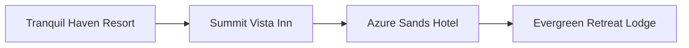

# How to Build a Recommender System From Clickstream Data

If you have a website with browsable products, your visitors generate a virtual flood of clickstream data. Say, for example, your site is for hotel bookings, and a site visitor browses hotels, starting with the Tranquil Haven Resort, and ending at the Evergreen Retreat Lodge:



 Why did they follow this route in particular? Maybe they wanted to check hotels with certain amenities, in the same location, with a certain style. We can't tell exactly what took the user down a particular path (clickstream). But you can take the clickstreams of all your users, use it to create embeddings for the hotels in the same vector space. In this space, the more "similar" the hotels are, the closer together they will be.

> An embedding is a numerical representation of categories that carry more meaning than a simple one-hot encoding. It is a vector of a float, and the length of the vector is called the embedding dimension.

In this article, we'll show you **how - with only a few lines of code, using techniques from NLP (natural language processing) - you can create embeddings that embody clickstream data, and use these embeddings to set up a simple recommendation system**.

All you need to do is:

  1. collect the clickstream data (usually very simple)
  2. clean it, if necessary
  3. use libraries such as [Gensim](https://radimrehurek.com/gensim/) to train an algorithm (e.g., Word2Vec) and generate our hotel embeddings on our clickstream data

Before we begin building our recommendation system (RecSys), we need to install some requisite libraries:
`pip install gensim umap-learn pandas matplotlib`.

Now that those are in place, let's get started!

## Gather and clean your data

To set up our example, we'll use [this artificial dataset](../assets/use_cases/recommender_from_clickstreams/clickstreams.txt). The first few lines out of 10,000 look like this:

```text
554>11>956>952>108>174>587>243>153>863>935>87>841
521>621>978>678>379>703>738
457>730>162>42>126>542>972>168>878
325>819>597>158>379>407>960>912>247
194>185>189>183>180>173>994>199>197>192>187
882>719>500>171>692>685>336>616>86>470>908>349>124>621>774>698>159>833
54>495>78
592>780>792
...
```

The numbers are hotel IDs (but this will work for numbers representing anything). To train our model and create embeddings for the hotels, we need to preprocess this data slightly.

```python
with open("clickstreams.txt", "r") as f:
    raw = f.read()
    clickstream = [line.split(">") for line in raw.split()]
```

After this preprocessing step, your data looks like this:

```text
[['554', '11', '956', '952', '108', '174', '587', '243', '153', '863', '935', '87', '841'],
 ['521', '621', '978', '678', '379', '703', '738'],
 ['457', '730', '162', '42', '126', '542', '972', '168', '878'],
 ['325', '819', '597', '158', '379', '407', '960', '912', '247']]
 ...
 ```

## Train the model, create embeddings

Once you have your data in this format, you can start the model training and create your embeddings. You just type the following:

```python
from gensim.models import Word2Vec

model = Word2Vec(
    clickstream,
    vector_size=16,
    sg=1,
    epochs=10,
)
```

Note that Gensim's Word2Vec model has [many more parameters](https://radimrehurek.com/gensim/models/word2vec.html#gensim.models.word2vec.Word2Vec) to check out.

Once the training has created the learned embeddings, you can access them like this:

```python
import pandas as pd

embeddings = pd.DataFrame(
    model.wv.vectors,
    index=model.wv.index_to_key
)
```

The first five rows of the resulting index of embeddings look like this:

|     |    0 |     1 |     2 |     3 |     4 |     5 |     6 |     7 |     8 |     9 |    10 |    11 |    12 |    13 |    14 |    15 |
|----:|-----:|------:|------:|------:|------:|------:|------:|------:|------:|------:|------:|------:|------:|------:|------:|------:|
|  99 | 1.48 |  0.52 |  0.27 |  0.67 |  0.11 | -0.94 | -1.16 | -0.29 | -0.05 |  0.85 | -0.1  |  1.04 |  0.8  | -0.46 | -0.13 |  0.75 |
| 900 | 1.73 |  0.24 | -0.29 |  0.61 |  0.34 |  0.94 | -0.43 | -0.73 |  0.77 |  1    | -0.5  | -0.6  |  0.4  |  0.39 |  0.92 | -0.66 |
| 700 | 0.2  |  1.18 |  0.06 |  0    | -0.58 | -1.05 | -1.36 |  0.32 |  1.08 |  0.04 | -0.57 | -0.73 | -0.68 |  0.02 |  0.4  | -0.12 |
| 800 | 0.93 |  1.04 |  0.7  |  0.05 |  0.75 | -0.23 |  0.31 |  0.72 |  0.79 |  0.37 |  0.05 |  1.32 |  0.3  |  1.03 |  0.19 | -1.18 |
| 199 | 1.5  | -0.75 | -0.07 | -1.02 | -1.29 |  0.23 | -0.6  |  0.06 |  1.04 | -0.15 |  0.77 |  0.53 | -0.47 |  0.62 |  0.38 | -0.18 |

The index's first column is the hotel ID. The next 16 columns (numbered 0-15) represent the learned embedding. There are 16 numbers because we set `vector_size=16`.

Now that you have an embedding for each hotel, you're ready to implement your hotel RecSys!

## Recommendation system: suggesting other hotels

 Starting from one hotel, now embedded in a shared vector space with embeddings for all your other hotels, you can simply ask for its **closest embeddings**. Querying hotel `123`, for example, will make your model generate a list of similar hotels.

Using Gensim, you can do this easily. Query

```python
model.wv.similar_by_word("123")
```

and you receive

```text
[('131', 0.9089741706848145),
 ('127', 0.8981987237930298),
 ('122', 0.8846656084060669),
 ('118', 0.8609521985054016),
 ('115', 0.8502810597419739),
 ('243', 0.8356520533561707),
 ('454', 0.8332993984222412),
 ('106', 0.8226854801177979),
 ('103', 0.8177634477615356),
 ('765', 0.8113372921943665)]
 ```

(Your numbers may differ.)

Here's how to read your output (above): Hotel 131 is most similar to Hotel 123, with a *cosine similarity* of about 0.91. The second most similar is Hotel 127, with a cosine similarity of about 0.9, and so on. 

So, starting with just the clickstream data of your site visitors, you've successfully created a RecSys!

> Cosine similarity is a measure of how similar two vectors are. It can range from -1 to 1 (similar to the Pearson correlation coefficient). If both vectors point in the same direction, cosine similarity is at the high end (closer to 1).
> 
> The formula is
> 
> $\text{Cosine Similarity}(\mathbf{A}, \mathbf{B}) = \frac{\mathbf{A} \cdot \mathbf{B}}{\|\mathbf{A}\|\cdot \|\mathbf{B}\|}=\frac{\sum_{i=1}^{n} A_i \cdot B_i}{\sqrt{\sum_{i=1}^{n} A_i^2} \cdot \sqrt{\sum_{i=1}^{n} B_i^2}}$
> 
> where $\mathbf{A}=(A_1, \ldots, A_n)$ and $\mathbf{B}=(B_1, \ldots, B_n)$ are two vectors.
>
> 

## Under the hood

Gensim's Word2Vec model is, basically, a fast implementation of ideas in Mikolov et al.'s groundbreaking 2013 NLP paper, [Efficient Estimation of Word Representations in Vector Space](https://arxiv.org/abs/1301.3781).

To train our model and create our embeddings, we use the Skip-gram version `sg=1` (rather than CBOW version) of Mikolov et al.'s Word2Vec model. Skip-gram Word2Vec works as follows.

Starting with the clickstream from our introduction (above):


We are trying to make our model understand (and embed) the relationships between the clickstream entities (in our case, hotels). These relationships can be represented as **skip-gram** pairs. Skip-grams are a popular NLP method for training a model to predict the context, or neighboring words, of a given target word. We want our model to be able to predict, for a given hotel ("focus"), who its immediate neighbors in a clickstream will be - i.e., the hotel right before it, and the hotel right after it. We can represent the clickstream data from our example above as a table of skip-gram pairs (below):

| Focus                   | Prediction              |
|-------------------------|-------------------------|
| Tranquil Haven Resort   | Summit Vista Inn        |
| Summit Vista Inn        | Tranquil Haven Resort   |
| Summit Vista Inn        | Azure Sands Hotel       |
| Azure Sands Hotel       | Summit Vista Inn        |
| Azure Sands Hotel       | Evergreen Retreat Lodge |
| Evergreen Retreat Lodge | Azure Sands Hotel       |

For predicting user behavior on websites we want our model to learn a probability score that a user having clicked on one given hotel (e.g., Tranquil Haven Resort) will click on another given hotel (e.g., Summit Vista Inn), and not on another hotel (e.g., Evergreen Retreat Lodge). This is a binary classification problem, so our model should be trained on binary data. This allows the model to directly learn a probability score of transitions between a specific hotel and another specific hotel, and makes the model architecture easier and more efficient. Here's how the clickstream data looks as binary training data for our model.

| Focus                   | Other Hotel             | Neighbor? |
|-------------------------|-------------------------|-----------|
| Tranquil Haven Resort   | Summit Vista Inn        | Yes       |
| Summit Vista Inn        | Tranquil Haven Resort   | Yes       |
| Summit Vista Inn        | Azure Sands Hotel       | Yes       |
| Azure Sands Hotel       | Summit Vista Inn        | Yes       |
| Azure Sands Hotel       | Evergreen Retreat Lodge | Yes       |
| Evergreen Retreat Lodge | Azure Sands Hotel       | Yes       |

But before we train our binary classifier on this data, we need to address **a limitation of our training data**. It's **constructed only of positive pairs** - i.e., hotels that were clicked sequentially in the clickstream. That is, the target column *Neighbor?* contains only a single label: "yes". Our model needs to learn more than just what constitutes "good" output - i.e., relevant hotel recommendations. It also needs to learn "bad" output - which hotels are irrelevant hotel recommendations. [Mikolov et al.'s proposed solution](https://arxiv.org/abs/1301.3781) for this was **negative sampling**. It needs to learn some "no"s.

### Negative sampling

If your clickstream training data consists only *positive* rows of neighbors (skip-grams), you can add some random negative pairs of hotels - ones that were *not* adjacent in the clickstreams - to ensure that the model learns how to avoid recommending hotels that are irrelevant.

In our case, such a table of training data with added negative sampling might look like:

| Focus                   | Other Hotel             | Neighbor? |
|-------------------------|-------------------------|-----------|
| Tranquil Haven Resort   | Summit Vista Inn        | Yes       |
| Tranquil Haven Resort   | Some Other Hotel 1      | No        |
| Summit Vista Inn        | Tranquil Haven Resort   | Yes       |
| Summit Vista Inn        | Some Other Hotel 2      | No        |
| Summit Vista Inn        | Azure Sands Hotel       | Yes       |
| Summit Vista Inn        | Some Other Hotel 1      | No        |
| Azure Sands Hotel       | Summit Vista Inn        | Yes       |
| Azure Sands Hotel       | Some Other Hotel 3      | No        |
| Azure Sands Hotel       | Evergreen Retreat Lodge | Yes       |
| Azure Sands Hotel       | Some Other Hotel 3      | No        |
| Evergreen Retreat Lodge | Azure Sands Hotel       | Yes       |
| Evergreen Retreat Lodge | Some Other Hotel 1      | No        |

By training our model on this data, we can create embeddings that encode both negative and positive relationships between hotels. In other words, we'll have a binary classifier that learns to predict whether a given pair of hotels are likely to be clicked successively, or not, and on this basis provide hotel recommendations.

And this, in a nutshell, is what happens under the hood.

### Hyperparameters

The ratio of positive to negative samples in the training data is a variable hyperparameter (a parameter whose value is set before the learning process begins) that can be optimized to fine-tune to get better embeddings - i.e., better performance. There are many other hyperparameters we can use to fine-tune - for example, embedding size - called `vector_size` in Gensim, which we've seen already. Another important hyperparameter is `window_size`, which enlarges the focus of the model, allowing us to take account of not just the immediate clickstream hotel neighbors but also those two or three steps away from the "focus" hotel.

## Conclusion

We've discussed how to take advantage of your website's clickstream data to easily create a recommendation system. You need only record your clickstream data, do a little preprocessing, and write about ten lines of code to train a model (using Gensim, for example) and create embeddings. Our example use case is hotels, but you can apply this approach to any clickstream data.

You may also just want to visualize your embeddings to gain more insight into your users' behavior. For this, you can use, for example, PCA, t-SNE, or UMAP to project your embeddings in two dimensions:

```python
import matplotlib.pyplot as plt
from umap import UMAP

t = UMAP(random_state=0).fit(model.wv.vectors)
plt.scatter(t.embedding_[:, 0], t.embedding_[:, 1])
```

Here's just such a 2D visualization of our example hotel embeddings, generated with UMAP.


As you can see, certain hotels form clusters. Though we can't know just from clustering what about the hotels is similar, we can further investigate the clusters for shared characteristics, and thereby gain insights into our data.

If you want to take advantage of the value latent in your clickstream data, whether it's to glean insights, or even build a working recommendation system, we encourage you to give our code a try!

Don't be a stranger. Let us know how it goes!

## Contributors

- [Dr. Robert Kübler](https://www.linkedin.com/in/robert-kuebler/)
- [Mór Kapronczay, Editor](https://www.linkedin.com/in/mór-kapronczay-49447692)
- [Robert Turner, Editor](https://www.linkedin.com/in/robertdhayanturner)
