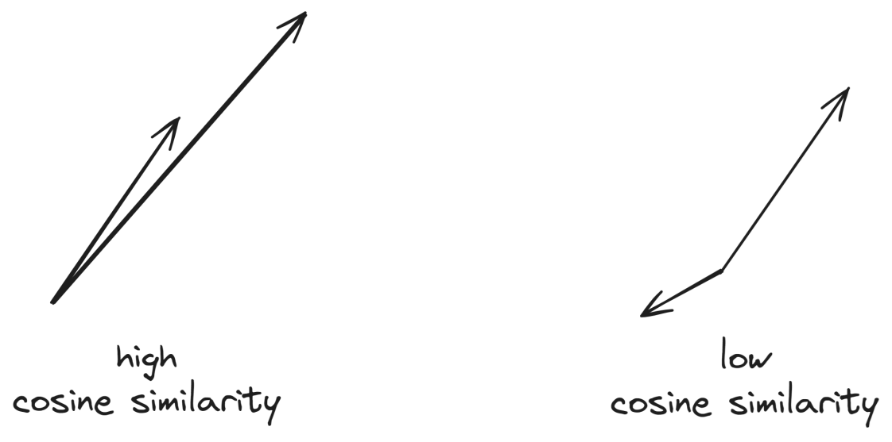
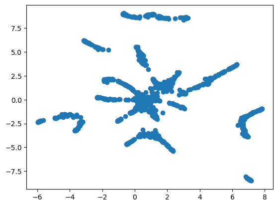

# How to Build a Recommender System From Clickstream Data

<!-- test comment -->

Whenever you have a website with products that customers can browse, you can hardly save yourself from the flood of **clickstream data**. For example, a user of a hotel website might produce the following data when browsing different hotels:


They start with the Tranquil Haven Resort, and end their browsing session with the Evergreen Retreat Lodge. We can do different things with this data now, one of them being finding **embeddings** for all hotels.

:::hint
Embeddings are numerical representations of categories that carry more meaning than a simple one-hot encoding. They are vectors of floats, and the length of this vector is called the embedding dimension.
:::

But what could these embeddings mean? Well, it depends on how the users interact with your website. In the special case of hotels, maybe you know this behavior from yourself or your partner: You want to stay close to some location and check out many hotels that look interesting to you.
Now, if we assume that most customers behave like this, then the embeddings of similar hotels are similar. So, we could build a **recommender for similar hotels** with this!

In this article, I want to show you how you can get these embeddings with only a few lines of code using techniques from NLP (natural language processing). You only need 
1. to collect the clickstream data, which is usually quite simple
2. clean it if necessary, and
3. use libraries such as [Gensim](https://radimrehurek.com/gensim/).

Let's see how this works! But before we start, let's install some libraries via `pip install gensim umap-learn pandas matplotlib`.


## Gather Your Data
In the following, we will use [this artificial dataset](../assets/use_cases/recommender_from_clickstreams/clickstreams.txt). The first few lines out of 10,000 look like this:
```text
554>11>956>952>108>174>587>243>153>863>935>87>841
521>621>978>678>379>703>738
457>730>162>42>126>542>972>168>878
325>819>597>158>379>407>960>912>247
194>185>189>183>180>173>994>199>197>192>187
882>719>500>171>692>685>336>616>86>470>908>349>124>621>774>698>159>833
54>495>78
592>780>792
...
```

The numbers are just some hotel IDs, but of course, it can be any other kind of ID as well. So, let us load the data and preprocess it slightly for Gensim to work.

```python
with open("clickstreams.txt", "r") as f:
    raw = f.read()
    clickstream = [line.split(">") for line in raw.split()]
```

Your data looks like this now:

```text
[['554', '11', '956', '952', '108', '174', '587', '243', '153', '863', '935', '87', '841'],
 ['521', '621', '978', '678', '379', '703', '738'],
 ['457', '730', '162', '42', '126', '542', '972', '168', '878'],
 ['325', '819', '597', '158', '379', '407', '960', '912', '247']]
 ...
 ```

 ## Train a Model
Once we have the data in this format, we can just type

```python
from gensim.models import Word2Vec

model = Word2Vec(
    clickstream,
    vector_size=16,
    sg=1,
    epochs=10,
)
```

to get the training going. Note that Gensim's Word2Vec model has [many more parameters](https://radimrehurek.com/gensim/models/word2vec.html#gensim.models.word2vec.Word2Vec) to check out.

Before I explain what this model does under the hood, let us see what comes out of the training. We can access the learned embeddings like this:

```python
import pandas as pd

embeddings = pd.DataFrame(
    model.wv.vectors,
    index=model.wv.index_to_key
)
```

The first five rows look like this:

|     |    0 |     1 |     2 |     3 |     4 |     5 |     6 |     7 |     8 |     9 |    10 |    11 |    12 |    13 |    14 |    15 |
|----:|-----:|------:|------:|------:|------:|------:|------:|------:|------:|------:|------:|------:|------:|------:|------:|------:|
|  99 | 1.48 |  0.52 |  0.27 |  0.67 |  0.11 | -0.94 | -1.16 | -0.29 | -0.05 |  0.85 | -0.1  |  1.04 |  0.8  | -0.46 | -0.13 |  0.75 |
| 900 | 1.73 |  0.24 | -0.29 |  0.61 |  0.34 |  0.94 | -0.43 | -0.73 |  0.77 |  1    | -0.5  | -0.6  |  0.4  |  0.39 |  0.92 | -0.66 |
| 700 | 0.2  |  1.18 |  0.06 |  0    | -0.58 | -1.05 | -1.36 |  0.32 |  1.08 |  0.04 | -0.57 | -0.73 | -0.68 |  0.02 |  0.4  | -0.12 |
| 800 | 0.93 |  1.04 |  0.7  |  0.05 |  0.75 | -0.23 |  0.31 |  0.72 |  0.79 |  0.37 |  0.05 |  1.32 |  0.3  |  1.03 |  0.19 | -1.18 |
| 199 | 1.5  | -0.75 | -0.07 | -1.02 | -1.29 |  0.23 | -0.6  |  0.06 |  1.04 | -0.15 |  0.77 |  0.53 | -0.47 |  0.62 |  0.38 | -0.18 |

The index consists of the hotel ID, and next to it, you find the 16 (since we have set `vector_size=16`) numbers that represent the learned embedding.

### Recommend alternative hotels
Since we have an embedding for each hotel, we can now ask for **closest embeddings** given an embedding for a hotel. This should give us hotels that are similar to the ones we query.

Using Gensim, you can easily do it via 
```python
model.wv.similar_by_word("123")
```
and you receive
```text
[('131', 0.9089741706848145),
 ('127', 0.8981987237930298),
 ('122', 0.8846656084060669),
 ('118', 0.8609521985054016),
 ('115', 0.8502810597419739),
 ('243', 0.8356520533561707),
 ('454', 0.8332993984222412),
 ('106', 0.8226854801177979),
 ('103', 0.8177634477615356),
 ('765', 0.8113372921943665)]
 ```
 (numbers might differ for you). Here is how to read it: Hotel 131 is most similar to Hotel 123, with a *cosine similarity* of about 0.91. The second most similar is Hotel 127 with a cosine similarity of about 0.9, and so on. So, here you have similar hotels according to the clickstreams of the users!

:::hint
The cosine similarity is a measure of how similar two vectors are. It can be between -1 and 1, similar to the Pearson correlation coefficient. It is rather large if both vectors point in the same direction. 

The formula is $\text{Cosine Similarity}(\mathbf{A}, \mathbf{B}) = \frac{\mathbf{A} \cdot \mathbf{B}}{\|\mathbf{A}\|\cdot \|\mathbf{B}\|}=\frac{\sum_{i=1}^{n} A_i \cdot B_i}{\sqrt{\sum_{i=1}^{n} A_i^2} \cdot \sqrt{\sum_{i=1}^{n} B_i^2}}$, where $\mathbf{A}=(A_1, \ldots, A_n)$ and $\mathbf{B}=(B_1, \ldots, B_n)$ are two vectors.
:::


## How Does It Work?
So, what is Gensim's Word2Vec model doing under the hood? Basically, it is a fast implementation of the ideas of Mikolov et al. in their paper [Efficient Estimation of Word Representations in Vector Space](https://arxiv.org/abs/1301.3781) from 2013, a true classic that changed the world of NLP forever (before transformers came around and disrupted it again).

The authors' Word2Vec comes in two flavors:
- CBOW
- Skipgram (we have used this with `sg=1` in the model!)

Let us take a look at how the Skipgram version works. So, assume that we have the clickstream from the introduction.

> **The fundamental idea**: For each hotel in this stream, we try to predict the hotel right before and after it.

In the example, we would create the following table:
| Focus                   | Prediction              |
|-------------------------|-------------------------|
| Tranquil Haven Resort   | Summit Vista Inn        |
| Summit Vista Inn        | Tranquil Haven Resort   |
| Summit Vista Inn        | Azure Sands Hotel       |
| Azure Sands Hotel       | Summit Vista Inn        |
| Azure Sands Hotel       | Evergreen Retreat Lodge |
| Evergreen Retreat Lodge | Azure Sands Hotel       |

Each pair in this table is also called a **skipgram**. However, we do not phrase the problem like this, but slightly different to model it as a binary classification problem. This has the advantage that the model architecture gets easier and more efficient.

| Focus                   | Other Hotel             | Neighbor? |
|-------------------------|-------------------------|-----------|
| Tranquil Haven Resort   | Summit Vista Inn        | Yes       |
| Summit Vista Inn        | Tranquil Haven Resort   | Yes       |
| Summit Vista Inn        | Azure Sands Hotel       | Yes       |
| Azure Sands Hotel       | Summit Vista Inn        | Yes       |
| Azure Sands Hotel       | Evergreen Retreat Lodge | Yes       |
| Evergreen Retreat Lodge | Azure Sands Hotel       | Yes       |

Do you see the problem when building a binary classifier for this table? The target column *Neighbor?* only contains a single label since this is how we have constructed this table! So, what the authors proposed was to use **negative sampling** to save the day.

### Negative sampling
The idea is simple: 
>If you only have *positive* rows consisting of neighbors, just make up some random pairs of hotels that were not seen next to each other in a sequence.
This can look like this:

| Focus                   | Other Hotel             | Neighbor? |
|-------------------------|-------------------------|-----------|
| Tranquil Haven Resort   | Summit Vista Inn        | Yes       |
| Tranquil Haven Resort   | Some Other Hotel 1      | No        |
| Summit Vista Inn        | Tranquil Haven Resort   | Yes       |
| Summit Vista Inn        | Some Other Hotel 2      | No        |
| Summit Vista Inn        | Azure Sands Hotel       | Yes       |
| Summit Vista Inn        | Some Other Hotel 1      | No        |
| Azure Sands Hotel       | Summit Vista Inn        | Yes       |
| Azure Sands Hotel       | Some Other Hotel 3      | No        |
| Azure Sands Hotel       | Evergreen Retreat Lodge | Yes       |
| Azure Sands Hotel       | Some Other Hotel 3      | No        |
| Evergreen Retreat Lodge | Azure Sands Hotel       | Yes       |
| Evergreen Retreat Lodge | Some Other Hotel 1      | No        |

And now, we can build a binary classifier that has to solve the reasonable classification task of finding out whether two hotels were clicked successively, or not.

And this is what happens under the hood in a nutshell. Of course, there are many more hyperparameters that you can tune to get better embeddings. We have seen the embedding size (called `vector_size` in Gensim) already. Another important hyperparameter is **window size** using the `window_size` parameter. This enlarges the focus of the model, so we are not only interested in the direct left and right neighbors of the hotel but also hotels that are maybe two or three steps apart from the focus element.

## Conclusion
We have seen how easy it is to get embeddings for hotels - or rather any type of item - that users click on in an online session. We only have to record the clickstream data and preprocess it a bit, so we can use Gensim to train a model in a few lines of code.

It is probably one of the easiest projects to set up, and still, you get really interesting results from it in the form of embeddings. You can then use these embeddings to either build a recommender system, but you can also just visualize them to gain more insights into your data.

As an example, you can use PCA, t-SNE, or UMAP to project the embeddings into two dimensions like this:
```python
import matplotlib.pyplot as plt
from umap import UMAP

t = UMAP(random_state=0).fit(model.wv.vectors)
plt.scatter(t.embedding_[:, 0], t.embedding_[:, 1])
```



Here, you can see how certain hotels form clusters, and it might be interesting to study them. But we will stop at this point for now. Give it a try with your datasets now! All it takes are about ten lines of code. Thanks for reading!

## Contributors

- Dr. Robert Kübler ([LinkedIn](https://www.linkedin.com/in/robert-kuebler/) / [Medium](https://medium.com/@dr-robert-kuebler))