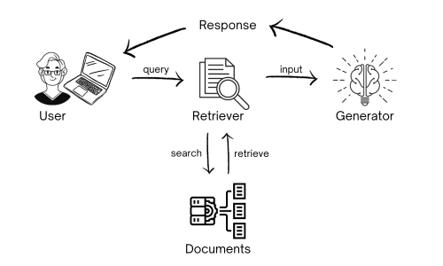

# Retrieval Augmented Generation



## The case for Retrieval-augmented Generation

Retrieval-augmented Generation (RAG) balances information retrieval, which finds existing information, with generation, which creates new content. When generation occurs without context, it can generate "hallucinations" - inaccurate / incorrect results. In customer support and content creation generally, hallucinations can have disastrous consequences. RAG prevents hallucinations by retrieving relevant context. It combines Large Language Models (LLMs) with external data sources and information retrieval algorithms. This makes RAG an extremely valuable tool in applied settings across many industries, including legal, education, and finance.

## Why are RAGs getting so much attention?

RAG has become the go-to tool for professionals that want to combine the power of LLMs with their proprietary data. RAG makes external data available to LLMs the way a prompter helps actors on stage remember their lines. RAG addresses instances where a generative model is unable by itself to produce a correct answer to a question; RAG fetches relevant information from an external database, thereby preventing hallucinations. 

Hallucinations are the bogeyman that continues to haunt all generative LLMs. Indeed, RAGs are one of the most widely discussed topics in the AI community (judging by experts' posts on LinkedIn and Twitter), _not_ because of RAG's performance on real-world problems; applying RAG in industry settings only really began this year (2023), so there isn't much robust data on them yet, [outside of academia](https://github.com/myscale/retrieval-qa-benchmark). Instead, it's specifically RAG's ability to deal with hallucinations that makes it such a hot topic.

## What are hallucinations and why are they dangerous?

A machine hallucination is a false piece of information created by a generative model. Though some argue that this anthropomorphism is [more harmful than helpful](https://betterprogramming.pub/large-language-models-dont-hallucinate-b9bdfa202edf
), saying that a machine "sees something that isn't there" is a helpful analogy for illustrating why machine hallucinations are bad for business. They are often named as one of the biggest blockers and concerns for industry adoption of [Generative AI and LLMs](https://fortune.com/2023/04/17/google-ceo-sundar-pichai-artificial-intelligence-bard-hallucinations-unsolved/). Google's inclusion of made-up information in their Chatbot new achievements presentation (February 2023) was [followed by a 7% fall in Alphabet's stock price](https://www.cnbc.com/2023/02/08/alphabet-shares-slip-following-googles-ai-event-.html). While the stock has since recovered and hit new historic highs, this hallucinatory incident demonstrated how sensitive the public, including investors, can be to the generation of incorrect information by AI. In short, if LLMs are put into production for use cases where there's more at stake than looking up restaurants on the internet, hallucinations can be disastrous.

## Retrieval and generation: a love story

As its name indicates, RAG consists of two opposing components: retrieval and generation. Retrieval finds information that matches an input query. It’s impossible by design to retrieve something that isn’t already there. Generation, on the other hand, does the opposite: it’s prone to hallucinations because it's supposed to generate language that isn’t an exact replication of existing data. If we had all possible responses in our data already, there would be no need for generation. If balanced well, these two opposites complement each other and you get a system that utilizes the best of both worlds - retrieve what’s possible and generate what’s necessary.

Let's take a quick look at our two components separately and what they are doing on a basic level, and then examine how they operate in their most common use cases.

1. **Retrieval**: A retrieval model, usually called a "retriever," searches for information in a document or a collection of documents. You can think of retrieval as a search problem. Traditionally, retrieval has been performed using rather simple techniques like term frequency-inverse document frequency (TF-IDF), which basically quantifies how relevant a piece of text is for each document in the context of other documents. Does this word occur often in document A but not in document B and C? If so, it's probably important. The retrieved documents are then passed to the context of our generative model.

2. **Generation**: Generative models, or generators, _can_ generate content without external context. But because context helps prevent hallucinations, retrievers are used to add information to generative models that they would otherwise lack. The most popular generative text models right now are without a doubt the LLMs of OpenAI, followed by Google's and Anthropic's. While these generators are already powerful out-of-the-box, RAG helps close the many knowledge gaps they suffer from. The retrieved context is simply added to the instruction of the LLM, and, thanks to a phenomenon called in-context learning, the model can incorporate the external knowledge without any updates to its weights.

## Common RAG use cases

Given how quickly and widely RAG is being adopted, it would be impractical here to explore all its sectors and use cases exhaustively. Instead, we'll focus on those use cases and settings where RAGs have seen the widest adoption.

### 1. Customer Support and Chatbots

Companies providing real-time customer support increasingly use RAG-powered chatbots. By integrating retrieval mechanisms to access customer-specific data, purchase histories, and FAQs, these chatbots can offer highly personalized and accurate responses. This not only enhances customer satisfaction but also reduces the workload on human customer support agents.

### 2. Content Generation and Copywriting

Marketing professionals and content creators increasingly employ RAG models to generate engaging and relevant content. By retrieving data from various sources, such as research articles, market reports, or user-generated content, RAG assists in crafting informative and persuasive articles, product descriptions, and advertisements.

### 3. Legal and Compliance

Lawyers and compliance officers deal with an extensive corpus of legal documents and regulations. RAG can simplify legal research by retrieving relevant case law, statutes, and precedents. It can also help in drafting legal documents and compliance reports by generating accurate and legally sound text based on the retrieved data.

### 4. Education and Training

Educators can enhance students' learning experience by creating personalized study materials using RAG models. RAG can retrieve relevant textbooks, research papers, and educational resources. Additionally, RAG-powered virtual tutors can provide explanations and answer student questions in a more contextually relevant manner.

### 5. Financial Services

Financial institutions increasingly leverage RAG to provide more insightful and data-driven services. Whether it's personalized investment advice based on market trends or retrieving historical financial data for risk analysis, RAG is proving to be an invaluable tool for making informed financial decisions.


All the above use cases are in sectors (e.g., legal, education, finance) that deal with overwhelming amounts of non-trivial text. RAG is built for and excels at this task, whether it's Question Answering (QA) and Summarization or reducing response rates and improving response quality.

That being said, if you are considering using an RAG, it's important to note that it is a complementary but not fool-proof method for improving generation context by adding external data. Most of the above use cases employ a human-in-the-loop as a guardrail, to ensure quality outcomes. You should carefully consider whether your use case might also warrant this kind of guardrail.


## RAG implementation example - retrieving accurate financial data

Let's say you want to make an investment decision, but you need accurate financial data to base it on. You can use RAG to ensure you're not getting erroneous information, and thereby preempt a poorly informed, potentially costly investment choice.

To start, we need an LLM library. We'll be using LangChain, a popular LLM library, because it supports most of the technology we will need out-of-the-box, and you'll be able to switch in any components of your preference, such as your favorite vector database or LLM.

First, install all the libraries that we will import later:

```console

pip install langchain openai faiss-cpu \

transformers sentence-transformers \

accelerate einops pypdf sentencepiece

```

On the model side, we'll use Hugging Face's Transformers library, and Microsoft's lightweight phi-1.5, which performs remarkably well despite being only 1.7B parameters in size.

```python

import torch

from transformers import AutoModelForCausalLM, AutoTokenizer

torch.set_default_device('cuda')

model = AutoModelForCausalLM.from_pretrained("microsoft/phi-1_5", trust_remote_code=True, torch_dtype="auto")

tokenizer = AutoTokenizer.from_pretrained("microsoft/phi-1_5", trust_remote_code=True, torch_dtype="auto")

```

Imagine we are hobby investors and are considering investing in Tesla. We want to know how the company performed in Q2 this year (2023). Let's ask our LLM about Tesla's revenue.

```python

# Tokenizing our input string

inputs = tokenizer('''What was the revenue of Tesla for Q2 2023? \nAnswer:''', return_tensors="pt", return_attention_mask=False)

# Generating a response with a max length 100 characters

outputs = model.generate(**inputs, max_length=100)

text = tokenizer.batch_decode(outputs)[0]

# Printing the output

print(text.split("\n\n")[0])

```

```console

What was the revenue of Tesla for Q2 2023? 

Answer: Tesla's revenue for Q2 2023 was $1.2 billion.

```

Despite our model's confident assertion, it turns out that Tesla's February earnings were _not_ the $1.2 billion it claims. In fact, this result is way off. Without external data, we might have believed phi-1.5's result, and made a poorly informed investment decision.

So how can we fix this? You already know the answer: RAG to the rescue. In order to retrieve relevant context, we need a document to retrieve from in the first place. We will download Tesla's financial report for Q2 2023 from their website.

```console

!wget -O tesla_q2_2023.pdf https://digitalassets.tesla.com/tesla-contents/image/upload/IR/TSLA-Q2-2023-Update.pdf

```

Great. Next, we will transform the PDF into texts and store them as vector embeddings in a basic vector store. We will then perform a simple similarity search on our documents (aka retrieval).

```python

from langchain.vectorstores import FAISS

from langchain.embeddings import HuggingFaceEmbeddings

from langchain.document_loaders import PyPDFLoader

# Loading the PDF as text and splitting it into pages

loader = PyPDFLoader("tesla_q2_2023.pdf")

pages = loader.load_and_split()

# Creating indexed vector embeddings from our documents

vectorstore = FAISS.from_documents(pages, HuggingFaceEmbeddings())

# Searching for vectors similar to our input query with KNN

docs = vectorstore.similarity_search("What was the revenue?", k=2)

# Printing the documents to see what was retrieved

docs

```

Following is the relevant (answer-containing) part of the documents, not the full output:

```console

Revenue Total revenue grew 47% YoY in Q2 to $24.9B. 

YoY, revenue was impacted by the following items: 

+growth in vehicle deliveries 

+growth in other parts of the business 

-reduced ASP YoY (excluding FX impact) 

-negative FX impact of $0.6B1

```

Let's create our context in the simplest way possible by attaching the results to a single string:

```python

context = ""

for doc in docs:

	context += doc.page_content

```

Finally, we will use the same tokenization and generation pipeline as we did earlier, except this time we will add the context we retrieved in front of our question.

```python

# Tokenizing our input string

inputs = tokenizer(f'''{context} \n\nWhat was the revenue of Tesla for Q2 2023? \nAnswer:''',

return_tensors="pt",

return_attention_mask=False

)

# Generating a response based on our context with a max length to 1000 characters

outputs = model.generate(**inputs, max_length=1000)

text = tokenizer.batch_decode(outputs)[0]

# Splitting the output by "\n\n" to only print the question and answer part

print(text.split("\n\n")[1])

```

```console

What was the revenue of Tesla for Q2 2023? 

Answer: Tesla's revenue for Q2 2023 was $24.9 billion.

```

Et voilà! If you go back to the passage from the financial report that we printed out above, you can see that our new, retrieval augmented figure of "\$24.9 billion" is the correct answer to our question. That's approximately 20x the amount phi-1.5 hallucinated earlier ($1.2 billion). Using RAG has saved us from what could've been a terrible investment decision.

## Conclusion

In summary, RAG can add value to your LLM pipelines by combining the internal knowledge of your models with relevant context from external data sources. In this way, RAG can prevent hallucinations, and more generally adapt LLMs to new data efficiently. This makes RAG a popular choice for applications in sectors and use cases that deal with overwhelming amounts of non-trivial text, including customer support, content generation, legal and compliance, education, and finance.

One final caveat: When using RAG, you have to make sure the documents you're retrieving from do *actually* include the answers you're looking for. As with all things Data Science: garbage in, garbage out.

---
## Contributors

- [Pascal Biese, author](https://www.linkedin.com/in/pascalbiese/)
- [Robert Turner, editor](https://robertturner.co/copyedit)
