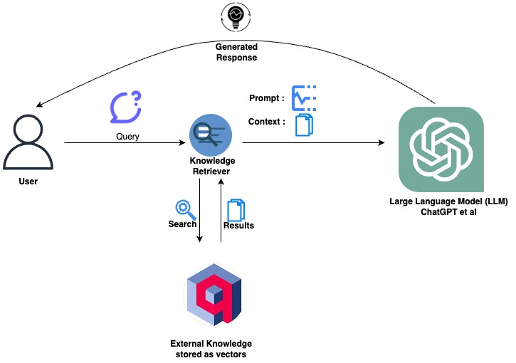
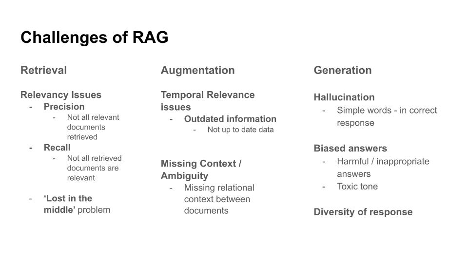
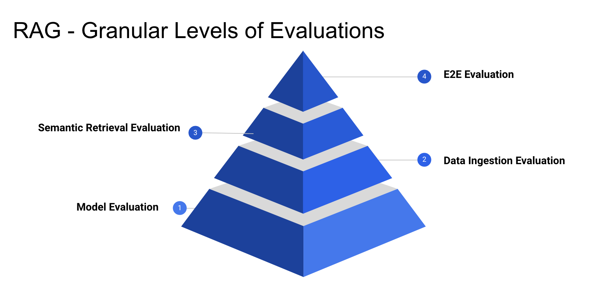

# Evaluating Retrieval Augmented Generation - a framework for assessment

*In this first article of a three-part (monthly) series, we introduce RAG evaluation, outline its challenges, propose an effective evaluation framework, and provide a rough overview of the various tools and approaches you can use to evaluate your RAG application.*

## Why evaluate RAG?

Retrieval Augmented Generation (RAG) is probably the most useful application of large language models today. RAG enhances content generation by leveraging existing information effectively. It can amalgamate specific, relevant details from multiple sources to generate more accurate and relevant query results. This makes RAG potentially invaluable in various domains, including content creation, question & answer applications, and information synthesis. RAG does this by combining the strengths of retrieval, usually using dense vector search, and text generation models, like GPT. For a more in-depth introduction to RAG, read [here](articles/retrieval-augmented-generation). 



*RAG system (above) using* <a href="https://qdrant.tech" rel="nofollow">*Qdrant*</a> *as the knowledge store. To determine which Vector Database fits your specific use case, refer to the* [*Vector DB feature matrix*](https://vdbs.superlinked.com/).

**But to see what is and isn't working in your RAG system, to refine and optimize, you have to evaluate it**. Evaluation is essential to validate and make sure your application does what users expect it to. In this article (the first of three, one per month), we go over the broad strokes of our proposed evaluation framework, which includes separate assessments of the model itself, data ingestion, semantic retrieval, and, finally, the RAG application end-to-end, providing a high level discussion of what's involved in each.

In article 2, we'll look at RAGAS ([RAG Assessment](https://github.com/explodinggradients/ragas)), learn how to set it up with an example, calculate some of the supported metrics, and compare that with our proposed framework. We'll also examine some examples of our proposed framework. Then, in article 3, we will look at [Arize AI](https://arize.com/)'s way of evaluating RAG applications, using Phoenix Evals to focus on Retrieval evaluation and Response evaluation.

## Why do we need RAG?

RAG significantly enhances [vector search](building-blocks/vector-search/introduction) with the power of Large Language Models (LLM), by enabling dynamic content generation based on  retrieved knowledge. RAG is indispensable when users seek to generate new content rather than interact with documents or search results directly. It excels in providing contextually rich, informative, and human-like responses. For tasks requiring detailed, coherent explanations, summaries, or responses that transcend the explicit data stored in vectors, RAG is invaluable. _Before setting up a RAG system, you should consider conducting feasibility studies to determine how and whether RAG aligns with your specific needs and value expectations._

While vector search efficiently retrieves relevant similar documents/chunks from a document corpus, RAG permits content synthesis and a deeper level of understanding, providing essential context to queries and results generation. In this way, RAG can ensure that answers are unique and tailored to each query, in essence personalized to the user.

These are the promises of RAG. But how do we make sure that our RAG system is achieving its potential?

## Evaluating RAG

In the process of scaling RAG from Proof-of-concept (POC) to production for clients in academia and finance, we've learned many things - including various data processing and enrichment techniques, how to choose a model to understand the 'domain specific' jargon, the combined impact of the former techniques and model on retrieval, how to bolster with creative prompts, built with guardrails, to generate trustworthy and informative responses, and so on. But our chief takeaway was the **importance of evaluation in enhancing and refining our RAG system**.

> If you can't quantify it, you can't improve it. - Peter Drucker

In the case of RAG, not only is it important to have good metrics, but that you measure things separately. That is:

> If you can't retrieve it, you can't generate it.

To see where things are going well, can be improved, and also where errors may originate, it's important to evaluate each component in isolation. In the following visual, we've classified RAG's components - Information Retrieval, Context Augmentation, and Response Generation - along with what needs evaluation in each:



*The challenges of RAG evaluation (above), including the* [*'Lost in the Middle'*](https://arxiv.org/abs/2307.03172) *problem*.

The evaluation framework we propose is meant to ensure granular and thorough measurement, addressing the challenges faced in all three components. Broadly, we want to assess:

- Retrieval effectiveness - the degree to which the information retrieved from the underlying vector database is semantically relevant to the intention of the user's query.
- Relevance of responses to retrieved information - how meaningful and aligned the generated responses are with the content and context of retrieved information.
- Coherence of generated responses - how logically connected, fluent, and contextually consistent generated responses are when compared to the user's query.
- Up-to-date data - how reflective of real-world changes your RAG application's database is, to meet user expectations. Commonly, your RAG database will be dynamic, and include not just new queries but also continuously revised data from real-time data streams, economic fluctuations, business metrics, or research data, etc.

## Strategies for Evaluation

To meet these evaluation challenges systematically, it's best practice to break down our evaluation into different levels, so that we understand what specifically is working well, and what needs improvement.



Let's take a closer look to see what's involved in each of these levels individually.

### Model Evaluation

We want to ensure that the model can understand the data that we encode. The [Massive Text Embedding Benchmark (MTEB)](https://huggingface.co/spaces/mteb/leaderboard) leverages different public/private datasets to evaluate and report on the different capabilities of individual models. We can use the MTEB to evaluate any model in its list. If, on the other hand, you're working with specialized domains, you may want to put together a specialized dataset to train the model. Another option is to run relevant 'tasks' for your custom model, using instructions available [here](https://github.com/embeddings-benchmark/mteb#leaderboard). 

For a custom SentenceTransformer-based model, we can set up evaluation tasks as in the following code. We import, configure, initialize, and then evaluate our model:

```python
import logging

from mteb import MTEB
from sentence_transformers import SentenceTransformer

logging.basicConfig(level=logging.INFO)

model_name = "<<CUSTOM_MODEL_NAME>>"
model = SentenceTransformer(model_name)
evaluation = MTEB(task_langs=["en"])
evaluation.run(model, output_folder=f"results/{model_name}", eval_splits=["test"])

print("--DONE--")
```

### Data Ingestion Evaluation

After we evaluate our model’s performance using benchmarks, and (optionally) fine-tune it on the language of our domain, we can then configure data ingestion into our semantic retrieval store (vector store). Various [vector databases](https://vdbs.superlinked.com/) offer index configurations (of whatever index types the database supports) to influence and enhance the retrieval quality. Common index types include Flat (Brute Force), LSH (Locality Sensitive Hashing), HNSW (Hierarchical Navigable Small World), and IVF (Inverted File Index). Here's one such <a href="https://qdrant.tech/documentation/tutorials/retrieval-quality/" rel="nofollow">example, based on HNSW retrieval-quality</a>.

To evaluate data ingestion, we need to observe and measure how changes in related variables affect ingestion outcomes. For example:
* **Chunk size** - the size of each data segment, which depends on the token limit of our embedding model. Chunk size substantially determines data granularity and the contextual understanding of the data, which impacts the precision, recall, and relevancy of our results.
* **Chunk overlap** - the extent to which data points of events are shared by adjacent data chunks. Overlap helps with retention of context information contained in chunks, but should be paired with strategies like deduplication and content normalization to eradicate adverse effects (redundancy or inconsistency).
* **Chunking/Text splitting strategy** - the process of data splitting and further treatment, based on both data type (e.g. html, markdown, code, or pdf, etc.) and nuances of your use-case. For example, summarization use-cases might split segments based on chapters or paragraphs; a legal document assistant may section docs based on headings and subsections; a medical literature assistant might split docs based on sentence boundaries or key concepts.

Utilities like [ChunkViz](https://chunkviz.up.railway.app/) help visualize different chunk splitting strategies on different chunk sizes and chunk overlaps.

### Semantic Retrieval Evaluation

Semantic retrieval evaluation puts the work you've done so far in evaluating your model and ingestion to a litmus test, and can be approached like a classic information retrieval evaluation problem - that is, using metrics such as precision, recall, accuracy, and F1-score to determine if retrieved documents are relevant.

First, we establish what we expect the returned results to look like in terms of important parameters. This guides our choice of reference metrics. We have several existing metrics to inform and define our baseline:
- Precision (accuracy), Recall (completeness), or their combination F1 Score
- DCG (Discounted Cumulative Gain) and nDCG (normalized DCG), which measure the relevance quality of ranked lists of documents

But semantic retrieval, because it goes beyond mere keyword matching, synonyms, and token-level enrichment, and encompasses broader semantic understanding and context, typically requires a "ground truth" evaluation set - a [Golden Set](https://www.luigisbox.com/search-glossary/golden-set/). A Golden Set assesses the correctness and faithfulness of generated answers to a human annotated reference set.
 
To generate a starter pack for evaluation using a Golden Set, we can leverage the [T5 Model](https://huggingface.co/docs/transformers/model_doc/t5).

### End-to-End Evaluation

An end-to-end evaluation of a RAG application assesses the final outputs generated by LLMs in response to given inputs. It requires addressing issues discussed above related to data heterogeneity, domain specificity, and user query and preference diversity. It's impossible to devise a fixed metric or methodology that fits all domains and use-cases.

To address these difficulties, you can assess the fidelity and quality of generated text using established metrics like [BLEU](https://huggingface.co/spaces/evaluate-metric/bleu) and [ROUGE](https://huggingface.co/spaces/evaluate-metric/rouge), and combine these scores with LLM-based or human evaluation methods. This [Quality Criteria paper](https://scholarspace.manoa.hawaii.edu/server/api/core/bitstreams/c6a53998-09e3-4d17-91fd-c7416d51b250/content) provides some excellent ideas for creating such a solution.

## In sum

To summarize, a robust RAG evaluation strategy requires you to establish methods to automatically evaluate similarity and content overlap between generated response and reference summaries. You can also leverage human evaluation to evaluate subjective information, such as context-relevance, novelty, and fluency. In addition, you can build a classified 'domain - questions' set based on question complexity (easy, medium, hard). Doing this will provide you with an overall sense of the RAG application's performance.

While our proposed evaluation strategy is meant to improve RAG evaluation, we should acknowledge that no evaluation is perfect, and it remains complicated and challenging to formulate a comprehensive set of evaluation metrics.

## What's next

We've laid a general foundation for discussing RAG evaluation. In the next article (next month), we'll demystify an existing evaluation framework (RAGAS), and see how well it does at covering all the layers of evaluation we've discused. Looking forward to seeing you in the next part!

## Contributors 
 
[Atita Arora, Author](https://www.linkedin.com/in/atitaarora/) 
[Mór Kapronczay, Editor](https://www.linkedin.com/in/mór-kapronczay-49447692) 
[Robert Turner, Editor](https://robertturner.co/copyedit) 
