# RAG Evaluation with Arize Phoenix

This is the third and final installation in a series on RAG Evaluation - picking up where we left off after [Principles of RAG Evaluation](https://superlinked.com/vectorhub/articles/evaluating-retrieval-augmented-generation-framework) (article one) and [RAG Evaluation with RAGAS](https://superlinked.com/vectorhub/articles/retrieval-augmented-generation-eval-qdrant-ragas) (article two) In this article we'll take you through RAG Evaluation using another popular framework tool called [Arize Phoenix](https://phoenix.arize.com/).

Below, we'll cover:
- key concepts and metrics in Phoenix
- evaluating a Naive [RAG](https://superlinked.com/vectorhub/articles/retrieval-augmented-generation) system using Phoenix
- building a [Hybrid RAG](https://superlinked.com/vectorhub/articles/optimizing-rag-with-hybrid-search-reranking) system
- evaluating a Hybrid RAG system using Phoenix

> The code here is from our [github repo](https://github.com/qdrant/qdrant-rag-eval/tree/master/workshop-rag-eval-qdrant-arize).
> There's also a walkthrough workshop [video](https://www.youtube.com/watch?v=m_J0nFmnrPI) available for reference.

Lets begin!

## Key concepts and metrics in Phoenix

[Phoenix](https://phoenix.arize.com/) is Arize's [open-source](https://github.com/Arize-ai/phoenix) observability library, and can be implemented whether your application runs locally - in Jupyter notebook or a Docker container - or you're pushing it into staging and production. Phoenix is designed for experimentation, data visualization, evaluation, troubleshooting, and optimization across different layers and stages of an LLM-based system.

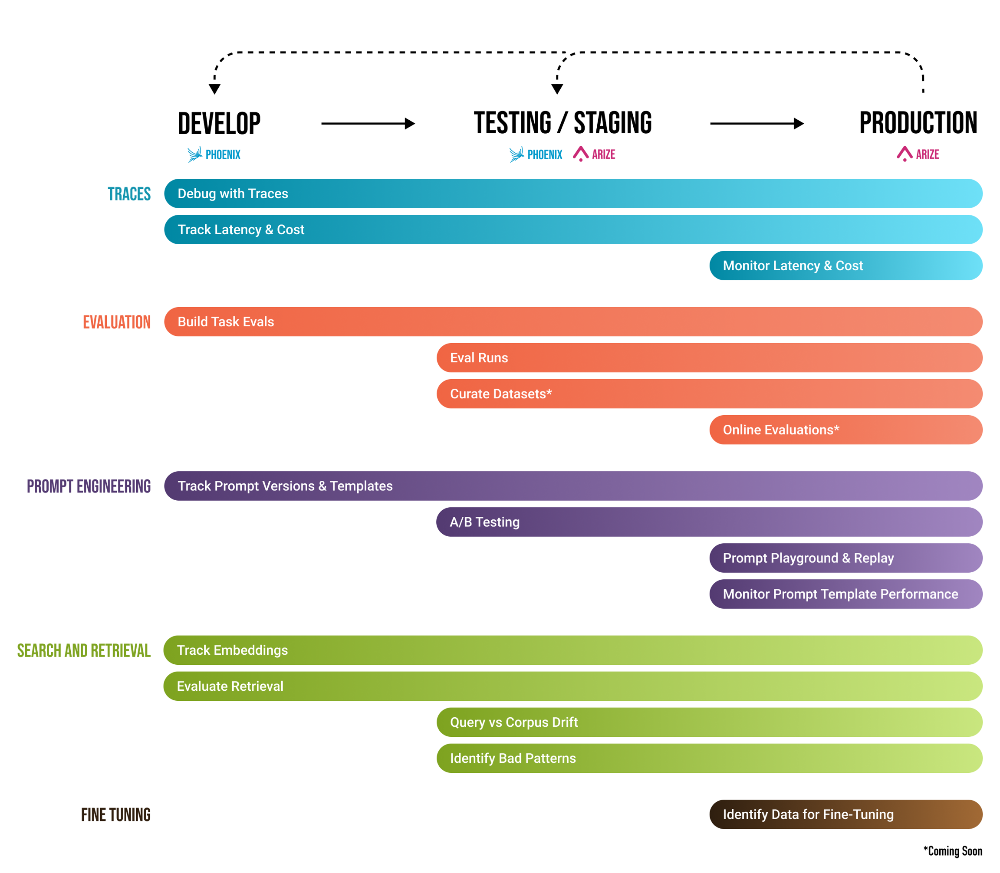

### Observing and optimizing using Phoenix

LLM applications are complex. To optimize them for speed, cost, or accuracy, you need to understand their internal state. Each step of the response generation process needs to be monitored, evaluated, and tuned. Phoenix lets us evaluate whether a retrieved chunk contains an answer to a query. This process involves tracing, prompt iteration, search and retrieval, and [evaluating specific tasks](https://arize.com/blog-course/llm-evaluation-the-definitive-guide/). Examining telemetry data such as LLM Traces is key.

**Traces** are made up of a sequence of `spans`, each of which represents a unit of work or operation. Using traces, you can track and peer into each of the specific operations involved in a request. Phoenix's [LLM tracing](https://docs.arize.com/phoenix/tracing/llm-traces-1) application, by monitoring the building blocks of your system while it's running, can provide a complete topology of its inner workings, enabling you to improve your LLM through fine-tuning.

LLM Tracing supports the following span types:

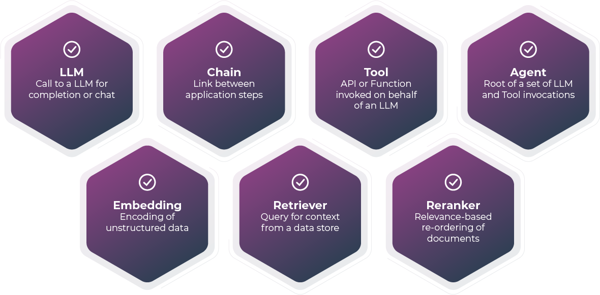

Let's see what this looks like **in practice**.

## Evaluating Naive RAG using Phoenix

We'll be using Phoenix to evaluate a Naive RAG application similar to the one we built in our [previous article](https://superlinked.com/vectorhub/articles/retrieval-augmented-generation-eval-qdrant-ragas).

We'll use the `qdrant_docs_arize_dens` collection to index our Naive RAG documents:

```python
## Collection Name 
COLLECTION_NAME = "qdrant_docs_arize_dense"

## Initialize the space to work with llama-index and related settings
import llama_index
from llama_index.core import Settings
from llama_index.vector_stores.qdrant import QdrantVectorStore
from phoenix.trace import suppress_tracing
## Uncomment the following line if you'd like to use OpenAI Embeddings instead of FastEmbed
#from llama_index.embeddings.openai import OpenAIEmbedding

## For the complete list of supported models, please check https://qdrant.github.io/fastembed/examples/Supported_Models/
from llama_index.embeddings.fastembed import FastEmbedEmbedding

vector_store = QdrantVectorStore(client=client, collection_name=COLLECTION_NAME)

storage_context = StorageContext.from_defaults(vector_store=vector_store)

Settings.embed_model = FastEmbedEmbedding(model_name="BAAI/bge-small-en-v1.5")

## Uncomment the following line if you'd like to use OpenAI Embeddings instead of FastEmbed
# Settings.embed_model = OpenAIEmbedding(model="text-embedding-ada-002")

Settings.llm = OpenAI(model="gpt-4-1106-preview", temperature=0.0)
```

We load docs into our Qdrant collection as follows:

```python
## Indexing the vectors into Qdrant collection 
from phoenix.trace import suppress_tracing
with suppress_tracing():
  dense_vector_index = VectorStoreIndex.from_documents(
      documents,
      storage_context=storage_context,
      show_progress=True
  )
```

Once we've finished loading our data, we create our **dense-vector retriever**:

```python
##Initializing retriever to interact with the Qdrant collection
dense_retriever = VectorIndexRetriever(
    index=dense_vector_index,
    vector_store_query_mode=VectorStoreQueryMode.DEFAULT,
    similarity_top_k=2
)
```

We'll use the `dense_retriever` in Phoenix to evaluate our Naive RAG pipeline.

For documentation, we'll employ the pre-compiled **[hugging-face dataset](https://huggingface.co/datasets/atitaarora/qdrant_doc)** (from our [previous article](https://superlinked.com/vectorhub/articles/retrieval-augmented-generation-eval-qdrant-ragas)), which consists of `text` and `source`.

Let’s load our evaluation dataset:

```python
## Loading the Eval dataset
from datasets import load_dataset
qdrant_qa = load_dataset("atitaarora/qdrant_doc_qna", split="train")
qdrant_qa_question = qdrant_qa.select_columns(['question'])
qdrant_qa_question['question'][:10]

#Outputs
['What is vaccum optimizer ?',
 'Tell me about ‘always_ram’ parameter?',
 'What is difference between scalar and product quantization?',
 'What is ‘best_score’ strategy?',
 'How does oversampling helps?',
 'What is the purpose of ‘CreatePayloadIndexAsync’?',
 'What is the purpose of ef_construct in HNSW ?',
 'How do you use ‘ordering’ parameter?',
 'What is significance of ‘on_disk_payload’ setting?',
 'What is the impact of ‘write_consistency_factor’ ?']
```

Next, we define our `response_synthesizer` and associate it with the `query_engine` to facilitate collection of traces for our evaluations.

```python
from llama_index.core import get_response_synthesizer
from llama_index.core.query_engine import RetrieverQueryEngine

#define response synthesizer
response_synthesizer = get_response_synthesizer()

#assemble query engine for dense retriever
dense_query_engine = RetrieverQueryEngine(
                     retriever=dense_retriever,
                     response_synthesizer=response_synthesizer,)

#query_engine = index.as_query_engine()
for query in tqdm(qdrant_qa_question['question'][:10]):
    try:
      dense_query_engine.query(query)
    except Exception as e:
      pass
```

Now, we open the Phoenix UI locally using [this link](http://localhost:6006/), and click through the queries to see how the query engine is performing. Your traces should appear in real time.

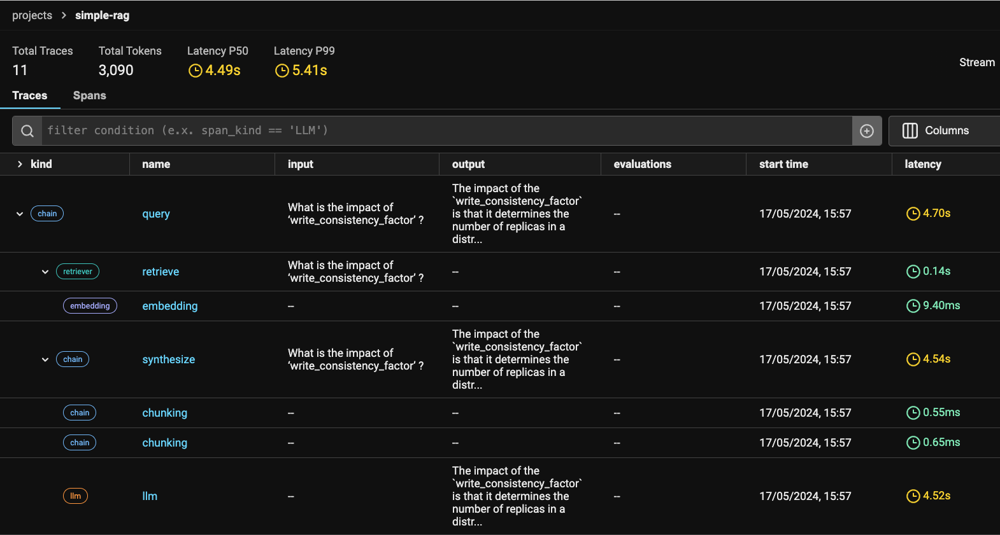

For each trace, we can see a span breakdown. You can also click on the spans tab for a complete list:

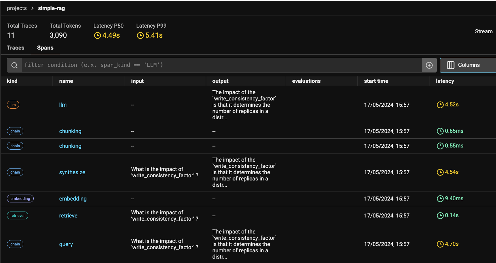

### What Phoenix can reveal

You can use Phoenix to understand and troubleshoot your application by tracing:
- Application latency
- Token usage
- Runtime exceptions
- Retrieved documents
- Embeddings
- Prompt templates
- Tool descriptions
- LLM function calls

When you run Phoenix, you can **export your trace data as a pandas dataframe for further analysis and evaluation**. In this case, we'll export our retriever spans into **two separate dataframes**:
- **queries_df**, where the retrieved documents for each query are concatenated into a single column
- **retrieved_documents_df**, where each retrieved document is "exploded" into its own row, letting you evaluate each query-document pair in isolation

This will enable us to compute multiple kinds of **evaluations**, including:
- relevance: Are the retrieved documents pertinent to the query?
- Q&A correctness: Are your application's responses grounded in the retrieved context?
- hallucinations: Is your application making up false information?

Setting this up is simple:

```jsx
queries_df = get_qa_with_reference(px.Client())
retrieved_documents_df = get_retrieved_documents(px.Client())
```

Next, we define our evaluation model and evaluators.

### Define evaluation model and evaluators

Evaluators, built on top of LLMs, prompt the LLM to assess the quality of its responses, the relevance of retrieved documents, etc., *without requiring human-labeled data*.

You can choose your preferred evaluator type, and then instantiate it with the LLM you want to employ for evaluation. In our example case, we choose three evaluators to assess hallucinations, QA correctness, and relevance:

```python
eval_model = OpenAIModel(
    model="gpt-4-turbo-preview",
)
hallucination_evaluator = HallucinationEvaluator(eval_model)
qa_correctness_evaluator = QAEvaluator(eval_model)
relevance_evaluator = RelevanceEvaluator(eval_model)

hallucination_eval_df, qa_correctness_eval_df = run_evals(
    dataframe=queries_df,
    evaluators=[hallucination_evaluator, qa_correctness_evaluator],
    provide_explanation=True,
)
relevance_eval_df = run_evals(
    dataframe=retrieved_documents_df,
    evaluators=[relevance_evaluator],
    provide_explanation=True,
)[0]

px.Client().log_evaluations(
    SpanEvaluations(eval_name="Hallucination", dataframe=hallucination_eval_df),
    SpanEvaluations(eval_name="QA Correctness", dataframe=qa_correctness_eval_df),
)
px.Client().log_evaluations(DocumentEvaluations(eval_name="Relevance", dataframe=relevance_eval_df))
```

Once we've executed this code, our evaluations should appear as annotations on the appropriate spans in Phoenix.

### Key observations (evaluating Naive RAG with Phoenix)

Here's the aggregated view of our evaluations:

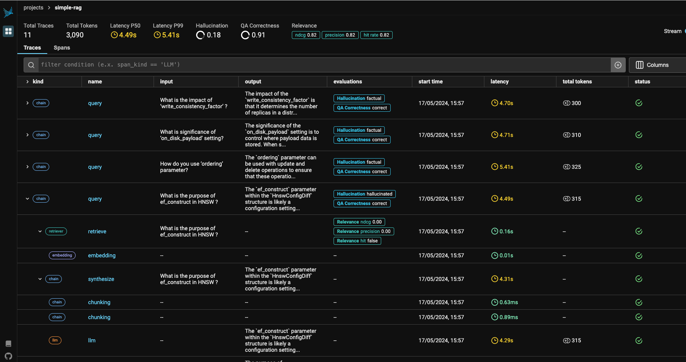

Above, we can see `Total Traces` (essentially, the total number of eval queries run), `Total Tokens` processed, `Latency P50`, `Latency P99`, `Hallucination`, and `QA Correctness`, along with Overall `Relevance` metrics like *nDCG*, *Precision*, and *Recall*.

In our Naive RAG evaluation, `Hallucination` = 18% and `QA Correctness` = 91%. Decent, but our aim is **0% Hallucination** and **100% QA Correctness**. So, let's see if we can figure out which query/ies lead to our less than ideal outcomes, and address the issue/s.

For each eval question, `evaluations` captures the `Hallucination` and `QA Correctness` metrics, making it easy to spot problematic queries immediately. We can zoom into each trace, and inspect its spans to get further details on each query and the output from the configured retriever.

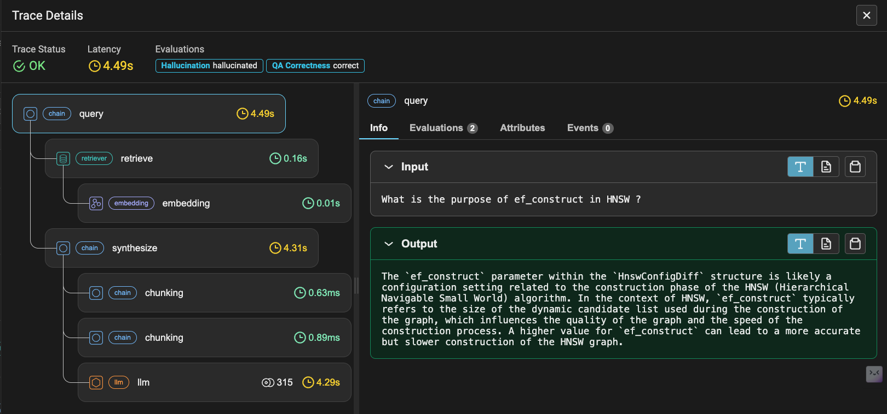

If we take a look at the `Evaluations` tab, we can see that the response was "hallucinated" even though it is "correct" according to the QA Correctness metrics.

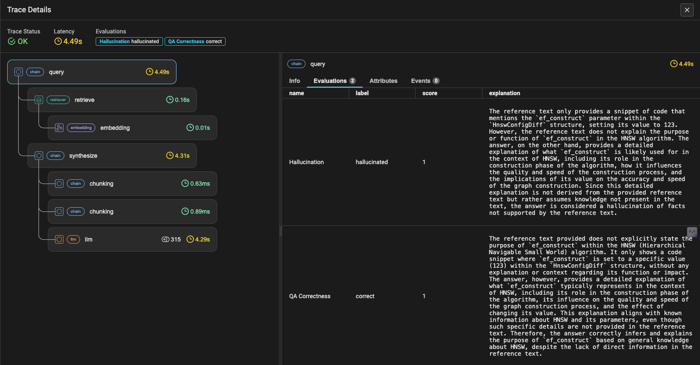

This can happen for various reasons, including domain- or use case-specific terminology requiring exact matches. To handle this, we can *enrich our retriever* so that it's powered by *not just dense but also sparse vectors*. That is, we can retrieve not just content based on semantic similarity, but also exact matches. In other words, we can build a hybrid RAG system.

## Building a Hybrid RAG

To build a hybrid RAG, we start by creating a new vector index for the same dataset.

```python
## Define a new collection to store your hybrid emebeddings
COLLECTION_NAME_HYBRID = "qdrant_docs_arize_hybrid"
```

We'll use [Splade++](https://huggingface.co/prithivida/Splade_PP_en_v1) for our sparse vector model, and bge-small-en-1.5 for our dense embeddings. Both of these models are handled through the Fastembed library.

```python
##List of supported sparse vector models
from fastembed.sparse.sparse_text_embedding import SparseTextEmbedding
SparseTextEmbedding.list_supported_models()

Outputs
{'model': 'prithivida/Splade_PP_en_v1',
  'vocab_size': 30522,
  'description': 'Independent Implementation of SPLADE++ Model for English',
  'size_in_GB': 0.532,
  'sources': {'hf': 'Qdrant/SPLADE_PP_en_v1'}}
```

We employ our two models (supported by Fastembed) to compute and ingest both sparse and dense vectors into our Qdrant Collection. We set up our system as follows:

```python
## Initializing the space to work with llama-index and related settings
import llama_index
from llama_index.core import Settings
from llama_index.vector_stores.qdrant import QdrantVectorStore
from fastembed.sparse.sparse_text_embedding import SparseTextEmbedding, SparseEmbedding
from llama_index.embeddings.fastembed import FastEmbedEmbedding
from typing import List, Tuple

sparse_model_name = "prithivida/Splade_PP_en_v1"

# This triggers the model download
sparse_model = SparseTextEmbedding(model_name=sparse_model_name, batch_size=32)

## Computing sparse vectors
def compute_sparse_vectors(
    texts: List[str],
    ) -> Tuple[List[List[int]], List[List[float]]]:
    indices, values = [], []
    for embedding in sparse_model.embed(texts):
        indices.append(embedding.indices.tolist())
        values.append(embedding.values.tolist())
    return indices, values

## Creating a vector store with Hybrid search enabled
hybrid_vector_store = QdrantVectorStore(
    client=client,
    collection_name=COLLECTION_NAME_HYBRID,
    enable_hybrid=True,
    sparse_doc_fn=compute_sparse_vectors,
    sparse_query_fn=compute_sparse_vectors)

storage_context = StorageContext.from_defaults(vector_store=hybrid_vector_store)

Settings.embed_model = FastEmbedEmbedding(model_name="BAAI/bge-small-en-v1.5")
```

Now we push our sparse and dense vectors into our hybrid vector Qdrant collection:

```python
## Note : Ingesting sparse and dense vectors into Qdrant collection
from phoenix.trace import suppress_tracing
with suppress_tracing():
    hybrid_vector_index = VectorStoreIndex.from_documents(
        documents,
        storage_context=storage_context,
        show_progress=True
    )
```

At this point, we tell Phoenix to `suppress_tracing` to avoid unnecessary latency and superfluous log data.

As with our Naive RAG system, we'll build a retriever for this Hybrid index - i.e., a `hybrid_retriever`. But before experimenting with hybrid search, for comparison we can first try interacting with our Sparse index through a `sparse_retriever`, which should retrieve documents based on `exact match`.

```python
## Before trying Hybrid search , let's try Sparse Vector Search Retriever
from llama_index.core.vector_stores.types import VectorStoreQueryMode
from llama_index.core.indices.vector_store import VectorIndexRetriever

sparse_retriever = VectorIndexRetriever(
    index=hybrid_vector_index,
    vector_store_query_mode=VectorStoreQueryMode.SPARSE,
    sparse_top_k=2,
)

## Pure sparse vector search
nodes = sparse_retriever.retrieve("What is a Merge Optimizer?")
for i, node in enumerate(nodes):
    print(i + 1, node.text, end="\n")
```

Now, let's create and try our `hybrid_retriever`.

```python
## Let's try Hybrid Search Retriever now using the 'alpha' parameter that controls the weightage between 
## the dense and sparse vector search scores.
# NOTE: For hybrid search (0 for sparse search, 1 for dense search)

hybrid_retriever = VectorIndexRetriever(
    index=hybrid_vector_index,
    vector_store_query_mode=VectorStoreQueryMode.HYBRID,
    sparse_top_k=1,
    similarity_top_k=2,
    alpha=0.1,
)
```

In the snippet above, the `alpha` parameter is our magic button for sliding between sparse and dense vector search. We set our retriever to `alpha=0.1`, which means 90% of the relevance score of our query outcomes result from sparse vector search, and 10% from dense vector search.

`alpha` is, of course, adjustible to your use case's requirements. Though it shouldn't be changed arbitrarily, if you were to change it, you would do it like this:

```python
hybrid_retriever._alpha = 0.1
#or
hybrid_retriever._alpha = 0.9
```

Next, we’ll **build a query engine** on top of our Hybrid Retriever:

```python
from llama_index.core import get_response_synthesizer
from llama_index.core.query_engine import RetrieverQueryEngine

#define response synthesizer
response_synthesizer = get_response_synthesizer()

#assemble query engine for hybrid retriever
hybrid_query_engine = RetrieverQueryEngine(
                        retriever=hybrid_retriever,
                        response_synthesizer=response_synthesizer,)
```

We use this `hybrid_query_engine` to perform an evaluation using the same set of eval questions we used above to evaluate our Naive RAG system.

## Evaluating a Hybrid RAG system using Phoenix

Phoenix lets you switch workspaces / projects on the fly - a useful feature for keeping different experiments segregated. Accordingly, we'll use a **separate project space** for our Hybrid Search evaluations:

```python
## Switching phoenix project space
from phoenix.trace import using_project

# Switch project to run evals
with using_project(HYBRID_RAG_PROJECT)
```

Now we can run our evaluation.

```python
## Switching phoenix project space
from phoenix.trace import using_project

# Switch project to run evals
with using_project(HYBRID_RAG_PROJECT):
# All spans created within this context will be associated with the `HYBRID_RAG_PROJECT` project.

    ##Reuse the previously loaded dataset `qdrant_qa_question`
    
    for query in tqdm(qdrant_qa_question['question'][:10]):
        try:
          hybrid_query_engine.query(query)
        except Exception as e:
          pass
```

We log and store our eval df’s as before:

```python
## Switching phoenix project space
from phoenix.trace import using_project

queries_df_hybrid = get_qa_with_reference(px.Client(), project_name=HYBRID_RAG_PROJECT)
retrieved_documents_df_hybrid = get_retrieved_documents(px.Client(), project_name=HYBRID_RAG_PROJECT)
```

Finally, we define our Evaluators for our Hybrid RAG.

```python
# all spans created within this context will be associated with the `HYBRID_RAG_PROJECT` project.
eval_model = OpenAIModel(
    model="gpt-4-turbo-preview",
)
hallucination_evaluator = HallucinationEvaluator(eval_model)
qa_correctness_evaluator = QAEvaluator(eval_model)
relevance_evaluator = RelevanceEvaluator(eval_model)

hallucination_eval_df_hybrid, qa_correctness_eval_df_hybrid = run_evals(
    dataframe=queries_df_hybrid,
    evaluators=[hallucination_evaluator, qa_correctness_evaluator],
    provide_explanation=True,
)
relevance_eval_df_hybrid = run_evals(
    dataframe=retrieved_documents_df_hybrid,
    evaluators=[relevance_evaluator],
    provide_explanation=True,
)[0]

px.Client().log_evaluations(
    SpanEvaluations(eval_name="Hallucination", dataframe=hallucination_eval_df_hybrid),
    SpanEvaluations(eval_name="QA Correctness", dataframe=qa_correctness_eval_df_hybrid),
    project_name=HYBRID_RAG_PROJECT,
)
px.Client().log_evaluations(DocumentEvaluations(eval_name="Relevance", dataframe=relevance_eval_df_hybrid),
                            project_name=HYBRID_RAG_PROJECT)
```

Note that your project now has 2 workspaces:

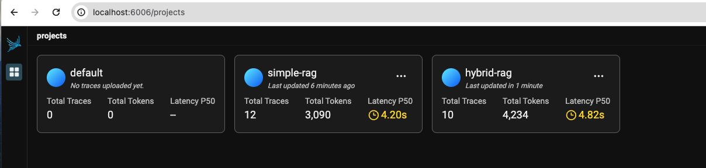

## Key outcomes (Evaluating Hybrid RAG with Phoenix)

Now, let's take a closer look at our hybrid-rag workspace.

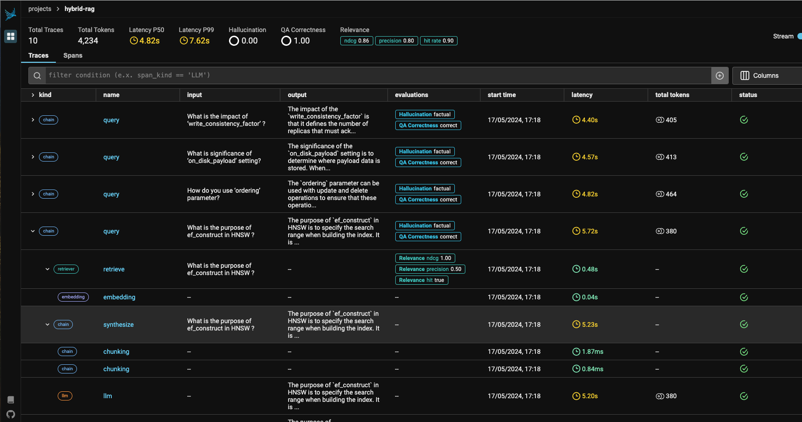

`Hallucination` is 0.00, and `QA Correctness` is 1.00.

Also, importantly, the question `What is the purpose of ef_construct in HNSW ?` which hallucinated in our Naive RAG system, now shows as "factual":

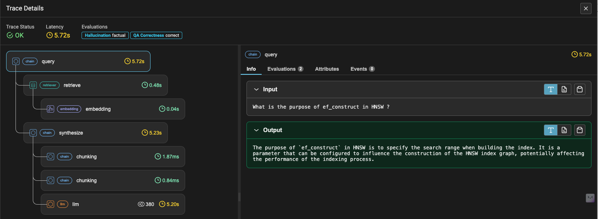

We get the same improved result in the `Evaluation` tab:

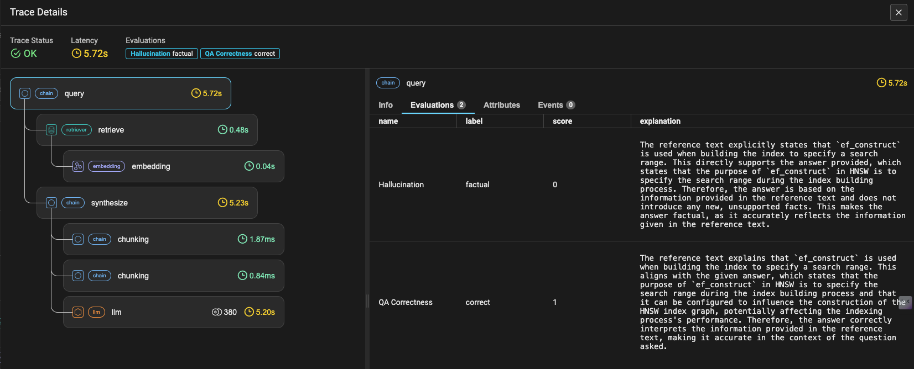


## Concluding thoughts

In the [previous article](https://superlinked.com/vectorhub/articles/retrieval-augmented-generation-eval-qdrant-ragas), we experimented with improving our RAG Evaluation score by trying different *Retrieval Window sizes*. In this article, on the other hand, we tried a *Multi- / Hybrid vector* approach to improve our RAG pipeline results.

When you do your own experiments with Phoenix, pay careful attention to the requirements of your use case. In the example above, we chose an LLM and sparse and dense embedding models based on domain understanding and response capabilities, and an `alpha` parameter that achieved the right balance between sparse and dense vector search.

We should mention that there are other ways - outside the scope of this article - of improving your RAG pipeline. You can also experiment with, for example:
- *different chunk sizes and overlaps* - based on the nature of queries and response expectations
- *rerankers* - based on preset or custom relevance criteria
- *query and response enrichment* - based on the level required before and after retrieval state

Now it's your turn to try! Don’t forget to star and contribute your experiments. We welcome your feedback and suggestions.

The complete code for this article is [here](https://github.com/qdrant/qdrant-rag-eval/tree/master/workshop-rag-eval-qdrant-arize).