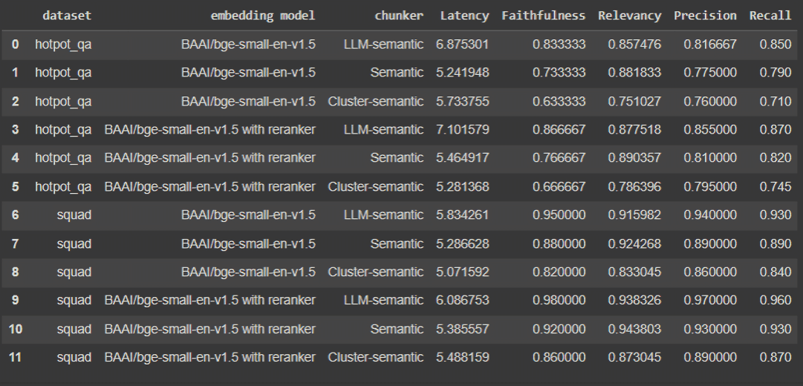

<!-- SEO: Explore semantic chunking for Retrieval Augmented Generation (RAG) in this comprehensive guide. Learn about embedding similarity, hierarchical clustering, and LLM-based methods for optimal text chunking. Discover how semantic chunking improves RAG performance compared to traditional rule-based approaches. Includes code examples, evaluation metrics, and comparisons using HotpotQA and SQUAD datasets with BAAI/bge-small-en-v1.5 embeddings.
-->

# Semantic Chunking

Chunking is simply dividing data into smaller manageable pieces. Similar to how it is easier for a human to cognitively manage smaller pieces of information, it is easier for a computer to work with information divided into smaller chunks. In the context of Retrieval Augmented Generation (RAG), chunking plays a great role, especially when it comes to large datasets. The large dataset is divided into chunks and stored in vector databases and indexes. When there is a user query, it is easier to skim through and retrieve the most relevant chunks only without hassle.

There are various ways we can chunk a document. The choice of chunking method can significantly impact the performance of a RAG system, depending on the nature of the data and the specific RAG implementation. Some widely used chunking algorithms include fixed character splitter, recursive character splitter, document-specific splitter, semantic splitter, and agentic splitter.

In this article, we will explore the semantic chunking algorithm in detail and comprehensively evaluate it using different embedding models and datasets.


## What is Semantic Chunking? 

The idea of semantic chunking is pretty simple. The semantic splitter adaptively picks the breakpoint in between sentences by comparing embedding similarity. This ensures that each chunk contains semantically cohesive sentences. 

Although there can be variations, the algorithm typically uses a sliding window approach to compare adjacent sentences. It calculates the cosine similarity between the embeddings of consecutive sentences, establishing a threshold to determine chunk boundaries. When the similarity drops below this threshold, it signals a shift in semantic content and marks a breakpoint. 

The workflow basically consists of 3 steps:


1.	Split the text into sentences.

    

2.	Generate embeddings for the sentences.

    

3. Group similar sentences comparing their embeddings.

    
    
## Types of Semantic Chunking

The document's semantics can be inferred in various ways for optimal chunking. Here are 3 ways you can implement semantic chunkers.

### Embedding Similarity Based
This method creates chunks by comparing semantic similarities between sentences. For this, the cosine distance between consecutive sentence embeddings is calculated.

Before moving forward, let's install and import the required libraries.

``` Python
import numpy as np
from sklearn.metrics.pairwise import cosine_similarity
from sklearn.metrics.pairwise import cosine_distances
from transformers import AutoTokenizer, AutoModel
import torch
```
Define helper function using regular expressions to split the text into sentences based on punctuation followed by whitespace.

``` Python
def _split_sentences(text):
    sentences = re.split(r'(?<=[.?!])\s+', text)
    return sentences

```
To provide a wider context, create a buffer by combining each sentence with its previous and next sentence. This function combines adjacent sentences to form a context window for each sentence.

``` Python

def _combine_sentences(sentences):
    combined_sentences = []
    for i in range(len(sentences)):
        combined_sentence = sentences[i]
        if i > 0:
            combined_sentence = sentences[i-1] + ' ' + combined_sentence
        if i < len(sentences) - 1:
            combined_sentence += ' ' + sentences[i+1]
        combined_sentences.append(combined_sentence)
    return combined_sentences
```
Define a cosine similarity distance calculation function and an embedding function that generates embeddings.

```Python
def _calculate_cosine_distances(embeddings):
    distances = []
    for i in range(len(embeddings) - 1):
        similarity = cosine_similarity([embeddings[i]], [embeddings[i + 1]])[0][0]
        distance = 1 - similarity
        distances.append(distance)
    return distances


def get_embeddings(texts, model_name="BAAI/bge-small-en-v1.5"):
    tokenizer = AutoTokenizer.from_pretrained(model_name)
    model = AutoModel.from_pretrained(model_name)

    encoded_input = tokenizer(texts, padding=True, truncation=True, return_tensors="pt")

    with torch.no_grad():
        model_output = model(**encoded_input)
    
    embeddings = mean_pooling(model_output, encoded_input['attention_mask'])

    return embeddings.numpy()

def mean_pooling(model_output, attention_mask):
    token_embeddings = model_output[0]  
    input_mask_expanded = attention_mask.unsqueeze(-1).expand(token_embeddings.size()).float()
    return torch.sum(token_embeddings * input_mask_expanded, 1) / torch.clamp(input_mask_expanded.sum(1), min=1e-9)
```

The next function is where chunking is done. After calculating cosine distances, this function determines a threshold for identifying breakpoints. **breakpoint_percentile_threshold** is used as an input to calculate **breakpoint_distance_threshold**, which is the actual distance value we'll use to determine breakpoints. It finds indices where distances exceed this threshold, indicating potential chunk boundaries. The code then iterates through these indices, creating chunks by joining sentences between breakpoints. Finally, it handles any remaining sentences after the last breakpoint, ensuring all text is included in the chunks.

```Python
def chunk_text(text):
    single_sentences_list = _split_sentences(text)
    print(single_sentences_list)
    combined_sentences = _combine_sentences(single_sentences_list)
    print(combined_sentences)
    embeddings = get_embeddings(combined_sentences)
    distances = _calculate_cosine_distances(embeddings)

    # Determine the threshold distance for identifying breakpoints based on the 80th percentile of all distances.
    breakpoint_percentile_threshold = 80
    breakpoint_distance_threshold = np.percentile(distances, breakpoint_percentile_threshold)
    # Find all indices where the distance exceeds the calculated threshold, indicating a potential chunk breakpoint.
    indices_above_thresh = [i for i, distance in enumerate(distances) if distance > breakpoint_distance_threshold]
   
    chunks = []
    start_index = 0
    for index in indices_above_thresh:
        chunk = ' '.join(single_sentences_list[start_index:index+1])
        chunks.append(chunk)
        start_index = index + 1

    # If there are any sentences left after the last breakpoint, add them as the final chunk.
    if start_index < len(single_sentences_list):
        chunk = ' '.join(single_sentences_list[start_index:])
        chunks.append(chunk)

    return chunks
```

You can also try reducing the threshold to get more chunks. Here is a sample output.

```Python
text = """
Regular exercise is essential for maintaining overall health and well-being. It helps in controlling weight,
improving cardiovascular health, and boosting mental health.
Engaging in physical activity regularly can also enhance the immune system, reduce the risk of chronic diseases,
and increase energy levels. Regular workouts are known to improve muscle strength and flexibility, which can prevent injuries and enhance mobility.
Moreover, exercise contributes to better sleep and improved mood, which are crucial for daily functioning.
Physical activity can also help reduce symptoms of anxiety and depression, leading to a more balanced emotional state.
Activities like walking, jogging, or swimming can be easily incorporated into a daily routine, making it accessible for everyone.
By setting realistic goals and staying consistent, individuals can enjoy these benefits and lead a healthier lifestyle.
Group fitness classes or sports teams can provide motivation and social support, making exercise more enjoyable and sustainable.
"""
chunks = chunk_text(text)
for i, chunk in enumerate(chunks, 1):
    print(f"Chunk {i}:")
    print(chunk)
    print("----------------------------------------------------------------------------")

print(f"\nTotal number of chunks: {len(chunks)}")
```
``` txt
Chunk 1:

Regular exercise is essential for maintaining overall health and well-being. It helps in controlling weight,
improving cardiovascular health, and boosting mental health. Engaging in physical activity regularly can also enhance the immune system, reduce the risk of chronic diseases,
and increase energy levels. Regular workouts are known to improve muscle strength and flexibility, which can prevent injuries and enhance mobility.
----------------------------------------------------------------------------
Chunk 2:
Moreover, exercise contributes to better sleep and improved mood, which are crucial for daily functioning. Physical activity can also help reduce symptoms of anxiety and depression, leading to a more balanced emotional state. Activities like walking, jogging, or swimming can be easily incorporated into a daily routine, making it accessible for everyone.
----------------------------------------------------------------------------
Chunk 3:
By setting realistic goals and staying consistent, individuals can enjoy these benefits and lead a healthier lifestyle. Group fitness classes or sports teams can provide motivation and social support, making exercise more enjoyable and sustainable.
----------------------------------------------------------------------------
```


### Hierarchical Clustering Based 

In this approach, we group sentences as clusters using hierarchical clustering based on semantic similarities. Cosine distances between embeddings of consecutive sentences are calculated as in the previous case.

Import required libraries.

```Python
import numpy as np
from sklearn.metrics.pairwise import cosine_similarity
from sklearn.metrics.pairwise import cosine_distances
from sklearn.metrics import silhouette_score
from scipy.cluster.hierarchy import linkage, fcluster
from transformers import AutoTokenizer, AutoModel
import torch
```
Utility functions are same. The **chunk_text** function here uses hierarchical clustering to group the sentences' embeddings based on their cosine distances, which measure how similar or different the sentences are. The linkage method builds a hierarchical cluster tree. You can either specify a fixed number of clusters or use a distance threshold to control how closely sentences need to be grouped. The function then assigns each sentence to a cluster and returns the resulting clusters as chunks of text.

```Python
def chunk_text(text, num_clusters=4, distance_threshold=None):

    single_sentences_list = _split_sentences(text)
    print(single_sentences_list)

    combined_sentences = _combine_sentences(single_sentences_list)
    print(combined_sentences)

    
    embeddings = get_embeddings(combined_sentences)


    distance_matrix = cosine_distances(embeddings)

    
    Z = linkage(distance_matrix, method='average')  # 'average' is for average linkage; you can also try 'ward', 'complete', etc.


    if num_clusters:
        cluster_labels = fcluster(Z, t=num_clusters, criterion='maxclust')
    elif distance_threshold:
        cluster_labels = fcluster(Z, t=distance_threshold, criterion='distance')
    else:
        raise ValueError("Either num_clusters or distance_threshold must be specified.")

    
    chunks = []
    current_chunk = []
    current_label = cluster_labels[0]

    for i, sentence in enumerate(single_sentences_list):
        if cluster_labels[i] == current_label:
            current_chunk.append(sentence)
        else:
            # Start a new chunk when the cluster label changes
            chunks.append(' '.join(current_chunk))
            current_chunk = [sentence]
            current_label = cluster_labels[i]

    # Append the last chunk
    if current_chunk:
        chunks.append(' '.join(current_chunk))

 
    return chunks
```

Lets see a sample output to understand further.

```Python
text = """
Regular exercise is essential for maintaining overall health and well-being. It helps in controlling weight,
improving cardiovascular health, and boosting mental health.
Engaging in physical activity regularly can also enhance the immune system, reduce the risk of chronic diseases,
and increase energy levels. Regular workouts are known to improve muscle strength and flexibility, which can prevent injuries and enhance mobility.
Moreover, exercise contributes to better sleep and improved mood, which are crucial for daily functioning.
Physical activity can also help reduce symptoms of anxiety and depression, leading to a more balanced emotional state.
Activities like walking, jogging, or swimming can be easily incorporated into a daily routine, making it accessible for everyone.
By setting realistic goals and staying consistent, individuals can enjoy these benefits and lead a healthier lifestyle.
Group fitness classes or sports teams can provide motivation and social support, making exercise more enjoyable and sustainable.
"""
chunks = chunk_text(text)
for chunk in chunks:
    print(chunk,"\n----------------------------------------------------------------------------\n")
print(f"\n{len(chunks)} chunks")
```

Output:
```Text
Chunk 1:

Regular exercise is essential for maintaining overall health and well-being. It helps in controlling weight,
improving cardiovascular health, and boosting mental health. Engaging in physical activity regularly can also enhance the immune system, reduce the risk of chronic diseases,
and increase energy levels. 
----------------------------------------------------------------------------

Chunk 2:

Regular workouts are known to improve muscle strength and flexibility, which can prevent injuries and enhance mobility.
Moreover, exercise contributes to better sleep and improved mood, which are crucial for daily functioning. Physical activity can also help reduce symptoms of anxiety and depression, leading to a more balanced emotional state. 
----------------------------------------------------------------------------

Chunk 3:

Activities like walking, jogging, or swimming can be easily incorporated into a daily routine, making it accessible for everyone. By setting realistic goals and staying consistent, individuals can enjoy these benefits and lead a healthier lifestyle. Group fitness classes or sports teams can provide motivation and social support, making exercise more enjoyable and sustainable.
----------------------------------------------------------------------------
```


For a more optimized choice of clusters, we can incorporate **Within-Cluster Sum of Squares (WCSS)**. WCSS is a measure of the compactness of clusters. It calculates the sum of the squared distances between each point in a cluster and the cluster's centroid. Lower WCSS indicates more compact, tightly-knit clusters, ie, sentences within each chunk are more semantically similar. The **elbow point** is a heuristic method for determining the optimal number of clusters. It's the point where adding more clusters doesn't significantly reduce the WCSS. 

```Python
from sklearn.metrics import silhouette_score
def determine_optimal_clusters(embeddings, max_clusters=10):
    distance_matrix = cosine_distances(embeddings)
   
    Z = linkage(distance_matrix, method='average')
   
    wcss = []
    for n_clusters in range(2, max_clusters + 1):
        cluster_labels = fcluster(Z, t=n_clusters, criterion='maxclust')
        wcss.append(calculate_wcss(embeddings, cluster_labels))
   
    total_variance = np.sum((embeddings - np.mean(embeddings, axis=0))**2)
    explained_variance = [1 - (w / total_variance) for w in wcss]
   
    optimal_clusters = find_elbow_point(range(2, max_clusters + 1), explained_variance)
   
    return optimal_clusters

def calculate_wcss(data, labels):
    n_clusters = len(set(labels))
    wcss = 0
    for i in range(n_clusters):
        cluster_points = data[labels == i+1]
        cluster_mean = np.mean(cluster_points, axis=0)
        wcss += np.sum((cluster_points - cluster_mean)**2)
    return wcss

def find_elbow_point(x, y):
    diffs = np.diff(y, 2)
    return x[np.argmax(diffs) + 1]

def chunk_text_with_clusters(text, num_clusters):
    single_sentences_list = _split_sentences(text)
    combined_sentences = _combine_sentences(single_sentences_list)
    embeddings = get_embeddings(combined_sentences)

    distance_matrix = cosine_distances(embeddings)
    Z = linkage(distance_matrix, method='average')
    cluster_labels = fcluster(Z, t=num_clusters, criterion='maxclust')

    chunks = []
    current_chunk = []
    current_label = cluster_labels[0]

    for i, sentence in enumerate(single_sentences_list):
        if cluster_labels[i] == current_label:
            current_chunk.append(sentence)
        else:
            chunks.append(' '.join(current_chunk))
            current_chunk = [sentence]
            current_label = cluster_labels[i]

    if current_chunk:
        chunks.append(' '.join(current_chunk))

    return chunks


def chunk_text(text, max_clusters=10):
    single_sentences_list = _split_sentences(text)
    combined_sentences = _combine_sentences(single_sentences_list)
    embeddings = get_embeddings(combined_sentences)
   
    optimal_clusters = determine_optimal_clusters(embeddings, max_clusters)
   
    return chunk_text_with_clusters(text, num_clusters=optimal_clusters)
```

You can change the value of max_clusters depending on the length of the text. Let us plot the final results. The elbow point is where the rate of decrease sharply shifts.


Silhouette score considers both how similar an object is to its cluster and how different it is from other clusters. A high silhouette score indicates that the clustering is appropriate, while a low score might suggest that the number of clusters needs to be reconsidered.

Coming to the outputs, we have 5 chunks this time.

```Text
Chunk 1:

Regular exercise is essential for maintaining overall health and well-being. It helps in controlling weight,
improving cardiovascular health, and boosting mental health. Engaging in physical activity regularly can also enhance the immune system, reduce the risk of chronic diseases,
and increase energy levels. Regular workouts are known to improve muscle strength and flexibility, which can prevent injuries and enhance mobility.
----------------------------------------------------------------------------

Chunk 2:

Moreover, exercise contributes to better sleep and improved mood, which are crucial for daily functioning.
----------------------------------------------------------------------------

Chunk 3:

Physical activity can also help reduce symptoms of anxiety and depression, leading to a more balanced emotional state. Activities like walking, jogging, or swimming can be easily incorporated into a daily routine, making it accessible for everyone.
----------------------------------------------------------------------------

Chunk 4:

By setting realistic goals and staying consistent, individuals can enjoy these benefits and lead a healthier lifestyle.
----------------------------------------------------------------------------

Chunk 5:

Group fitness classes or sports teams can provide motivation and social support, making exercise more enjoyable and sustainable.

```


### LLM Based 
Here, the semantic assessment is done by a large language model. This variation uses simple prompt engineering to enable the LLM to decide the breakpoints and return the chunks.
The implementation uses the idea of propositions. 

Take a look at the [paper](https://arxiv.org/pdf/2312.06648.pdf) which proposes this idea. Propositions represent individual facts or ideas expressed in clear, standalone natural language statements. Each proposition conveys a single, discrete piece of information in a concise and self-sufficient manner. We aim to find them by prompting the LLM.

Here is the complete code implemented with a base class from LangChain:

```Python
from langchain.text_splitter import TextSplitter
from typing import List
import uuid
from langchain_huggingface import HuggingFacePipeline
from langchain import PromptTemplate
from transformers import AutoTokenizer, AutoModelForCausalLM, pipeline, BitsAndBytesConfig, AutoModel
from langchain_community.llms import HuggingFaceHub
from langchain.chains import create_extraction_chain_pydantic
from pydantic import BaseModel
from langchain_core.prompts import ChatPromptTemplate
from typing import List
from langchain.docstore.document import Document
from langchain.output_parsers import PydanticOutputParser
import json
from pydantic import ValidationError
import re
import dspy
import time

class ExtractSentences(dspy.Signature):
    """Extract meaningful propositions (semantic chunks) from the given text."""
    text = dspy.InputField()
    sentences = dspy.OutputField(desc="List of extracted sentences")

class ExtractSentencesProgram(dspy.Program):
    def run(self, text):
        extract = dspy.Predict(ExtractSentences)
        result = extract(text=text)
        return result.sentences


class LlmSemanticChunker(TextSplitter):
    def __init__(self, llm, chunk_size: int = 1000):
        super().__init__(chunk_size=chunk_size)
        self.llm = llm
        self.chunk_size = chunk_size  # Explicitly set chunk_size as an instance attribute
        dspy.settings.configure(lm=llm)
        self.extractor = ExtractSentencesProgram()

    def get_propositions(self, text):
        sentences = self.extractor.run(text)

        if isinstance(sentences, list):
            return sentences

        # Fallback: extract sentences heuristically
        return [s.strip() for s in text.split('.') if s.strip()]

    def split_text(self, text: str) -> List[str]:
        """Extract propositions and chunk them accordingly."""
        propositions = self.get_propositions(text)
        return self._chunk_propositions(propositions)

    def split_documents(self, documents: List[Document]) -> List[Document]:
        """Split documents into chunks."""
        split_docs = []
        for doc in documents:
            chunks = self.split_text(doc.page_content)
            for i, chunk in enumerate(chunks):
                metadata = doc.metadata.copy()
                metadata.update({"chunk_index": i})
                split_docs.append(Document(page_content=chunk, metadata=metadata))
        return split_docs

    def _chunk_propositions(self, propositions: List[str]) -> List[str]:
        chunks = []
        current_chunk = []
        current_size = 0

        for prop in propositions:
            prop_size = len(prop)
            if current_size + prop_size > self.chunk_size and current_chunk:
                chunks.append(" ".join(current_chunk))
                current_chunk = []
                current_size = 0
            current_chunk.append(prop)
            current_size += prop_size

        if current_chunk:
            chunks.append(" ".join(current_chunk))

        return chunks
```

## Evaluation
We conducted experiments with the above three variations of semantic chunking on two datasets and embedding models.

***Datasets***
1. [HotpotQA](https://huggingface.co/datasets/hotpotqa/hotpot_qa?row=16)
2. [SQUAD](https://huggingface.co/datasets/squad?row=0)

***Embedding Models***
1. [BAAI/bge-small-en-v1.5](https://huggingface.co/BAAI/bge-small-en-v1.5)
2. BAAI/bge-small-en-v1.5 with reranker

Here are the results.




From the above results, we can summarize,
- LLM based semantic chunking performs best overall, especially in faithfulness and handling complex queries as LLMs can understand context and semantics at a deep level, allowing for more intelligent chunking. But it has high latency numbers as LLM inference takes time.
- Embedding similarity based semantic chunking shows strong performance in relevancy and a good balance of precision and recall.
- Clustering based semantic chunking is more variable, potentially excelling in specific scenarios but possibly struggling with others. It has slightly higher latency numbers compared to embedding based method.
- The reranker improves performance across all methods.

## Wrapping Up
While rule-based chunking methods have their place, they often struggle with some real-world applications like muti-topic documents due to their rigid nature. These predefined rules can lead to incomplete contexts or noise-filled chunks, limiting their effectiveness in such applications. This is where semantic chunking emerges as the superior approach. By focusing on dividing text based on meaning rather than arbitrary rules, semantic chunking aims to create chunks that are semantically independent and cohesive. This method not only aligns more closely with human understanding of information but also promises more effective text processing and information retrieval.


## References
[Blog](https://learnwithhasan.com/what-is-semantic-chunking/)

[TowardsAI](https://pub.towardsai.net/advanced-rag-05-exploring-semantic-chunking-97c12af20a4d)
