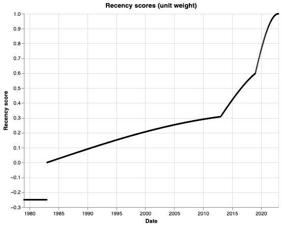
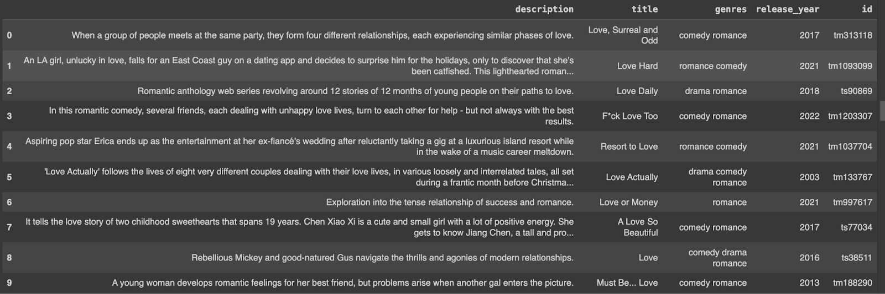
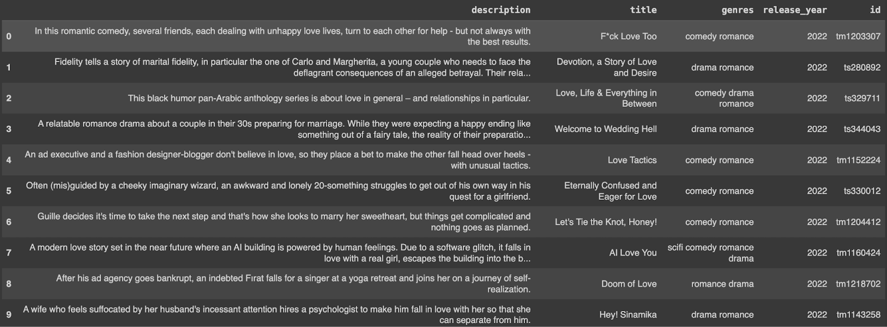
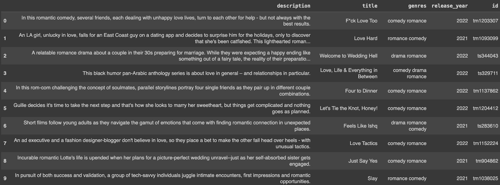
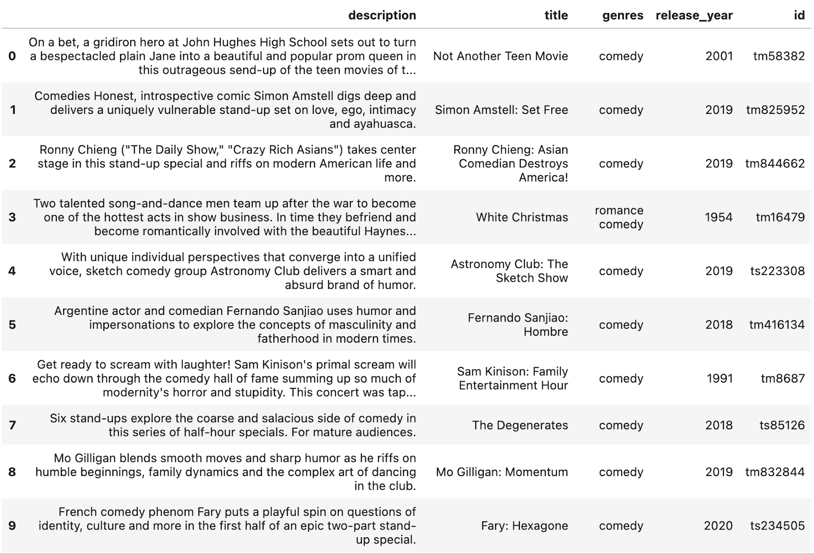

# Finding better movies using semantic search, built with Superlinked - a [notebook](https://github.com/superlinked/superlinked/blob/main/notebook/semantic_search_netflix_titles.ipynb) article

Netflix’s recommendation algorithm does a pretty good job of suggesting relevant content - given the sheer volume of options (~16k movies and TV programs in 2023) and how quickly it has to propose shows to users. How does Netflix do it? In a word, **semantic search**.

Semantic search comprehends the meaning and context behind user queries and movie / TV show descriptions, and can therefore provide better personalization in its queries and recommendations than traditional keyword-based approaches. But semantic search poses certain **challenges** - foremost among them: 1) ensuring accurate search results, 2) interpretability, and 3) scalability - challenges any successful content recommendation strategy will have to address. Using Superlinked’s library, you can **overcome** these difficulties.

In this article, we’ll show you how to **use the Superlinked library to set up your own semantic search** and **generate a list of relevant movies** based on your preferences.

## Semantic search - challenges

Semantic search conveys a lot of value in vector search but poses three significant vector embedding challenges for developers:

- **Quality and relevance**: Ensuring that your embeddings accurately capture the semantic meaning of your data requires careful selection of embedding techniques, training data, and hyperparameters. Poor-quality embeddings can lead to inaccurate search results and irrelevant recommendations.
- **Interpretability**: High-dimensional vector spaces are too complicated to be easily understood. To gain insights into the relationships and similarities encoded within them, data scientists have to develop methods to visualize and analyze them.
- **Scalability**: Managing and processing high-dimensional embeddings, especially in large datasets, can strain computational resources and increase latency. Efficient methods for indexing, retrieval, and similarity computation are essential to ensure scalability and real-time performance in production environments.

The Superlinked library enables you to address these challenges. Below, we’ll build a content recommender (specifically for movies), starting with information we have about a given movie, embed this information as a multimodal vector, build out a searchable vector index for all our movies, and then use query weights to tweak our results and arrive at good movie recommendations. Let’s get into it.

## Creating a fast and reliable search experience with Superlinked

Below, you’ll perform semantic search on the Netflix movie dataset using the following elements of the Superlinked library:
Recency space - to understand the freshness (currency and relevancy) of your data, identifying newer movies
TextSimilarity space - to interpret the various pieces of metadata you have about the movie, such as description, title, and genre 
Query time weights - letting you choose what’s most important in your data when you run the query, thereby optimizing without needing to re-embed the whole dataset, do postprocessing, or employ a custom reranking model (i.e., reducing latency)

### The Netflix dataset, and what we’ll do with it

Successfully recommending movies is difficult mostly because there are so many options (>9000 titles in 2023), and users want recommendations on demand, immediately. Let's take a **data-driven approach** to find something we want to watch. In our [dataset](https://www.kaggle.com/datasets/dgoenrique/netflix-movies-and-tv-shows) of movies, we know the:
- description
- genre 
- title
- release_year

We can embed these inputs, and put together a vector index on top of our embeddings, creating a space we can search semantically.

Once we have our indexed vector space, we will:
- first, browse the movies, filtered by an idea (heartfelt romantic comedy)
- next, tweak the results, giving more importance to matches in certain input fields (i.e., weighting)
- then, search in description, genre, and title with different search terms for each
- and, after finding a movie that’s a close but not exact match, also search around using that movie as a reference

### Installation and dataset preparation

Your first step is to install the library and import the requisite classes.

```python
%pip install superlinked==5.3.0

from datetime import timedelta, datetime

import altair as alt
import os
import pandas as pd

from superlinked.evaluation.charts.recency_plotter import RecencyPlotter
from superlinked.framework.common.dag.context import CONTEXT_COMMON, CONTEXT_COMMON_NOW
from superlinked.framework.common.dag.period_time import PeriodTime
from superlinked.framework.common.schema.schema import schema
from superlinked.framework.common.schema.schema_object import String, Timestamp
from superlinked.framework.common.schema.id_schema_object import IdField
from superlinked.framework.common.parser.dataframe_parser import DataFrameParser
from superlinked.framework.dsl.executor.in_memory.in_memory_executor import (
   InMemoryExecutor,
   InMemoryApp,
)
from superlinked.framework.dsl.index.index import Index
from superlinked.framework.dsl.query.param import Param
from superlinked.framework.dsl.query.query import Query
from superlinked.framework.dsl.query.result import Result
from superlinked.framework.dsl.source.in_memory_source import InMemorySource
from superlinked.framework.dsl.space.text_similarity_space import TextSimilaritySpace
from superlinked.framework.dsl.space.recency_space import RecencySpace

alt.renderers.enable("mimetype")
alt.data_transformers.disable_max_rows()
pd.set_option("display.max_colwidth", 190)
```

We also need to prep the dataset - define time constants, set the url location of the data, create a data store dictionary, read the csv into a pandas DataFrame, clean the dataframe and data so it can be searched properly, and do a quick verification and overview. (See [cells 3 and 4](https://github.com/superlinked/superlinked/blob/main/notebook/semantic_search_netflix_titles.ipynb) for details.)

Now that the dataset is prepared, you can optimize your retrieval using the Superlinked library.

### Building out the index for vector search

Superlinked’s library contains a set of core building blocks that we use to construct an index and manage retrieval. You can read about these building blocks in more detail [here](https://github.com/superlinked/superlinked/blob/main/notebook/feature/basic_building_blocks.ipynb).

First, you need to define your Schema to tell the system about your data.

```python
# accommodate our inputs in a typed schema
@schema
class MovieSchema:
   description: String
   title: String
   release_timestamp: Timestamp
   genres: String
   id: IdField

movie = MovieSchema()
```

Next, you use Spaces to say how you want to treat each part of the data when embedding. Which Spaces are used depends on your datatype. Each Space is optimized to embed the data so as to return the highest possible quality of retrieval results.

In Space definitions, we describe how the inputs should be embedded in order to reflect the semantic relationships in our data.

```python
# textual fields are embedded using a sentence-transformers model
description_space = TextSimilaritySpace(
   text=movie.description, model="sentence-transformers/paraphrase-MiniLM-L3-v2"
)
title_space = TextSimilaritySpace(
   text=movie.title, model="sentence-transformers/paraphrase-MiniLM-L3-v2"
)
genre_space = TextSimilaritySpace(
   text=movie.genres, model="sentence-transformers/paraphrase-MiniLM-L3-v2"
)
# release date are encoded using our recency space
# periodtimes aim to reflect notable breaks in our scores
recency_space = RecencySpace(
   timestamp=movie.release_timestamp,
   period_time_list=[
       PeriodTime(timedelta(days=4 * YEAR_IN_DAYS)),
       PeriodTime(timedelta(days=10 * YEAR_IN_DAYS)),
       PeriodTime(timedelta(days=40 * YEAR_IN_DAYS)),
   ],
   negative_filter=-0.25,
)
movie_index = Index(spaces=[description_space, title_space, genre_space, recency_space])
```

Once you’ve set up your spaces and created your index, you use the source and executor parts of the library to set up your queries. See [cells 10-13 in the notebook](https://github.com/superlinked/superlinked/blob/main/notebook/semantic_search_netflix_titles.ipynb).

Now that the queries are prepared, let’s move on to running queries and optimizing retrieval by adjusting weights.

### Understanding recency, and how to use it in Superlinked

The recency space lets you alter the results of your query by preferentially pulling in older or newer releases from your dataset. We use 4, 10, and 40 years as our period times so that we can give years with more titles more focus - see [cell 5](https://github.com/superlinked/superlinked/blob/main/notebook/semantic_search_netflix_titles.ipynb)).

Notice the breaks in the score at 4, 10, and 40 years. Titles older than 40 years get a `negative_filter` score.



### Reviewing and optimizing search results using different query time weights

Let's define a quick util function to present our results in the notebook.

```python
def present_result(
   result: Result,
   cols_to_keep: list[str] = ["description", "title", "genres", "release_year", "id"],
) -> pd.DataFrame:
   # parse result to dataframe
   df: pd.DataFrame = result.to_pandas()
   # transform timestamp back to release year
   df["release_year"] = [
       datetime.fromtimestamp(timestamp).year for timestamp in df["release_timestamp"]
   ]
   return df[cols_to_keep]
```

### Simple query

With the simple query, I can search with my text in all of the fields

```python
result: Result = app.query(
   simple_query,
   query_text="Heartfelt romantic comedy",
   description_weight=1,
   title_weight=1,
   genre_weight=1,
   recency_weight=0,
   limit=TOP_N,
)

present_result(result)
```



Our results contain some titles I’ve already seen. I can deal with this by upweighting recency to bias my results towards recent titles. Weights are normalized to have unit sum (i.e., all weights are adjusted so they always sum up to a total of 1), so you don't have to worry about how you set them.


```python
result: Result = app.query(
   simple_query,
   query_text="Heartfelt romantic comedy",
   description_weight=1,
   title_weight=1,
   genre_weight=1,
   recency_weight=3,
   limit=TOP_N,
)

present_result(result)
```



My results (above) are now all post-2021. 

Using the simple query, I can weight any specific space (description, title, genre, or recency) to make it count more when returning results. Let’s experiment with this. Below, we’ll give more weight to genre, and downweight title - my query text is basically just a genre with some additional context. I keep my recency as is because I’d still like my results to be biased towards recent movies.

```python
result = app.query(
   simple_query,
   query_text="Heartfelt romantic comedy",
   description_weight=1,
   title_weight=0.1,
   genre_weight=2,
   recency_weight=1,
   limit=TOP_N,
)

present_result(result)
```

This query pushes the release year back a little to give me more genre-weighted results (below).



### Advanced query

The advanced query gives me even more fine-grained control. I retain control over recency, but can also specify search text for description, title, and genre, and assign each a specific weight according to my preferences, per below (and [cells 19-21](https://github.com/superlinked/superlinked/blob/main/notebook/semantic_search_netflix_titles.ipynb)),

```python
result = app.query(
    advanced_query,
    description_query_text="Heartfelt lovely romantic comedy for a cold autumn evening.",
    title_query_text="love",
    genre_query_text="drama comedy romantic",
    description_weight=0.2,
    title_weight=3,
    genre_weight=1,
    recency_weight=5,
    limit=TOP_N,
)

present_result(result)
```

### Search using a movie

Say in my last movie results I found a movie I’ve already seen and would like to see something similar. Let’s assume I like White Christmas, a 1954 romantic comedy (id = tm16479) about singer-dancers coming together for a stage show to draw guests to a struggling Vermont inn. Advanced query lets me search using this movie, and allows me all the fine-grained control of separate subsearch query text and weighting.

First, we add our movie_id parameter:

```python
with_movie_query = advanced_query.with_vector(movie, Param("movie_id"))
```

And then I can set my other subsearch queries either to empty or whatever’s most relevant, along with any weightings that make sense. Let’s say my first query returns results that reflect the stage performance / band aspect of White Christmas (see [cell 24](https://github.com/superlinked/superlinked/blob/main/notebook/semantic_search_netflix_titles.ipynb)), but I want to watch a movie that’s more family-oriented. I can enter a description_query_text to skew my results in the desired direction.

```python
result = app.query(
    with_movie_query,
    description_query_text="family",
    title_query_text="",
    genre_query_text="",
    description_weight=1,
    title_weight=0,
    genre_weight=0,
    recency_weight=0,
    description_query_weight=1,
    movie_id="tm16479",
    limit=TOP_N,
)

present_result(result)
```



But now that I see my results, I realize I’m actually more in the mood for something light-hearted and funny. Let’s adjust my query accordingly:

```python
Result = app.query(
    with_movie_query,
    description_query_text="",
    title_query_text="",
    genre_query_text="comedy",
    description_weight=1,
    title_weight=0,
    genre_weight=2,
    recency_weight=0,
    description_query_weight=1,
    movie_id="tm16479",
    limit=TOP_N,
)

present_result(result)
```


Okay, those results are better. I’ll pick one of these. Put the popcorn on!

### Conclusion

Superlinked makes it easy to test, iterate, and improve your retrieval quality. Above, we’ve walked you through how to use the Superlinked library to do semantic search on a vector space, the way Netflix does, and return accurate, relevant movie results. We’ve also seen how to fine-tune our results, tweaking weights and search terms until we get to just the right outcome.

Now, try out [the notebook](https://github.com/superlinked/superlinked/blob/main/notebook/feature/basic_building_blocks.ipynb) yourself, and see what you can achieve.