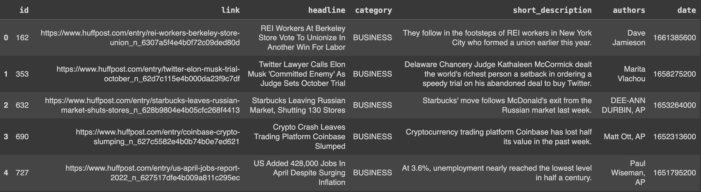
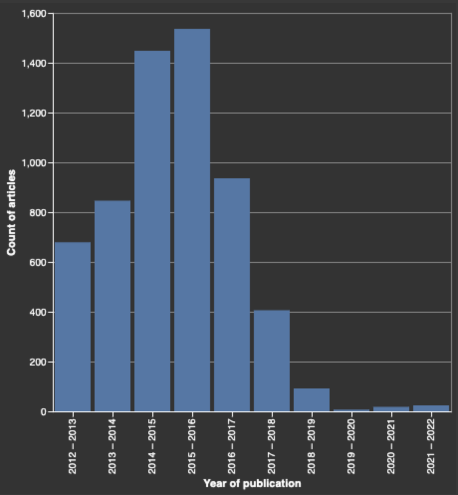
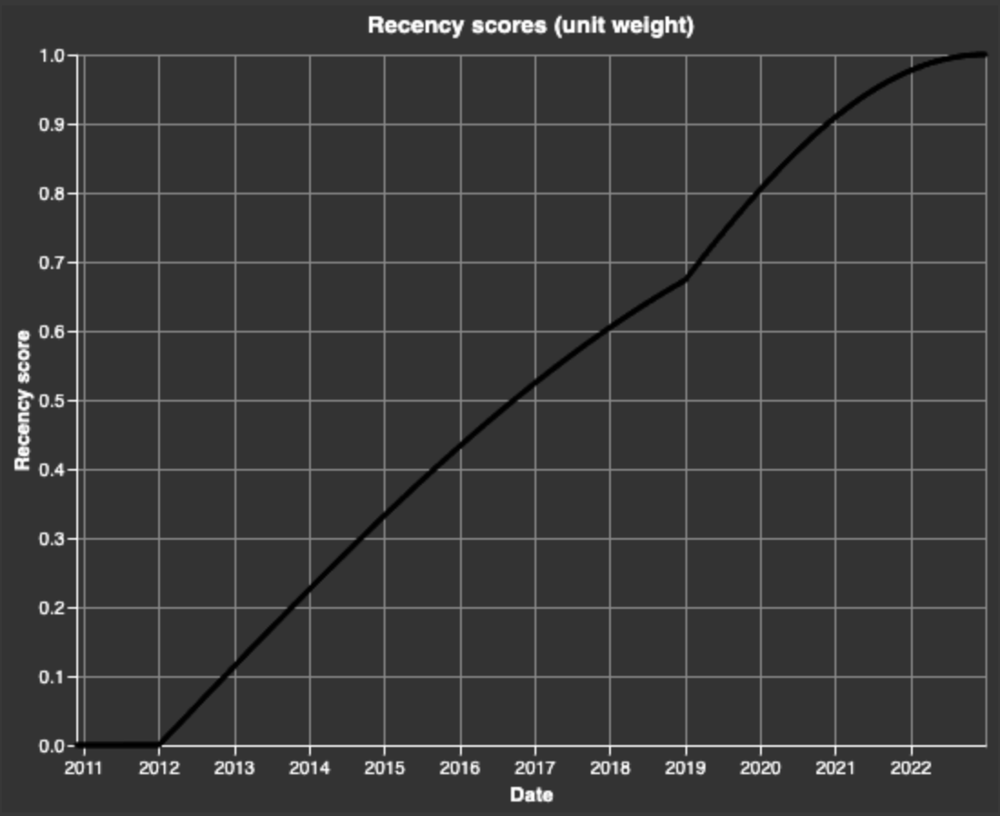
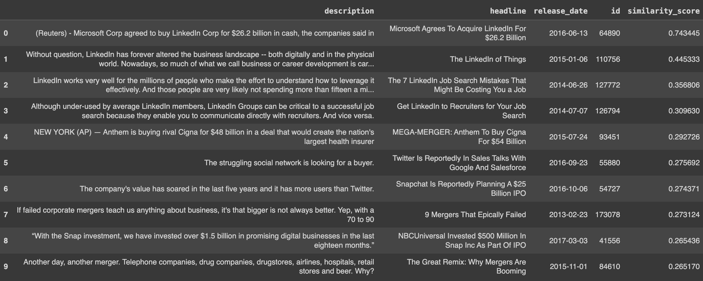
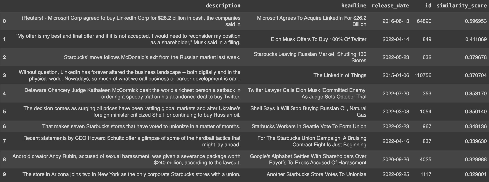
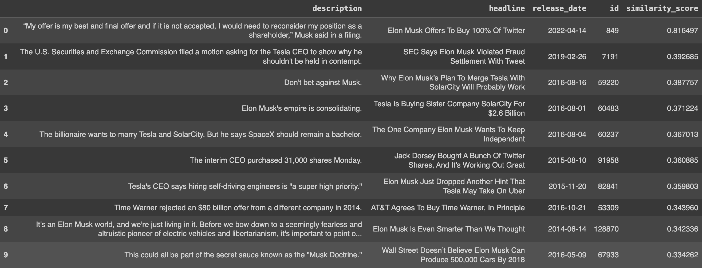
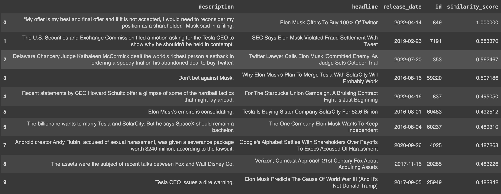

# Semantic search in business news - a notebook article

Semantic search is revolutionizing how we discover and consume news articles, offering a more intuitive and efficient method for finding relevant content and curating personalized news feeds. By embedding the nuances and underlying concepts of text documents in vectors, we can retrieve articles that align closely with the user's interests, preferences, and browsing history.

Still, implementing effective semantic search for news articles presents challenges, including:

- **Response optimization**: you need to figure out how to weight data attributes in your semantic search algorithms
- **Scalability and performance**: you need efficient indexing and retrieval mechanisms to handle the vast volume of news articles

Superlinked is designed to handle these challenges, empowering you to scale efficiently and, using Superlinked Spaces, prioritize text similarity and/or recency so you can recommend highly relevant news articles to your users. Importantly, you can optimize performance *without having to re-embed your dataset*. 

Let's illustrate by taking you step by step through building a semantic-search-powered business news recommendation app, using the following parts of Superlinked's library:

- **Recency space** - to encode the recency of a data point
- **TextSimilarity space** - to encode the semantic meaning of text data
- **Query time weights** - to prioritize different attributes in your queries, without having to re-embed the whole dataset

Ready to begin?
First, let's take a quick look at our dataset, then embed the articles smartly and handle our queries using Superlinked.

## Our dataset and embeddings

Our dataset of [news articles](https://www.kaggle.com/datasets/rmisra/news-category-dataset) is filtered for news in the 'BUSINESS' category.

So that we can search for notable events, or articles related to a specific story, we'll embed:

- headlines
- article text (short descriptions)
- publication (release) dates

We'll be able to skew the results towards older or more recent news as desired, and also search using specific search terms or a specific news article.

## Setup

First, we'll **install Superlinked**.

```python
%pip install superlinked==9.48.1
```

Now, let's **import all our dependencies**...

```python
from datetime import datetime, timedelta, timezone

import os
import sys
import altair as alt
import pandas as pd

from superlinked.evaluation.charts.recency_plotter import RecencyPlotter
from superlinked.framework.common.dag.context import CONTEXT_COMMON, CONTEXT_COMMON_NOW
from superlinked.framework.common.dag.period_time import PeriodTime
from superlinked.framework.common.schema.schema import Schema
from superlinked.framework.common.schema.schema_object import String, Timestamp
from superlinked.framework.common.schema.id_schema_object import IdField
from superlinked.framework.common.parser.dataframe_parser import DataFrameParser
from superlinked.framework.common.util.interactive_util import get_altair_renderer
from superlinked.framework.dsl.executor.in_memory.in_memory_executor import (
    InMemoryExecutor,
    InMemoryApp,
)
from superlinked.framework.dsl.index.index import Index
from superlinked.framework.dsl.query.param import Param
from superlinked.framework.dsl.query.query import Query
from superlinked.framework.dsl.query.result import Result
from superlinked.framework.dsl.source.in_memory_source import InMemorySource
from superlinked.framework.dsl.space.text_similarity_space import TextSimilaritySpace
from superlinked.framework.dsl.space.recency_space import RecencySpace

alt.renderers.enable(get_altair_renderer())
alt.data_transformers.disable_max_rows()
pd.set_option("display.max_colwidth", 190)
```

...and **declare our constants**.

```python
YEAR_IN_DAYS = 365
TOP_N = 10
DATASET_URL = "https://storage.googleapis.com/superlinked-notebook-news-dataset/business_news.json"
# as the dataset contains articles from 2022 and before, we can set our application's "NOW" to this date
END_OF_2022_TS = int(datetime(2022, 12, 31, 23, 59).timestamp())
EXECUTOR_DATA = {CONTEXT_COMMON: {CONTEXT_COMMON_NOW: END_OF_2022_TS}}
```

## Prepare & explore dataset

Now let's read our data...

```python
NROWS = int(os.getenv("NOTEBOOK_TEST_ROW_LIMIT", str(sys.maxsize)))
business_news = pd.read_json(DATASET_URL, convert_dates=True).head(NROWS)
```

...then turn the current index into a column ("id"), and convert the date column into unix timestamps (in seconds).

```python
# we are going to need an id column
business_news = business_news.reset_index().rename(columns={"index": "id"})
# we need to handle the timestamp being set in milliseconds
business_news["date"] = [
    int(date.replace(tzinfo=timezone.utc).timestamp()) for date in business_news.date
]
```

Let's take a sneak peak.

```python
num_rows = business_news.shape[0]
print(f"Our dataset contains {num_rows} articles.")
business_news.head()
```

Our dataset has 5992 articles, and here are the first 5.



### Understand release date distribution

Let's take a closer look at how our articles distribute over time, so we can use it to set our recency time periods.

```python
# some quick transformations and an altair histogram
years_to_plot: pd.DataFrame = pd.DataFrame(
    {
        "year_of_publication": [
            int(datetime.fromtimestamp(ts).year) for ts in business_news["date"]
        ]
    }
)
alt.Chart(years_to_plot).mark_bar().encode(
    alt.X("year_of_publication:N", bin=True, title="Year of publication"),
    y=alt.Y("count()", title="Count of articles"),
).properties(width=400, height=400)
```



Because our oldest article was published in 2012 and we want to be able to query all our dataset articles, we should set our longer time period  inclusively to around 11 years.

The vast majority of our articles are distributed from 2012 through 2017, so it makes sense to create another more recent time period of 4 years (2018-2022) to differentiate the latter's reduced article count from the 2012 - 2017 period.

We can make sure our retrieval appropriately represents the small differences between our publication-dense period (2012-2017) articles, we can give them additional weight - so that differences in our publication-scarce period, which will be larger than in the dense period, aren't overrepresented.

Now let's set up Superlinked so we can efficiently optimize our retrieval.

## Set up Superlinked

First, let's define a schema for our news articles.

```python
# set up schema to accommodate our inputs
class NewsSchema(Schema):
    description: String
    headline: String
    release_timestamp: Timestamp
    id: IdField
```

```python
news = NewsSchema()
```

Next, to embed the characteristics of our text, we use a sentence-transformers model to create a `description_space` for news article descriptions and a `headline_space` for our headlines, and, finally, we encode each article's release date using a `recency_space`.


```python
# textual characteristics are embedded using a sentence-transformers model
description_space = TextSimilaritySpace(
    text=news.description, model="sentence-transformers/all-mpnet-base-v2"
)
headline_space = TextSimilaritySpace(
    text=news.headline, model="sentence-transformers/all-mpnet-base-v2"
)
# release date is encoded using our recency embedding algorithm
recency_space = RecencySpace(
    timestamp=news.release_timestamp,
    period_time_list=[
        PeriodTime(timedelta(days=4 * YEAR_IN_DAYS), weight=1),
        PeriodTime(timedelta(days=11 * YEAR_IN_DAYS), weight=2),
    ],
    negative_filter=0.0,
)
```

Next, we create an index of our spaces.

```python
news_index = Index(spaces=[description_space, headline_space, recency_space])
```

We set up a **simple query** and a **news query**. 

**Simple query** lets us use a search term to retrieve from both the headlline and the description. Simple query also gives us the option to weight certain inputs' importance.

```python
simple_query = (
    Query(
        news_index,
        weights={
            description_space: Param("description_weight"),
            headline_space: Param("headline_weight"),
            recency_space: Param("recency_weight"),
        },
    )
    .find(news)
    .similar(description_space.text, Param("query_text"))
    .similar(headline_space.text, Param("query_text"))
    .limit(Param("limit"))
)
```

**News query** will search our database using the vector a specific news article. News query, like simple query, can also be weighted.

```python
news_query = (
    Query(
        news_index,
        weights={
            description_space: Param("description_weight"),
            headline_space: Param("headline_weight"),
            recency_space: Param("recency_weight"),
        },
    )
    .find(news)
    .with_vector(news, Param("news_id"))
    .limit(Param("limit"))
)
```

Next we parse our dataframe...

```python
dataframe_parser = DataFrameParser(
    schema=news,
    mapping={news.release_timestamp: "date", news.description: "short_description"},
)
```

... create an InMemorySource object to hold the user data in memory, and set up our executor (with our article dataset and index) so that it takes account of context data. The executor creates vectors based on the index's grouping of Spaces.

```python
source: InMemorySource = InMemorySource(news, parser=dataframe_parser)
executor: InMemoryExecutor = InMemoryExecutor(
    sources=[source], indices=[news_index], context_data=EXECUTOR_DATA
)
app: InMemoryApp = executor.run()
```

It's time to input our business news data.

```python
source.put([business_news])

```

(While you're waiting for your business news data to input, why not learn more about vectors in [Vectorhub](https://superlinked.com/vectorhub).)

### Understanding recency

Let's plot our recency scores.

```python
recency_plotter = RecencyPlotter(recency_space, context_data=EXECUTOR_DATA)
recency_plotter.plot_recency_curve()
```



## Queries

To see our query results when we run them, we'll set up a helper to present them in a notebook.

```python
def present_result(
    result_to_present: Result,
    cols_to_keep: list[str] | None = None,
) -> pd.DataFrame:
    if cols_to_keep is None:
        cols_to_keep = [
            "description",
            "headline",
            "release_date",
            "id",
            "similarity_score",
        ]
    # parse result to dataframe
    df: pd.DataFrame = result_to_present.to_pandas()
    # transform timestamp back to release year. Ts is in milliseconds originally hence the division
    df["release_date"] = [
        datetime.fromtimestamp(timestamp, tz=timezone.utc).date()
        for timestamp in df["release_timestamp"]
    ]
    return df[cols_to_keep]
```

Now, say we wanted to read articles about Microsoft acquiring LinkedIn - one of the biggest acquisitions of the last decade. We input our query text as follows, weighting headline and description at 1. Recency weight doesn't matter yet so we'll set it to 0.

```python
result = app.query(
    simple_query,
    query_text="Microsoft acquires LinkedIn",
    description_weight=1,
    headline_weight=1,
    recency_weight=0,
    limit=TOP_N,
)

present_result(result)
```

Let's take a look at our results.



The first result is about the deal, others are related to some aspect of the query. Let's try upweighting recency to see if other, more recent, big acquisitions are surfaced.

```python
result = app.query(
    simple_query,
    query_text="Microsoft acquires LinkedIn",
    description_weight=1,
    headline_weight=1,
    recency_weight=1,
    limit=TOP_N,
)

present_result(result)
```



With recency upweighted, our second result is an article about the much more recent Elon Musk Twitter offer.

Now let's take this article and perform a search with it, resetting recency to 0.

```python
result = app.query(
    news_query,
    description_weight=1,
    headline_weight=1,
    recency_weight=0,
    news_id="849",
    limit=TOP_N,
)

present_result(result)
```



Because our dataset is significantly biased towards older articles, and recency is set to 0, our query retrieves articles highly relevant to the content of our search article - focused on either Elon Musk or Twitter.

To get more recent articles into the mix, we can start biasing toward recency, navigating the tradeoff between recency and text similarity.

```python
result = app.query(
    news_query,
    description_weight=1,
    headline_weight=1,
    recency_weight=1,
    news_id="849",
    limit=TOP_N,
)

present_result(result)
```



Try your own simple_query and news_query in the [notebook](https://github.com/superlinked/superlinked/blob/main/notebook/semantic_search_news.ipynb). Alter the `description_weight`, `headline_weight`, and `recency_weight` on your own `query_text` and `news_id` and observe the changes in your results.

## In sum...
Superlinked Spaces enables you up to optimize your vector search with a high degree of control, without incurring the time and resource costs of re-embedding your dataset. Our Spaces let you embed your dataset smartly, attribute by attribute - so that you can prioritize or deprioritize different attributes as required.