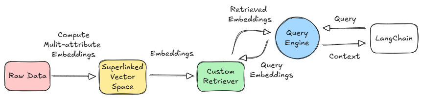

# Build RAG using LangChain & Superlinked

<!-- SEO: Master building custom LangChain retrievers with Superlinked for advanced RAG systems. Learn multi-space vector indexing, semantic search, and vector search optimization with unified vector embeddings combining semantic similarity with structured metadata. Discover how Superlinked eliminates reranking needs through comprehensive vector space implementation and semantic search capabilities. Includes complete code examples for financial document retrieval, vector search optimization, OpenAI integration, and SuperlinkedRetriever class extending BaseRetriever. Compare traditional vector search vs multi-modal RAG approaches with real-world financial data schemas, semantic search query design patterns, and LangChain RetrievalQA chains. -->

GenAI is transforming the search and retrieval space like never before. Gone are the days of simple keyword matching—today’s search engines are equipped to handle complex, nuanced queries with remarkable precision. New players like Perplexity have disrupted the search engine marketplace, providing focused answers with all relevant sources attached, even images and YouTube videos. Meanwhile, Google has integrated AI-generated summaries directly into its search results, offering users detailed, context-aware responses to even their most intricate questions.

## Retrieval with Superlinked
These powerful RAG engines require a step up from traditional vector search because the best search results are no longer based on text only. It is based on various modalities of data, structured and unstructured. Enter *Superlinked*! With Superlinked, your data is transformed into vector embeddings that capture not just the textual content but also the associated metadata, each processed within its own distinct embedding space. This multi-space representation enables more precise and context-aware search, retrieval, and reasoning across diverse data dimensions.

In this article, we will explore how to integrate Superlinked with the leading framework LangChain to build RAG systems.



### Setting Up
```bash
%%capture
!pip install superlinked langchain langchain_openai
```
We will be using OpenAI LLMs here. Feel free to use any LLM options with Langchain.
Setup and define the api keys as required.
```bash
from google.colab import userdata
OPENAI_API_KEY = userdata.get('OPENAI_API_KEY')
```
### Dataset & Superlinked Schema
For simplicity, I have created a dummy [dataset](../assets/use_cases/superlinked_langchain_retriever/apple_financial_reports.json) of AAPL financial reports. Let’s understand the dataset a bit.

- report_id : A unique identifier for each financial report, typically combining the ticker symbol, filing type, and reporting date.
- company_name (string): The full legal name of the company issuing the report (e.g., Apple Inc.).
- ticker_symbol (string): The stock market symbol used to identify the company (e.g., AAPL for Apple).
- filing_type (string): The type of financial document filed, such as 10-K (annual report) or 10-Q (quarterly report).
- Filing_date (timestamp): The official date on which the financial report was filed with regulators like the SEC.
- report_content (string): A textual summary or excerpt from the actual report, including key business highlights and commentary.
- revenue (float): The total income generated by the company during the reporting period, measured in billions of USD.
- net_income (float): The company’s profit after all expenses, taxes, and costs have been deducted from revenue, in billions of USD.
- eps (float): Earnings Per Share, representing the portion of the company's profit allocated to each outstanding share of common stock.

Revenue, net income, and eps are not expected in every report, as reports like 8-K filings are event-driven, not financial performance reports. Thus, we keep these fields optional. A corresponding supelinked data schema can be defined as follows.

```python
from superlinked import framework as sl
from datetime import datetime
from typing import Optional


class FinancialReportSchema(sl.Schema):
    report_id: sl.IdField          
    company_name: sl.String      
    ticker_symbol: sl.String     
    filing_date: sl.Timestamp    
    filing_type: sl.String       
    report_content: sl.String    
    revenue: Optional[sl.Float]            
    net_income: Optional[sl.Float] 
    eps: Optional[sl.Float]     


financial_report = FinancialReportSchema()
```
### Superlinked Spaces and Indexing
Our dataset has string, date, and numerical data. For efficient representation and retrieval, Superlinked lets you organize different data types into different vector spaces. Here we use the following spaces, each focused on a different aspect of financial filings.

#### TextSimilaritySpace
The TextSimilaritySpace captures the semantic essence of the financial report content. It enables content-aware search and comparison by embedding textual information, such as key sections from 10-Ks or earnings call transcripts, into vector form. Chunking is used to break long reports into overlapping segments to retain contextual continuity.
```python
text_space = sl.TextSimilaritySpace(
    text=sl.chunk(financial_report.report_content, chunk_size=300, chunk_overlap=75),
    model="sentence-transformers/all-mpnet-base-v2"
)
```
#### RecencySpace
The RecencySpace introduces temporal awareness by evaluating how recent each filing is. Financial insights can lose relevance quickly, especially in volatile markets. This space emphasizes newer reports and penalizes outdated ones using the negative filter argument.
```python
recency_space = sl.RecencySpace(
    timestamp=financial_report.filing_date,
    period_time_list=[
        sl.PeriodTime(timedelta(days=90)),   # Reports within the last 3 months
        sl.PeriodTime(timedelta(days=180)),  # Reports within the last 6 months
        sl.PeriodTime(timedelta(days=365)),  # Reports within the last 1 year
        sl.PeriodTime(timedelta(days=2 * 365)), # Reports within the last 2 years
    ],
    negative_filter=-0.25
)
```
This works similarly to sorting earnings releases by freshness or spotlighting recent SEC filings during a financial quarter.

#### CategoricalSimilaritySpace 
As the filing type is a finite number of text categories, we use CategoricalSimilaritySpace to encode them. 
```python
filing_type_space = sl.CategoricalSimilaritySpace(
    category_input=financial_report.filing_type,
    categories=["10-K", "10-Q", "Earnings Call Transcript", "8-K", "Annual Report", "Proxy Statement"],
)
```
This dimension ensures semantic relevance across similar document types.

#### NumberSpace
To incorporate core financial performance metrics, we define numerical vector spaces. These enable filtering and ranking based on key financial indicators.
```python
revenue_space = sl.NumberSpace(
    number=financial_report.revenue,
    min_value=0.0,
    max_value=500.0,
    mode=sl.Mode.MAXIMUM
)


eps_space = sl.NumberSpace(
    number=financial_report.eps,
    min_value=-10.0,
    max_value=15.0,
    mode=sl.Mode.MAXIMUM
)


net_income_space = sl.NumberSpace(
    number=financial_report.net_income,
    min_value=-50.0,
    max_value=200.0,
    mode=sl.Mode.MAXIMUM
)
```
Finally, group all the created spaces for indexing.
```python
financial_report_features = [
    recency_space,
    text_space,
    filing_type_space,
    revenue_space,
    eps_space,
    net_income_space
]
report_index = sl.Index(financial_report_features)
```
### Query Design
The most crucial part of the retrieval engine in Superlinked is the query. The query has to be carefully designed and structured to consistently achieve good results with good efficiency every time.
At its core, this query performs a multi-space weighted search over the report_index, a collection of vector spaces representing different aspects of financial reports. Each space contributes differently to the final retrieval score, allowing for fine-tuned relevance control.

#### Weight assignment
```python
weights = {
        text_space: sl.Param("text_weight"),
        recency_space: sl.Param("recency_weight"),
        filing_type_space: sl.Param("filing_type_weight"),
        revenue_space: sl.Param("revenue_weight"),
        net_income_space: sl.Param("net_income_weight"),
        eps_space: sl.Param("eps_weight"),
}
```
Weights define how much each dimension influences the overall relevance score. By parameterizing them `(sl.Param(...))`, you retain the flexibility to tune these dynamically at runtime based on user preferences or context.

#### Entity Selection
```python
.find(financial_report)
```
This clause specifies that the query will be run against the FinancialReportSchema, ensuring we fetch data aligned with the schema defined earlier.

#### Semantic Similarity
```python
.similar(text_space.text, sl.Param("query_text"))
```
This is the semantic heart of the query. It compares the user’s input query against the embedded chunks of report_content using the TextSimilaritySpace. It's what enables natural-language understanding in the retrieval process.

#### Structured Filtering
```python
.filter(
    financial_report.filing_type == sl.Param("filing_type_filter")
)
.filter(
    financial_report.company_name == sl.Param("company_name_filter")
)
```
These filters restrict the search space to specific filing types (e.g., 10-K, 8-K) or companies (e.g., Apple Inc.), ensuring targeted, high-precision retrieval. These are optional and can be used to refine the query contextually.

####  Field Selection
```python
.select([
            financial_report.report_content,
            financial_report.company_name,
            financial_report.ticker_symbol,
            financial_report.filing_type,
            financial_report.filing_date,
            financial_report.revenue,
            financial_report.net_income,
            financial_report.eps
        ])
.limit(sl.Param("limit"))
```
This clause tells Superlinked which fields to return in the results. This minimizes unnecessary payload and keeps downstream processing efficient by including only the necessary metadata and report content. The limit clause limits the number of retrieved documents.
Here is the complete query with defualt values for query parameters:

```python
superlinked_query = (
            sl.Query(
                report_index,
                weights={
                    text_space: sl.Param("text_weight"),
                    recency_space: sl.Param("recency_weight"),
                    filing_type_space: sl.Param("filing_type_weight"),
                    revenue_space: sl.Param("revenue_weight"),
                    net_income_space: sl.Param("net_income_weight"),
                    eps_space: sl.Param("eps_weight"),
                },
            )
            .find(financial_report)
            .similar(text_space.text, sl.Param("query_text"))
            .filter(
                financial_report.filing_type == sl.Param("filing_type_filter")
            )
            .filter(
                financial_report.company_name == sl.Param("company_name_filter")
            )
            .select([
                financial_report.report_content,
                financial_report.company_name,
                financial_report.ticker_symbol,
                financial_report.filing_type,
                financial_report.filing_date,
                financial_report.revenue,
                financial_report.net_income,
                financial_report.eps
            ])
            .limit(sl.Param("limit"))
        )


        # Default query parameters
        query_params = {
            "query_text": query,
            "text_weight": kwargs.get("text_weight", 1.0),
            "recency_weight": kwargs.get("recency_weight", 0.5),
            "filing_type_weight": kwargs.get("filing_type_weight", 0.2),
            "revenue_weight": kwargs.get("revenue_weight", 0.1),
            "net_income_weight": kwargs.get("net_income_weight", 0.1),
            "eps_weight": kwargs.get("eps_weight", 0.1),
            "limit": kwargs.get("limit", 5),
            "filing_type_filter": kwargs.get("filing_type_filter"),
            "company_name_filter": kwargs.get("company_name_filter")
        }

```
### Building the Langchain Retriever
Once the query is ready, we can use it to build the custom langchain retriever. LangChain allows you to define your retrievers using the `BaseRetriever` class. These can be used just like standard LangChain retrievers and are fully compatible with other LangChain components, as long as the retrieved results are returned as LangChain documents.

```python
from langchain.schema import BaseRetriever, Document
from pydantic import Field
from typing import Any, List


class SuperlinkedRetriever(BaseRetriever):
    sl_client: Any = Field(...)


    def _get_relevant_documents(self, query: str, **kwargs: Any) -> List[Document]:
        """
        Retrieves relevant documents from Superlinked based on the query.
        """
        superlinked_query = (
            sl.Query(
                report_index,
                weights={
                    text_space: sl.Param("text_weight"),
                    recency_space: sl.Param("recency_weight"),
                    filing_type_space: sl.Param("filing_type_weight"),
                    revenue_space: sl.Param("revenue_weight"),
                    net_income_space: sl.Param("net_income_weight"),
                    eps_space: sl.Param("eps_weight"),
                },
            )
            .find(financial_report)
            .similar(text_space.text, sl.Param("query_text"))
            .filter(
                financial_report.filing_type == sl.Param("filing_type_filter")
            )
            .filter(
                financial_report.company_name == sl.Param("company_name_filter")
            )
            .select([
                financial_report.report_content,
                financial_report.company_name,
                financial_report.ticker_symbol,
                financial_report.filing_type,
                financial_report.filing_date,
                financial_report.revenue,
                financial_report.net_income,
                financial_report.eps
            ])
            .limit(sl.Param("limit"))
        )


        # Default query parameters
        query_params = {
            "query_text": query,
            "text_weight": kwargs.get("text_weight", 1.0),
            "recency_weight": kwargs.get("recency_weight", 0.5),
            "filing_type_weight": kwargs.get("filing_type_weight", 0.2),
            "revenue_weight": kwargs.get("revenue_weight", 0.1),
            "net_income_weight": kwargs.get("net_income_weight", 0.1),
            "eps_weight": kwargs.get("eps_weight", 0.1),
            "limit": kwargs.get("limit", 5),
            "filing_type_filter": kwargs.get("filing_type_filter"),
            "company_name_filter": kwargs.get("company_name_filter")
        }


        try:
            results = self.sl_client.query(
                query_descriptor=superlinked_query,
                **query_params
            )


            # Process the results from Superlinked into LangChain Document format
            documents = []
            for entry in results.entries:
                try:
                    # Safely get fields with default values for missing keys
                    fields = entry.fields or {}


                    if fields.get("report_content"):
                        doc_content = fields["report_content"]


                        # Create metadata with safe field access
                        metadata = {
                            "report_id": getattr(entry, 'id', 'unknown'),
                            "company_name": fields.get("company_name", "Unknown"),
                            "ticker_symbol": fields.get("ticker_symbol", "Unknown"),
                            "filing_type": fields.get("filing_type", "Unknown"),
                            "filing_date": fields.get("filing_date", "Unknown"),
                            "revenue": fields.get("revenue"),  # Will be None if not present
                            "net_income": fields.get("net_income"),  # Will be None if not present
                            "eps": fields.get("eps")  # Will be None if not present
                        }


                        documents.append(Document(page_content=doc_content, metadata=metadata))


                except Exception as e:
                    print(f"Error processing individual entry: {e}")
                    continue  # Skip this entry and continue with others


            return documents


        except Exception as e:
            print(f"Error executing query: {e}")
            return []
```
`sl_client: Any = Field(...)` declares a required client instance used to connect and query the Superlinked backend. You must pass a valid Superlinked client when initializing the SuperlinkedRetriever. We need to override the `_get_relevant_documents` function in the base class to implement the custom logic. Here we fetch the results using the SuperLinked query and convert the results into a list of LangChain documents similar to a standard LangChain retriever.
You can test the retriever if required.

```python
retriever = SuperlinkedRetriever(sl_client=app)
res=retriever.invoke("How is the performance in the year 2022")
```

### RAG
With our custom SuperlinkedRetriever in place, we can now seamlessly integrate it into LangChain workflows. This allows us to build end-to-end pipelines where financial reports are intelligently retrieved based on both semantic and structured criteria, and then passed to a language model for natural language question answering.

In the example below, we combine our custom retriever with OpenAI’s GPT model using LangChain’s RetrievalQA chain. This setup enables the model to answer queries like “How was the performance in the fiscal year 2023?” by grounding its response in relevant financial filings.

Here’s how it all comes together:
```python
from langchain.chains import RetrievalQA
from langchain_openai import ChatOpenAI


llm = ChatOpenAI(
    model="gpt-4o-mini",
    temperature=0,
    timeout=None,
    max_retries=2,
    api_key=API_KEY,
)


qa_chain = RetrievalQA.from_chain_type(
    llm=llm,
    chain_type="stuff",  # "stuff" means: stuff all retrieved docs into the prompt
    retriever=retriever,
    return_source_documents=True
)
query = "How was the performance in the fiscal year 2023?"
result = qa_chain(query)


print("Answer:", result['result'])
print("\nSource Documents:")
for doc in result['source_documents']:
    print("-", doc.page_content)
```

## Wrapping Up
We built a streamlined Retrieval-Augmented Generation (RAG) pipeline by integrating Superlinked and LangChain. Thanks to Superlinked’s multi-space indexing, which fuses various embedding modalities into a single vector, the need for expensive post-retrieval reranking is eliminated—there’s *no need for a separate reranker stage*. This results in faster, more precise retrieval tailored to both content and metadata.

Link to complete [code](https://colab.research.google.com/github/superlinked/VectorHub/blob/main/docs/assets/use_cases/superlinked_langchain_retriever/Superlinked_LangChain.ipynb).


