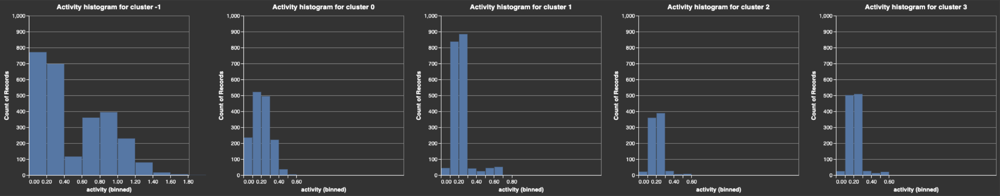

Notebook 4: Analytics
[Article built around this notebook: https://github.com/superlinked/superlinked/blob/main/notebook/analytics_user_acquisition.ipynb] 

# User Acquisition Analytics

Organizations have until recently done most of their user acquisition analytics on structured data. Vector embeddings have changed this. Because vectors capture the semantic meaning and context of unstructured data such as text, they enable organizations to obtain more nuanced and detailed insight into what drives user behavior, to inform their user targeting strategies. Still, vectors present several challenges - including choosing the right embedding techniques, computational complexity, and interpretability.

In this article, we'll show you how to use the Superlinked library to overcome these challenges - letting you leverage vector embedding power to **identify and analyze users on the basis of how they respond to particular ad messaging, target them more precisely, and improve conversion rates in your campaigns**.

## Vector embedding - power & challenges

By capturing intricate relationships and patterns between data points and representing them as high-dimensional vectors in a latent space, embeddings empower you to extract deeper insights from complex datasets, thereby enabling more nuanced analysis, interpretation, and accurate predictions to inform your ad campaign decision-making.

But while vector embeddings are a powerful tool for user analysis, they also introduce **additional challenges**:

- *Quality and relevance* - to achieve good retrieval results and avoid postprocessing and reranking, embedding generation techniques and parameters need to be selected carefully
- *Scalability with high-dimensional data* - rich data increases computational complexity and resource requirements, especially when working with large datasets
- *Interpretability* - identifying underlying patterns and relationships (e.g., how specific users respond to certain ad types) embedded in abstract vectors can be tricky

## Smarter vectors

We can use Superlinked's framework to overcome these challenges by creating vectors that are smarter representations of your data and therefore let you retrieve high quality, actionable insights (e.g., understanding why different users respond to different ad creatives) without postprocessing or reranking.

Let's walk through how you can perform user acquisition analytics on ad creatives using Superlinked library elements, namely:

- **Recency space** - to understand the freshness of information
- **Number space** - to interpret user activity
- **TextSimilarity space** - to interpret the ad creatives
- **Query time weights** - to optimize results by defining how you treat your data when you run a query, without needing to re-embed the whole dataset

## User data

We have data from two 2023 ad campaigns - one from August (with more generic ad messages), and another from December (assisted by a made-up influencer, "XYZCr$$d"). Our data (for 8000 users) includes:

1. signup date, as unix timestamp
2. the ad creative a user clicked on before signing up
3. average (user) daily activity, measured in API calls/day (over the user's lifetime)

To make our ad campaigns smarter, **we want to know which users to target with which kinds of ad messaging**. We can discover this by embedding our data into a vectorspace, where we can cluster users and find meaningful groups - using a UMAP visualization to examine the cluster labels' relationship to features of the ad creatives.

Let's get started.

## Setup

Before you do our installations and imports, make sure you have access to Llama2 in your environment. If you're working in google colab, sign in / up on [huggingface](https://huggingface.co/), get an access token [here](https://huggingface.co/settings/tokens/), and login:

```python
from huggingface_hub import notebook_login
notebook_login() 
```

Now, let's get going on our installations and imports.

First, we install superlinked and umap.

```python
%pip install superlinked==9.32.1
%pip install umap-learn
```

Next, import all our components and constants.

(Note: Omit `alt.renderers.enable(“mimetype”)` if you’re running this in [google colab](https://colab.research.google.com/github/superlinked/superlinked/blob/main/notebook/recommendations_e_commerce.ipynb). Keep it if you’re executing in [github](https://github.com/superlinked/VectorHub/blob/main/docs/articles/ecomm-recys.md).)

```python
from datetime import datetime, timedelta
import os
import sys
import altair as alt
import numpy as np
import pandas as pd
from sklearn.cluster import HDBSCAN
import umap

from superlinked.evaluation.charts.recency_plotter import RecencyPlotter
from superlinked.evaluation.vector_sampler import VectorSampler
from superlinked.framework.common.dag.context import CONTEXT_COMMON, CONTEXT_COMMON_NOW
from superlinked.framework.common.dag.period_time import PeriodTime
from superlinked.framework.common.embedding.number_embedding import Mode
from superlinked.framework.common.schema.schema import Schema
from superlinked.framework.common.schema.schema_object import String, Float, Timestamp
from superlinked.framework.common.schema.id_schema_object import IdField
from superlinked.framework.common.parser.dataframe_parser import DataFrameParser
from superlinked.framework.dsl.executor.in_memory.in_memory_executor import (
    InMemoryExecutor,
    InMemoryApp,
)
from superlinked.framework.dsl.index.index import Index
from superlinked.framework.dsl.source.in_memory_source import InMemorySource
from superlinked.framework.dsl.space.text_similarity_space import TextSimilaritySpace
from superlinked.framework.dsl.space.number_space import NumberSpace
from superlinked.framework.dsl.space.recency_space import RecencySpace


alt.renderers.enable("mimetype")  # important: to render plots in colab, replace 'mimetype' with 'colab'
alt.data_transformers.disable_max_rows()
os.environ["TOKENIZERS_PARALLELISM"] = "false"
pd.set_option("display.max_colwidth", 190)
pd.options.display.float_format = "{:.2f}".format
```

Now we import our dataset. 

```python
dataset_repository_url = (
    "https://storage.googleapis.com/superlinked-notebook-user-acquisiton-analytics"
)
USER_DATASET_URL = f"{dataset_repository_url}/user_acquisiton_data.csv"
NOW_TS = 1708529056
EXECUTOR_DATA = {CONTEXT_COMMON: {CONTEXT_COMMON_NOW: NOW_TS}}
```

(This might take a few minutes. While you're waiting, you can always find other interesting reading in [VectorHub](https://superlinked.com/vectorhub/).)

## Read and explore our dataset

Now that our dataset's imported, let's take a closer look at it:

```python
NROWS = int(os.getenv("NOTEBOOK_TEST_ROW_LIMIT", str(sys.maxsize)))
user_df: pd.DataFrame = pd.read_csv(USER_DATASET_URL, nrows=NROWS)
print(f"User data dimensions: {user_df.shape}")
user_df.head()
```

We have 8000 users and (as we can see from the first five rows) 4 columns of data:


To understand which ad creatives generated how many signups, we create a DataFrame:

```python
pd.DataFrame(user_df["ad_creative"].value_counts())
```

which looks like this:


observation: the influencer (XYZCr$$d) backed ad creatives seem to have worked better - generating many more signups than the August ad creatives. 

Now, let's take a look at the **distribution of users according to activity level** (api calls/day).

```python
alt.Chart(user_df).mark_bar().encode(
    alt.X("activity:Q", bin=True, title="Activity count"),
    alt.Y("count()", title="# of users"),
).properties(width=600, height=400)
```


The activity (api calls/day) distribution is bimodal. Here, the first activity level group (0.00-0.40 api calls/day) may be largely new users, who - if they signed up in the most recent (December) campaign - have less time to accumulate activity than the smaller number of users (with 0.40-1.40 api calls/day) who signed up earlier.
Also, we can derive our NumberSpace min and max from this distribution.

Now let's examine the distribution of new users per signup date.

```python
dates: pd.DataFrame = pd.DataFrame(
    {"date": [str(datetime.fromtimestamp(ts).date()) for ts in user_df["signup_date"]]}
)
dates_to_plot = pd.DataFrame(dates.value_counts(), columns=["count"]).reset_index()
alt.Chart(dates_to_plot).mark_bar().encode(
    alt.X("date", title="Signup date"), alt.Y("count", title="Number of subscribers")
).properties(height=400, width=1200)
```


[observations] First, the distribution confirms that our second campaign (December) works much better than the first (August).
Second, the jump in signups at 2023-12-21 is due to the second campaign (our data is exclusively campaign-related). To analyze the two campaigns, we need two periods: a first period of 65 days and a second of 185 days seems appropriate.
Of our 8k users, roughly 2k subscribed in the first campaign period (65 days), and 6k in the second. ...It's possible that this 6k number includes subscriptions not just from new (December) campaign ad clicks, but clicks on old (August) campaign ads that occur after seeing new campaign ads. We'll see how this breaks out by... ad creatives [?]... (below)...

so far.. we know that:

- many more users signed up in response to the influencer-backed ad creatives (second campaign) than the first campaign
- the vast majority of users are low activity, and more recent subscribers

We don't know....

- what kind of ad creatives have similar meanings and possibly outcomes as a result
- what kinds of users (in terms of activity level) responded to what kind of ad_creatives (in terms of semantic meaning)

We can use embedding and Superlinked spaces to help reveal answers to our remaining questions..


## Embedding with Superlinked

Now, let's use Superlinked to embed our data in a semantic space - to:
 
1. inform the model re *which ad creatives* generated **signups**, and *which users* signed up... 
2. group ad creatives that have similar meanings..

Define a schema for our user data:

```python
class UserSchema(Schema):
    ad_creative: String
    activity: Float
    signup_date: Timestamp
    id: IdField
```

```python
user = UserSchema()
```

Now we create a semantic space for our ad_creatives using a text similarity model. Then encode user activity into a numerical space to represent users' activity level. We also encode the signup date into a recency space, allowing our clustering algorithm to take account of the two specific periods of signup activity (following our two campaign start dates).

```python
creative_space = TextSimilaritySpace(
    text=user.ad_creative, model="sentence-transformers/all-mpnet-base-v2"
)

activity_space = NumberSpace(
    number=user.activity, mode=Mode.SIMILAR, min_value=0.0, max_value=1.0
)

recency_space = RecencySpace(
    timestamp=user.signup_date,
    period_time_list=[PeriodTime(timedelta(days=65)), PeriodTime(timedelta(days=185))],
    negative_filter=0.0,
)
```

Now, let's plot our recency scores by date. 

```python
recency_plotter = RecencyPlotter(recency_space, context_data=EXECUTOR_DATA)
recency_plotter.plot_recency_curve()
```


Next, we set up an in-memory data processing pipeline for indexing, parsing, and executing operations on user data, including clustering (where RecencySpace lets our model take account of user signup recency).

First, we create our index with the spaces we use for clustering.

```python
user_index = Index(spaces=[creative_space, activity_space, recency_space])
```

Now for dataframe parsing.

```python
user_df_parser = DataFrameParser(schema=user)
```

We create an `InMemorySource` object to hold the user data in memory, and set up our executor (with our user data source and index) so that it takes account of context data.

```python
source_user: InMemorySource = InMemorySource(user, parser=user_df_parser)
executor: InMemoryExecutor = InMemoryExecutor(
    sources=[source_user], indices=[user_index], context_data=EXECUTOR_DATA
)
app: InMemoryApp = executor.run()
```

And then input our user data. (This step make take a few minutes. In the meantime, why not read more about vectors in [Vectorhub](https://superlinked.com/vectorhub/).)

```python
source_user.put([user_df])
```

## Load features

Next, we collect all our vectors from the app.

```python
vs = VectorSampler(app=app)
vector_collection = vs.get_all_vectors(user_index, user)
vectors = vector_collection.vectors
vector_df = pd.DataFrame(vectors, index=[int(id_) for id_ in vector_collection.id_list])
vector_df.head()
```

```python
vector_df.shape
```

Here are the first five rows (of 8000), and 776 columns, of the resulting dataframe:


## Clustering

Next, we fit a clustering model.

NOTE: If you run into issues running this notebook on Colab, we suggest using your own environment. In Colab, the management of python packages is less straight-forward, which can cause issues.

```python
hdbscan = HDBSCAN(min_cluster_size=500, metric="cosine")
hdbscan.fit(vector_df.values)
```

workaround on colab
```python
mat = distance.cdist(vector_df.values, vector_df.values, metric='cosine')
hdbscan = HDBSCAN(min_cluster_size=500, metric='precomputed')
hdbscan.fit(mat)
```

Let's create a DataFrame to store the cluster labels assigned by HBDSCAN and count how many users belong to each cluster:

```python
label_df = pd.DataFrame(
    hdbscan.labels_, index=vector_df.index, columns=["cluster_label"]
)
label_df["cluster_label"].value_counts()
```


## Visualizing the data

Let's try to interpret our dataset by visualizing it using UMAP.

First, we'll fit the UMAP and transform our dataset:

```python
umap_transform = umap.UMAP(random_state=0, transform_seed=0, n_jobs=1, metric="cosine")
umap_transform = umap_transform.fit(vector_df)
umap_vectors = umap_transform.transform(vector_df)
umap_df = pd.DataFrame(
    umap_vectors, columns=["dimension_1", "dimension_2"], index=vector_df.index
)
umap_df = umap_df.join(label_df)
```

Next,we join our dataframes and create a chart, letting us visualize the UMAP-transformed vectors, and coloring them with cluster labels.

```python
umap_df = umap_df.join(label_df)
alt.Chart(umap_df).mark_circle(size=8).encode(
    x="dimension_1", y="dimension_2", color="cluster_label:N"
).properties(
    width=600, height=500, title="UMAP Transformed vectors coloured by cluster labels"
).configure_title(
    fontSize=16,
    anchor="middle",
).configure_legend(
    strokeColor="black",
    fillColor="#EEEEEE",
    padding=10,
    cornerRadius=10,
    labelFontSize=14,
    titleFontSize=14,
).configure_axis(
    titleFontSize=14, labelFontSize=12
)
```


The dark blue clusters (label -1) are outliers - not large or dense enough to form a distinct group. 
The large number of blobs [better word?] results from the fact that 1/3 of the vector norm mass is made of not very many ad_creatives.
Note - 2D (UMAP) visualizations often make some clusters look quite dispersed [scattered].

## Understanding the cluster groups

To understand our user clusters better, we can generate some activity histograms.

First, we join user data with cluster labels, create separate DataFrames for each cluster, generates activity histograms for each cluster, and then concatenates these histograms into a single visualization.

```python
# activity histograms by cluster
user_df = user_df.set_index("id").join(label_df)

by_cluster_data = {
    label: user_df[user_df["cluster_label"] == label]
    for label in np.unique(hdbscan.labels_)
}

activity_histograms = [
    alt.Chart(user_df_part)
    .mark_bar()
    .encode(x=alt.X("activity", bin=True), y="count()")
    .properties(title=f"Activity histogram for cluster {label}")
    for label, user_df_part in by_cluster_data.items()
]

alt.hconcat(*activity_histograms)
```



From our histograms, we can observe that:

- outliers (cluster -1) - a small number of very active users "it means that there are quite a few active users (generally the rates of users turning to active users on a site is quite low), so naturally active users are over-represented outliers"
- cluster 2 and cluster 3 users are quite similar, but low activity
- cluster 0 has the highest proportion of medium activity users
- cluster 1 users are active, "are not outliers and have a fairly balanced activity profile"..."have activities from all over the distribution = meaning here are the active users that are not outliers"

To see the distribution of ad_creatives across different clusters, we create a DataFrame that shows each ad_creative's count value within each cluster:

```python
pd.DataFrame(user_df.groupby("cluster_label")["ad_creative"].value_counts())
```


observations:

- outliers (highly active users) clicked on ad_creatives from both campaigns (as expected)
- cluster 3 clicked on only one distinct ad_creative - from the influencer based campaign
- clusters 0 and 2 clicked on only two distinct influencer based creatives
- cluster 1 clicked on both campaigns' ad_creatives, but more on the first (non-influencer) campaign

Now, let's get some descriptive stats for our signup dates to help us interpret our clusters' behavior further. 

```python
user_df["signup_datetime"] = [
    datetime.fromtimestamp(ts) for ts in user_df["signup_date"]
]
desc = user_df.groupby("cluster_label")["signup_datetime"].describe()
for col in desc.columns:
    if col == "count":
        continue
    desc[col] = [dt.date() for dt in desc[col]]
desc
```


observations...

- outliers' (cluster -1) have signup dates that are scattered
- cluster 1's signups mostly (75%) came from clicks on the first campaign's ad_creatives
- clusters 0, 2, and 3 signed up in response to the new (influencer-augmented) campaign only

[question - how are these insights helpful for improving user acquisition?
did we actually ascertain (let alone make use of) which ads' content is semantically similar?]

## In sum

Superlinked's framework enables you to perform more nuanced user acquisition analytics.

lets you take advantage of the power of embedding structured *and* unstructured data (e.g., ad campaign text), giving you accurate, relevant results and insights - for more nuanced user acquisition and, more generally, behavioral analytics.. 
so you can improve the effectiveness of your user acquisition (but also retention and engagement)...

