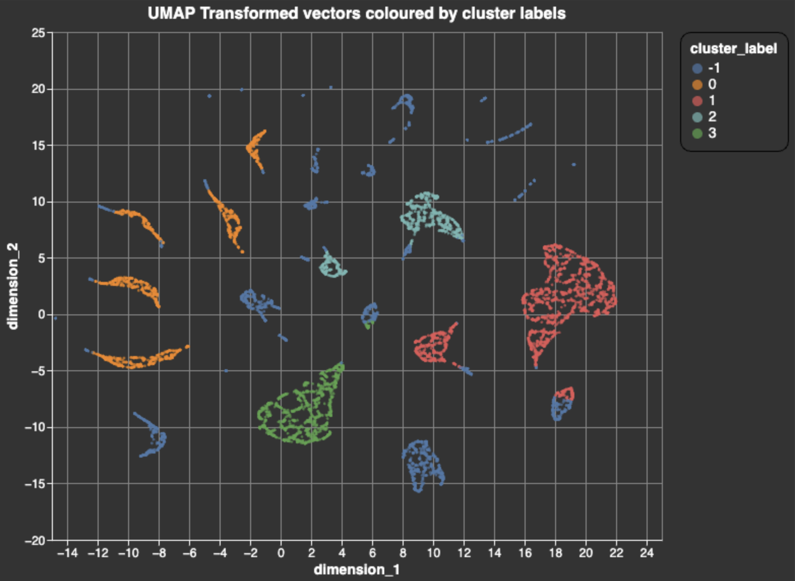

# User Acquisition Analytics

Organizations have until recently done most of their user acquisition analytics on structured data. Vector embeddings have changed this. Because vectors capture the semantic meaning and context of unstructured data such as text, they enable organizations to inform their user targeting strategies with more nuanced and detailed insight into what drives user behavior. But to use vectors to do nuanced user behavior analysis, you need to overcome several challenges - including computational complexity, interpretability, and finding the right embedding techniques.

In this article, we'll show you how to use the Superlinked library to overcome these challenges - letting you leverage vector embedding power to **identify and analyze users on the basis of how they respond to particular ad messaging, target them more precisely, and improve conversion rates in your campaigns**.

You can implement each step below as you read, in the corresponding [notebook](https://github.com/superlinked/superlinked/blob/main/notebook/analytics_user_acquisition.ipynb) and [colab](https://colab.research.google.com/github/superlinked/superlinked/blob/main/notebook/analytics_user_acquisition.ipynb).

## Vector embedding - power & challenges

By capturing intricate relationships and patterns between data points, and representing them as high-dimensional vectors in a latent space, embeddings empower you to extract deeper insights from complex datasets. With smart vectors, you can do more nuanced analysis, interpretation, and accurate predictions to inform your ad campaign decision-making.

But while vector embeddings are a powerful tool for user analysis, they introduce **challenges**:

- *Quality and relevance* - to achieve good retrieval results and avoid postprocessing and reranking, embedding generation techniques and parameters need to be selected carefully
- *Scalability with high-dimensional data* - rich data increases computational complexity and resource requirements, especially when working with large datasets
- *Interpretability* - identifying underlying patterns and relationships (e.g., how specific users respond to certain ad types) embedded in abstract vectors can be tricky

## Smarter vectors

We can use Superlinked's framework to overcome these challenges by creating vectors that are smarter representations of your data and therefore let you retrieve high quality, actionable insights (e.g., understanding why different users respond to different ad creatives) without postprocessing or reranking.

Let's walk through how you can perform user acquisition analytics on ad creatives using Superlinked library elements, namely:

- **Recency space** - to understand the freshness of information (e.g., signup dates)
- **Number space** - to interpret user activity (e.g., API calls/day)
- **TextSimilarity space** - to interpret the semantic meaning of text data (e.g., ad creatives)

## User data

We have data from two 2023 ad campaigns - one from August (with more generic ad messages), and another from December (assisted by a made-up influencer, "XYZCr$$d"). Our data (for 8000 users) includes:

1. signup date, as unix timestamp
2. the ad creative a user clicked on before signing up
3. average daily activity (for users who signed up by clicking on a campaign ad_creative), measured in API calls/day (over the user's lifetime)

To make our ad campaigns smarter, **we want to know which users to target with which kinds of ad messaging**. We can discover this by embedding our data into a vectorspace, where we can cluster users and find meaningful groups - using a UMAP visualization to examine the cluster labels' relationship to features of the ad creatives.

Let's get started.

## Setup

Before you do your installations and imports, make sure you have access to Llama2 in your environment. If you're working in google colab, sign in / up on [huggingface](https://huggingface.co/), get an access token [here](https://huggingface.co/settings/tokens/), and login:

```python
from huggingface_hub import notebook_login
notebook_login() 
```

Now, let's get going on our installations and imports.

First, we install superlinked and umap.

```python
%pip install superlinked==9.32.1
%pip install umap-learn
```

Next, import all our components and constants.

(Note: Omit `alt.renderers.enable(“mimetype”)` if you’re running this in [google colab](https://colab.research.google.com/github/superlinked/superlinked/blob/main/notebook/recommendations_e_commerce.ipynb). Keep it if you’re executing in [github](https://github.com/superlinked/VectorHub/blob/main/docs/articles/ecomm-recys.md).)

```python
from datetime import datetime, timedelta
import os
import sys
import altair as alt
import numpy as np
import pandas as pd
from sklearn.cluster import HDBSCAN
import umap

from superlinked.evaluation.charts.recency_plotter import RecencyPlotter
from superlinked.evaluation.vector_sampler import VectorSampler
from superlinked.framework.common.dag.context import CONTEXT_COMMON, CONTEXT_COMMON_NOW
from superlinked.framework.common.dag.period_time import PeriodTime
from superlinked.framework.common.embedding.number_embedding import Mode
from superlinked.framework.common.schema.schema import Schema
from superlinked.framework.common.schema.schema_object import String, Float, Timestamp
from superlinked.framework.common.schema.id_schema_object import IdField
from superlinked.framework.common.parser.dataframe_parser import DataFrameParser
from superlinked.framework.dsl.executor.in_memory.in_memory_executor import (
    InMemoryExecutor,
    InMemoryApp,
)
from superlinked.framework.dsl.index.index import Index
from superlinked.framework.dsl.source.in_memory_source import InMemorySource
from superlinked.framework.dsl.space.text_similarity_space import TextSimilaritySpace
from superlinked.framework.dsl.space.number_space import NumberSpace
from superlinked.framework.dsl.space.recency_space import RecencySpace

alt.renderers.enable("mimetype")  # important: to render plots in colab, replace 'mimetype' with 'colab'
alt.data_transformers.disable_max_rows()
os.environ["TOKENIZERS_PARALLELISM"] = "false"
pd.set_option("display.max_colwidth", 190)
pd.options.display.float_format = "{:.2f}".format
```

Now we import our dataset. 

```python
dataset_repository_url = (
    "https://storage.googleapis.com/superlinked-notebook-user-acquisiton-analytics"
)
USER_DATASET_URL = f"{dataset_repository_url}/user_acquisiton_data.csv"
NOW_TS = 1708529056
EXECUTOR_DATA = {CONTEXT_COMMON: {CONTEXT_COMMON_NOW: NOW_TS}}
```

(This might take a few minutes. While you're waiting, you can always find other interesting reading in [VectorHub](https://superlinked.com/vectorhub/).)

## Read and explore our dataset

Now that our dataset's imported, let's take a closer look at it:

```python
NROWS = int(os.getenv("NOTEBOOK_TEST_ROW_LIMIT", str(sys.maxsize)))
user_df: pd.DataFrame = pd.read_csv(USER_DATASET_URL, nrows=NROWS)
print(f"User data dimensions: {user_df.shape}")
user_df.head()
```

We have 8000 users, and (as we can see from the first five rows) 4 columns of data:


To understand which ad creatives generated how many signups, we create a DataFrame:

```python
pd.DataFrame(user_df["ad_creative"].value_counts())
```

...which looks like this:


The influencer (XYZCr$$d) backed ad creatives seem to have worked better - generating many more signups (total 5145) than the August campaign ad creatives (total 2855). 

Now, let's take a look at the **distribution of users by activity level** (api calls/day).

```python
alt.Chart(user_df).mark_bar().encode(
    alt.X("activity:Q", bin=True, title="Activity count"),
    alt.Y("count()", title="# of users"),
).properties(width=600, height=400)
```


The activity (api calls/day) distribution is bimodal. Here, it's possible that the first activity level group (0.00-0.40 api calls/day) may be largely new users, who - if they signed up in the most recent (December) campaign - have less time to accumulate activity than users who signed up earlier. (Note: we can use derive our NumberSpace min and max from this distribution.)

Now let's examine the distribution of new users per signup date.

```python
dates: pd.DataFrame = pd.DataFrame(
    {"date": [str(datetime.fromtimestamp(ts).date()) for ts in user_df["signup_date"]]}
)
dates_to_plot = pd.DataFrame(dates.value_counts(), columns=["count"]).reset_index()
alt.Chart(dates_to_plot).mark_bar().encode(
    alt.X("date", title="Signup date"), alt.Y("count", title="Number of subscribers")
).properties(height=400, width=1200)
```


This distribution confirms that our second campaign (December) works much better than the first (August). The jump in signups at 2023-12-21 coincides with our second campaign, and our data is exclusively users who signed up by clicking on campaign ad_creatives. To get more insights from our user acquisition analysis, we need two periods that fit our distribution. A first period of 65 days and a second of 185 days seem appropriate.

Of our 8k users, roughly 2k subscribed in the first campaign period (65 days), and 6k in the second. Since we already know which ad_creatives users clicked on to go sign up (2855 on old campaign ads, 5145 on new campaign ads), we know that some of the roughly 6k users who signed up after the second (December) campaign started clicked on old (August) campaign ads *after* the new campaign ad began (possibly after seeing the new campaign ads).

So far, we know that:

- many more users signed up in response to the influencer-backed ad creatives (second campaign) than the first campaign
- which specific ad creatives generated the most user signups
- the vast majority of users have low to moderate activity

We don't know:

- which ad creatives resulted in low vs medium vs high activity users?
- how did users cluster in terms of signup date, activity levels, *and* ad_creatives they clicked?
- are there user data patterns we can mine to make better decisions when planning our next campaign?

Fortunately, embedding with Superlinked spaces will help provide answers to these questions, and empower us to adopt a more effective user acquisition strategy.

## Embedding with Superlinked

Now, let's use Superlinked to embed our data in a semantic space - to:
 
1. inform our model as to which ad creatives generated signups, and *which users* (with specific activity level distributions) signed up
2. group specific ad creatives that have similar meanings, and possibly outcomes

First, we define a schema for our user data:

```python
class UserSchema(Schema):
    ad_creative: String
    activity: Float
    signup_date: Timestamp
    id: IdField
```

```python
user = UserSchema()
```

Now we create a **semantic space** for our **ad_creatives** using a text similarity model. Then, we encode user activity into a **numerical space** to represent **users' activity level**. We also encode the **signup date** into a **recency space**, allowing our clustering algorithm to take account of the two specific periods of signup activity (following our two campaign start dates).

```python
# create a semantic space for our ad_creatives using a text similarity model
creative_space = TextSimilaritySpace(
    text=user.ad_creative, model="sentence-transformers/all-mpnet-base-v2"
)

# encode user activity into a numerical space to represent users' activity level
activity_space = NumberSpace(
    number=user.activity, mode=Mode.SIMILAR, min_value=0.0, max_value=1.0
)

# encode the signup date into a recency space
recency_space = RecencySpace(
    timestamp=user.signup_date,
    period_time_list=[PeriodTime(timedelta(days=65)), PeriodTime(timedelta(days=185))],
    negative_filter=0.0,
)
```

Let's plot our recency scores by date. 

```python
recency_plotter = RecencyPlotter(recency_space, context_data=EXECUTOR_DATA)
recency_plotter.plot_recency_curve()
```


Next, we set up an in-memory data processing pipeline for indexing, parsing, and executing operations on user data, including clustering (where RecencySpace lets our model take account of user signup recency).

First, we create our index with the spaces we use for clustering.

```python
user_index = Index(spaces=[creative_space, activity_space, recency_space])
```

Now for dataframe parsing.

```python
user_df_parser = DataFrameParser(schema=user)
```

We create an `InMemorySource` object to hold the user data in memory, and set up our executor (with our user data source and index) so that it takes account of context data.

```python
source_user: InMemorySource = InMemorySource(user, parser=user_df_parser)
executor: InMemoryExecutor = InMemoryExecutor(
    sources=[source_user], indices=[user_index], context_data=EXECUTOR_DATA
)
app: InMemoryApp = executor.run()
```

...and then input our user data.

```python
source_user.put([user_df])
```

 (The step above make take a few minutes or more. In the meantime, why not learn more about vectors in [Vectorhub](https://superlinked.com/vectorhub/).)

## Load features

Next, we collect all our vectors from the app.

```python
vs = VectorSampler(app=app)
vector_collection = vs.get_all_vectors(user_index, user)
vectors = vector_collection.vectors
vector_df = pd.DataFrame(vectors, index=[int(id_) for id_ in vector_collection.id_list])
vector_df.head()
```

```python
vector_df.shape
```

Here are the first five rows (of 8000), and 776 columns, of the resulting dataframe:


## Clustering

Next, we fit a clustering model.

```python
hdbscan = HDBSCAN(min_cluster_size=500, metric="cosine")
hdbscan.fit(vector_df.values)
```

Let's create a DataFrame to store the cluster labels assigned by HBDSCAN and count how many users belong to each cluster:

```python
label_df = pd.DataFrame(
    hdbscan.labels_, index=vector_df.index, columns=["cluster_label"]
)
label_df["cluster_label"].value_counts()
```


## Visualizing the data

Let's try to interpret our dataset by visualizing it using UMAP.

First, we'll fit the UMAP and transform our dataset:

```python
umap_transform = umap.UMAP(random_state=0, transform_seed=0, n_jobs=1, metric="cosine")
umap_transform = umap_transform.fit(vector_df)
umap_vectors = umap_transform.transform(vector_df)
umap_df = pd.DataFrame(
    umap_vectors, columns=["dimension_1", "dimension_2"], index=vector_df.index
)
umap_df = umap_df.join(label_df)
```

Next, we join our dataframes and create a chart, letting us visualize the UMAP-transformed vectors, and coloring them with cluster labels.

```python
umap_df = umap_df.join(label_df)
alt.Chart(umap_df).mark_circle(size=8).encode(
    x="dimension_1", y="dimension_2", color="cluster_label:N"
).properties(
    width=600, height=500, title="UMAP Transformed vectors coloured by cluster labels"
).configure_title(
    fontSize=16,
    anchor="middle",
).configure_legend(
    strokeColor="black",
    fillColor="#EEEEEE",
    padding=10,
    cornerRadius=10,
    labelFontSize=14,
    titleFontSize=14,
).configure_axis(
    titleFontSize=14, labelFontSize=12
)
```



The dark blue clusters (label -1) are outliers - not large or dense enough to form a distinct group. The large number of blobs indicates that 2/3 of the vector normal mass is comprised of *many* ad_creatives, while 1/3 is made up by just a *few*.
*Note - 2D (UMAP) visualizations often make some clusters look quite dispersed / scattered.

## Understanding the cluster groups

To understand our user clusters better, we can generate some activity histograms.

First, we join user data with cluster labels, create separate DataFrames for each cluster, generate activity histograms for each cluster, and then concatenate these histograms into a single visualization.

```python
# activity histograms by cluster
user_df = user_df.set_index("id").join(label_df)

by_cluster_data = {
    label: user_df[user_df["cluster_label"] == label]
    for label in np.unique(hdbscan.labels_)
}

activity_histograms = [
    alt.Chart(user_df_part)
    .mark_bar()
    .encode(x=alt.X("activity", bin=True), y="count()")
    .properties(title=f"Activity histogram for cluster {label}")
    for label, user_df_part in by_cluster_data.items()
]

alt.hconcat(*activity_histograms)
```


Our users' activity profiles conform to a power-law distribution that's common in user activity profiles: most users tend to be low activity, some medium activity, and very active users quite rare.

From our histograms, we can observe that:

- cluster -1 users are outliers, balanced, with predominantly low, a few medium, and all the most active users
- cluster 0 has mostly low-moderate activity users, and the lowest number of (i.e., nearly zero) highly active users
- cluster 1 has the most low-moderate/medium activity users, and the second largest number of highly active users (next to the outliers cluster (-1))
  users are moderately active, with relatively few very low and high activity users
- clusters 2 and 3 are predominately low-moderate activity and a few medium activity users

To see the distribution of ad_creatives across different clusters, we create a DataFrame that shows each ad_creative's count value within each cluster:

```python
pd.DataFrame(user_df.groupby("cluster_label")["ad_creative"].value_counts())
```


observations:

- cluster -1 (with the most high and extremely high activity users) clicked on ad_creatives from both campaigns (as expected); 1324 clicks on new campaign ads, 1344 on old
- cluster 0 clicked on only the first (non-influencer) campaign; these ads focus on community and competition within the gaming platform
- clusters 1 and 2 clicked on only two influencer campaign ad creatives; cluster 1 ads focused on the benefits of premium membership; cluster ads highlighted experience and achievement in the gaming platform
- cluster 3 clicked on only one ad_creative - from the influencer campaign; this ad was an immediate appeal based on promised excitement and the exclusive rewards of joining

Now, let's get some descriptive stats for our signup dates to help us interpret our clusters' behavior further. 

```python
user_df["signup_datetime"] = [
    datetime.fromtimestamp(ts) for ts in user_df["signup_date"]
]
desc = user_df.groupby("cluster_label")["signup_datetime"].describe()
for col in desc.columns:
    if col == "count":
        continue
    desc[col] = [dt.date() for dt in desc[col]]
desc
```


What do our clusters' signup dates data indicate?

- outliers' (cluster -1) have signup dates that are scattered across both campaign periods
- cluster 0's signups came entirely from clicks on the first campaign's ad_creatives
- clusters 1, 2, and 3 signed up in response to the new (influencer-augmented) campaign only

## Our findings, in sum

Let's summarize our findings.

| cluster label | activity level | ad creative (-> signup) | signup date (campaign) | # users | % of total |
| :--- | :----------------- | :---------------------- | :----------------------- | :---------- | -------: |
| -1 (outliers) | all levels, with *many* highly active users | both campaigns (6 new, 6 old) | all | 1088 | 14% |
| 0 | low to medium | only first campaign | first campaign (5 ads) | 2178 | 27% |
| 1 | low to medium, but balanced | only 2 influencer campaign ads | influencer campaign | 2839 | 35% |
| 2 | low to medium | only 2 influencer campaign ads | influencer campaign | 805 | 10% |
| 3 | low to medium | only 1 influencer campaign ad | influencer campaign | 1090 | 14% |

Overall, the influencer-backed (i.e., second) campaign performed better. Roughly 66% of user signups came *exclusively* from clicks on second campaign ad_creatives. These ads were influencer-based, included a call to action, emphasized benefits, and had motivating language. (Two ads in particular accounted for 38% of all signups: "Unleash your gaming potential! Upgrade to premium for 2 months free and dominate the competition with XYZCr$$d!" (22%), and "Ready to level up? Join XYZCr$$d now for intense gaming battles and exclusive rewards!" (16%).)

Users who signed up in response to ads that focused on enhanced performance, risk-free premium benefits, and community engagement - cluster 1 - tended to be predominantly medium activity users, but also included a nontrivial number of low and high activity users. Cluster 1 users also made up the largest segment of subscriptions (35%). Both these findings suggest that this kind of ad_creative provides the best ROI.

Cluster 0, though it signed up exclusively in response to the first (non-influencer) campaign, is still relatively low to medium activity users - its overall distribution is left of clusters 1, 2, and 3 - suggesting that users who subscribe in response to the non-influencer campaign ads are less active than users who signup after clicking on new campaign ads. Still, we need to continue monitoring user activity to see if these patterns hold over time.

## Conclusion

Using Superlinked's Number, Recency, and TextSimilarity Spaces, we can embed various aspects of our user data, and create clusters on top our vector embeddings. By analyzing these clusters, we reveal patterns previously invisible in the data - which ad_creatives work well at generating signups, and how users behave *after* signups resulting from certain ad_creatives. These insights are invaluable for shaping more strategic marketing and sales decisions.

Now it's your turn. Experiment with the Superlinked library yourself in the [notebook](https://github.com/superlinked/superlinked/blob/main/notebook/analytics_user_acquisition.ipynb)!