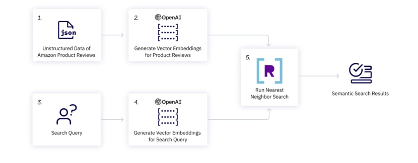
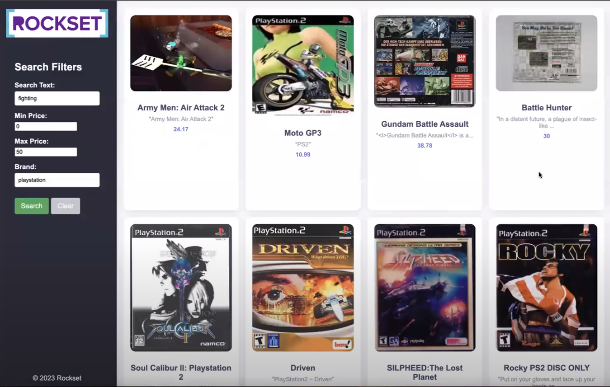
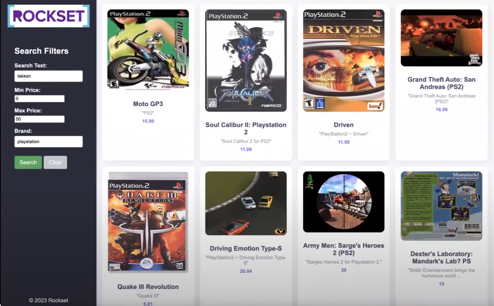

# Step-by-Step Tutorial on Vector-Powered Movie Search for Beginners 

## Overview

In this article, you will:

- Learn how to build a vector-based search engine you can use for recommendations with a database optimized for vectors (Rockset), using OpenAI embeddings
- Build a dynamic web application using vanilla CSS, HTML, JavaScript, and Flask, that seamlessly integrates with Rockset and OpenAI APIs
- Find an end-to-end Colab notebook - [Recsys_workshop](https://colab.research.google.com/drive/1rD08fTiCGJiKFDDNZyJh92QN4_dz6Hcu) - that you can run without any dependencies on your local operating system

## Introduction

If you have a web or mobile app, and want to improve personalization, user engagement, and user satisfaction, your recommendation system has to be capable of finding accurate, relevant, and similar items from within a large, high-dimensional dataset, and doing it in real-time. You need an *optimized and efficient [architecture](https://rockset.com/blog/a-blueprint-for-a-real-world-recommendation-system/)*. This architecture has to include a robust database that can handle vectorization, vector indexing, search, and retrieval.

There are a wide range of capable vector databases (VDBs). To see which VDB fits your use case, take a look at [this comparison tool](https://vdbs.superlinked.com/). Our build in this article uses Rockset VDB, and OpenAI embedding models to vectorize our dataset. Of the many [vector search components](https://superlinked.com/vectorhub/building-blocks/vector-search/introduction) required to build a recommendation system, here we'll focus just on what's key for our purposes: metadata filtering and vector search.

**The workflow - an overview**

The workflow of our web application (see image below) starts with unstructured data - game reviews in our case (1.), generate vector embeddings for them using an OpenAI model (2.), and store them in our database (R). Then we use the same OpenAI model to generate vector embeddings (4.) for our search query (3.), and use a similarity measure (5.) such as approximate neighbor search to find embeddings of relevant game reviews (Semantic Search Results), which we display as our top 10 recommendations.



Now that we have an overview of our RecSys workflow, let's go build it, step by step, per the [Google Colab notebook](https://colab.research.google.com/drive/1WcJggQWYayVIQpKFQVZ80H74x0tky8Pa?usp=sharing#scrollTo=XzggkmXJ_Bly).

## Step-by-step guide to building a WebApp Recommender, using Rockset and OpenAI embeddings

### Step 1: Initiate your vector database

First, you need to sign up for [Rockset](https://rockset.com/create/) VDB. Once signed up, create an [API key](https://console.rockset.com/apikeys) to use in your backend code:

```python
import os
os.environ["ROCKSET_API_KEY"] = "XveaN8L9mUFgaOkffpv6tX6VSPHz####"
```

### Step 2: Create a new collection, and upload data

In this tutorial, we use [Amazon product review data](https://drive.google.com/file/d/1EEvCUqKIH6LuLLGRjo6ayCEXqT4Z-ZVE/view?usp=drive_link) as our game reviews source. Download this data onto your local machine, so you can upload it (as a json file) to Rockset.

Note: In practice, data is usually ingested from a streaming service. To keep things simple for our demo, we instead use a sample from a public dataset.

### Step 3: Create OpenAI API Key

We use an OpenAI model to convert our data into [embeddings](https://platform.openai.com/docs/api-reference/embeddings/create).

After signing up for OpenAI, go to [API Keys](https://platform.openai.com/api-keys) and create a secret key. Don't forget to copy and save your key, which will look something like this: "sk-***********************". Like Rockset's API key, save your OpenAI key in the environment so you can use it easily throughout your code:

```python
os.environ["OPENAI_API_KEY"] = "sk-####"
```

### Step 4: Create a Query Lambda on Rockset

[Query Lambdas](https://docs.rockset.com/documentation/docs/query-lambdas) are named, parameterized SQL queries stored in Rockset that can be executed from a dedicated REST endpoint. Using Query Lambdas, you can save your SQL queries as separate resources and manage them through development and production.

First, we create a SQL query with these parameters: embedding, brand, min_price, max_price and limit.

```sql
SELECT
  asin,
  title,
  brand,
  description,
  estimated_price,
  brand_tokens,
  image_url,
  APPROX_DOT_PRODUCT(embedding, VECTOR_ENFORCE(:embedding, 1536, 'float')) as similarity
FROM
    commons.sample s
WHERE estimated_price between :min_price AND :max_price
AND ARRAY_CONTAINS(brand_tokens, LOWER(:brand))
ORDER BY similarity DESC
LIMIT :limit;
```

This parameterized query (above) does the following:

- It retrieves data from the "sample" table in the "commons" schema. And selects specific columns, like ASIN, title, brand, description, estimated_price, brand_tokens, and image_url.
- It also computes the similarity between the provided embedding and the embedding stored in the database using the **APPROX_DOT_PRODUCT** function.
- The query filters results whose estimated_price falls within the provided range, and whose brand contains the specified value; it then sorts the results in order of descending similarity (i.e., the most similar results come first).
- Finally, it limits the number of returned rows based on the provided limit parameter.

To finish building our Query Lambda, simply query the collection made in step 2 by pasting the parameterized query above into the [Rockset query editor](https://console.rockset.com/query).

### Step 5: Implement a Frontend and Backend

The final step in creating our web application is implementing our frontend and backend. For our frontend, we use vanilla HTML, CSS, and a bit of JavaScript - alongside our backend, which uses Flask, a lightweight Pythonic web framework.

The **frontend** [page](https://github.com/ankit1khare/rockset-vector-search/blob/main/templates/index.html) looks like this:



Let's break down the HTML file to understand its structure and components:

1. **HTML Structure:** - includes a sidebar, header, and product grid container.

2. **Sidebar:** - contains search filters such as brands, min and max price, etc., and buttons for user interaction.

3. **Product Grid Container:** - populates product cards dynamically using JavaScript to display product information i.e. image, title, description, and price.

4. **JavaScript Functionality:** - handles interactions such as toggling full descriptions, populating the recommendations, and clearing search form inputs.

5. **CSS Styling:** - implemented for responsive design to ensure optimal viewing on various devices and improve aesthetics.

You can examine the code behind this front-end in full [here](https://github.com/ankit1khare/rockset-vector-search/blob/main/templates/index.html).

Now, let's turn to our **backend**.

We've chosen Flask because [its backend code](https://github.com/ankit1khare/rockset-vector-search/blob/main/app.py) makes creating web applications in Python easier by rendering the HTML and CSS files via single-line commands.

Initially, the GET method will be called and the HTML file rendered. At this point, no recommendation will be made, so the basic structure of the page will display on the browser. After executing this, we can fill in the html form (i.e., left panel "Search" fields) and submit it, thereby utilizing the POST method to get some recommendations.

Let's take a closer look at the main components of the backend code, the same way we did for our front-end:

1. **Flask App Setup:**
    1. A Flask application named `app` is defined along with a route for both GET and POST requests at the root URL ("/").

2. **Index function:**
    1. Function built to primarily handle both GET and POST requests.
    2. If it's a POST request:
        1. Extracts form data from the frontend.
        2. Calls a set of functions to process the input data and fetch recommended results from Rockset database.
        3. Fetches recommended product images by searching through all the product images saved in this [directory](https://github.com/ankit1khare/rockset-vector-search/tree/main/static).
        4. Renders the index.html template with the results.
    3. If it's a GET request:
        1. Renders the index.html template with the search form.

```python
@app.route('/', methods=['GET', 'POST'])
def index():
    if request.method == 'POST':
        # Extract data from form fields
        inputs = get_inputs()

        search_query_embedding = get_openai_embedding(inputs, client)
        rockset_key = os.environ.get('ROCKSET_API_KEY')
        region = Regions.usw2a1
        records_list = get_rs_results(inputs, region, rockset_key, search_query_embedding)

        folder_path = 'static'
        for record in records_list:
            # Extract the identifier from the URL
            identifier = record["image_url"].split('/')[-1].split('_')[0]
            file_found = None
            for file in os.listdir(folder_path):
                if file.startswith(identifier):
                    file_found = file
                    break
            if file_found:
                # Overwrite the record["image_url"] with the path to the local file
                record["image_url"] = file_found
                record["description"] = json.dumps(record["description"])
                # print(f"Matched file: {file_found}")
            else:
                print("No matching file found.")

        # Render index.html with results
        return render_template('index.html', records_list=records_list, request=request)

    # If method is GET, just render the form
    return render_template('index.html', request=request)
```

3. **Data Processing Functions:**
    1. get_inputs(): Extracts form data from the request.

    ```python
    def get_inputs():
        search_query = request.form.get('search_query')
        min_price = request.form.get('min_price')
        max_price = request.form.get('max_price')
        brand = request.form.get('brand')
        limit = request.form.get('limit')

        return {
            "search_query": search_query,
            "min_price": min_price,
            "max_price": max_price,
            "brand": brand,
            "limit": limit
        }
    ```

    2. get_openai_embedding(): Uses OpenAI to get embeddings for search queries.
   
    ```python
    def get_openai_embedding(inputs, client):
        # openai.organization = org
        # openai.api_key = api_key

        openai_start = (datetime.now())
        response = client.embeddings.create(
            input=inputs["search_query"],
            model="text-embedding-ada-002"
            )
        search_query_embedding = response.data[0].embedding
        openai_end = (datetime.now())
        elapsed_time = openai_end - openai_start

        return search_query_embedding
    ```

    3. get_rs_results(): Utilizes Query Lambda created earlier in Rockset and returns recommendations based on user inputs and embeddings.
   
    ```python
    def get_rs_results(inputs, region, rockset_key, search_query_embedding):
        print("\nRunning Rockset Queries...")
        # Create an instance of the Rockset client
        rs = RocksetClient(api_key=rockset_key, host=region)

        rockset_start = (datetime.now())
        # Execute Query Lambda By Version
        rockset_start = (datetime.now())
        api_response = rs.QueryLambdas.execute_query_lambda_by_tag(
            workspace="commons",
            query_lambda="recommend_games",
            tag="latest",
            parameters=[
                {
                    "name": "embedding",
                    "type": "array",
                    "value": str(search_query_embedding)
                },
                {
                    "name": "min_price",
                    "type": "int",
                    "value": inputs["min_price"]
                },
                {
                    "name": "max_price",
                    "type": "int",
                    "value": inputs["max_price"]
                },
                {
                    "name": "brand",
                    "type": "string",
                    "value": inputs["brand"]
                }
                {
                     "name": "limit",
                     "type": "int",
                     "value": inputs["limit"]
                }
            ]
        )
        rockset_end = (datetime.now())
        elapsed_time = rockset_end - rockset_start

        records_list = []
        for record in api_response["results"]:
            record_data = {
                "title": record['title'],
                "image_url": record['image_url'],
                "brand": record['brand'],
                "estimated_price": record['estimated_price'],
                "description": record['description']
            }
            records_list.append(record_data)

        return records_list
    ```

In summary, the Flask backend processes user input and interacts with external services (OpenAI and Rockset) to provide dynamic content to the frontend. It extracts form data from the frontend, generates OpenAI embeddings for text queries, and utilizes Query Lambda at Rockset to find recommendations.

## Running your Vector-Search-based recommendation system

Now that you have your recommendation system set up, you're ready to run the flask server and access it via your internet browser. Et voilà! Your application is up and running. Let's add some parameters in the "search filters" bar and get some recommendations. The results will be displayed on an HTML template, as shown below.



**Note: The entire code for this tutorial is available on [GitHub](https://github.com/ankit1khare/rockset-vector-search/tree/main)**. For a quick-start online implementation, an end-to-end runnable **[Colab notebook](https://colab.research.google.com/drive/1WcJggQWYayVIQpKFQVZ80H74x0tky8Pa?usp=sharing#scrollTo=XzggkmXJ_Bly)** is also configured.

The methodology outlined in this tutorial is a viable foundation not just for recommendation systems but a wide range of other applications as well. Leveraging the same set of concepts, and using embedding models and a vector database, you're now equipped to build a wide variety of applications - including semantic search engines, customer support chatbots, and real-time data analytics dashboards.


## Contributors

- [Ankit Khare, Author](https://www.linkedin.com/in/deeplearnerak/)
- [Mór Kapronczay, Editor](https://www.linkedin.com/in/mór-kapronczay-49447692)
- [Robert Turner, Editor](https://www.linkedin.com/in/robertdhayanturner/)
