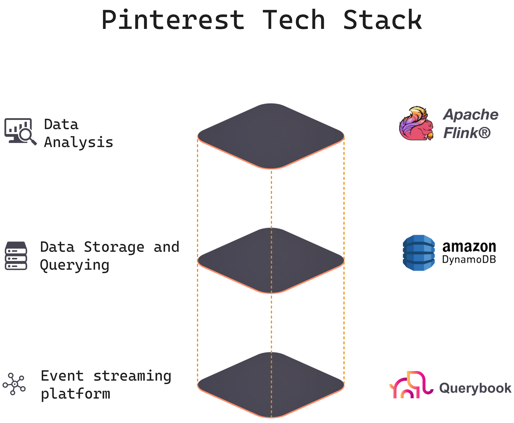

# Data Sources: Introduction

A robust vector retrieval system relies on a thoughtful selection of data sources that align with the system’s objectives. Different use cases demand different kinds and combinations of data. 

If, for example, your organization runs a personalized movie recommendation system, you need data on customer preferences and viewing history. Whereas if you operate an automatic fraud detection system, your primary data source is transactional data. 

In other words, data sources form the bedrock upon which your retrieval system stands. 
It’s important, therefore, to understand what different types and combinations of data are available, and what they make possible – both generally and in your specific instance. You need a data map.

## The Data Map - A Mosaic of Data Types and Combinations

An organization’s data is rarely uniform. Instead, the data landscape of any organization is a mosaic that can be characterized in terms of its **velocity** (ranging from stream to batch data), its **modality** / type (spanning structured to unstructured data), and its **sources** (originating from in-house systems and/or third-party providers).

Where your data falls along these three dimensions (velocity, modality, source) determines what you can do with it – that is, what use cases you can accommodate, and how you should configure your data retrieval stack to meet your objectives. In order to shape your data retrieval stack optimally, you need to build a mental model of your available data and understand its potential.

### Example: Pinterest technology stack

What you choose for your data and ML stack can make or break your whole product. Let’s look at an example of how your product strategy and use case can prescribe the kinds of decisions you make about your data and your ML Stack.

Pinterest used a product-led growth strategy that relied upon a curated feed of recommended “Pins”. Due to the highly viral nature of the product, this strategy allowed Pinterest to raise [$564 million pre-revenue](https://www.entrepreneur.com/science-technology/no-revenue-no-problem-pinterest-raises-another-225/229597), ultimately growing to over 72.8 million users. 

Pinterest uses diverse data types to improve the recommendation performance of its feed, including mechanisms to handle:
    - **Structured data** (e.g., user profiles): This includes well-defined attributes with specific formats.
    - **Semi-structured data** (e.g., event logs): These follow a general structure but may have varying fields or additional context.
    - **Unstructured data** (e.g., images): These are typically files without a fixed schema.

Below is an overview of the data & ML stack Pinterest uses to convert all this data (above) to product value.

1. **Event Streaming Platform**:
    - Pinterest relies on an **event streaming platform**, [Flink](https://medium.com/pinterest-engineering/unified-flink-source-at-pinterest-streaming-data-processing-c9d4e89f2ed6#:~:text=To%20best%20serve%20Pinners%2C%20creators,as%20its%20stream%20processing%20engine), to collect real-time event data. This platform allows them to easily collect, enrich, and transform event attributes.
    - In practice, the event streaming system handles real-time data ingestion, ensuring that events from user interactions, content uploads, and other actions are captured efficiently. 
    - These events can be considered **semi-structured** – they follow a specific format (e.g., JSON) but may vary in content.

2. **Data Storage and Querying**:
    - For **persistent storage**, Pinterest utilizes technologies like **DynamoDB** (a NoSQL database service by AWS). DynamoDB provides scalability, reliability, and security for Pinterest’s massive dataset.
    - The architecture supports various querying needs:
        - Real-time exploration of raw incoming data for monitoring and analytics (semi-structured data).
        - Cached queries that can instantly be loaded into applications and reports for customer-facing metrics (structured data).
        - The data stored in DynamoDB includes:
            - User profiles (structured data).
            - Event logs (semi-structured data).
            - Images and other media (unstructured data).

3. **Data Analysis**:
    - Pinterest’s engineers use [**Querybook**](https://medium.com/pinterest-engineering/open-sourcing-querybook-pinterests-collaborative-big-data-hub-ba2605558883), a collaborative big data hub that allows internal users to query and analyze data efficiently. Each **DataDoc** in Querybook consists of cells (text, query, or chart) that facilitate exploration and visualization.
    - The system supports complex queries for trend analysis, anomaly detection, recommendation algorithms, and personalized content delivery.

For precise details about Pinterest’s specific data types and components, check out their [engineering blog](https://medium.com/@Pinterest_Engineering).

Now let's dive into the details. 

### **1.1 Data Velocity**
The choice of data processing velocity is pivotal in determining the kind of data retrieval and vector compute tasks you can perform. Different velocities offer distinct advantages and make different use cases possible. 

[Read more about different data velocities, here](https://hub.superlinked.com/11-data-velocity)

### **1.2 Data Modality** 
Whether your data is structured, unstructured, or hybrid is crucial when evaluating data sources. The nature of the data source your vector retrieval system uses shapes how that data should be managed and processed.

[Read more about how to manage different data types/modalities, here](https://hub.superlinked.com/12-data-modality)

### **1.3 Conclusions & Next Steps**
So what does this all mean? 

[Read our conclusions and recommended next steps, here](https://hub.superlinked.com/13-conclusion)

## Contributors

- [Daniel Svonava](https://www.linkedin.com/in/svonava/)
- [Paolo Perrone](https://www.linkedin.com/in/paoloperrone/)
- [Robert Turner, editor](https://robertturner.co/copyedit)
