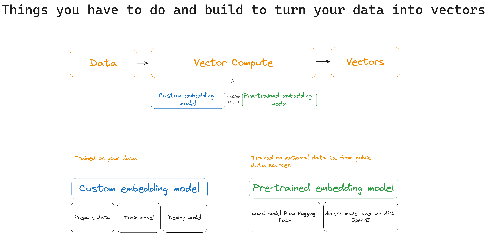
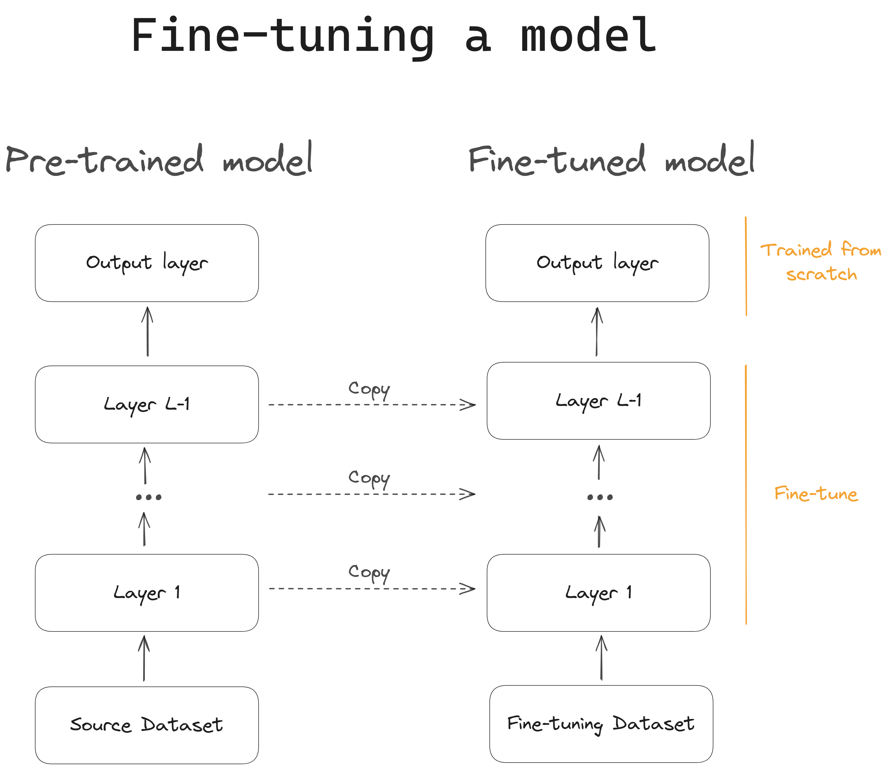

# Pre-trained and Custom models: when to use which?

Your task's unique requirements will dictate when you should use a custom model, and when you should use a pre-trained model.

Whereas **pre-trained models** shine in domains such as _text, image, and audio processing by leveraging large, generic datasets to enhance performance and efficiency_, **custom models** are essential in areas like _graph embeddings, time series, and categorical data processing, where specific patterns and characteristics require tailored solutions_, for example, [Time2Vec](https://towardsdatascience.com/time2vec-for-time-series-features-encoding-a03a4f3f937e) or [GraphSAGE](https://github.com/williamleif/GraphSAGE). 

Graph Embeddings, such as [Node2Vec](https://snap.stanford.edu/node2vec/), have a variety of use cases, including recommender systems. [Graph embedding models](https://towardsdatascience.com/knowledge-graph-embeddings-101-2cc1ca5db44f) learn the relationships between entities in a knowledge graph using low-dimensional embeddings, making it more efficient to compute various similarity and inference tasks. 

Much attention has been focused on whether transformer models should be used for time series data embeddings. For example, after  initial hype over Zhou et al.’s transformer-based Informer model, unveiled in [a 2021 paper](https://arxiv.org/abs/2012.07436) that won an AAAI 2021 Outstanding Paper Award, subsequent research appeared to show that such transformer-based models were outperformed on time series forecasting tasks by simpler [linear algorithms](https://machine-learning-made-simple.medium.com/why-do-transformers-suck-at-time-series-forecasting-46ae3a4d6b11), including the DLinear model. 

This debate is still very much alive, with transformer-based proponents maintaining that [Autoformer custom models perform better](https://huggingface.co/blog/autoformer). Whichever side of this debate you stand on, the fact remains: **if you work with time series data, you need custom models**.

_Custom models_ are more useful and perform better than pre-trained models where data is atypical, structured, and/or proprietary. _Pre-trained models_, on the other hand, are typically designed for general applications and may not perfectly align with specific downstream tasks. 

|Aspect|Custom Models|Pre-Trained Models|
|---|---|---|
|Purpose|Tailored to specific tasks or domains|Trained on large generic datasets, then fine-tuned for specific tasks|
|Strengths|Excelling in unique domains with specialized requirements|Offering computational efficiency and enhanced performance when task-specific data is limited|
|Examples|Graph embeddings, time series analysis, category embeddings|BERT, ResNet, Wav2Vec and other models in text, image, and audio processing|
|Customization|Customization and fine-tuning to address specific nuances of data and task|Adjusted to align with task specifics through fine-tuning|
|Use Cases|Essential in areas with distinct patterns and specialized needs|Effective in domains like text, image, and audio processing where large, generic datasets enhance performance|
|Balancing Act|Achieving superior results by finding a balance between custom and pre-trained models|Recognizing that customization and fine-tuning are often necessary, even when using pre-trained models|

So, is there a way of preserving a pre-trained model's efficiency and performance advantages, permitting a faster go-to-market, but **also** align it with specific downstream tasks?

One approach is **fine-tuning**.

### Fine-tuning pre-trained models for specific tasks

Adapting a pre-trained model to a given task is called fine-tuning. Fine-tuning leverages the wealth of knowledge already learned by the pre-trained model on large datasets, while specializing it for the problem at hand using small-task-specific data for a specific downstream requirement.

Some examples:

Research has shown that fine-tuning Llama-2 to specific tasks can improve its performance significantly, particularly on the Llama-7b and Llama-13b parameter versions. [A case study fine-tuning the Llama-13b variant](https://www.anyscale.com/blog/fine-tuning-llama-2-a-comprehensive-case-study-for-tailoring-models-to-unique-applications) observed an increase in accuracy from 58% to 98% on functional representations, 42% to 89% on SQL generation, and 28% to 47% on GSM. Using fine-tuning on smaller models increases performance while managing the costs of running the models, ultimately making them more practical to implement into production.

Fine-tuning OpenAI on downstream NLP tasks has achieved [state-of-the-art results in commonsense reasoning, semantic similarity, and reading comprehension](https://openai.com/blog/language-unsupervised/). Further research has demonstrated GPT-4 performance on certain tasks at a level comparable to a human. It would be premature, however, to conclude that this amounts to artificial general intelligence (AGI); there remain [several areas in which GPT-4 falls short of human-level performance](https://arxiv.org/pdf/2303.12712.pdf).

For example, GPT-4 struggles to calibrate for confidence; it doesn’t know when it should be confident vs. when it's simply guessing. Also, the model’s context is extremely limited, it functions “statelessly” – once trained, the model is fixed; it can’t update itself with prior interactions or information, or adapt to a changing environment. In addition, the model regularly hallucinates, making up facts and figures, a problem compounded by its poor confidence calibration.

#### Fine-tuning adds layers and avoids overfitting

Instead of training all model layers from scratch, fine-tuning typically involves modifying and re-training **just the last few layers** of the model, specializing them for the given task. During fine-tuning, the main part of the pre-trained model remains unchanged. Fine-tuning requires only a fraction of the data required to train the whole model from scratch, and it’s also computationally much cheaper.

Fine-tuning helps avoid **overfitting**. Overfitting occurs when a model exposed to only small amounts of task-specific data memorizes inherent patterns, but can't generalize well. Overfitting leads to poor performance on real-world unseen data. By retraining only the last few layers of a pre-trained model, fine-tuning makes overfitting less likely because the unchanged layers continue to provide useful features. In contrast, training an entire complex model on a small amount of data from scratch is very susceptible to overfitting.

To fine-tune a pre-trained model, you first need to **obtain a quality dataset** relevant to your specific problem. For common tasks like sentiment analysis, public benchmark datasets can be used.

For example, let's take a look at some illustrative input/output pairs from the [IMDB movie reviews dataset](https://paperswithcode.com/dataset/imdb-movie-reviews), which can be employed to fine-tune a pre-trained model designed for sentiment analysis:

  **Input**: "Absolutely loved this movie! The acting was superb, and the storyline kept me engaged from start to finish. Highly recommended!"

  **Output**: Positive sentiment

  **Input**: "This film turned out to be a significant disappointment. The plot left me puzzled, the acting was merely average, and I struggled to maintain interest. Not worth watching."

  **Output**: Negative sentiment

Companies invest in human annotation for **proprietary** applications to create labeled datasets reflecting their custom use cases and data. For successful fine-tuning, you need a sufficient volume and variety of examples for a pre-trained model to adapt its knowledge to the new domain.

#### The fine-tuning cycle: training, hyperparameter tuning, performance measurement

The fine-tuning procedure involves repeatedly training the model on downstream labeled data, adjusting key hyperparameters like learning rate and batch size, and evaluating performance on a held-out validation set after each iteration.

This cycle of training, hyperparameter tuning, and performance measurement is repeated until the model plateaus and stops showing significant gains on your particular dataset. The goal is to maximize metrics like accuracy and F1-score, to reach acceptable performance levels for your specific use case and data.

Libraries like [Hugging Face's Transformers](https://huggingface.co/docs/transformers/index) and [spaCy](https://spacy.io) _simplify_ this experimentation process. They provide optimized implementations of impressive pre-trained models and tools to rapidly run training iterations and fine-tune hyperparameters.

Fine-tuning, therefore, can adapt pre-trained models to perform more successfully on specific downstream tasks. However, even fine-tuned pre-trained models have limitations.

#### The limits of fine-tuning

Fine-tuning works well when the fine-tuning data is of the same type and modality as the pre-trained model's _initial_ training data – for example, fine-tuning on a language model using text. A fine-tuned LLM is the right solution for a straightforward language task like sentiment classification.

But **on its own, a fine-tuned LLM can’t properly solve broader use cases involving more context**, like product recommendations or fraud detection. 

To make a good product recommendation, for example, you need to input various data of different types and modalities – including product imagery, recency (when it was launched), user preferences, and product description. To combine these factors in a way that maps to your task requirements and does it efficiently, your solution has to include _both_ a model trained to define recency – i.e., a _custom_ model – and a model that can understand relevant details from the product description and initial search query – i.e., a _pre-trained_ model (such as GPT-4). 

In other words, to get Vector Compute right, you need to develop _both_ intricate custom models to integrate and harmonize diverse data types, _and_ pre-trained models that, with high-quality in-domain data, perform better on some in-domain tasks. Because they use general-purpose or fine-tuned representations from vast datasets, re-trained models also reduce startup costs and improve computational efficiency.

**An effective vector retrieval stack is a single, unified system that assigns, coordinates, and configures custom models and pre-trained models respectively, or in combination, to handle the tasks they are designed for**.

---
## Contributors

- [Daniel Svonava](https://www.linkedin.com/in/svonava/)
- [Paolo Perrone](https://www.linkedin.com/in/paoloperrone/)
- [Robert Turner, editor](https://robertturner.co/copyedit)
