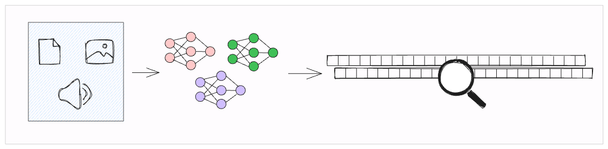
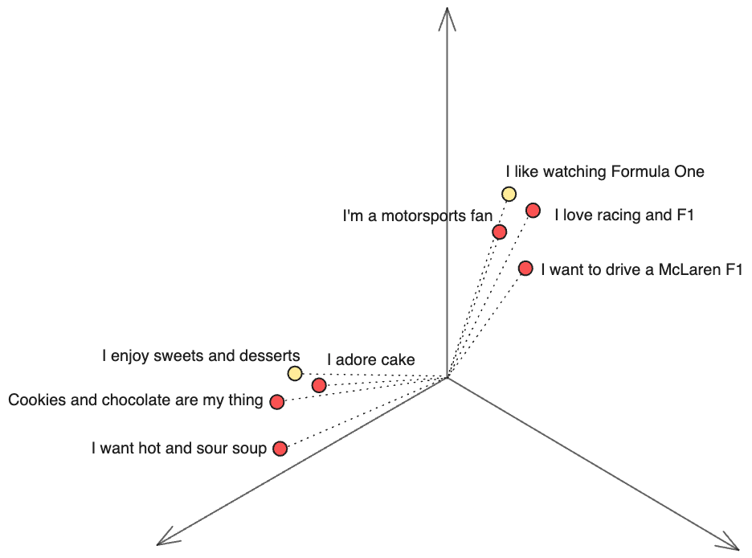
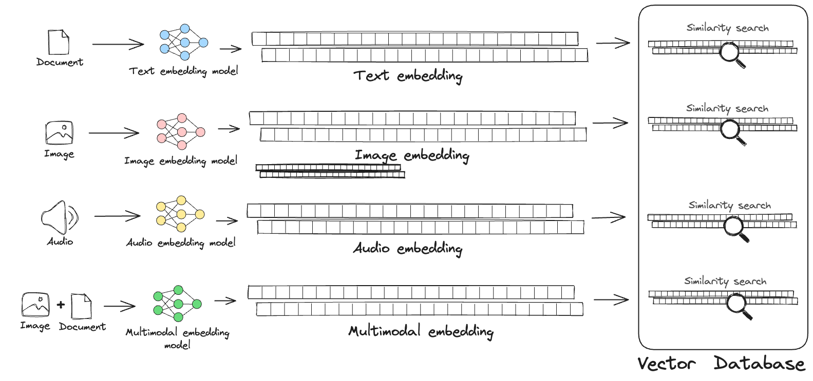
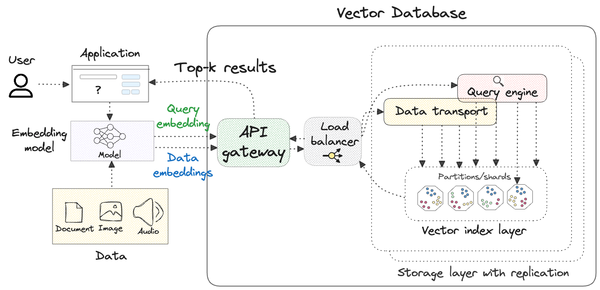

<!-- What is vector search, and how can vector databases help? -->

# Vector Search



## The exponential growth of data

It's no secret that most organizations worldwide are experiencing an exponential growth in the amount of data they generate and store. In 2021, there [already existed](https://firstsiteguide.com/big-data-stats/) around 79 zettabytes (1 terabyte = 1 billion terabytes) of structured and unstructured data globally. By 2027, that total, according to the [IDC](https://www.idc.com/getdoc.jsp?containerId=US50397723), is expected to grow to well over 175 zettabytes (175 billion terabytes). 🤯

Modern machine learning models (e.g., transformers) have made it possible to derive insights<!-- too general; for example? --> from unstructured data, but we must not forget the fact that the majority of the world's data is structured, and that the two forms of data are not mutually exclusive<!--why must we not forget this? why does this matter?-->. In fact, often the most interesting insights<!--too general; for example?--> are derived from combining structured and unstructured data.

Vector search is a powerful method to search and retrieve information <!--both "insights" and "information" are uninformative; what value can your readers; what's the payoff of learning more about this topic?--> from *both* structured and unstructured data at scale.
<!--this last sentence is your main point, not that there's a lot of data out there; in the first paragraph, you need to indicate how this amount of data matters...what opportunity/problem does it pose? what does it make possible? and then indicate that you need a way of taking advantage of that opportunity; then vector search to the rescue!)-->

## The early days of search

Search systems that can retrieve information from unstructured text data have been around since the [1970s](https://en.wikipedia.org/wiki/IBM_STAIRS). In the early days of the web, keyword-based search engine libraries like Lucene began using inverted indexes to improve search relevance and speed when querying large collections of data. Inverted indexes are data structures that map keyword frequencies relative to the documents in which they appear. Because these methods search on the entire collection of texts at once, they're referred to as *full-text* search.

The limitation of full-text search is that it retrieves only those results that have an at least partial match with keywords in the query. Although techniques like phrase search, proximity search, or fuzzy search can be used to improve relevance, they're still not very effective when the user query consists of synonyms or semantically similar terms. For example, a search for "car" will not return documents that contain the word "automobile."<!--what will it return instead? i.e., illustrate with a phrase / proximity / fuzzy but not semantically similar match-->

Another limitation of full-text search is that it can't handle structured data (tabular data), non-textual data (images or audio) or multimodal data (images or audio with descriptions). For example, a user searching for a product on an e-commerce website or music app may want to find similar items based on their image/audio source and descriptions. Simply searching for keywords in the description may not yield relevant results. Another example is querying one's email history to retrieve information on past flight bookings -- this involves a combination of text, numbers, and dates, and requires a more sophisticated search system than one that simply matches on keywords.

## Introducing vector search

Vector search leverages machine learning models to consider the semantics (i.e., the meaning) of the underlying data when performing search. This is done by converting the data into a numerical representation, termed a *vector*.

In computer science, a vector is a one-dimensional array of numbers (typically floating point numbers).

```py
example_4d_vector = [0.1234, 0.3035, 0.9876]
```

The length of a vector is called its *dimensionality*, and in the context of machine learning, high-dimensional vectors play a critical role in representing data in a way that computers can better interpret<!--be more specific if possible; "better interpet" to achieve what?-->. The example above shows a 3-D vector, but the vectors used in machine learning typically have hundreds (or thousands) of dimensions.<!--how is dimensionality or the extent of dimensionality relevant here? How dimensionality relate to semantic meaning?-->

Vectors are generated by passing data through the layers of a trained neural network. For example, a transformer-based model like [SentenceBERT](https://www.sbert.net/docs/pretrained_models.html) can be used to convert a sentence/document into a numerical representation of the semantic meaning of that sentence in vector space.

A toy example in 3-D space is shown below. Vectors for semantically similar sentences or concepts are closer together (less distant) than those that represent dissimilar sentences or concepts.



<!--how does dimensionality above relate to multimodality below?-->
The power of vectors resides in their multimodal nature -- they can just as well represent images or audio clips as they can text, depending on the model used to generate them. This makes them a powerful tool for building search systems that can handle multimodal data.<!--Doesn't the power of vectors reside in more than their ability to vectorize multimodal data? What about their general ability to measure relevance? For example, if my database is only text, aren't vectors still powerful?-->

:::hint{style="info"}
The terms *vector* and *embedding* are often used interchangeably, or sometimes even together, as *vector embedding*. In the context of vector search, they all mean the same thing.
:::

### Distance metrics

The *degree* of similarity between one vector and another is quantified using distance metrics. A few commonly used distance metrics are:

* Euclidean (L2) distance
* Dot product similarity
* Cosine similarity

Cosine similarity, for example, considers the angle between two vectors, and represents this angle as a value between 0 and 1. Vectors that are very dissimilar are orthogonal to each other in vector space, with a cosine similarity of zero. On the other hand, vectors that are very similar to one another have a cosine similarity close to 1. Vectors that are identical to (that is, the same as) one another have value of 1.

## Vector search for unstructured data

Vector (semantic) search distinguishes itself from keyword (lexical) search by being able to return relevant results *even when the exact terms of the query are not present in the searched data*.<!--your original "exact terms are not present in the query" repeats the disconnection of multimodality from relevance above; instead, I think you are trying to explain that with vector search the query needs only be semantically similar *to the searched data* to return relevant results; this is the power of vectorization - it puts data *of even different modalities* in *the same* vector space)--> Because of the general-purpose nature of vector embeddings, they can be used to represent almost any form of data, from unstructured data like text, images, and audio. Additionally, multimodal embedding models like [CLIP](https://github.com/openai/CLIP) can generate a single embedding that simultaneously captures the semantics of multiple forms of data, such as images and their descriptions.





### Context length for text embedding models
<!--how does this relate to the preceding and following paragraphs? what consequences does this have for query results?-->
When vectorizing unstructured text data, it's important to bear in mind that embedding models have a maximum context length, which is the maximum token sequence length that can be embedded into a single vector. For many open-source embedding models, this is in the range of 384 to 1024 tokens (in [English](https://help.openai.com/en/articles/4936856-what-are-tokens-and-how-to-count-them), 100 tokens equal roughly 75 words).

Using an embedding model on long-form texts of the order of thousands of words would mean that the entire text cannot be embedded into a single vector, and would need to be split into smaller chunks, or require a windowing approach to capture the entire document in a single vector. Libraries like [LangChain](https://github.com/langchain-ai/langchain) and [LlamaIndex](https://github.com/jerryjliu/llama_index) can help with this.

## Vector search for structured data

A common misconception of vector search is that it's applicable only to unstructured data. This is not true! Vector embeddings have *always* been at the heart of deep learning models, and this section will highlight how structured data can be leveraged to gain new insights into existing data<!--what's the relationship between structured data and existing data in this sentence?-->.

### Tabular data

Tabular data is typically stored in a relational database, or "data lake," and can be a powerful source of data for supervised learning systems. Neural networks that use gradient-based optimization have emerged as powerful<!--overuse of adjective "powerful"--> tools to map numerical features, commonly seen in tabular data, to higher-dimensional vector representations.

Historically, gradient-boosted decision trees have outperformed baseline neural networks on tabular data, but [recent research](https://arxiv.org/abs/2203.05556) shows that traditional MLP-like (Multilayer Perceptron) models, when equipped with embeddings from numerical features<!--can you be more precise re what you mean by "equipped with embeddings from numerical features;" numerical features of what? embeddings are added to MLP-like models, are the target search data of MLP-like models, or...? do you mean the tabular data are vectorized?-->, can perform on par with computationally-heavy transformers on tabular data. Transforming tabular data into vector embeddings can leverage features<!--possible to be more specific? what's the value add?--> of the underlying data in a more meaningful way<!--more specificity possible?-->, allowing you to build better recommendation algorithms and fraud-detection systems.

### Time series
<!--as in the discussion of multimodality and relevancy above, you need to state up front 1) the problem/s that vector search methods solve, and 2) the solution that vector search provides - in this order-->
Time series analysis is a useful tool for tasks like anomaly detection, where, historically, distance-based techniques like kNN (k-Nearest Neighbors) are popular because they are unsupervised. However, kNN suffers from the "curse of dimensionality" as the datasets become large because it needs to exhaustively compare distances vs. all other points<!--compare distances between *what* and all other points--> in the dataset to detect outliers. To deal with this limitation, autoencoders have historically been used to reduce the dimensionality of time series data.<!--explain the limitations introduced by reducing dimensionality here before going on-->

Although there have been claims in [recent work](https://arxiv.org/abs/2205.13504) that transformers are not as effective<!--can you be more specific?--> as specialized linear models, at least for univariate time series<!--does this qualification apply to the preceding or the following statement? not clear-->, [further work](https://huggingface.co/blog/autoformer) by Hugging Face has shown that the embeddings learned in transformers are richer than linear models over<!--not clear what "over" means here--> covariate features. This means that the embeddings extracted from a time series transformer have the potential to describe and detect anomalies in time series data more effectively<!--is it possible to be more specific? what is the effect referred to here? can you indicate what you mean by "richer" above?--> than traditional methods.

### Knowledge graphs

Graphs are connected data structures that can be used to represent the relationships between entities, and can be used to build a host of powerful applications that require access to factual information, such as recommender systems and question-answering engines. Just like NLP models can be used to generate vector embeddings for text, graph neural networks can be used to generate embeddings for the entities (nodes/edges) in a knowledge graph. [node2vec](https://arxiv.org/abs/1607.00653) and [GraphSAGE](https://arxiv.org/abs/1706.02216) are two popular methods to extract node embeddings from feature information and the overall graph structure.

Nodes that are similar to one another in the graph are closer to one another in the node embedding space. This means that these embeddings can be used to perform similarity search on the graph, and can be used to answer questions like "what nodes are most similar to this one?" or "what additional nodes might be linked to this one?" When combined with faster ways to store and query these vectors (such as those offered by vector databases), graph embeddings can be used to build powerful applications that consider both the semantics *and* structure of the underlying data.

## What is a vector database?
<!--this seems out of context, unless the objective is a glossary of terms-->
A vector database is a purpose-built system designed to store and perform semantic search at scale. The raw search is performed by comparing the query vector with the vectors stored in the database, and returning the top-k most similar ones.

The figure below shows the key underlying components of a vector DB -- not all DB vendors may represent their internals this way, but the same principles generally apply.



### Vector databases vs. vector search libraries

What *makes* a vector DB? Why can't we just use a regular database and store vectors natively as arrays<!--if you mean to indicate that this is what you mean by vector search library, you should say so explicitly-->? The answer lies in the underlying data structures, indexing algorithms, and other key features that enable vector DBs to perform similarity search at scale:
<!--the following points should be grammatically identical; either complete sentences like the first, or feature descriptions like the rest-->
- A vector index allows fast and efficient retrieval of similar vectors
- A query engine that performs optimized similarity computations on the index
- Partitioning/sharding to enable horizontal scaling
- Replication and other reliability features
- An accessible API that allows for efficient vector CRUD operations

It's for these reasons that well-known open-source projects like [FAISS](https://github.com/facebookresearch/faiss), [ScaNN](https://github.com/google-research/google-research/tree/master/scann) and [Hnswlib](https://github.com/nmslib/hnswlib) are **not** categorized as vector DBs -- they are vector search *libraries* that offer only a portion<!--if you're differentiating key enabling features of vector DBs, you should indicate which of the above features is missing for vector libraries; "a portion" is vague compared to the list of five vector DB features above--> of the capabilities required to build production-grade solutions.
 
## Breakdown of the vector DB landscape

Broadly speaking, vector DBs can be broken down into three categories:

- **Vector-native**: Purpose-built DBs that optimize for vector search while making vector embeddings first-class citizens
- **Hybrid**: Existing DBs that have added vector search capabilities
- **Search engines**: Systems that natively support search and relevance ranking on unstructured data via an underlying index

Although there is a strong overlap in capabilities across these categories, search engines are kept in their own category because they're typically not used as the primary database or for storing raw data. They're often used to index data that's already present in other databases or data lakes.

::::tabs
:::tab{title="Vector-native DBs"}
| Name | Built in | Open-source | Managed cloud | Self-hosting |
| ---------- | :-: | :-: | :-: | :-: |
| Weaviate | Go | ✅ | ✅ | ✅ |
| Qdrant | Rust | ✅ | ✅ | ✅ |
| Milvus | Go | ✅ | ✅ | ✅ |
| Zilliz | Go | ❌ | ✅ | ❌ |
| Chroma | C++ | ✅ | Upcoming | ✅ |
| LanceDB | Rust | ✅ | Upcoming | ✅ |
| Deeplake | C++ | ✅ | ❌ | ✅ |
| Pinecone | Rust | ❌ | ✅ | ❌ |
| MyScale | C++ | ❌ | ✅ | ❌ |
| AstraDB | Java | ❌ | ✅ | ❌ |
:::

:::tab{title="Hybrid DBs"}
| Name | Built in | Open-source | Managed cloud | Self-hosting |
| ---------- | :-: | :-: | :-: | :-: |
| Redis | C | ✅ | ✅ | ✅ |
| Postgres (pgvector) | C++ | ✅ | ❌ | ✅ |
| MongoDB | C++ | ✅ | ✅ | ❌ |
| ClickHouse | C++ | ✅ | ✅ | ✅ |
| Neo4j | Java | ✅ | ✅ | ✅ |
:::

:::tab{title="Search engines"}
| Name | Built in | Open-source | Managed cloud | Self-hosting |
| ---------- | :-: | :-: | :-: | :-: |
| Vespa | C++ | ✅ | ✅ | ✅ |
| Vald | Go | ✅ | ✅ | ✅ |
| ElasticSearch | Java | ❌ | ✅ | ✅ |
| OpenSearch | Java | ❌ | ✅ | ❌ |
| Meilisearch | Rust | ✅ | ✅ | ✅ |
| Typesense | C++ | ✅ | ✅ | ✅ |
:::
::::

There is some debate on the distinction between a search engine and a vector DB, but in general, a lot of these tools offer variations of the same functionality -- the ability to store and query vectors at scale.

## Additional considerations

When designing a vector search system with cost, latency and quality in mind, aside from the choice of underlying database, it's important to keep the following points in mind.

### Relevance ranking

To improve search relevance when an exact match between keywords in the query and the results are required, several vector DBs and search engines offer hybrid search options that combine top-k scores from keyword and vector search. Research from [Google](https://arxiv.org/abs/2201.10582) shows that using Reciprocal Rank Fusion (RRF) to re-rank search results using a combination of keyword and vector search can improve search relevance by up to 20%.

A more sophisticated method to improve relevance exist, such as re-ranking via [cross-encoders](https://www.sbert.net/examples/applications/cross-encoder/README.html). This approach uses a transformer-based model downstream of the vector DB that generates new scores for the top-k results returned by the DB. This approach is more computationally expensive, but can yield better results than RRF, at the expense of latency and added system complexity.

### Fine-tuning embedding models to address bias

Existing open source embedding models, whether in the image or text domain, can be biased towards certain concepts, or simply not model the distribution of unseen test data once their training is complete. For example, a model trained on a dataset of images of people may be biased towards certain skin tones, or a model trained on a dataset of text may be biased towards certain topics, which depends on the distribution of the training data. Additionally, embeddings from a model trained on a dataset of text from the web may not generalize well to text from a different domain, such as medical or legal text.

In cases like where the semantics of the underlying domain are really important, it may be necessary to fine-tune the embedding model prior to using them to encode data for vector search. Many open source frameworks like [Hugging Face](https://huggingface.co/blog/how-to-train-sentence-transformers#how-to-train-or-fine-tune-a-sentence-transformer-model), enable this.

## Conclusions

Building a production-grade search and retrieval solution requires specialized components, including embedding models, vector databases and re-ranking modules. There are a lot of conflicting viewpoints out there on how to effectively combine these tools for real use cases. Hopefully, reading this post has made you excited to learn more about vector search for innovative use cases on *all* kinds of data in your organization.

---
## Contributors

- [Prashanth Rao](https://twitter.com/tech_optimist)
