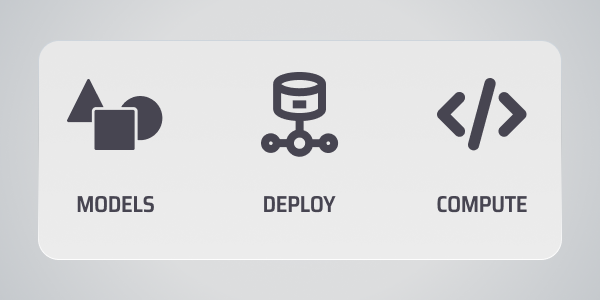
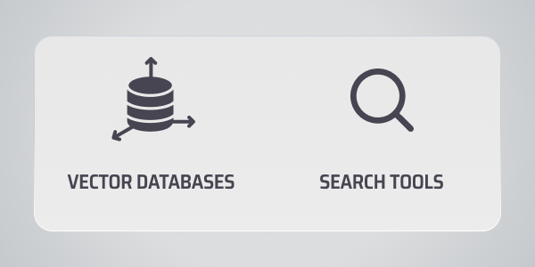

# Let's learn about Vectors!

VectorHub is a free and open-sourced learning hub for people interested in adding vector retrieval to their ML stack. On VectorHub you will find practical resources to help you -

* Create MVPs with easy-to-follow learning materials
* Solve use-case specific challenges in vector retrieval
* Get confident in taking their MVPs to production
* Learn about different tools and vendors for their use-case

Read more about our philosophy in our [Manifesto](manifesto.md).

## Building Blocks

::::link-array
:::link-array-item{headerType="IMAGE" headerImage=}
[**1. Data Sources**](building_blocks/data_sources/readme.md)

Connecting and extracting data from multiple sources
:::

:::link-array-item{headerType="IMAGE" headerImage=}
[**2. Vector Compute**](building_blocks/vector_compute/readme.md)

Turn your data into vector by running pipelines and models
:::

:::link-array-item{headerType="IMAGE" headerImage=}
[**3. Vector Search**](building_blocks/vector_search/readme.md)

Query and retrieve vectors for your use -case
:::
::::

***

## Vector retrieval use-cases

::::link-array
:::link-array-item{headerImage headerColor}
[Personalized Search](use_cases/personalized_search.md)
:::

:::link-array-item{headerImage headerColor}
[Recommender Systems](use_cases/recommender_systems.md)
:::

:::link-array-item{headerImage headerColor}
[Retrieval Augmented Generation](use_cases/retrieval_augmented_generation.md)
:::

:::link-array-item{headerImage headerColor}
[Fraud & Safety](use_cases/fraud_&_safety.md)
:::

:::link-array-item{headerImage headerColor}
[Clustering & Anomaly Detection](use_cases/clustering_&_anomaly_detection.md)
:::

:::link-array-item{headerImage headerColor}
[Cybersecurity](use_cases/cybersecurity.md)
:::
::::

***

## Toolbox

Toolbox is a collection of benchmarks, code snippets, summaries & tricks that aid in deciding on what's best for you. These are the tools that we and our community use frequently. We curate them based on your input. Feel free to share some tools that you use often or have created recently that will help the community. You can do that by creating an issue [here](https://github.com/superlinked/VectorHub/issues/new).

::::link-array
:::link-array-item{headerImage headerColor}
[Tools](tools/readme.md)
:::
::::

***

:::hint{type="info"}
VectorHub is a free and open-sourced learning hub that is sponsored and curated by Superlinked. We enourage you to contribute and make a suggestion on our GitHub.
:::
