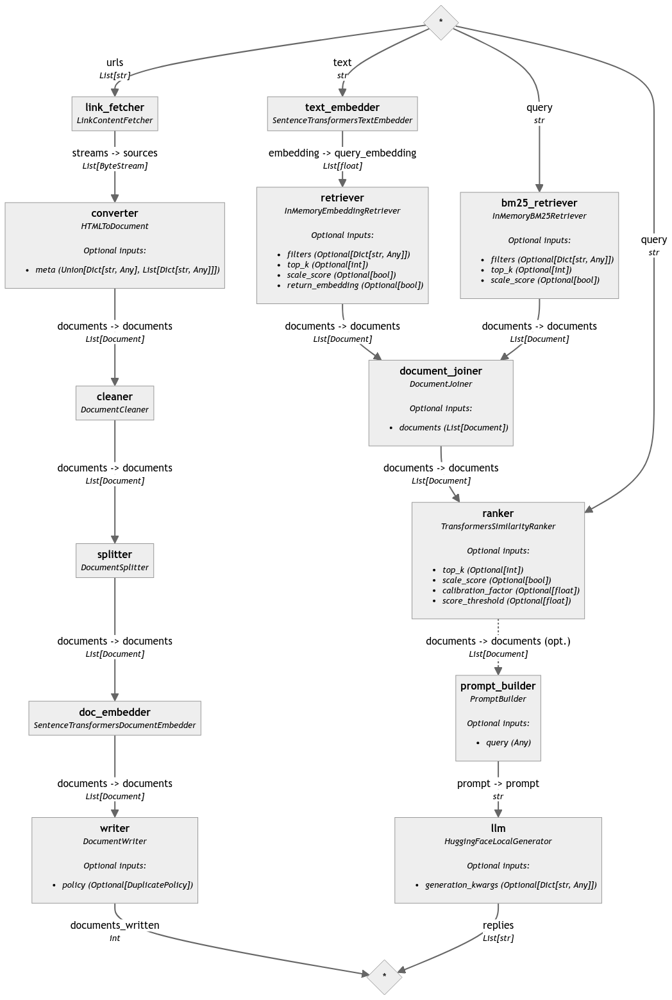

<!-- SEO SUMMARY: This comprehensive tutorial explores the intricacies of Advanced Retrieval-Augmented Generation (RAG) systems, demonstrating their capacity to enhance natural language processing tasks by integrating retrieval-based techniques with generative AI models. The article covers essential components such as document cleaning, chunking, embedding, and the strategic assembly of pipelines for efficient data processing and generation. By emphasizing the importance of fine-tuning, post-retrieval optimizations, and the dynamic assembly of components, it offers insights into creating high-quality, contextually relevant text outputs. This guide is targeted at developers looking to leverage the full potential of RAG techniques, ensuring effectiveness in real-world applications. -->

# Advanced Retrieval-augmented Generation (RAG)

## Advanced RAG and why we need it
Retrieval-Augmented Generation (RAG) is a technique that aims to improve the quality and effectiveness of language models by augmenting them with retrieved information from external sources. Recently, the [terminology](https://arxiv.org/abs/2312.10997) of naive RAG and advanced RAG has evolved to distinguish between different levels of technological maturity. In case you're not familiar with RAG yet, I would recommend to first read my [introduction to RAG](https://superlinked.com/vectorhub/retrieval-augmented-generation).

Basic RAG, or naive RAG, refers to the minimal RAG pipeline that consists of retrieval and generation. This naive approach often suffers from issues such as low retrieval precision, hallucination in generated responses, and challenges in effectively integrating retrieved context into the generated output. 

Advanced RAG addresses the limitations of naive RAG by introducing targeted enhancements to overcome these drawbacks. It employs pre-retrieval and post-retrieval strategies, refined indexing approaches, and optimized retrieval processes to improve the quality and relevance of the retrieved information. By addressing the challenges in retrieval, generation, and augmentation, advanced RAG enables language models to generate more accurate, comprehensive, and coherent responses. This is crucial for applications that require reliable and informative generated content, such as question answering systems, chatbots, and content creation tools.

### Overview
In this tutorial, we will cover the following components, including code examples:

1. Pre-retrieval 
- Document cleaning
- Chunking
- Document embeddings
- Indexing
2. Retrieval
- Hybrid search
3. Post-retrieval
- Reranking

### Set up

Before we start diving into advanced RAG and pre-retrieval, let's set up everything we will need for this tutorial. Note that if you're on Windows, you might run into trouble setting up [bitsandbytes](https://github.com/TimDettmers/bitsandbytes), as there is no Windows support yet.

```bash
pip install haystack-ai sentence-transformers accelerate -i <https://pypi.org/simple/> bitsandbytes
```

We will build a [Haystack](https://docs.haystack.deepset.ai/docs/intro) pipeline using open source embeddings and models from Huggingface. Additionally, "accelerate" and "bitsandbytes" libraries will be necessary for loading our generative large language model (LLM) in 4 bit. This will enable us to run our pipeline in an efficient way - in fact, this tutorial is optimized to work within free [Google Colab](https://colab.research.google.com/) GPU environments.

As for the data, we will fetch information from Vector Hub articles and convert the html files to documents.

```python
from haystack.components.fetchers import LinkContentFetcher
from haystack.components.converters import HTMLToDocument

link_fetcher = LinkContentFetcher()
converter = HTMLToDocument()
```
One great thing about Haystack is that it offers a wide selection of pipeline components, including the LinkContentFetcher and HTMLToDocument modules, which are exactly what we need. Typically, components in Haystack are first defined, then added to a pipeline. We can build and configure our pipeline with these building blocks and they will all be executed once the pipeline is run. If we wanted to run our components individually, we could do that like this:

```python
# What would be better than fetching Vector Hub texts in a tutorial on Vector Hub?
fetched = link_fetcher.run(urls=["<https://superlinked.com/vectorhub/>"])
converted = converter.run(sources=fetched["streams"])
```
However, this is not advised outside of development, as pipelines offer a cleaner, more streamlined interface for executing our code.

## Pre-retrieval

### Document cleaning
Data is the lifeblood of any Machine Learning (ML) model, and its quality directly impacts the performance of RAG systems. Cleaning involves removing noise such as irrelevant information, correcting typos, and standardizing formats to ensure the data is optimized for machine processing. Clean data not only improves the efficiency of retrieval and generation but also significantly enhances the quality of the generated text.

For this tutorial, we will be using a simple document cleaner that removes empty lines and extra whitespaces. If we would be working with messier data, could remove repeated substrings, such as html tags or even write custom scripts to standardize words and correct typos. Your cleaning routine will depend heavily on your specific use case and goals.

```python
from haystack.components.preprocessors import DocumentCleaner

cleaner = DocumentCleaner(
	remove_empty_lines=True,
	remove_extra_whitespaces=True,
	remove_repeated_substrings=False)
```

### Chunking
Chunking refers to the process of breaking down large pieces of text into more manageable, logically coherent units. This step is crucial for efficient retrieval, as it enables the system to focus on the most relevant segments of text when generating responses. Effective chunking strategies can dramatically improve the relevance and cohesion of the generated content.

```python
from haystack.components.preprocessors import DocumentSplitter

splitter = DocumentSplitter(split_by="sentence", split_length=3, split_overlap=2)
```

In this setup, we chose "sentence" for `split_by`, a choice driven to maintain granular control over the chunking process. The `split_length` is set to 3 sentences to ensure each chunk is sufficiently detailed yet concise, while a `split_overlap` of 2 sentences helps maintain context continuity between adjacent chunks. There exists no golden rule for these hyperparameters, I would advise that you try out different configurations based on the structure and type of your documents. For a thorough evaluation of chunking methods, check out this [article](https://superlinked.com/vectorhub/an-evaluation-of-rag-retrieval-chunking-methods).

### Document embeddings
Embeddings are a central component of the pre-processing stage, serving as the bridge between raw text data and the sophisticated algorithms that drive RAG systems, typically Large Language Models (LLMs). By converting words into numerical vectors, embeddings capture the semantic relationships between different terms, enabling models to understand context and generate relevant responses. Selecting the right embeddings and models is critical for achieving high-quality retrieval and generation, laying the groundwork for RAG's success.

We will be using the `SentenceTransformersDocumentEbedder`, which is a sentence embedding model. This means that instead of only looking at individual words in isolation, the model considers the full context of sentences or even larger text snippets to generate embeddings. This approach allows for a deeper understanding of the text, capturing nuances and meanings that might be lost in word-level embeddings.

```python
from haystack.components.embedders import SentenceTransformersDocumentEmbedder

doc_embedder = SentenceTransformersDocumentEmbedder("BAAI/bge-small-en-v1.5")
doc_embedder.warm_up()
```

The model we are using, "BAAI/bge-small-en-v1.5", has been selected based on its performance in recent evaluations, striking a balance between retrieval accuracy and computational efficiency. For more information, see Huggingface [MTEB leaderboard](https://huggingface.co/spaces/mteb/leaderboard). Before you use another model with this class, make sure that it's [compatible](https://docs.haystack.deepset.ai/docs/sentencetransformersdocumentembedder#compatible-models) with sentence embeddings first.

### Indexing
To facilitate swift and accurate retrieval of information, indexing organizes the pre-processed data in a structured format that can be quickly accessed by the RAG system. This step involves creating an optimized database of chunks, where each piece of information is tagged and categorized for easy retrieval.

Before we can index, we need to create a database that we will write our documents and document embeddings to. For this tutorial, we will use a simple `InMemoryDocumentStore`. You can easily replace it with the database you are using, as long as it is [supported by Haystack](https://docs.haystack.deepset.ai/docs/inmemorydocumentstore).

```python
from haystack.document_stores.in_memory import InMemoryDocumentStore
from haystack.components.writers import DocumentWriter

document_store = InMemoryDocumentStore()
writer = DocumentWriter(document_store=document_store)
```

## Retrieval
Since we use an in-memory database, we import the in-memory retriever. To query our vector database, we need to encode the query texts with the same embedding model used for our document embeddings. The only difference is that for simple text queries, we will be using the `SentenceTransformersTextEmbedder` instead of the document version.

```python
from haystack.components.retrievers.in_memory import InMemoryEmbeddingRetriever
from haystack.components.embedders import SentenceTransformersTextEmbedder

retriever = InMemoryEmbeddingRetriever(document_store=document_store)

text_embedder = SentenceTransformersTextEmbedder("BAAI/bge-small-en-v1.5")
text_embedder.warm_up()
```

### Hybrid Search

Another way to enhance retrieval accuracy is through [hybrid search](https://superlinked.com/vectorhub/optimizing-rag-with-hybrid-search-and-reranking) techniques. Traditional keyword search, such as BM25, has its merits in certain contexts due to its high precision. Hybrid search is not a direct Haystack component but can be implemented by querying with both retrievers and merging results in your pipeline.

```python
from haystack.components.retrievers.in_memory import InMemoryBM25Retriever
from haystack.components.joiners import DocumentJoiner

bm25_retriever = InMemoryBM25Retriever(document_store)
# DocumentJoiner will be used for merging and averaging the two retriever outputs
document_joiner = DocumentJoiner()
```

This approach allows for a more nuanced retrieval process, capturing both the semantic richness of embeddings and the direct match precision of keyword search, leading to improved relevance in retrieved documents.

## Post-retrieval
Reranking can be a critical step that reassesses the initial set of retrieved documents to refine the selection based on relevance and context. This process often employs more sophisticated or computationally intensive methods that were impractical for the initial retrieval due to the larger dataset. For this reason, you should always evaluate the performance of your system on **your data** with *and* without reranking to not add unnecessary latency and cost. 

```python
from haystack.components.rankers import TransformersSimilarityRanker

ranker = TransformersSimilarityRanker(model="BAAI/bge-reranker-base")
```

## Generation

The generation phase in the pipeline is where the prepared context will be integrated into a prompt to produce the final output. This is achieved by using a large language model (LLM) to generate answers based on the context provided by the previous components of the pipeline. The preparation for this phase involves setting up a prompt builder to format the input in a way that's optimized for the LLM to understand and respond to.

```python
from haystack.components.builders import PromptBuilder

template = """<|system|>Using the information contained in the context, 
give a comprehensive answer to the question.
If the answer cannot be deduced from the context, do not give an answer.</s>
<|user|>
Context:
  
  {{ doc.content }}
  ;
  Question: {{query}}
  </s>
<|assistant|>
"""

prompt_builder = PromptBuilder(template=template)
```

For our generator, we will be using Zephyr-7b-beta, which is a popular fine-tuned model based on [Mistral 7B](https://huggingface.co/mistralai/Mistral-7B-v0.1). It's a comparatively small yet performant choice. The model settings include various optimizations to improve efficiency and performance, such as loading the model in 4-bit quantization to save memory and processing power.

```python
import torch
from haystack.components.generators import HuggingFaceLocalGenerator

generator = HuggingFaceLocalGenerator("HuggingFaceH4/zephyr-7b-beta",
                                      huggingface_pipeline_kwargs={"device_map":"auto",
                                                       "model_kwargs":{"load_in_4bit":True,
                                                                       "bnb_4bit_use_double_quant":True,
                                                                       "bnb_4bit_quant_type":"nf4",
                                                                       "bnb_4bit_compute_dtype":torch.bfloat16}},
                                      generation_kwargs={"max_new_tokens": 350}
                                      )
generator.warm_up()
```

### Assembling the Pipeline

Now that we have defined all necessary components, we can assemble our pipeline. To review, this includes components for fetching links, converting formats, cleaning and splitting text, embedding documents and queries, retrieving relevant documents, reranking them, building prompts, and finally generating the answer.

```python
from haystack import Pipeline

rag = Pipeline()

rag.add_component("link_fetcher", link_fetcher)
rag.add_component("converter", converter)
rag.add_component("cleaner", cleaner)
rag.add_component("splitter", splitter)
rag.add_component("doc_embedder", doc_embedder)
rag.add_component("writer", writer)
rag.add_component("text_embedder", text_embedder)
rag.add_component("retriever", retriever)
rag.add_component("bm25_retriever", bm25_retriever)
rag.add_component("document_joiner", document_joiner)
rag.add_component("ranker", ranker)
rag.add_component("prompt_builder", prompt_builder)
rag.add_component("llm", generator)

rag.connect("link_fetcher",  "converter")
rag.connect("converter",  "cleaner")
rag.connect("cleaner",  "splitter")
rag.connect("splitter",  "doc_embedder")
rag.connect("doc_embedder",  "writer")
rag.connect("text_embedder.embedding",  "retriever.query_embedding")
rag.connect("bm25_retriever",  "document_joiner")
rag.connect("retriever",  "document_joiner")
rag.connect("document_joiner",  "ranker")
rag.connect("ranker.documents",  "prompt_builder.documents")
rag.connect("prompt_builder.prompt",  "llm.prompt")
```

The cherry on top is the `.draw` feature that let's us visualize the pipeline, illustrating how each component is connected and the flow of data through the pipeline. This is helpful for debugging and understanding the overall structure.

```python
rag.draw("rag.png")
```

As you can see, this creates an image file that maps out all the components and their connections, offering a clear overview of the entire pipeline process.



That's a lot of components! Let's write a query and try it out. We will be asking questions about my previous tutorials on Vector Hub: [An introduction to RAG](https://superlinked.com/vectorhub/retrieval-augmented-generation) and [scaling RAG for production with Ray](https://superlinked.com/vectorhub/scaling-rag-for-production).

```python
query = "Based on these articles, what are the dangers of hallucination?"

results = rag.run({
	"link_fetcher":  {"urls": 
		["https://superlinked.com/vectorhub/retrieval-augmented-generation", 
		"https://superlinked.com/vectorhub/scaling-rag-for-production"]},
	"text_embedder":  {"text": query},
	"bm25_retriever":  {"query": query},
	"ranker":  {"query": query},
	"prompt_builder":  {"query": query}
	}
)

answer = results["llm"]["replies"][0]
```

Finally! Let's take a look at our answer:

"Hallucinations in generative models, specifically in LLMs (Large Language Models), can be dangerous as they create false or inaccurate pieces of information, also known as machine hallucinations. These hallucinations can have disastrous consequences in customer support and content creation, as they can lead to incorrect information being generated. In industry settings, hallucinations can
be a major blocker and concern for the adoption of Generative AI and LLMs, as they can result in incorrect or misleading information being presented to users. This was demonstrated in February 2023 when Google's Chatbot presented made-up information, resulting in a 7% fall in Alphabet's stock price. Therefore, it's crucial to balance retrieval and generation in LLMs to prevent hallucinations and ensure the accuracy and reliability of the information generated."

Keep in mind that this is not a fully deterministic process, so if you will be running this code yourself, you might receive a slightly different answer.

## Conclusion
In this tutorial, we've covered several critical aspects of setting up an advanced RAG system using the Haystack library:

-   **Document Cleaning and Preparation:** Ensuring the data is in the right format and free of noise for optimal processing.
-   **Chunking and Embedding:** Breaking down the text into manageable pieces and converting them into numerical vectors to capture semantic meanings.
-   **Retrieval:** Finding the most relevant documents based on the query.
-   **Prompt Building and Generation:** Crafting a prompt that guides the language model to generate a relevant and accurate answer.
-   **Pipeline Assembly:** Bringing together various components into a cohesive pipeline that processes queries end-to-end.
-   **Visualization and Execution:** Visualizing the pipeline for a clear overview and running it to obtain answers to specific queries.

The ability to tweak each component and the flexibility to incorporate different models and strategies at various stages of the pipeline allows for a highly customizable and powerful system capable of tackling a wide range of tasks, from answering questions to generating content based on complex criteria.

This exploration into RAG systems highlights the ongoing advancements in NLP and AI, offering a glimpse into how these technologies are being used to process and understand human language more effectively than ever before. As we continue to refine these systems, we can expect even more sophisticated and nuanced interactions between humans and machines, opening up new possibilities for information retrieval, content generation, and beyond.

---
## Contributors

- [Pascal Biese, author](https://www.linkedin.com/in/pascalbiese/)