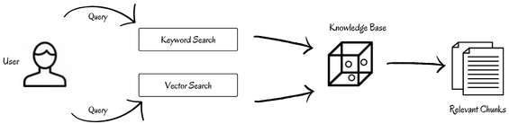
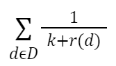
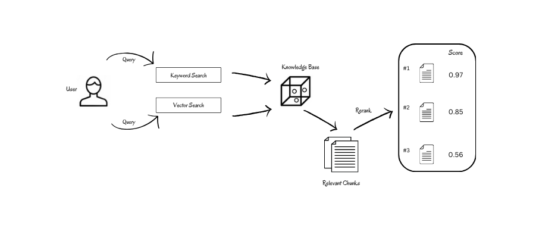

<!-- SEO: Retrieval-Augmented Generation (RAG) is revolutionizing traditional search engines and AI methodologies for information retrieval. However, standard RAG systems often lack efficiency and precision when dealing with extensive data repositories. Substituting the search approach with a hybrid method and reordering the outcomes using a semantic ranker considerably enhances performance, indicating potential for large-scale implementations.
-->

# Optimizing RAG with Hybrid Search & Reranking

Retrieval-Augmented Generation (RAG) is revolutionizing traditional search engines and AI methodologies for information retrieval. However, standard RAG systems employing simple semantic search often lack efficiency and precision when dealing with extensive data repositories. Hybrid search, on the other hand, combines the strengths of different search methods, unlocking new levels of efficiency and accuracy. Hybrid search is flexible and can be adapted to tackle a wider range of information needs. 

Hybrid search can also be paired with semantic reranking (to reorder outcomes) to further enhance performance. Combining hybrid search with reranking holds immense potential for various applications, including natural language processing tasks like question answering and text summarization, even for implementation at a large-scale.

In our article, we'll delve deeply into the nuances of hybrid search and reranking, exploring how this potent combo can enhance the retrieval component in **[RAG (Retrieval Augmented Generation)](https://hub.superlinked.com/retrieval-augmented-generation)**, and thereby deliver impactful and insightful text generation across various domains.


## What is Hybrid Search?

In current Retrieval-Augmented Generation (RAG) systems, word embeddings are used to represent data in the vector database, and vector similarity search is commonly used for searching through them. For LLMs and RAG systems, embeddings - because they capture semantic relationships between words - are generally preferred over keyword-based representations like Bag-of-words (BoW) approaches. 

But each of vector similarity search and keyword search has its own strengths and weaknesses. Vector similarity search is good, for example, at dealing with queries that contain typos, which usually don’t change the overall intent of the sentence. However, vector similarity search is not as good at precise matching on keywords, abbreviations, and names, which can get lost in vector embeddings along with the surrounding words. Here, keyword search performs better.

That being said, keyword search is not as good as vector similarity search at fetching relevant results based on semantic relationships or meaning, which are only available via word embeddings. For example, a keyword search will relate the words *“the river bank”* and *“the Bank of America”* even though there is no actual semantic connection between the terms - a difference to which vector similarity search is sensitive. Keyword search would, therefore, benefit from vector search, but the prevailing approach is not to combine them but rather to implement them separately using distinct methodologies.

In hybrid search - a keyword-sensitive semantic search approach, we combine vector search and keyword search algorithms to [take advantage of their respective strengths while mitigating their respective limitations](https://techcommunity.microsoft.com/t5/ai-azure-ai-services-blog/azure-ai-search-outperforming-vector-search-with-hybrid/ba-p/3929167).


## Use cases for Hybrid Search

Vector similarity search proves to be inadequate in certain scenarios, including:
- Matching abbreviations like GAN or LLaMA in the query and knowledge base.
- Identifying exact words of names or objects, like “Biden” or “Salvador Dali".
- Identifying exact code snippets in programming languages. (Taking a similarity search approach in such instances is practically useless.)

In such instances, hybrid search is extremely useful. Keyword search guarantees that abbreviations, annotations, names, and code stay on the radar, while vector search ensures that search results are contextually relevant. The new Stack Overflow, for example, has adopted just such an approach.

Stack Overflow has moved from simple lexical search to semantic and hybrid search, leveraging AI to make its search algorithms more powerful. Their earlier approach, which used the [TF-IDF](https://en.wikipedia.org/wiki/Tf%E2%80%93idf) algorithm to match on user search string keywords - including exact code snippets, could miss posts that were relevant but didn't contain those exact keywords. Stack Overflow's new hybrid search methodology finds semantically relevant content from their corpus, and also matches the exact code entered by the user if necessary. This [significantly improved Stack Overflow's search results](https://stackoverflow.blog/2023/07/31/ask-like-a-human-implementing-semantic-search-on-stack-overflow/?source=post_page-----c75203c2f2f5--------------------------------).

## Some limitations

While hybrid search confers advantages in many use cases, it is not a silver bullet. It has limitations, including:
- **Latency**: Hybrid search involves performing two search algorithms, so it may be slower than a semantic search when executing on a large knowledge corpus.
- **Computational Expense**: Developing and customizing models for hybrid search can be computationally expensive. It's best to consider hybrid search only if your system requires keyword-backed results.
- **Native Support in Databases**: Not all vector databases support hybrid search. You need to ensure the vector database you choose does.
- **Metadata**: For use cases that require metadata to be embedded in the vector itself, hybrid search may not be an optimal approach.

That being said, there _are_ many vector databases that incorporate functions that implement hybrid search - e.g., Pinecone, ElasticSearch, Apache Cassandra, and Weaviate. Check out the [Vector DB Comparison table](https://vdbs.superlinked.com/) to see if your vector database supports hybrid search.

## Implementation Architecture


The hybrid search algorithm combines keyword search and vector search to retrieve relevant content from a corpus. Let's take a look at the components that make up the architecture of hybrid search.

### Keyword Search
**Sparse vectors** are vectors with high dimensionality, where most elements are zero. They usually symbolize various language tokens, non-zero values signifying their respective importance. Keyword search is also called **sparse vector search**. The **BM25 (Best Match 25)** algorithm is a popular and effective ranking function employed for keyword matching in embeddings. BM25 finds the most relevant documents for a given query by examining two things:
- How often do the query words appear in each document? (the more, the better)
- How rare are the query words across all the documents? (the rarer, the better)

The BM25 score for document **D** for query **Q** is calculated as the sum of the scores for individual query terms. Here's the formula for calculating the BM25 score:

**BM25(D, Q) = ∑(IDF(q) * ((TF(q, D) * (k1 + 1)) / (TF(q, D) + k1 * (1 — b + b * (|D| / avgdl)))))**

where,
- **IDF(q)** denotes inverse document frequency
- **TF(q,D)** denotes term frequency
- **|D|** is the document length
- **avgdl** is the average document length
- **k1** and **b** are tunable constants

Notice that the BM25 algorithm is a refined version of the [TF-IDF(Term-Frequency Inverse-Document Frequency)](https://en.wikipedia.org/wiki/Tf%E2%80%93idf) algorithm.

### Vector Search
**Dense vectors, or embeddings** are arrays with a high number of dimensions, filled predominantly with meaningful, non-zero values. Machine learning frequently employs these to represent the underlying semantics and connections of words in a numerical format, thereby effectively encapsulating their semantic essence. Dense vector search is a method used in semantic search systems for finding similar items in a vector space.

A common approach to vector search is [cosine similarity search](https://en.wikipedia.org/wiki/Cosine_similarity). Cosine similarity is calculated as the result of the dot product of the vectors, normalized by the multiplication of their magnitudes. The nearer the outcome is to 1, the more similar the vectors are.

**C(A,B) = cos(θ) = A.B / ||A|| ||B||**

### Combination
The results from each algorithm have to be fused to implement a hybrid search. There are various strategies to combine them and get a score. To balance the keyword search score and vector search score to meet our requirements, we use the following formula:

**H = (1-α) K + αV**

where,
- **H** is the hybrid search score
- **α** is the weighted parameter
- **K** is the keyword search score
- **V** is the vector search score
 
The hybrid score is a pure vector score when α is 1, and a pure keyword score when α is 0.

**Reciprocal Rank Fusion (RRF)** is one of several available methods for combining dense and sparse search scores. RRF ranks each passage according to its place in the keyword and vector outcome lists, and then merges these rankings to generate a unified result list. The RRF score is determined by summing the inverse rankings from each list. Positioning the document’s rank in the denominator imposes a penalty on documents that appear lower in the list.



where,
- **D** represents the set of documents
- **k** is a constant
- **r(d)** is the rank of document d

### Reranking


Typically, algorithms yield top-k matches. But these top-k matches may not always include the relevant sections, or, conversely, not all relevant sections may be within these top-k matches. We can ameliorate this issue by ranking all retrieved content based on a score indicating semantic relevance to the query.

To do this, responses from the retriever must be passed to a **semantic scoring model**. Semantic scoring models are transformer models that take in queries and documents to produce a score in a calibrated range. This reranking process returns a list of documents, sorted according to relevance score, from highest to lowest, and incorporated into the response payload of the query.

## Implementation Example 
Let’s test the performance of a normal vector search algorithm and a hybrid search algorithm in various contexts. We will be using [ChromaDB](https://www.trychroma.com/) supported by [LangChain](https://www.langchain.com/) and models from HuggingFace. ChromaDB has no direct implementations for hybrid search, but for clarity, we will create an ensemble in the same way we discussed in the theory.

First, we install and import the required libraries.

```bash
!pip install langchain langchain-community rank_bm25 pypdf unstructured chromadb
!pip install unstructured['pdf'] unstructured
!apt-get install poppler-utils
!apt-get install -y tesseract-ocr
!apt-get install -y libtesseract-dev
!pip install pytesseract
!pip install bitsandbytes accelerate peft safetensors sentencepiece
```

Next, we load our document and split it into chunks of the required size.

```python
from langchain.document_loaders import UnstructuredPDFLoader
from langchain.text_splitter import RecursiveCharacterTextSplitter
from langchain.vectorstores import Chroma

from langchain.embeddings import HuggingFaceInferenceAPIEmbeddings
from langchain.llms import HuggingFaceHub
import torch
from transformers import ( AutoModelForCausalLM, AutoTokenizer, BitsAndBytesConfig, pipeline, )
from langchain import HuggingFacePipeline

from langchain.retrievers import BM25Retriever, EnsembleRetriever

import os
```

Now, we load the PDF document and split it into chunks of the desired length with sufficient overlap. In this step, you can adjust the chunk size based on the length of your document and the requirements of your LLM.

```python
doc_path = "/content/document.pdf"
file = UnstructuredPDFLoader(doc_path)
docs = file.load()
```

```python
# create chunks
splitter = RecursiveCharacterTextSplitter(chunk_size=200,
                                          chunk_overlap=30)
chunks = splitter.split_documents(docs)

```

Next, we create a vector store using the embeddings we obtain from the text.

```python
embeddings = HuggingFaceInferenceAPIEmbeddings(
    api_key=HF_TOKEN, model_name="BAAI/bge-base-en-v1.5"
)
vectorstore = Chroma.from_documents(chunks, embeddings)
```

Now, we build the keyword and semantic retrievers separately. For keyword matching, we use the [BM25 retriever](https://python.langchain.com/docs/integrations/retrievers/bm25) from Langchain. By setting k to 3, we’re asking the retriever to return the 3 most relevant documents or vectors from the vector store.

```python
vectorstore_retreiver = vectorstore.as_retriever(search_kwargs={"k": 3})
keyword_retriever = BM25Retriever.from_documents(chunks)
keyword_retriever.k =  3
```

Now, we create the ensemble retriever, which is a weighted combination of the keyword and semantic retrievers above.

```python
ensemble_retriever = EnsembleRetriever(retrievers=[vectorstore_retreiver,
                                                   keyword_retriever],
                                       weights=[0.3, 0.7])
```

We can modify the **weights** parameter to balance the impact of both search outcomes appropriately as needed. The weight values correspond to **α** and **1-α**, as we discussed above. Here, we have weighted keywords more heavily, with a value of 0.7.

Our RAG pipeline needs an LLM. We utilize a quantized version of [Zephyr-7B-Beta](http://HuggingFaceH4/zephyr-7b-beta) for lightweight and optimized performance.

```python
model_name = "HuggingFaceH4/zephyr-7b-beta"

# function for loading 4-bit quantized model
def load_quantized_model(model_name: str):
    """
    model_name: Name or path of the model to be loaded.
    return: Loaded quantized model.
    """
    bnb_config = BitsAndBytesConfig(
        load_in_4bit=True,
        bnb_4bit_use_double_quant=True,
        bnb_4bit_quant_type="nf4",
        bnb_4bit_compute_dtype=torch.bfloat16,
    )

    model = AutoModelForCausalLM.from_pretrained(
        model_name,
        load_in_4bit=True,
        torch_dtype=torch.bfloat16,
        quantization_config=bnb_config,
    )
    return model

# initializing tokenizer
def initialize_tokenizer(model_name: str):
    """
    model_name: Name or path of the model for tokenizer initialization.
    return: Initialized tokenizer.
    """
    tokenizer = AutoTokenizer.from_pretrained(model_name, return_token_type_ids=False)
    tokenizer.bos_token_id = 1  # Set beginning of sentence token id
    return tokenizer

tokenizer = initialize_tokenizer(model_name)

model = load_quantized_model(model_name)
# specify stop token ids
stop_token_ids = [0]

# build huggingface pipeline for using zephyr-7b-beta
pipeline = pipeline(
    "text-generation",
    model=model,
    tokenizer=tokenizer,
    use_cache=True,
    device_map="auto",
    max_length=2048,
    do_sample=True,
    top_k=5,
    num_return_sequences=1,
    eos_token_id=tokenizer.eos_token_id,
    pad_token_id=tokenizer.pad_token_id,
)

llm = HuggingFacePipeline(pipeline=pipeline)
```

Now, we define the hybrid search and semantic search retrievers.

```python
from langchain.chains import RetrievalQA

normal_chain = RetrievalQA.from_chain_type(
    llm=llm, chain_type="stuff", retriever=vectorstore_retreiver
)

hybrid_chain = RetrievalQA.from_chain_type(
    llm=llm, chain_type="stuff", retriever=ensemble_retriever
)
response = PREFFERED_CHAIN.invoke("QUERY")
```

Let’s check responses from both retrievers in various contexts. First, we will **query in a general context without keywords, abbreviations, or location filters**.


```
Query: What are the two strategic challenges that the United States faces according to the National Security Strategy?

Semantic Search
Result: According to the given context, the United States faces two strategic challenges as stated in the 2022 National Security Strategy. The challenges are that the post-Cold War era is over, and a competition is underway between major powers to shape what comes next.

Hybrid Search
Result: According to the 2022 National Security Strategy, the United States faces two strategic challenges: the end of the post-Cold War era and a competition underway between major powers to shape what comes next, and the recognition that the democratic allies and partners in the Indo-Pacific and Europe are mutually reinforcing and intertwined fates.
```

Both results are somewhat accurate and satisfactory. Now, let us try again, **this time incorporating abbreviations and name filters** to see how that works.

```
Query: How did Joe Biden help deepen NATO relationship?

Semantic Search
Result: Under Joe Biden's leadership, America has deepened its relationship with NATO by responding to global challenges and strengthening NATO, making it stronger and more united than it has ever been, as we look to continue promoting stability, prosperity, and growth.

Hybrid Search
Result: Under Joe Biden's leadership, the United States has worked to deepen NATO's relationship through various means. First, he has emphasized the importance of NATO's collective defense commitment, reiterating that the United States will defend every inch of NATO territory, which has helped build trust and confidence among alliance members. Second, Biden has played a key role in modernizing NATO's strategies and capabilities to address emerging threats, such as cyber-attacks and hybrid warfare. Third, he has prioritized engagement with key NATO partners, such as Sweden and Finland, to broaden and deepen the transatlantic bond. Fourth, Biden has advocated for increased funding and resources for NATO, which has helped strengthen the alliance's military and economic capabilities. Overall, Biden's efforts have contributed to a more cohesive and effective NATO, which is better equipped to address global challenges and opportunities.
```

The results of the hybrid search are more detailed, provide a more comprehensive response, including the names of countries and other specific information. Now, **let’s add specific locations to see how each approach fares**.

```
Query: How is Strait of Hormuz important in Biden's strategy?

Semantic Search
Result:  The passage doesn't explicitly state how the Strait of Hormuz is important in Biden's strategy. However, it does mention that the United States and its allies have a shared responsibility to maintain a free and open Indo-Pacific, which includes protecting the freedom of navigation. It is possible that preserving freedom of navigation in this area is also a part of Biden's overall strategy for the region.

Hybrid Search
Result: Biden's strategy emphasizes the importance of ensuring freedom of navigation through the Strait of Hormuz, a waterway located in the Middle East. This strategy aims to prevent any country from dominating the region through military efforts and ensures that there are no efforts to control the waterways. This emphasis on freedom of navigation is crucial for the United States and its allies as a significant portion of the world's oil supply passes through this waterway. Any disruption or control of this waterway could have significant economic and geopolitical implications, making Biden's strategy to maintain this freedom critical.
```

The hybrid search appears to perform better in providing a specific and detailed response to the query compared to the semantic search. Semantic search here gives a more generalized interpretation without explicitly addressing the importance of the Strait of Hormuz and a geographical overview of the place.

### Other database options
Our implementation example above uses ChromaDB. Your use case may warrant using a different database. Other databases, for example, [Weaviate DB](https://weaviate.io/), **offer native support and implementation for hybrid search**. Here's how you would define the retriever component for hybrid search in Weaviate DB.

```python
from langchain.retrievers.weaviate_hybrid_search import WeaviateHybridSearchRetriever


retriever = WeaviateHybridSearchRetriever(
    alpha = 0.5,               # defaults to 0.5, which is equal weighting between keyword and semantic search
    client = client,           # keyword arguments to pass to the Weaviate client
    index_name = "",  # The name of the index to use
    text_key = "",         # The name of the text key to use
    attributes = [],     # The attributes to return in the results
)
hybrid_chain = RetrievalQA.from_chain_type(
    llm=llm, chain_type="stuff", retriever=retriever
)
```

The value of the **alpha** parameter in the Weaviate retriever can be adjusted to control the relative impact of semantic and keyword searches.

Because the retrievers created above score the top k responses internally and return the highest-scoring response, we may not always need to perform reranking explicitly. In the event of low accuracy in the retrieved content, you can implement a reranker directly using libraries from Cohere, or build your own custom reranking function. When using a reranker from [Cohere](https://cohere.com/rerank), the following changes should be made in the retriever.

```python
from langchain.retrievers import ContextualCompressionRetriever
from langchain.retrievers.document_compressors import CohereRerank
compressor = CohereRerank()
compression_retriever = ContextualCompressionRetriever(
    base_compressor=compressor, base_retriever=ensemble_retriever
)
hybrid_chain = RetrievalQA.from_chain_type(
    llm=llm, chain_type="stuff", retriever=compression_retriever
)
```


## Conclusion

We've looked at how RAG system performance can be enhanced by using hybrid search along with reranking, as compared with using keyword search or vector search on their own. By combining keyword and vector search into one hybrid method, we can match on keywords in contextually relevant content, achieving more refined responses. Using hybrid search, the retriever's higher recall rates permit the LLM to produce higher-quality outputs. 


## Contributors
- [Ashish Abraham, author](https://www.linkedin.com/in/ashish-abraham-811a23201/)
- [Mór Kapronczay, contributor](https://www.linkedin.com/in/mór-kapronczay-49447692)
- [Robert Turner, editor](https://robertturner.co/copyedit)
