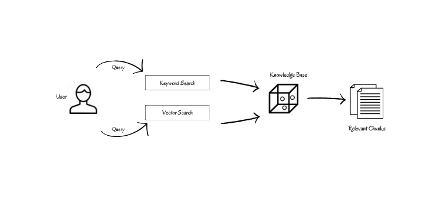

<!-- SEO: Retrieval-Augmented Generation (RAG) is revolutionizing traditional search engines and AI methodologies for information retrieval. However, standard RAG systems often lack efficiency and precision when dealing with extensive data repositories. Substituting the search approach with a hybrid method and reordering the outcomes using a semantic ranker considerably enhances performance, indicating potential for large-scale implementations.
-->

# Optimizing RAG with Hybrid Search & Reranking

Hybrid search emerges as a powerful approach for information retrieval, captivating the attention of AI developers worldwide. Its ability to combine the strengths of different search methods promises to unlock new levels of effectiveness and accuracy. Compared to traditional methods, hybrid search boasts greater flexibility and adaptability, allowing it to tackle a wider range of information needs. This potent combination holds immense potential for various applications, including natural language processing tasks like question answering and text summarization.

Here, we will delve deeply into the nuances of Hybrid search, the highly coveted approach for enhancing the retrieval component in **[RAG (Retrieval Augmented Generation)](https://hub.superlinked.com/retrieval-augmented-generation)** , thereby enhancing its potential to deliver impactful and insightful text generation across various domains.


## What is Hybrid Search?

Conventional vector similarity search alone works well even when there are typos in the query because these typically don’t alter the overall meaning of the sentence. However, for precise word or abbreviation matching, a vector similarity search may not suffice because the abbreviations and names (keywords) just dissolve in the vector embeddings along with the words around them. 
Thus we combine the best from vector search and keyword search algorithms while mitigating their limitations, to create a keyword-sensitive semantic search approach which is called “Hybrid Search”. As the name suggests, hybrid search is fundamentally the combination of one or more search approaches.
Take a peek into how Microsoft discusses this concept in their [article](https://techcommunity.microsoft.com/t5/ai-azure-ai-services-blog/azure-ai-search-outperforming-vector-search-with-hybrid/ba-p/3929167): “Azure AI Search: Outperforming vector search with hybrid retrieval and ranking capabilities”.  

## Use cases for Hybrid Search

In certain scenarios here, vector similarity search proves to be inadequate:
- Match abbreviations like GAN or LLaMA in the query and knowledge base.
- Identify exact words of names or objects like “Biden” or “Salvador Dali”.
- Identify exact code snippets in programming languages as taking a similarity search here is practically useless.<br>

This is where hybrid search comes in handy. The keyword search feature guarantees that abbreviations, annotations, names, and code stays on the radar and the vector search keeps the search results relevant in context.
An interesting use case that will make this clear for you is the new Stack Overflow page. Stack Overflow leveraged AI to make its search algorithms powerful by migrating from simple lexical search to semantic and hybrid search. Earlier, they used the [TF-IDF](https://en.wikipedia.org/wiki/Tf%E2%80%93idf) algorithm to keep tabs on keywords in the user’s search string. This could result in missing out on relevant posts if the keywords (exact code snippets for the task) were not present in the post. Now, they use a hybrid search methodology to find the semantically relevant content from their corpus and also match the exact code typed in by the user if necessary. Check out their [blog](https://stackoverflow.blog/2023/07/31/ask-like-a-human-implementing-semantic-search-on-stack-overflow/?source=post_page-----c75203c2f2f5--------------------------------) to see how the search results improved by adopting hybrid search.

## Things to be aware of

While hybrid search gives you a clear edge in most of the cases, you may also have to consider some potential pitfalls.
- **Latency**: A hybrid query might exhibit an increase in latency compared to a semantic search when executing on a large knowledge corpus as it involves performing two search algorithms.
- **Computational Expense**: Developing and customizing models for hybrid search can be computationally expensive. It is best to consider hybrid search only if your system requires keyword-backed results.
- **Native Support in Databases**: Make sure the vector database you are using supports this functionality. 

There are many vector databases that support this feature. Pinecone, ElasticSearch, Apache Cassandra, and Weaviate incorporate functions that implement hybrid search. Check out the [Vector DB Comparison table](https://vdbs.superlinked.com/) by Vectorhub to know if your vector database supports hybrid search.

## Implementation Architecture


The hybrid search algorithm combines keyword search and vector search to retrieve relevant content from a corpus. In this section, we will dig deeper into the components.
### Keyword Search
**Sparse vectors** or embeddings are vectors with high dimensionality, where most elements are zero. They usually symbolize various language tokens, with the non-zero values signifying their respective significance. The keyword search algorithm uses sparse embeddings and so it is also called **sparse vector search**. 
Usually, the **BM25 (Best Match 25)** algorithm is employed for keyword matching in embeddings. BM25 is a way of finding the most relevant documents for a given query by looking at two things:
- How often do the query words appear in each document (the more, the better)?
- How rare the query words are across all the documents (the rarer, the better)?

The BM25 score for document **D** for query **Q** is calculated as the sum of the scores for individual query terms. The formula for calculating the BM25 score is as follows:

**BM25(D, Q) = ∑(IDF(q) * ((TF(q, D) * (k1 + 1)) / (TF(q, D) + k1 * (1 — b + b * (|D| / avgdl)))))**

where,
- **IDF(q)** denotes inverse document frequency
- **TF(q,D)** denotes term frequency
- **|D|** is the document length
- **avgdl** is the average document length
- **k1** and **b** are tunable constants

Notice that it is a refined version of the [TF-IDF(Term-Frequency Inverse-Document Frequency)](https://en.wikipedia.org/wiki/Tf%E2%80%93idf) algorithm.

### Vector Search
**Dense vectors** or embeddings are arrays with a high number of dimensions, filled predominantly with meaningful, non-zero values. These are frequently employed in machine learning to represent the underlying semantics and connections of words in a numerical format, thereby encapsulating their semantic essence effectively. The vector search algorithm uses dense embeddings and is thus called **dense vector search**. 

A common approach for vector search is the [cosine similarity search algorithm](https://en.wikipedia.org/wiki/Cosine_similarity). It is calculated as the result of the dot product of the vectors, normalized by the multiplication of their magnitudes. The nearer the outcome is to 1, the greater the similarity between the vectors.

**C(A,B) = cos(θ) = A.B / ||A|| ||B||**

### Combination
The results from each algorithm have to be fused to choose the best outcome. There are various strategies to combine them and get a score. Typically, we require a certain formula to balance the keyword search score and vector search score as per the requirements. 
**H = (1-α) K + αV**

where,
- **H** is the hybrid search score
- **α** is the weighted parameter
- **K** is the keyword search score
- **V** is the vector search score
 
As evident, the hybrid score is a pure vector score when α is 1 and a pure keyword score when α is 0.

There are various methods to combine dense and sparse search scores. One of them is **Reciprocal Rank Fusion**. This method ranks each passage according to its place in the keyword and vector outcome lists and subsequently merges these rankings to generate a unified result list. The RRF score is determined by summing the inverse rankings from each list. By positioning the document’s rank in the denominator, it imposes a penalty on documents that appear lower in the list.


where,
- **D** represents the set of documents
- **k** is a constant
- **r(d)** is the rank of document d

### Reranking


Typically, algorithms yield the top-k matches. However, the challenge lies in the fact that these top-k matches may not always include the relevant sections, or conversely, not all relevant sections may be within these top-k matches. At this point, we recognize the need to rank all retrieved content based on a score indicating semantic relevance with the query.

The responses from the retriever are passed to a **semantic scoring model**. Semantic scoring models are transformer models that take in queries and documents to produce a score in a calibrated range. There are many models like [ember](https://huggingface.co/llmrails/ember-v1) that are available to use. After reranking, a list of documents is returned, sorted according to relevance score, from highest to lowest.  Results are arranged in a sequence based on their scores and incorporated into the response payload of the query.

## Implementation Example 
Let’s test the performance of a normal vector search algorithm and a hybrid search algorithm in various contexts. We will be using [ChromaDB](https://www.trychroma.com/) supported by [LangChain](https://www.langchain.com/) and HuggingFace libraries. ChromaDB has no direct implementations for hybrid search but for clarity, we will create an ensemble in the same way we discussed in the theory.
Install and import the required libraries.

```bash
!pip install langchain langchain-community rank_bm25 pypdf unstructured chromadb
!pip install unstructured['pdf'] unstructured
!apt-get install poppler-utils
!apt-get install -y tesseract-ocr
!apt-get install -y libtesseract-dev
!pip install pytesseract
!pip install bitsandbytes accelerate peft safetensors sentencepiece
```
Load your document and split it into chunks of the required size.

```python
from langchain.document_loaders import UnstructuredPDFLoader
from langchain.text_splitter import RecursiveCharacterTextSplitter
from langchain.vectorstores import Chroma

from langchain.embeddings import HuggingFaceInferenceAPIEmbeddings
from langchain.llms import HuggingFaceHub
import torch
from transformers import ( AutoModelForCausalLM, AutoTokenizer, BitsAndBytesConfig, pipeline, )
from langchain import HuggingFacePipeline

from langchain.retrievers import BM25Retriever, EnsembleRetriever

import os
```
Load the PDF document and split them into chunks of desired length with sufficient overlapping. Feel free to adjust the chunk size based on the length of your document and the requirements of the LLM.

```python
doc_path = "/content/document.pdf"
file = UnstructuredPDFLoader(doc_path)
docs = file.load()
```

```python
# create chunks
splitter = RecursiveCharacterTextSplitter(chunk_size=200,
                                          chunk_overlap=30)
chunks = splitter.split_documents(docs)

```
Create a vector store using the embeddings we obtain from the text.

```python
embeddings = HuggingFaceInferenceAPIEmbeddings(
    api_key=HF_TOKEN, model_name="BAAI/bge-base-en-v1.5"
)
vectorstore = Chroma.from_documents(chunks, embeddings)
```
Now build the keyword and semantic retrievers separately. For keyword matching, we use the [BM25 retriever](https://python.langchain.com/docs/integrations/retrievers/bm25) from Langchain. By setting k to 3, you’re asking the retriever to return the 3 most relevant documents or vectors from the vector store.

```python
vectorstore_retreiver = vectorstore.as_retriever(search_kwargs={"k": 3})
keyword_retriever = BM25Retriever.from_documents(chunks)
keyword_retriever.k =  3
```

Now create the ensemble retriever which is a weighted combination of the above two.

```python
ensemble_retriever = EnsembleRetriever(retrievers=[vectorstore_retreiver,
                                                   keyword_retriever],
                                       weights=[0.3, 0.7])
```
Modify the weights to incorporate the impact of both search outcomes appropriately.  The values correspond to **α** and **1-α** as we discussed above. Here I have weighed keywords more with a value of 0.7.

We need to use an LLM in our RAG pipeline. Here we utilize a quantized version of [Zephyr-7B-Beta](http://HuggingFaceH4/zephyr-7b-beta) for lightweight and optimized performance.

```python
model_name = "HuggingFaceH4/zephyr-7b-beta"

# function for loading 4-bit quantized model
def load_quantized_model(model_name: str):
    """
    model_name: Name or path of the model to be loaded.
    return: Loaded quantized model.
    """
    bnb_config = BitsAndBytesConfig(
        load_in_4bit=True,
        bnb_4bit_use_double_quant=True,
        bnb_4bit_quant_type="nf4",
        bnb_4bit_compute_dtype=torch.bfloat16,
    )

    model = AutoModelForCausalLM.from_pretrained(
        model_name,
        load_in_4bit=True,
        torch_dtype=torch.bfloat16,
        quantization_config=bnb_config,
    )
    return model

# initializing tokenizer
def initialize_tokenizer(model_name: str):
    """
    model_name: Name or path of the model for tokenizer initialization.
    return: Initialized tokenizer.
    """
    tokenizer = AutoTokenizer.from_pretrained(model_name, return_token_type_ids=False)
    tokenizer.bos_token_id = 1  # Set beginning of sentence token id
    return tokenizer

tokenizer = initialize_tokenizer(model_name)

model = load_quantized_model(model_name)
# specify stop token ids
stop_token_ids = [0]

# build huggingface pipeline for using zephyr-7b-beta
pipeline = pipeline(
    "text-generation",
    model=model,
    tokenizer=tokenizer,
    use_cache=True,
    device_map="auto",
    max_length=2048,
    do_sample=True,
    top_k=5,
    num_return_sequences=1,
    eos_token_id=tokenizer.eos_token_id,
    pad_token_id=tokenizer.eos_token_id,
)

llm = HuggingFacePipeline(pipeline=pipeline)
```
Define the hybrid search and semantic search retrievers.

```python
from langchain.chains import RetrievalQA

normal_chain = RetrievalQA.from_chain_type(
    llm=llm, chain_type="stuff", retriever=vectorstore_retreiver
)

hybrid_chain = RetrievalQA.from_chain_type(
    llm=llm, chain_type="stuff", retriever=ensemble_retriever
)
response = PREFFERED_CHAIN.invoke("QUERY")
```
Now, let’s check responses from both retrievers in various contexts. First, we will query in a general context without keywords, abbreviations, or location filters.

```
Query: What are the two strategic challenges that the United States faces according to the National Security Strategy?

Semantic Search
Result: According to the given context, the United States faces two strategic challenges as stated in the 2022 National Security Strategy. The challenges are that the post-Cold War era is over, and a competition is underway between major powers to shape what comes next.

Hybrid Search
Result: According to the 2022 National Security Strategy, the United States faces two strategic challenges: the end of the post-Cold War era and a competition underway between major powers to shape what comes next, and the recognition that the democratic allies and partners in the Indo-Pacific and Europe are mutually reinforcing and intertwined fates.

```

Both results are somewhat accurate and satisfactory. Now let us incorporate abbreviations and name filters to see how that works.

```
Query: How did Joe Biden help deepen NATO relationship?

Semantic Search
Result: Under Joe Biden's leadership, America has deepened its relationship with NATO by responding to global challenges and strengthening NATO, making it stronger and more united than it has ever been, as we look to continue promoting stability, prosperity, and growth.

Hybrid Search
Result: Under Joe Biden's leadership, the United States has worked to deepen NATO's relationship through various means. First, he has emphasized the importance of NATO's collective defense commitment, reiterating that the United States will defend every inch of NATO territory, which has helped build trust and confidence among alliance members. Second, Biden has played a key role in modernizing NATO's strategies and capabilities to address emerging threats, such as cyber-attacks and hybrid warfare. Third, he has prioritized engagement with key NATO partners, such as Sweden and Finland, to broaden and deepen the transatlantic bond. Fourth, Biden has advocated for increased funding and resources for NATO, which has helped strengthen the alliance's military and economic capabilities. Overall, Biden's efforts have contributed to a more cohesive and effective NATO, which is better equipped to address global challenges and opportunities.

```
The results from the hybrid search appear to be slightly more detailed. They provide a more comprehensive response, including the names of countries and other specific information.
Let’s add specific locations to see how both approaches fare.

```
Query: How is  Strait of Hormuz important in Biden's strategy?

Semantic Search
Result:  The passage doesn't explicitly state how the Strait of Hormuz is important in Biden's strategy. However, it does mention that the United States and its allies have a shared responsibility to maintain a free and open Indo-Pacific, which includes protecting the freedom of navigation. It is possible that preserving freedom of navigation in this area is also a part of Biden's overall strategy for the region.

Hybrid Search
Result: Biden's strategy emphasizes the importance of ensuring freedom of navigation through the Strait of Hormuz, a waterway located in the Middle East. This strategy aims to prevent any country from dominating the region through military efforts and ensures that there are no efforts to control the waterways. This emphasis on freedom of navigation is crucial for the United States and its allies as a significant portion of the world's oil supply passes through this waterway. Any disruption or control of this waterway could have significant economic and geopolitical implications, making Biden's strategy to maintain this freedom critical.

```

Again hybrid search fares well in location filters. Thus we can conclude that semantic search is enough for all common RAG systems but when it comes to specific names, filters, or abbreviations like in research papers, you may have to consider hybrid search.

Other databases offer native support and implementation for hybrid search. For example, the retriever component for hybrid search in [Weaviate DB](https://weaviate.io/) can be defined as follows.

```python
from langchain.retrievers.weaviate_hybrid_search import WeaviateHybridSearchRetriever


retriever = WeaviateHybridSearchRetriever(
    alpha = 0.5,               # defaults to 0.5, which is equal weighting between keyword and semantic search
    client = client,           # keyword arguments to pass to the Weaviate client
    index_name = "",  # The name of the index to use
    text_key = "",         # The name of the text key to use
    attributes = [],     # The attributes to return in the results
)
hybrid_chain = RetrievalQA.from_chain_type(
    llm=llm, chain_type="stuff", retriever=retriever
)

```
The value of the parameter **alpha** can be adjusted to weigh the impact of semantic and keyword searches.


## Conclusion

We have discussed how hybrid search + rerank offers enhanced performance in RAG systems for keyword matching and refinement in response. The higher recall rates of the retriever have aided in better responses from the LLM. Retrieval Augmented Generation is transforming how we work with search engines and documents, so we expect to see more developments in this space.
Another general learning we can infer from this approach here is that substituting an entire method in RAG for either search or response generation yields superior results compared to minor tweaks made sporadically. 


## References
- [Azure AI](https://techcommunity.microsoft.com/t5/ai-azure-ai-services-blog/azure-ai-search-outperforming-vector-search-with-hybrid/ba-p/3929167)
- [Dify.ai](https://dify.ai/blog/hybrid-search-rerank-rag-improvement)
- [Benham & Culpepper](https://rodgerbenham.github.io/bc17-adcs.pdf)
- [LangChain](https://python.langchain.com/docs/get_started/introduction)

## Contributors
[Ashish Abraham, Author](https://www.linkedin.com/in/ashish-abraham-811a23201/)

