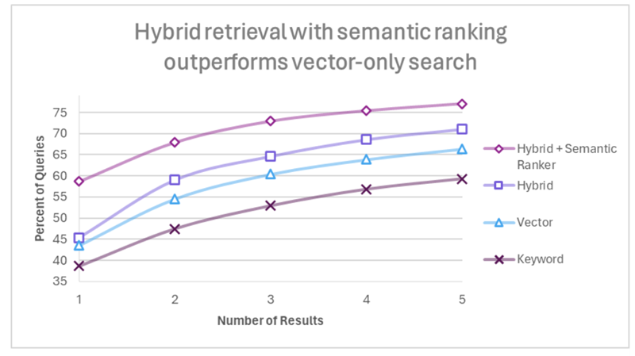

<!-- SEO: Retrieval-Augmented Generation (RAG) is revolutionizing traditional search engines and AI methodologies for information retrieval. However, standard RAG systems often lack efficiency and precision when dealing with extensive data repositories. Substituting the search approach with a hybrid method and reordering the outcomes using a semantic ranker considerably enhances performance, indicating potential for large-scale implementations.
-->

# Hybrid Search + Rerank: Optimizing RAG

**RAG (Retrieval Augmented Generation)** has been the preferred strategy for AI developers all around the world to power their LLMs with up-to-date knowledge. It introduces a new age of information retrieval and search which has enabled many AI technologies we use often, like the Bing Chatbot, Google Bard or even the ChatPDF. A RAG architecture assists an LLM in identifying the most pertinent context and providing precise responses, similar to how a librarian aids an individual in choosing a preferred book from a vast collection.


As depicted in the figure, the retriever fetches relevant data from the knowledge base whenever a query is passed and the LLM can answer the query by examining the context provided. The accuracy of the response increases with the precision of the retrieved context. RAG solves a major issue in LLMs called **hallucination** where LLMs fail to respond with relevant context to the query and spit out irrelevant or false data which it thinks is true and thus gives the phenomenon its name.

## Challenges & Shortcomings of RAG

Even though RAG has been spearheading recent developments in this space, it has a lot to improve on what it does. Conventional RAG systems drag behind with latency when dealing with a sufficiently large knowledge base. When there is a vast amount of data in the knowledge base, conducting a similarity search across the entire corpus can be quite time-intensive. They also struggle to find relevant passages from the corpora using simple similarity search algorithms. 
Normal RAG systems find it difficult to match exact names like “Joe Biden” or “Salvador Dali” in the query and knowledge base. It also misses out on abbreviations like GAN or LLaMA when their full forms are present in the query or knowledge base.  

## Why Hybrid Search + RAG?

Vector similarity works well even when there are spelling mistakes in the query because these typically don’t alter the overall meaning of the sentence. However, for precise word or abbreviation matching, vector similarity may not suffice because the abbreviations and names just dissolve in the vector embeddings along with the words around them. So, we need something to keep tabs on keywords also. 
How can we solve such issues? One way is to tweak the search method to accommodate keywords. However, this would make the retrieval system weaker as identifying similarities is the fundamental objective when we decide to transform data into embeddings. The perfect way to do this is to take the best from semantic search and keyword search approaches while mitigating their limitations as much as possible. This keyword-sensitive semantic search is what we call **Hybrid Search**.


Microsoft discusses this concept in their [article](https://techcommunity.microsoft.com/t5/ai-azure-ai-services-blog/azure-ai-search-outperforming-vector-search-with-hybrid/ba-p/3929167): “Azure AI Search: Outperforming vector search with hybrid retrieval and ranking capabilities”.  Document chunking plays a crucial role in deciding the speed of search and the performance of the retrieval system. The whole document is divided into chunks with a fixed token length and indexed. 

Keyword search uses sparse embeddings and so it is also called **sparse vector search**. Usually, the **BM25 similarity search algorithm** is employed for keyword matching in embeddings. BM25 is a way of finding the most relevant documents for a given query by looking at two things:
- How often the query words appear in each document (the more, the better).
- How rare the query words are across all the documents (the rarer, the better).


When it comes to vector similarity, an algorithm such as cosine similarity search would be adequate. Vector search involves dense vectors and so it is also known as **dense vector search**. The results from vector and keyword searches are combined using various techniques. One of them is **Reciprocal Rank Fusion**. This method ranks each passage according to its place in the keyword and vector outcome lists and subsequently merges these rankings to generate a unified result list. The objective of this method is to consider the placement of elements in the initial rankings, assigning greater significance to those that appear higher in vector and keyword rank lists. This can enhance the overall excellence and dependability of the ranking, rendering it more beneficial for merging various sequenced search outcomes.

Hybrid retrieval thus utilizes the combined advantages of keyword and vector retrieval to identify the passages most pertinent to the query.

## Implementing Hybrid Search
Hybrid search functions are available in vector databases like [Weaviate](https://weaviate.io/).  Here is a simple example. We will be using [LangChain](https://www.langchain.com/) for the implementation.

Load your document and split it into chunks of the required size.

```python
from langchain.document_loaders import TextLoader
from langchain.text_splitter import CharacterTextSplitter
loader = TextLoader('path to your document')
document = loader.load()
splitter = CharacterTextSplitter(chunk_size=500, chunk_overlap=50)
chunks = splitter.split_documents(document)
```
For simplicity, we are using OpenAI embeddings to convert the document into vectors. Create the embeddings and populate the vector database.
```python
import weaviate
from weaviate.embedded import EmbeddedOptions
from langchain.embeddings import OpenAIEmbeddings
from langchain.vectorstores import Weaviate

client = weaviate.Client(
  embedded_options = EmbeddedOptions()
)

db = Weaviate.from_documents(
    client = client,    
    documents = chunks,
    embedding = OpenAIEmbeddings(),
    by_text = False
)
```
Define the retriever.
```python
from langchain.retrievers.weaviate_hybrid_search import WeaviateHybridSearchRetriever


retriever = WeaviateHybridSearchRetriever(
    alpha = 0.5,           # defaults to 0.5, which is equal weighting between keyword and semantic search
    client = client,          
    index_name = "",       # The index to use
    text_key = "",         # The name of the text key to use
    attributes = [],       # Attributes to return in results
)

```
Use this retriever in the standarad RAG pipeline code.

## Final touches with Reranking

A response by hybrid search does not solve our issue completely. A hybrid search scans the entire corpus to find all possible sections that could contain the answer. Typically, algorithms yield the top-k matches. However, the challenge lies in the fact that these top-k matches may not always include the relevant sections, or conversely, not all relevant sections may be within these top-k matches. At this point, we recognize the necessity to rank all the retrieved content based on a score that indicates semantic relevance with the query.


The responses from the retriever are passed to a semantic scoring model. Semantic scoring models are transformer models that take in queries and documents to produce a score in a calibrated range. There are many models like [ember](https://huggingface.co/llmrails/ember-v1) that are available to use. In the Azure AI approach, 0 stands for irrelevant and the maximum score is at 4. After reranking, a list of documents is returned, sorted according to relevance score, from highest to lowest.  Results are arranged in a sequence based on their scores and incorporated into the response payload of the query. The relevance score will be based on the semantic similarity calculated between the query and the document.
Now, the LLM gets the most relevant part of the document that can satisfy what the user has asked. It then generates appropriate responses based on this content.

## Results

Hybrid search and reranking have shown significant progress in RAG performance. The quality of the retrieved content has increased a lot by employing hybrid search which in turn will aid the generation phase of the RAG architecture. The recall score of the model can be assessed by the fact that almost all relevant content is present in the top-k retrievals. 

Here are some comparisons with various approaches on benchmark and real-world datasets from the Azure AI article.


*Comparison of Retrieval Modes*, *Alec Berntson*, *2023*, *Azure AI*


<br>The below chart from Azure AI shows the percentage of queries showing high-quality results in the top-5 retrievals.



*Percentage of queries where high-quality chunks are found in the top 1 to 5 results*, *Alec Berntson*, *2023*, *Azure AI*


<br>With hybrid search and semantic ranker, over 75% of queries show high-quality results in top-5 retrievals and almost 60% of queries give relevant results right in the top-1 retrieval. 

## Moving Forward

We have discussed how **hybrid search + rerank** offers enhanced performance in RAG systems for keyword matching and refinement in response. The higher recall rates of the retriever have aided in better responses from the LLM.
As Retrieval Augmented Generation continues to revolutionize our interaction with search engines and documents, we anticipate witnessing further advancements in this field. A key insight from our discussion is that replacing an entire method in the RAG architecture, whether it’s for search or response generation, tends to yield more substantial improvements than sporadic minor adjustments. This underscores the importance of holistic methodological changes in driving impactful results.

Hope you enjoyed the article. Thank you for engaging.


## References

[Azure AI](https://techcommunity.microsoft.com/t5/ai-azure-ai-services-blog/azure-ai-search-outperforming-vector-search-with-hybrid/ba-p/3929167)

[Dify.ai](https://dify.ai/blog/hybrid-search-rerank-rag-improvement)


---
## Contributors

- [Ashish Abraham, author](https://www.linkedin.com/in/ashish-abraham-811a23201/)
