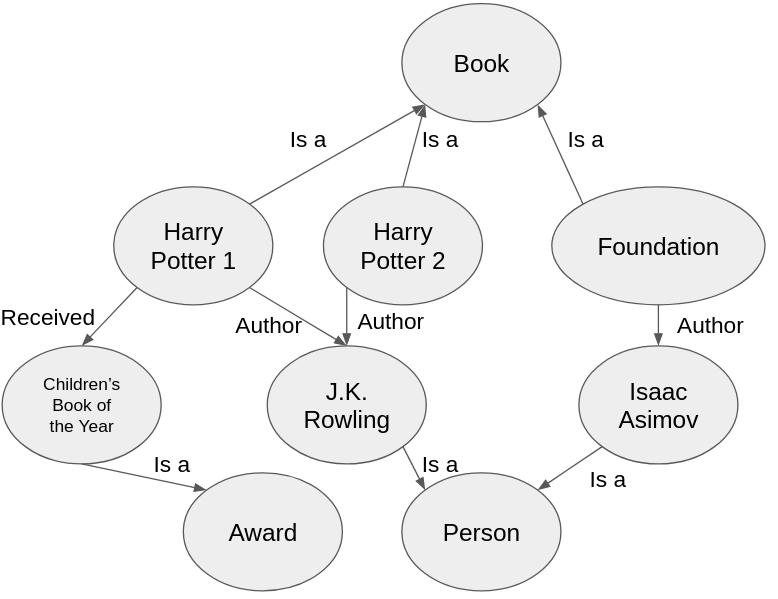
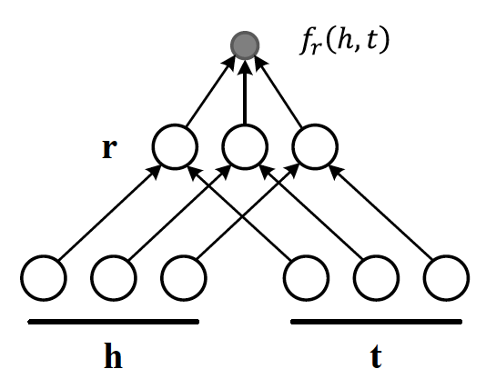

<!-- SEO: Introduction to Knowledge Graphs. Introduction to Knowledge Graph Embedding. Introduction to the DistMult algorithm. Example code for training KGE model. Example code for evaluating KGE model. Example code for answering questions with a KGE model. KGE and LLM comparison on QA task.  -->

# Answering Questions with Knowledge Graph Embeddings

Large Language Models (LLMs) are everywhere, achieving impressive results in all sorts of language-related tasks - language understanding, sentiment analysis, text completion, and so on. But in some domains, including those involving relational data (often stored in Knowledge Graphs), LLMs don't always perform as well. For use cases that require you to capture semantic relationships - like relation extraction and link prediction, specialized approaches that _embed_ relational data can perform much better than LLMs.

We look at how Knowledge Graph Embedding (KGE) algorithms can improve performance on some tasks that LLMs have difficulty with, explore some example code for training and evaluating a KGE model, and use the KGE model to perform Q&A tasks. We also compare KGE and LLM performance on a Q&A task.

Let's get started.

## Knowledge Graphs and missing edges

We use Knowledge Graphs (KGs) to describe how different entities, like people, places, or more generally "things," relate to each other. For example, a KG can show us how a writer is linked to their books, or how a book is connected to its awards:



In domains where understanding these specific connections is crucial - like recommendation systems, search engines, or information retrieval - KGs specialize in helping computers understand the detailed relationships between things.

The problem with KGs is that they are usually incomplete. Edges that should be present are missing. These missing links can result from inaccuracies in the data collection process, or simply reflect that our data source is imperfect. In large open-source knowledge bases, [we can observe a _significant_ amount of incompleteness](https://towardsdatascience.com/neural-graph-databases-cc35c9e1d04f):

> … in Freebase, 93.8% of people have no place of birth, and [78.5% have no nationality](https://aclanthology.org/P09-1113.pdf), [about 68% of people do not have any profession](https://dl.acm.org/doi/abs/10.1145/2566486.2568032), while, in Wikidata, [about 50% of artists have no date of birth](https://arxiv.org/abs/2207.00143), and only [0.4% of known buildings have information about height](https://dl.acm.org/doi/abs/10.1145/3485447.3511932).

The **imperfections of KGs** can lead to negative outcomes. For example, in recommendations systems, KG incompleteness can result in **limited or biased recommendations**; on Q&A tasks, KG incompleteness can yield **substantively and contextually incomplete or inaccurate answers to queries**.

Fortunately, KGEs can help solve problems that plague KGs.

## Knowledge Graph Embeddings and how they work

Trained KGE algorithms can generalize and predict missing edges by calculating the likelihood of connections between entities. 

KGE algorithms do this by taking tangled complex webs of connections between entities and turning them into something AI systems can understand: **vectors**. Embedding entities in a vector space allows KGE algorithms to define a **loss function** that measures the discrepancy between embedding similarity and node similarity in the graph. _If the loss is minimal, similar nodes in the graph have similar embeddings_.

The KGE model is **trained** by trying to make the similarities between embedding vectors align with the similarities of corresponding nodes in the graph. The model adjusts its parameters during training to ensure that entities that are similar in the KG have similar embeddings. This ensures that vector representations capture the structural and relational aspects of entities in the graph.

KGE algorithms vary in the similarity functions they employ, and how they define node similarity within a graph. A **simple approach** is to consider nodes that are connected by an edge as similar. Using this definition, learning node embeddings can be framed as a classification task. In this task, the goal is to determine how likely it is that any given pair of nodes have a specific type of relationship (i.e., share a specific edge), given their embeddings.

## Demo using DistMult KGE

For our KGE model demo, we opted for the DistMult KGE algorithm. It works by representing the likelihood of relationships between entities (i.e., similarity) as a _bilinear_ function. Essentially, DisMult KGE assumes that the score of a given triple (comprised of a head entity $h$, a relationship $r$, and a tail entity $t$) can be computed as: $h^T \text{diag}(r) t$. 



[(Image source)](https://data.dgl.ai/asset/image/ke/distmult.png)

The model parameters are learned (internalizing the intricate relationships within the KG) by _minimizing cross entropy between real and corrupted triplets_.

In the following two sections we'll walk you through:

**1. Building and training a DistMult model**
**2. Using the model to answer questions**

### Building and Training a KGE model

We use a subgraph of the Freebase Knowledge Graph, a database of general facts (transferred to Wikidata after Freebase Knowledge Graph's 2014 shutdown). This subgraph contains 14541 different entities, 237 different relation types, and 310116 edges in total. 

You can load the subgraph as follows:

```python
from torch_geometric.datasets import FB15k_237
train_data = FB15k_237("./data", split='train')[0]
```

We'll use PyTorch Geometric, a library built on top of PyTorch, to construct and train the model. PyTorch Geometric is specifically designed for building machine learning models on graph-structured data.

The implementation of the DistMult algorithm lies under the **torch_geometric.nn** package. To create the model, we need to specify the following three parameters:

- **num_nodes**: The number of distinct entities in the graph (in our case, 14541)
- **num_relations**: The number of distinct relations in the graph (in our case, 237)
- **hidden_channels**: The dimensionality of the embedding space (for this, we'll use 64)

```python
from torch_geometric.nn import DistMult
model = DistMult(
    num_nodes=train_data.num_nodes, 
    num_relations=train_data.num_edge_types, 
    hidden_channels=64
)
```

For additional configuration of the model, please refer to the [PyTorch Geometric documentation](https://pytorch-geometric.readthedocs.io/en/latest/generated/torch_geometric.nn.kge.DistMult.html).


The process of **model training in PyTorch** follows a standard set of steps:

The first step is **initialization of an optimizer**. The optimizer is a fundamental part of machine learning model training; it adjusts the parameters of the model to reduce loss. In our demo, we use the [Adam](https://pytorch.org/docs/stable/generated/torch.optim.Adam.html) optimizer.

```python
import torch.optim as optim
# 1. initialize optimizer
opt = optim.Adam(model.parameters(), lr=0.001, weight_decay=1e-6)
```

Second, **creation of a data loader**. The purpose of this loader is to return a batch iterator over the entire dataset. The batch size can be adjusted according to the specific requirements of the model and the capacity of the hardware. The loader not only provides an efficient way to load the data but also shuffles it, to ensure that the model is not biased by the order of the training samples.

```python
# 2. create data loader on the training set
loader = model.loader(
    head_index=train_data.edge_index[0],
    rel_type=train_data.edge_type,
    tail_index=train_data.edge_index[1],
    batch_size=2000,
    shuffle=True,
)
```

Finally, **execution of the training loop**. This is where the actual learning takes place. The model processes each batch of data, then we compare the actual output to the expected output (labels). The model parameters are then adjusted to bring the outputs closer to the labels. This process continues until the model's performance on a validation set reaches an acceptable level, or a predefined number of iterations has been completed (we opt for the latter in our example).

```python
# 3. usual torch training loop
EPOCHS = 20
model.train()
for e in range(EPOCHS):
    l = []
    for batch in loader:
        opt.zero_grad()
        loss = model.loss(*batch)
        l.append(loss.item())
        loss.backward()
        opt.step()
    print(f"Epoch {e} loss {sum(l) / len(l):.4f}")
```

Now that we have a trained model, we can do **some experiments** to see how well the learned embeddings capture semantic meaning. To do so, we will construct 3 fact triplets and then we'll use the model to score these triplets. The triplets (each consisting of a head entity, a relationship, and a tail entity) are:

1. France contains Burgundy (which is true)
2. France contains Rio de Janeiro (which is not true)
3. France contains Bonnie and Clyde (which makes no sense)

```python
# Get node and relation IDs
france = nodes["France"]
rel = edges["/location/location/contains"]
burgundy = nodes["Burgundy"]
riodj = nodes["Rio de Janeiro"]
bnc = nodes["Bonnie and Clyde"]

# Define triplets
head_entities = torch.tensor([france, france, france], dtype=torch.long)
relationships = torch.tensor([rel, rel, rel], dtype=torch.long)
tail_entities = torch.tensor([burgundy, riodj, bnc], dtype=torch.long)

# Score triplets using the model
scores = model(head_entities, relationships, tail_entities)
print(scores.tolist())
>>> [3.890, 2.069, -2.666]

# Burgundy gets the highest score
# Bonnie and Clyde gets the lowest (negative) score
```


### Answering questions with our model

Next, we'll demo how to apply the trained model to answer questions. To answer the question, "What is Guy Ritchie's profession?" we start by finding the embedding vectors of the node "Guy Ritchie" and the relation "profession."

```python
# Accessing node and relation embeddings
node_embeddings = model.node_emb.weight
relation_embeddings = model.rel_emb.weight

# Accessing embeddings for specific entities and relations
guy_ritchie = node_embeddings[nodes["Guy Ritchie"]]
profession = relation_embeddings[edges["/people/person/profession"]]
```

Remember, the DistMult algorithm models connections as a bilinear function of a (head, relation, tail) triplet, so we can express our question as: <Guy Ritchie, profession, ?>. The model will answer with whichever node maximizes this expression. That is, it will find the tail entity (the profession of Guy Ritchie) that results in the highest score when plugged into the bilinear function.

```python
# Creating embedding for the query based on the chosen relation and entity
query = guy_ritchie * profession

# Calculating scores using vector operations
scores = node_embeddings @ query

# Find the index for the top 5 scores
sorted_indices = scores.argsort().tolist()[-5:][::-1]
# Get the score for the top 5 index
top_5_scores = scores[sorted_indices]

>>> [('film producer', 3.171), # Correct answer
 ('author', 2.923),
 ('film director', 2.676),
 ('writer', 2.557),
 ('artist', 2.522)]
```

Impressively, the model **correctly interprets and infers information that isn't explicitly included in the graph**, and provides the right answer to our question. Our model aptly demonstrates KGE's ability to make up for graph incompleteness.

Furthermore, the fact that the top five relevant entities identified by the model are all professions suggests that the model has successfully learned and understood the concept of a "profession" - that is, the model has **discerned the broader context and implications** of "profession," rather than just recognizing the term itself.

Moreover, these five professions are all closely related to the film industry, suggesting that the model has _not only_ understood the concept of a profession but _also_ narrowed this category to film industry professions specifically; that is, KGE has managed to **grasp the semantic meaning** of the combination of the two query terms: the head entity (Guy Ritchie) and the relation entity (profession), and therefore was able to link the general concept of a profession to the specific context of the film industry, a testament to its ability to capture and interpret semantic meaning.

In sum, the model's performance in this scenario demonstrates its potential for **understanding concepts**, **interpreting context**, and **extracting semantic meaning**.

Here is the [complete code for this demo](https://drive.google.com/file/d/1G3tJ6Nn_6hKZ8HZGpx8OHpWwGqp_sQtF/view?usp=sharing).


## Comparing KGE with LLM performance on a large Knowledge Graph

Next, let's compare the performance of KGE and LLMs on the ogbl-wikikg2 dataset, drawn from Wikidata. This dataset includes 2.5 million unique entities, 535 types of relations, and 17.1 million fact triplets. We'll evaluate their performance using hit rates (ratio of correct answers), following the guidelines provided in [Stanford's Open Graph Benchmark](https://ogb.stanford.edu/docs/linkprop/#ogbl-wikikg2).

First, we create textual representations for each node within the graph by crafting sentences that describe their connections, like this: "[node] [relation1] [neighbor1], [neighbor2]. [node] [relation2] [neighbor3], [neighbor4]. ..." 

We then feed these textual representations into a LLM – specifically, the **BAAI/bge-base-en-v1.5** model available on [HuggingFace](https://huggingface.co/BAAI/bge-base-en-v1.5). The embeddings that result from this process serve as our node embeddings.

For queries, we take a similar textual representation approach, creating descriptions of the query but omitting the specific entity in question. With these representations in hand, we utilize dot product similarity to find and rank relevant answers.

For the KGE algorithm, we employ DistMult with a 250-dimensional embedding space.


### Results

You can see the results on the Open Graph Benchmark query set in the table below:

| metric/model  | Random | LLM | DistMult|
| --- | --- | --- | --- |
| HitRate@1 |  0.001 | 0.0055 | **0.065** |
| HitRate@3 |  0.003 | 0.0154 | **0.150** |
| HitRate@10 |  0.010 | 0.0436 | **0.307** |

While the LLM performs three times better than when the nodes are randomly ordered, it's KGE that really stands out as the superior option, with **hit rates almost ten times higher than the LLM**. In addition, DistMult finds the **correct answer on its first try more frequently** than LLM does in ten attempts. DisMult's performance is all the more remarkable when considering that it outperforms LLM even though we used lower-dimensional (250) embeddings with DisMult than the LLM, which outputs 768-dimensional embeddings.

Our results unequivocally demonstrate **KGE's clear advantage over LLMs for tasks where relational information is important**.

### DisMult limitations

While DistMult stands out as a simple but powerful tool for embedding KGs, it does have limitations. It struggles with:
1. cold starts: When the graph evolves or changes over time, DistMult can't represent new nodes introduced later on, or can't model the effect of new connections introduced to the graph.
2. complex questions: While it excels in straightforward question-answering scenarios, the DistMult model falls short when faced with complex questions that demand a deeper comprehension, extending beyond immediate connections. Other KGE algorithms better suit such tasks.


## KGEs for relational data

Because LLMs have trouble encoding intricate relation structures, their performance suffers when dealing with relational information. Creating a string representation of a node's connections tends to overload the LLM's input. Instead, their strength lies in processing more focused and specific textual information; LLMs are typically not trained to handle broad and diverse information within a single context. KGE algorithms, on the other hand, are specifically designed to handle relational data, and can be further customized to fit the specific needs of a wide variety of use cases.


---
## Contributors

- [Richárd Kiss, author](https://www.linkedin.com/in/richard-kiss-3209a1186/)
- [Robert Turner, editor](https://robertturner.co/copyedit)
