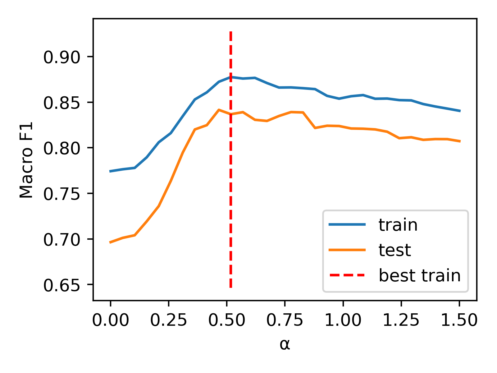

# POST2 Leveraging Relational Information

## Introduction

Different types of information, like words, pictures, and connections between things, show us different sides of the world. Relationships, especially, are interesting because they show how things interact and create networks. In this article, we'll talk about how we can use these relationships to understand and describe things in a network better.

We're diving into a real-life example to explain how entities can be turned into vectors using their connections, a common practice in machine learning. The dataset we're going to work with is the a subset of the Cora citation network. It comprises 2708 scientific papers (nodes) and the connections indicate citations between them. Each paper has a BoW (Bag-of-Words) descriptor. The challenge at hand involves predicting the specific scientific category to which each paper belongs to, selecting from a pool of seven distinct categories.

The dataset can be loaded as follows:

```python
from torch_geometric.datasets import Planetoid
ds = Planetoid("./data", "Cora")[0]
```

We will evaluate representations by measuring the classification performance (Accuracy and macro F1). We'll use a KNN (K-Nearest Neighbors) classifier with 15 neighbors and cosine similarity as the similarity metric:

```python
from sklearn.neighbors import KNeighborsClassifier
from sklearn.model_selection import train_test_split
from sklearn.metrics import f1_score

def evaluate(x,y):
    x_train, x_test, y_train, y_test = train_test_split(x, y, random_state=42)
    model = KNeighborsClassifier(n_neighbors=15, metric="cosine")
    model.fit(x_train, y_train)
    y_pred = model.predict(x_test)
    
    print("Accuracy", f1_score(y_test, y_pred, average="micro"))
    print("F1 macro", f1_score(y_test, y_pred, average="macro"))
```

First, we'll see how the BoW representations can be used to solve the classification problem:

```python
evaluate(ds.x, ds.y)
>>> Accuracy 0.735
>>> F1 macro 0.697
```

This is not bad, let’s see if we can do better by utilizing relational information.

## Learning node embeddings with Node2Vec

Before delving into the details, let's briefly understand node embeddings. These are vector representations of nodes in a network. Essentially, these representations capture the structural role and properties of the nodes in the network.

Node2Vec is an algorithm that employs the Skip-Gram method to learn node representations. It operates by modeling the conditional probability of encountering a context node given a source node in node sequences (random walks):

`P(context∣source) ~ exp(⟨w[context],w[source]⟩)`

The embeddings (`w`) are learned by maximizing the co-occurance probability for (source,context) pairs drawn from the true data distribution (positive pairs), and at the same time minimizing for pairs that are drawn from a synthetic noise distribution. This process ensures that the embedding vectors of similar nodes are close in the embedding space, while dissimilar nodes are further apart (w.r.t. dot product).

The random walks are sampled according to a policy, which is guided by 2 parameters: return `p`, and in-out `q`.

- The return parameter `p` impacts the likelihood of returning to the previous node. A higher p leads to more locally focused walks.
- The in-out parameter `q` affects the likelihood of visiting nodes in the same or different neighborhood. A higher q encourages Depth First Search, while a lower q promotes Breadth First Search.

These parameters provide a balance between neighborhood exploration and local context. Adjusting p and q can be used to capture different characteristics of the graph.

### Node2Vec embeddings

In our example, we use the `torch_geometric` implementation of the Node2Vec algorithm. We initialize the model by specifying the following attributes:

- `edge_index`: a tensor containing the graph's edges in an edge list format.
- `embedding_dim`: specifies the dimensionality of the embedding vectors.

By default, the `p` and `q` parameters are set to 1, resulting in ordinary random walks. For additional configuration of the model, please refer to the [documentation](https://pytorch-geometric.readthedocs.io/en/latest/generated/torch_geometric.nn.models.Node2Vec.html).

```python
from torch_geometric.nn import Node2Vec
device="cuda"
n2v = Node2Vec(
    edge_index=ds.edge_index, 
    embedding_dim=128, 
    walk_length=20,
    context_size=10,
    sparse=True
).to(device)
```

The next steps include initializing the data loader and the optimizer. The role of the data loader is to generate training batches. In our case, it will sample the random walks, create skip-gram pairs, and generate corrupted pairs.

The optimizer is used to update the model weights to minimize the loss (cross entropy). In our case, we are using the sparse variant of the Adam optimizer.

```python
loader = n2v.loader(batch_size=128, shuffle=True, num_workers=4)
optimizer = torch.optim.SparseAdam(n2v.parameters(), lr=0.01)
```

In the code block below, we conduct the actual model training: We iterate over the training batches, calculate the loss, and apply gradient steps.

```python
n2v.train()
for epoch in range(200):
    total_loss = 0
    for pos_rw, neg_rw in loader:
        optimizer.zero_grad()
        loss = n2v.loss(pos_rw.to(device), neg_rw.to(device))
        loss.backward()
        optimizer.step()
        total_loss += loss.item()
    print(f'Epoch: {epoch:03d}, Loss: {total_loss / len(loader):.4f}')
```

Finally, now that we have a fully trained model, we can evaluate the learned embeddings using the `evaluate` function we defined earlier.

```python
embeddings = n2v().detach().cpu() # Access node embeddings
evaluate(embeddings, ds.y)
>>> Accuracy: 0.818
>>> F1 macro: 0.799
```

This is better than the BoW representations! Let’s see if we can improve by combining the two embeddings.

### Node2Vec + Text based embeddings

A straightforward method to combine embeddings from different sources is by concatenating them dimension-wise. We have BoW features `v_bow` and Node2Vec embeddings `v_n2v`. The fused representation would then be `v_fused = torch.cat((v_n2v, v_bow), dim=1)`. However, before combining the two representations, let’s look at the L2 norm distribution of both embeddings:


From the plot, it's clear that the scales of the embedding vector lengths differ. When we want to use them together, the one with the larger magnitude will overshadow the smaller one. To mitigate this, we'll equalize their lengths by dividing each one by its average length. However, this still not necessarily yields the best performance. To optimally combine the two embeddings, we'll introduce a weighting factor: `x = torch.cat((alpha * v_n2v, v_bow), dim=1)`. To determine the appropriate value for `alpha`, we'll employ a 1D grid search approach. The results of this approach are displayed in the subsequent graph.



Now, we can evaluate the combined representation using the score of alpha that we've obtained (0.517).

```python
v_n2v = normalize(n2v().detach().cpu())
v_bow = normalize(ds.x)

x = np.concatenate((best_alpha*v_n2v,v_bow), axis=1)
evaluate(x, ds.y)
>>> Accuracy 0.859
>>> F1 macro 0.836
```
The results show that by combining the representations obtained from solely the network structure and text of the paper can improve performance. Specifically, in our case, this fusion contributed to a 5% improvement from the Node2Vec only and 17% from the BoW only classifiers.

---

[ SAGE DRAFT FROM HERE ]

## Learning node embeddings with GraphSAGE

GraphSAGE, unlike transductive methods such as Node2Vec, creates node embeddings by incorporating features from neighboring nodes. This approach is beneficial as it enables the embedding of nodes that were not present during training.

This inductive behaviour is achieved by using a particular type of Neural Network designed specifically for graph-structured data, known as Graph Neural Networks (GNN). The central concept behind GNN layers is to build the hidden representation by combining the node's features with the aggregated features of its neighboring nodes, as illustrated in the picture below.

[GNN image]

Here [https://distill.pub/2021/gnn-intro/](https://distill.pub/2021/gnn-intro/) you can learn more about GNNs.

The model learns weights by minimizing the cross-entropy in the link prediction task, which involves predicting if an edge exists between two nodes in the graph. The link probability is modeled in a similar way to how Node2Vec models co-occurrence probability, with a slight difference: instead of learning static embeddings for each node, we use a GNN to construct the embeddings: $sigma(<GNN(x1), GNN(x2)>)$

### GraphSAGE embeddings

Here we are using the `torch_geometric` implementation of the GraphSAGE algorithm, similarly as before. First we create the model by initializing a `GraphSAGE` object:

```python
from torch_geometric.nn import GraphSAGE
sage = GraphSAGE(
    ds.num_node_features, hidden_channels=256, out_channels=128, num_layers=2
).to(device)
```

…

```python
from torch_geometric.loader import LinkNeighborLoader
loader = LinkNeighborLoader(
    ds,
    batch_size=512,
    shuffle=True,
    neg_sampling_ratio=1.0,
    num_neighbors=[15,10],
    transform=T.NormalizeFeatures(),
    num_workers=4
)
```

…

```python
optimizer = torch.optim.Adam(sage.parameters(), lr=0.01)
```

…

```python
def train():
    sage.train()
    total_loss = 0
    for batch in loader:
        batch = batch.to(device)
        optimizer.zero_grad()
        # create node representations
        h = sage(batch.x, batch.edge_index)
        # take head and tail representations
        h_src = h[batch.edge_label_index[0]]
        h_dst = h[batch.edge_label_index[1]]
        # compute pairwise edge scores
        pred = (h_src * h_dst).sum(dim=-1)
        # apply cross entropy
        loss = F.binary_cross_entropy_with_logits(pred, batch.edge_label)
        loss.backward()
        optimizer.step()
        total_loss += float(loss) * pred.size(0)

    return total_loss / ds.num_nodes

for epoch in range(1, 50):
    loss = train()
    print(f'Epoch: {epoch:03d}, Loss: {loss:.4f}')
```


## Conclusion


| Embedding | Text Based | Node2Vec | Combined |
| --- | --- | --- | --- |
| F1 (macro) |  0.849 | 0.617 | **0.900** |
| Accuracy |  0.849 | 0.628 | **0.901** |

---
## Contributors

- [Richárd Kiss, author](https://www.linkedin.com/in/richard-kiss-3209a1186/)
