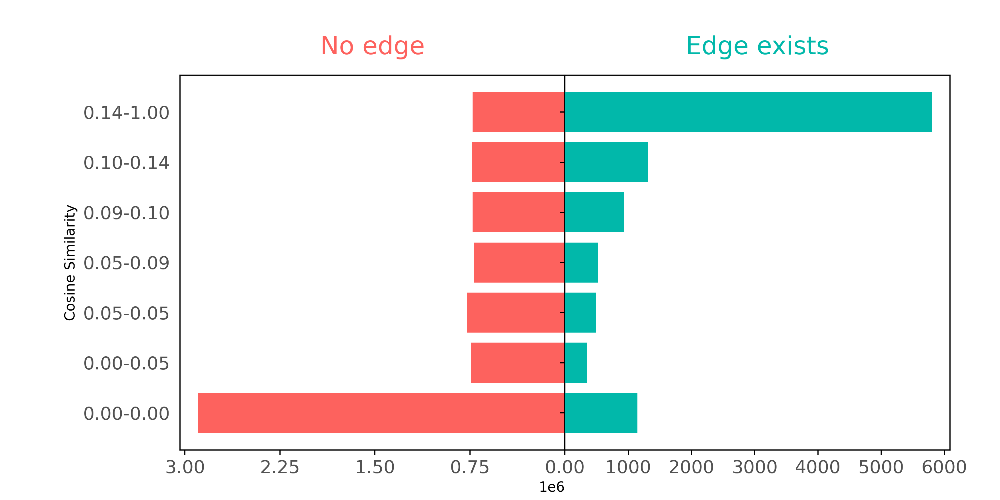
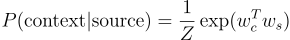
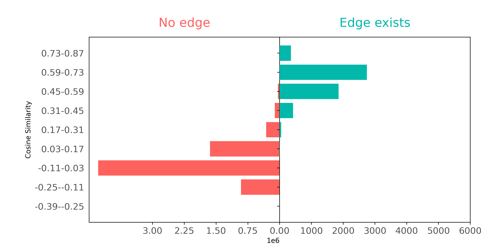
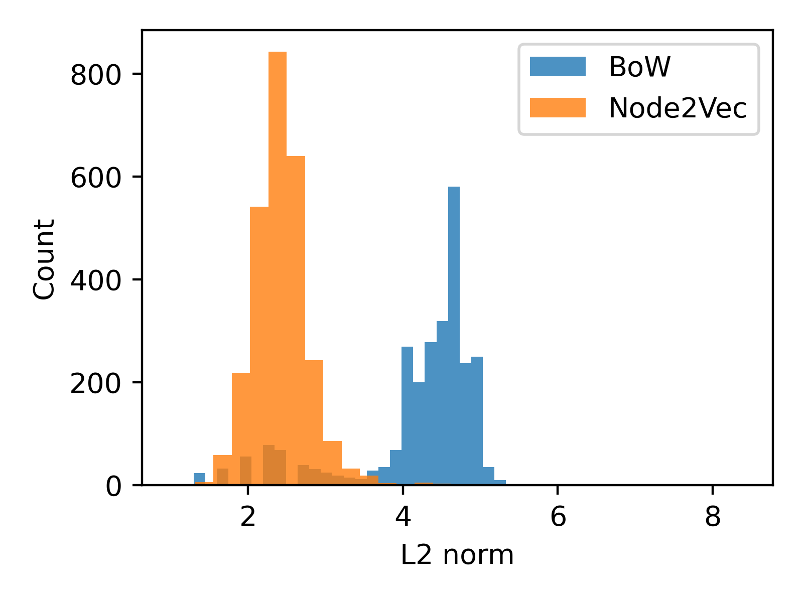
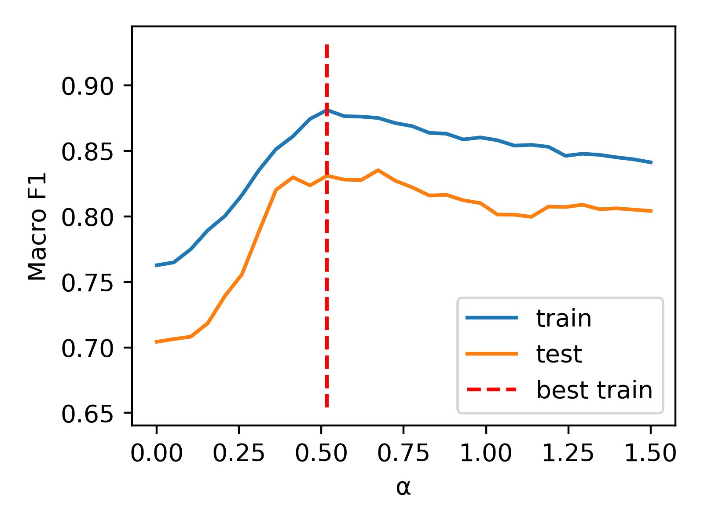
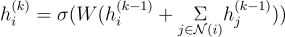
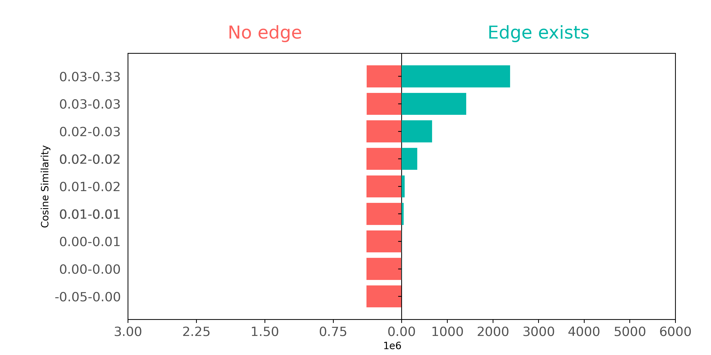

<!-- SEO: Introduction to Node Representation Learning. Introduction to Node2Vec. Introduction to GraphSAGE. Example code for training Node2Vec. Example code for training GraphSAGE. Node2Vec GraphSAGE comparison. Node2Vec and GraphSAGE pro con. -->

# Representation Learning on Graph Structured Data

## Introduction: representing things and relationships between them

Of the various types of information - words, pictures, and connections between things - **relationships** are especially interesting. Relationships show how things interact and create networks. But not all ways of representing relationships are the same. In machine learning, **how we do vector representation of things and the relationships between them affects performance** on a wide range of tasks.

Below, we evaluate several approaches to vector representation on a real-life use case: how well each approach classifies academic articles in a subset of the Cora citation network.

We look first at Bag-of-Words (BoW), a standard approach to vectorizing text data in ML. Because BoW can't represent the network structure well, we turn to solutions that can help BoW's performance: Node2Vec and GraphSAGE. We also look for a solution to BoW's other shortcoming - its inability to capture semantic meaning. We evaluate LLM embeddings, first on their own, then combined with Node2Vec, and, finally, GraphSAGE trained on LLM features.

## Loading our dataset, and evaluating BoW
 
Our use case is a subset of the **Cora citation network**. This subset comprises 2708 scientific papers (nodes) and connections that indicate citations between them. Each paper has a BoW descriptor containing 1433 words. The papers in the dataset are also divided into 7 different topics (classes). Each paper belongs to exactly one of them.

We **load the dataset** as follows:

```python
from torch_geometric.datasets import Planetoid
ds = Planetoid("./data", "Cora")[0]
```

### Evaluating BoW on a classification task

We can evaluate how well the BoW descriptors represent the articles by measuring classification performance (Accuracy and macro F1). We use a KNN (K-Nearest Neighbors) classifier with 15 neighbors, and cosine similarity as the similarity metric:

```python
from sklearn.neighbors import KNeighborsClassifier
from sklearn.model_selection import train_test_split
from sklearn.metrics import f1_score

def evaluate(x,y):
    x_train, x_test, y_train, y_test = train_test_split(x, y, random_state=42)
    model = KNeighborsClassifier(n_neighbors=15, metric="cosine")
    model.fit(x_train, y_train)
    y_pred = model.predict(x_test)
    
    print("Accuracy", f1_score(y_test, y_pred, average="micro"))
    print("F1 macro", f1_score(y_test, y_pred, average="macro"))
```

Let's see how well the BoW representations solve the classification problem:

```python
evaluate(ds.x, ds.y)
>>> Accuracy 0.738
>>> F1 macro 0.701
```

BoW's accuracy and F1 macro scores are pretty good, but leave significant room for improvement. BoW falls short of correctly classify papers more than 25% of the time. And on average across classes BoW is inaccurate nearly 30% of the time.

## Taking advantage of citation graph data

Can we improve on this? Our citation dataset contains not only text data but also relationship data - a citation graph. Any given article will tend to cite other articles that belong to the same topic that it belongs to. Therefore, representations that embed not just textual data but also citation data of articles contained in our network will probably classify articles more accurately.

BoW features represent text data. But how well does BoW capture the relationships between articles?

**That is, do BoW features represent citation graph data?**

### Comparing citation pair similarity in BoW

To examine how well citation pairs show up in BoW features, we can make a plot comparing connected and not connected pairs of papers based on how similar their respective BoW features are.



In this plot, we define groups (shown on the y-axis) so that each group has about the same number of pairs as the other groups. The only exception is the 0.00-0.05 group, where lots of pairs have _no_ similar words - they can't be split into smaller groups.

The plot demonstrates how connected nodes usually have higher cosine similarities. Papers that cite each other often use similar words. But if we ignore paper pairs with zero similarities (the 0.00-0.00 group), papers that have _not_ cited each other also seem to have a wide range of common words.

Though BoW representations embody _some_ information about article connectivity, BoW features don't contain enough citation pair information to accurately reconstruct the actual citation graph. BoW looks exclusively at word co-occurrence between article pairs, and therefore misses word context data contained in the network structure.

**Can we make up for BoW's inability to represent the citation network's structure?** 
Are there methods that capture node connectivity data better?

Node2Vec is built to do precisely this, for static networks. So is GraphSAGE, for dynamic ones. 
Let's look at Node2Vec first.

## Embedding network structure with Node2Vec

As opposed to BoW vectors, node embeddings are vector representations that capture the structural role and properties of nodes in a network. Node2Vec is an algorithm that learns node representations using the Skip-Gram method; it models the conditional probability of encountering a context node given a source node in node sequences (random walks):

<!--
$P(\text{context}|\text{source}) = \frac{1}{Z}\exp(w_{c}^Tw_s)$
-->


Here, *w_c* and *w_s* are the embeddings of the context node *c* and source node *s* respectively. The variable *Z* serves as a normalization constant, which, for computational efficiency, is never explicitly computed.

The embeddings are learned by maximizing the co-occurence probability for (source,context) pairs drawn from the true data distribution (positive pairs), and at the same time minimizing for pairs drawn from a synthetic noise distribution. This process ensures that the embedding vectors of similar nodes are close in the embedding space, while dissimilar nodes are further apart (with respect to the dot product).

The random walks are sampled according to a policy, which is guided by 2 parameters: return *i*, and in-out *q*.

- The return parameter *p* affects the likelihood of immediately returning to the previous node. A higher *p* leads to more locally focused walks.
- The in-out parameter *q* affects the likelihood of visiting nodes in the same or a different neighborhood. A higher *q* encourages Depth First Search (DFS), while a lower *q* promotes Breadth-First-Search-like (BFS) exploration.

These parameters are particularly useful for accommodating different networks and tasks. Adjusting the values of *p* and *q* captures different characteristics of the graph in the sampled walks. BFS-like exploration is useful for learning local patterns. On the other hand, using DFS-like sampling is useful for capturing patterns on a bigger scale, like structural roles.

### Node2Vec embedding process

In our example, we use the `torch_geometric` implementation of the Node2Vec algorithm. We **initialize the model** by specifying the following attributes:

- `edge_index`: a tensor containing the graph's edges in an edge list format.
- `embedding_dim`: specifies the dimensionality of the embedding vectors.

By default, the `p` and `q` parameters are set to 1, resulting in ordinary random walks. For additional configuration of the model, please refer to the [model documentation](https://pytorch-geometric.readthedocs.io/en/latest/generated/torch_geometric.nn.models.Node2Vec.html).

```python
from torch_geometric.nn import Node2Vec
device="cuda"
n2v = Node2Vec(
    edge_index=ds.edge_index, 
    embedding_dim=128, 
    walk_length=20,
    context_size=10,
    sparse=True
).to(device)
```

The next steps include **initializing the data loader and the optimizer**. 

The **role of the data loader is to generate training batches**. In our case, it will sample the random walks, create skip-gram pairs, and generate corrupted pairs by replacing either the head or tail of the edge from the noise distribution.

The **optimizer is used to update the model weights to minimize the loss**. In our case, we are using the sparse variant of the Adam optimizer.

```python
loader = n2v.loader(batch_size=128, shuffle=True, num_workers=4)
optimizer = torch.optim.SparseAdam(n2v.parameters(), lr=0.01)
```

In the code block below, we conduct the **actual model training**: We iterate over the training batches, calculate the loss, and apply gradient steps.

```python
n2v.train()
for epoch in range(200):
    total_loss = 0
    for pos_rw, neg_rw in loader:
        optimizer.zero_grad()
        loss = n2v.loss(pos_rw.to(device), neg_rw.to(device))
        loss.backward()
        optimizer.step()
        total_loss += loss.item()
    print(f'Epoch: {epoch:03d}, Loss: {total_loss / len(loader):.4f}')
```

### Node2Vec classification performance

Finally, now that we have a fully trained model, we can evaluate the learned embeddings on our classification task, using the `evaluate` function we defined earlier.

```python
embeddings = n2v().detach().cpu() # Access node embeddings
evaluate(embeddings, ds.y)
>>> Accuracy: 0.822
>>> F1 macro: 0.803
```

Using Node2Vec embeddings, we get **better classification results** than when we used BoW representations.

Let's also see if Node2Vec does a better job of **representing citation data** than BoW. We'll examine - as we did with BoW above - whether connected nodes separate from not connected node pairs when comparing on cosine similarity.



Using Node2Vec, we can see a well defined separation; these embeddings capture the connectivity of the graph much better than BoW did.

**But can we _further_ improve classification performance?** 
What if we _combine_ the two information sources - relationship (Node2Vec) embeddings and textual (BoW) features?

### Node2Vec embeddings + text-based (BoW) features

A straightforward approach for combining vectors from different sources is to **concatenate them dimension-wise**. We have BoW features `v_bow` and Node2Vec embeddings `v_n2v`. The fused representation would be `v_fused = torch.cat((v_n2v, v_bow), dim=1)`. But before combining them, we should examine their respective L2 norm distributions side by side, to ensure that one kind of representations will not dominate the other:



From the plot above, it's clear that the scales of the embedding vector lengths differ. To avoid the larger magnitude Node2Vec vector overshadowing the BoW vector, we can divide each embedding vector by their average length. 

But we can _further_ optimize performance by introducing a **weighting factor** (α). The combined representations are constructed as `x = torch.cat((alpha * v_n2v, v_bow), dim=1)`. To determine the appropriate value for α, we employ a 1D grid search approach. Our results are displayed in the following plot.



Now, we can evaluate the combined representation using the alpha value that we've obtained (0.517).

```python
v_n2v = normalize(n2v().detach().cpu())
v_bow = normalize(ds.x)

x = np.concatenate((best_alpha*v_n2v,v_bow), axis=1)
evaluate(x, ds.y)
>>> Accuracy 0.852
>>> F1 macro 0.831
```

By combining representations of the network structure (Node2Vec) and text (BoW) of the articles, we're able to significantly improve performance on article classification. Relatively, the Node2Vec + BoW fusion performed 3% better than the Node2Vec-only, and 11.4% better the BoW-only classifiers.

These are impressive results. **But what if our citation network grows? What happens when new papers need to be classified?**

### Node2Vec limitations: dynamic networks

In cases where new data is introduced to our dataset, BoW is very useful, because it can be generated easily. Node2Vec, on the other hand, is unable to generate embeddings for entities not present during its training phase. To represent new data with Node2Vec features, you have to retrain the entire model. This means that while Node2Vec is a robust and powerful tool for representing static networks, it is inconvenient and less effective at trying to represent dynamic networks.

For dynamic networks, where entities evolve or new ones emerge, there are other, _inductive_ approaches - like GraphSAGE.

## Learning inductive node embedding with GraphSAGE

GraphSAGE is an inductive representation learning algorithm that leverages GNNs (Graph Neural Networks) to create node embeddings. Instead of learning static node embeddings for each node, it learns an aggregation function on node features that outputs node representations. Because this model combines node features with network structure, we don't have to manually combine the two information sources later on.

The GraphSAGE layer is defined as follows:

<!--
$h_i^{(k)} = \sigma(W (h_i^{(k-1)} + \underset{j \in \mathcal{N}(i)}{\Sigma}h_j^{(k-1)}))$
-->


Here σ is a nonlinear activation function, *W^k* is a learnable parameter of layer *k*, and *N(i)* is the set of nodes neighboring node *i*. As in traditional Neural Networks, we can stack multiple GNN layers. The resulting multi-layer GNN will have a wider receptive field. That is, it will be able to consider information from bigger distances, thanks to recursive neighborhood aggregation.

To **learn the model parameters**, the [GraphSAGE authors](https://proceedings.neurips.cc/paper_files/paper/2017/file/5dd9db5e033da9c6fb5ba83c7a7ebea9-Paper.pdf) suggest two approaches:
1. In a _supervised_ setting, we can train the network in the same way we train a conventional NN for a supervised task (for example, using Cross Entropy for classification or Mean Squared Error for regression).
2. If we have access only to the graph itself, we can approach model training as an _unsupervised_ task, where the goal is to predict the presence of edges in the graph based on node embeddings. In this case, the link probabilities are defined as *P*[*j ∈ N*(*i*)] = *σ*(dot(*h_i, h_j*)). The loss function is the Negative Log Likelihood of the presence of the edge and *p*.

It's also possible to combine the two approaches by using a linear combination of the two loss functions.
But in this example we stick with the unsupervised variant.

### GraphSAGE embeddings

Here, just as we did when training the Node2Vec model, we use `torch_geometric` to implement the GraphSAGE algorithm. 

First, we create the model by initializing a `GraphSAGE` object. We are using a 1-layer GNN, meaning that our model will receive node features from a distance of at most 1. We will have 256 hidden and 128 output dimensions.

```python
from torch_geometric.nn import GraphSAGE
sage = GraphSAGE(
    ds.num_node_features, hidden_channels=256, out_channels=128, num_layers=1
).to(device)
```

The **optimizer** is constructed in the usual PyTorch fashion. Once again, we'll use `Adam`:

```python
optimizer = torch.optim.Adam(sage.parameters(), lr=0.01)
```

Next, we construct the **data loader**. This will generate training batches for us. We're aiming at an unsupervised approach, so the loader will: 
1. Select a batch of node pairs that are connected by an edge (positive samples).
2. Create negative samples by either modifying the head or tail of the positive samples. The number of negative samples per edge is defined by the `neg_sampling_ratio` parameter, which we set to 1. This means that for each positive sample we'll have exactly one negative sample, for use in training.
3. We sample neighbors at a depth of 1 for each selected node. The `num_neighbors` parameter allows us to specify the number of sampled neighbors at each depth. This is particuarly useful when we are dealing with dense graphs and/or multi layer GNNs. Limiting the considered neighbors will decouple computational complexity from the actual node degree. However, in our particular case, we set the number to `-1` indicating that we want to sample all of the neighbors.

```python
from torch_geometric.loader import LinkNeighborLoader
loader = LinkNeighborLoader(
    ds,
    batch_size=1024,
    shuffle=True,
    neg_sampling_ratio=1.0,
    num_neighbors=[-1],
    transform=T.NormalizeFeatures(),
    num_workers=4
)
```

Here, we can see what a batch returned by the loader actually looks like:

```python
print(next(iter(loader)))
>>> Data(x=[2646, 1433], edge_index=[2, 8642], edge_label_index=[2, 2048], edge_label=[2048], ...)
```

In the `Data` object, `x` contains the BoW node features. The `edge_label_index` tensor contains the head and tail node indices for the positive and negative samples. `edge_label` is the binary target for these pairs (1 for positive 0 for negative samples). The `edge_index` tensor holds the adjacency list for the current batch of nodes.

Now we can **train** our model as follows:

```python
def train():
    sage.train()
    total_loss = 0
    for batch in loader:
        batch = batch.to(device)
        optimizer.zero_grad()
        # create node representations
        h = sage(batch.x, batch.edge_index)
        # take head and tail representations
        h_src = h[batch.edge_label_index[0]]
        h_dst = h[batch.edge_label_index[1]]
        # compute pairwise edge scores
        pred = (h_src * h_dst).sum(dim=-1)
        # apply cross entropy
        loss = F.binary_cross_entropy_with_logits(pred, batch.edge_label)
        loss.backward()
        optimizer.step()
        total_loss += float(loss) * pred.size(0)
    return total_loss / ds.num_nodes

for epoch in range(100):
    loss = train()
    print(f'Epoch: {epoch:03d}, Loss: {loss:.4f}')
```

### GraphSAGE Results

Next, we can embed nodes and evaluate the embeddings on the classification task:

```python
embeddings = sage(normalize(ds.x), ds.edge_index).detach().cpu()
evaluate(embeddings, ds.y)
>>> Accuracy 0.844
>>> F1 macro 0.820
```

The results are only slightly worse than the results we got by combining Node2Vec with BoW features. But, remember, we're evaluating GraphSAGE because it can handle dynamic network data, whereas Node2Vec cannot. **GraphSAGE embeddings perform well on our classification task _and_ are able to embed completely new nodes as well**. When your use case involves new nodes or nodes that evolve, an inductive model like GraphSAGE may be a better choice than Node2Vec.

## Embedding semantics: LLM

In addition to not being able to represent network structure, BoW vectors, because they treat words as contextless occurrences, can't capture semantic meaning, and therefore don't perform as well on classification tasks as approaches that can do semantic embedding. Let's summarize the classification performance results we obtained above using BoW features.

| Metric | BoW | Node2Vec | Node2Vec+BoW | GraphSAGE(BoW-trained) |
| --- | --- | --- | --- | --- |
| Accuracy  | 0.738 | 0.822 | 0.852 |  0.844 |
| F1 (macro)  | 0.701 | 0.803 | 0.831 | 0.820 |

These article classification results **can be improved further using LLM embeddings**, because LLM embeddings excel in capturing semantic meaning.

To do this, we use the `all-mpnet-base-v2` model available on [Hugging Face](https://huggingface.co/sentence-transformers/all-mpnet-base-v2) for embedding the title and abstract of each paper. Data loading and optimization is done in exactly the same way we did in the code snippets above, when we used BoW features. This time, we just substitute LLM features where the BoW features were.

### LLM results

The results obtained with LLM only, Node2Vec combined with LLM, and GraphSAGE trained on LLM appear in the following table, along with the _relative_ percent improvement compared to using the BoW features:

| Metric  | LLM | Node2Vec+LLM |  GraphSAGE(LLM-trained) |
| --- | --- | --- | --- |
| Accuracy  | 0.816 (+7.8%) | **0.867** (+1.5%) |  0.852 (+0.8%) |
| F1 (macro)  | 0.779 (+7.8%) | **0.840** (+0.9%) | 0.831 (+1.1%) |


Let's explore how well LLM vectors *represent citation data*.



With LLM embeddings, nodes that are connected have a stronger similarity between their representations, much stronger than using Bag of Words (BoW) features. However, for pairs of nodes that aren't connected, there's still a wide range of similarity values. This makes it challenging to easily tell them apart from connected pairs - meaning that they are somewhere in between BoW and Node2Vec features in capturing the graph structure.


## Conclusion: LLM, Node2Vec, GraphSAGE better at learning node and node relationship data than BoW

For classification tasks on our article citation dataset, we can conclude that:

1. LLM features beat BoW features in all scenarios.
2. Combining text-based representations with network structure was better than either alone.
3. We achieved the best results using Node2Vec with LLM features.

As a final note, we've included a **pro vs con comparison** of our two node representation learning algorithms - **Node2Vec and GraphSAGE**, to help with thinking about which model might be a better fit for your use case:

| Aspect | Node2Vec | GraphSAGE|
| --- | --- | --- |
| Generalizing to new nodes | no | yes |
| Inference time | constant | we can control inference time |
| Accommodating different graph types and objectives | by setting *p* and *q* parameters, we can adapt representations to fit our needs | limited control | 
| Combining with other representations | concatenation | by design, the model learns to map node features to embeddings |
| Dependency on additional representations | relies solely on graph data | depends on quality and availability of node representations; impacts model performance if lacking |
| Embedding flexibility | very flexible node representations | representations of nodes with similar neighborhoods can't have much variation |

---
## Contributors

- [Richárd Kiss, author](https://www.linkedin.com/in/richard-kiss-3209a1186/)
- [Robert Turner, editor](https://robertturner.co/copyedit)
