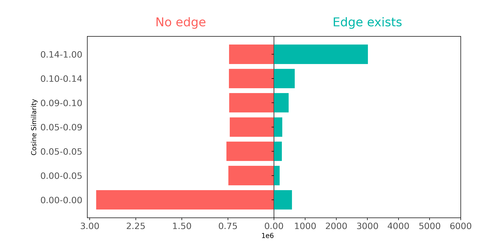

<!-- SEO: Introduction to Node Representation Learning. Introduction to Node2Vec. Introduction to GraphSAGE. Example code for training Node2Vec. Example code for training GraphSAGE. Node2Vec GraphSAGE comparison. Node2Vec and GraphSAGE pro con. -->

# Representation Learning on Graph Structured Data

## Introduction

Of the various types of information - words, pictures, and connections between things - **relationships** are especially interesting. Relationships show how things interact and create networks. But not all ways of representing relationships are the same. In machine learning, **how we do vector represention of relationships affects performance** on a wide range of tasks.

Below, we evaluate several approaches to vector representation on a real-life use case: how well they classify academic articles and replicate a citation graph using Cora citation network. 

We look first at Bag-of-Words. Because BoW doesn't represent the network structure, we turn to solutions that can help BoW's performance: Node2Vec and GraphSAGE. We also look for a solution to BoW's other shortcoming; its inability to capture semantic meaning. We evaluate LLM embeddings, first on their own, then combined with Node2Vec, and finally LLM-trained GraphSAGE trained on LLM.


**Our dataset: Cora**
Our use case is a subset of the Cora citation network. This subset comprises 2708 scientific papers (nodes) and connections that indicate citations between them. Each paper has a BoW descriptor containing 1433 words. The papers in the dataset are also divided into 7 different topics (classes). Each paper belongs to exactly one of them.

**Loading the dataset**
We load the dataset as follows:

```python
from torch_geometric.datasets import Planetoid
ds = Planetoid("./data", "Cora")[0]
```

**Evaluating BoW on a classification task**
We can evaluate how well the BoW descriptors represent the articles by measuring classification performance (Accuracy and macro F1). We use a KNN (K-Nearest Neighbors) classifier with 15 neighbors, and cosine similarity as the similarity metric:

```python
from sklearn.neighbors import KNeighborsClassifier
from sklearn.model_selection import train_test_split
from sklearn.metrics import f1_score

def evaluate(x,y):
    x_train, x_test, y_train, y_test = train_test_split(x, y, random_state=42)
    model = KNeighborsClassifier(n_neighbors=15, metric="cosine")
    model.fit(x_train, y_train)
    y_pred = model.predict(x_test)
    
    print("Accuracy", f1_score(y_test, y_pred, average="micro"))
    print("F1 macro", f1_score(y_test, y_pred, average="macro"))
```

Let's see how well the BoW representations solve the classification problem:

```python
evaluate(ds.x, ds.y)
>>> Accuracy 0.738
>>> F1 macro 0.701
```

BoW's accuracy and F1 macro scores leave a lot of room for improvement. It fails to correctly classify papers more than 25% of the time. And on average across classes BoW is inaccurate nearly 30% of the time.

**BoW representation of citation pair similarity**
But we also want to see whether BoW representations accurately capture the relationships between articles. To examine how well citation pairs show up in BoW features, we can make a plot comparing connected and not connected pairs of papers based on how similar their respective BoW features are.



In this plot, we define groups (shown on the y-axis) so that each group has about the same number of pairs as the other groups. The only exception is the 0.00-0.05 group, where lots of pairs have _no_ similar words - they can't be split into smaller groups.

The plot demonstrates how connected nodes usually have higher cosine similarities. Papers that cite each other often use similar words. But if we ignore paper pairs with zero similarities (the 0.00-0.00 group), papers that have _not_ cited each other also seem to have a wide range of common words.

Though BoW representations embody _some_ information about article connectivity, BoW features don't contain enough citation pair information to accurately reconstruct the actual citation graph. More specifically, BoW represents documents as unordered sets of words; it ignores word order, and instead treats each word independently, evaluating their frequency. Because BoW looks exclusively at word co-occurrence between article pairs, it misses word context data contained in the network structure - data that can be used to more accurately represent citation data, and classify articles better. (Since articles that cite each other tend to belong to the same topic, we can achieve improvements in both citation graph reproduction and article classification if we can represent _both_ citation _and_ textual data contained in our network.)

Can we make up for BoW's inability to represent the citation network's structure? Are their methods that capture node and node connectivity data better?

Node2Vec is built to do precisely this. So is GraphSAGE. 
First, let's look at Node2Vec.

## Learning node embeddings with Node2Vec

As opposed to BoW vectors, node embeddings are vector representations that capture the structural role and properties of nodes in a network. Node2Vec is an algorithm that learns node representations using the Skip-Gram method; it models the conditional probability of encountering a context node given a source node in node sequences (random walks):

$P(\text{context}|\text{source}) = \frac{1}{Z}\exp(w_{c}^Tw_s) $

Here, $w_c$ and $w_s$ are the embeddings of the context node $c$ and source node $s$ respectively. The variable $Z$ serves as a normalization constant, which, for computational efficiency, is never explicitly computed.

The embeddings are learned by maximizing the co-occurance probability for (source,context) pairs drawn from the true data distribution (positive pairs), and at the same time minimizing for pairs that are drawn from a synthetic noise distribution. This process ensures that the embedding vectors of similar nodes are close in the embedding space, while dissimilar nodes are further apart (with respect to the dot product).

The random walks are sampled according to a policy, which is guided by 2 parameters: return $p$, and in-out $q$.

- The return parameter $p$ affects the likelihood of immediately returning to the previous node. A higher $p$ leads to more locally focused walks.
- The in-out parameter $q$ affects the likelihood of visiting nodes in the same or a different neighborhood. A higher $q$ encourages Depth First Search (DFS), while a lower $q$ promotes Breadth-First-Search-like (BFS) exploration.

These parameters are particularly useful for accommodating different networks and tasks. Adjusting the values of $p$ and $q$ captures different characteristics of the graph in the sampled walks. BFS-like exploration is useful for learning local patterns. On the other hand, using DFS-like sampling is useful for capturing patterns on a bigger scale, like structural roles.

### Node2Vec embeddings

In our example, we use the `torch_geometric` implementation of the Node2Vec algorithm. We **initialize the model** by specifying the following attributes:

- `edge_index`: a tensor containing the graph's edges in an edge list format.
- `embedding_dim`: specifies the dimensionality of the embedding vectors.

By default, the `p` and `q` parameters are set to 1, resulting in ordinary random walks. For additional configuration of the model, please refer to the [model documentation](https://pytorch-geometric.readthedocs.io/en/latest/generated/torch_geometric.nn.models.Node2Vec.html).

```python
from torch_geometric.nn import Node2Vec
device="cuda"
n2v = Node2Vec(
    edge_index=ds.edge_index, 
    embedding_dim=128, 
    walk_length=20,
    context_size=10,
    sparse=True
).to(device)
```

The next steps include **initializing the data loader and the optimizer**. 

The **role of the data loader is to generate training batches**. In our case, it will sample the random walks, create skip-gram pairs, and generate corrupted pairs by replacing either the head or tail of the edge from the noise distribution.

The **optimizer is used to update the model weights to minimize the loss**. In our case, we are using the sparse variant of the Adam optimizer.

```python
loader = n2v.loader(batch_size=128, shuffle=True, num_workers=4)
optimizer = torch.optim.SparseAdam(n2v.parameters(), lr=0.01)
```

In the code block below, we conduct the **actual model training**: We iterate over the training batches, calculate the loss, and apply gradient steps.

```python
n2v.train()
for epoch in range(200):
    total_loss = 0
    for pos_rw, neg_rw in loader:
        optimizer.zero_grad()
        loss = n2v.loss(pos_rw.to(device), neg_rw.to(device))
        loss.backward()
        optimizer.step()
        total_loss += loss.item()
    print(f'Epoch: {epoch:03d}, Loss: {total_loss / len(loader):.4f}')
```

Finally, now that we have a fully trained model, we can evaluate the learned embeddings on our classification task, using the `evaluate` function we defined earlier.

```python
embeddings = n2v().detach().cpu() # Access node embeddings
evaluate(embeddings, ds.y)
>>> Accuracy: 0.822
>>> F1 macro: 0.803
```

Using Node2Vec embeddings, we get **better classification results** than when we used BoW representations.

Let's also see if Node2Vec does a better job of **representing citation data** than BoW. We'll examine - as we did with BoW above - whether connected nodes separate from not connected node pairs when comparing on cosine similarity.


This time, using Node2Vec we can see a well defined separation; these embeddings capture the connectivity of the graph much better than BoW did.

But can we _further_ improve classification performance? 
One method is _combining_ the two information sources, relationship (Node2Vec) embeddings and textual (BoW) features.

### Node2Vec embeddings + text-based (BoW) features

A straightforward approach for combining vectors from different sources is to **concatenate them dimension-wise**. We have BoW features `v_bow` and Node2Vec embeddings `v_n2v`. The fused representation would then be `v_fused = torch.cat((v_n2v, v_bow), dim=1)`. But before combining them, we should examine the L2 norm distribution of both embeddings, to ensure that one kind of representations will not dominate the other:


From the plot above, it's clear that the scales of the embedding vector lengths differ. To avoid the larger magnitude Node2Vec vector overshadowing the BoW vector, we can divide each embedding vector by their average length. 

But we can _further_ optimize performance by introducing a **weighting factor** ($\alpha$). The combined representations are constructed as `x = torch.cat((alpha * v_n2v, v_bow), dim=1)`. To determine the appropriate value for $\alpha$, we employ a 1D grid search approach. Our results are displayed in the following plot.


Now, we can evaluate the combined representation using the value of alpha that we've obtained (0.517).

```python
v_n2v = normalize(n2v().detach().cpu())
v_bow = normalize(ds.x)

x = np.concatenate((best_alpha*v_n2v,v_bow), axis=1)
evaluate(x, ds.y)
>>> Accuracy 0.852
>>> F1 macro 0.831
```

By combining representations of the network structure (Node2Vec) and text (BoW) of the articles, we were able to significantly improve performance on article classification. Relatively, the Node2Vec + BoW fusion performed 3% better than the Node2Vec-only, and 11.4% better the BoW-only classifiers.

These are impressive results. **But what if our citation network grows? What happens when new papers need to be classified?**

### Node2Vec limitations: dynamic networks

In cases where new data is introduced to our dataset, BoW is very useful, because it can be generated easily. Node2Vec, on the other hand, is unable to generate embeddings for entities not present during its training phase. To represent new data with Node2Vec features, you have to retrain the entire model. This means that while Node2Vec is a robust and powerful tool for representing static networks, it is less effective and inconvenient when trying to represent dynamic networks.

For dynamic networks, where entities evolve or new ones emerge, there are other, _inductive_ approaches - like GraphSAGE.

## Learning inductive node embedding with GraphSAGE

GraphSAGE is an inductive representation learning algorithm that leverages GNNs (Graph Neural Networks) to create node embeddings. Instead of learning static node embeddings for each node, it learns an aggregation function on node features that outputs node representations. Because this model combines node features with network structure, we don't have to manually combine the two information sources later on.

The GraphSAGE layer is defined as follows:

$h_i^{(k)} = \sigma(W (h_i^{(k-1)} + \underset{j \in \mathcal{N}(i)}{\Sigma}h_j^{(k-1)}))$

Here $\sigma$ is a nonlinear activation function, $W^{(k)}$ is a learnable parameter of layer $k$, and $\mathcal{N}(i)$ is the set of neighboring nodes of node $i$. As in traditional Neural Networks, we can stack multiple GNN layers. The resulting multi-layer GNN will have a wider receptive field. That is, it will be able to consider information from bigger distances, thanks to the recursive neighborhood aggregation.

To **learn the model parameters**, the [GraphSAGE authors](https://proceedings.neurips.cc/paper_files/paper/2017/file/5dd9db5e033da9c6fb5ba83c7a7ebea9-Paper.pdf) suggest two approaches:
1. If we are dealing with a supervised setting, we can train the network similar to how we train a conventional NN for the supervised task (for example, using Cross Entropy for classification or Mean Squared Error for regression).
2. If we only have access to the graph itself, we can approach model training as an unsupervised task, where the goal is to predict the presence of the edges in the graph based on the node embeddings. In this case, the link probabilities are defined as $P(j \in \mathcal{N}(i)) \approx \sigma(h_i^Th_j)$. The loss function is the Negative Log Likelihood of the presence of the edge and $P$.

It is also possible to combine the two approaches by using a linear combination of the two loss functions.
However, in this example we stick with the unsupervised variant.

### GraphSAGE embeddings

Here we use the `torch_geometric` implementation of the GraphSAGE algorithm, just as we did when training the Node2Vec model. 

First, we create the model by initializing a `GraphSAGE` object. We are using a 1-layer GNN, meaning that our model will receive node features from a distance of at most 1. We will have 256 hidden and 128 output dimensions.

```python
from torch_geometric.nn import GraphSAGE
sage = GraphSAGE(
    ds.num_node_features, hidden_channels=256, out_channels=128, num_layers=1
).to(device)
```

The **optimizer** is constructed in the usual PyTorch fashion. Once again, we'll use `Adam`:

```python
optimizer = torch.optim.Adam(sage.parameters(), lr=0.01)
```

Next, the **data loader** is constructed. This will generate training batches for us. As we are aiming at an unsupervised approach, this loader will:
1. Select a batch of node pairs which are connected by an edge (positive samples).
2. Sample negative examples by either modifying the head or tail of the positive samples. The number of negative samples per edge is defined by the `neg_sampling_ratio` parameter, which we set to 1. This means that for each positive sample we'll have exactly one negative sample.
3. We sample neighbors for a depth of 1 for each selected node. The `num_neighbors` parameter allows us to specify the number of sampled neighbors at each depth. This is particuarly useful when we are dealing with dense graphs and/or multi layer GNNs. Limiting the considered neighbors will decouple computational complexity from the actual node degree. However, in our particular case, we set the number to `-1` indicating that we want to sample all of the neighbors.

```python
from torch_geometric.loader import LinkNeighborLoader
loader = LinkNeighborLoader(
    ds,
    batch_size=1024,
    shuffle=True,
    neg_sampling_ratio=1.0,
    num_neighbors=[-1],
    transform=T.NormalizeFeatures(),
    num_workers=4
)
```

Here we can see what a batch returned by the loader actually looks like:

```python
print(next(iter(loader)))
>>> Data(x=[2646, 1433], edge_index=[2, 8642], edge_label_index=[2, 2048], edge_label=[2048], ...)
```

The `Data` object `x` contains the BoW node features. The `edge_label_index` tensor contains the head and tail node indices for the positive and negative samples. `edge_label` is the binary target for these pairs (1 for positive 0 for negative samples). The `edge_index` tensor holds the adjacency list for the current batch of nodes.

Now we can **train** our model as follows:

```python
def train():
    sage.train()
    total_loss = 0
    for batch in loader:
        batch = batch.to(device)
        optimizer.zero_grad()
        # create node representations
        h = sage(batch.x, batch.edge_index)
        # take head and tail representations
        h_src = h[batch.edge_label_index[0]]
        h_dst = h[batch.edge_label_index[1]]
        # compute pairwise edge scores
        pred = (h_src * h_dst).sum(dim=-1)
        # apply cross entropy
        loss = F.binary_cross_entropy_with_logits(pred, batch.edge_label)
        loss.backward()
        optimizer.step()
        total_loss += float(loss) * pred.size(0)
    return total_loss / ds.num_nodes

for epoch in range(100):
    loss = train()
    print(f'Epoch: {epoch:03d}, Loss: {loss:.4f}')
```

Next, we can embed nodes and evaluate the embeddings on the classification task:

```python
embeddings = sage(normalize(ds.x), ds.edge_index).detach().cpu()
evaluate(embeddings, ds.y)
>>> Accuracy 0.844
>>> F1 macro 0.820
```

The results are slightly worse than the results we got by combining Node2Vec with BoW features. But the reason we are evaluating GraphSAGE is that Node2Vec's inability to easily accommodate to dynamic networks. GraphSAGE embeddings perform well on our classification task _and_ is able to embed completely new nodes as well. When your use case involves new nodes or nodes that evolve, an induction model like GraphSAGE may be a better choice.

## Using better node representations than BoW: LLM

In addition to not being able to represent network structure, BoW vectors - because they treat words as contextless occurrences, merely in terms of their frequency - can't capture semantic meaning, and therefore don't perform as well on classification and citation graph tasks as approaches that can do semantic embedding. Let's summarize the classification performance results we obtained above using BoW features.

| Metric | BoW | Node2Vec | Node2Vec+BoW | GraphSAGE(BoW-trained) |
| --- | --- | --- | --- | --- |
| Accuracy  | 0.738 | 0.822 | 0.852 |  0.844 |
| F1 (macro)  | 0.701 | 0.803 | 0.831 | 0.820 |

These article classification results **can be improved further using LLM embeddings**, because LLM embeddings excel in capturing semantic meaning.

To do this, we used the `all-mpnet-base-v2` model available on [Hugging Face](https://huggingface.co/sentence-transformers/all-mpnet-base-v2) for embedding the title and abstract of each paper. Otherwise, data loading and optimizing is done in exactly the same way as indicated in the code snippets above when we used BoW features, we just simply replace them with LLM features.

The results obtained with LLM only, Node2Vec combined with LLM, and GraphSAGE trained on LLM can be found in the following table along with the _relative_ improvement compared to using the BoW features:

| Metric  | LLM | Node2Vec+LLM |  GraphSAGE(LLM-trained) |
| --- | --- | --- | --- |
| Accuracy  | 0.816 (+7.8%) | **0.867** (+1.5%) |  0.852 (+0.8%) |
| F1 (macro)  | 0.779 (+7.8%) | **0.840** (+0.9%) | 0.831 (+1.1%) |


## Conclusion: LLM, Node2Vec, GraphSAGE better at learning node and node relationship data than BoW

At least for classification tasks on our article citation dataset, we can conclude that:

1. LLM features beat BoW features in all scenarios.
2. Combining text-based representations with network structure was better than either alone. (and what about article similarity?)
3. We achieved the best results using Node2Vec with LLM features.

As a final note, we've included a **pro vs con comparison** of our two node representation learning algorithms - **Node2Vec and GraphSAGE**, to help with thinking about which model might be a better fit for your use case:

| Aspect | Node2Vec | GraphSAGE|
| --- | --- | --- |
| Generalizing to new nodes | No | Yes |
| Inference time | Constant | We have control over inference time |
| Accommodating different graph types and objectives | By setting the $p$ and $q$ parameters, we can adapt representations to our fit | Limited control | 
| Combining with other representations | Concatenation | By design, the model learns to map node representations to embeddings |
| Dependency on additional representations | Relies solely on graph data | Relies on quality and availability of node representations; impacts model performance if lacking |
| Embedding flexibility | Very flexible node representations | Neighboring nodes can't have much variation in their representations |

---
## Contributors

- [Richárd Kiss, author](https://www.linkedin.com/in/richard-kiss-3209a1186/)
- [Robert Turner, editor](https://robertturner.co/copyedit)
