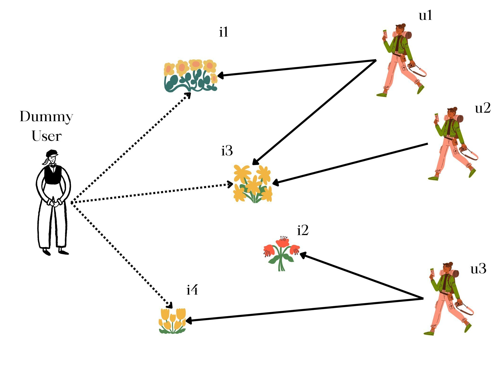

<!-- SEO SUMMARY: Recommender Systems can be improved by incorporating side information about users and items, even when this information is scarce. This article proposes using auxilary users and auxilary items, 
to inject additional connections into collaborative filtering models like matrix factorization. For example, an auxilary user could link together all items of the same genre. This couples similar items and helps 
the model identify related content. The same approach works for sparse user metadata.

Potential benefits of this approach over neural networks include simplicity, transparency, efficiency, flexibility, and interpretability. Downsides are handling dense features and adding complexity with many auxilary nodes.

The approach provides a lightweight way to get value from categorical side data. It balances simplicity and accuracy. For many common cases with limited side info, auxilary nodes offer straightforward improvements. -->

# Recommender Systems

Recommender Systems are becoming increasingly important, given the plethora of products offered to the users/customers. For example, in early days, fashion retailers developed basic versions of content-based recommenders that served quite well, but soon the need emerged for more relevant recommendations that could increase user’s engagement. At the moment of this writing, fashion retailers use far more sophisticated approaches that make use not only of the user’s purchasing/viewing history, but also of user and item metadata: user age, location, spending habits, mood, etc.; item category, popularity, etc.

However, it is sometimes the case that only scarce side information about the users or the items is available to us. Consider, for example, a public service provider that has its own audio- and video-on-demand platform; such companies have restrictions with regard to collecting/storing user metadata. But even in this case, we still have useful information about the items that are served, such as genre, popularity, etc. Still, developers often disregard this side information, because it is scarce, and proceed with collaborative-filtering (CF) approaches, which make use of the historical interactions only (data consisting of user-item pairs). While CF work reasonably well in this use case - extrapolate user preferences via similarities of all-user’s browsing/purchasing history - one question remains: can we improve on the quality by (somewhow) making use of available information, regardless how scarce? More precisely, can we use the collaborative filtering paradigm in this case, with this scarce side info? Yes, there are libraries that allow us to ‘inject’ side information (LightFM, for example). But there is also a way to extend the most efficient and effective collaborative filtering models, such as ALS Matrix Factorization (MF) (the Python ‘implicit’ library) or EASE, to make use of the side information.

### Recommender Systems as Graphs

Before we go into details on how this is achieved (at you’d be surprised how easily!), let’s take a step back and try to observe the typical matrix factorization approach through the lens of graph algorithms. The user-item interaction matrix can be observed as an adjacency matrix of a bipartite graph (‘bi’, because there are two groups of nodes, users and items, and link can exist only between nodes belonging to different groups). The rating recovered (predicted) by the MF approach can be seen as the predicted weight of the edge existing between that particular user-item pair. So, in the end, the recommendations for a user are actually the most likely links this user is going to establish in the future (with the information on the weight of these links).

(We deliberately took a detour and observed the problem via graphs. Note that this approach is known as ‘joint matrix factorization’ in the literature).

Once the problem is understood as inherently a graph problem, it is easy to see how additional information can be added. What we want to achieve is to somehow let the algorithm know about the new links, which would help group similar items or users together. In other words, we want to ‘inject’ new nodes, which would link the nodes belonging to the same group. How could this be achieved? For the sake of simplicity, let’s assume that only genre information is available on the items. In this case, for each genre, we add a dummy user whose interactions are items that belong to this genre. In such a way, given a graph of user and item nodes, the new dummy user allows for coupling of same-genre items, which in turns helps the model.

#### Illustration

Have a look at the illustration above. There are three users, U1, U2 and U3, and four items, I1, I2, I3, I4. The user U1 has interacted with items I1 and I3. Now, there is a dummy user, UD, who links the items that have the same color (I1, I3, I4). This increases the chances of item I4 to be recommended to user U1.

#### Adaptation

As discussed above, we only need to add dummy data: in case of only item side information available, add dummy users; in case of only user side information available, add dummy items; in case both the user and the item information is available, add both the dummy users and the dummy items. Obviously, the dummy nodes should not be part of recommendations; these nodes are only there to help ‘inject’ some ‘commonality’ of the nodes belonging to a certain group.

Beside MF, the same approach can be used with EASE, for example, or with an explicitly graph-based approach for recommendations such as PageRank. In fact, with PageRank, the walks would include the dummy nodes.

One question remains: which weights (ratings) to put for the dummy user interactions? We suggest you first start with low weights, and see how the quality of the recommendations changes.

### Potential problems

Obviously, the addition of dummy nodes increases the computational and memory complexity, but in most cases this is a negligible compromise, given the scarcity of the side information. In an audio-on-demand platform, with 250K items in the catalog, there were a few hundred item categories only.

#### Real-world use case

The ALS-based model described above improved upon the production model in an offline evaluation carried on data of one of the most popular audio-on-demand platforms in Germany.

#### Numerical data as side information

A natural question: what to do in case the side information is numerical, not categorical? In this case we advise either of the following two:

1. Inject a dummy user, with weights being scaled numerical values
2. Analyze the distribution of the numerical data, and build categories based on value ranges

### Comparison with LightFM and Neural Collaborative Filtering

There are several potential advantages of using dummy nodes to inject side information compared to methods like LightFM or neural collaborative filtering:

-  Simplicity - Dummy nodes provide a very simple way to incorporate side information into existing matrix factorization or graph-based models without major architecture changes.

-  Transparency - The dummy nodes have a clear interpretation and their impact on recommendations can be analyzed directly. This differs from neural networks where the impact of side features may be opaque.

-  Efficiency - Dummy nodes avoid making the core recommendation model significantly more complex, which could slow training and serving. LightFM and neural networks add more parameters and computation.

-  Flexibility - Dummy nodes provide a generic way to input any categorical side features, whereas neural networks require specific input layers designed for each feature type.

-  Interpretability - Adding explicit dummy node connections maintains the interpretability of similarity-based recommendation models. Neural networks act as "black boxes".

However, there are also some potential disadvantages compared to LightFM and neural methods:

- Not ideal for dense/continuous side features
- Adding many dummy nodes can degrade performance
- Harder to incorporate temporal dynamics

In summary, dummy nodes provide a simple and transparent way to get some value from side information, but may not be as powerful as neural networks or specialized hybrid methods for complex, dense side features. The tradeoff is simplicity and interpretability versus model expressiveness.

The best approach depends on the use case, model constraints, types of side information available, and how much model accuracy can be sacrificed for simplicity. For many common cases with limited categorical side data, dummy nodes could provide a "good enough" improvement with little added complexity.

---
## Contributors

- [Mirza Klimenta, PhD](https://www.linkedin.com/in/mirza-klimenta/)