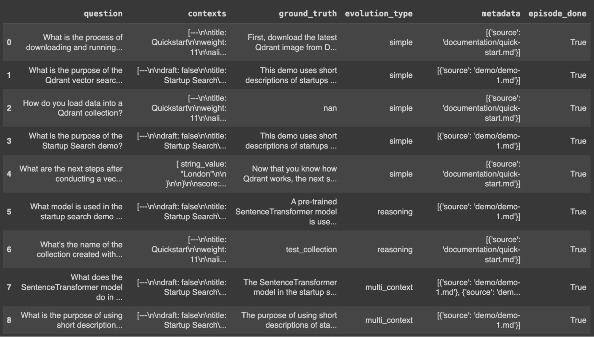
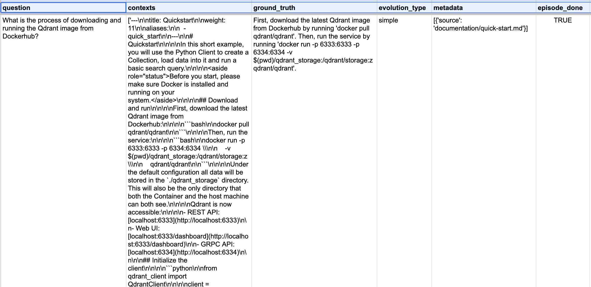
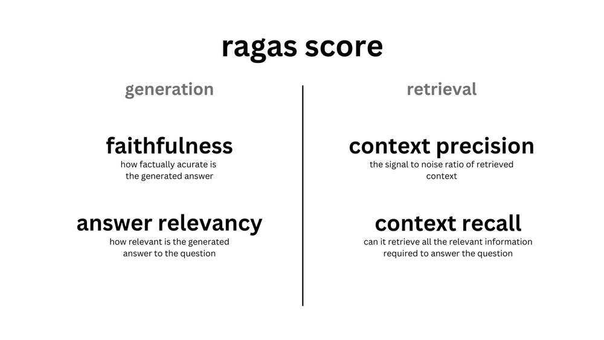
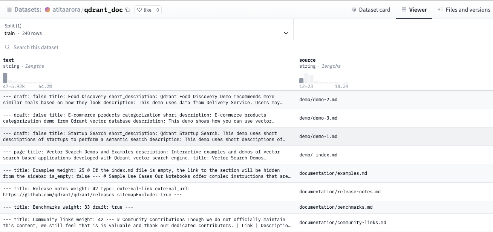
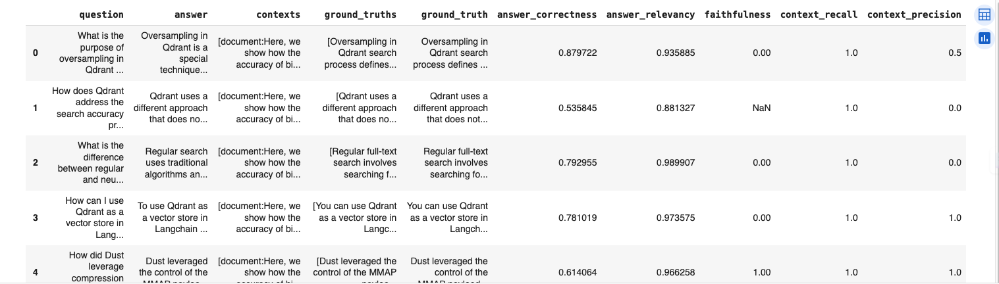
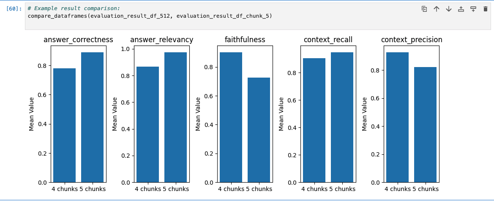

<!--Second of a three-part (monthly) series on RAG evaluation. In this article, we introduce RAG evaluation and its challenges, outline the broad strokes of an effective evaluation framework, and provide an overview of the kinds of evaluation tools and approaches you can use to evaluate your RAG application. We also provide useful links to articles on RAG, RAG evaluation, a vector database feature matrix, and discuss Golden Sets, BLEU and ROUGE, and more. -->

# Evaluating Retrieval Augmented Generation using RAGAS

*In this second article of a three-part (monthly) series, we will leverage the knowledge and concepts we built in part one where we introduced RAG evaluation, challenges, proposed an evaluation framework, and provided an overview of the various tools and approaches you can use to evaluate your RAG application.*

In this part , building on our theoretical concepts of RAG we will put them into practice to walk you through our first in series RAG evaluation framework [RAGAS](https://docs.ragas.io/).

If you haven’t read the first part, read it [here](https://superlinked.com/vectorhub/articles/evaluating-retrieval-augmented-generation-framework).

This framework is based on the [paper](https://arxiv.org/pdf/2309.15217) from the authors , highly recommended to read through. Ragas aims to provide useful and actionable metrics using as little annotated data as possible, cheaper, and faster using LLMs to evaluate your RAG pipeline.

As [summarised](https://superlinked.com/vectorhub/evaluating-retrieval-augmented-generation-a-framework-for-assessment%23S1bk_&sa=D&source=editors&ust=1712248322105041&usg=AOvVaw2HS8eHu-8FLtIIF6qwFB7e) in the first article:

*An effective framework is essential to evaluate similarity and content overlap between generated response and ground-truths. To facilitate the same the first step is to create an evaluation dataset with questions , answers / ground truth with relevant context.*

Also , a lot has happened since the first article , explicitly, the debate about if RAG is [still valuable](https://qdrant.tech/articles/rag-is-dead) when we have long-context LLMs (Large Language Models) like Gemini.

While Large Language Models (LLMs) exhibit impressive memory capacities, the incorporation of Retrieval Augmented Generation (RAG) introduces a specialised framework for tracing data lineage, a crucial facet in various scenarios.

The extensive context windows of LLMs could potentially synergize with RAGs, bolstering their aptitude for handling multifaceted tasks or addressing concurrent challenges. Beyond mere information retrieval, RAGs encompass a spectrum of functionalities including ranking, privacy management, and access control.

However, LLMs equipped with elongated context windows may grapple with focusing on pertinent details amidst expansive information repositories, notwithstanding their comprehensive scope facilitating thorough data analysis.

RAGs play a particularly pivotal role in enterprise applications, offering essential features such as control, auditability, and security that may not be fully addressed through direct interactions with LLMs alone.

Now that we have reemphasised the importance and relevance of RAG, let's look at what this article plans to cover.

1) **Synthetic Evaluation Dataset**<br>
   a) Significance of evaluation dataset<br>
   b. Different way to build it<br>
   c. FAQs and Suggestions<br>
2) **Metrics**<br>
   a. Different metrics provided by the framework<br>
   b. Choosing the right metrics for your use cases<br>
   c. Learning to decode the metric values<br>
3) **Learning to use evaluation dataset to evaluate given metrics**<br>
4) **Code walkthrough and reference notebook**<br>

>  💡 In this article, we utilize two Hugging Face datasets: [qdrant_doc](https://huggingface.co/datasets/atitaarora/qdrant_doc) and [qdrant_doc_qna](https://huggingface.co/datasets/atitaarora/qdrant_doc_qna). The dataset [qdrant_doc](https://huggingface.co/datasets/atitaarora/qdrant_doc) serves as the reference dataset upon which our Retrieval-Augmented Generation (RAG) solution is built. On the other hand, the dataset [qdrant_doc_qna](https://huggingface.co/datasets/atitaarora/qdrant_doc_qna) is employed as the golden-set for evaluation purposes. Keep this distinction in mind as you follow along with our analysis and results.


### **Synthetic Evaluation Dataset**

Right from the ages of relevance evaluation and assessment of information retrieval systems we have known and acknowledged the importance of the golden set or evaluation dataset.
Usually , this set contains triplets of queries , document id , relevance scores , in the similar way for RAG evaluation our queries are replaced by questions , document id is replaced by chunk_id or chunk text or an answer or a ground truth and instead of relevance scores - we leverage context texts to provide an optimal evaluation record. Optionally we could add a complexity of the question which is useful for categorising the performance of our RAG system as covered in the first article.
Addressing the elephant-in-the-room , how do we get on and create one of these evaluation dataset for a problem like RAG.

We got you covered , and here are some techniques you can use to create one of your own.

>  💡 Note: Some of the techniques below may involve using **OpenAI** to generate the questions on the chunked document.

To make some sensible set of questions - we need to use targeted snippets to ensure our questions as well as answers are crisp.

#### 1) **Method 1 - Using T5**

So our first method involves using the [T5](https://huggingface.co/docs/transformers/en/model_doc/t5) model. Make sure to have `pip install transformers` before you use it.

```python
from transformers import T5ForConditionalGeneration, T5TokenizerFast
hfmodel = T5ForConditionalGeneration.from_pretrained("ThomasSimonini/t5-end2end-question-generation")
checkpoint = "t5-base"
model = T5ForConditionalGeneration.from_pretrained(checkpoint)
tokenizer = T5TokenizerFast.from_pretrained(checkpoint)
tokenizer.sep_token = '<sep>'
tokenizer.add_tokens(['<sep>'])
model.resize_token_embeddings(len(tokenizer))
# Check the sep_token_id to verify that it was added to the tokenizer
tokenizer.sep_token_id

def hf_run_model(input_string, **generator_args):
  generator_args = {
  "max_length": 256,
  "num_beams": 4,
  "length_penalty": 1.5,
  "no_repeat_ngram_size": 3,
  "early_stopping": True,
  }
  input_string = "generate questions: " + input_string + " </s>"
  input_ids = tokenizer.encode(input_string, return_tensors="pt")
  res = hfmodel.generate(input_ids, **generator_args)
  output = tokenizer.batch_decode(res, skip_special_tokens=True)
  output = [item.split("<sep>") for item in output]
  return output
```

Using it to create a question for the given text as :

```python
text_passage = "What is Qdrant? [Qdrant](http://qdrant.tech) is a vector similarity search engine that provides a \
production-ready service with a convenient API to store, search, and manage points (i.e. vectors) with an additional payload.\
You can think of the payloads as additional pieces of information that can help you hone in on your search and also receive \
useful information that you can give to your users. You can get started using Qdrant with the Python `qdrant-client`, \
by pulling the latest docker image of `qdrant` and connecting to it locally, or by trying out [Qdrant's Cloud](https://cloud.qdrant.io/) \
free tier option until you are ready to make the full switch. With that out of the way, let's talk about what are vector databases."

hf_run_model(text_passage)

##Outputs 
#[['What is Qdrant?',
# ' How can you get started using Qrant with the Python qdrant-client']]
```

As you can see it gives you a pretty sensible set of questions, provided you can surface the answers manually.


#### 2) **Method 2 -  Using OpenAI.**

```python
import openai
from getpass import getpass
import os

if not (OPENAI_API_KEY := os.getenv("OPENAI_API_KEY")):
    OPENAI_API_KEY = getpass("🔑 Enter your OpenAI API key: ")
openai.api_key = OPENAI_API_KEY
os.environ["OPENAI_API_KEY"] = OPENAI_API_KEY

model ="gpt-3.5-turbo"
client = OpenAI()

 # Function to generate synthetic question-answer pairs
def generate_question_answer(context):

  prompt = f"""Generate a question and answer pair based keeping in mind the following: 
  Please generate a clear and concise question that requires understanding of the content provided in the document chunk. Ensure that the question is specific, relevant, and not too broad.
  Avoid questions such as 'in the given passage or document chunk' kind of questions. Ensure the question is about the concept the document chunk is about.
  Provide a complete , detailed and accurate answer to the question. Make sure that the answer addresses the question directly and comprehensively, drawing from the information provided in the document chunk.
  Use technical terminology appropriately and maintain clarity throughout the response.
  Based on this Context : {context}
  """
        
  response = client.chat.completions.create(
        model = model,
        messages = [ 
        {'role': 'user', 'content': prompt}
          ],
        temperature=0.5,
        max_tokens=200,
        n=1,
        stop=None
    )
  return response.choices[0].message.content
```

Using the subroutine above to generate question and answer/ground-truth pairs as :

```python
# Generate question-answer pairs for the given chunk

context = "What is Qdrant? [Qdrant](http://qdrant.tech) is a vector similarity search engine that provides a \
production-ready service with a convenient API to store, search, and manage points (i.e. vectors) with an additional payload.\
You can think of the payloads as additional pieces of information that can help you hone in on your search and also receive \
useful information that you can give to your users. You can get started using Qdrant with the Python `qdrant-client`, \
by pulling the latest docker image of `qdrant` and connecting to it locally, or by trying out [Qdrant's Cloud](https://cloud.qdrant.io/) \
free tier option until you are ready to make the full switch. With that out of the way, let's talk about what are vector databases."

question_answer_pair = generate_question_answer(context)
print(question_answer_pair)

## Outputs 
# Q . What is Qdrant and how can it be used in vector similarity search?
# A . Qdrant is a vector similarity search engine that offers a production-ready service with an API for storing, searching, and managing points (vectors) along with additional payload information. The payloads can provide extra details to refine searches and offer valuable information to users. Qdrant can be utilized through the Python `qdrant-client`, by downloading the latest docker image of `qdrant` and connecting to it locally, or by exploring the free tier option of [Qdrant's Cloud](https://cloud.qdrant.io/) before transitioning to the full version.
```

We saw another way to generate questions along with answers/ground-truth using OpenAI prompts this time.

However , as we are discussing about RAGAS , it comes with an easier way to generate Question-Context-Ground_Truth set and rather a complete baseline evaluation dataset [utility](https://docs.ragas.io/en/latest/getstarted/testset_generation.html) in RAGAS , using your dataset in just a couple of lines of code as below.

```python
## Test Evaluation Dataset Generation using Ragas
from langchain.docstore.document import Document as LangchainDocument
from ragas.testset.generator import TestsetGenerator
from ragas.testset.evolutions import simple, reasoning, multi_context

# load dataset from which the questions have to be created 
dataset = load_dataset("atitaarora/qdrant_doc", split="train")

#Process dataset into langchain documents
langchain_docs = [
    LangchainDocument(page_content=doc["text"], metadata={"source": doc["source"]})
    for doc in tqdm(dataset)
]

generator = TestsetGenerator.with_openai()
# using the first 10 docs as langchain_docs[:10] to check the sample questions
testset = generator.generate_with_langchain_docs(langchain_docs[:10], test_size=10, 
                                                 raise_exceptions=False, with_debugging_logs=False,
                                                 distributions={simple: 0.5, reasoning: 0.25, multi_context: 0.25}) 

df = testset.to_pandas()
df.head(10)
```

Which gives us a reasonable set of baseline question-context-ground_truth set as below which could later be used to generate response from our RAG pipeline for evaluation :



Let's zoom into one of the rows to see what did RAGAS generate for us: 



The first column is the `question` generated based on the given list of values of `contexts` along with value of `ground_truth` used to evaluate our `answer` which is going to be surfaced as we run the `question` through our RAG pipeline.
It is a good idea to export them as a hugging-face dataset to be utilised later during the evaluation step.
The techniques above let you build a good evaluation dataset including reasonably good questions and ground-truths to evaluate your RAG system.
---

> 💡 An essential aspect to consider is the creation of an evaluation dataset with `answer` for each tuning cycle. This suggests developing a subroutine that facilitates the construction of evaluation dataset in the expected RAGAS format, as illustrated above, utilizing the provided questions and executing them through your RAG system.

A sample subroutine may look like this below :

```python
## Prepare the evaluation dataset to evaluate our RAG system
from datasets import Dataset

# RAGAS Expect ['question', 'answer', 'contexts', 'ground_truths'] format
'''
{
    "question": ['What is quantization?', ...], 
    "answer": [], ## answer
    "contexts": [], ## context
    "ground_truths": [] ## answer expected
}
'''
# loading the eval dataset from HF
qdrant_qa = load_dataset("atitaarora/qdrant_doc_qna", split="train")

questions = []
answers = []
contexts = []
ground_truths = []

for query in qdrant_qa:
    question = query["question"]
    questions.append(question)
    ground_truths.append([query["answer"]])
    
    rag_response = query_with_context(question)
    answers.append(rag_response)
    search_result_context = client.query(collection_name=COLLECTION_NAME, query_text=question,limit=4)
    context = ["document:"+r.document+",source:"+r.metadata['source'] for r in search_result_context]
    contexts.append(context)    

rag_response_data = {
    "question": questions,
    "answer": answers,
    "contexts": contexts,
    "ground_truths": ground_truths
}

## The dataset used to evaluate RAG using RAGAS
## Note this is the dataset needed for evaluation hence has to be recreated everytime changes to RAG config is made
rag_response_dataset = Dataset.from_dict(rag_response_data)
# Might as well export it as a csv with some recognizable experiment name like chunk size 512
rag_response_dataset.to_csv('rag_chunk_512.csv')
```
 

The subroutine here uses an abstraction of your RAG pipeline `query_with_context()` method , we will show a sample naive-rag example in a bit. It uses the older format with `ground_truths` which is the list on ground_truth strings while the latest format asserts to use `ground_truth` as a string value. You can choose your preferred format. 

Now that we have a baseline as well as the subroutine to create evaluation dataset .

Let us understand what all can you measure with RAGAS.

### Metrics

It is a good idea to check out [core concepts](https://docs.ragas.io/en/latest/concepts/index.html) of RAGAS , at this stage.

RAGAS is focused on retrieval and generation stages of RAG along with End-to-End evaluation of RAG and it relies on concept of [metrics driven development](https://docs.ragas.io/en/latest/concepts/metrics_driven.html)



The key metrics you can evaluate currently using RAGAS are as below :

- [Faithfulness](https://docs.ragas.io/en/latest/concepts/metrics/faithfulness.html) - Scaled between 0 and 1, it measures factual consistency of the answer. The preference given to faithfulness score being closer to 1 signifying higher consistency. It is measured as :

```notion
Faithfulness score = (Number of claims in the generated answer that can be inferred from given context) / 
										 (Total number of claims in the generated answer)
```

and uses context and answer fields from .

- [Answer relevancy](https://docs.ragas.io/en/latest/concepts/metrics/answer_relevance.html) - Answer relevance of an answer is based on direct alignment with the original question, not factuality. The assessment penalizes incomplete or redundant responses using cosine similarity with questions generated from the answer to gauge alignment with the original question. This metric essentially is expected to range between 0 and 1 although due to the nature of cosine similarity it can be expected in the range of -1 to 1.
  This metric is computed using the question, the context and the answer.


- [Context recall](https://docs.ragas.io/en/latest/concepts/metrics/context_recall.html) - It is computed based on the ground truth and the retrieved context. The values range between 0 and 1, with higher values indicating better performance. To accurately estimate context recall from the ground truth answer, each sentence in the ground truth answer is analyzed to determine if it aligns with the retrieved context or not. It is calculated as :

```notion
context recall = (Ground truth sentences that can be attributed to context) / 
								 (Number of sentences in Ground truth)
```

- [Context precision](https://docs.ragas.io/en/latest/concepts/metrics/context_precision.html) - It is computed based on question, ground_truth and the contexts from the evaluation dataset. The value ranges between 0 and 1, with higher values indicating better performance.Context Precision is used to evaluate whether all relevant items in a given context are ranked highly. It is calculated as :

```notion
Context Precision@K = (Precision@K * Relevance of K) / 
										  (Total number of relevant items in the top K)

where
Relevance of K =  1 for relevant / 0 for irrelevant items
K = number of chunks
```

- [Context relevancy](https://docs.ragas.io/en/latest/concepts/metrics/context_relevancy.html) - It is computed based on the relevancy of the retrieved context with respect to the question. The value ranges between 0 and 1, with higher values indicating better relevancy. It is calculated as :

```notion
context relevancy = (Number of relevant sentences within the retrieved) / 
										(Total number of sentences in retrieved context)
```

- [Context entity recall](https://docs.ragas.io/en/latest/concepts/metrics/context_entities_recall.html) - This metric evaluates entity retrieval based on comparison with ground truth entities to ensure relevant context coverage.The value ranges between 0 and 1, with higher values indicating better entity recall. It is calculated as :

```notion
context entity recall = (Entities in context ∩ Entities in Ground Truth) / 
												(Entities in Ground Truth)
```

- [Answer semantic similarity](https://docs.ragas.io/en/latest/concepts/metrics/semantic_similarity.html) - This metric evaluates the semantic similarity between the generated answer and the ground truth. This evaluation is based on the ground truth and the answer, with values ranging between 0 and 1. It is calculated as :

```notion
answer similarity score = cosine similarity (Vector of ground truth , Vector of generated answer)
```

- [Answer correctness](https://docs.ragas.io/en/latest/concepts/metrics/answer_correctness.html) - This metric evaluates the accuracy between the generated answer and the ground truth. This evaluation is based on the ground truth and the answer, with values ranging between 0 and 1. It is calculated as :

```notion
answer correctness = factual correctness (ground truth , generated answer ) + answer similarity score

Where factual correctness is the F1 score calculated using ground truth and generated answer.
```


#### **Choosing the right metrics for your use cases**

Ragas focuses on evaluating mainly Retrieval and Generation phases of your RAG pipeline and offers metrics to :

- **Evaluate Retrieval**: *context_relevancy* and *context_recall*, which give you the fair measure of the efficiency of your retrieval system.
- **Evaluate Generation**: *faithfulness* to measure the most important aspect when working with LLM i.e. hallucinations and *answer_relevancy* which measures the relevancy of the generated answer wrt to the question.

The harmonic mean of these 4 aspects gives you the ragas score which is a single measure of the performance of your RAG system on the aspects of retrieval and generation.

#### **RAGAS in action**

To understand this further lets build a RAG system on top of Qdrant’s documentation and run the evaluations on top of it.
We are going to be using the pre compiled [hugging-face dataset](https://www.google.com/url?q=https://huggingface.co/datasets/atitaarora/qdrant_doc&sa=D&source=editors&ust=1712248322130408&usg=AOvVaw0Bl7gKES2qQyo88tFWPaZZ) consisting of ‘text’ and ‘source’ of the documentation.



We process this dataset using the choice of our text splitter , chunks size and chunk overlap.

```python
# Retrieve the documents / dataset to be used
dataset = load_dataset("atitaarora/qdrant_doc", split="train")

#Process dataset as langchain document for further processing
from langchain.text_splitter import RecursiveCharacterTextSplitter
from langchain.docstore.document import Document as LangchainDocument

## Dataset to langchain document
langchain_docs = [
    LangchainDocument(page_content=doc["text"], metadata={"source": doc["source"]})
    for doc in tqdm(dataset)
]

#Document chunk processing
#Processing each document with desired TEXT_SPLITTER_ALGO , CHUNK_SIZE , CHUNK_OVERLAP etc

text_splitter = RecursiveCharacterTextSplitter(
    chunk_size=512,
    chunk_overlap=50,
    add_start_index=True,
    separators=["\n\n", "\n", ".", " ", ""],
)

docs_processed = []
for doc in langchain_docs:
    docs_processed += text_splitter.split_documents([doc])
```

We are using [Fastembed](https://qdrant.github.io/fastembed) to make the encoding process of these document chunks lighter and simpler. FastEmbed is a lightweight, fast, Python library built for embedding generation and natively supports embedding creation suitable to use with Qdrant.

```python
## Declaring the intended Embedding Model with Fastembed
from fastembed.embedding import TextEmbedding

pd.DataFrame(TextEmbedding.list_supported_models())
```

You can execute above to get the list of all supported embedding models including the one for generating sparse vector encoding through [SPLADE++](https://huggingface.co/prithivida/Splade_PP_en_v1). We are using default model in this case.

```python
##Initilising embedding model
embedding_model = TextEmbedding()

## For custom model supported by Fastembed
#embedding_model = TextEmbedding(model_name="BAAI/bge-small-en", max_length=512)

## Using Default Model - BAAI/bge-small-en-v1.5
embedding_model.model_name
```

We process the document chunks into text to be processed by Fastembed as :

```python
docs_contents = []
docs_metadatas = []

for doc in docs_processed:
    if hasattr(doc, 'page_content') and hasattr(doc, 'metadata'):
        docs_contents.append(doc.page_content)
        docs_metadatas.append(doc.metadata)
    else:
        # Handle the case where attributes are missing
        print("Warning: Some documents do not have 'page_content' or 'metadata' attributes.")

print("content : ",len(docs_contents))
print("metadata : ",len(docs_metadatas))
```

Now we set up qdrant client to ingest these document chunk encoding into our knowledge store which is Qdrant in this case :

```python

##Uncomment to initialise qdrant client in memory
client = qdrant_client.QdrantClient(
    location=":memory:",
)

##Uncomment below to connect to Qdrant Cloud
#client = qdrant_client.QdrantClient(
#    "QDRANT_URL", 
#    api_key="QDRANT_API_KEY",
#)

## Uncomment below to connect to local Qdrant
#client = qdrant_client.QdrantClient("http://localhost:6333")
```

And define our `collection name`

```python
## Collection name that will be used throughtout in the notebook
COLLECTION_NAME = "qdrant-docs-ragas"
```

There are some collection level operations which are **Good-to-know** in case they are needed :

```python
## General Collection level operations

## Get information about existing collections
client.get_collections()

## Get information about specific collection
#collection_info = client.get_collection(COLLECTION_NAME)
#print(collection_info)

## Deleting collection , if need be
#client.delete_collection(COLLECTION_NAME)
```

Following this , to add the document chunks into Qdrant Collection is as straightforward as :

```python
client.add(collection_name=COLLECTION_NAME, metadata=docs_metadatas, documents=docs_contents)
```

We can verify the total number of document chunks indexed as :

```python
## Ensuring we have expected number of document chunks
client.count(collection_name=COLLECTION_NAME)

##Outputs
#CountResult(count=4431)
```

You can test searching for the document as :

```python
## Searching for document chunks similar to query for context
search_result = client.query(collection_name=COLLECTION_NAME, query_text="what is binary quantization",limit=2)
context = ["document:"+r.document+",source:"+r.metadata['source'] for r in search_result]

for res in search_result:
    print("Id: ", res.id)
    print("Document : " , res.document)
    print("Score : " , res.score)
    print("Source : " , res.metadata['source'])
```

Now that we’re all set with our knowledge store to provide context to our RAG , lets quickly build it. We are going to write a small sub routine to wrap our prompt , context and response collections.

```python
def query_with_context(query):
    
    ## Fetch context from Qdrant
    search_result = client.query(collection_name=COLLECTION_NAME, query_text=query, limit=4)
    
    contexts = [
        "document:"+r.document+",source:"+r.metadata['source'] for r in search_result
    ]
    prompt_start = (
        "You are a friendly assistant that answers the user's Qdrant vector database related queries\
        in a direct and straightforward way using the provided context. \
        Sometimes you may get 'Hi' or such general queries from the user, \
        in which case, you will ignore the context and just greet them normally. \
        Only use the context if the user query is anything aside from regular pleasantries. \
        Every context item will have \"document:\" and \"source:\" values. \
        Mention the value of \"source\" as 'references' fetched from the value of the 'source:' \
        in the context passed along with your answer. \
        Provide detailed answers to the user's query. \
        If you can't find the answer, do not pretend you know it, but answer 'I don't know'.\n "
        
        "Context:\n"
    )
    
    prompt_end = (
        f"\n\nQuestion: {query}\nAnswer:"
    )
    
    prompt = (
        prompt_start + "\n\n---\n\n".join(contexts) + 
        prompt_end
    )

    res = openai_client.completions.create(
        model="gpt-3.5-turbo-instruct",
        prompt=prompt,
        temperature=0,
        max_tokens=636,
        top_p=1,
        frequency_penalty=0,
        presence_penalty=0,
        stop=None
    )
    
    return (res.choices[0].text)
```

Try out running your first query through your RAG pipeline as :

```python
print (query_with_context(query = "what is quantization?"))

##Outputs 
#Quantization is a feature in Qdrant that allows for efficient storage and search of high-dimensional vectors by transforming them into a new representation while preserving relative distances between vectors. This feature leverages the power of quantum computing and quantum entanglement to create highly efficient vector search algorithms.
```

One key thing to understand is that RAGAS work inherently with datasets for evaluations for it is a good idea to create a set of questions and ground truth to help create an evaluation dataset to assess our RAG system. We are leveraging the dataset [https://huggingface.co/datasets/atitaarora/qdrant_doc_qna](https://huggingface.co/datasets/atitaarora/qdrant_doc_qna) to create our evaluation set from our RAG pipeline and execute it as shown [before](https://www.notion.so/Evaluating-RAG-with-RAGAS-ef0de436a00748c7bba9fd7161cd76cc?pvs=21).

### Lets evaluate , how good is our RAG !!

Its as simple as importing the desired metrics:

```python
from ragas.metrics import (
    answer_relevancy,
    faithfulness,
    context_recall,
    context_precision,
    answer_correctness
)
```

And running the evaluation as :

```python
result = evaluate(
    rag_response_dataset,
    metrics=[
        answer_correctness,
        answer_relevancy,
        faithfulness,
        context_recall,
        context_precision
    ],
)

## Lets look at our results

evaluation_result_df_chunk_size_512 = result.to_pandas()

evaluation_result_df_chunk_size_512.head(5)
```

Which outputs as below :



We notice in some of our queries the context precision and answer correctness is quite low (or even zero). Which indicates the prospective issue with the retrieval chain of our RAG system.

This issue could be impacted by :

- Number of chunks retrieved
- Size of chunks
- Chunk overlap size
- Choice of Embedding model

Let’s try to change the document chunk retrieval from **4** to **5** and find out if it improves our metrics. We will make a change to our RAG with a context method to retrieve **5** instead of **4** chunks and recreate the evaluation dataset.
Followed by re-running the RAGAS evaluations.

We add some visualisations to enable smoother comparison and this is what it looks after the changes.



We can see the metrics impacted by this change and can assess if they are moving in the desired direction. Please remember this is an iterative process and you can try our other suggested changes to evaluate what works better for your given usecase.

The complete version of this code and notebook is available at  - [https://github.com/qdrant/qdrant-rag-eval/tree/master/workshop-rag-eval-qdrant-ragas](https://github.com/qdrant/qdrant-rag-eval/tree/master/workshop-rag-eval-qdrant-ragas).

Don’t forget to star and contribute your experiments. Goes without saying that any feedback or improvement is very welcome.

The next in series is the similar code walk through of using [Arize Phoenix](https://phoenix.arize.com/) with your RAG system.

Until next time - *Stay tuned* !

