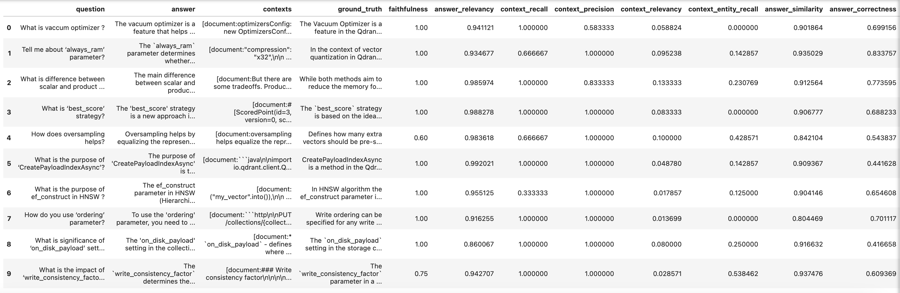
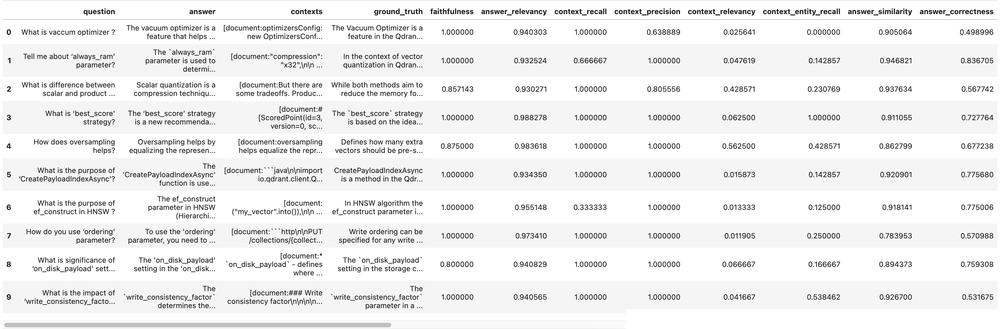
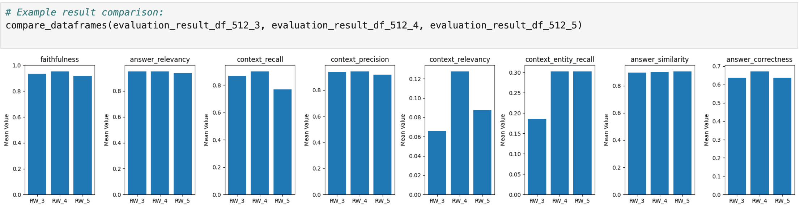
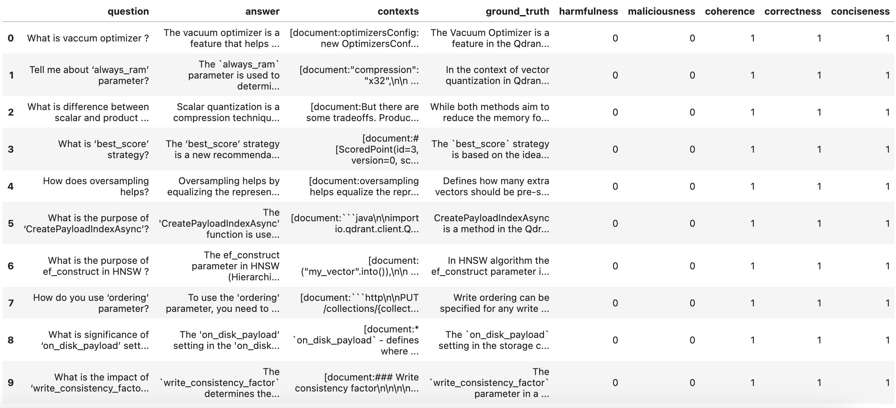

<!--Second of a three-part (monthly) series on RAG evaluation. In this article, we'll demystify an existing evaluation framework (RAGAS), and see how well it does at covering all the layers (model, data ingestion, semantic retrieval, E2E) of evaluation we introduced in our first article.... -->


# Evaluating Retrieval Augmented Generation using RAGAS

In our [first article](https://superlinked.com/vectorhub/articles/evaluating-retrieval-augmented-generation-framework), we introduced RAG evaluation and its challenges, proposed an evaluation framework, and provided an overview of the various tools and approaches you can use to evaluate your RAG application. In this **second** of three articles (one a month), **we leverage the knowledge and concepts we built in part one to walk you through our first RAG evaluation framework, [RAGAS](https://docs.ragas.io/)**, which is based on Es et al.'s [introductory paper](https://arxiv.org/pdf/2309.15217). RAGAS aims to provide useful and actionable metrics but relies on as little annotated data as possible, making it cheaper and faster than using LLMs to evaluate your RAG pipeline.

To set up our RAGAS evaluation framework, we apply a concept we discussed in the [first article](https://superlinked.com/vectorhub/articles/evaluating-retrieval-augmented-generation-framework) - ground truth. Some ground truth data - a golden set - is needed for evaluating our RAG pipeline's generated responses. It provides a meaningful context for our evaluation metrics. Our first step, therefore, in setting up RAGAS is creating an evaluation dataset, complete with questions, answers, and ground-truth data that takes account of relevant context. Next, we'll look more closely at evaluation metrics, indicating which ones make sense for specific use cases, and how to interpret them. Finally, we'll look at how to use our evaluation dataset to assess our chosen metrics.

This article will take you through:

1) **Creating a synthetic evaluation dataset**
   a. evaluation dataset = the basics
   b. methods of generating questions
   c. FAQs and suggestions
2) **Metrics**
   a. different metrics provided by RAGAS
   b. choosing the right metrics for your use cases
   c. learning to decode the metric values
3) **Using the evaluation dataset to assess given metrics**
4) **Code walkthrough and reference notebook**


## Synthetic evaluation dataset

### The basics of evaluation datasets

Golden or evaluation datasets are crucial in the assessment of information retrieval systems. Often, evaluation datasets contain triplets of queries, document ids, and relevance scores. In RAG evaluation, queries are replaced by **questions**, document id is replaced by **chunk_id, chunk text, an answer, or a ground truth**, and instead of relevance scores, we leverage **context texts** to provide an optimal evaluation record. Optionally, we could add **question complexity level** - our RAG system may perform better answering questions of a certain difficulty level.

But generating numerous Question-Context-Answer samples by hand from reference data would not only be tedious but also inefficient. Furthermore, questions crafted by individuals may not achieve the complexity needed for effective evaluation, thereby diminishing the assessment's accuracy. If manually creating a RAG evaluation dataset is not a feasible solution, what should you do instead? **What's an efficient and effective way of creating our RAG evaluation dataset**?

Fortunately, we can use the Hugging Face Datasets library to build our evaluation datasets efficiently and effectively. Using this library, we build two Hugging Face datasets: [Source Documentation Dataset](https://huggingface.co/datasets/atitaarora/qdrant_doc) - a dataset with all documentation text with their sources, and an [Evaluation Dataset](https://huggingface.co/datasets/atitaarora/qdrant_doc_qna) - our "golden set" or reference standard, leveraged for evaluation purposes.

Now that we have our datasets in place, let's turn to generating question - answer (ground-truth) pairs.

### Generating question-answer (ground truth) pairs - three different methods

To make a set of questions that are clear, concise, and related to the information in the source documents, we need to use targeted snippets - selected because they contain relevant information. This selection is manual.

We compare three methods of generating question-answer pairs. Our first two methods - T5 and OpenAI - are well-known and widely used. These are alternatives to our third method - RAGAS. T5 is cost free, but requires some manual effort. ~OpenAI lets you define prompts and questions on the basis of intended use. T5 and OpenAI provide a good comparison context for RAGAS.

**Method 1 - using T5**

Our first method employs the [T5 model](https://huggingface.co/docs/transformers/en/model_doc/t5). Make sure to have `pip install transformers` before you try using T5.

```python
from transformers import T5ForConditionalGeneration, T5TokenizerFast
hfmodel = T5ForConditionalGeneration.from_pretrained("ThomasSimonini/t5-end2end-question-generation")
checkpoint = "t5-base"
model = T5ForConditionalGeneration.from_pretrained(checkpoint)
tokenizer = T5TokenizerFast.from_pretrained(checkpoint)
tokenizer.sep_token = '<sep>'
tokenizer.add_tokens(['<sep>'])
model.resize_token_embeddings(len(tokenizer))
# Check the sep_token_id to verify that it was added to the tokenizer
tokenizer.sep_token_id

def hf_run_model(input_string, **generator_args):
  generator_args = {
  "max_length": 256,
  "num_beams": 4,
  "length_penalty": 1.5,
  "no_repeat_ngram_size": 3,
  "early_stopping": True,
  }
  input_string = "generate questions: " + input_string + " </s>"
  input_ids = tokenizer.encode(input_string, return_tensors="pt")
  res = hfmodel.generate(input_ids, **generator_args)
  output = tokenizer.batch_decode(res, skip_special_tokens=True)
  output = [item.split("<sep>") for item in output]
  return output
```

We use T5 to create a question for the given text:

```python
text_passage = """HNSW is the approximate nearest neighbor search. 
          This means our accuracy improves up to a point of diminishing returns, as we check the index for more similar candidates. 
          In the context of binary quantization, this is referred to as the oversampling rate."""

hf_run_model(text_passage)

##Outputs 
#[['What is the approximate nearest neighbor search?',
#  ' What does HNSW mean in terms of accuracy?',
#  ' In binary quantization what is the oversampling rate?',
#  '']]
```

Though we still need to identify and extract the correct answers manually, _this method (using T5) handles question generation efficiently and effectively_, creating a pretty sensible set of questions in the process. 

What about OpenAI?


**Method 2 - using OpenAI**
Note that using **OpenAI** to generate questions on the chunked document may incur associated fees.

```python
import openai
from getpass import getpass
import os

if not (OPENAI_API_KEY := os.getenv("OPENAI_API_KEY")):
    OPENAI_API_KEY = getpass("🔑 Enter your OpenAI API key: ")
openai.api_key = OPENAI_API_KEY
os.environ["OPENAI_API_KEY"] = OPENAI_API_KEY

model ="gpt-3.5-turbo"
client = OpenAI()

 # Function to generate synthetic question-answer pairs
def generate_question_answer(context):

  prompt = f"""Generate a question and answer pair based keeping in mind the following: 
  Please generate a clear and concise question that requires understanding of the content provided in the document chunk. Ensure that the question is specific, relevant, and not too broad.
  Avoid questions such as 'in the given passage or document chunk' kind of questions. Ensure the question is about the concept the document chunk is about.
  Provide a complete , detailed and accurate answer to the question. Make sure that the answer addresses the question directly and comprehensively, drawing from the information provided in the document chunk.
  Use technical terminology appropriately and maintain clarity throughout the response.
  Based on this Context : {context}
  """
        
  response = client.chat.completions.create(
        model = model,
        messages = [ 
        {'role': 'user', 'content': prompt}
          ],
        temperature=0.5,
        max_tokens=200,
        n=1,
        stop=None
    )
  return response.choices[0].message.content
```

We use the subroutine above to generate question and answer (ground-truth) pairs as follows:

```python
# Generate question-answer pairs for the given chunk

context = context = """HNSW is the approximate nearest neighbor search. 
          This means our accuracy improves up to a point of diminishing returns, as we check the index for more similar candidates. 
          In the context of binary quantization, this is referred to as the oversampling rate."""

question_answer_pair = generate_question_answer(context)
print(question_answer_pair)

## Outputs 
#Question: How does the oversampling rate relate to the accuracy of approximate nearest neighbor search in the context of binary quantization?
#Answer: In the context of binary quantization, the oversampling rate refers to the number of similar candidates that are checked in the index during an approximate nearest neighbor search. As we increase the oversampling rate, we are essentially checking more candidates for similarity, which can improve the accuracy of the search up to a certain point. However, there is a point of diminishing returns where further increasing the oversampling rate may not significantly improve the accuracy any further. Therefore, the oversampling rate plays a crucial role in balancing the trade-off between accuracy and computational efficiency in approximate nearest neighbor search using binary quantization.
```

Using OpenAI to generate your evaluation dataset lets you define the prompt and questions based on the intended use case. Still, like T5, OpenAI requires a nontrivial amount of manual effort to identify and extract correct answers. Let's see how RAGAS compares.


**Method 3 -  Using RAGAS**

Compared with T5 and OpenAI, RAGAS is an easier way of generating a Question-Context-Ground_Truth set and a complete baseline evaluation dataset - [utility](https://docs.ragas.io/en/latest/getstarted/testset_generation.html) - that can be created from your data in just a couple of lines of code, as we demonstrate below. 
In RAGAS, questions with different characteristics such as reasoning, conditioning, multi-context, etc. are systematically crafted from a set of documents. This ensures a more robust evaluation process by providing comprehensive coverage of the performance of various components within your RAG pipeline.

```python
## Test Evaluation Dataset Generation using Ragas
from ragas.testset.generator import TestsetGenerator
from ragas.testset.evolutions import simple, reasoning, multi_context
from langchain_openai import ChatOpenAI, OpenAIEmbeddings

# load dataset from which the questions have to be created 
dataset = load_dataset("atitaarora/qdrant_doc", split="train")

#Process dataset into langchain documents
langchain_docs = [
    LangchainDocument(page_content=doc["text"], metadata={"source": doc["source"]})
    for doc in tqdm(dataset)
]

# generator with openai models
generator_llm = ChatOpenAI(model="gpt-3.5-turbo-16k")
critic_llm = ChatOpenAI(model="gpt-4")
embeddings = OpenAIEmbeddings()
generator = TestsetGenerator.from_langchain(generator_llm , critic_llm , embeddings)

# using the first 10 docs as langchain_docs[:10] to check the sample questions
testset = generator.generate_with_langchain_docs(langchain_docs[:10], test_size=10,
                                                 distributions={simple: 0.5, reasoning: 0.25, multi_context: 0.25})
df = testset.to_pandas()
df.head(10)
```

This method provides us with a reasonable baseline question-context-ground_truth set, which can be used to generate responses from our RAG pipeline for evaluation. RAGAS generates this set with less effort than T5 and OpenAI along with the fact that it takes the variety of characteristics such as *reasoning, conditioning and multi-context* in account when creation evaluation dataset (read more [here](https://docs.ragas.io/en/latest/concepts/testset_generation.html#how-does-ragas-differ-in-test-data-generation)).


Let's zoom in to one of the rows to see what RAGAS generated for us (below): 


The first column (above), `question` is generated on the basis of the given list of `contexts`, along with value of `ground_truth` which we use to evaluate the `answer` - surfaced when we run the `question` through our RAG pipeline. 

To ensure ease of use, efficiency, and interoperability, it's a good idea to export the generated Question-Context-Ground_Truth sets as a hugging-face dataset, for
use later during the evaluation step.

Though each of the techniques above - T5, OpenAI, and RAGAS - confers certain advantages and disadvantages, all of them let you build a good evaluation dataset with reasonably good questions and ground-truths to evaluate your RAG system. Which you decide to use depends on the specifics of your use case.

### Tuning with answers

In each tuning cycle (i.e., adjusting model parameters, training the model, evaluating the model), your evaluation dataset should be tuned using RAG pipeline-generated `answer`s. This requires developing a subroutine that facilitates the construction of an evaluation dataset in the expected RAGAS format (`question`, `answer`, `contexts`, `ground_truths` - as indicated in the above code snippet) executing the provided questions through your RAG system.

Such a subroutine might look like this:

```python
## Prepare the evaluation dataset to evaluate our RAG system
from datasets import Dataset

# RAGAS Expect ['question', 'answer', 'contexts', 'ground_truths'] format
'''
{
    "question": ['What is quantization?', ...], 
    "answer": [], ## answer
    "contexts": [], ## context
    "ground_truths": [] ## answer expected
}
'''
def create_eval_dataset(dataset, eval_size,retrieval_window_size):
   questions = []
   answers = []
   contexts = []
   ground_truths = []

   # Iterate over the first 10 entries
   for i in range(eval_size):
      entry = dataset[i]
      question = entry['question']
      answer = entry['answer']
      questions.append(question)
      ground_truths.append(answer)
      context , rag_response = query_with_context(question,retrieval_window_size)
      contexts.append(context)
      answers.append(rag_response)

   rag_response_data = {
      "question": questions,
      "answer": answers,
      "contexts": contexts,
      "ground_truth": ground_truths
   }

return rag_response_data

## Define the Config for generating the Eval dataset as below :

# loading the eval dataset from HF
qdrant_qna_dataset = load_dataset("atitaarora/qdrant_doc_qna", split="train")

EVAL_SIZE = 10

RETRIEVAL_SIZE_3 = 3

## The dataset used to evaluate RAG using RAGAS
## Note this is the dataset needed for evaluation hence has to be recreated everytime changes to RAG config is made
rag_eval_dataset_512_3 = create_eval_dataset(qdrant_qna_dataset,EVAL_SIZE,RETRIEVAL_SIZE_3)
# The dataset is then exported as a CSV file, with a filename that includes details of the experiment for easy identification, such as the chunk size along with retrieval window used in this case  
rag_response_dataset_512_3 = Dataset.from_dict(rag_eval_dataset_512_3)
rag_response_dataset_512_3.to_csv('rag_response_512_3.csv')
```

The subroutine above uses an abstraction of the RAG pipeline method `query_with_context()`. The `rag_response_dataset` uses `ground_truth` as a single string value (representing the correct answer to a question); the older format (RAGAS < v0.1.1) used `ground_truths`, which expected answers to be provided as a list of strings. 
We will show a sample naive-rag example in a bit.
You can choose your preferred format for `ground_truth` based on the RAGAS version you use.

Now that we've created a baseline along with a subroutine to create an evaluation dataset, let's see what we can measure using RAGAS.

## Metrics

As we enter our discussion of metrics, we suggest checking out RAGAS' [core concepts](https://docs.ragas.io/en/latest/concepts/index.html). RAGAS is focused on the retrieval and generation stages of RAG, and aims to provide End-to-End RAG system evaluation. RAGAS follows a [metrics driven development](https://docs.ragas.io/en/latest/concepts/metrics_driven.html) approach. Let's take a closer look at the metrics that drive development in RAGAS.


### RAGAS' key evaluation metrics

The first of RAGAS' key evaluation metrics is:

- [Faithfulness](https://docs.ragas.io/en/latest/concepts/metrics/faithfulness.html) - Scaled from 0 to 1, faithfulness measures the factual consistency of the answer. 1 represents complete consistency, 0 represents complete inconsistency. Faithfulness is measured as follows:

```notion
Faithfulness score = (Number of claims in the generated answer that can be inferred from given context) / 
										 (Total number of claims in the generated answer)
```

and uses context and answer fields.

The next key evaluation metrics are Answer relevancy, Context precision, and Context recall.

- [Answer relevancy](https://docs.ragas.io/en/latest/concepts/metrics/answer_relevance.html) - Based on direct alignment with the original question, not factuality. This assessment penalizes incomplete or redundant responses. Answer relevancy uses cosine similarity as a measure of alignment between a) new questions generated on the basis of the answer and b) the original question. In most cases, answer relevancy will range between 0 (no relevance) and 1 (perfect relevance), though cosine similarity can theoretically range from -1 (opposite relevance) to 1 (perfect). Answer relevancy is computed using the question, the context, and the answer.

- [Context recall](https://docs.ragas.io/en/latest/concepts/metrics/context_recall.html) - Computed based on ground_truth and the retrieved context. Context recall values range between 0 and 1. Higher values represent better performance (higher relevance). To accurately estimate context recall from the ground_truth answer, each sentence in the ground_truth answer is analyzed to determine if it aligns with the retrieved context or not. It's calculated as follows:

```notion
context recall = (Ground truth sentences that can be attributed to context) / 
								 (Number of sentences in Ground truth)
```

- [Context precision](https://docs.ragas.io/en/latest/concepts/metrics/context_precision.html) - Computed based on question, ground_truth, and the contexts from the evaluation dataset. As with our other metrics, context precision ranges between 0 and 1, with higher values indicating better performance. Context Precision is used to evaluate whether all relevant items in a given context are ranked highly. It's calculated as follows:

```notion
Context Precision@K = (Precision@K * Relevance of K) / 
										  (Total number of relevant items in the top K)

where
Relevance of K =  1 for relevant / 0 for irrelevant items
K = number of chunks
```

- [Context relevancy](https://docs.ragas.io/en/latest/concepts/metrics/context_relevancy.html) - Computed based on how relevant the retrieved context is to the question. Context relevancy ranges between 0 and 1, with higher values indicating better relevancy. It's calculated as follows:

```notion
context relevancy = (Number of relevant sentences within the retrieved) / 
										(Total number of sentences in retrieved context)
```

- [Context entity recall](https://docs.ragas.io/en/latest/concepts/metrics/context_entities_recall.html) - Evaluates entity retrieval based on comparison with ground truth entities to ensure relevant context coverage. Context entity recall ranges between 0 and 1, with higher values indicating better entity recall. It's calculated as follows:

```notion
context entity recall = (Entities in context ∩ Entities in Ground Truth) / 
												(Entities in Ground Truth)
```

- [Answer semantic similarity](https://docs.ragas.io/en/latest/concepts/metrics/semantic_similarity.html) - Evaluates semantic similarity between the generated answer and the ground_truth. Values range between 0 and 1. Answer semantic similarity is calculated as follows:

```notion
answer similarity score = cosine similarity (Vector of ground truth , Vector of generated answer)
```

- [Answer correctness](https://docs.ragas.io/en/latest/concepts/metrics/answer_correctness.html) - Evaluates how much agreement there is between the generated answer and the ground_truth. Values range between 0 and 1, and it's calculated as follows:

```notion
answer correctness = factual correctness (ground truth , generated answer ) + answer similarity score

Where factual correctness is the F1 score calculated using ground truth and generated answer.
```


### Choosing the right metrics for your use cases

As we've said above, RAGAS focuses mainly on evaluating your RAG pipeline's Retrieval and Generation phases, and the `ragas score` reflects this. It's based on 4 primary metrics that evaluate retrieval and generation.

- **Evaluating Retrieval**: here, *context_relevancy* and *context_recall* give you a fair measure of your retrieval system's efficiency.
- **Evaluating Generation**: *faithfulness* is a measure of _the_ crucial concern when using LLMs - hallucinations. *Answer_relevancy* measures how relevant the generated answer is to the question.

The mean of these 4 metrics gives you the `ragas score` - a single measure evaluating your RAG system's retrieval and generation.

### RAGAS in action

To get a practical understanding of how to obtain these metrics and an overall `ragas score`, let's build a RAG system on top of Qdrant’s documentation, and perform our evaluations using this system.

We'll use the pre-compiled [hugging-face dataset](https://www.google.com/url?q=https://huggingface.co/datasets/atitaarora/qdrant_doc&sa=D&source=editors&ust=1712248322130408&usg=AOvVaw0Bl7gKES2qQyo88tFWPaZZ), which consists of ‘text’ and ‘source’, derived the documentation.


We process our pre-compiled dataset, choosing a text splitter, chunk size, and chunk overlap, below:

```python
# Retrieve the documents / dataset to be used
dataset = load_dataset("atitaarora/qdrant_doc", split="train")

#Process dataset as langchain document for further processing
from langchain.text_splitter import RecursiveCharacterTextSplitter
from langchain.docstore.document import Document as LangchainDocument

## Dataset to langchain document
langchain_docs = [
    LangchainDocument(page_content=doc["text"], metadata={"source": doc["source"]})
    for doc in tqdm(dataset)
]

#Document chunk processing
#Processing each document with desired TEXT_SPLITTER_ALGO , CHUNK_SIZE , CHUNK_OVERLAP etc

text_splitter = RecursiveCharacterTextSplitter(
    chunk_size=512,
    chunk_overlap=50,
    add_start_index=True,
    separators=["\n\n", "\n", ".", " ", ""],
)

docs_processed = []
for doc in langchain_docs:
    docs_processed += text_splitter.split_documents([doc])
```

We use [Fastembed](https://qdrant.github.io/fastembed) to make the encoding process of these document chunks lighter and simpler. FastEmbed is a lightweight, fast, Python library built for embedding generation, and natively supports creating embeddings that are compatible and efficient for use with Qdrant.

```python
## Declaring the intended Embedding Model with Fastembed
from fastembed.embedding import TextEmbedding

pd.DataFrame(TextEmbedding.list_supported_models())
```

Executing the code above will give you a list of all supported embedding models, including the one for generating sparse vector encoding through [SPLADE++](https://huggingface.co/prithivida/Splade_PP_en_v1). In this case, we use the default model.

```python
##Initialising embedding model
embedding_model = TextEmbedding()

## For custom model supported by Fastembed
#embedding_model = TextEmbedding(model_name="BAAI/bge-small-en", max_length=512)

## Using Default Model - BAAI/bge-small-en-v1.5
embedding_model.model_name
```

We process the document chunks into text, so they can be processed by Fastembed, as follows:

```python
docs_contents = []
docs_metadatas = []

for doc in docs_processed:
    if hasattr(doc, 'page_content') and hasattr(doc, 'metadata'):
        docs_contents.append(doc.page_content)
        docs_metadatas.append(doc.metadata)
    else:
        # Handle the case where attributes are missing
        print("Warning: Some documents do not have 'page_content' or 'metadata' attributes.")

print("content : ",len(docs_contents))
print("metadata : ",len(docs_metadatas))
```

Now we set up the qdrant client to ingest these document chunk encodings into our knowledge store - Qdrant, in this case.

```python

##Uncomment to initialise qdrant client in memory
client = qdrant_client.QdrantClient(
    location=":memory:",
)

##Uncomment below to connect to Qdrant Cloud
#client = qdrant_client.QdrantClient(
#    "QDRANT_URL", 
#    api_key="QDRANT_API_KEY",
#)

## Uncomment below to connect to local Qdrant
#client = qdrant_client.QdrantClient("http://localhost:6333")
```

And define our `collection name`:

```python
## Collection name that will be used throughtout in the notebook
COLLECTION_NAME = "qdrant-docs-ragas"
```

Here are some additional collection level operations that are good be aware of, in case they are needed:

```python
## General Collection level operations

## Get information about existing collections
client.get_collections()

## Get information about specific collection
#collection_info = client.get_collection(COLLECTION_NAME)
#print(collection_info)

## Deleting collection , if need be
#client.delete_collection(COLLECTION_NAME)
```

Now we're set up to add document chunks into the Qdrant Collection. This process is as straightforward as:

```python
client.add(collection_name=COLLECTION_NAME, metadata=docs_metadatas, documents=docs_contents)
```

We can also verify the total number of document chunks indexed:

```python
## Ensuring we have expected number of document chunks
client.count(collection_name=COLLECTION_NAME)

##Outputs
#CountResult(count=4431)
```

Now you're able to test searching for a document, as follows:

```python
## Searching for document chunks similar to query for context
search_result = client.query(collection_name=COLLECTION_NAME, query_text="what is binary quantization",limit=2)
context = ["document:"+r.document+",source:"+r.metadata['source'] for r in search_result]

for res in search_result:
    print("Id: ", res.id)
    print("Document : " , res.document)
    print("Score : " , res.score)
    print("Source : " , res.metadata['source'])
```

At this point, we have in place, our knowledge store to provide context to our RAG system. So, let's quickly build our RAG system. To do this, we write a small sub-routine to wrap our prompt, context, and response collections.

```python
def query_with_context(query,limit):

## Fetch context from Qdrant
search_result = client.query(collection_name=COLLECTION_NAME, query_text=query, limit=limit)

contexts = [
   "document:"+r.document+",source:"+r.metadata['source'] for r in search_result
]
prompt_start = (
   """ You're assisting a user who has a question based on the documentation.
   Your goal is to provide a clear and concise response that addresses their query while referencing relevant information 
   from the documentation.
   Remember to: 
   Understand the user's question thoroughly.
   If the user's query is general (e.g., "hi," "good morning"), 
   greet them normally and avoid using the context from the documentation.
   If the user's query is specific and related to the documentation, locate and extract the pertinent information.
   Craft a response that directly addresses the user's query and provides accurate information
   referring the relevant source and page from the 'source' field of fetched context from the documentation to support your answer.
   Use a friendly and professional tone in your response.
   If you cannot find the answer in the provided context, do not pretend to know it.
   Instead, respond with "I don't know".
   
   Context:\n"""
)

prompt_end = (
   f"\n\nQuestion: {query}\nAnswer:"
)

prompt = (
        prompt_start + "\n\n---\n\n".join(contexts) +
        prompt_end
)

res = openai_client.completions.create(
   model="gpt-3.5-turbo-instruct",
   prompt=prompt,
   temperature=0,
   max_tokens=636,
   top_p=1,
   frequency_penalty=0,
   presence_penalty=0,
   stop=None
)

return (contexts , res.choices[0].text)
```

You are ready to try **running your first query** through your RAG pipeline:

```python
question1 = "what is quantization?"
RETRIEVAL_WINDOW_SIZE_5 = 5
context1 , rag_response1 = query_with_context(question1,RETRIEVAL_WINDOW_SIZE_5)
#print(context)
print(rag_response1)

##Outputs 
#Quantization is an optional feature in Qdrant that enables efficient storage and search of high-dimensional vectors. 
# It compresses data while preserving relative distances between vectors, making vector search algorithms more efficient. 
# This is achieved by converting traditional float32 vectors into qbit vectors and creating quantum entanglement between them. 
# This unique phenomenon in quantum systems allows for highly efficient vector search algorithms. 
# For more information on quantization methods and their mechanics, please refer to the documentation on quantization at https://qdrant.tech/documentation/guides/quantization.html.
```

### Evaluating our RAG system using RAGAS

We leverage our [baseline question-answer dataset](https://huggingface.co/datasets/atitaarora/qdrant_doc_qna) to create our evaluation set (questions , answer , contexts and ground_truth) from our RAG pipeline, and execute it shown in the method `create_eval_dataset()` above.

**Let's evaluate how well our RAG system performs.**

To do this, we simply import the desired metrics :

```python
from ragas.metrics import (
   faithfulness,
   answer_relevancy,
   context_recall,
   context_precision,
   context_relevancy,
   context_entity_recall,
   answer_similarity,
   answer_correctness
)
```

And then run our evaluation as follows:

```python
## Method to encapsulate ragas evaluate method with all the 8 metrics
def evaluate_with_ragas(rag_response_dataset_df):
   result = evaluate(
      rag_response_dataset_df,
      metrics=[
         faithfulness,
         answer_relevancy,
         context_recall,
         context_precision,
         context_relevancy,
         context_entity_recall,
         answer_similarity,
         answer_correctness
      ],
      raise_exceptions=False
   )
   return result
```

For simplicity of execution we will use the method above to evaluate our RAG pipeline response dataset we generated above in the method `create_eval_dataset()` before.
```python
result_512_3 = evaluate_with_ragas(rag_response_dataset_512_3)
evaluation_result_df_512_3 = result_512_3.to_pandas()
evaluation_result_df_512_3.head(5)
```

Our results output as follows:



Notice that in some of our queries, the context precision , context relevancy and answer correctness are low. This indicates a possible issue with the retrieval chain of our RAG system.

This issue could be caused by:

- Number of chunks retrieved (document retrieval window)
- Size of chunks
- Chunk overlap size
- Choice of Embedding model
- Missing relevance reranking
- Choice of Embedding model
- Missing data preprocessing / enrichment

Issues resulting from any of the listed causes above (except tuning the document retrieval window or applying reranking) may require you to reprocess the vectors into your vector database. So let’s try experimenting with the value of document retrieval window from **3** to **4** to **5**, and see if this improves our metrics. To do this, we need to generate another set of RAG response evaluation datasets with *RETRIEVAL_SIZE* -- **4** and **5** chunks to observe the impact , following re-running the RAGAS evaluations using method `evaluate_with_ragas()`.

Following is the evaluation results with *document retrieval window* - **4**


Let us also look at the evaluation results with *document retrieval window* - **5**


We've added some visualisations to allow easier comparison and evaluation. Here's what changed following the change to our document (chunk) retrieval window parameter:



*RW_3* - Denotes evaluation results with retrieval window size 3 ; 
*RW_4* - Denotes evaluation results with retrieval window size 4 ;
*RW_5* - Denotes evaluation results with retrieval window size 5 respectively.

Clearly , the retrieval window experiment affected **context_recall , context_relevancy , context_entity_recall and answer_correctness** metrics in the desired direction (towards 1.0). Please remember, this is an iterative process. It is recommended to try changing all of the potentially determining factors to see how your results are affected with each of the listed causes. The performance may vary and depend on your use case.  

In addition to the metrics above RAGAs now supports [Aspect Critique](https://docs.ragas.io/en/latest/concepts/metrics/critique.html) to provide users with additional flexibility to define their own aspects for evaluating results on range of predefined aspects like **harmfulness, maliciousness, coherence, correctness, conciseness**.

These could be evaluated as :
```python
from datasets import Dataset 
from ragas.metrics.critique import harmfulness
from ragas.metrics.critique import maliciousness
from ragas.metrics.critique import coherence
from ragas.metrics.critique import correctness
from ragas.metrics.critique import conciseness
from ragas import evaluate

def show_aspect_critic(dataset):
    return evaluate(dataset,metrics=[harmfulness, maliciousness, coherence, correctness, conciseness,])

## Evaluating the aspect critique for evaluation results with `retrieval window = 4` as below
show_aspect_critic(rag_response_dataset_512_4).to_pandas()
```



## In sum


The complete version of this code and notebook is available at - [https://github.com/qdrant/qdrant-rag-eval/tree/master/workshop-rag-eval-qdrant-ragas](https://github.com/qdrant/qdrant-rag-eval/tree/master/workshop-rag-eval-qdrant-ragas).

Don’t forget to star and contribute your experiments. Any feedback or improvement is very welcome.

The next in series is the similar code walk through of using [Arize Phoenix](https://phoenix.arize.com/) with your RAG system.

Until next time - *Stay tuned* !

## Contributors 
 
- [Atita Arora, Author](https://www.linkedin.com/in/atitaarora/) 
- [Mór Kapronczay, Editor](https://www.linkedin.com/in/mór-kapronczay-49447692) 
- [Robert Turner, Editor](https://www.linkedin.com/in/robertdhayanturner) 
