<!-- SEO SUMMARY:  Build a custom real-time retrieval system for social media data using a Bytewax streaming ingestion pipeline to sync LinkedIn posts between a data source and a Qdrant vector DB. Build a retrieval client for RAG systems, using the rerank pattern to improve the search results and UMAP to visualize each query.-->

# A Real-time Retrieval System for Social Media Data

In this article, you will learn how to build a real-time retrieval system for social media data. In our example, we will use only my LinkedIn posts, but our implementation can easily be extended to other platforms supporting written content, such as X, Instagram, or Medium.

Social media data platforms produce data at high frequencies. As a result, your vector DB can easily fall behind the social media data sources it ingests and represents, compared to data your system retrieves from other sources. To address this, we'll show you how to build a streaming engine that moves data continuously from your raw social media data source to a vector DB, in real-time.

Our implementation focuses on just the retrieval part of a RAG system. But you can quickly hook the retrieved LinkedIn posts to an LLM for post analysis or personalized content generation.

**In this article, you will learn how to:**

- build a streaming pipeline that ingests LinkedIn posts into a vector DB in real-time
- clean, chunk, and embed LinkedIn posts
- build a retrieval client to query LinkedIn posts
- use a rerank pattern to improve retrieval accuracy
- visualize content retrieved for a given query in a 2D plot, using UMAP

If, before continuing, you want to refamiliarize yourself with the **basics of RAG systems**, we encourage you check out this excellent article on VectorHub: [Retrieval Augmented Generation](https://hub.superlinked.com/retrieval-augmented-generation).


## 1. System design

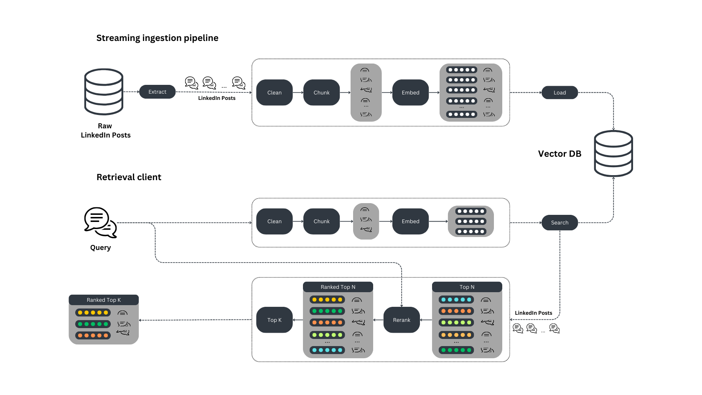

The retrieval system is based on 2 detached components:
1. the streaming ingestion pipeline
2. the retrieval client

The **streaming ingestion pipeline** runs 24/7 to keep the vector DB synced up with current raw LinkedIn posts in our data source, while the **retrieval client** is used in RAG applications to query the vector DB. These 2 components **communicate with each other only through the vector DB**.


### 1.1. The streaming ingestion pipeline

The streaming ingestion pipeline implements the [Change Data Capture (CDC) pattern](https://hub.superlinked.com/12-data-modality#fpwX4) between a data source containing the raw LinkedIn posts and the vector DB used for retrieval.

In a real-world scenario, the streaming pipeline listens to a queue populated by all the changes made to the source database. But because we are focusing primarily on the retrieval system, we simulate the data within the queue with a couple of JSON files.

The streaming pipeline is built in Python using Bytewax, and cleans, chunks, and embeds the LinkedIn posts before loading them into a [Qdrant](https://qdrant.tech/) vector DB. 

**Why do we need a stream engine?**

Because LinkedIn posts (or any other social media data) evolve frequently, your vector DB can quickly get out of sync. To handle this, you can build a batch pipeline that runs every minute. But to _really_ minimize data lag - **to make sure your vector DB stays current with new social media posts**, you need to use a streaming pipeline that **immediately** takes every new item the moment it's posted, preprocesses it, and loads it into the vector DB.

**Why Bytewax?**

[Bytewax](https://github.com/bytewax/bytewax) is a streaming engine built in Rust that exposes a Python interface. We use Bytewax because it combines the impressive speed and reliability of Rust with the ease of use and ecosystem of Python.


### 1.2. The retrieval client

Our retrieval client is a standard Python module that preprocesses user queries and searches the vector DB for most similar results. Qdrant vector DB lets us decouple the retrieval client from the streaming ingestion pipeline.

To avoid training-serving skew, it's essential to preprocess the ingested posts and queries in the same way.

By using a semantic-based retrieval system, we can query our LinkedIn post collection very flexibly. For example, we can retrieve similar posts using a variety of query types - e.g., posts, questions, sentences.

Also, to improve the retrieval system's accuracy, we use a rerank pattern.

Lastly, to better understand and explain the retrieval process for particular queries, we visualize our results on a 2D plot using UMAP.


## 2. Data

We will ingest 215 LinkedIn posts from [my Linked profile - Paul Iusztin](https://www.linkedin.com/in/pauliusztin/). Though we simulate the post ingestion step using JSON files, the posts themselves are authentic.

Before diving into the code, let's take a look at an example LinkedIn post to familiarize ourselves with the challenges it introduces ↓

```json
[
    {
        "text": "𝗪𝗵𝗮𝘁 do you need to 𝗳𝗶𝗻𝗲-𝘁𝘂𝗻𝗲 an open-source 𝗟𝗟𝗠 to create your own 𝗳𝗶𝗻𝗮𝗻𝗰𝗶𝗮𝗹 𝗮𝗱𝘃𝗶𝘀𝗼𝗿?\nThis is the 𝗟𝗟𝗠 𝗳𝗶𝗻𝗲-𝘁𝘂𝗻𝗶𝗻𝗴 𝗸𝗶𝘁 you must know ↓\n𝗗𝗮𝘁𝗮𝘀𝗲𝘁\nThe key component of any successful ML project is the data.\nYou need a 100 - 1000 sample Q&A (questions & answers) dataset with financial scenarios.\nThe best approach is to hire a bunch of experts to create it manually.\nBut, for a PoC, that might get expensive & slow.\nThe good news is that a method called \"𝘍𝘪𝘯𝘦𝘵𝘶𝘯𝘪𝘯𝘨 𝘸𝘪𝘵𝘩 𝘥𝘪𝘴𝘵𝘪𝘭𝘭𝘢𝘵𝘪𝘰𝘯\" exists.\nIn a nutshell, this is how it works: \"Use a big & powerful LLM (e.g., GPT4) to generate your fine-tuning data. After, use this data to fine-tune a smaller model (e.g., Falcon 7B).\"\nFor specializing smaller LLMs on specific use cases (e.g., financial advisors), this is an excellent method to kick off your project.\n𝗣𝗿𝗲-𝘁𝗿𝗮𝗶𝗻𝗲𝗱 𝗼𝗽𝗲𝗻-𝘀𝗼𝘂𝗿𝗰𝗲 𝗟𝗟𝗠\nYou never want to start training your LLM from scratch (or rarely).\nWhy? Because you need trillions of tokens & millions of $$$ in compute power.\nYou want to fine-tune your LLM on your specific task.\nThe good news is that you can find a plethora of open-source LLMs on HuggingFace (e.g., Falcon, LLaMa, etc.)\n𝗣𝗮𝗿𝗮𝗺𝗲𝘁𝗲𝗿 𝗲𝗳𝗳𝗶𝗰𝗶𝗲𝗻𝘁 𝗳𝗶𝗻𝗲-𝘁𝘂𝗻𝗶𝗻𝗴\nAs LLMs are big... duh...\n... they don't fit on a single GPU.\nAs you want only to fine-tune the LLM, the community invented clever techniques that quantize the LLM (to fit on a single GPU) and fine-tune only a set of smaller adapters.\nOne popular approach is QLoRA, which can be implemented using HF's `𝘱𝘦𝘧𝘵` Python package.\n𝗠𝗟𝗢𝗽𝘀\nAs you want your project to get to production, you have to integrate the following MLOps components:\n- experiment tracker to monitor & compare your experiments\n- model registry to version & share your models between the FTI pipelines\n- prompts monitoring to debug & track complex chains\n↳ All of them are available on ML platforms, such as Comet ML 🔗\nhttps://lnkd.in/d7jNQz7m\n𝗖𝗼𝗺𝗽𝘂𝘁𝗲 𝗽𝗹𝗮𝘁𝗳𝗼𝗿𝗺\nThe most common approach is to train your LLM on your on-prem Nivida GPUs cluster or rent them on cloud providers such as AWS, Paperspace, etc.\nBut what if I told you that there is an easier way?\nThere is! It is called serverless.\nFor example,\nBeam\nis a GPU serverless provider that makes deploying your training pipeline as easy as decorating your Python function with `@𝘢𝘱𝘱.𝘳𝘶𝘯()`.\nAlong with ease of deployment, you can easily add your training code to your CI/CD to add the final piece of the MLOps puzzle, called CT (continuous training).\n↳ Beam: 🔗\nhttps://lnkd.in/dedCaMDh\n.\n↳ To see all these components in action, check out my FREE 𝗛𝗮𝗻𝗱𝘀-𝗼𝗻 𝗟𝗟𝗠𝘀 𝗰𝗼𝘂𝗿𝘀𝗲 & give it a ⭐:  🔗\nhttps://lnkd.in/dZgqtf8f\nhashtag\n#\nmachinelearning\nhashtag\n#\nmlops\nhashtag\n#\ndatascience",
        "image": "https://media.licdn.com/dms/image/D4D10AQHWQzZcToQQ1Q/image-shrink_800/0/1698388219549?e=1705082400&v=beta&t=9mrDC_NooJgD7u7Qk0PmrTGGaZtuwDIFKh3bEqeBsm0"
    }
]
```

The following features of the post above are not compatible with embeddings models. We'll need to find some way of handling them in our preprocessing step:
- emojis
- bold, italic text
- other non-ASCII characters 
- URLs
- content that exceeds the context window limit of the embedding model

Emojis and bolded and italic text are represented by Unicode characters that are not available in the vocabulary of the embedding model. Thus, these items cannot be tokenized and passed to the model; we have to remove them, or normalize them to something that can be parsed by the tokenizer. The same holds true for all other non-ASCII characters.

URLs take up space in the context window without providing much semantic value. Still, even knowing that there's a URL in the sentence can add context. For this reason, we replace all URLs with a `[URL]` token. This lets us ingest whatever value the URL's presence conveys, without it taking up valuable space.

## 3. Settings

It's good practice to have a single place to configure your application. We use `pydantic` to quickly implement an `AppSettings` class that contains all the default settings and can be overwritten by other files such as `.env` or `yaml`.

```python
class AppSettings(BaseSettings):
    model_config = SettingsConfigDict(env_file=(".env", ".env.prod"))

    EMBEDDING_MODEL_ID: str = "sentence-transformers/all-MiniLM-L6-v2"
    CROSS_ENCODER_MODEL_ID: str = "cross-encoder/ms-marco-MiniLM-L-6-v2"
    EMBEDDING_MODEL_MAX_INPUT_LENGTH: int = 256
    EMBEDDING_SIZE: int = 384
    EMBEDDING_MODEL_DEVICE: str = "cpu"
    VECTOR_DB_OUTPUT_COLLECTION_NAME: str = "linkedin_posts"

    # Variables loaded from .env file
    QDRANT_URL: str = "localhost:6333"
    QDRANT_API_KEY: Optional[str] = None


settings = AppSettings()
```

These constants are used across all components of the retrieval system, ensuring a single configuration entry point.


## 4. Streaming ingestion pipeline

Let's dive into the streaming pipeline, beginning at the top, and working our way to the bottom ↓

## 4.1. Bytemax flow - starting with ingestion

**The Bytewax flow** transparently conveys all the steps of the streaming pipeline.

The first step is ingesting every LinkedIn post from our JSON files. In the next steps, every map operation has a single responsibility:
- validate the ingested data using a `RawPost` `pydantic` model
- clean the posts
- chunk the posts; because chunking will output a list of `ChunkedPost` objects, we use a `flat_map` operation to flatten them out
- embed the posts
- load the posts to a Qdrant vector DB

```python
def build_flow():
    embedding_model = EmbeddingModelSingleton()

    flow = Dataflow("flow")

    stream = op.input("input", flow, JSONSource(["data/paul.json"]))
    stream = op.map("raw_post", stream, RawPost.from_source)
    stream = op.map("cleaned_post", stream, CleanedPost.from_raw_post)
    stream = op.flat_map(
        "chunked_post",
        stream,
        lambda cleaned_post: ChunkedPost.from_cleaned_post(
            cleaned_post, embedding_model=embedding_model
        ),
    )
    stream = op.map(
        "embedded_chunked_post",
        stream,
        lambda chunked_post: EmbeddedChunkedPost.from_chunked_post(
            chunked_post, embedding_model=embedding_model
        ),
    )
    op.inspect("inspect", stream, print)
    op.output(
        "output", stream, QdrantVectorOutput(vector_size=model.embedding_size)
    )
    
    return flow
```

By wrapping every state of the post into a different `pydantic` model, we make the code extremely modular. This way, we can easily validate the data at each step, and reuse the code in the retrieval module.

### 4.2. Cleaning the LinkedIn posts

The raw LinkedIn posts are initially wrapped in a `RawPost` `pydantic` class to enforce static typing of the domain model, which is crucial for validating and modeling our data:

```python
class RawPost(BaseModel):
    post_id: str
    text: str
    image: Optional[str]

    @classmethod
    def from_source(cls, k_v: Tuple[str, dict]) -> "RawPost":
        k, v = k_v

        return cls(post_id=k, text=v["text"], image=v.get("image", None))
```

Following this strategy, we write the next `pydantic` class representing the state of a cleaned post:

```python
from unstructured.cleaners.core import (
    clean,
    clean_non_ascii_chars,
    replace_unicode_quotes,
)
from src.cleaning import (
    remove_emojis_and_symbols,
    replace_urls_with_placeholder,
    unbold_text,
    unitalic_text,
)

class CleanedPost(BaseModel):
    post_id: str
    raw_text: str
    text: str
    image: Optional[str]

    @classmethod
    def from_raw_post(cls, raw_post: RawPost) -> "CleanedPost":
        cleaned_text = CleanedPost.clean(raw_post.text)

        return cls(
            post_id=raw_post.post_id,
            raw_text=raw_post.text,
            text=cleaned_text,
            image=raw_post.image,
        )
        
    @staticmethod
    def clean(text: str) -> str:
        cleaned_text = unbold_text(text)
        cleaned_text = unitalic_text(cleaned_text)
        cleaned_text = remove_emojis_and_symbols(cleaned_text)
        cleaned_text = clean(cleaned_text)
        cleaned_text = replace_unicode_quotes(cleaned_text)
        cleaned_text = clean_non_ascii_chars(cleaned_text)
        cleaned_text = replace_urls_with_placeholder(cleaned_text)
        
        return cleaned_text
```

The `from_raw_post` factory method takes an instance of the `RawPost` as input and uses the `clean()` method to clean the text, so that it's compatible with the embedding model. Our cleaning method addresses all embedding-incompatible features highlighted in our `2. Data` section above - e.g., bolded text, emojis, non-ascii characters, etc.

Here's what the cleaned post looks like:

```json
{
    "text": "What do you need to fine-tune an open-source LLM to create your own financial advisor?\nThis is the LLM fine-tuning kit you must know  \n\nDataset\nThe key component of any successful ML project is the data.\nYou need a 100 - 1000 sample Q&A (questions & answers) dataset with financial scenarios.\n\nThe best approach is to hire a bunch of experts to create it manually.\nBut, for a PoC, that might get expensive & slow.\nThe good news is that a method called \n'Finetuning with distillation' exists.\nIn a nutshell, this is how it works: 'Use a big & powerful LLM (e.g., GPT4) to generate your fine-tuning data. \nAfter, use this data to fine-tune a smaller model (e.g., Falcon 7B).'\nFor specializing smaller LLMs on specific use cases (e.g., financial advisors), \nthis is an excellent method to kick off your project.\nPre-trained open-source LLM\nYou never want to start training your LLM from scratch (or rarely).\n\nWhy? Because you need trillions of tokens & millions of $$$ in compute power.\nYou want to fine-tune your LLM on your specific task.\n\nhe good news is that you can find a plethora of open-source LLMs on HuggingFace (e.g., Falcon, LLaMa, etc.)\n\nParameter efficient fine-tuning\nAs LLMs are big... duh...\n... they don\'t fit on a single GPU.\n\nAs you want only to fine-tune the LLM, the community invented clever techniques that quantize the LLM (to fit on a single GPU) and \nfine-tune only a set of smaller adapters.\nOne popular approach is QLoRA, which can be implemented using HF\'s `peft` Python package.\nMLOps\n\nAs you want your project to get to production, you have to integrate the following MLOps components:\n\n- experiment tracker to monitor & compare your experiments\n\n- model registry to version & share your models between the FTI pipelines\n-\nprompts monitoring to debug & track complex chains\n\n  All of them are available on ML platforms, such as Comet ML  \n[URL]\nCompute platform\n\nThe most common approach is to train your LLM on your on-prem Nivida GPUs cluster or rent them on cloud providers such as AWS, Paperspace, etc.\n\nBut what if I told you that there is an easier way?\nThere is! It is called serverless.\nFor example,\nBeam\nis a GPU serverless provider that \nmakes deploying your training pipeline as easy as decorating your Python function with `@app.run()`.\n\nAlong with ease of deployment, you can easily add your training code to your CI/CD to add the final piece of the MLOps puzzle, \ncalled CT (continuous training).\n  Beam:  \n[URL]\n.\n\n  To see all these components in action, check out my FREE Hands-on LLMs course & give it a :  \n \n[URL]\nhashtag\n#\nmachinelearning\nhashtag\n#\nmlops\nhashtag\n#\ndatascience"
}
```


### 4.3. Chunk

Now, we are ready to chunk the cleaned posts ↓

```python
from langchain.text_splitter import (
    RecursiveCharacterTextSplitter,
    SentenceTransformersTokenTextSplitter,
)

class ChunkedPost(BaseModel):
    post_id: str
    chunk_id: str
    full_raw_text: str
    text: str
    image: Optional[str]

    @classmethod
    def from_cleaned_post(
        cls, cleaned_post: CleanedPost, embedding_model: EmbeddingModelSingleton
    ) -> list["ChunkedPost"]:
        chunks = ChunkedPost.chunk(cleaned_post.text, embedding_model)

        return [
            cls(
                post_id=cleaned_post.post_id,
                chunk_id=hashlib.md5(chunk.encode()).hexdigest(),
                full_raw_text=cleaned_post.raw_text,
                text=chunk,
                image=cleaned_post.image,
            )
            for chunk in chunks
        ]
        
    @staticmethod
    def chunk(text: str, embedding_model: EmbeddingModelSingleton) -> list[str]:
        character_splitter = RecursiveCharacterTextSplitter(
            separators=["\n\n"], chunk_size=500, chunk_overlap=0
        )
        text_sections = character_splitter.split_text(text)

        token_splitter = SentenceTransformersTokenTextSplitter(
            chunk_overlap=50,
            tokens_per_chunk=embedding_model.max_input_length,
            model_name=embedding_model.model_id,
        )

        chunks = []
        for text_section in text_sections:
            chunks.extend(token_splitter.split_text(text_section))
            
        return chunks
```

We use the `RecursiveCharacterTextSplitter` class from LangChain to separate paragraphs delimited by `\n\n`, because these have a high chance of starting a different topic within the posts. Since the length of a chunk is restricted by the `max_input_length` of the embedding model, we use the `SentenceTransformersTokenTextSplitter` class to split the paragraphs further - based on the maximum accepted input length. This is a standard strategy in chunking text for retrieval systems.

One last thing to point out: we dynamically compute the `chunk_id` using `MD5` deterministic digital signatures to ensure that we don't ingest duplicates into the vector DB. For text within a given chunk, the MD5 hash will always be the same.

### 4.4. Embed

The last step before loading the cleaned, chunked posts to Qdrant is to **compute the embedding of each chunk**. To do this, we use a different `pydantic` model that exclusively calls the `sentence-transformers/all-MiniLM-L6-v2` embedding model, which is wrapped by the `EmbeddingModelSingleton` class ↓

```python
class EmbeddedChunkedPost(BaseModel):
    post_id: str
    chunk_id: str
    full_raw_text: str
    text: str
    text_embedding: list
    image: Optional[str] = None
    score: Optional[float] = None
    rerank_score: Optional[float] = None

    @classmethod
    def from_chunked_post(
        cls, chunked_post: ChunkedPost, embedding_model: EmbeddingModelSingleton
    ) -> "EmbeddedChunkedPost":
        return cls(
            post_id=chunked_post.post_id,
            chunk_id=chunked_post.chunk_id,
            full_raw_text=chunked_post.full_raw_text,
            text=chunked_post.text,
            text_embedding=embedding_model(chunked_post.text, to_list=True),
            image=chunked_post.image,
        )

    def to_payload(self) -> tuple[str, np.ndarray, dict]:
        return (
            self.chunk_id,
            self.text_embedding,
            {
                "post_id": self.post_id,
                "text": self.text,
                "image": self.image,
                "full_raw_text": self.full_raw_text,
            },
        )
```

Wrapping the embedding model with the `EmbeddingModelSingleton` class allows you to **easily swap the model to fit the requirements of different use cases**. We use `sentence-transformers/all-MiniLM-L6-v2` for our implementation because it's very light, fast, and runs on a CPU. But for your use case, you may require a more powerful model in a production-grade setup with millions of records. You can change your model simply by changing the implementation of the `EmbeddingModelSingleton` class. You don't need to touch anything else.

### 4.5. Load to Qdrant

To load the LinkedIn posts to Qdrant, you have to override Bytewax's `StatelessSinkPartition` class (which signals an **output** in a Bytewax flow):

```python
class QdrantVectorSink(StatelessSinkPartition):
    def __init__(
        self,
        client: QdrantClient,
        collection_name: str = settings.VECTOR_DB_OUTPUT_COLLECTION_NAME,
    ):
        self._client = client
        self._collection_name = collection_name

    def write_batch(self, chunks: list[EmbeddedChunkedPost]):
        ids = []
        embeddings = []
        metadata = []
        for chunk in chunks:
            chunk_id, text_embedding, chunk_metadata = chunk.to_payload()

            ids.append(chunk_id)
            embeddings.append(text_embedding)
            metadata.append(chunk_metadata)

        self._client.upsert(
            collection_name=self._collection_name,
            points=Batch(
                ids=ids,
                vectors=embeddings,
                payloads=metadata,
            ),
        )
```

Within this class, you must overwrite the `write_batch` method, to serialize every `EmbeddedChunkedPost` to a payload - i.e., map the data to the format expected by Qdrant. 

Finally, you load the serialized data to the vector DB.


## 5. Retrieval client

Here, we focus on preprocessing a user's query, searching the vector DB, and postprocessing the retrieved posts for optimal results.

To design the retrieval step, we implement a `QdrantVectorDBRetriever` class to expose all the necessary features for our retrieval client. In the sections below, we'll go into how to implement each of the methods involved in the class.

```python
class QdrantVectorDBRetriever:
    def __init__(
        self,
        embedding_model: EmbeddingModelSingleton,
        vector_db_client: QdrantClient,
        cross_encoder_model: Optional[CrossEncoderModelSingleton] = None,
        vector_db_collection: str = settings.VECTOR_DB_OUTPUT_COLLECTION_NAME,
    ):
        self._embedding_model = embedding_model
        self._vector_db_client = vector_db_client
        self._cross_encoder_model = cross_encoder_model
        self._vector_db_collection = vector_db_collection

    def search(
        self, query: str, limit: int = 3, return_all: bool = False
    ) -> Union[list[EmbeddedChunkedPost], dict[str, list]]:
        ...

    def embed_query(self, query: str) -> list[list[float]]:
        ...

    def rerank(self, query: str, posts: list[EmbeddedChunkedPost]) -> list[EmbeddedChunkedPost]:
        ...

    def render_as_html(self, post: EmbeddedChunkedPost) -> None:
        ...    
```

### 5.1. Embed query

We must embed the query in precisely the same way we ingested our posts into the vector DB. Because the streaming pipeline is written in Python (thanks to Bytewax), and every preprocessing operation is modular, we can quickly replicate all the steps necessary to embed the query.

```python
class QdrantVectorDBRetriever:

    ...

    def embed_query(self, query: str) -> list[list[float]]:
        cleaned_query = CleanedPost.clean(query)
        chunks = ChunkedPost.chunk(cleaned_query, self._embedding_model)
        embdedded_queries = [
            self._embedding_model(chunk, to_list=True) for chunk in chunks
        ]

        return embdedded_queries
```

In cases where the query is too large, we divide it into multiple smaller query chunks. We can query Qdrant with each chunk and merge the results. Moreover, chunking can even enhance our search, by broadening it to include posts in more areas of the embedded posts vector space. In essence, it permits more comprehensive coverage of the vector space, potentially leading to more relevant and diverse results.

### 5.2. Plain retrieval

After we preprocess the query, the retrieval step is straightforward. We map every embedded query to a Qdrant `SearchRequest` object and call the `search_batch()` method on top of our LinkedIn posts collection.

Because we chunk queries that are too long into multiple queries, when we merge all the retrieved posts, we must eliminate possible duplicates by adding all the items to a unique set based on their `chunk_id.`

We'll go into the `rerank` aspects of the method in just a second.
But first, let's call our `QdrantVectorDBRetriever` class and see how it works:

```python
vector_db_retriever = QdrantVectorDBRetriever(embedding_model=EmbeddingModelSingleton(), vector_db_client=build_qdrant_client())

retrieved_results = vector_db_retriever.search(query="Posts about Qdrant", limit=3, return_all=True)
for post in retrieved_results["posts"]:
    vector_db_retriever.render_as_html(post)
```

Here are the results ↓

:::::tabs
::::tab{title="Result 1"}
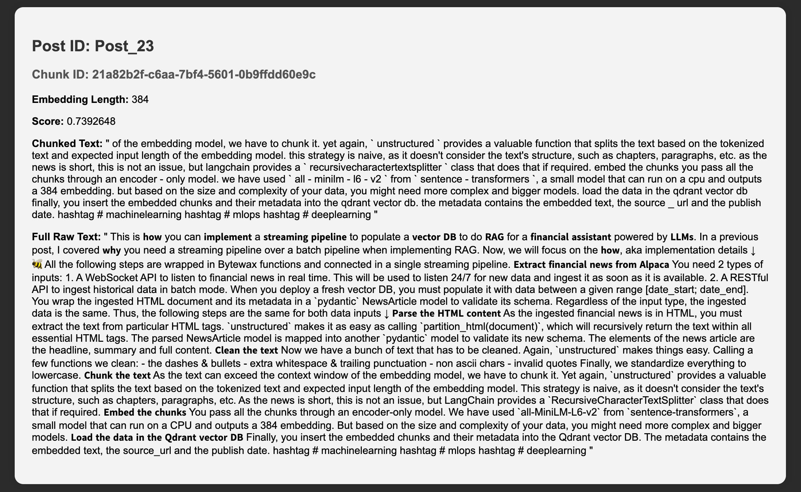
::::

:::tab{title="Result 2"}
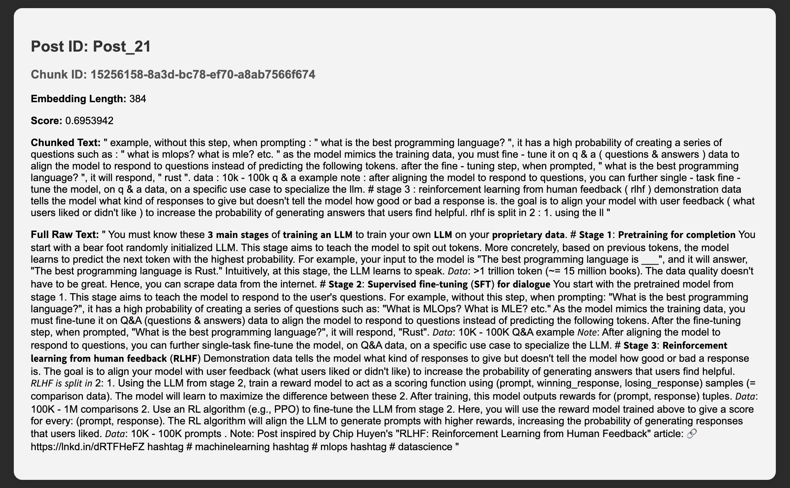
:::

:::tab{title="Result 3"}
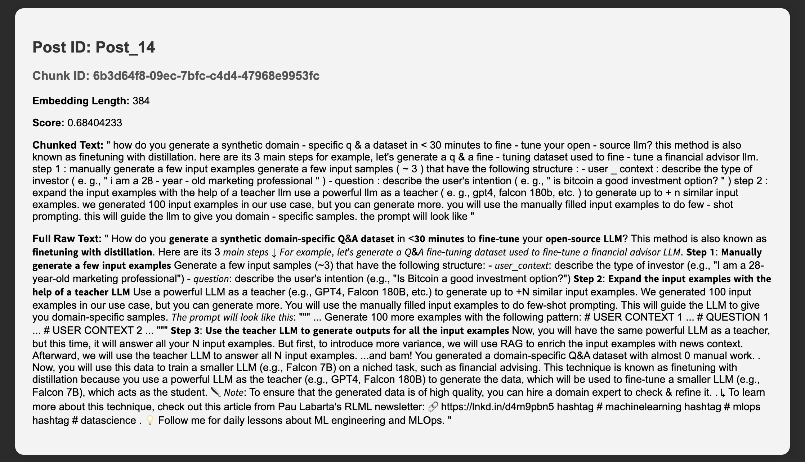
:::
:::::

You can see (above) that only the first result is relevant. The others are not at all relevant to our query, which was about Qdrant or vector DBs.


### 5.3. Visualize retrieval

To visualize our retrieval, we implement a dedicated class that uses the UMAP dimensionality reduction algorithm. We chose UMAP because it does a better job than its peers (e.g., PCA, t-SNE) of preserving the geometric properties between points (e.g., distance) in higher dimensions when they are projected onto lower dimensions.

The `RetrievalVisualizer` computes the projected embeddings for the entire vector space once. Afterwards, it uses the `render()` method to project only the given query and retrieved posts, and plot them to a 2D graph.

```python
class RetrievalVisualizer:
    def __init__(self, posts: list[EmbeddedChunkedPost]):
        self._posts = posts

        self._umap_transform = self._fit_model(self._posts)
        self._projected_post_embeddings = self.project_posts(self._posts)

    def _fit_model(self, posts: list[EmbeddedChunkedPost]) -> umap.UMAP:
        embeddings = np.array([post.text_embedding for post in posts])

        umap_transform = umap.UMAP(random_state=0, transform_seed=0)
        umap_transform = umap_transform.fit(embeddings)

        return umap_transform

    def project_posts(self, posts: list[EmbeddedChunkedPost]) -> np.ndarray:
        embeddings = np.array([post.text_embedding for post in posts])

        return self._project(embeddings=embeddings)

    def _project(self, embeddings: np.ndarray) -> np.ndarray:
        umap_embeddings = np.empty((len(embeddings), 2))

        for i, embedding in enumerate(tqdm(embeddings)):
            umap_embeddings[i] = self._umap_transform.transform([embedding])

        return umap_embeddings

    def render(
        self,
        embedded_queries: list[list[float]],
        retrieved_posts: list[EmbeddedChunkedPost],
    ) -> None:
    ...

```

Let's take a look at the result to see how the `"Posts about Qdrant"` query looks ↓

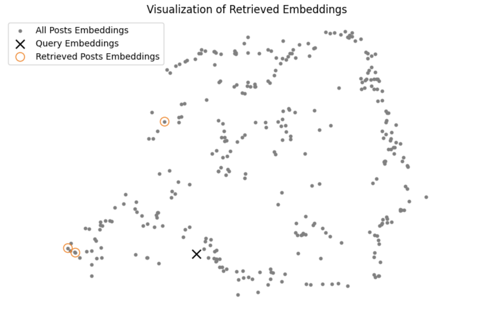

Our results are not great. You can see how far the retrieved posts are from our query in the vector space. Let's see if we can improve upon this using an entire post (taken from our `2. Data` section above) as a query ↓

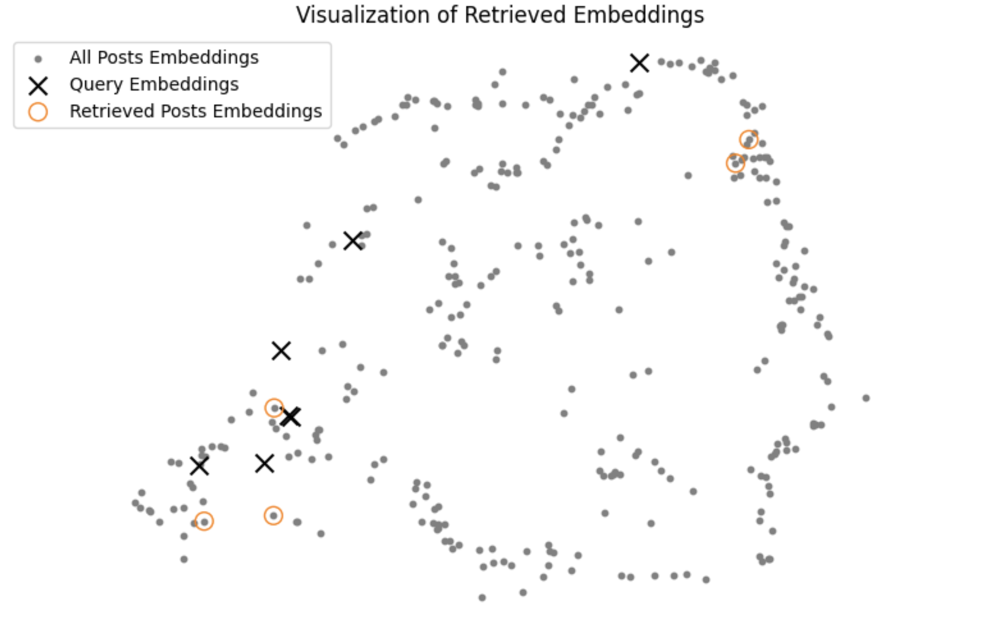

Because the query was split into multiple chunks, our results are now closer to the queries. But they still aren't that great.

Can we improve the quality of our retrieval system using the **rerank** pattern? Let's see.


### 5.4. Rerank

Our initial retrieval step - because it used cosine similarity (or similar distance metrics) to compute distance between query and post embeddings - may have missed more complex (but essential) relationships between the query and the documents in the vector space. Reranking leverages the power of transformer models that are capable of understanding more nuanced semantic relationships. So let's use a rerank step to refine our retrieval for the initial query.

We use a **cross-encoder** model to implement the reranking step, so we can score the query relative to all retrieved posts individually. These scores take into consideration more complex relationships than cosine similarity can. Under the hood is a BERT classifier that outputs a number between 0 and 1 according to how similar the 2 given sentences are. The BERT classifier outputs 0 if they are entirely different, and 1 if they are a perfect match.

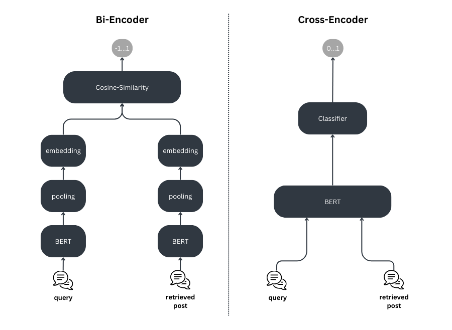

But, you might ask, "Why not use the **cross-encoder** model from the start, if it is that much better?"

The answer, in a word, is speed. Using a cross-encoder model to search your whole collection is much slower than using cosine similarity. To optimize your retrieval, therefore, your reranking process should involve 2 steps:
1. an initial rough retrieval step using cosine similarity, which retrieves the top N items as potential candidates
2. filtering the rough search using the `rerank` strategy, which retrieves the top K items as your final results

```python
class QdrantVectorDBRetriever:

    ...

    def rerank(
            self, query: str, posts: list[EmbeddedChunkedPost]
        ) -> list[EmbeddedChunkedPost]:
            pairs = [[query, f"{post.text}"] for post in posts]
            cross_encoder_scores = self._cross_encoder_model(pairs)
            ranked_posts = sorted(
                zip(posts, cross_encoder_scores), key=lambda x: x[1], reverse=True
            )

            reranked_posts = []
            for post, rerank_score in ranked_posts:
                post.rerank_score = rerank_score
                
                reranked_posts.append(post)

            return reranked_posts
```

The implementation is relatively straightforward. For each retrieved post, we create a pair consisting of the (cleaned) query and the text of the post. We do this for all retrieved posts, resulting in a list of pairs.

Next, we call a `cross-encoder/ms-marco-MiniLM-L-6-v2` model (from sentence-transformers) to give the retrieved posts their rerank score. We then sort the posts in descending order, based on their rerank score. 

You may have noticed and wondered about the following piece of code in the `search()` method:

```python
if self._cross_encoder_model:
    original_limit = limit
    limit = limit * 7
else:
    original_limit = limit

...

posts = posts[:original_limit]
```

This piece of code implements the 2-step reranking algorithm, which in step 1 widens the search space limit to include 7 times as many top N potential candidates. After the potential candidates have been identified, they are, in step 2, reranked and sorted based on their reranking scores. But instead of returning all the ranked candidates, the algorithm returns only the top K candidates, per the original post number (limit) set by the client.

### 5.5. Visualize retrieval with rerank

Now that we've added the `rerank` pattern to our retrieval system, let's see if it improves the results of our `"Posts about Qdrant"` query ↓

:::::tabs
::::tab{title="Result 1"}
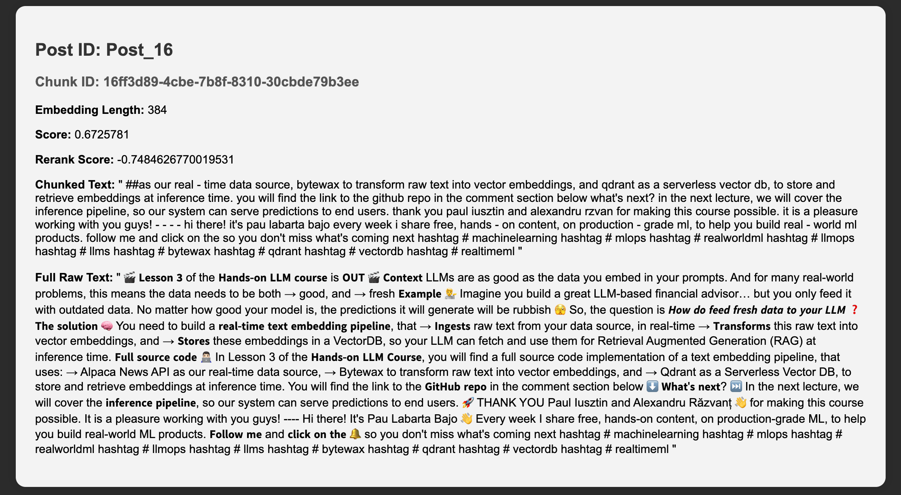
::::

:::tab{title="Result 2"}
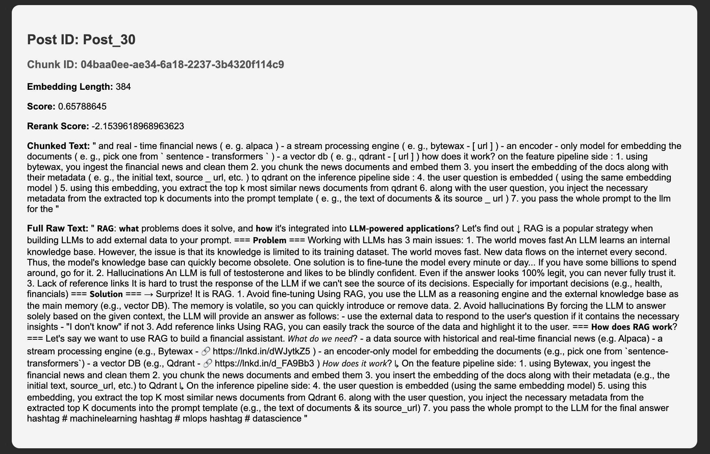
:::

:::tab{title="Result 3"}
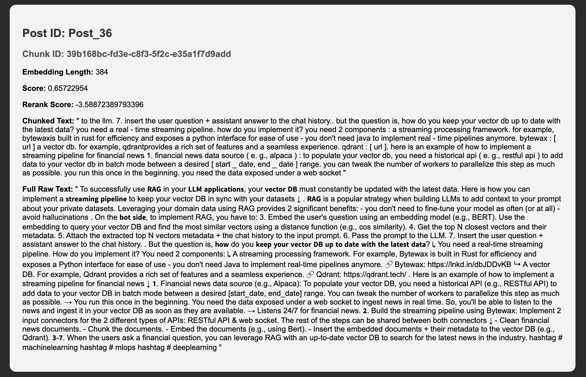
:::
:::::

The improvement is remarkable! All our results are about Qdrant and vector DBs. 

Let's see how this looks in the UMAP visualization:

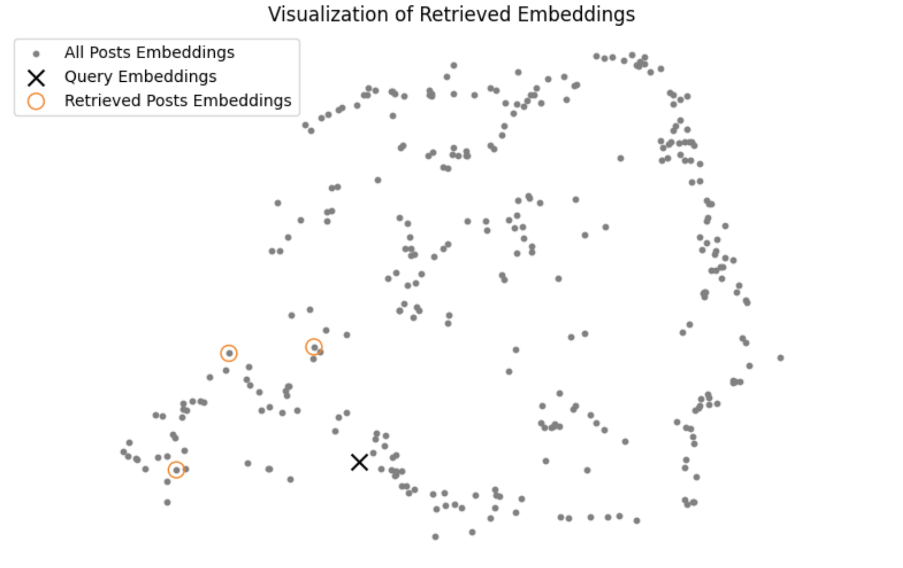

While the returned posts aren't very close to the query, they are **a lot closer to the query compared to when we weren't reranking the retrieved posts**.

Now, let's examine our use case results **when we use an entire post as a query** (the example given in section `2. Data` above) ↓

:::::tabs
::::tab{title="Result 1"}
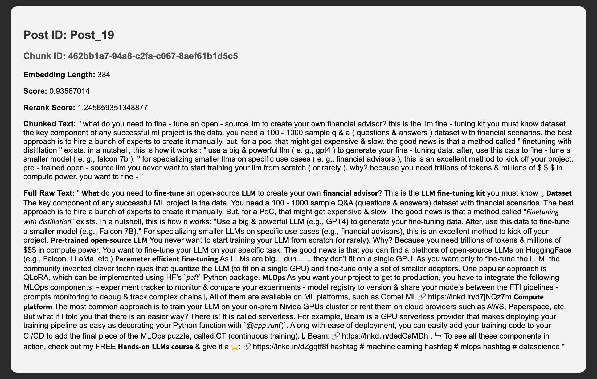
::::

:::tab{title="Result 2"}
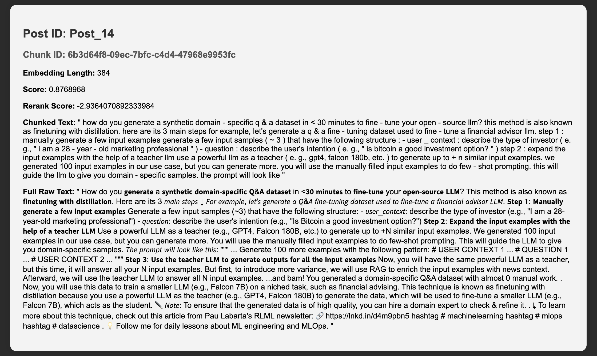
:::

:::tab{title="Result 3"}
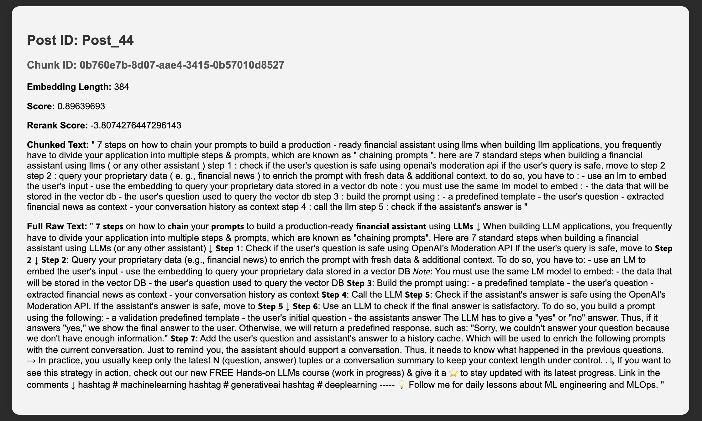
:::
:::::

We asked for 5 results, but because we indexed posts based on their `chunk_id`, 2 of these turned out to be duplicates. This can be solved through more preprocessing steps (to ensure uniqueness in the indexing process). Still, of 215 posts, the 3 retrieved posts are very relevant to the query. The first post is the very same post we used to query the vector DB, which shows that our system is robust. The next two results are semantically similar to the query post - their focus is on fine-tuning LLMs.

Finally, let's visualize our results using UMAP:

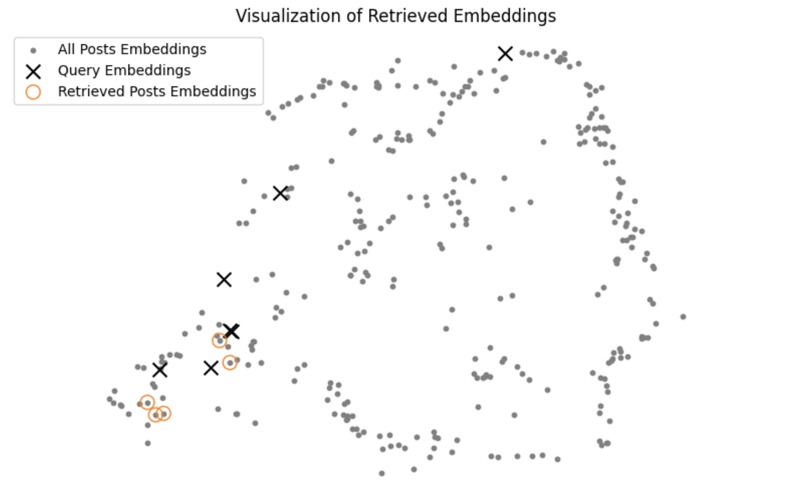

This time, all our retrieved posts are very close to the query chunks! **Using reranking on an entire post query improved results significantly!**


## Conclusion

In this article, we learned how to adapt a RAG retrieval pattern to improve LinkedIn post retrieval. To keep our database up to date with rapidly changing social media data, we implemented a real-time streaming pipeline that uses CDC to sync the raw LinkedIn posts data source with a vector DB. You also saw how to use Bytewax to write, using Python alone, a streaming pipeline that cleans, chunks, and embeds LinkedIn posts.

Finally, you learned how to implement a standard retrieval client for RAG, and saw how to improve it using the rerank pattern. As retrieval is complex to evaluate, we went through how to visualize the retrieval for a given query by rendering all the posts, the query, and the retrieved posts in a 2D space using UMAP.

> [!NOTE]
> If you want to **try out** the **code** yourself, check it out on our 🔗 [GitHub repository](https://github.com/decodingml/articles-code/tree/main/articles/large_language_models/real_time_retrieval_system_for_social_media_data).

### Future steps

Here are a few interesting possible tweaks you can try to make our RAG retrieval code above more production-ready:

- Use a more powerful embedding or rerank model.
- Add multiple data sources (e.g., X, Instagram posts, or Medium articles).
- Connect the streaming pipeline to an actual database and CDC system.
- Quantitatively evaluate the retrieval step.

---

## Contributors

- [Paul Iusztin, author](https://www.linkedin.com/in/pauliusztin/) via [Decoding ML](https://decodingml.substack.com/)
- [Mór Kapronczay, contributor](https://www.linkedin.com/in/mór-kapronczay-49447692)
- [Robert Turner, editor](https://robertturner.co/copyedit)
