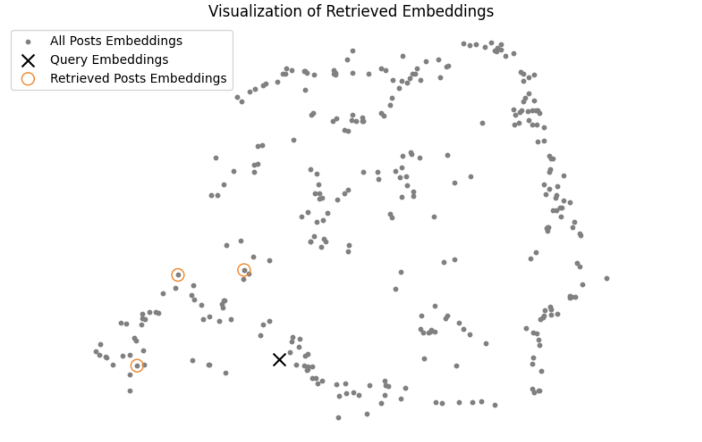
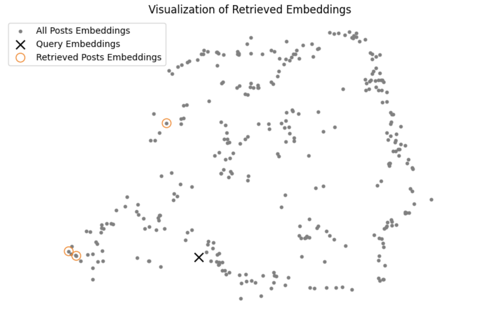

<!-- SEO SUMMARY:  Build a custom real-time retrieval system for social media data using a Bytewax streaming ingestion pipeline to sync LinkedIn posts between a data source and a Qdrant vector DB. Build a retrieval client for RAG systems, using the rerank pattern to improve the search results and UMAP to visualize each query.-->

# Real-time retrieval system for social media data

In this article, you will learn how to build a real-time retrieval system for social media data. In our particular scenario, we will use only my LinkedIn posts, which can easily be extended to other platforms supporting written content, such as X, Instagram, or Medium.

Social media data platforms produce data at high frequencies, so the vector DB can easily remain behind relative to the other data sources from your system. Thus, we will show you how to build a streaming engine to constantly move data from a raw data source to a vector DB in real-time.

In this article, we will explain only the retrieval part of an RAG system. Still, you can quickly hook the retrieved LinkedIn posts to an LLM for post analysis or personalized content generation.

**That being said, in this article, you will learn:**

- to build a streaming pipeline to ingest LinkedIn posts into a vector DB in real-time
- to clean, chunk, and embed LinkedIn posts
- build a retrieval client to query your LinkedIn posts
- use the rerank pattern to improve the retrieval accuracy
- visualize the retrieval for a given query in a 2D plot using UMAP

We won't dive into the basics of an RAG system but focus only on the specifics of implementing a retrieval system for LinkedIn posts. In case you want to refresh your mind on RAG systems, check out this excellent article from VectorHub: [Retrieval Augmented Generation](https://hub.superlinked.com/retrieval-augmented-generation)


## 1. System design


The retrieval system is based on 2 detached components:
1. The streaming ingestion pipeline
2. The retrieval client

The streaming ingestion pipeline runs 24/7 to keep the raw LinkedIn posts data source in sync with the vector DB.

The retrieval client is used in RAG applications to query the vector DB.

The 2 components will communicate with each other only through the vector DB.

### 1.1. The streaming ingestion pipeline

The streaming ingestion pipeline implements the [Change Data Capture (CDC) pattern](https://hub.superlinked.com/12-data-modality#fpwX4) between a data source containing the raw LinkedIn posts and the vector DB used for retrieval.

In a real-world scenario, the streaming pipeline will listen to a queue populated by all the changes made to the source database. But as our primary focus is the retrieval system, we simulated the data within the queue with a couple of JSON files.

The streaming pipeline is built in Python using Bytewax and cleans, chunks, and embeds the LinkedIn posts before loading them into a [Qdrant](https://qdrant.tech/) vector DB. 


#### Why do we need a stream engine?

As LinkedIn posts (or any other social media data) evolve frequently, your vector DB can quickly become out of sync. You could build a batch pipeline that runs every minute, but the best way is to use a streaming pipeline that immediately takes every new item, preprocesses it and loads it into the vector DB.

Doing so ensures you can access all the latest LinkedIn posts in your vector DB with minimal delay.


#### What is Bytewax?

[Bytewax](https://github.com/bytewax/bytewax) is a streaming engine built in Rust that exposes a Python interface. Which means you get the best of both worlds:
- The fantastic speed and reliability of Rust
- The ease of use and ecosystem of Python


### 2.2. The retrieval client

The retrieval client will be a standard Python module that preprocesses the user queries and searches the vector DB for most similar results. It is decoupled from the streaming ingestion pipeline through the Qdrant vector DB.

Similar to the training-serving skew, it is essential to preprocess the ingested posts and queries in the same way.

The beauty of using a semantic-based retrieval system is that you are very flexible in how you can query your LinkedIn post collection. For example, you can find similar posts using another post or other questions or sentences.

Also, to improve the retrieval system's accuracy, we used the rerank pattern.

Lastly, to better understand and explain the retrieval based on particular queries, we will visualize it on a 2D plot using UMAP.


## 2. Data

We will ingest 215 LinkedIn posts from [my profile - Paul Iusztin](https://www.linkedin.com/in/pauliusztin/). Even though we simulate the posts ingestion step through JSON files, the posts themself are authentic.

Before diving into the code, let's look over a LinkedIn post to address the challenges it will introduce ↓

```json
[
    {
        "text": "𝗪𝗵𝗮𝘁 do you need to 𝗳𝗶𝗻𝗲-𝘁𝘂𝗻𝗲 an open-source 𝗟𝗟𝗠 to create your own 𝗳𝗶𝗻𝗮𝗻𝗰𝗶𝗮𝗹 𝗮𝗱𝘃𝗶𝘀𝗼𝗿?\nThis is the 𝗟𝗟𝗠 𝗳𝗶𝗻𝗲-𝘁𝘂𝗻𝗶𝗻𝗴 𝗸𝗶𝘁 you must know ↓\n𝗗𝗮𝘁𝗮𝘀𝗲𝘁\nThe key component of any successful ML project is the data.\nYou need a 100 - 1000 sample Q&A (questions & answers) dataset with financial scenarios.\nThe best approach is to hire a bunch of experts to create it manually.\nBut, for a PoC, that might get expensive & slow.\nThe good news is that a method called \"𝘍𝘪𝘯𝘦𝘵𝘶𝘯𝘪𝘯𝘨 𝘸𝘪𝘵𝘩 𝘥𝘪𝘴𝘵𝘪𝘭𝘭𝘢𝘵𝘪𝘰𝘯\" exists.\nIn a nutshell, this is how it works: \"Use a big & powerful LLM (e.g., GPT4) to generate your fine-tuning data. After, use this data to fine-tune a smaller model (e.g., Falcon 7B).\"\nFor specializing smaller LLMs on specific use cases (e.g., financial advisors), this is an excellent method to kick off your project.\n𝗣𝗿𝗲-𝘁𝗿𝗮𝗶𝗻𝗲𝗱 𝗼𝗽𝗲𝗻-𝘀𝗼𝘂𝗿𝗰𝗲 𝗟𝗟𝗠\nYou never want to start training your LLM from scratch (or rarely).\nWhy? Because you need trillions of tokens & millions of $$$ in compute power.\nYou want to fine-tune your LLM on your specific task.\nThe good news is that you can find a plethora of open-source LLMs on HuggingFace (e.g., Falcon, LLaMa, etc.)\n𝗣𝗮𝗿𝗮𝗺𝗲𝘁𝗲𝗿 𝗲𝗳𝗳𝗶𝗰𝗶𝗲𝗻𝘁 𝗳𝗶𝗻𝗲-𝘁𝘂𝗻𝗶𝗻𝗴\nAs LLMs are big... duh...\n... they don't fit on a single GPU.\nAs you want only to fine-tune the LLM, the community invented clever techniques that quantize the LLM (to fit on a single GPU) and fine-tune only a set of smaller adapters.\nOne popular approach is QLoRA, which can be implemented using HF's `𝘱𝘦𝘧𝘵` Python package.\n𝗠𝗟𝗢𝗽𝘀\nAs you want your project to get to production, you have to integrate the following MLOps components:\n- experiment tracker to monitor & compare your experiments\n- model registry to version & share your models between the FTI pipelines\n- prompts monitoring to debug & track complex chains\n↳ All of them are available on ML platforms, such as Comet ML 🔗\nhttps://lnkd.in/d7jNQz7m\n𝗖𝗼𝗺𝗽𝘂𝘁𝗲 𝗽𝗹𝗮𝘁𝗳𝗼𝗿𝗺\nThe most common approach is to train your LLM on your on-prem Nivida GPUs cluster or rent them on cloud providers such as AWS, Paperspace, etc.\nBut what if I told you that there is an easier way?\nThere is! It is called serverless.\nFor example,\nBeam\nis a GPU serverless provider that makes deploying your training pipeline as easy as decorating your Python function with `@𝘢𝘱𝘱.𝘳𝘶𝘯()`.\nAlong with ease of deployment, you can easily add your training code to your CI/CD to add the final piece of the MLOps puzzle, called CT (continuous training).\n↳ Beam: 🔗\nhttps://lnkd.in/dedCaMDh\n.\n↳ To see all these components in action, check out my FREE 𝗛𝗮𝗻𝗱𝘀-𝗼𝗻 𝗟𝗟𝗠𝘀 𝗰𝗼𝘂𝗿𝘀𝗲 & give it a ⭐:  🔗\nhttps://lnkd.in/dZgqtf8f\nhashtag\n#\nmachinelearning\nhashtag\n#\nmlops\nhashtag\n#\ndatascience",
        "image": "https://media.licdn.com/dms/image/D4D10AQHWQzZcToQQ1Q/image-shrink_800/0/1698388219549?e=1705082400&v=beta&t=9mrDC_NooJgD7u7Qk0PmrTGGaZtuwDIFKh3bEqeBsm0"
    }
]
```

As you can see, during our preprocessing step, we have to take care of the following aspects that are not compatible with the embedding model:
- emojis
- bold, italic text
- URLs
- other non-ASCII characters 
- exceed the context window of the embedding model

## 3. Settings

It is good practice to have a single place to configure your application. We used `pydantic` to quickly implement an `AppSettings` class that contains all the default settings and can be overwritten by other files such as `.env` or `yaml`.

```python
class AppSettings(BaseSettings):
    model_config = SettingsConfigDict(env_file=(".env", ".env.prod"))

    EMBEDDING_MODEL_ID: str = "sentence-transformers/all-MiniLM-L6-v2"
    CROSS_ENCODER_MODEL_ID: str = "cross-encoder/ms-marco-MiniLM-L-6-v2"
    EMBEDDING_MODEL_MAX_INPUT_LENGTH: int = 256
    EMBEDDING_SIZE: int = 384
    EMBEDDING_MODEL_DEVICE: str = "cpu"
    VECTOR_DB_OUTPUT_COLLECTION_NAME: str = "linkedin_posts"

    # Variables loaded from .env file
    QDRANT_URL: str = "localhost:6333"
    QDRANT_API_KEY: Optional[str] = None


settings = AppSettings()
```

These constants are used across all the components of the retrieval system, ensuring a single configuration entry point.

## 4. Streaming ingestion pipeline

Let's dive into the streaming pipeline from top to bottom ↓

### 4.1. Bytewax Flow

Looking at the Bytewax flow, we can quickly understand all the steps of the streaming pipeline.

The first stage is to ingest every LinkedIn post from our JSON files. 

Next, every map operation has a single responsibility, such as:
- validating the ingested data using a`RawPost` `pydantic` model
- cleaning the post
- chunking the posts; we have used a `flat_map` operation as the chunking operation will output a list of `ChunkedPost` objects, which we want to flatten out
- embed the posts
- load the posts to a Qdrant vector DB

```python
def build_flow():
    embedding_model = EmbeddingModelSingleton()

    flow = Dataflow("flow")

    stream = op.input("input", flow, JSONSource(["data/paul.json"]))
    stream = op.map("raw_post", stream, RawPost.from_source)
    stream = op.map("cleaned_post", stream, CleanedPost.from_raw_post)
    stream = op.flat_map(
        "chunked_post",
        stream,
        lambda cleaned_post: ChunkedPost.from_cleaned_post(
            cleaned_post, embedding_model=embedding_model
        ),
    )
    stream = op.map(
        "embedded_chunked_post",
        stream,
        lambda chunked_post: EmbeddedChunkedPost.from_chunked_post(
            chunked_post, embedding_model=embedding_model
        ),
    )
    op.inspect("inspect", stream, print)
    op.output(
        "output", stream, QdrantVectorOutput(vector_size=model.embedding_size)
    )
    
    return flow
```

We make the code extremely modular by wrapping every state of the post into a different `pydantic` model. Thus, we can quickly validate the data at each step and reuse the code in the retrieval module.

### 4.2. Clean LinkedIn posts

The raw LinkedIn posts are initially wrapped in a `RawPost` `pydantic` class to enforce static typing of the domain model, which is crucial for validating and modeling our data:

```python
class RawPost(BaseModel):
    post_id: str
    text: str
    image: Optional[str]

    @classmethod
    def from_source(cls, k_v: Tuple[str, dict]) -> "RawPost":
        k, v = k_v

        return cls(post_id=k, text=v["text"], image=v.get("image", None))
```

Following this strategy, we will write the next `pydantic` class representing the state of a cleaned post:

```python
from unstructured.cleaners.core import (
    clean,
    clean_non_ascii_chars,
    replace_unicode_quotes,
)
from src.cleaning import (
    remove_emojis_and_symbols,
    replace_urls_with_placeholder,
    unbold_text,
    unitalic_text,
)

class CleanedPost(BaseModel):
    post_id: str
    raw_text: str
    text: str
    image: Optional[str]

    @classmethod
    def from_raw_post(cls, raw_post: RawPost) -> "CleanedPost":
        cleaned_text = CleanedPost.clean(raw_post.text)

        return cls(
            post_id=raw_post.post_id,
            raw_text=raw_post.text,
            text=cleaned_text,
            image=raw_post.image,
        )
        
    @staticmethod
    def clean(text: str) -> str:
        cleaned_text = unbold_text(text)
        cleaned_text = unitalic_text(cleaned_text)
        cleaned_text = remove_emojis_and_symbols(cleaned_text)
        cleaned_text = clean(cleaned_text)
        cleaned_text = replace_unicode_quotes(cleaned_text)
        cleaned_text = clean_non_ascii_chars(cleaned_text)
        cleaned_text = replace_urls_with_placeholder(cleaned_text)
        
        return cleaned_text
```

The `from_raw_post` factory method takes an instance of the `RawPost` as input and uses the `clean()` method to clean the text to make it compatible with the embedding model.

As you can see, we address all the concerns highlighted in the `2. Data` section, such as bolded text, removing emojis, cleaning nonascii chars, etc.

Here is what the cleaned post looks like:

```json
{
    "text": "What do you need to fine-tune an open-source LLM to create your own financial advisor?\nThis is the LLM fine-tuning kit you must know  \n\nDataset\nThe key component of any successful ML project is the data.\nYou need a 100 - 1000 sample Q&A (questions & answers) dataset with financial scenarios.\n\nThe best approach is to hire a bunch of experts to create it manually.\nBut, for a PoC, that might get expensive & slow.\nThe good news is that a method called \n'Finetuning with distillation' exists.\nIn a nutshell, this is how it works: 'Use a big & powerful LLM (e.g., GPT4) to generate your fine-tuning data. \nAfter, use this data to fine-tune a smaller model (e.g., Falcon 7B).'\nFor specializing smaller LLMs on specific use cases (e.g., financial advisors), \nthis is an excellent method to kick off your project.\nPre-trained open-source LLM\nYou never want to start training your LLM from scratch (or rarely).\n\nWhy? Because you need trillions of tokens & millions of $$$ in compute power.\nYou want to fine-tune your LLM on your specific task.\n\nhe good news is that you can find a plethora of open-source LLMs on HuggingFace (e.g., Falcon, LLaMa, etc.)\n\nParameter efficient fine-tuning\nAs LLMs are big... duh...\n... they don\'t fit on a single GPU.\n\nAs you want only to fine-tune the LLM, the community invented clever techniques that quantize the LLM (to fit on a single GPU) and \nfine-tune only a set of smaller adapters.\nOne popular approach is QLoRA, which can be implemented using HF\'s `peft` Python package.\nMLOps\n\nAs you want your project to get to production, you have to integrate the following MLOps components:\n\n- experiment tracker to monitor & compare your experiments\n\n- model registry to version & share your models between the FTI pipelines\n-\nprompts monitoring to debug & track complex chains\n\n  All of them are available on ML platforms, such as Comet ML  \n[URL]\nCompute platform\n\nThe most common approach is to train your LLM on your on-prem Nivida GPUs cluster or rent them on cloud providers such as AWS, Paperspace, etc.\n\nBut what if I told you that there is an easier way?\nThere is! It is called serverless.\nFor example,\nBeam\nis a GPU serverless provider that \nmakes deploying your training pipeline as easy as decorating your Python function with `@app.run()`.\n\nAlong with ease of deployment, you can easily add your training code to your CI/CD to add the final piece of the MLOps puzzle, \ncalled CT (continuous training).\n  Beam:  \n[URL]\n.\n\n  To see all these components in action, check out my FREE Hands-on LLMs course & give it a :  \n \n[URL]\nhashtag\n#\nmachinelearning\nhashtag\n#\nmlops\nhashtag\n#\ndatascience"
}
```


### 4.3. Chunk

Now, we are ready to chunk the cleaned posts ↓

```python
from langchain.text_splitter import (
    RecursiveCharacterTextSplitter,
    SentenceTransformersTokenTextSplitter,
)

class ChunkedPost(BaseModel):
    post_id: str
    chunk_id: str
    full_raw_text: str
    text: str
    image: Optional[str]

    @classmethod
    def from_cleaned_post(
        cls, cleaned_post: CleanedPost, embedding_model: EmbeddingModelSingleton
    ) -> list["ChunkedPost"]:
        chunks = ChunkedPost.chunk(cleaned_post.text, embedding_model)

        return [
            cls(
                post_id=cleaned_post.post_id,
                chunk_id=hashlib.md5(chunk.encode()).hexdigest(),
                full_raw_text=cleaned_post.raw_text,
                text=chunk,
                image=cleaned_post.image,
            )
            for chunk in chunks
        ]
        
    @staticmethod
    def chunk(text: str, embedding_model: EmbeddingModelSingleton) -> list[str]:
        character_splitter = RecursiveCharacterTextSplitter(
            separators=["\n\n"], chunk_size=500, chunk_overlap=0
        )
        text_sections = character_splitter.split_text(text)

        token_splitter = SentenceTransformersTokenTextSplitter(
            chunk_overlap=50,
            tokens_per_chunk=embedding_model.max_input_length,
            model_name=embedding_model.model_id,
        )

        chunks = []
        for text_section in text_sections:
            chunks.extend(token_splitter.split_text(text_section))
            
        return chunks
```

We have used the `RecursiveCharacterTextSplitter` class from LangChain to separate paragraphs delimited by `\n\n,` as these have a high chance of starting a different topic within the posts.

Afterward, the length of a chunk is restricted by the `max_input_length` of the embedding model. Thus, we used the `SentenceTransformersTokenTextSplitter` class to split the paragraphs further based on the maximum accepted input length.

This is a standard strategy in chunking text for retrieval systems.

One last thing to point out is that we dynamically computed the `chunk_id` using the `MD5` deterministic digital signatures, ensuring that we won't ingest duplicates into the vector DB. In other words, for a given text of a chunk, it will always generate the same MD5 hash.

### 4.4. Embed

The last step before loading the posts to Qdrant is to compute the embedding of each chunk. To do so, we have a different `pydantic` model that exclusively calls the `sentence-transformers/all-MiniLM-L6-v2` embedding model, which is wrapped by the `EmbeddingModelSingleton` class ↓

```python
class EmbeddedChunkedPost(BaseModel):
    post_id: str
    chunk_id: str
    full_raw_text: str
    text: str
    text_embedding: list
    image: Optional[str] = None
    score: Optional[float] = None
    rerank_score: Optional[float] = None

    @classmethod
    def from_chunked_post(
        cls, chunked_post: ChunkedPost, embedding_model: EmbeddingModelSingleton
    ) -> "EmbeddedChunkedPost":
        return cls(
            post_id=chunked_post.post_id,
            chunk_id=chunked_post.chunk_id,
            full_raw_text=chunked_post.full_raw_text,
            text=chunked_post.text,
            text_embedding=embedding_model(chunked_post.text, to_list=True),
            image=chunked_post.image,
        )

    def to_payload(self) -> tuple[str, np.ndarray, dict]:
        return (
            self.chunk_id,
            self.text_embedding,
            {
                "post_id": self.post_id,
                "text": self.text,
                "image": self.image,
                "full_raw_text": self.full_raw_text,
            },
        )
```

Note that by wrapping the embedding model with the `EmbeddingModelSingleton` class, we can easily swap it. For example, in this article, we have used `sentence-transformers/all-MiniLM-L6-v2` as it is very light, fast, and runs on a CPU. But you might need a more powerful model in a production-grade setup with millions of records. To do so, you only have to change the implementation of the `EmbeddingModelSingleton` class without touching anything else.

### 4.5. Load to Qdrant

To load the LinkedIn posts to Qdrant, you have to override Bytewax's `StatelessSinkPartition` class that signals an **output** in a Bytewax flow:

```python
class QdrantVectorSink(StatelessSinkPartition):
    def __init__(
        self,
        client: QdrantClient,
        collection_name: str = settings.VECTOR_DB_OUTPUT_COLLECTION_NAME,
    ):
        self._client = client
        self._collection_name = collection_name

    def write_batch(self, chunks: list[EmbeddedChunkedPost]):
        ids = []
        embeddings = []
        metadata = []
        for chunk in chunks:
            chunk_id, text_embedding, chunk_metadata = chunk.to_payload()

            ids.append(chunk_id)
            embeddings.append(text_embedding)
            metadata.append(chunk_metadata)

        self._client.upsert(
            collection_name=self._collection_name,
            points=Batch(
                ids=ids,
                vectors=embeddings,
                payloads=metadata,
            ),
        )
```

Within this class, you must overwrite the `write_batch` method, where you serialize every `EmbeddedChunkedPost` to a payload to map the data to the format expected by Qdrant. 

Ultimately, you load the serialized data to the vector DB.


## 5. Retrieval client

Here, we will focus on preprocessing a user's query, searching the vector DB, and postprocessing the retrieved posts for maximum results.

To design the retrieval step, we implemented a `QdrantVectorDBRetriever` class to expose all the necessary features for our retrieval client.

```python
class QdrantVectorDBRetriever:
    def __init__(
        self,
        embedding_model: EmbeddingModelSingleton,
        vector_db_client: QdrantClient,
        cross_encoder_model: Optional[CrossEncoderModelSingleton] = None,
        vector_db_collection: str = settings.VECTOR_DB_OUTPUT_COLLECTION_NAME,
    ):
        self._embedding_model = embedding_model
        self._vector_db_client = vector_db_client
        self._cross_encoder_model = cross_encoder_model
        self._vector_db_collection = vector_db_collection

    def search(
        self, query: str, limit: int = 3, return_all: bool = False
    ) -> Union[list[EmbeddedChunkedPost], dict[str, list]]:
        ...

    def embed_query(self, query: str) -> list[list[float]]:
        ...

    def rerank(self, query: str, posts: list[EmbeddedChunkedPost]) -> list[EmbeddedChunkedPost]:
        ...

    def render_as_html(self, post: EmbeddedChunkedPost) -> None:
        ...    
```

### 5.1. Embed query

We must embed the query precisely as we ingested the posts into the vector DB. Because the streaming pipeline is written in Python (due to Bytewax) and every preprocessing operation is modular, we can quickly replicate all steps necessary to embed the query.

```python
class QdrantVectorDBRetriever:

    ...

    def embed_query(self, query: str) -> list[list[float]]:
        cleaned_query = CleanedPost.clean(query)
        chunks = ChunkedPost.chunk(cleaned_query, self._embedding_model)
        embdedded_queries = [
            self._embedding_model(chunk, to_list=True) for chunk in chunks
        ]

        return embdedded_queries
```

Notice that we have multiple query chunks if the query is too large. That is not an issue. We can query Qdrant with each chunk and merge the results. It is even better, as we can search posts of interest in multiple areas in the embedded posts vector space.

### 5.2. Plain retrieval

After we preprocess the query, the retrieval step is straightforward. We must map every embedded query to a Qdrant `SearchRequest` object and call the `search_batch()` method on top of our LinkedIn posts collection.

As we can end up with multiple queries (as we chunk the query if it's too long), when we merge all the retrieved posts, we must eliminate possible duplicates by adding all the items to a unique set based on their `chunk_id.`

We will go into the `rerank` aspects of the method in just a second!

Now, let's call our `QdrantVectorDBRetriever` class and see how it works:

```python
vector_db_retriever = QdrantVectorDBRetriever(embedding_model=EmbeddingModelSingleton(), vector_db_client=build_qdrant_client())

retrieved_results = vector_db_retriever.search(query="Posts about Qdrant", limit=3, return_all=True)
for post in retrieved_results["posts"]:
    vector_db_retriever.render_as_html(post)
```

Here are the results ↓

:::::tabs
::::tab{title="Result 1"}

::::

:::tab{title="Result 2"}

:::

:::tab{title="Result 3"}

:::
:::::

You can see that only the first result is ok. The following ones are not relevant at all to our query. They are not at all about Qdrant or vector DBs.


### 5.3. Visualize retrieval

For the visualization step, you will implement a dedicated class that uses the UMAP dimensionality reduction algorithm. We have picked UMAP as it holds the geometric properties between the points (e.g., the distance), between the higher dimensions and the projected ones better than its peers (e.g., PCA, t-SNE).

The `RetrievalVisualizer` computes the projected embeddings for all the vector space once. Afterward, it uses the `render()` method to project only the given query and retrieved posts and plot them to a 2D graph.

```python
class RetrievalVisualizer:
    def __init__(self, posts: list[EmbeddedChunkedPost]):
        self._posts = posts

        self._umap_transform = self._fit_model(self._posts)
        self._projected_post_embeddings = self.project_posts(self._posts)

    def _fit_model(self, posts: list[EmbeddedChunkedPost]) -> umap.UMAP:
        embeddings = np.array([post.text_embedding for post in posts])

        umap_transform = umap.UMAP(random_state=0, transform_seed=0)
        umap_transform = umap_transform.fit(embeddings)

        return umap_transform

    def project_posts(self, posts: list[EmbeddedChunkedPost]) -> np.ndarray:
        embeddings = np.array([post.text_embedding for post in posts])

        return self._project(embeddings=embeddings)

    def _project(self, embeddings: np.ndarray) -> np.ndarray:
        umap_embeddings = np.empty((len(embeddings), 2))

        for i, embedding in enumerate(tqdm(embeddings)):
            umap_embeddings[i] = self._umap_transform.transform([embedding])

        return umap_embeddings

    def render(
        self,
        embedded_queries: list[list[float]],
        retrieved_posts: list[EmbeddedChunkedPost],
    ) -> None:
    ...

```

Let's see how the `"Posts about Qdrant"` query looks like ↓



It is not that great. You can see how far the retrieved posts from our query are in the vector space.

Now, let's use an entire post as a query (we will use the post shown in the `2. Data` section as an example) ↓


As the query was split into multiple chunks, the results are closer to the queries, but they still aren't that great.

Let's see how we can improve the quality of the retrieval system using the **rerank** pattern.


### 5.4. Rerank

The rerank step is used to refine the retrieved posts relative to the initial query. This is powerful as the initial retrieval step where we use cosine similarity (or similar distances) to compute the distance between the query and post embeddings might miss more complex (but essential) relationships.

We will use a **cross-encoder** model to implement the reranking step to score the query relative to all retrieved posts individually. These scores will take into consideration more complex relationships than cosine similarity can. Under the hood is a BERT classifier that outputs a number between 0 and 1 depending on how similar the 2 given sentences are. You will get a 0 if they are entirely different and a 1 for a perfect match.


You might ask: "Why not use the **cross-encoder** model in the first place if it is that great?"

Using a **cross-encoder** model to search your whole collection is not optimal, as it is much slower than cosine similarity. That is why reranking is a 2 step algorithm:
1. you initially do a rough retrieval step using cosine similarity, where you pick the top N items as potential candidates
2. you filter the rough search using the `rerank` strategy, where you pick the top K items as your final results

```python
class QdrantVectorDBRetriever:

    ...

    def rerank(
            self, query: str, posts: list[EmbeddedChunkedPost]
        ) -> list[EmbeddedChunkedPost]:
            pairs = [[query, f"{post.text}"] for post in posts]
            cross_encoder_scores = self._cross_encoder_model(pairs)
            ranked_posts = sorted(
                zip(posts, cross_encoder_scores), key=lambda x: x[1], reverse=True
            )

            reranked_posts = []
            for post, rerank_score in ranked_posts:
                post.rerank_score = rerank_score
                
                reranked_posts.append(post)

            return reranked_posts
```

The implementation is relatively straightforward. We create a list of pairs between the cleaned query and all the retrieved posts. 

Afterward, we call a `cross-encoder/ms-marco-MiniLM-L-6-v2` model (from sentence-transformers) to give the retrieved posts their rerank score. Based on the rerank score, we sort the posts in descending order. 

You might have noticed the following piece of code in the `search()` method:

```python
if self._cross_encoder_model:
    original_limit = limit
    limit = limit * 7
else:
    original_limit = limit

...

posts = posts[:original_limit]
```

This piece of code reflects the 2-step reranking algorithm, which at step 1 widens the search space as the top N potential candidates. Based on the sorted posts using the reranking score, it takes only the original number of posts asked by the client (our top K parameter exposed to the search method).

### 5.5. Visualize retrieval with rerank

After adding the `rerank` pattern to our retrieval system, let's take a look at how it improved the results of our `"Posts about Qdrant"` query ↓

:::::tabs
::::tab{title="Result 1"}

::::

:::tab{title="Result 2"}

:::

:::tab{title="Result 3"}

:::
:::::

Look at the improvement! All the results are about Qdrant and vector DBs. 

Let's see the UMAP visualization:



The posts aren't very close to the query, but they are a lot closer to the query compared to when we weren't reranking the retrieved posts.

Now let's look at our use case when we use an entire post as a query (the example from the `2. Data` section) ↓

:::::tabs
::::tab{title="Result 1"}

::::

:::tab{title="Result 2"}

:::

:::tab{title="Result 3"}

:::
:::::

We asked for 5 results, but as we indexed the posts based on their `chunk_id`, 2 were duplicates. This can be solved by more preprocessing steps.

But out of 215 posts, look at how relevant the 3 retrieved posts are. The first is the actual post we used to query the vector DB, which shows the system is robust.

The next ones are semantically similar to the query post, as their main topic is about fine-tuning LLMs.

Let's see the UMAP visualization:


This time, you can observe how close all the retrieved posts are to the query chunks. 


## Conclusion

In this article, you learned how to adapt the retrieval pattern used in RAG for LinkedIn posts.

As social media data frequently changes, we implemented a real-time streaming pipeline that syncs the raw LinkedIn posts data source with a vector DB using the CDC pattern.

You saw how to use Bytewax to write a streaming pipeline that cleans, chunks, and embeds LinkedIn posts using 100% only Python.

Finally, you implemented a standard retrieval client for RAG and saw how to improve it using the rerank pattern. As retrieval is complex to evaluate, you saw how to visualize the retrieval for a given query by rendering all the posts, the query, and the retrieved posts in a 2D space using UMAP.

### Future steps:

Here are some fun ideas on how you can tweak the code to make it more production-ready:

- Use a more powerful embedding or rerank model.
- Add multiple data sources (e.g., X, Instagram posts or Medium articles).
- Connect the streaming pipeline to an actual database and CDC system.
- Quantitatively evaluate the retrieval step.

Congratulations on reading the whole article, and happy learning from now on!

---

## Contributors

- [Paul Iusztin](https://www.linkedin.com/in/pauliusztin/)
- [Decoding ML](https://decodingml.substack.com/)
